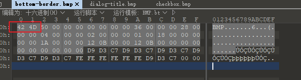
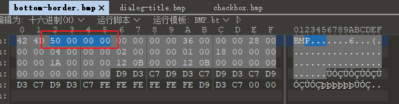
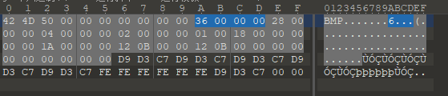

# BMP

---

## 什么是BMP

BMP（全称 Bitmap）是 Windows 操作系统中的标准图像文件格式，可以分成两类：设备有向量相关位图（DDB）和设备无向量相关位图（DIB），使用非常广。它采用位映射存储格式，除了图像深度可选以外，不采用其他任何压缩，因此，BMP 文件所占用的空间很大。BMP 文件的图像深度可选 lbit、4bit、8bit 及 24bit。BMP 文件存储数据时，图像的扫描方式是按从左到右、从下到上的顺序。由于 BMP 文件格式是 Windows 环境中交换与图有关的数据的一种标准，因此在 Windows 环境中运行的图形图像软件都支持 BMP 图像格式。

典型的 BMP 图像文件由四部分组成：

1. 位图头文件数据结构，它包含 BMP 图像文件的类型、显示内容等信息；
2. 位图信息数据结构，它包含有 BMP 图像的宽、高、压缩方法，以及定义颜色等信息；
3. 调色板，这个部分是可选的，有些位图需要调色板，有些位图，比如真彩色图（24 位的 BMP）就不需要调色板；
4. 位图数据，这部分的内容根据 BMP 位图使用的位数不同而不同，在 24 位图中直接使用 RGB，而其他的小于 24 位的使用调色板中颜色索引值。

---

## 图片结构头及宽高计算

bmp 文件头 BM

首先需要了解到的文件头和 bitmapinfoheader 字段有：

### bfType

2字节 一定为19778，其转化为十六进制为 `0x4d42`，对应的字符串为BM

### bfSize

4字节 文件大小

0x00000050=80(Byte)

### bfReserved1

2字节 一般为0

### bfReserved2

2字节 一般为0

### bfOffBits

4字节 从文件开始处到像素数据的偏移，也就是这两个结构体大小之和

36 00 00 00(0x36) 转换成十进制是 54, 从 BMP 文件的第一个字节开始，到第 54 个字节就是像素的开始。

对像素内容覆盖不会影响图片的读取,如果出现图片缺损，大概率是破坏了前面的部分。

### biSize

4字节 此结构体的大小

### biWidth

4字节 图像的宽

### biHeight

4字节 图像的高

### biPlanes

2字节 图像的帧数，一般为1

### biBitCount

2字节 一像素所占的位数，一般是24

### biCompression

4字节 一般为0

### biSizeImage

4字节 像素数据所占大小，即结构体中文件大小减去偏移(bfSize-bfOffBits)

其中存在关系为：biSizeImage=bfSize-bfOffBits =biWidth*biHeight*biBitCount/8

换句话来说就是 height=biSizeImage/biWidth/(biBitCount/8)

---

**Source & Reference**
- [misc-stegaBasic](https://www.jianshu.com/p/fe7a5fff2a95)
- [BMP位图隐写](https://payloads.online/archivers/2019-01-31/1)
