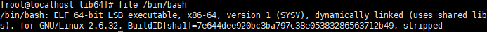
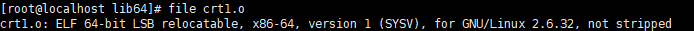
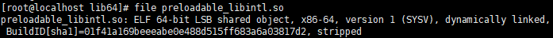
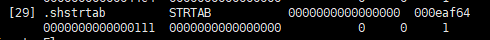

# ELF

---

在进行逆向工程的开端，我们拿到 ELF 文件，或者是 PE 文件，首先要做的就是分析文件头，了解信息，进而逆向文件。

---

## ELF文件的格式

目前流行的可执行文件格式(Executable)主要就是 Windows 下的 PE（Portable Executable）和 Linux 的 ELF（Executable Linkble Format）,都是 COFF(Common File format)的变种，更加具体的来说，是来源于当时著名的 DEC(Digital Equipment Corporation) 的 VAX/VMS 上的 COFF 文件格式。在 Linux 中目标文件就是常见的中间文件 `.o`，对应的在 Windows 中就是 `.obj` 文件。由于格式与可执行文件相近，所以基本可以看做一种类型的文件。在 Windows 下统称为 PE-COFF 文件格式，在 Linux 下，统称为 ELF 文件。

除了可执行文件，包括动态链接库(Windows 下的 `.dll`, Linux 下的 `.so`)以及静态链接库(Windows 下的 `.lib`， Linux 下的 `.a`)都是按照以上格式存储的，在 Windows 下的格式都是 PE-COFF，Linux 下则按照 ELF 格式存储。唯一不同的是 Linux 下的静态链接库(`.a` 文件)，它基本上就是把许多目标文件捆绑在一起打包，类似 tar 命令， 再加上一些索引。

ELF 文件标准大概包含了以下四种文件类型：
- 可重定位文件(Relocatable File) : 主要包含代码和数据，可以被用来链接成可执行文件或者共享目标文件，静态链接库也归类于这一类，包括 Linux 的 `.o` 文件，Windows 的 `.obj` 文件
- 可执行文件(Executable File) : 包含可以直接执行的程序，比如 Linux 下的 /bin/bash，Windows 下的 `.exe`
- 共享目标文件(Shared Object File) : 主要包含代码和数据，第一种用途可以与其它文件链接生成可重定位或者共享目标文件，再者直接链接到可执行文件，作为进程映象的一部分动态执行。常见的 Linux 下的 `.so`,Windows下的 `.dll`。
- 核心转储文件（Core Dump File）: 这个格式调试 bug 时很有用，进程意外终止时产生的，保留程序终止时进程的信息，Linux 下的 Core dump。

linux 下使用 file 命令来获取文件的格式

可执行文件
- 

重定位文件
- 

动态链接库
- 

---

## ELF文件内部结构

ELF 文件的总体结构大概是这样的：
| ELF Header                        |
|-----------------------------------|
| \.text                            |
| \.data                            |
| \.bss                             |
| \.\.\. other section              |
| Section header table              |
| String Tables, Symbol Tables,\.\. |

- ELF 文件头位于最前端，它包含了整个文件的基本属性，如文件版本，目标机器型号，程序入口等等。
- .text 为代码段，也是反汇编处理的部分，他们是以机器码的形式存储，没有反汇编的过程基本不会有人读懂这些二进制代码的。
- .data 数据段，保存的那些已经初始化了的全局静态变量和局部静态变量。
- .bss 段，存放的是未初始化的全局变量和局部静态变量，这个很容易理解，因为在未初始化的情况下，我们单独用一个段来保存，可以不在一开始就分配空间，而是在最终连接成可执行文件的时候，再在 .bss 段分配空间。
- 其他段，还有一些可选的段，比如 .rodata 表示这里存储只读数据，.debug 表示调试信息等等，具体遇到可以查看相关文档。
- 自定义段，这一块是为了实现用户特殊功能而存在的段，方便扩展，比如我们使用全局变量或者函数之前加上 attribute(section('name')) 就可以吧变量或者函数放到以 name 作为段名的段中。
- 段表，Section Header Table ，是一个重要的部分，它描述了 ELF 文件包含的所有段的信息，比如每个段的段名，段长度，在文件中的偏移，读写权限和一些段的其他属性。

以简单的 ELF 目标文件作为举例
```c
vim cal.c

#include<stdio.h>
int global_var1 = 1;
int global_var2;
void func1(int i)
{
    printf("%d\n", i);
}
int main()
{
    static int a1 = 85;
    static int a2;
    int m = 9;
    int n;
    func1(a1+global_var1+m+n);
    return 0;
}
```
```bash
gcc -c cal.c        # 产生目标文件 cal.o
```

借助于 binutils 的工具 objdump 来查看目标文件内部结构
```bash
objdump -h cal.o    # "-h"就是把ELF文件各个段的基本信息打印出来

Idx Name          Size      VMA       LMA       File off  Algn
  0 .text         00000064  00000000  00000000  00000034  2**0
                  CONTENTS, ALLOC, LOAD, RELOC, READONLY, CODE
  1 .data         00000008  00000000  00000000  00000098  2**2
                  CONTENTS, ALLOC, LOAD, DATA
  2 .bss          00000004  00000000  00000000  000000a0  2**2
                  ALLOC
  3 .rodata       00000004  00000000  00000000  000000a0  2**0
                  CONTENTS, ALLOC, LOAD, READONLY, DATA
  4 .comment      00000035  00000000  00000000  000000a4  2**0
                  CONTENTS, READONLY
  5 .note.GNU-stack 00000000  00000000  00000000  000000d9  2**0
                  CONTENTS, READONLY
  6 .eh_frame     00000064  00000000  00000000  000000dc  2**2
                  CONTENTS, ALLOC, LOAD, RELOC, READONLY, DATA
```

- 

程序源代码编译后的机器指令经常被放在代码段(Code Section)里，代码段常见的名字就是 .text 或者 .code,借助于 objdump 这个利器，我们可以进一步的分析代码段的内容，-s 可以将所有段的内容以十六进制的方式打印出来，-d 可以将所有包含的指令反汇编。

```bash
objdump -s -d cal.o # 把代码段的内容提取出来

cal.o:     file format elf64-x86-64

Contents of section .text:
 0000 5589e583 ec0883ec 08ff7508 68000000  U.........u.h...
 0010 00e8fcff ffff83c4 1090c9c3 8d4c2404  .............L$.
 0020 83e4f0ff 71fc5589 e55183ec 14c745f0  ....q.U..Q....E.
 0030 09000000 8b150400 0000a100 00000001  ................
 0040 c28b45f0 01c28b45 f401d083 ec0c50e8  ..E....E......P.
 0050 fcffffff 83c410b8 00000000 8b4dfcc9  .............M..
 0060 8d61fcc3                             .a..
Contents of section .data:
 0000 01000000 55000000                    ....U...
Contents of section .rodata:
 0000 25640a00                             %d..
Contents of section .comment:
 0000 00474343 3a202855 62756e74 7520352e  .GCC: (Ubuntu 5.
 0010 342e302d 36756275 6e747531 7e31362e  4.0-6ubuntu1~16.
 0020 30342e32 2920352e 342e3020 32303136  04.2) 5.4.0 2016
 0030 30363039 00                          0609.
Contents of section .eh_frame:
 0000 14000000 00000000 017a5200 017c0801  .........zR..|..
 0010 1b0c0404 88010000 1c000000 1c000000  ................
 0020 00000000 1c000000 00410e08 8502420d  .........A....B.
 0030 0558c50c 04040000 28000000 3c000000  .X......(...<...
 0040 1c000000 48000000 00440c01 00471005  ....H....D...G..
 0050 02750043 0f03757c 06750c01 0041c543  .u.C..u|.u...A.C
 0060 0c040400                             ....

Disassembly of section .text:

00000000 <func1>:
   0:   55                      push   %ebp
   1:   89 e5                   mov    %esp,%ebp
   3:   83 ec 08                sub    $0x8,%esp
   6:   83 ec 08                sub    $0x8,%esp
   9:   ff 75 08                pushl  0x8(%ebp)
   c:   68 00 00 00 00          push   $0x0
  11:   e8 fc ff ff ff          call   12 <func1+0x12>
  16:   83 c4 10                add    $0x10,%esp
  19:   90                      nop
  1a:   c9                      leave
  1b:   c3                      ret

0000001c <main>:
  1c:   8d 4c 24 04             lea    0x4(%esp),%ecx
  20:   83 e4 f0                and    $0xfffffff0,%esp
  23:   ff 71 fc                pushl  -0x4(%ecx)
  26:   55                      push   %ebp
  27:   89 e5                   mov    %esp,%ebp
  29:   51                      push   %ecx
  2a:   83 ec 14                sub    $0x14,%esp
  2d:   c7 45 f0 09 00 00 00    movl   $0x9,-0x10(%ebp)
  34:   8b 15 04 00 00 00       mov    0x4,%edx
  3a:   a1 00 00 00 00          mov    0x0,%eax
  3f:   01 c2                   add    %eax,%edx
  41:   8b 45 f0                mov    -0x10(%ebp),%eax
  44:   01 c2                   add    %eax,%edx
  46:   8b 45 f4                mov    -0xc(%ebp),%eax
  49:   01 d0                   add    %edx,%eax
  4b:   83 ec 0c                sub    $0xc,%esp
  4e:   50                      push   %eax
  4f:   e8 fc ff ff ff          call   50 <main+0x34>
  54:   83 c4 10                add    $0x10,%esp
  57:   b8 00 00 00 00          mov    $0x0,%eax
  5c:   8b 4d fc                mov    -0x4(%ebp),%ecx
  5f:   c9                      leave
  60:   8d 61 fc                lea    -0x4(%ecx),%esp
  63:   c3                      ret
```

### 代码段( .text)

看开头一段 Contents of section .text 就是一十六进制打印出来的内容，最左列是偏移量， 看 0060 那行，只剩下 8d61fcc3，所以与对照上面一张图，.text 段的 size 是 0x64 字节。最右列是 .text 段的 ASCII 码格式，对照下面的反汇编结果，我们可以看到 cal.c 中的两个函数 func1() 和 main() 的指令。.text 的第一个字节 0x55 就是 func1() 函数的第一条 push %ebp 指令，最后一个 0xc3 是 main() 的最后一个指令 ret

### 数据段和只读数据段(.data & .rodata)

.data 段保存的是那些已经初始化的全局静态变量和局部静态变量。代码中的 global_var1 和 a1 都是这样的变量，每个变量4字节，所以. data 段的大小为8个字节。

cal.c 在调用 printf 时，内部包含一个字符串常量"%d\n"用来定义格式化输出，它是一种只读数据，所以保存在 .rodata 段，我们可以看图中 .rodata 段大小为4字节，内容为 25640a00,翻译回来就是"%d\n"

.rodata 段存放的是只读数据，一般程序里面存在只读变量和字符串常量这两种只读类型，单独设置 .rodata 段有很多好处，支持了 C 里面的关键字 const, 而且操作系统加载程序时自动将只读变量加载到只读存储区，或者映射成只读，这样任何修改操作都会被认为非法操作，保证了程序的安全性。

### BSS段(.bss)

.bss 段存放的是未初始化的全局变量和局部静态变量。上面代码中的 global_var2 和 a2 就被存放在 .bss 段。其实只能说 .bss 段为他们预留了空间，实际上该段大小只有4个字节，而这两个变量应该占用8个字节。

其实我们可以通过符号表看到，只有 a2 被放到了 .bss 段，global_var2 却没有放到任何段，只是一个未定义的“COMMON”符号。其实这与不同的语言和不同的编译器实现有关，有的编译器不把未定义的全局变量放到 .bss 段，只是保留一个符号，直到链接成可执行文件时才在 .bss 段分配空间。

有个小例子：
```c
static int x1 = 0;
static int x2 = 1;
```

x1和x2会被放在什么段呢？

答案是 x1 被放在 .bss 段 ，而 x2 被放在 .data 段。原因在于 x1 被初始化为 0，相当于没有被初始化，未初始化的都是 0，所以这里编译器会把 x1 优化掉，放在 .bss 段，因为 .bss 不占磁盘空间。x2 正常的初始化，所以被放到 .data 段。

### 其它段

除了以上各段，ELF 文件也包含其它段。下表列举了一些常见的段。

| 常用的段名 	    | 说明 |
| - | - |
| .rodata1 	        | Read Only Data,这种段里存放的是只读数据，比如字符串常量，全局 const 变量，和".rodata"一样 |
| .comment 	        | 存放的是编译器版本信息，比如字符串："GCC:(GUN)4.2.0" |
| .debug 	        | 调试信息 |
| .dynamic 	        | 动态链接信息 |
| .hash 	        | 符号哈希表 |
| .line 	        | 调试时的行号表，即源代码行号和编译后指令的对应表 |
| .note 	        | 额外的编译器信息。比如程序的公司名，发布版本号 |
| .strtab 	        | String Table 字符串表，用于存储 ELF 文件中用到的各种字符串 |
| .symtab 	        | Symbol Table 符号表 |
| .shstrtab 	    | Section String Table 段名表 |
| ,plt .got 	    | 动态链接的跳转表和全局入口表 |
| .init .finit 	    | 程序初始化与终结代码段 |

这些段的名字都是“.”作为前缀，一般系统定义的都是"."开头，如果自己定义的段名则不要以"."开头，容易与系统保留的产生冲突，如果你打开目标文件的段名还有其它一些格式，也许都是以前系统曾经用过的，历史遗留问题。

我们也可以自定义段，GCC提供一个扩展机制可以让我们指定变量所处的段：
```c
__attribute__((section("FOO"))) int global = 42;
__attribute__((section("BAR"))) void foo()
```
在全局变量或者函数前加上 attribute((section("name"))) 属性就可以把相应的变量和函数放到以“name”作为段名的段中。

---

## ELF文件头

位于所有段前面的就是文件头。我们可以使用 readelf 命令来查看
```
readelf -h cal.o

ELF Header:
  Magic:   7f 45 4c 46 01 01 01 00 00 00 00 00 00 00 00 00
  Class:                             ELF64
  Data:                              2's complement, little endian
  Version:                           1 (current)
  OS/ABI:                            UNIX - System V
  ABI Version:                       0
  Type:                              REL (Relocatable file)
  Machine:                           Advanced Micro Devices X86-64
  Version:                           0x1
  Entry point address:               0x0
  Start of program headers:          0 (bytes into file)
  Start of section headers:          1032 (bytes into file)
  Flags:                             0x0
  Size of this header:               64 (bytes)
  Size of program headers:           0 (bytes)
  Number of program headers:         0
  Size of section headers:           64 (bytes)
  Number of section headers:         13
  Section header string table index: 12
```
从上面的输出结果可以看到，ELF的文件头中定义了 ELF 魔数，文件数据存储方式，版本，运行平台，ABI 版本，系统架构，硬件平台，入口地址，程序头入口和长度，段表的位置和长度，段的数量等等。

ELF 文件头结构和相关常数一般被定义在 "/usr/include/elf.h" 里，分为 32 位和 64 位版本。我们测试的机器是 32 位的，包含 "Elf32_Ehdr" 的数据结构来描述上述输出的 ELF 头。
```h
typedef struct
{
  unsigned char e_ident[EI_NIDENT];     /* Magic number and other info */
  Elf32_Half    e_type;                 /* Object file type */
  Elf32_Half    e_machine;              /* Architecture */
  Elf32_Word    e_version;              /* Object file version */
  Elf32_Addr    e_entry;                /* Entry point virtual address */
  Elf32_Off     e_phoff;                /* Program header table file offset */
  Elf32_Off     e_shoff;                /* Section header table file offset */
  Elf32_Word    e_flags;                /* Processor-specific flags */
  Elf32_Half    e_ehsize;               /* ELF header size in bytes */
  Elf32_Half    e_phentsize;            /* Program header table entry size */
  Elf32_Half    e_phnum;                /* Program header table entry count */
  Elf32_Half    e_shentsize;            /* Section header table entry size */
  Elf32_Half    e_shnum;                /* Section header table entry count */
  Elf32_Half    e_shstrndx;             /* Section header string table index */
} Elf32_Ehdr;
```

除了第一个，其他都是一一对应的, e_ident 这个成员数组对应了 Magic number, Class, Data, Version, OS/ABI, ABI version 这几个参数，剩下的都一一对应。

**ELF Magic**

从上面的 readelf 的输出可以看到，Magic 有16个字节，对应着 Elf32_Ehdr 的 e_ident 这个成员。这个属性被用来标识 ELF 文件的平台属性。
```
Magic： 7f 45 4c 46 01 01 01 00 00 00 00 00 00 00 00 00
```

最开始的 4 个字节： 所有 ELF 文件共有的标识码,"0x7F"、"0x45"、"0x4c"、"0x46",其中，"0x7F"对应 ASCII 中的 DEL 控制符，后面三个是 ELF 三个字母的 ASCII 码。这 4 个字节又被称为 ELF 文件的魔数。

基本所有可执行文件开始的几个字节都是魔数：
- a.out: 0x01、0x07
- PE/COFF: 0x4d,0x5a
这些魔数被操作系统用来确认可执行文件的类型，如果不对就拒绝加载。

- 第 5 个字节： 表示 ELF 的文件类，0x01 代表是 32 位的，如果是 0x02 则表示 64 位，
- 第 6 个字节： 规定字节序，规定该 ELF 是大端还是小端的
- 第 7 个字节： 规定 ELF 文件的主版本号，一般都是 1，因为没有更新过了。
- 后面的 9 个字节：都填充为 0， 一般没意义，有的平台用来做扩展标识。

**类型**

e_type 成员用来表示 ELF 文件类型，系统通过这个值来判断文件类型，而不是扩展名。

| 常量 	    | 值 	  | 含义 |
| - | - | - |
| ET_REL 	  | 1 	  | 可重定位文件，一般是 `.o` 文件 |
| ET_EXEC 	| 2 	  | 可执行文件 |
| ET_DYN 	  | 3 	  | 共享目标文件，一般为 `.so` |

**机器类型**

ELF 文件格式被设计成在多平台下使用，和 java 不同，ELF 文件不能一次编译处处使用，而是说不同平台下的 ELF 文件都遵循一套 ELF 标准。用 e_machine 成员表示平台属性。

| 常量 	    | 值 	| 含义 |
| - | - | - |
| EM_M32 	  | 1 	| AT&T WE32100 |
| EM_SPARK 	| 2 	| SPARC |
| EM_386 	  | 3 	| Intel x86 |
| EM_68K 	  | 4 	| Motorola 68000 |
| EM_88K 	  | 5 	| Motorala 88000 |
| EM_860 	  | 6 	| Intel 80860 |

**段表**

另一个重要的东西是段表(Section Header Table) ,保存了各种各样段的基本属性，比如段名，段长度，文件中的偏移，读写权限，段的其他属性。而段表自己在 ELF 文件中的位置是在 ELF 头文件 e_shoff 决定的。

我们可以使用一些命令来查看 ELF 文件中包含哪些段，以 bash 这个可执行为例，其实除了我们之前说的那些基本结构，他包含很多其他的结构：
```bash
readelf -S /bin/bash

objdump -h /bin/bash
```

下面看一下结构，还是到 elf.h 中去查看，他的结构体名字叫 Elf32_Shdr，64位对应 Elf64_Shdr,结构如下：
```h
typedef struct
{
  unsigned char e_ident[EI_NIDENT];     /* Magic number and other info */
  Elf32_Half    e_type;                 /* Object file type */
  Elf32_Half    e_machine;              /* Architecture */
  Elf32_Word    e_version;              /* Object file version */
  Elf32_Addr    e_entry;                /* Entry point virtual address */
  Elf32_Off     e_phoff;                /* Program header table file offset */
  Elf32_Off     e_shoff;                /* Section header table file offset */
  Elf32_Word    e_flags;                /* Processor-specific flags */
  Elf32_Half    e_ehsize;               /* ELF header size in bytes */
  Elf32_Half    e_phentsize;            /* Program header table entry size */
  Elf32_Half    e_phnum;                /* Program header table entry count */
  Elf32_Half    e_shentsize;            /* Section header table entry size */
  Elf32_Half    e_shnum;                /* Section header table entry count */
  Elf32_Half    e_shstrndx;             /* Section header string table index */
} Elf32_Ehdr;

typedef struct
{
  unsigned char e_ident[EI_NIDENT];     /* Magic number and other info */
  Elf64_Half    e_type;                 /* Object file type */
  Elf64_Half    e_machine;              /* Architecture */
  Elf64_Word    e_version;              /* Object file version */
  Elf64_Addr    e_entry;                /* Entry point virtual address */
  Elf64_Off     e_phoff;                /* Program header table file offset */
  Elf64_Off     e_shoff;                /* Section header table file offset */
  Elf64_Word    e_flags;                /* Processor-specific flags */
  Elf64_Half    e_ehsize;               /* ELF header size in bytes */
  Elf64_Half    e_phentsize;            /* Program header table entry size */
  Elf64_Half    e_phnum;                /* Program header table entry count */
  Elf64_Half    e_shentsize;            /* Section header table entry size */
  Elf64_Half    e_shnum;                /* Section header table entry count */
  Elf64_Half    e_shstrndx;             /* Section header string table index */
} Elf64_Ehdr;
```

以上结构中，分别对应于：
- 段名
- 段类型
- 段标志位
- 段虚拟地址
- 段偏移
- 段长度
- 段链接
- 段对齐
- 项，一些大小固定的项，如符号表等。

这些项目，在使用 readelf -S 指令时一一对应。

另外还有一个重要的表，叫重定位表，一般段名叫 .rel.text， 在上边没有出现，链接器在处理目标文件时，需要对目标文件中的某些部位进行重定位，就是代码段和数据段中那些对绝对地址引用的位置，这个时候就需要使用重定位表了。

### 字符串表

为什么会有字符串表呢？其实这个也是在不断发展改进中找到的解决办法，在 ELF 文件中，会用到很多的字符串，段名，变量名等等，但是字符串其本身又长度不固定，如果使用固定结构来表示，就会带来空间上的麻烦。所以，构造一个字符串表，将使用的字符串统一放在那里，然后通过偏移量来引用字符串，岂不美哉。

需要使用的时候，只需要给一个偏移量，然后就到字符串该位置找字符串，遇到 \0 就停止。

字符串在 ELF 文件中，也是以段的形式保存的，常见的段名 .strtab， .shstrtab 两个字符串分别为字符串表和段表字符串，前者用来保存普通的字符串，后者保存段名。

在我们使用 readelf -h 的时候，我们看到最后一个成员，section header string table index ，实际上他指的就是字符串表的下标，bash 对应的字符串表下标为 29，在使用 objdump 的时候，实际上忽略了字符串表，我们使用 readelf ，就可以看到第 29 位即字符串表：



下面我们回顾一下，这个 ELF 构造的精妙之处，当一个 ELF 文件到来的时候，系统自然的找到他的开头，拿到文件头，首先看魔数，识别基本信息，看是不是正确的，或者是可识别的文件，然后加载他的基本信息，包括 CPU 平台，版本号，段表的位置在哪，还可以拿到字符串表在哪，以及整个程序的入口地址。这一系列初始化信息拿到之后，程序可以通过字符串表定位，找到段名的字符串，通过段表的初始位置，确认每个段的位置，段名，长度等等信息，进而到达入口地址，准备执行。

当然，这只是最初始的内容，其后还要考虑链接，Import,Export 等等内容，留待以后完善。

---

## Source & Reference

- [深入理解ELF（一）](https://www.jianshu.com/p/1a65293d722e)
- [ELF&PE 文件结构分析](https://www.jianshu.com/p/af9766222816)
