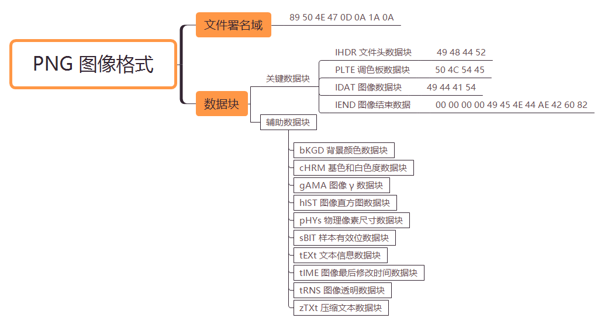

# PNG

<p align="center">
    </a>
</p>


> 注 : 笔记中拓扑图 xmind 源文件在其图片目录下

---

# 什么是PNG

PNG 是20世纪90年代中期开始开发的图像文件存储格式，其目的是替代 GIF 和 TIFF 文件格式，同时增加一些 GIF 文件格式所不具备的特性。流式网络图形格式(Portable Network Graphic Format，PNG)名称来源于非官方的“PNG's Not GIF”，是一种位图文件(bitmap file)存储格式，读成“ping”。PNG 用来存储灰度图像时，灰度图像的深度可多到16位，存储彩色图像时，彩色图像的深度可多到48位，并且还可存储多到16位的 α 通道数据。PNG 使用从 LZ77 派生的无损数据压缩算法。

---

# 文件结构

PNG 图像格式文件由文件署名和数据块(chunk)组成。

<p align="center">
    </a>
</p>

## 文件署名域

8 字节的 PNG 文件署名域用来识别该文件是不是 PNG 文件。该域的值是：

| 十进制数 	| 十六进制数 |
| - | - |
| 137 	    | 89 |
| 80 	    | 50 |
| 78 	    | 4e |
| 71 	    | 47 |
| 13 	    | 0d |
| 10 	    | 0a |
| 26 	    | 1a |
| 10 	    | 0a |

其中第一个字节 0x89 超出了 ASCII 字符的范围，这是为了避免某些软件将 PNG 文件当做文本文件来处理。文件中剩余的部分由3个以上的 PNG 的数据块（Chunk）按照特定的顺序组成，因此，一个标准的 PNG 文件结构应该如下：
```
PNG 文件标志|PNG 数据块|……|PNG 数据块
```

## 数据块

这里有两种类型的数据块，一种是称为关键数据块(critical chunk)，就是必须要有的块；另一种叫做辅助数据块(ancillary chunks)，这是可选的数据块。

每个数据块都由下表所示的的4个域组成。

| 名称 	    | 字节数 	| 说明 |
| -      | -        | - |
| Length(长度) 	                | 4字节 	| 指定数据块中数据域的长度，其长度不超过$(2^{31}-1)$字节 |
| Chunk Type Code(数据块类型码) 	| 4字节 	| 数据块类型码由 ASCII 字母(A-Z和a-z)组成 |
| Chunk Data(数据块实际内容) 	| 可变长度 	    | 存储按照 Chunk Type Code 指定的数据 |
| CRC(循环冗余检测)          	| 4字节 	    | 存储用来检测是否有错误的循环冗余码 |

其中 CRC(cyclic redundancy check)域中的值是对 Chunk Type Code 域和 Chunk Data 域中的数据进行计算得到的，可以看做一种校验码。

### 关键数据块

关键数据块中的4个标准数据块是：

**IHDR 文件头数据块(header chunk)**

它包含有 PNG 文件中存储的图像数据的基本信息，并要作为第一个数据块出现在 PNG 数据流中，而且一个 PNG 数据流中只能有一个文件头数据块。

文件头数据块由13字节，组成结构如下：

| 域的名称               | 字节数     | 说明 |
| -                     | -         | -     |
| Width 	            | 4 bytes 	| 图像宽度，以像素为单位 |
| Height 	            | 4 bytes 	| 图像高度，以像素为单位 |
| Bit depth 	        | 1 byte 	| 图像深度：索引彩色图像：1，2，4或8 ;灰度图像：1，2，4，8或16 ;真彩色图像：8或16 |
| ColorType 	        | 1 byte 	| 颜色类型：0：灰度图像, 1，2，4，8或16;2：真彩色图像，8或16;3：索引彩色图像，1，2，4或84：带α通道数据的灰度图像，8或16;6：带α通道数据的真彩色图像，8或16 |
| Compression method 	| 1 byte 	| 压缩方法(LZ77 派生算法) |
| Filter method 	    | 1 byte 	| 滤波器方法 |
| Interlace method 	    | 1 byte 	| 隔行扫描方法：0：非隔行扫描;1： Adam7(由Adam M. Costello开发的7遍隔行扫描方法) |

**PLTE 调色板数据块(palette chunk)**

它包含有与索引彩色图像((indexed-color image))相关的彩色变换数据，它仅与索引彩色图像有关，而且要放在图像数据块(image data chunk)之前。真彩色的 PNG 数据流也可以有调色板数据块，目的是便于非真彩色显示程序用它来量化图像数据，从而显示该图像。结构如下：

| 颜色 	    | 字节 	    | 意义               |
| -         | -         | -                 |
| Red 	    | 1 byte 	| 0 = 黑色, 255 = 红 |
| Green 	| 1 byte 	| 0 = 黑色, 255 = 绿色 |
| Blue 	    | 1 byte 	| 0 = 黑色, 255 = 蓝色 |

PLTE 数据块是定义图像的调色板信息，PLTE 可以包含 1~256 个调色板信息，每一个调色板信息由3个字节组成，因此调色板数据块所包含的最大字节数为 768，调色板的长度应该是 3 的倍数，否则，这将是一个非法的调色板。

对于索引图像，调色板信息是必须的，调色板的颜色索引从 0 开始编号，然后是 1、2……，调色板的颜色数不能超过色深中规定的颜色数（如图像色深为 4 的时候，调色板中的颜色数不可以超过 2^4=16），否则，这将导致 PNG 图像不合法。

真彩色图像和带 α 通道数据的真彩色图像也可以有调色板数据块，目的是便于非真彩色显示程序用它来量化图像数据，从而显示该图像。

**IDAT 图像数据块(image data chunk)**

它存储实际的数据，在数据流中可包含多个连续顺序的图像数据块。

IDAT 存放着图像真正的数据信息，因此，如果能够了解 IDAT 的结构，我们就可以很方便的生成 PNG 图像。

**IEND 图像结束数据(image trailer chunk)**

它用来标记 PNG 文件或者数据流已经结束，并且必须要放在文件的尾部。

如果我们仔细观察 PNG 文件，我们会发现，文件的结尾12个字符看起来总应该是这样的：
```
00 00 00 00 49 45 4E 44 AE 42 60 82
```
不难明白，由于数据块结构的定义，IEND 数据块的长度总是0（00 00 00 00，除非人为加入信息），数据标识总是 IEND（49 45 4E 44），因此，CRC 码也总是 AE 42 60 82。

最后，除了表示数据块开始的 IHDR 必须放在最前面， 表示 PNG 文件结束的 IEND 数据块放在最后面之外，其他数据块的存放顺序没有限制。

### 辅助数据块

PNG 文件格式规范制定的10个辅助数据块是：
1. bKGD 背景颜色数据块(background color)。
2. cHRM 基色和白色度数据块(primary chromaticities and white point)。所谓白色度是指当 R＝G＝B＝ 最大值时在显示器上产生的白色度。
3. gAMA 图像 γ 数据块(image gamma)。
4. hIST 图像直方图数据块(image histogram)。
5. pHYs 物理像素尺寸数据块(physical pixel dimensions)。
6. sBIT 样本有效位数据块(significant bits)。
7. tEXt 文本信息数据块(textual data)。
8. tIME 图像最后修改时间数据块(image last-modification time)。
9. tRNS 图像透明数据块(transparency)。
10. zTXt 压缩文本数据块(compressed textual data)。

### 数据块摘要

关键数据块、辅助数据块和专用公共数据块(special-purpose public chunks)综合下表中：

| 数据块符号 | 	数据块名称 	         | 多数据块    | 可选否 	| 位置限制 |
| -      | -                     | -            | -         | -      |
| IHDR 	| 文件头数据块 	            | 否 	    | 否 	| 第一块 |
| cHRM 	| 基色和白色点数据块 	     | 否 	    | 是     | 在 PLTE 和 IDAT 之前 |
| gAMA 	| 图像 γ 数据块 	            | 否 	   | 是 	| 在 PLTE 和 IDAT 之前 |
| sBIT 	| 样本有效位数据块 	         | 否 	    | 是 	| 在 PLTE 和 IDAT 之前 |
| PLTE 	| 调色板数据块 	            | 否 	   | 是 	| 在 IDAT 之前 |
| bKGD 	| 背景颜色数据块 	        | 否 	   | 是 	| 在 PLTE 之后 IDAT 之前 |
| hIST 	| 图像直方图数据块 	        | 否 	   | 是 	| 在 PLTE 之后 IDAT 之前 |
| tRNS 	| 图像透明数据块 	        | 否 	   | 是 	| 在 PLTE 之后 IDAT 之前 |
| oFFs 	| (专用公共数据块) 	        | 否 	   | 是 	| 在 IDAT 之前 |
| pHYs 	| 物理像素尺寸数据块 	     | 否 	   | 是 	 | 在 IDAT 之前 |
| sCAL 	| (专用公共数据块) 	        | 否 	   | 是  	 | 在 IDAT 之前 |
| IDAT 	| 图像数据块 	            | 是 	   | 否 	| 与其他 IDAT 连续 |
| tIME 	| 图像最后修改时间数据块 	 | 否 	    | 是 	  | 无限制 |
| tEXt 	| 文本信息数据块 	        | 是 	   | 是 	| 无限制 |
| zTXt 	| 压缩文本数据块 	        | 是 	   | 是 	| 无限制 |
| fRAc 	| (专用公共数据块) 	        | 是 	   | 是 	| 无限制 |
| gIFg 	| (专用公共数据块) 	        | 是 	   | 是 	| 无限制 |
| gIFt 	| (专用公共数据块) 	        | 是 	   | 是 	| 无限制 |
| gIFx 	| (专用公共数据块) 	        | 是 	   | 是 	| 无限制 |
| IEND 	| 图像结束数据 	            | 否 	   | 否 	| 最后一个数据块 |

tEXt 和 zTXt 数据块中的标准关键字：

| 关键字 	    | 说明 |
| -             | -  |
| Title 	    | 图像名称或者标题 |
| Author 	    | 图像作者名 |
| Description 	| 图像说明 |
| Copyright 	| 版权声明 |
| CreationTime 	| 原图创作时间 |
| Software 	    | 创作图像使用的软件 |
| Disclaimer 	| 弃权 |
| Warning 	    | 图像内容警告 |
| Source 	    | 创作图像使用的设备 |
| Comment 	    | 各种注释 |

---

# 案例分析

```
89 50 4E 47 0D 0A 1A 0A 00 00 00 0D 49 48 44 52
00 00 00 20 00 00 00 20 08 06 00 00 00 73 7A 7A
F4 00 00 00 09 70 48 59 73 00 00 0B 13 00 00 0B
13 01 00 9A 9C 18 00 00 03 90 49 44 41 54 58 85
AD 97 4D 68 5C 55 1C C5 7F E7 CD 4C B2 99 85 1F
90 79 D3 22 B1 55 C4 1A 48 41 37 2E 5A 50 44 41
6D 75 A3 B1 62 9B 30 49 EB B4 50 54 C4 42 71 15
50 71 A9 14 8C 84 9A 4C 32 9A 56 B2 51 71 E1 C2
82 5A 11 AB 10 5A 5A 3F 5A 3F 21 36 99 99 34 69
AC 4E AC 64 3E FE 2E 32 1D 92 71 66 DE 7B 93 9E
E5 BD E7 9E 73 DE BD F7 DD FF BD 22 00 62 47 6D
13 61 76 38 46 B7 81 0B C4 2B 5D 39 20 8B 98 B2
22 9F E4 F6 E9 77 BF 9A F2 64 0C 5B C4 0D F3 2C
E2 00 D0 E5 53 F7 BC E0 CD 9B A2 A4 BE EF D1 72
CB 01 DC 94 3D 89 F1 3A 70 9B 4F E3 5A 5C 94 71
38 33 A0 89 60 01 86 2D 12 0B F3 96 C4 BE 16 8D
6B 31 1A 8E 72 F0 62 8F AE D6 76 84 6B 1B 36 8E
DB CD A5 12 1F 00 DB 03 18 FC 0D 9C 41 9C C5 58
90 B8 52 36 FE 92 D1 2E 71 83 C1 8D 85 25 1E 07
DE AF 1D B8 66 06 BA 26 AD 6D 21 CF 09 9F E6 7F
48 4C 94 1C 8E CF F5 72 0E C9 02 04 AE 62 CD 0C
5C 5E 62 C8 87 F9 A2 E0 70 66 9A 77 18 54 19 80
BE 56 AC 57 50 9D 81 58 CA 76 C9 38 EE C1 FF D2
C2 3C 91 EB D5 5C EB 96 F5 02 0C 5B C4 8D 70 1E
D8 DC 84 FB 85 53 E0 91 D9 A4 FE B9 5E E6 50 59
02 37 42 B2 99 B9 C1 9F 65 B1 2B 7B 9D CD AB 01
80 FD 4D 59 62 F0 52 42 59 4F B5 41 0B BB 9D 6C
C3 E8 C4 E8 30 B1 A8 32 99 50 84 53 33 7D 5A A8
2B 1D 3B 6A 9B 14 E2 B7 26 B2 45 A7 40 7C 36 A9
F9 66 DE F1 94 ED 31 E3 15 A0 B3 4E 77 09 F8 5A
30 9C 99 E6 58 75 F3 02 0E 61 76 78 7C D7 94 97
79 6C CC 1E 30 23 DD C0 1C 20 04 6C 33 78 D7 BD
85 D3 EE 88 DD 5F 0D E0 C0 56 8F 00 D3 1E FD 50
A6 C7 93 73 0D A2 1B 71 22 3E 62 AF 31 69 A1 B0
59 B5 A2 35 E0 73 C5 53 D3 28 FA 28 6B AB E1 98
78 39 96 67 8B 63 B0 A1 19 D3 A0 C3 53 CE 18 07
0A 81 22 00 82 AD 8E 0F F1 5B BD 28 D9 BD FA B6
2C 1E 65 A5 26 04 C1 55 47 90 69 4A 11 DD 6E CA
3C 43 CC 25 F4 69 A9 CC DD 26 26 80 B2 17 BF 82
9C 23 31 EB 49 33 12 7E D4 2E ED D5 2F B9 84 76
3B C6 5D 82 23 C0 E5 66 7C 41 CE 29 1B 67 7D 68
1F EA 18 33 DF 97 92 D9 01 5D C8 F4 EB F9 68 9E
0D 26 9E 36 E3 AB 7A 3C 33 A6 14 1B B5 CD 82 5F
7D E8 7E 53 34 1E 9C 1F 50 D0 75 06 20 3E 66 F7
58 99 E7 80 A7 80 F6 4A 73 97 00 DC 51 FB 01 D8
E2 27 44 5B 3B 0F 4F 3F A3 C5 56 42 00 C4 D2 D6
A1 02 49 C4 43 D9 7E 6D 17 40 7C C4 5E 30 F1 86
4F 8D AC E0 50 A6 5F EF B5 1A 62 35 04 70 FB 11
6B CF 47 B9 40 E3 A3 B4 DE C8 93 06 07 73 09 9D
5B 77 00 A8 16 93 74 C0 F1 45 E0 43 8C A1 EC 80
3E 5B 57 00 00 77 C4 D2 88 3D AD 08 01 3F 9A 78
7B 79 99 F4 62 52 9E C7 77 DD 00 95 A5 F8 1C B8
B7 C5 10 00 4B 66 1C 0B 3B 0C CD 24 74 26 50 00
A8 EC D2 22 1F AD 33 C4 35 7C 1C 0A F1 D2 4C 9F
7E 6A 44 F8 5F 2D C8 F5 6A 2E 9A E7 3E 08 BC 1F
EA 61 67 A9 C4 77 B1 94 ED 6C 44 68 5A 44 E3 A3
B6 DB E0 55 82 FC 1D 6B 31 27 E3 C5 E0 4F B3 55
E8 9A B4 B6 F9 25 0E C8 D8 0F DC E9 C7 55 F0 33
C6 D0 BF 45 52 5E 1B 32 D0 35 62 E3 B8 DD 51 2A
F1 18 46 B7 84 6B 2B CF 73 07 31 8F 91 91 71 4A
E2 E4 6C 82 D3 7E 5F 4A FF 01 C4 04 41 C2 95 92
B2 12 00 00 00 00 49 45 4E 44 AE 42 60 82
```

1. 文件署名域 八个字节的文件头标志，标识着 png 文件
    ```
    89 50 4E 47 0D 0A 1A 0A
    ```

2. IHDR 数据块
    ```
    00 00 00 0D     说明 IHDR 头块长为13
    49 48 44 52     IHDR 标识（ascii 码为 IHDR）
    00 00 00 20     图像的宽，32 像素
    00 00 00 20     图像的高，32 像素
    08              表示色深，这里是 2^8=256，即这是一个 256 色的图像
    06              颜色类型，查表可知这是带 α 通道数据的真彩色图像
    00              PNG Spec 规定此处总为 0（非 0 值为将来使用更好的压缩方法预留），表示使压缩方法(LZ77 派生算法)
    00              同上
    00              非隔行扫描
    73 7A 7A F4      CRC 校验
    ```

3. IDAT 数据块
    ```
    49 44 41 54
    ```

4. IEND 数据块
    ```
    00 00 00 00 49 45 4E 44 AE 42 60 82
    ```

---

**Source & Reference**
- [PNG图片结构分析](https://lzx.dropsec.xyz/2017/03/16/PNG%E5%9B%BE%E7%89%87%E7%BB%93%E6%9E%84%E5%88%86%E6%9E%90/)
- [PNG文件格式详解](https://blog.mythsman.com/post/5d2d62b4a2005d74040ef7eb/)
