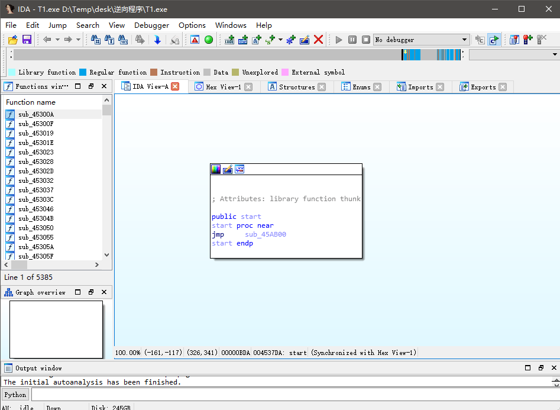
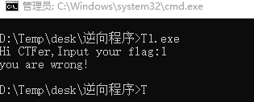
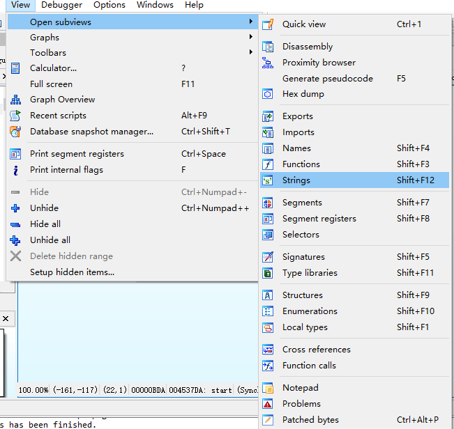
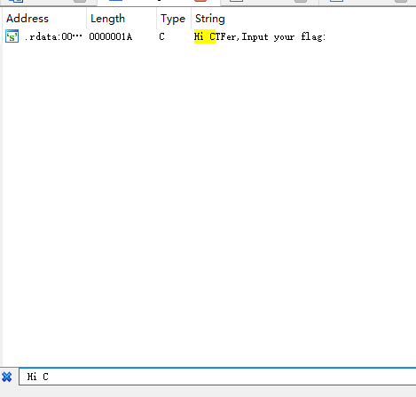
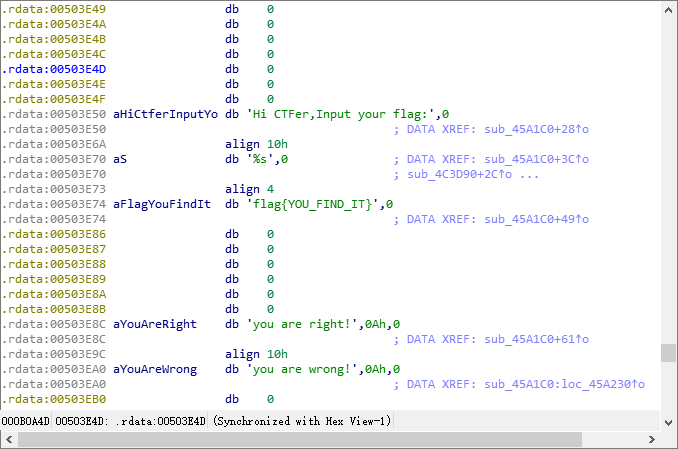
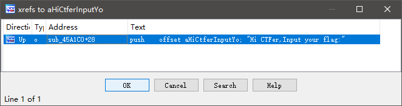
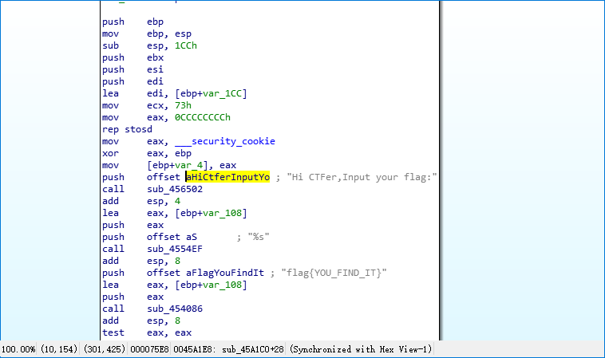
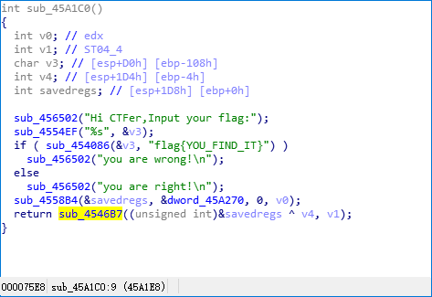
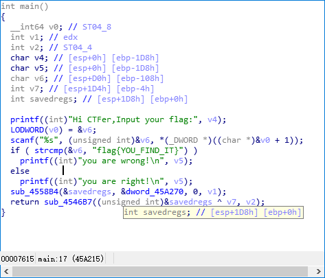
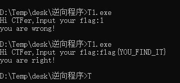

# 1-基本分析

---

目标 T1.exe

使用 IDA 打开



**找 main 函数**

先运行一下该程序



可以发现该程序要求输入一个字符串，输入1直接退出。说明该题要求找到正确的输入使程序运行结果不为"you are wrong!"

C语言的入口函数是 main 函数，main 符号名在编译阶段已经删除，如何在该程序的 5385 个函数中找到 main 函数呢？这时候就需要用到【代码定位】技巧中的【字符串定位】。

通过运行 T1.exe 程序，我们已知该程序会输出
```
Hi CTFer,Input your flag:
you are wrong!
```
等字符串，我们可以搜索这些字符串，来找到引用这些字符串的代码。

菜单 View -> Open SubViews -> Strings,ctrl+f, 输入 Hi CTFer，双击跳转到相应位置





单击 aHiCtferInputYo 标识符名字，按 X 找到引用 aHiCtferInputYo 标识符的代码，跳转到目标







直接跳转过去后是汇编代码，按 tab 将这段代码转换成伪代码



根据伪代码逻辑分析
- sub_45A1C0 是 main
- sub_456502 是 printf 或 puts
- sub_4554EF 是 scanf
- sub_454086 是 strcmp

还原结果类似如下:



如果输入与 flag{YOU_FIND_IT} 相等，则 strcmp 返回 0，否则返回非0。

strcmp 返回 0 则执行 printf("you are right!\n");



---

**Source & Reference**
- [萌新学逆向——T1 IDA的正确开启姿势](https://mp.weixin.qq.com/s/I9vJp8fp7RcCls0tz8Dvlg)
