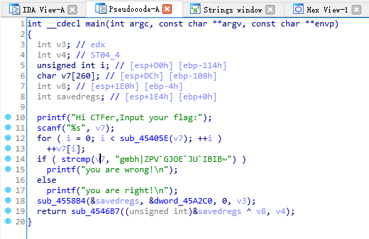
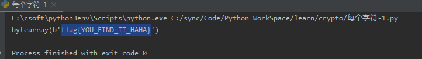
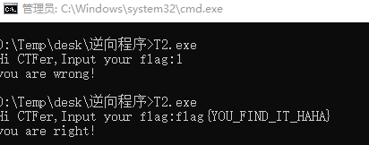

# 2-逆运算

---

目标 T2.exe

使用 IDA 打开,找 main 函数,并做基本的分析，重命名函数



根据提示,这里的 sub_45405E 可能是 strlen 函数


分析伪代码,输入值赋给 v7变量，然后经过转换，在与下列字符串进行比较
```
gmbh|ZPV`GJOE`JU`IBIB~
```

转换的代码是
```c
for ( i = 0; i < strlen(v7); ++i )
    ++v7[i];
```

意思就是每一个字符 + 1, 那么将比较字符串每一个字符 - 1 即可得到 flag

编写相应 python 脚本
```python
string=bytearray(b"gmbh|ZPV`GJOE`JU`IBIB~")
for i in range(len(string)):
    string[i]-=1;
print(string)
```





---

**Source & Reference**
- [萌新学逆向——T2 逆运算的奥秘](https://mp.weixin.qq.com/s/e3ie6_DLZEE8i_RT_5mPRQ)
