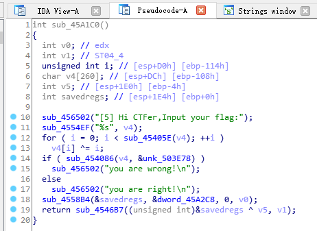
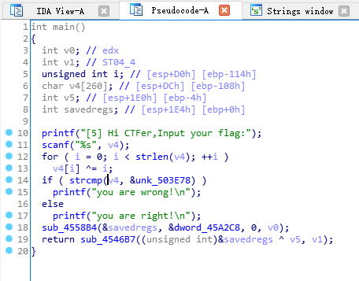
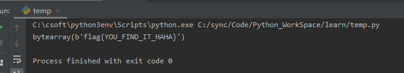
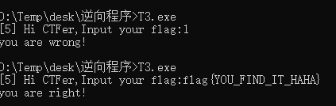

# 3-异或

---

目标 T3.exe

使用 IDA 打开,找 main 函数,并做基本的分析，重命名函数





可以看到对比 T2.exe ,循环这里的每个字符+1变成了字符与i异或

转换的代码是
```c
for ( i = 0; i < strlen(v4); ++i )
    v4[i] ^= i;
```

编写相应 python 脚本
```py
data=[0x66,0x6D,0x63,0x64,0x7F,0x5C,0x49,0x52,0x57,0x4F,0x43,0x45,0x48,0x52,0x47,0x5B,0x4F,0x59,0x53,0x5B,0x55,0x68]
for i in range(len(data)):
    data[i]^=i
print(bytearray(data))
```





C语言版本
```c
#include <stdio.h>
#include <string.h>

int main(int argc, char* argv[])
{
	char aaa[]={0x66,0x6D,0x63,0x64,0x7F,0x5C,0x49,0x52,0x57,0x4F,0x43,0x45,0x48,0x52,0x47,0x5B,0x4F,0x59,0x53,0x5B,0x55,0x68,0x00};
	for(unsigned int i=0;i < strlen(aaa);i++)
			aaa[i]^=i;
	printf("%s",aaa);
	return 0;
}
```

---

**Source & Reference**
- [萌新学逆向——T3 有趣的异或运算](https://mp.weixin.qq.com/s/zxkId2CYi5-inUnG0JTsCg)
