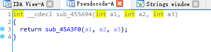
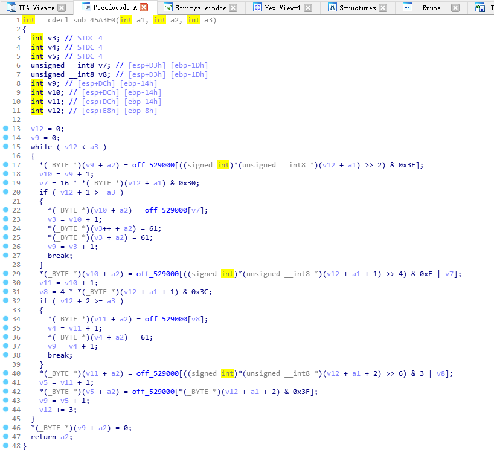
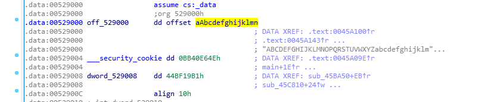
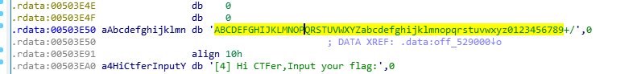
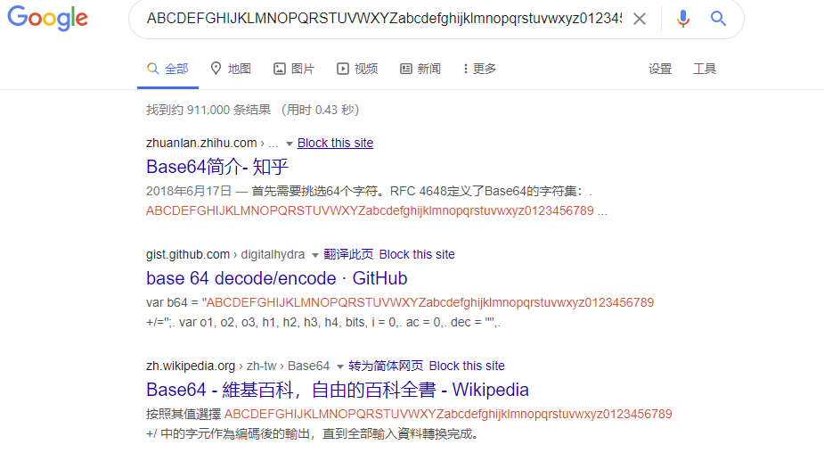
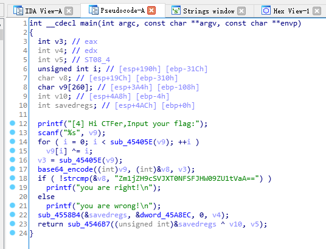
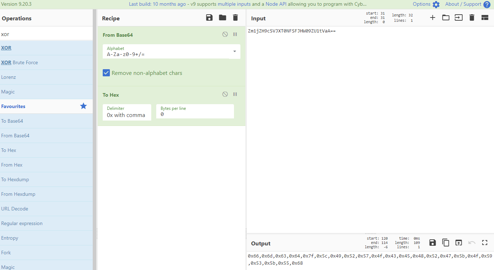
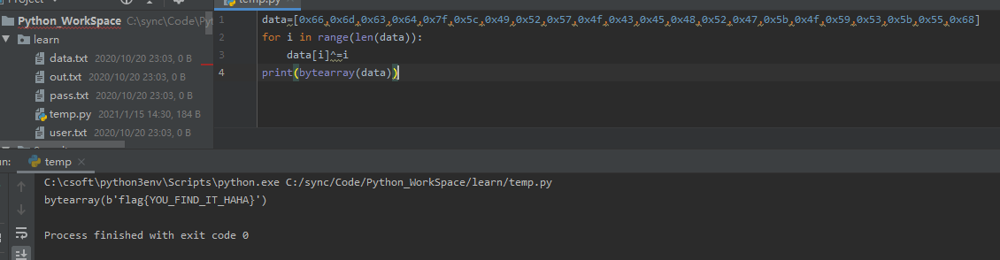
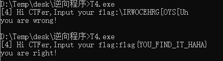

# 4-Base64

---

目标 T4.exe

使用 IDA 打开,找 main 函数,并做基本的分析，重命名函数

这次在17行出现了一个 sub_455A94 函数,双击进去

这个 sub_455A94 对 sub_45A3F0 做了一层封装,继续双击跟进下一级

这里可以看到 sub_45A3F0 的细节，寻找关键数字常量，比如多次引用到 off_529000 全局资源

双击进入 off_529000，跳转到该资源存储的位置。

这里可以看到 off_529000 dd offset aAbcdefghijklmn 表示 off_529000 是一个全局的指针变量，保存了一个字符串的指针，指向的字符串为 aAbcdefghijklmn ， 双击进入 aAbcdefghijklmn 地址的数据处。

发现一个关键字符串 ABCDEFGHIJKLMNOPQRSTUVWXYZabcdefghijklmnopqrstuvwxyz0123456789

去搜索一下就知道这个估计是 base64 编码的函数

重命名一下

在分析下思路

输入值 --> 每个字符与i异或 --> 进行base64 编码 --> 与 Zm1jZH9cSVJXT0NFSFJHW09ZU1tVaA== 比较

那么解题就是将 Zm1jZH9cSVJXT0NFSFJHW09ZU1tVaA== 解 base64，与 i 异或即可

这里用 cyberchef 快速得到格式化的 16 进制值

然后用之前的与 i 异或脚本跑下即可

---

**Source & Reference**
- [萌新学逆向——T4 Base64算法](https://mp.weixin.qq.com/s/HUE8DE-K4n0NytzrO4I49A)
