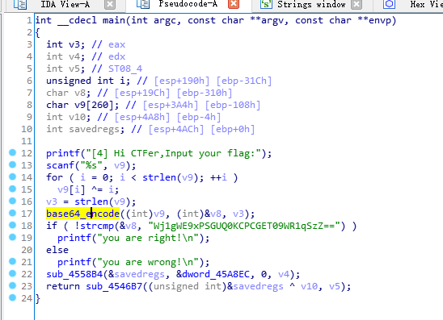
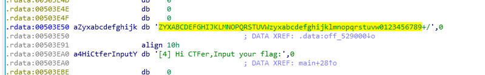
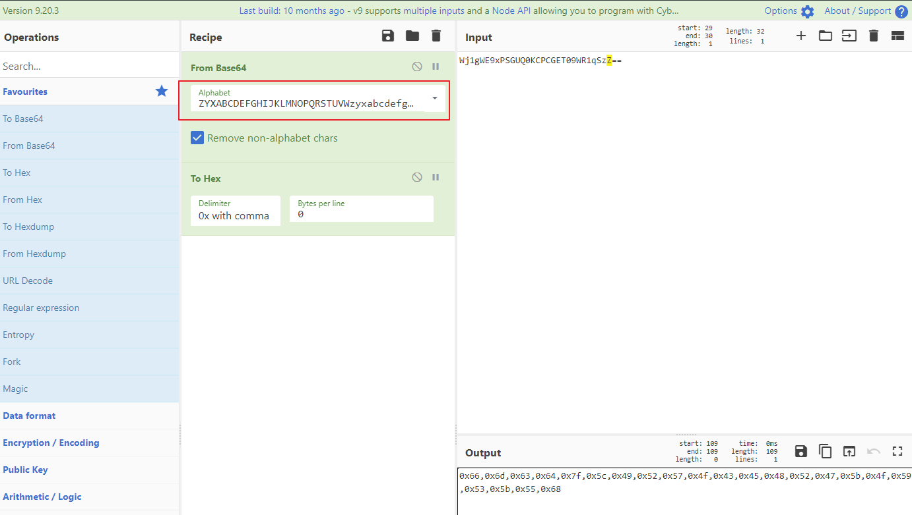
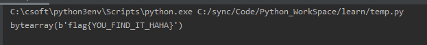

# 5-Base64换表

---

目标 T5.exe

使用 IDA 打开,找 main 函数,并做基本的分析，重命名函数

与T4基本一致

但仔细观察,最后的关键字符串为 ZYXABCDEFGHIJKLMNOPQRSTUVWzyxabcdefghijklmnopqrstuvw0123456789+/

这是采用了 base64换表,同样利用 cyberchef 快速得到格式化的 16 进制值

按位与 i 异或即可

---

**Source & Reference**
- [萌新学逆向——T5 突变的Base64算法](https://mp.weixin.qq.com/s/1ouGsCJTclTDmpXr7QoPXg)
