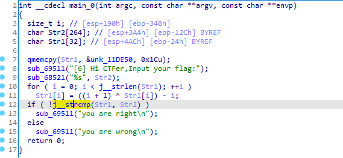
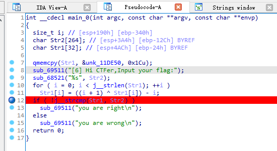
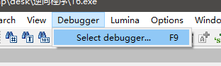
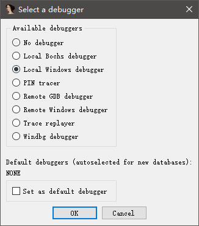
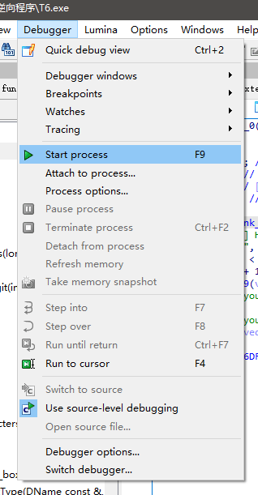
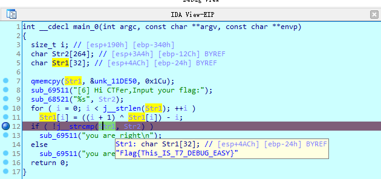

# 6-动态调试

---

目标 T6.exe

使用 IDA 打开,找 main 函数,并做基本的分析

可以发现这里一改之前的对输入变量进行修改的风格，直接定义了一个固定的常量。

在 IDA 中设置好断点。这道题我们想查看 strcmp 函数调用时的实参数据，因此在 strcmp 调用处设置一个断点，设置断点的方法是在点击行号旁边的小蓝点。

设置后断点后就可以开始调试

打开 【Debugger】

菜单选中【Select debugger】

---

**Source & Reference**
- [萌新学逆向——T6 动态调试](https://mp.weixin.qq.com/s/3ZvkX3vg4dXkSORbE4g7Dg)
