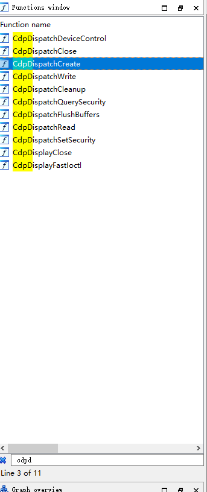
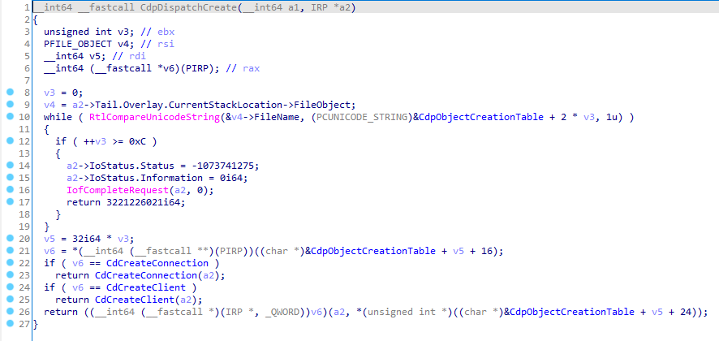
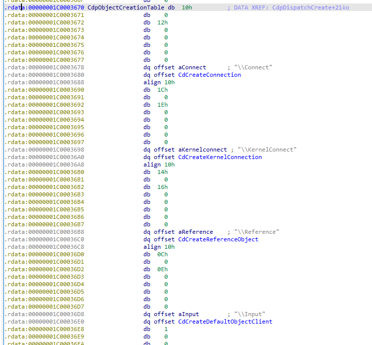
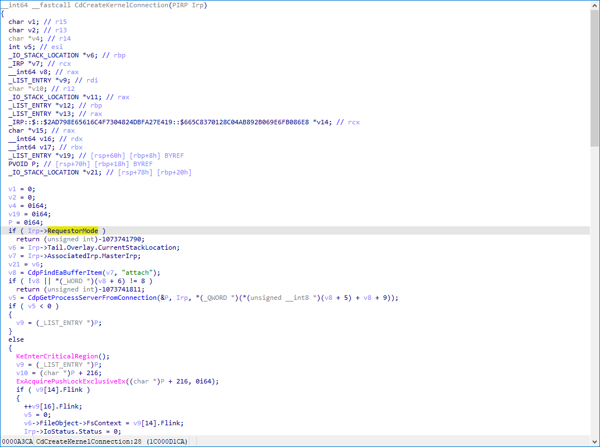

# condrv.sys 内存损坏漏洞

前面的没怎么看懂,尝试看后面的 condrv.sys

全局找 condrv.sys, 发现 C:\Windows\System32\drivers\condrv.sys, 复制一份, ida64 打开

选择从符号服务器下载

跟到 CdpDispatchCreate



查看反汇编



它会循环比较文件名是不是预定义的几个，如果是，则调用预定义的创建回调函数

跟到 CdpObjectCreationTable



目前网上的 poc 如下
```
<script>document.location = '\\\\.\\globalroot\\device\\condrv\\kernelconnect';</script>
```

poc 里面打开的是 kernelconnect, 所以会调用 CdCreateKernelConnection, 跟进



这里判断, 如果先前模式是 usermode 则返回 - 1073741790, 简单换算一些
```
1. 先将 1073741790 转换成 2进制,共 30 位
      11 1111 1111 1111 1111 1111 1101 1110
2. 最前面一位为符号位 1,前面补一位0 得 32 位
    1011 1111 1111 1111 1111 1111 1101 1110
3. 除符号位外,按位取反再加1
    1100 0000 0000 0000 0000 0000 0010 0010
4. 转换成十六进制
    C 0 0 0 0 0 0 2 2
```

> 这里可以直接右键 Hexadecimal 进行转换

这个 0xc000022 搜一下就知道是 windows 常用的一个报错，即拒绝访问；也就是设计之初内核是不允许用户直接使用这个符号链接的。

这个直接返回拒绝，再处理 IRP 时没有设置 IRP 的状态码和调用 IoCompleteRequest 结束 IRP。导致当 IRP 返回时，其 IoStatus.Status 为 0。NTSTATUS 值为 0 为 NT_SUCCESS，而在函数 IopPraseDevice 中是以 IoStatus.Status 为准, 所以 IopPraseDevice 错误的认为 IoCalldriver 是成功的，进而引发后续错误地关闭文件对象从而导致蓝屏。手动测试修改 IoStatus.Status 为失败值，蓝屏消失。

IoStatus.Status 这里可以参考
- https://docs.microsoft.com/en-us/windows-hardware/drivers/ifs/completing-the-irp - Completing the IRP

- https://docs.microsoft.com/en-us/windows-hardware/drivers/kernel/using-ntstatus-values - Using NTSTATUS Values

---

**Source & Reference**
- [Windows 10 bug crashes your PC when you access this location](https://www.bleepingcomputer.com/news/security/windows-10-bug-crashes-your-pc-when-you-access-this-location/)
- [【更新】深信服EDR快速响应支持防护Windows condrv.sys内存损坏漏洞](https://mp.weixin.qq.com/s/QhGYn6wPquSY6obvjgt8VQ)
- [驱动在IoCallDriver之前应设置IoStatus.status的状态](https://www.jianshu.com/p/29fddad42736)
