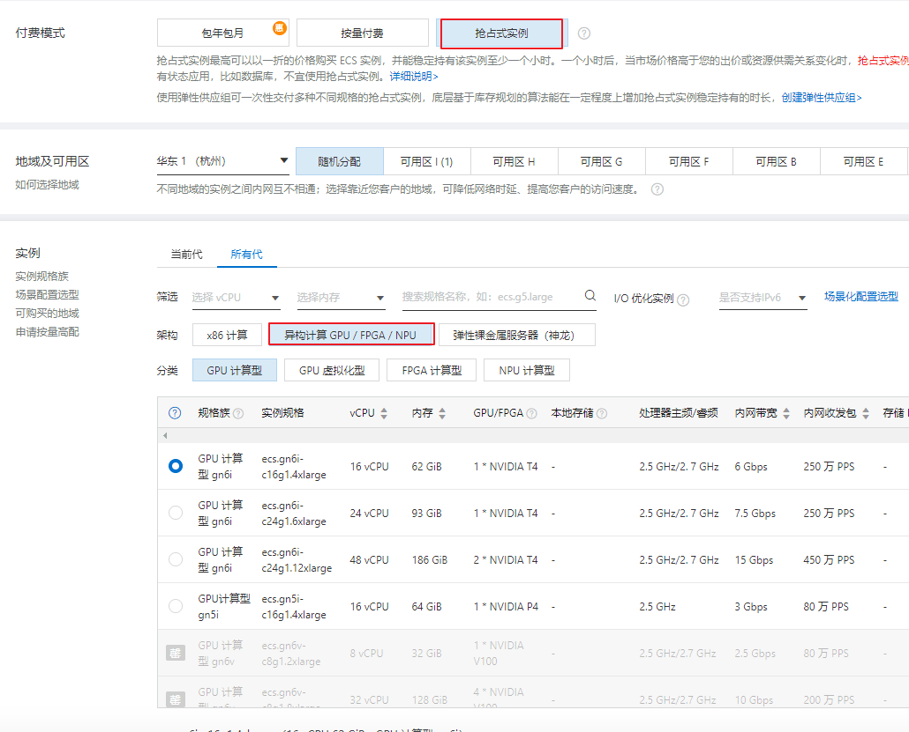
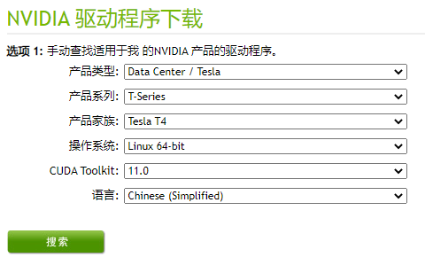
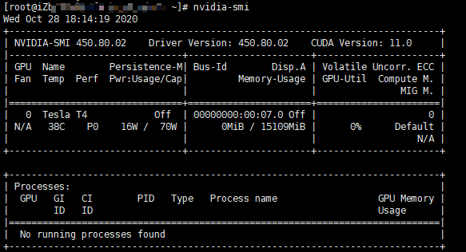
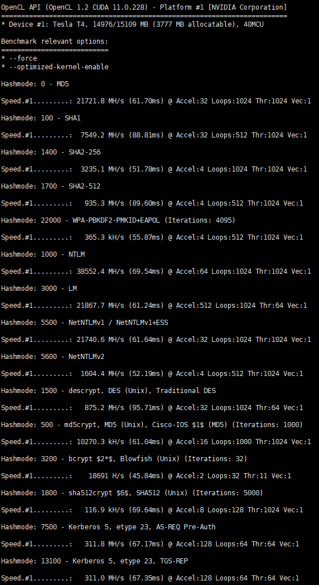
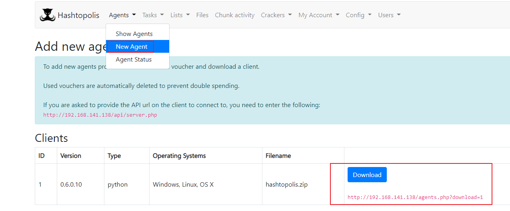
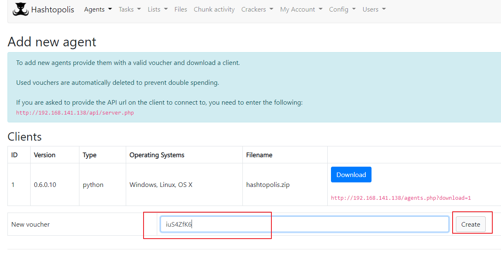
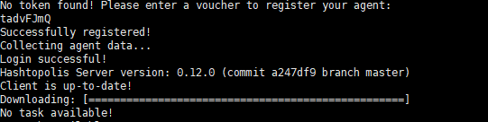
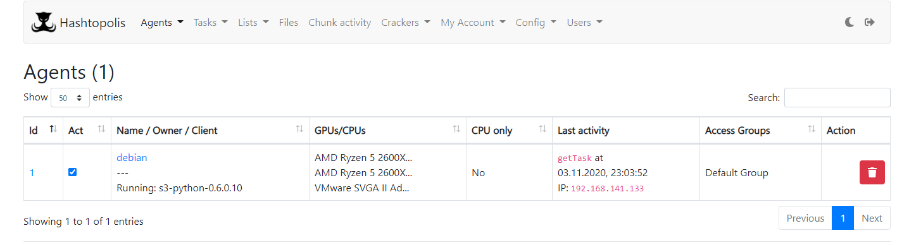

# Hashcat

<p align="center">
    
</p>

---

## 免责声明

`本文档仅供学习和研究使用,请勿使用文中的技术源码用于非法用途,任何人造成的任何负面影响,与本人无关.`

---

**简介**

Hashcat 自称是世界上最快的密码恢复工具。它在2015年之前拥有专有代码库，但现在作为免费软件发布。适用于 Linux，OS X 和 Windows 的版本可以使用基于 CPU 或基于 GPU 的变体。支持 hashcat 的散列算法有 Microsoft LM hash，MD4，MD5，SHA 系列，Unix 加密格式，MySQL 和 Cisco PIX 等。

**官网**
- https://hashcat.net/hashcat/

**文章 & Reference**
- [Hashcat的使用手册总结](https://xz.aliyun.com/t/4008)
- [hashcat rule的使用](https://darkless.cn/2019/12/26/hashcat-rule/)

**相关工具**
- [nccgroup/hashcrack](https://github.com/nccgroup/hashcrack) - 解包一些散列类型，选择合理的选项并调用 hashcat,hashcat 辅助工具
- [brannondorsey/naive-hashcat](https://github.com/brannondorsey/naive-hashcat) - 包括各种字典，组合，基于规则的攻击和掩码（暴力）攻击。hashcat 傻瓜版?
- [wavestone-cdt/wavecrack](https://github.com/wavestone-cdt/wavecrack) - web 版的 hashcat
- [s3inlc/hashtopolis](https://github.com/s3inlc/hashtopolis) - 分布式 Hashcat 服务

---

# 基本使用

**安装**
```bash
mkdir /pentest && cd $_
wget https://hashcat.net/files/hashcat-6.1.1.7z
7z x hashcat-6.1.1.7z && rm -rf hashcat-6.1.1.7z
cd hashcat-6.1.1 && chmod +x hashcat.bin && cp hashcat.bin hashcat
ln -s /pentest/hashcat-6.1.1/hashcat /usr/sbin/hashcat
```

- 在使用 GPU 模式进行破解时，可以使用 -O 参数自动进行优化
- 所有的 hash 破解结果都在 hashcat.potfile 文件中

**常见参数**
```
-a                指定要使用的破解模式，其值参考后面对参数。“-a 0”字典攻击，“-a 1” 组合攻击；“-a 3”掩码攻击。
-m                指定要破解的hash类型，如果不指定类型，则默认是MD5
-o                指定破解成功后的hash及所对应的明文密码的存放位置,可以用它把破解成功的hash写到指定的文件中
--force           忽略破解过程中的警告信息,跑单条hash可能需要加上此选项
--show            显示已经破解的hash及该hash所对应的明文
--increment       启用增量破解模式,你可以利用此模式让hashcat在指定的密码长度范围内执行破解过程
--increment-min   密码最小长度,后面直接等于一个整数即可,配置increment模式一起使用
--increment-max   密码最大长度,同上
--outfile-format  指定破解结果的输出格式id,默认是3
--username        忽略hash文件中的指定的用户名,在破解linux系统用户密码hash可能会用到
--remove          删除已被破解成功的hash
-r                使用自定义破解规则
```

**攻击模式**
```
# | Mode
 ===+======
  0 | Straight（字段破解）
  1 | Combination（组合破解）
  3 | Brute-force（掩码暴力破解）
  6 | Hybrid Wordlist + Mask（字典+掩码破解）
  7 | Hybrid Mask + Wordlist（掩码+字典破解）
```

**输出格式**
```
1 = hash[:salt]
2 = plain
3 = hash[:salt]:plain
4 = hex_plain
5 = hash[:salt]:hex_plain
6 = plain:hex_plain
7 = hash[:salt]:plain:hex_plain
8 = crackpos
9 = hash[:salt]:crackpos
10 = plain:crackpos
11 = hash[:salt]:plain:crackpos
12 = hex_plain:crackpos
13 = hash[:salt]:hex_plain:crackpos
14 = plain:hex_plain:crackpos
15 = hash[:salt]:plain:hex_plain:crackpos
```

**常见 Hash id 对照表**

- https://hashcat.net/wiki/doku.php?id=example_hashes
```bash
hashcat --help

- [ Hash modes ] -

      # | Name                                             | Category
  ======+==================================================+======================================
    900 | MD4                                              | Raw Hash
      0 | MD5                                              | Raw Hash
   5100 | Half MD5                                         | Raw Hash
    100 | SHA1                                             | Raw Hash
   1300 | SHA2-224                                         | Raw Hash
   1400 | SHA2-256                                         | Raw Hash
  10800 | SHA2-384                                         | Raw Hash
   1700 | SHA2-512                                         | Raw Hash
  17300 | SHA3-224                                         | Raw Hash
  17400 | SHA3-256                                         | Raw Hash
  17500 | SHA3-384                                         | Raw Hash
  17600 | SHA3-512                                         | Raw Hash
  17700 | Keccak-224                                       | Raw Hash
  17800 | Keccak-256                                       | Raw Hash
  17900 | Keccak-384                                       | Raw Hash
  18000 | Keccak-512                                       | Raw Hash
    600 | BLAKE2b-512                                      | Raw Hash
  10100 | SipHash                                          | Raw Hash
   6000 | RIPEMD-160                                       | Raw Hash
   6100 | Whirlpool                                        | Raw Hash
   6900 | GOST R 34.11-94                                  | Raw Hash
  11700 | GOST R 34.11-2012 (Streebog) 256-bit, big-endian | Raw Hash
  11800 | GOST R 34.11-2012 (Streebog) 512-bit, big-endian | Raw Hash
     10 | md5($pass.$salt)                                 | Raw Hash, Salted and/or Iterated
     20 | md5($salt.$pass)                                 | Raw Hash, Salted and/or Iterated
     30 | md5(utf16le($pass).$salt)                        | Raw Hash, Salted and/or Iterated
     40 | md5($salt.utf16le($pass))                        | Raw Hash, Salted and/or Iterated
   3800 | md5($salt.$pass.$salt)                           | Raw Hash, Salted and/or Iterated
   3710 | md5($salt.md5($pass))                            | Raw Hash, Salted and/or Iterated
   4010 | md5($salt.md5($salt.$pass))                      | Raw Hash, Salted and/or Iterated
   4110 | md5($salt.md5($pass.$salt))                      | Raw Hash, Salted and/or Iterated
   2600 | md5(md5($pass))                                  | Raw Hash, Salted and/or Iterated
   3910 | md5(md5($pass).md5($salt))                       | Raw Hash, Salted and/or Iterated
   4300 | md5(strtoupper(md5($pass)))                      | Raw Hash, Salted and/or Iterated
   4400 | md5(sha1($pass))                                 | Raw Hash, Salted and/or Iterated
    110 | sha1($pass.$salt)                                | Raw Hash, Salted and/or Iterated
    120 | sha1($salt.$pass)                                | Raw Hash, Salted and/or Iterated
    130 | sha1(utf16le($pass).$salt)                       | Raw Hash, Salted and/or Iterated

以下略
```

# 掩码设置

**常见的掩码字符集**
```
l | abcdefghijklmnopqrstuvwxyz          纯小写字母
u | ABCDEFGHIJKLMNOPQRSTUVWXYZ          纯大写字母
d | 0123456789                  纯数字
h | 0123456789abcdef                常见小写子目录和数字
H | 0123456789ABCDEF                常见大写字母和数字
s |  !"#$%&'()*+,-./:;<=>?@[\]^_`{|}~       特殊字符
a | ?l?u?d?s                    键盘上所有可见的字符
b | 0x00 - 0xff                 可能是用来匹配像空格这种密码的
```

**掩码案例**
```
八位数字密码：?d?d?d?d?d?d?d?d
八位未知密码：?a?a?a?a?a?a?a?a
前四位为大写字母，后面四位为数字：?u?u?u?u?d?d?d?d
前四位为数字或者是小写字母，后四位为大写字母或者数字：?h?h?h?h?H?H?H?H
前三个字符未知，中间为admin，后三位未知：?a?a?aadmin?a?a?a
6-8位数字密码：--increment --increment-min 6 --increment-max 8 ?l?l?l?l?l?l?l?l
6-8位数字+小写字母密码：--increment --increment-min 6 --increment-max 8 ?h?h?h?h?h?h?h?h
```

如果我们想设置字符集为：abcd123456!@-+，就需要用到自定义字符集,hashcat支持用户最多定义4组字符集
```
--custom-charset1 [chars]等价于 -1
--custom-charset2 [chars]等价于 -2
--custom-charset3 [chars]等价于 -3
--custom-charset4 [chars]等价于 -4
在掩码中用?1、?2、?3、?4来表示。

--custom-charset1 abcd123456!@-+。  然后就可以用"?1"去表示这个字符集了
--custom-charset2 ?l?d              这里和?2就等价于?h
-1 ?d?l?u                           ?1就表示数字+小写字母+大写字母
-3 abcdef -4 123456                 那么?3?3?3?3?4?4?4?4就表示为前四位可能是“abcdef”，后四位可能是“123456”
```

---

# 例子

## 性能测试
```bash
hashcat -b --force
```

## 查看爆破案例

```bash
hashcat --example-hashes | less
```

---

## 爆破drupal7的密码hash

```bash

echo "\$S\$DvQI6Y600iNeXRIeEMF94Y6FvN8nujJcEDTCP9nS5.i38jnEKuDR" > source.txt
echo "\$S\$DWGrxef6.D0cwB5Ts.GlnLw15chRRWH2s1R3QBwC0EkvBQ/9TCGg" >> source.txt

hashcat -m 7900 -a 0 source.txt pass01.txt

-m 指定要破解的 hash 类型，如果不指定类型，则默认是 MD5
-a 指定要使用的破解模式，其值参考后面对参数。“-a 0”字典攻击，“-a 1” 组合攻击；“-a 3”掩码攻击。
source.txt 你要爆破的 hash 列表
pass01.txt 你的密码表
```


---

## 爆破wifi握手包

```bash
hashcat -m 2500 wireless.hccapx pass.txt --force

MODE: 2500
TYPE: WPA/WPA2 PMK
```

---

## 爆破NTLM-hash

```bash
hashcat -m 1000 hash.txt pass1.txt

MODE: 1000
TYPE: NTLM
b4b9b02e6f09a9bd760f388b67351e2b
```

---

## Domain Cached Credentials 2 (DCC2), MS Cache 2

应用于 mscash

```bash
MODE: 2100
TYPE: Domain Cached Credentials 2 (DCC2), MS Cache 2
$DCC2$10240#tom#e4e938d12fe5974dc42a90120bd9c90f
```

## 爆破net-NTLMv1

```bash
hashcat -m 5500 hash.txt pass1.txt

MODE: 5500
TYPE: NetNTLMv1 / NetNTLMv1+ESS
u4-netntlm::kNS:338d08f8e26de93300000000000000000000000000000000:9526fb8c23a90751cdd619b6cea564742e1e4bf33006ba41:cb8086049ec4736c
```

## 爆破net-NTLMv2

```bash
hashcat -m 5600 hash.txt pass1.txt

MODE: 5600
TYPE: NetNTLMv2
admin::N46iSNekpT:08ca45b7d7ea58ee:88dcbe4446168966a153a0064958dac6:5c7830315c7830310000000000000b45c67103d07d7b95acd12ffa11230e0000000052920b85f78d013c31cdb3b92f5d765c783030
```

---

## 爆破pdf文件

获取文件 hash
```bash
cd /usr/share/john/
./pdf2john.pl xxx.pdf
```

接下来就是一个一个的试,看是哪种加密算法,比如 word 自带的加密用的就是 10500
```bash
hashcat.exe -m 10400 hash.txt pass1.txt
hashcat.exe -m 10410 hash.txt pass1.txt
hashcat.exe -m 10420 hash.txt pass1.txt
hashcat.exe -m 10500 hash.txt pass1.txt
hashcat.exe -m 10600 hash.txt pass1.txt
hashcat.exe -m 10700 hash.txt pass1.txt

MODE: 10400
TYPE: PDF 1.1 - 1.3 (Acrobat 2 - 4)
$pdf$1*2*40*-1*0*16*51726437280452826511473255744374*32*9b09be05c226214fa1178342673d86f273602b95104f2384b6c9b709b2cbc058*32*0000000000000000000000000000000000000000000000000000000000000000

MODE: 10410
TYPE: PDF 1.1 - 1.3 (Acrobat 2 - 4), collider #1
$pdf$1*2*40*-1*0*16*01221086741440841668371056103222*32*27c3fecef6d46a78eb61b8b4dbc690f5f8a2912bbb9afc842c12d79481568b74*32*0000000000000000000000000000000000000000000000000000000000000000

MODE: 10420
TYPE: PDF 1.1 - 1.3 (Acrobat 2 - 4), collider #2
$pdf$1*2*40*-1*0*16*01221086741440841668371056103222*32*27c3fecef6d46a78eb61b8b4dbc690f5f8a2912bbb9afc842c12d79481568b74*32*0000000000000000000000000000000000000000000000000000000000000000:6a8aedccb7

MODE: 10500
TYPE: PDF 1.4 - 1.6 (Acrobat 5 - 8)
$pdf$2*3*128*-1028*1*16*da42ee15d4b3e08fe5b9ecea0e02ad0f*32*c9b59d72c7c670c42eeb4fca1d2ca15000000000000000000000000000000000*32*c4ff3e868dc87604626c2b8c259297a14d58c6309c70b00afdfb1fbba10ee571

MODE: 10600
TYPE: PDF 1.7 Level 3 (Acrobat 9)
$pdf$5*5*256*-1028*1*16*20583814402184226866485332754315*127*f95d927a94829db8e2fbfbc9726ebe0a391b22a084ccc2882eb107a74f7884812058381440218422686648533275431500000000000000000000000000000000000000000000000000000000000000000000000000000000000000000000000000000000000000000000000000000000000000000000000000000000000000*127*00000000000000000000000000000000000000000000000000000000000000000000000000000000000000000000000000000000000000000000000000000000000000000000000000000000000000000000000000000000000000000000000000000000000000000000000000000000000000000000000000000000000000*32*0000000000000000000000000000000000000000000000000000000000000000*32*0000000000000000000000000000000000000000000000000000000000000000

MODE: 10700
TYPE: PDF 1.7 Level 8 (Acrobat 10 - 11)
$pdf$5*6*256*-1028*1*16*21240790753544575679622633641532*127*2d1ecff66ea354d3d34325a6503da57e03c199c21b13dd842f8d515826054d8d2124079075354457567962263364153200000000000000000000000000000000000000000000000000000000000000000000000000000000000000000000000000000000000000000000000000000000000000000000000000000000000000*127*00000000000000000000000000000000000000000000000000000000000000000000000000000000000000000000000000000000000000000000000000000000000000000000000000000000000000000000000000000000000000000000000000000000000000000000000000000000000000000000000000000000000000*32*0000000000000000000000000000000000000000000000000000000000000000*32*0000000000000000000000000000000000000000000000000000000000000000
```

---

## 爆破shadow文件

hash.txt 只保留加密的密码字段 : `$id$salt$encrypted`

> 注: 实际测试时无需删减,直接复制 shadow 内容即可

```bash
hashcat -m 500 hash.txt pass1.txt
hashcat -m 1500 hash.txt pass1.txt
hashcat -m 1800 hash.txt pass1.txt

MODE: 500
TYPE: md5crypt, MD5 (Unix), Cisco-IOS $1$ (MD5) 2
$1$28772684$iEwNOgGugqO9.bIz5sk8k/

MODE: 1500
TYPE: descrypt, DES (Unix), Traditional DES
48c/R8JAv757A

MODE: 1800
TYPE: sha512crypt $6$, SHA512 (Unix)
$6$52450745$k5ka2p8bFuSmoVT1tzOyyuaREkkKBcCNqoDKzYiJL9RaE8yMnPgh2XzzF0NDrUhgrcLwg78xs1w5pJiypEdFX/
```

---

## 爆破压缩包

> 注意: AMD 显卡不支持该项爆破

用 zip2john 获取文件的 hash 值
```bash
zip2john.exe 1.zip > hash.txt
rar2john.exe 1.rar > hash.txt

apt install -y libcompress-raw-lzma-perl -y
wget https://raw.githubusercontent.com/philsmd/7z2hashcat/master/7z2hashcat.pl
perl 7z2hashcat.pl file.7z > hash.txt
```

```bash
# 7z(注:hashcat 貌似只能跑加密了文件名的 7z 压缩包，未加密文件名的 7z 压缩包需要用 john 跑)
hashcat -m 11600 --force hash.txt pass1.txt

MODE: 11600
TYPE: 7-Zip
$7z$0$19$0$salt$8$f6196259a7326e3f0000000000000000$185065650$112$98$f3bc2a88062c419a25acd40c0c2d75421cf23263f69c51b13f9b1aada41a8a09f9adeae45d67c60b56aad338f20c0dcc5eb811c7a61128ee0746f922cdb9c59096869f341c7a9cb1ac7bb7d771f546b82cf4e6f11a5ecd4b61751e4d8de66dd6e2dfb5b7d1022d2211e2d66ea1703f96
# 如果在 windows 下的话,记得修改编码为 ANSI

# rar
hashcat -m 12500 --force hash.txt pass1.txt
hashcat -m 13000 --force hash.txt pass1.txt

MODE: 12500
TYPE: RAR3-hp
$RAR3$*0*45109af8ab5f297a*adbf6c5385d7a40373e8f77d7b89d317

MODE: 13000
TYPE: RAR5
$rar5$16$74575567518807622265582327032280$15$f8b4064de34ac02ecabfe9abdf93ed6a$8$9843834ed0f7c754

# zip
hashcat -m 13600 --force hash.txt pass1.txt
hashcat -m 17200 --force hash.txt pass1.txt
hashcat -m 17210 --force hash.txt pass1.txt
hashcat -m 17220 --force hash.txt pass1.txt
hashcat -m 17225 --force hash.txt pass1.txt
hashcat -m 17230 --force hash.txt pass1.txt
hashcat -m 23001 --force hash.txt pass1.txt
hashcat -m 23002 --force hash.txt pass1.txt
hashcat -m 23003 --force hash.txt pass1.txt

MODE: 13600
TYPE: WinZip
$zip2$*0*3*0*e3222d3b65b5a2785b192d31e39ff9de*1320*e*19648c3e063c82a9ad3ef08ed833*3135c79ecb86cd6f48fc*$/zip2$

MODE: 17200
TYPE: PKZIP (Compressed)
$pkzip2$1*1*2*0*e3*1c5*eda7a8de*0*28*8*e3*eda7*5096*a9fc1f4e951c8fb3031a6f903e5f4e3211c8fdc4671547bf77f6f682afbfcc7475d83898985621a7af9bccd1349d1976500a68c48f630b7f22d7a0955524d768e34868880461335417ddd149c65a917c0eb0a4bf7224e24a1e04cf4ace5eef52205f4452e66ded937db9545f843a68b1e84a2e933cc05fb36d3db90e6c5faf1bee2249fdd06a7307849902a8bb24ec7e8a0886a4544ca47979a9dfeefe034bdfc5bd593904cfe9a5309dd199d337d3183f307c2cb39622549a5b9b8b485b7949a4803f63f67ca427a0640ad3793a519b2476c52198488e3e2e04cac202d624fb7d13c2*$/pkzip2$

MODE: 17210
TYPE: PKZIP (Uncompressed)
$pkzip2$1*1*2*0*1d1*1c5*eda7a8de*0*28*0*1d1*eda7*5096*1dea673da43d9fc7e2be1a1f4f664269fceb6cb88723a97408ae1fe07f774d31d1442ea8485081e63f919851ca0b7588d5e3442317fff19fe547a4ef97492ed75417c427eea3c4e146e16c100a2f8b6abd7e5988dc967e5a0e51f641401605d673630ea52ebb04da4b388489901656532c9aa474ca090dbac7cf8a21428d57b42a71da5f3d83fed927361e5d385ca8e480a6d42dea5b4bf497d3a24e79fc7be37c8d1721238cbe9e1ea3ae1eb91fc02aabdf33070d718d5105b70b3d7f3d2c28b3edd822e89a5abc0c8fee117c7fbfbfd4b4c8e130977b75cb0b1da080bfe1c0859e6483c42f459c8069d45a76220e046e6c2a2417392fd87e4aa4a2559eaab3baf78a77a1b94d8c8af16a977b4bb45e3da211838ad044f209428dba82666bf3d54d4eed82c64a9b3444a44746b9e398d0516a2596d84243b4a1d7e87d9843f38e45b6be67fd980107f3ad7b8453d87300e6c51ac9f5e3f6c3b702654440c543b1d808b62f7a313a83b31a6faaeedc2620de7057cd0df80f70346fe2d4dccc318f0b5ed128bcf0643e63d754bb05f53afb2b0fa90b34b538b2ad3648209dff587df4fa18698e4fa6d858ad44aa55d2bba3b08dfdedd3e28b8b7caf394d5d9d95e452c2ab1c836b9d74538c2f0d24b9b577*$/pkzip2$

MODE: 17220
TYPE: PKZIP (Compressed Multi-File)
$pkzip2$3*1*1*0*8*24*a425*8827*d1730095cd829e245df04ebba6c52c0573d49d3bbeab6cb385b7fa8a28dcccd3098bfdd7*1*0*8*24*2a74*882a*51281ac874a60baedc375ca645888d29780e20d4076edd1e7154a99bde982152a736311f*2*0*e3*1c5*eda7a8de*0*29*8*e3*eda7*5096*1455781b59707f5151139e018bdcfeebfc89bc37e372883a7ec0670a5eafc622feb338f9b021b6601a674094898a91beac70e41e675f77702834ca6156111a1bf7361bc9f3715d77dfcdd626634c68354c6f2e5e0a7b1e1ce84a44e632d0f6e36019feeab92fb7eac9dda8df436e287aafece95d042059a1b27d533c5eab62c1c559af220dc432f2eb1a38a70f29e8f3cb5a207704274d1e305d7402180fd47e026522792f5113c52a116d5bb25b67074ffd6f4926b221555234aabddc69775335d592d5c7d22462b75de1259e8342a9ba71cb06223d13c7f51f13be2ad76352c3b8ed*$/pkzip2$

MODE: 17225
TYPE: PKZIP (Mixed Multi-File)
$pkzip2$3*1*1*0*0*24*3e2c*3ef8*0619e9d17ff3f994065b99b1fa8aef41c056edf9fa4540919c109742dcb32f797fc90ce0*1*0*8*24*431a*3f26*18e2461c0dbad89bd9cc763067a020c89b5e16195b1ac5fa7fb13bd246d000b6833a2988*2*0*23*17*1e3c1a16*2e4*2f*0*23*1e3c*3f2d*54ea4dbc711026561485bbd191bf300ae24fa0997f3779b688cdad323985f8d3bb8b0c*$/pkzip2$

MODE: 17230
TYPE: PKZIP (Compressed Multi-File Checksum-Only)
$pkzip2$8*1*1*0*8*24*a425*8827*3bd479d541019c2f32395046b8fbca7e1dca218b9b5414975be49942c3536298e9cc939e*1*0*8*24*2a74*882a*537af57c30fd9fd4b3eefa9ce55b6bff3bbfada237a7c1dace8ebf3bb0de107426211da3*1*0*8*24*2a74*882a*5f406b4858d3489fd4a6a6788798ac9b924b5d0ca8b8e5a6371739c9edcfd28c82f75316*1*0*8*24*2a74*882a*1843aca546b2ea68bd844d1e99d4f74d86417248eb48dd5e956270e42a331c18ea13f5ed*1*0*8*24*2a74*882a*aca3d16543bbfb2e5d2659f63802e0fa5b33e0a1f8ae47334019b4f0b6045d3d8eda3af1*1*0*8*24*2a74*882a*fbe0efc9e10ae1fc9b169bd060470bf3e39f09f8d83bebecd5216de02b81e35fe7e7b2f2*1*0*8*24*2a74*882a*537886dbabffbb7cac77deb01dc84760894524e6966183b4478a4ef56f0c657375a235a1*1*0*8*24*eda7*5096*40eb30ef1ddd9b77b894ed46abf199b480f1e5614fde510855f92ae7b8026a11f80e4d5f*$/pkzip2$

MODE: 23001
TYPE: SecureZIP AES-128
$zip3$*0*1*128*0*b4630625c92b6e7848f6fd86*df2f62611b3d02d2c7e05a48dad57c7d93b0bac1362261ab533807afb69db856676aa6e350320130b5cbf27c55a48c0f75739654ac312f1cf5c37149557fc88a92c7e3dde8d23edd2b839036e88092a708b7e818bf1b6de92f0efb5cce184cceb11db6b3ca0527d0bdf1f1137ee6660d9890928cd80542ac1f439515519147c14d965b5ba107c6227f971e3e115170bf*0*0*0*file.txt

MODE: 23002
TYPE: SecureZIP AES-192
$zip3$*0*1*192*0*53ff2de8c280778e1e0ab997*603eb37dbab9ea109e2c405e37d8cae1ec89e1e0d0b9ce5bf55d1b571c343b6a3df35fe381c30249cb0738a9b956ba8e52dfc5552894296300446a771032776c811ff8a71d9bb3c4d6c37016c027e41fea2d157d5b0ce17804b1d7c1606b7c1121d37851bd705e001f2cd755bbf305966d129a17c1d48ff8e87cfa41f479090cd456527db7d1d43f9020ad8e73f851a5*0*0*0*file.txt

MODE: 23003
TYPE: SecureZIP AES-256
$zip3$*0*1*256*0*39bff47df6152a0214d7a967*65ff418ffb3b1198cccdef0327c03750f328d6dd5287e00e4c467f33b92a6ef40a74bb11b5afad61a6c3c9b279d8bd7961e96af7b470c36fc186fd3cfe059107021c9dea0cf206692f727eeca71f18f5b0b6ee1f702b648bba01aa21c7b7f3f0f7d547838aad46868155a04214f22feef7b31d7a15e1abe6dba5e569c62ee640783bb4a54054c2c69e93ece9f1a2af9d*0*0*0*file.txt
```

---

## 爆破office

> 注意: AMD 显卡不支持该项爆破

```bash
python /usr/share/john/office2john.py xxx.docx
```

```bash
hashcat -m 9600 hash.txt pass1.txt

MODE: 9400
TYPE: MS Office 2010
$office$*2007*20*128*16*411a51284e0d0200b131a8949aaaa5cc*117d532441c63968bee7647d9b7df7d6*df1d601ccf905b375575108f42ef838fb88e1cde

MODE: 9500
TYPE: MS Office 2010
$office$*2010*100000*128*16*77233201017277788267221014757262*b2d0ca4854ba19cf95a2647d5eee906c*e30cbbb189575cafb6f142a90c2622fa9e78d293c5b0c001517b3f5b82993557

MODE: 9600
TYPE: MS Office 2013
$office$*2013*100000*256*16*7dd611d7eb4c899f74816d1dec817b3b*948dc0b2c2c6c32f14b5995a543ad037*0b7ee0e48e935f937192a59de48a7d561ef2691d5c8a3ba87ec2d04402a94895

MODE: 9700
TYPE: MS Office ⇐ 2003 MD5 + RC4, oldoffice$0, oldoffice$1
$oldoffice$1*04477077758555626246182730342136*b1b72ff351e41a7c68f6b45c4e938bd6*0d95331895e99f73ef8b6fbc4a78ac1a

MODE: 9710
TYPE: MS Office ⇐ 2003 $0/$1, MD5 + RC4, collider #1
$oldoffice$0*55045061647456688860411218030058*e7e24d163fbd743992d4b8892bf3f2f7*493410dbc832557d3fe1870ace8397e2

MODE: 9720
TYPE: MS Office ⇐ 2003 $0/$1, MD5 + RC4, collider #2

MODE: 9800
TYPE: MS Office ⇐ 2003 SHA1 + RC4, oldoffice$3, oldoffice$4
$oldoffice$3*83328705222323020515404251156288*2855956a165ff6511bc7f4cd77b9e101*941861655e73a09c40f7b1e9dfd0c256ed285acd

MODE: 9810
TYPE: MS Office ⇐ 2003 $3, SHA1 + RC4, collider #1
$oldoffice$3*83328705222323020515404251156288*2855956a165ff6511bc7f4cd77b9e101*941861655e73a09c40f7b1e9dfd0c256ed285acd

MODE: 9820
TYPE: MS Office ⇐ 2003 $3, SHA1 + RC4, collider #2
$oldoffice$3*83328705222323020515404251156288*2855956a165ff6511bc7f4cd77b9e101*941861655e73a09c40f7b1e9dfd0c256ed285acd:b8f63619ca
```

---

## 爆破md5

```bash
# 16位的MD5
hashcat -m 5100 AC59075B964B0715 -a 3 ?d?d?d?d?d?d

# MD5规则是7位数字
hashcat -m 0 25c3e88f81b4853f2a8faacad4c871b6 -a 3 ?d?d?d?d?d?d?d

# MD5规则是7位小写字母
hashcat -m 0 7a47c6db227df60a6d67245d7d8063f3 -a 3 ?l?l?l?l?l?l?l

# MD5规则是1-8位数字
hashcat -m 0 4488cec2aea535179e085367d8a17d75 -a 3 --increment --increment-min 1 --increment-max 8 ?d?d?d?d?d?d?d?d

# MD5规则是1-8位小写字母+数字
hashcat -m 0 ab65d749cba1656ca11dfa1cc2383102 -a 3 --increment --increment-min 1 --increment-max 8 ?h?h?h?h?h?h?h?h

# MD5规则是 clearlove + 任意2位字符 + 3位纯数字
hashcat -m 0 7276bf625a8c5e65b9e5966bed63bce0 -a 3 clearlove?a?a?d?d?d

# MD5规则是特定字符集：123456abcdf!@+-
hashcat -m 0 8b78ba5089b11326290bc15cf0b9a07d -a 3 -1 123456abcdf!@+- ?1?1?1?1?1
> 注意：这里的-1和?1是数字1，不是字母l

# MD5规则是1-8位,符集集:123456abcdf!@+-
hashcat -m 0 9054fa315ce16f7f0955b4af06d1aa1b -a 3 -1 123456abcdf!@+- --increment --increment-min 1 --increment-max 8 ?1?1?1?1?1?1?1?1

# MD5规则是1-8位数字+大小写字母+可见特殊符号
hashcat -m 0 d37fc9ee39dd45a7717e3e3e9415f65d -a 3 -1 ?d?u?l?s --increment --increment-min 1 --increment-max 8 ?1?1?1?1?1?1?1?1
或者：
hashcat -m 0 d37fc9ee39dd45a7717e3e3e9415f65d -a 3 --increment --increment-min 1 --increment-max 8 ?a?a?a?a?a?a?a?a

# MD5规则是32位的01组合数字
hashcat -m 0 4c753d89d239bb17b8d754ff981c7772 -a 3 -3 01 ?3?3?3?3?3?3?3?3?3?3?3?3?3?3?3?3?3?3?3?3?3?3?3?3?3?3?3?3?3?3?3?3
```

---

## 批量破解

```bash
hashcat -a 0 hash.txt password.txt -o result.txt
```

---

## 爆破 sha256

破解一个原文8个字符的sha256，已知前5个字符。
```
hashcat64 -a 3 --hex-salt -m 1420 b9f5a36134ba3b3b9a41c3ee519899f39fd85f231d9cb2d6c34415fcebe0aa8c:13a03f1f32 --potfile-disable ?b?b?b  -o res3.txt --outfile-format=2 --force
```

---

# 更多实验

## 阿里云按量-抢占式实例-NVIDIA T4-跑 Hashcat

**注意点**
- 抢占式实例一次只能买1小时,切记1小时
- 实例创建完后需要装对应的 NVIDIA 驱动
- -f 测试的跑分速度很完美,但实际跑的时候速度是达不到的

**优点**
- 相对便宜,实际用起来一小时不到2元,感觉像在用 vultr
- 性能强

**过程**

- 付费模式选择 `抢占式实例`
- 实例类型选择 `异构计算 GPU/FPGA/NPU`
- 分类选择 `GPU 计算型`



CPU和内存可以不用考虑,主要是选个好的 GPU,这里可以看到有 NVIDIA T4 和  NVIDIA P4 两种选择

这里选择 T4 便宜一点

镜像选择 `Alibaba Cloud Linux` 这个兼容 centos,用起来没啥问题

下一步网络选择

建议使用按固定带宽收费,你跑 hashcat 其实用不了多少流量, `带宽峰值` 直接拉到 100M

创建完实例后,SSH连接,这里略

安装 hashcat,如果嫌速度慢,可以自己通过 lrzsz 的方式传上去
```bash
mkdir /pentest && cd $_
wget https://hashcat.net/files/hashcat-6.1.1.7z
7z x hashcat-6.1.1.7z && rm -rf hashcat-6.1.1.7z
cd hashcat-6.1.1 && chmod +x hashcat.bin && cp hashcat.bin hashcat
ln -s /pentest/hashcat-6.1.1/hashcat /usr/sbin/hashcat
```

安装显卡驱动

去 NVDIA driver search page 查看支持显卡的驱动最新版本及下载，下载之后是 .run 后缀



安装时一路回车即可,装完之后输入 nvidia-smi

```bash
wget https://cn.download.nvidia.com/tesla/450.80.02/NVIDIA-Linux-x86_64-450.80.02.run
sh NVIDIA-Linux-x86_64-450.80.02.run  -no-x-check -no-nouveau-check -no-opengl-files
nvidia-smi
```



然后就可以愉快的跑 hashcat 了

```bash
hashcat -b --force
```



---

## hashtopolis分布式服务

项目地址 : https://github.com/s3inlc/hashtopolis

### Server

> Ubuntu18.04

```bash
apt update
apt install -y mysql-server
apt install -y apache2
apt install -y libapache2-mod-php php-mysql php php-gd php-pear php-curl
apt install -y git unzip lrzsz

mysql_secure_installation

mysql -u root
CREATE DATABASE hashtopolis;
CREATE USER 'hashtopolis'@'localhost' IDENTIFIED BY 'hashtopolis';
GRANT ALL PRIVILEGES ON hashtopolis.* TO 'hashtopolis'@'localhost';
FLUSH PRIVILEGES;
EXIT;

cd /var/www
git clone https://github.com/s3inlc/hashtopolis
cd hashtopolis
```

```bash
nano /etc/apache2/sites-available/000-default.conf

<VirtualHost *:80>
DocumentRoot /var/www/hashtopolis/src
</VirtualHost>

<Directory /var/www/hashtopolis/src>
    AllowOverride ALL
</Directory>
```

```bash
nano /etc/php/7.2/apache2/php.ini

memory_limit = 512M
upload_max_filesize = 500M
post_max_size = 500M
```

```bash
chown -R www-data:www-data /var/www/hashtopolis
service apache2 restart
```

访问 127.0.0.1

输入数据库配置
```
地址 localhost
账号 hashtopolis
密码 hashtopolis
库   hashtopolis
```

创建账号
```
test
test@1.com
test
test
```

### Agent

> Debian

下载服务器端的 hashtopolis.zip



服务端添加一个新的 voucher



客户端运行 hashtopolis
```
apt update
apt install -y python3-pip
python3 -m pip install psutil requests
python3 hashtopolis.zip
```





### 使用

- https://www.youtube.com/watch?v=A1QrUVy7UZ0
