# IDA

---

**相关文章 & Reference**
- [萌新学逆向——T1 IDA的正确开启姿势](https://mp.weixin.qq.com/s/I9vJp8fp7RcCls0tz8Dvlg)
- [分析实战读书笔记3_IDA小知识](https://mp.weixin.qq.com/s/Cktu1sK0PILbO0-QJb9Y6A)
- [ida字符串存储的小端序陷阱](https://blog.csdn.net/amber_o0k/article/details/120659054)
- [恶意样本分析精要及实践8-IDA使用（一）](https://mp.weixin.qq.com/s/qaHEUW1uybkHhTAdzC96Hw)

**相关扩展**
- [lcq2/riscv-ida](https://github.com/lcq2/riscv-ida) - risc-v 插件
    ```
    Just copy riscv.py into procs folder of IDA. Start ida.exe and not ida64.exe, 64bit support is still missing
    ```
- [hackflame/ida_python_extractCode](https://github.com/hackflame/ida_python_extractCode) - ida提取特征码脚本
    ```
    1. 把 tq.py 放到 ida/python 目录下
    2. 在 ida/python 中找到 init.py ，打开此初始化脚本，然后拖到最下边 找到

        from idc import *
        from idautils import *
        import idaapi

        #在下面加一行
        import tq

    3. 打开ida测试。快捷键为 ALT+Z
    ```
- [SentineLabs/AlphaGolang](https://github.com/SentineLabs/AlphaGolang) - go 逆向插件
    ```
    Requirements: IDA Pro (ideally v7.6+) and Python3 (ew) The first two steps (recreate_pclntab and function_discovery_and_renaming) will work on IDA v7.5- but scripts beyond that require IDAv7.6+. Newer versions are the ideal target for newer scripts going forward.
    ```
- [t3ls/mipsAudit](https://github.com/t3ls/mipsAudit) - IDA MIPS静态扫描脚本，汇编审计辅助脚本
    ```
    将 mipsAudit.py 拷贝到 \IDA 7.5\plugins 目录
    启动后在 Edit - Plugins 下点击 mipsAudit 即可（快捷键 Ctrl+Alt+M）
    ```
- [CheckPointSW/Karta](https://github.com/CheckPointSW/Karta) - 识别并匹配给定代码中的开源代码库
    ```
    git clone https://github.com/CheckPointSW/Karta.git
    cd Karta
    setup.py install
    ```
- [aliyunav/Finger](https://github.com/aliyunav/Finger) - A tool for recognizing function symbol
    ```
    Now, Finger support python 2.7 and python 3, and requires IDA version >= 7.0.

    pip install finger_sdk
    Copy plugin/finger_plugin.py to your IDA_PATH/plugins path.
    ```
- [REhints/HexRaysCodeXplorer](https://github.com/REhints/HexRaysCodeXplorer) - Hex-Rays Decompiler plugin for better code navigation

---

**简介**

IDA 是最有影响力且流行的商业反编译调试工具；常被用于逆向工程，恶意病毒分析以及脆弱性研究。IDA 可以运行在不同平台（macOS、Linux 和 windows）支持分析不同的文件类型（PE/ELF/Macho-O）。

除商业版本之外，IDA 还提供 2 个其他版本：IDA demo 版本（评估版本）和 IDA 免费版本；两个版本都有一定的限制，都可以反编译 32 和 64 位 windows 程序，但是免费版无法调试二进制，demo 版本无法调试 64 位二进制，demo 版本也无法保存数据库，并且 demo 版本和免费版都无法支持 IDApython。

**目录结构**

IDA 主程序有2个: ida.exe 和 ida64.exe
- ida.exe 用于分析 32 位应用程序
- ida64.exe 用于分析 64 位应用程序

如果无法判断目标程序是 32 位还是 64 位的，可以直接打开, 会有相应提示。

ida64 可以反汇编 32 位应用程序，但是无法生成 32 位应用程序的伪代码。

**在 IDA 中加载二进制**

IDA 会像 windows 一样加载文件到内存中。IDA 可以通过判断文件头确定最可能适合的加载器。在选择文件后 IDA 会加载对话框，用于确认合适的加载起和进程类型。文件设置（file option）选项是用于加载未识别的文件，一般使用该选项处理 shellcode。默认情况下 IDA 不会在反编译中加载 PE 头和源部分。通过使用手动加载 checkbox 选项，可以手动选择加载基址和加载位置，IDA 将会在加载的每个部分包括 PE 头给予相应的提示。点击 OK，IDA 将文件加载到内存，并且开始反编译相关代码。

# 界面组成

## 反汇编窗口

当二进制文件被加载，IDA展示的窗口就是反汇编编辑窗口（也叫做IDA-view窗口），这是个主要窗口，用于分析和展示反汇编代码，并且可以用于分析反汇编二进制。

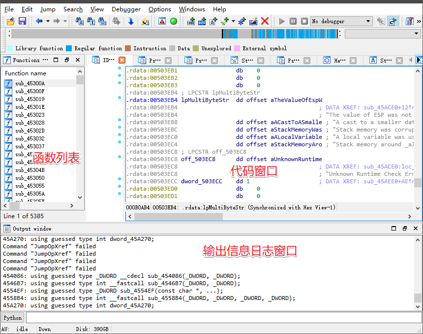

**函数窗口 function widnow**

左侧的窗口是函数列表，包含了该程序中的所有函数，这里的函数名几乎都是以 `sub_XXXX`  开头，这是因为源程序编译之后，函数的符号名属于无用数据，被删除掉了，函数代码所在的内存地址就成为了唯一标识一个函数的数据。对于无符号名的函数，IDA 采用 sub_ + 函数所在的内存地址对函数进行命名。这个窗口可以拉大一些,后面还有开始地址，结束地址，长度、类型等。

该窗口同时也显示每个函数可以被找到的虚拟地址，每个函数的大小，以及其他函数相关信息。双击可以定位跳转到对应函数的位置。每个函数与大量的标志相关联（例如 R、F、L 等等标志）。通过 F1 按钮可以获取更多关于相关标志的帮助信息。一个有用的标志 L 标志，代表函数的库函数。库函数是编译器产生而非恶意软件作者编写的函数；

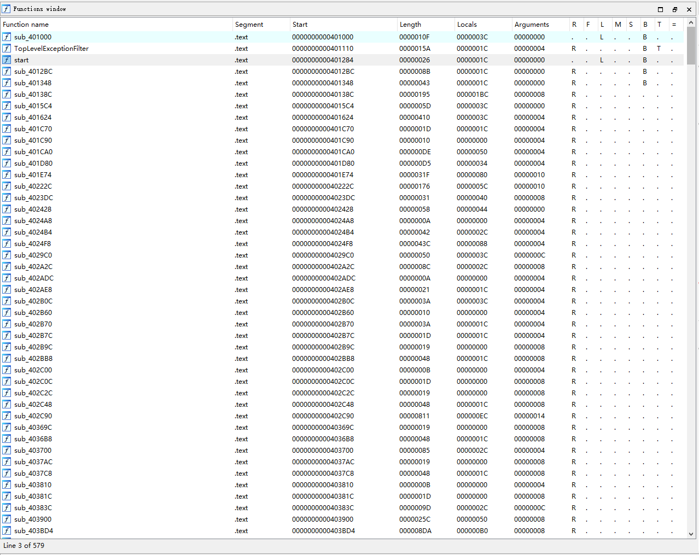

**代码窗口**

右侧是代码窗口，目前正在显示的是汇编代码。

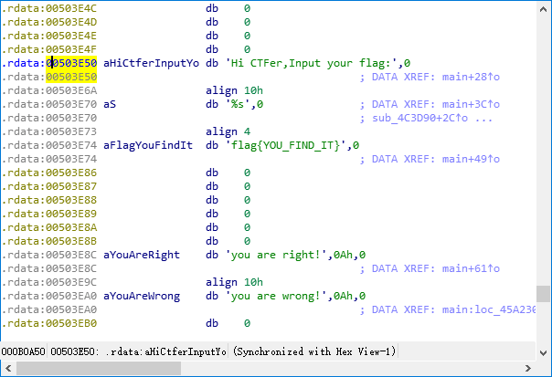

代码窗口中，左边 .radata 代表内存地址，aHiCtferxxxx 是 IDA 为该地址对应数据生成的一个标识符 (别名)，行末是该内存对应的数据

这里的标识符是 IDA 为方便阅读，按照一定规则自动生成的，实际程序运行时，直接使用实际内存地址引用数据，但内存地址不便于记忆，所以 IDA 按可读性进行了生成。

IDA 可以使用两个模式展示反编译的代码：Graph view（graph diassembly view）和 Text view（实际应该叫 text diassembly view）, 默认进入的是 graph view，这里可以使用空格快捷键进行切换。

**输出窗口 out window**

底侧是输出信息日志的窗口，输出窗口展示的是 IDA 以及 IDA 插件输出的相关信息。这些对于分析恶意样本以及样本对系统操作分析提供很多信息。可以通过查看输出在 output 窗口的内容可以获取 IDA 执行加载过程中的相关信息。

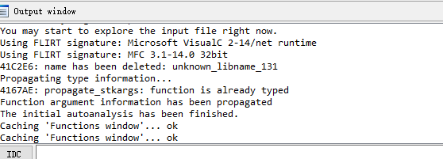

**十六进制窗口 Hex view window**

通过点击 HexView-1 标签可以展示 Hex 窗口。Hex 窗口可以展示一系列的十六进制转储内容以及 ASCII 字符。默认情况下，十六进制窗口（hex window）。默认情况下十六进制窗口同步反编译窗口（disassembly window）内容；也就是在反汇编窗口中选择了一部分字节的数据，相应的在十六进制窗口中同样的会进行标记高亮相关的内容，这对于标记内存地址很有帮助。

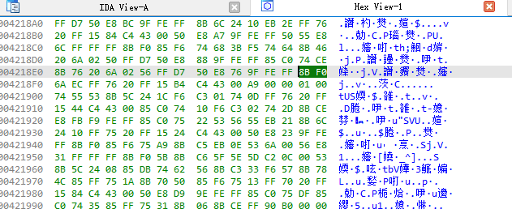

**结构窗口 structures window**

点击 structures windows 标签，可以进入借口窗口。结构窗口展示程序使用的标准的数据结构，并且允许创建自建的数据结构。

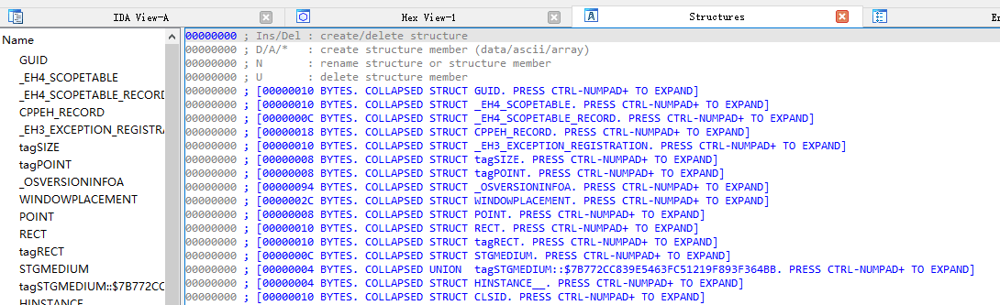

**引用窗口 imports window**

引用窗口是所有二进制程序引用的函数的列表。展示了引用的函数以及相关函数引用的库函数内容。

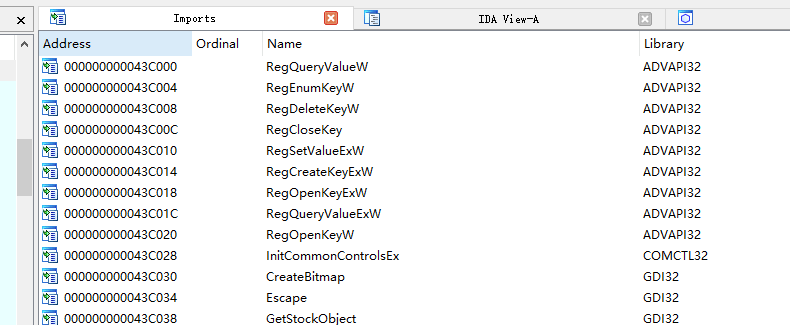

**出口窗口 exports window**

出口窗口展示的是程序出口函数的列，出口函数通常在 DLL 动态链接库中，因此对于分析恶意样本 DLL 时有用。

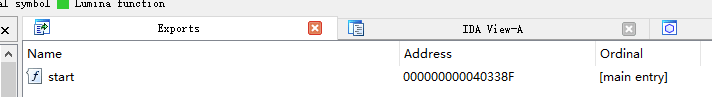

**名字窗口 (Shift+F4)**

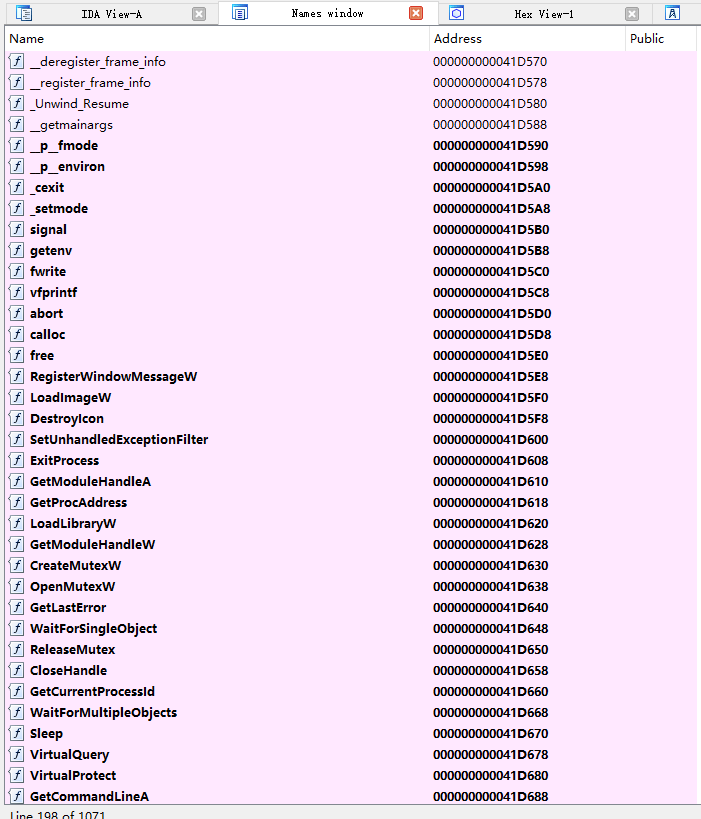

名字窗口展示了 IDA 解析出来的函数名称，字符串名称，变量名称等一些名称字符串。

**字符串窗口 string window (Shift+F12)**

IDA 默认不展示字符窗口，你可以通过点击 view/open subviews/strings（或者使用 Shift+F12 快捷方式打开）字符窗口。字符窗口展示的是从二进制和地址中能够发现字符列表。

默认情况下，字符窗口仅展示长度不小于 5 的 null-terminated ASCII 字符串。有些恶意样本的二进制使用的是 UNICODE 字符。可以通过配置 IDA 显示不同的字符，右击 Setup（或者 Ctrl+U）检测 Unicode C-style（16 比特），点击 ok 即可。

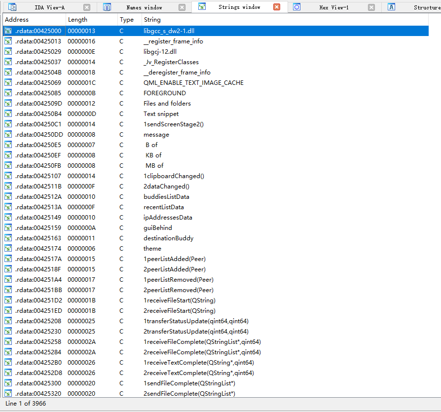

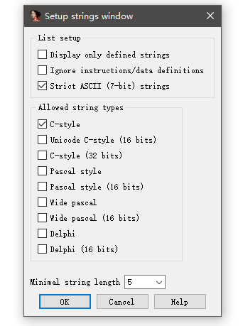

**段窗口 segments window (shift+F7)**

段窗口可以通过 view/open subviews/segments。段窗口是展示（.text,.data 等等）部分内容的列表。显示信息包括开始地址，以及结束地址，每个部分的内存权限。开始和结束的地址都有每个部分的虚拟地址的详细说明，可用于定位对应内存中的位置。

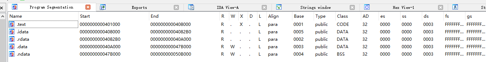

## 图形窗口

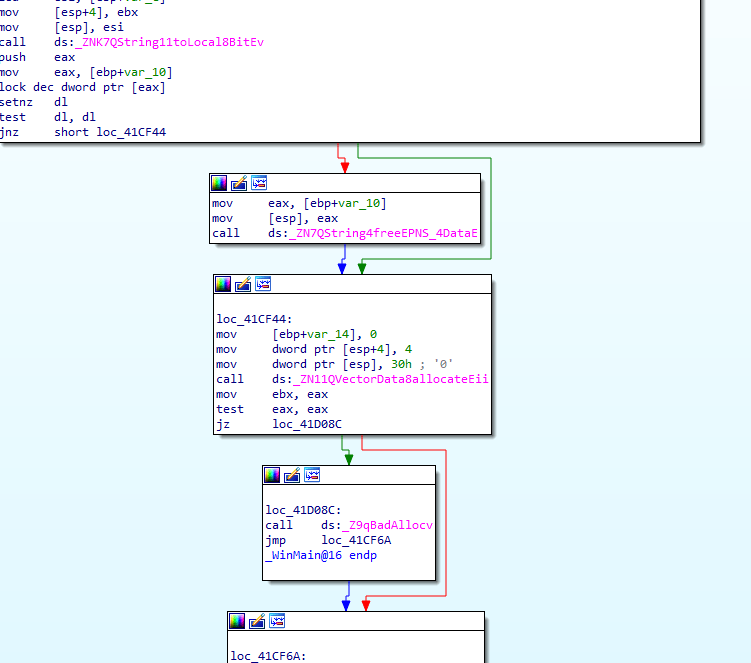

在 graph view 模式下，IDA 一次只显示一个函数，在一个流程图的窗口中函数在基本块区中断。这个模式可以快速识别分支和循环。

在 graph view 中虚拟地址默认不显示（每个基础块仅显示最基本的信息展示）。如果需要显示虚拟地址信息，需要点击 Options/general 然后点击 Line prefixes 以启用。


在 Graph view 模式下，颜色和箭头的指示方向都是根据判断显示的。

条件跳转使用红色和绿色的箭头，true 条件用绿色箭头表示，false 使用红色箭头表示。蓝色的箭头是被用来表示无条件跳转，循环使用的是向上的蓝色的箭头表示。

- 红色箭头表示跳转未执行；
- 绿色箭头表示跳转执行了；
- 蓝色箭头表示无条件跳转。

## 文本窗口

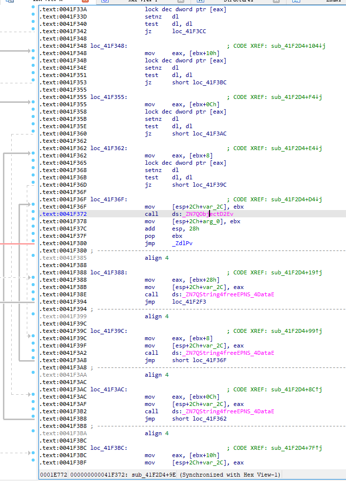

在 text view 模式中，整个反编译目前处于线性方式展示。整个虚拟地址默认展示，`<section name>:<virtual address >` 格式。

在text view窗口中最左边的部分被称为箭头窗口，用于展示程序的非线性流。

- 虚线箭头表示条件跳转
- 实线箭头表示无条件跳转
- 向上的箭头一般代表循环。

---

# 基本操作

- shift + F12 打开 Strings 页面，用于查看程序中所有字符串，在其中 Ctrl + F 查找关键字符串
- 转换伪代码,在引用代码处按 Tab 或 F5

**加载前指定基地址**

将样本拖入 IDA 后勾选 Manual load，然后点击 OK，输入基地址，这样可以在 IDA 进行加载时就执行基址重定向相关工作。同时，这种操作还有另一个好处，可以让 IDA 显示 PE 头部数据。

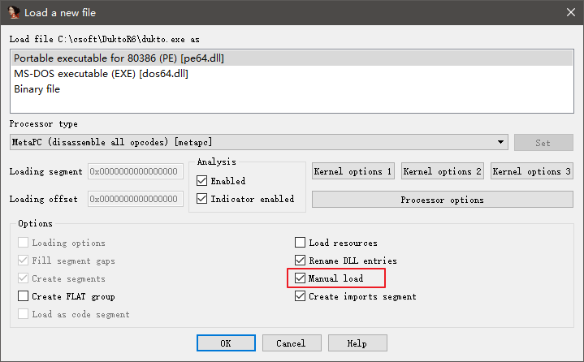

**显示硬编码**

点击顶部菜单栏 Options->Genaral，将 Number of opcode.... 设置为 10，就可以看到硬编码了。

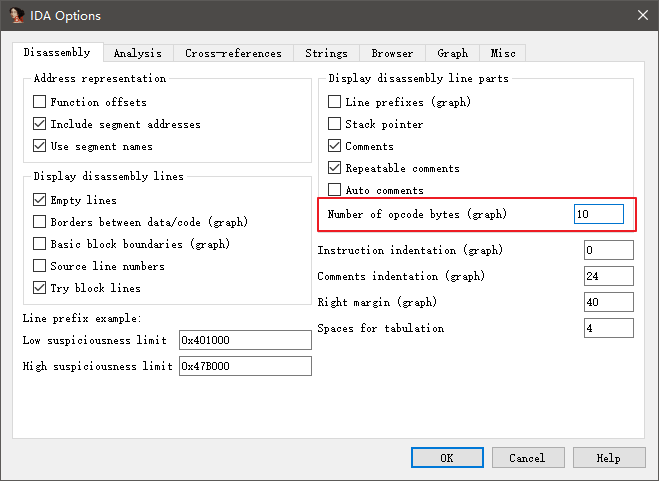

**重置视图排版**

当你乱拖动窗口发现弄不回去了的时候，点击 Reset desktop 可以将各个窗口位置重置，同样的，点击 Save desktop 也可以保存你设置好的窗口布局。

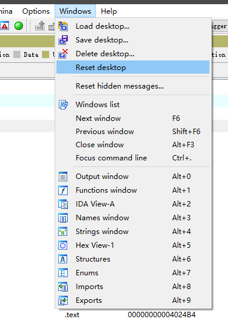

**文件偏移跳转**

IDA 中的地址是内存中拉伸后的地址，当你在 HEX 查看器里发现一些有趣的数据时，可以通过 Jump to file offset 直接输入文件偏移进行跳转，省去了我们手动进行地址转换的时间。


**搜索**

- Alt+T 搜索字符串，可以搜索指令的字符串 如 fs：
- Alt+B 搜索字节数据，如 30 00 00 00。

**识别函数**

当 IDA 无法正确识别一段函数时，可以按 P 手动要求 IDA 识别函数。

Alt+P 可以指定函数的细节，如开始位置，结束位置，是否为 EBP 寻址，参数变量默认长度等。

**重命名地址**

当分析恶意病毒的时候，可以将这些变量或函数改成更有意义的名字。右键变量或者参数名，选择重命名（rename 或者按快捷键 “N”）。当重命名之后 IDA 将会同步新名字到与其相关的项目上.

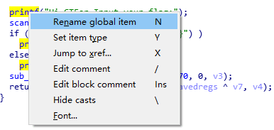

**IDA 标注功能**

标注对于提示某一函数的作用很有帮助。首先将光标放在任何一个反编译列表里的一行中，然后使用快捷键（“:”），通过在新的对话框中填写相关信息并确定，完成相关备注。

**IDA 数据库**

当可执行文件加载到 IDA 中，就会在工作目录中创建一个数据库该数据库一共包含 5 个文件（扩展名为：`.id0`,`.id1`,`.nam`,`.id2` 以及 `.til`）。每一个文件保存了大量的与可执行文件匹配的相关信息。这些文件被压缩和归档到以 `.idb`（32 进制）压缩文件中。当加载可执行程序后，从中读取创建信息保存在数据库中。大量的信息展都保存在数据库中以用于展示代码分析时有用的信息。任何的修改操作（如重命名，注释批注等等）都会显示在 view 中并且般存在数据库中，但是这些修改并不会修改原二进制文件。你可以通过关闭 IDA 保存数据库；当关闭 IDA 的时候将会提示是否保存数据库的提示框。默认情况下数据库包配置（默认配置）会将所有文件保存在 IDB（`.idb`）或者 i64（`.i64`）。当重新打开 `.idb` 或者 `.i64` 文件的时候，会看到重命名的变量和标注都在。

**格式化转化操作数**

IDA 可以将 16 进制值编码为十进制、八进制、二进制。ASCII 也可以转为字符型。例如，如果要修改 41h 格式的值，右击在这个值上选择即可。

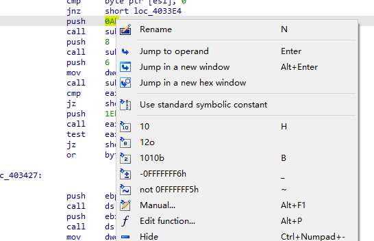

**导航地址**

IDA 的另一个特征是可以在程序中导航任意地址更加方便。当程序被反编译，IDA 就会标记每一个程序中的地址，双击字符则会在显示中跳转到对应字符所在的位置。如函数名或变量。

IDA 保持跟踪导航历史；任何时候被重定向到另外一个地址，都可以使用返回按钮返回之前的地址。

跳转到指定地址可以点击 jump/jump to Address(或者使用快捷键 G) 来跳转到地址。点击 OK 完成跳转。

**查找交叉参考 cross References**

一个程序通常包含很多函数。一个函数可以被一个或多个函数调用，或者调用一个或多个函数。

选中标识符，按 X 找出程序中所有引用该字符串的代码,列出所有的交叉参考

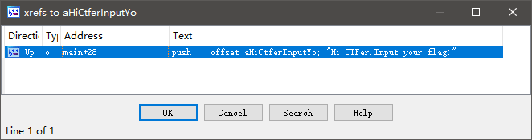

交叉参考可以在审计代码的过程中快速定位字符或者函数的引用。

**Graphs**

右键工具栏，选择Graphs，会显示5个按钮：

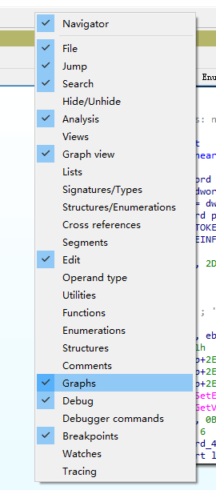

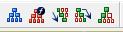

通过点击这5个不同的视图，可以分别展示不同的展示方式

从左到右依次是:
* 展示当前函数的外部流图表。展示的图形与IDA的交互视角很像。
* 展示当前函数的调用视图；这可以用来快速查看程序中函数调用关系情况；但如果程序的函数很多的话，这个视图就会显得非常大，被塞满。
* 这个视图显示一个函数的被交叉引用情况；如果想看一个程序的访问某个函数的不同路径，这个视图就相对比较清晰。
* 这个视图展示的是一个函数的交叉引用其他函数的情况；可以很清晰的展示函数调用所有其他函数。
* 这是一个自定义交叉引用视图，这个功能可以允许使用者定义交叉引用的一些视图生成内容和方式。
