# Volatility

<p align="center">
    
</p>

---

## 免责声明

`本文档仅供学习和研究使用,请勿使用文中的技术源码用于非法用途,任何人造成的任何负面影响,与本人无关.`

---

**简介**

Volatility 是一个用于事件响应和恶意软件分析的开源内存取证框架。它是用 Python 编写的，支持 Microsoft Windows，macOS 和 Linux，volatility 框架是一个完全开放的工具集合，在 GNU 通用许可证下用 Python 实现，用于从易失性存储器（RAM）样本中提取数字镜像。提取技术完全独立于被取证的系统而执行，但可以查看到系统运行时的状态信息。该框架旨在向人们介绍从内存样本中提取的数字镜像相关的技术，并为进一步研究该领域提供一个平台，它可以分析 .raw、.vmem、.img 后缀的文件。

支持原始数据转储(Raw Dump)、崩溃转储(Crash Dump)、休眠文件及各种其它格式，甚至可以支持多个格式之间的转换。

**官网**
- [The Volatility Foundation](https://www.volatilityfoundation.org/)

**项目地址**
- [Volatility](https://github.com/volatilityfoundation/volatility)

**相关文章**
- [CTF| 攻击取证之内存分析](https://cloud.tencent.com/developer/article/1419462)
- [电子取证(Forensics)-Windows取证基础](https://bbs.ichunqiu.com/thread-59102-1-1.html)
- [Linux下内存取证工具Volatility的使用](http://blog.md5.red/?p=553)
- [Volatility 为Centos6.6系统做profile方法](https://blog.csdn.net/LOVE_JFJ/article/details/51984362)
- [Linux Memory Analysis: How to Start and What You Need to Know](https://www.linkedin.com/pulse/linux-memory-analysis-how-start-what-you-need-know-james-bower)
- [LinuxMemoryForensics.wiki](https://code.google.com/archive/p/volatility/wikis/LinuxMemoryForensics.wiki)
- [利用Volatility进行Windows内存取证分析(一)：初体验](https://www.freebuf.com/sectool/124690.html)
- [利用Volatility进行Windows内存取证分析(二)：内核对象、内核池学习小记](https://www.freebuf.com/sectool/124800.html)

**视频教程**
- [Investigating Malware Using Memory Forensics - A Practical Approach](https://www.youtube.com/watch?v=BMFCdAGxVN4)

**Profile 资源**
- [KDPryor/LinuxVolProfiles](https://github.com/KDPryor/LinuxVolProfiles) - Volatility Linux Profiles
- [volatilityfoundation/profiles](https://github.com/volatilityfoundation/profiles) - Volatility profiles for Linux and Mac OS X

**扩展插件**
- [aim4r/VolDiff](https://github.com/aim4r/VolDiff) - 利用 Volatility 框架来识别 Windows 7 内存中恶意软件威胁的 Python 脚本
- [JamesHabben/evolve](https://github.com/JamesHabben/evolve) - Web 界面版的 Volatility
- [kevthehermit/VolUtility](https://github.com/kevthehermit/VolUtility) - Web 界面版的 Volatility
- [andreafortuna/autotimeliner](https://github.com/andreafortuna/autotimeliner) - 自动从 memory dump 中提取取证时间线
- [superponible/volatility-plugins](https://github.com/superponible/volatility-plugins)

---

# 安装及维护

**Ubuntu 下安装**
```bash
apt-get install -y volatility
apt-get install -y python-dev
apt-get install -y python3-dev
python2 -m pip install distorm3 yara pycrypto openpyxl ujson pil
python2 -m pip install Crypto
python2 -m pip install pycryptodome
python2 -m pip install pytz
python2 -m pip install Pillow
python2 -m pip install yara-python

cd /tmp
git clone https://github.com/gdabah/distorm
cd distorm
python2 -m pip install distorm3

volatility --info
```

**kali 下安装**
```bash
cd /tmp
wget https://bootstrap.pypa.io/get-pip.py
python2 get-pip.py
python2 -m pip install --upgrade pip
apt-get install -y python-dev
apt-get install -y python3-dev
python2 -m pip install distorm3 yara pycrypto openpyxl ujson pil
python2 -m pip install Crypto
python2 -m pip install pycryptodome
python2 -m pip install pytz
python2 -m pip install Pillow
python2 -m pip install yara-python

cd /tmp
git clone https://github.com/gdabah/distorm
cd distorm
python2 -m pip install distorm3

cd
git clone https://github.com/volatilityfoundation/volatility.git
cd volatility
python setup.py build
python setup.py install

python vol.py --info
```

**centos 下安装**
```bash
yum install -y kernel-devel
yum install -y make gcc gcc-c++
yum groupinstall -y "Development Tools"
yum install -y yum-utils
yum install -y pcre-devel libpcre++-devel python-devel pycrypto

pip install --upgrade pip
python2 -m pip install distorm3==3.4.4
python2 -m pip install yara pycrypto openpyxl ujson pil
python2 -m pip install Crypto
python2 -m pip install pycryptodome
python2 -m pip install pytz
python2 -m pip install Pillow
python2 -m pip install yara-python

cd
git clone https://github.com/volatilityfoundation/volatility.git
cd volatility
python setup.py build
python setup.py install

python vol.py --info
```

**windows 下安装**

直接访问官网下载二进制文件 https://www.volatilityfoundation.org/releases

---

# 使用

**基本用法**

```bash
volatility -f [image] --profile=[profile] [plugin]
    eg：volatility -f /opt/test.vmem -profile=Win7SP1x86 pslist

    -h      # 查看相关参数及帮助说明
    -info   # 查看相关模块名称及支持的 Windows 版本
    -f      # 指定要打开的内存镜像文件及路径
    -d      # 开启调试模式
    -v      # 开启显示详细信息模式 (verbose)

# 如果是从 github 下载的
python vol.py -f [image] ‐-profile=[profile] [plugin]
```

**Volatility 支持的插件列表**
```bash
amcache             # 查看 AmCache 应用程序痕迹信息
apihooks            # 检测内核及进程的内存空间中的 API hook
atoms               # 列出会话及窗口站 atom 表
atomscan            # Atom 表的池扫描(Pool scanner)
auditpol            # 列出注册表 HKLM\SECURITY\Policy\PolAdtEv 的审计策略信息
bigpools            # 使用 BigPagePoolScanner 转储大分页池(big page pools)
bioskbd             # 从实时模式内存中读取键盘缓冲数据(早期电脑可以读取出 BIOS 开机密码)
cachedump           # 获取内存中缓存的域帐号的密码哈希
callbacks           # 打印全系统通知例程
clipboard           # 提取 Windows 剪贴板中的内容
cmdline             # 显示进程命令行参数
cmdscan             # 提取执行的命令行历史记录（扫描_COMMAND_HISTORY 信息）
connections         # 打印系统打开的网络连接(仅支持 Windows XP 和 2003)
connscan            # 打印 TCP 连接信息
consoles            # 提取执行的命令行历史记录（扫描_CONSOLE_INFORMATION 信息）
crashinfo           # 提取崩溃转储信息
deskscan            # tagDESKTOP 池扫描(Poolscaner)
devicetree          # 显示设备树信息
dlldump             # 从进程地址空间转储动态链接库
dlllist             # 打印每个进程加载的动态链接库列表
driverirp           # IRP hook 驱动检测
drivermodule        # 关联驱动对象至内核模块
driverscan          # 驱动对象池扫描
dumpcerts           # 提取 RAS 私钥及 SSL 公钥
dumpfiles           # 提取内存中映射或缓存的文件
dumpregistry        # 转储内存中注册表信息至磁盘
editbox             # 查看 Edit 编辑控件信息 (Listbox 正在实验中)
envars              # 显示进程的环境变量
eventhooks          # 打印 Windows 事件 hook 详细信息
evtlogs             # 提取 Windows 事件日志(仅支持 XP/2003)
filescan            # 提取文件对象（file objects）池信息
gahti               # 转储用户句柄（handle）类型信息
gditimers           # 打印已安装的 GDI 计时器 (timers) 及回调(callbacks)
gdt                 # 显示全局描述符表(Global Descriptor Table)
getservicesids      # 获取注册表中的服务名称并返回 SID 信息
getsids             # 打印每个进程的 SID 信息
handles             # 打印每个进程打开的句柄的列表
hashdump            # 转储内存中的 Windows 帐户密码哈希(LM/NTLM)
hibinfo             # 转储休眠文件信息
hivedump            # 打印注册表配置单元信息
hivelist            # 打印注册表配置单元列表
hivescan            # 注册表配置单元池扫描
hpakextract         # 从 HPAK 文件（Fast Dump 格式）提取物理内存数据
hpakinfo            # 查看 HPAK 文件属性及相关信息
idt                 # 显示中断描述符表(Interrupt Descriptor Table)
iehistory           # 重建 IE 缓存及访问历史记录
imagecopy           # 将物理地址空间导出原生 DD 镜像文件
imageinfo           # 查看 / 识别镜像信息
impscan             # 扫描对导入函数的调用
joblinks            # 打印进程任务链接信息
kdbgscan            # 搜索和转储潜在 KDBG 值
kpcrscan            # 搜索和转储潜在 KPCR 值
ldrmodules          # 检测未链接的动态链接 DLL
lsadump             # 从注册表中提取 LSA 密钥信息（已解密）
machoinfo           # 转储 Mach-O 文件格式信息
malfind             # 查找隐藏的和插入的代码
mbrparser           # 扫描并解析潜在的主引导记录(MBR)
memdump             # 转储进程的可寻址内存
memmap              # 打印内存映射
messagehooks        # 桌面和窗口消息钩子的线程列表
mftparser           # 扫描并解析潜在的 MFT 条目
moddump             # 转储内核驱动程序到可执行文件的示例
modscan             # 内核模块池扫描
modules             # 打印加载模块的列表
multiscan           # 批量扫描各种对象
mutantscan          # 对互斥对象池扫描
notepad             # 查看记事本当前显示的文本
objtypescan         # 扫描窗口对象类型对象
patcher             # 基于页面扫描的补丁程序内存
poolpeek            # 可配置的池扫描器插件
printkey            # 打印注册表项及其子项和值
privs               # 显示进程权限
procdump            # 进程转储到一个可执行文件示例
pslist              # 按照 EPROCESS 列表打印所有正在运行的进程
psscan              # 进程对象池扫描
pstree              # 以树型方式打印进程列表
psxview             # 查找带有隐藏进程的所有进程列表
qemuinfo            # 转储 Qemu 信息
raw2dmp             # 将物理内存原生数据转换为 windbg 崩溃转储格式
screenshot          # 基于 GDI Windows 的虚拟屏幕截图保存
servicediff         # Windows 服务列表(ala Plugx)
sessions            # _MM_SESSION_SPACE 的详细信息列表(用户登录会话)
shellbags           # 打印 Shellbags 信息
shimcache           # 解析应用程序兼容性 Shim 缓存注册表项
shutdowntime        # 从内存中的注册表信息获取机器关机时间
sockets             # 打印已打开套接字列表
sockscan            # TCP 套接字对象池扫描
ssdt                # 显示 SSDT 条目
strings             # 物理到虚拟地址的偏移匹配(需要一些时间，带详细信息)
svcscan             # indows 服务列表扫描
symlinkscan         # 符号链接对象池扫描
thrdscan            # 线程对象池扫描
threads             # 调查_ETHREAD 和_KTHREADs
timeliner           # 创建内存中的各种痕迹信息的时间线
timers              # 打印内核计时器及关联模块的 DPC
truecryptmaster     # 恢复 TrueCrypt 7.1a 主密钥
truecryptpassphrase # 查找并提取 TrueCrypt 密码
truecryptsummary    # TrueCrypt 摘要信息
unloadedmodules     # 打印卸载的模块信息列表
userassist          # 打印注册表中 UserAssist 相关信息
userhandles         # 转储用户句柄表
vaddump             # 转储 VAD 数据为文件
vadinfo             # 转储 VAD 信息
vadtree             # 以树形方式显示 VAD 树信息
vadwalk             # 显示遍历 VAD 树
vboxinfo            # 转储 Virtualbox 信息（虚拟机）
verinfo             # 打印 PE 镜像中的版本信息
vmwareinfo          # 转储 VMware VMSS/VMSN 信息
volshell            # 内存镜像中的 shell
windows             # 打印桌面窗口(详细信息)
wintree             # Z 顺序打印桌面窗口树
wndscan             # 池扫描窗口站
yarascan            # 以 Yara 签名扫描进程或内核内存
```

**Linux 内存取证插件参数**
```bash
# 获取系统进程信息相关命令
linux_pstree        # 进程树列表
linux_pslist_cache  # 来自的 kmem_cache 活动进程
linux_psxview       # 比较进程列表
linux_lsof          # 打开文件描述符的每个活动进程
linux_pslist        # 活动的进程列表
linux_psaux         # 活动的进程列表（输出内容包括更多的细节）

# 获取系统内存信息的相关命令
linux_memmap        # 内存映射文件
linux_pidhashtable  # Linux 内核中的 PID 散列表
linux_proc_maps     # 转储由-s/-vma 参数到磁盘上指定的内存范围。
linux_dump_map      # 进程内存的详细信息，包括堆和共享库。
linux_bash          # bash 历史文件

# 获取网络接口信息的相关命令
linux_arp           # 显示 arp 列表
linux_ifconfig      # 显示网络接口详细情况
linux_route_cache   # 显示网络路由表
linux_netstat       # 查看网络链接情况

# 获取系统硬件信息的相关命令
linux_cpuinfo       # 显示 cpu 的相关命令信息。
linux_dmesg         # 显示内核缓存信息。
linux_iomem         # 显示 io 设备信息。
linux_mount         # 显示/proc/mouns 的相关命令信息，主要是挂载的磁盘设备。
linux_mount_cache   # 显示 kmem_cache 的相关命令信息。
linux_slabinfo      # 显示/proc/slabinfo 的相关命令信息。

# rootkit 检测的相关命令
linux_check_afinfo  # 检查篡改网络协议结构。
linux_check_creds   # 检查进程共享结构。
linux_check_fop     # 检查文件操作数据结构篡改情况。
linux_check_idt     # 检查中断描述符表（IDT）的篡改情况。
linux_check_syscall # 在系统调用表检查功能情况。
linux_check_modules # 检查用于从内核模块列表中缺少在 sysfs 中的项目。

# 获取内核模块信息的相关命令
linux_lsmod         # 加载内核模块。
linux_tmpfs         # tmpfs 的内容。
```

**获取镜像信息**

首先获取镜像的摘要信息，一般这是进行镜像分析的第一步
```bash
volatility -f [image] imageinfo
```

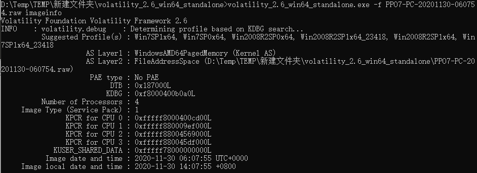

这其中比较有用的信息就是 Suggested Profile(s) ，这个是工具识别的系统版本，存在多个的原因是这是根据一些特征识别的，所以可能有误报，就把各种结果按照可能性排列出来了，一般直接选择第一个，如果加载插件报错的话，可以尝试后面的。

这里根据给出的结果选择第一个，然后使用 pslist 插件，看一下系统中运行的进程。

## 进程

**按照 EPROCESS 列表列出所有正在运行的进程**
```bash
volatility -f [image] --profile=[profile] pslist
```


如图中 lsass.exe、winlogon.exe ,在 windows 本地登录时，用户的密码存储在 `%SystemRoot%\system32\config\SAM` 这个文件里。当用户输入密码进行本地认证的过程中，所有的操作都是在本地进行的。他其实就是将用户输入的密码转换为 NTLM Hash，然后与 SAM 中的 NTLM Hash 进行比较。当用户注销、重启、锁屏后，操作系统会让 winlogon 显示登录界面，也就是输入框。当 winlogon.exe 接收输入后，将密码交给 lsass 进程，这个进程中会存一份明文密码，将明文密码加密成 NTLM Hash，对 SAM 数据库比较认证。

notepad.exe 是指正在运行一个记事本程序，而 mspaint.exe 是指是微软画图程序， cmd.exe 指正在运行命令行程序

**显示隐藏/终止的进程**
```bash
volatility -f [image] --profile=[profile] psscan
```

**以 dot 图的形式导出**
```bash
python vol.py -f [image] --profile=[profile] psscan --output=dot --output-file=out.dot

apt install -y xdot
```

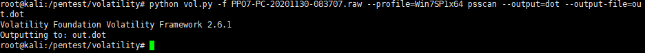

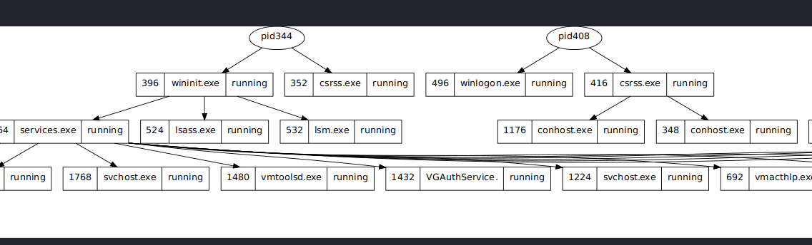

**把进程以树的形式显示**
```bash
volatility -f [image] --profile=[profile] pstree
```

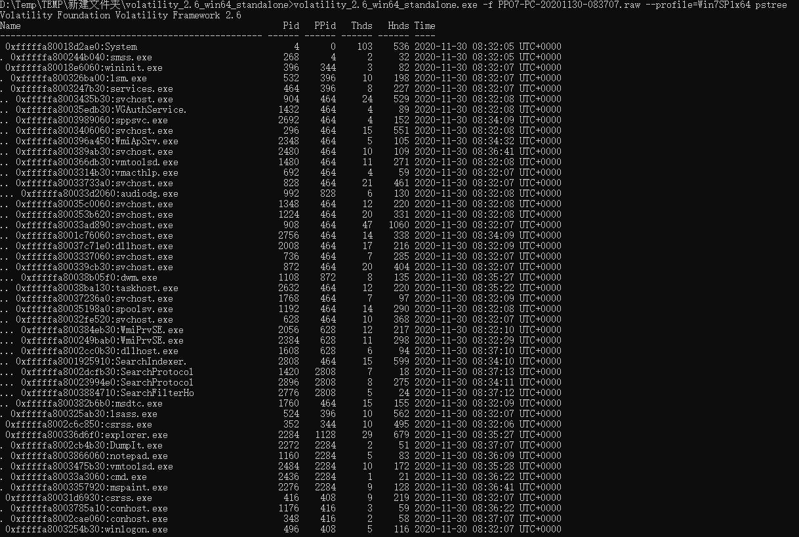

**查看 DLL 文件**

当我们发现可疑进程后，可通过此命令进行深度查看
```bash
volatility -f [image] --profile=[profile] dlllist -p [pid]
```

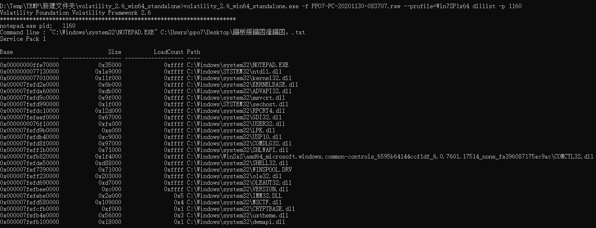

**转储出可寻址的内存数据**

在上面的进程中可以看到，存在一个 mspaint.exe 的进程，它是微软的画图软件，对于这样的情况，可以使用工具还原内存中的图片, 来当时查看的图片或者当时状态的图片，使用的工具是 gimp，可以在 linux 上安装使用。

这里首先将 mspaint.exe 的进程内存 dump 出来，使用 memdump 插件，在之前列举进程的截图中，进程名字后面一行就是该进程的 PID。

```bash
volatility -f [image] --profile=[profile] memdump -p [pid] --dump-dir ./
```

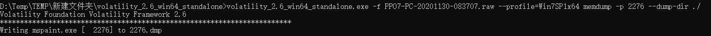

将获取到的 2276.dmp 文件改名为 2276.data，然后在 gime 中点击显示全部文件，选择 2276.data 打开
```bash
add-apt-repository ppa:otto-kesselgulasch/gimp
apt-get update
apt-get install -y gimp     # 安装 gimp
gimp                        # 启动 gimp
mv 2276.dmp 2276.data
```

首先选择一个固定的宽度，这里选择 1000，然后调节高度把屏幕铺满，然后再大幅度拖动 Image 下的 Offset 的滑块，当看到图片类似下图时停止，可以看到隐隐约约有一张图，但是有点重叠，这时，点击上下箭头缓慢调节 Width，其中 Heigth 在调节中作用是不大的，主要是 Width 和 Offset 的调节决定是否能看到图片

微调位移为图像的左右方向平移，大幅调节位移则是图像的上下方向平移。而宽度不变时，始终显示的都是同一幅图像。

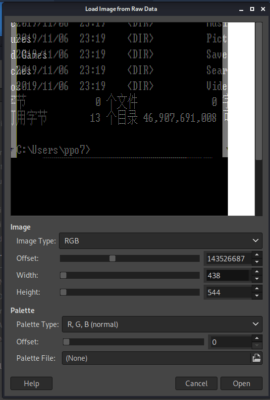

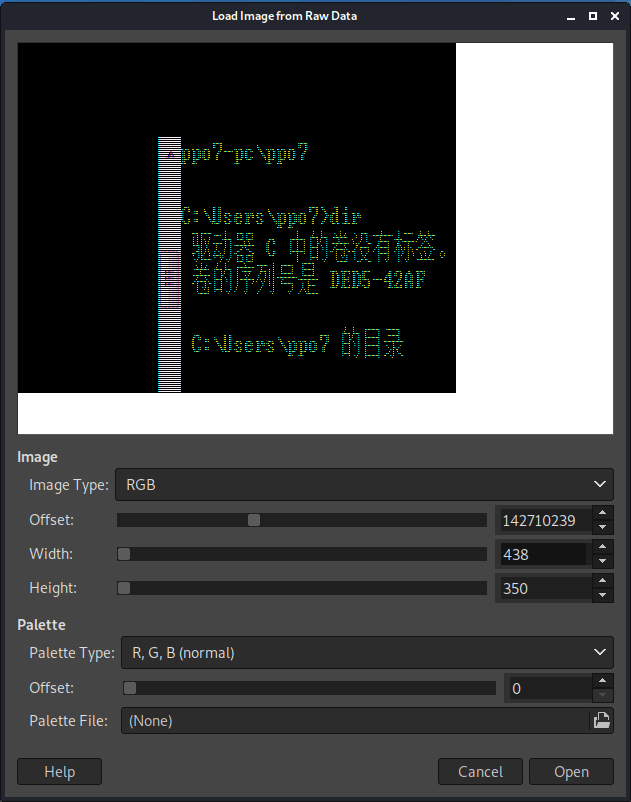

在调节时，不仅仅只能看到画图程序的图片，如下图，就调出了另一个状态的一个系统图片

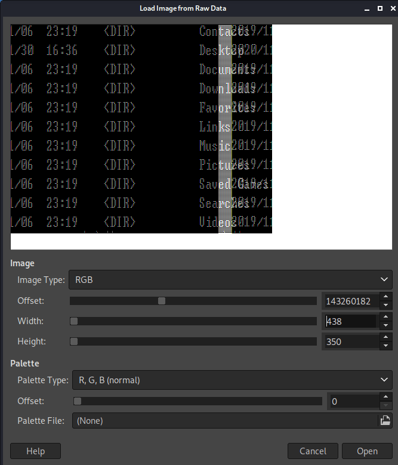

**获取运行过的命令**

在上面查看进程时，可以看到存在一个 cmd 进程，那么可以使用 cmdscan 插件来查看运行过的命令，

```bash
volatility -f [image] --profile=[profile] cmdscan
```

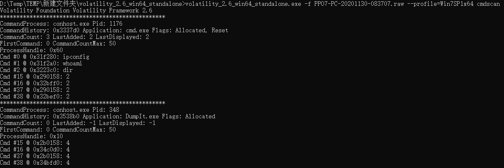

可以看到执行了 whoami、ifconfig、ipconfig 这三个命令

**查看进程命令行参数**
```bash
volatility -f [image] --profile=[profile] cmdline
```

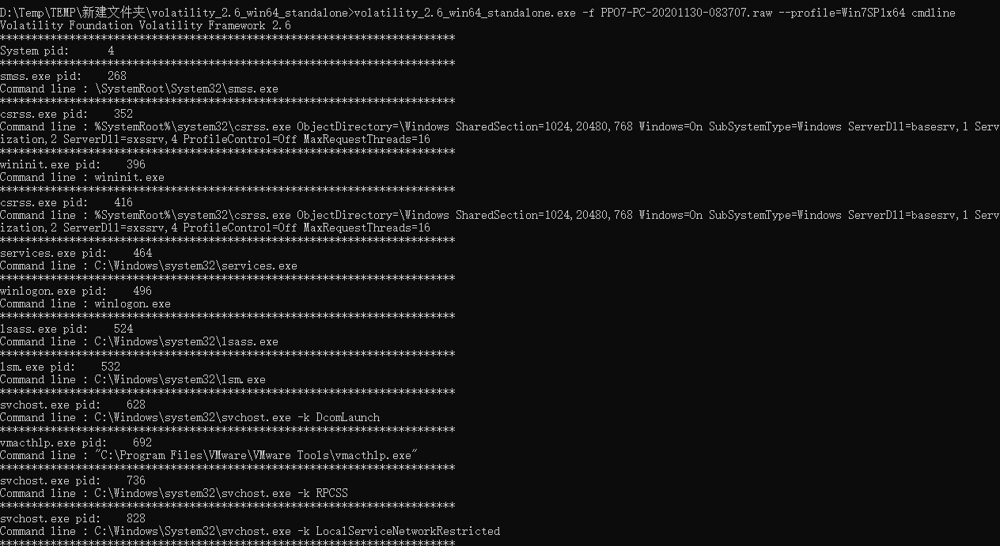

---

## 信息

**获取记事本数据**
```bash
volatility -f [image] --profile=[profile] notepad

# 当上面这个插件不支持这个系统，这时可以使用 editbox 查看

volatility -f [image] --profile=[profile] editbox
```
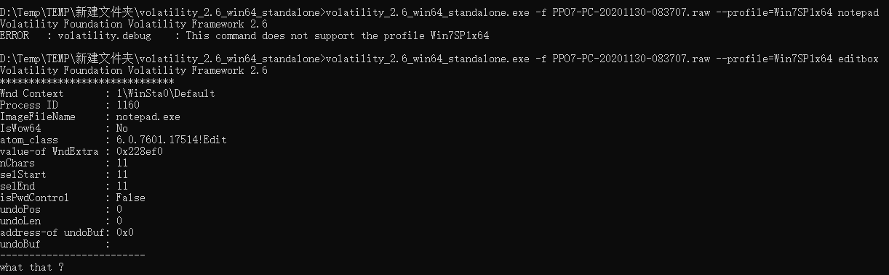

**查看当前桌面截图**

可以使用 screenshot 查看查看当前桌面的伪截图，其中会显示桌面上窗口的框，不会显示其中的内容
```bash
volatility -f [image] --profile=[profile] screenshot --dump-dir ./
```

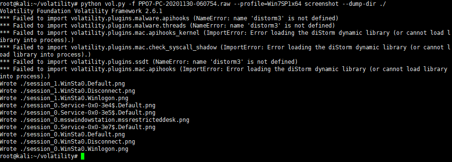

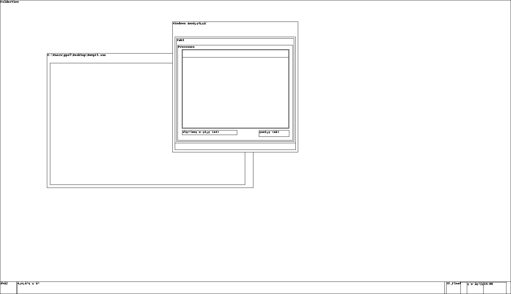

**获取系统中的用户以及密码**
```bash
volatility -f [image] --profile=[profile] hashdump
```

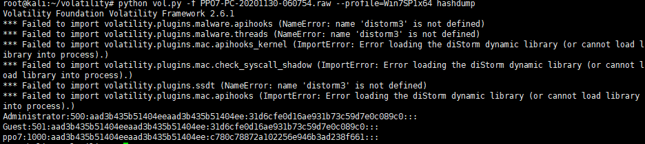

**查看剪切版中的信息**
```bash
volatility -f [image] --profile=[profile] clipboard
```

**扫一下 ie 浏览记录**
```bash
volatility -f [image] --profile=[profile] yarascan
```

---

## 文件

**查看系统中的文件**

通过 filescan 命令，可以扫描当前状态下的一些文件，例如桌面的文件，或者特定类型的文件，这些都是结合 grep 命令来实现的
```bash
volatility -f [image] --profile=[profile] filescan | grep -E "zip|txt|doc|pdf"
```

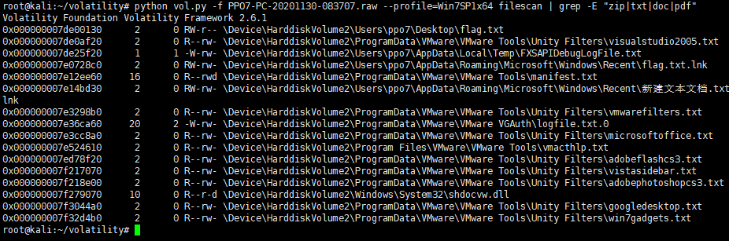

查看桌面的文件
```bash
volatility -f [image] --profile=[profile] filescan | grep  "Desktop"
```

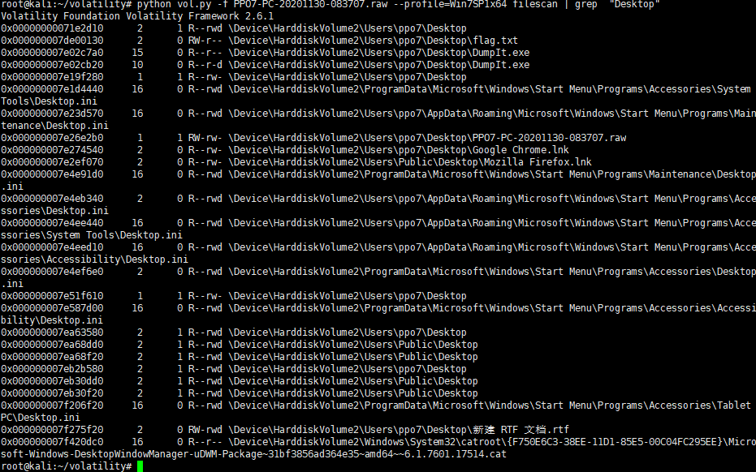

**dump 扫描到的文件**

在上一步中，发现了桌面的一个 flag.txt，那么可以使用 dumpfiles 命令来将文件 dump 出来
```bash
volatility -f [image] --profile=[profile] dumpfiles -Q 0x000000007de00130 --dump-dir ./

# 这里的 -Q 参数是前面扫描时候的第一个参数，标记了文件的转储的物理地址
```

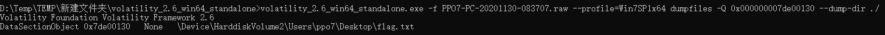

dump 出的文件默认是 dat 后缀的，可以使用 linux 下的 file 命令来查看获取的文件类型，或者是根据之前扫描文件获取到的文件名来修改后缀

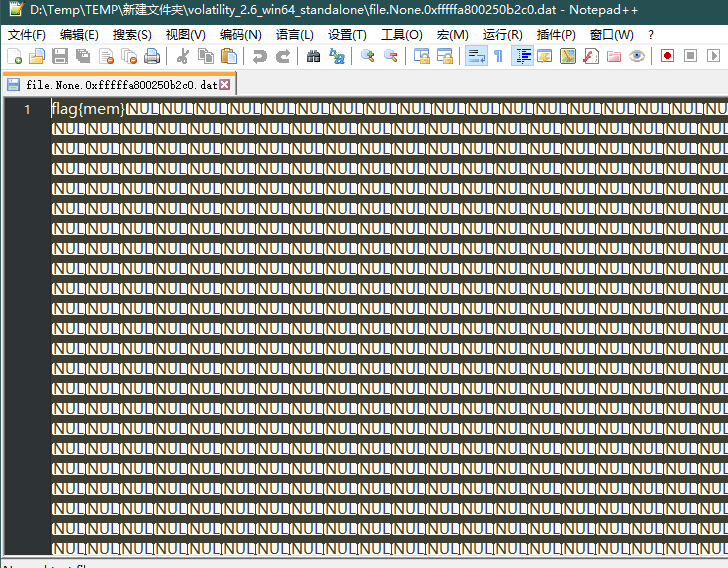

**转储内存中的进程里 exe 文件**
```bash
volatility -f [image] --profile=[profile] procdump -p [pid] --dump-dir ./
```

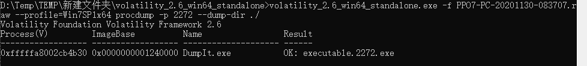

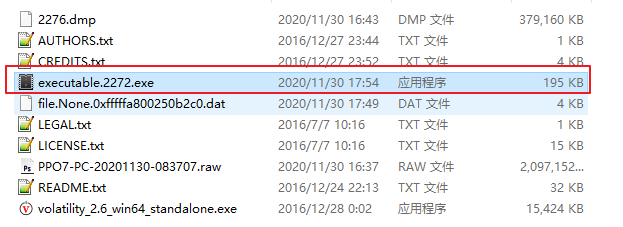

---

## 网络

**查看系统开放端口以及连接情况**
```bash
volatility -f [image] --profile=[profile] netscan
```

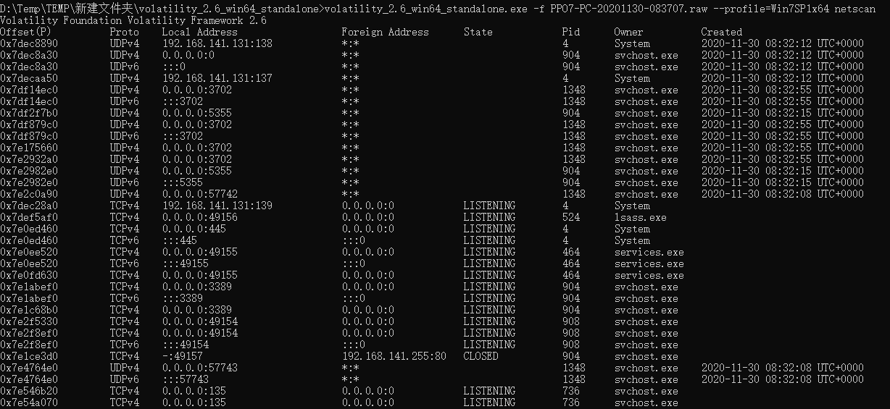

---

## 注册表信息

**打印注册表项及其子项和对应的值**
```bash
volatility -f [image] --profile=[profile] printkey -K "SAM\Domains\Account\Users\Names"
```

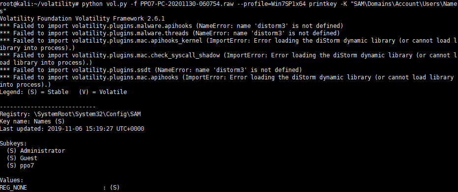

**列出注册表配置文件中的注册表信息**
```bash
volatility -f [image] --profile=[profile] hivelist
```

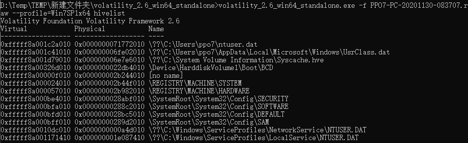

**打印内存中指定的注册表信息**
```bash
volatility -f [image] --profile=[profile] hivedump -o 0xfffff8a000bff010
# -o 跟虚拟地址
```

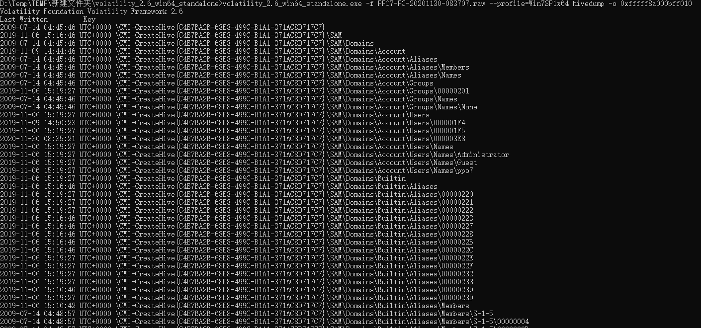

---

# Linux Profile

**使用第三方 Profile**

在 https://github.com/KDPryor/LinuxVolProfiles 处直接下载已经做好的 profile 文件（zip 文件）然后复制到目录后解压缩即可。
```bash
git clone https://github.com/KDPryor/LinuxVolProfiles.git
cd LinuxVolProfiles
mv Ubuntu-3.8.0-19.zip /volatility/volatility/plugins/overlays/linux/
cd /volatility/volatility/plugins/overlays/linux
unzip Ubuntu-3.8.0-19.zip
```

**制作 Profile**

Volatility 自带一些 windows 系统的 profile，Linux 系统的 Profile 需要自己制作，制作的方法如下：实际是将 module.dwarf 和 system.map 打包成一个 zip 文件，接着将 zip 文件移动到 volatility/plugins/overlays/linux/ 目录中。

这里以 centos7 为例,先安装 dwarfdump(必须安装，创建 module.dwarf 文件的依赖)
```bash
yum install -y gcc make gcc-c++
yum install -y elfutils-devel
yum install -y kernel-devel
wget https://www.prevanders.net/libdwarf-20201201.tar.gz
tar -zxvf libdwarf-20201201.tar.gz
cd libdwarf-20201201
./configure
make
make install
cd ../
```

在 volatility 目录中的 tool/Linux 运行 make 命令来创建 module.dwarf 文件
```bash
git clone https://github.com/volatilityfoundation/volatility.git
cd volatility/tools/linux

make
ls -l
```

打包,将 centos7.zip 移至分析机的 volatility/plugins/overlays/linux/ 目录中
```bash
zip centos7.zip /boot/System.map* module.dwarf
```

在分析机上将 centos7.zip 至 volatility/plugins/overlays/linux/ 目录中
```
mv centos7.zip /pentest/volatility/plugins/overlays/linux/
python vol.py --info | grep "centos7"
```

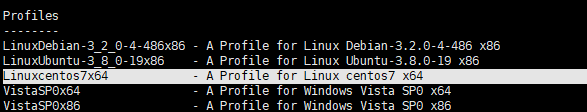


**实战 linux 分析**

> 住:这里 LiME 导出的无法成功解析,不知道原因

直接复制 centos7 的内存文件，放到分析机上，查看进程树列表
```bash
python vol.py -f tmp.vmem --profile=Linuxcentos7x64 linux_pstree
```

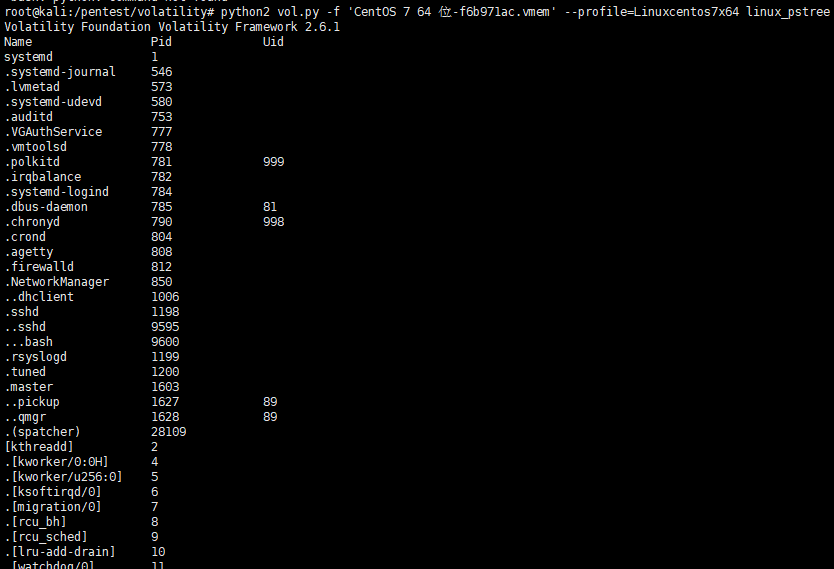

显示网络接口详细情况

```bash
python vol.py -f tmp.vmem --profile=Linuxcentos7x64 linux_pstree
```

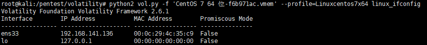

查看某具体进程的情况

```bash
python vol.py -f tmp.vmem --profile=Linuxcentos7x64 linux_proc_maps
```
