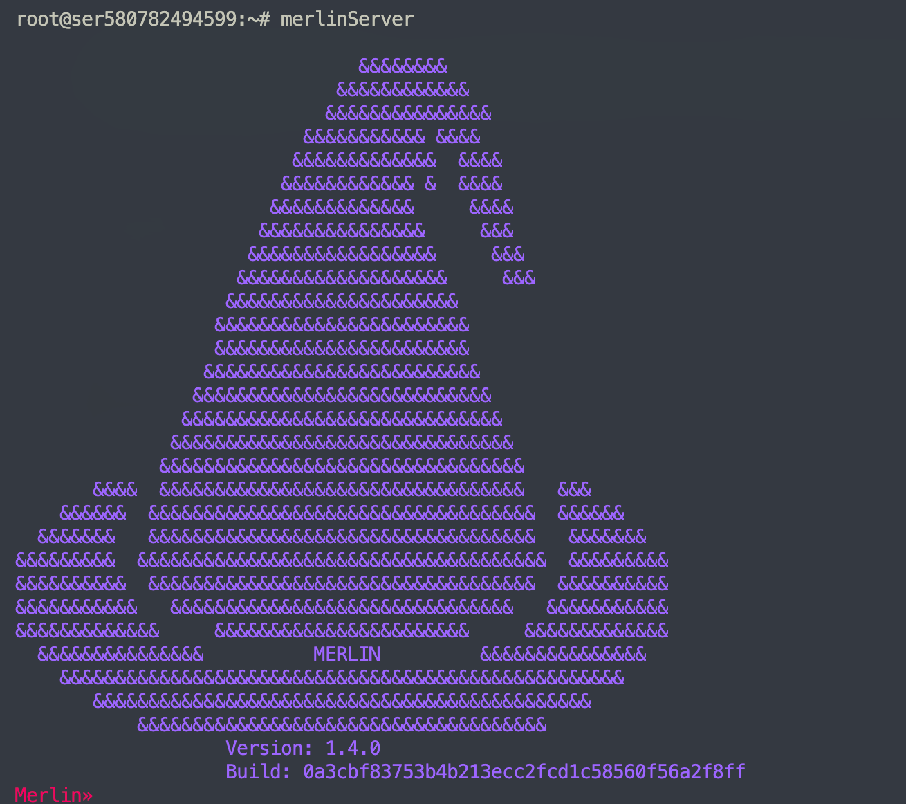
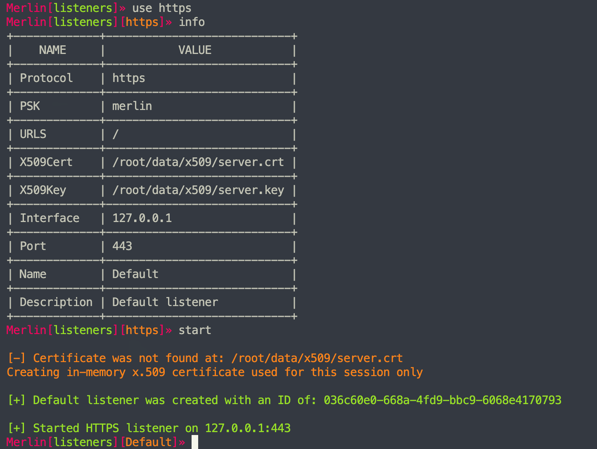
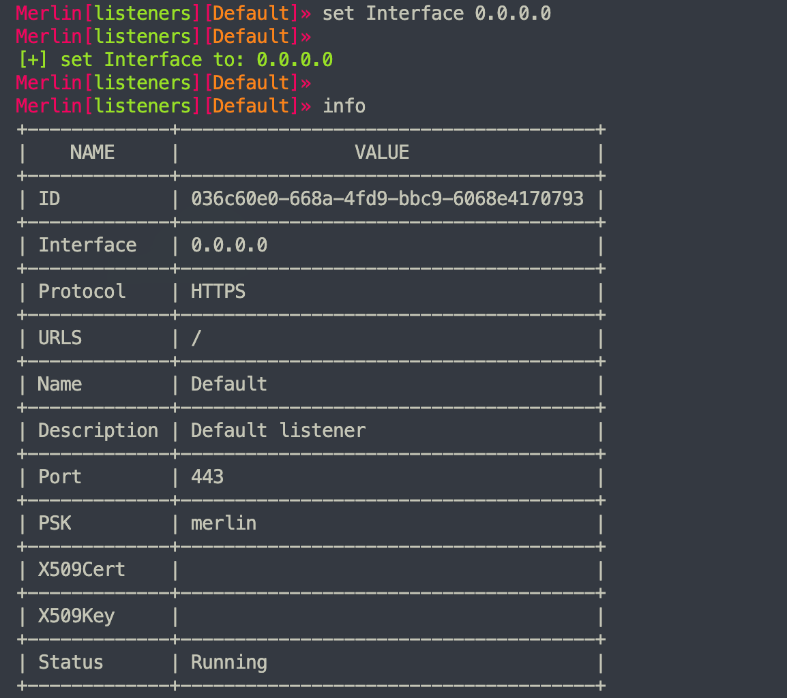
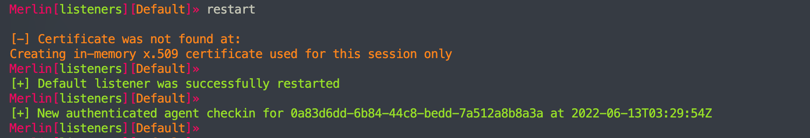
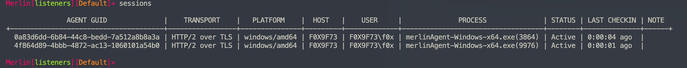
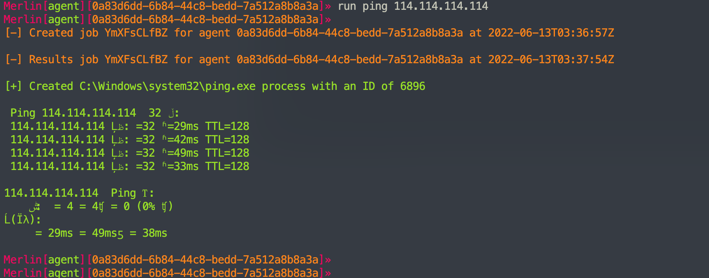

# merlin

---

## 免责声明

`本文档仅供学习和研究使用,请勿使用文中的技术源码用于非法用途,任何人造成的任何负面影响,与本人无关.`

---

**项目地址**
- https://github.com/Ne0nd0g/merlin
    - https://github.com/Ne0nd0g/merlin-agent
    - https://github.com/its-a-feature/Mythic
    - https://github.com/MythicAgents/merlin

**使用文档**
- https://merlin-c2.readthedocs.io/en/latest/index.html

---

## 安装

**Server 安装**
```bash
mkdir /opt/merlin;cd /opt/merlin
wget https://github.com/Ne0nd0g/merlin/releases/latest/download/merlinServer-Linux-x64.7z
7z x merlinServer-Linux-x64.7z  # 密码 merlin
sudo ./merlinServer-Linux-x64
```

**Agent 下载**
```
https://github.com/Ne0nd0g/merlin/releases/download/v1.4.1/merlinAgent-Darwin-x64.7z
https://github.com/Ne0nd0g/merlin/releases/download/v1.4.1/merlinAgent-Linux-x64.7z
https://github.com/Ne0nd0g/merlin/releases/download/v1.4.1/merlinAgent-Windows-x64.7z
```

**通过 f8x 进行安装**
```bash
wget -O f8x https://f8x.io/
bash f8x -merlin
```

---

## 使用

运行 server 端,配置监听器,然后 agent 运行时配置 server 端地址,即可

server 端使用和 msf 框架很像
```bash
merlinServer
```



`help` 可以查看在当前状态下可用的命令


输入 `listeners` 配置监听器

输入 `use https` 使用 https 协议

输入 `info` 查看当前监听器的信息

输入 `start` 开启监听

```
listeners
use https
info
start
```



可以看到它默认监听 127.0.0.1

输入 `set` 配置监听的接口
```bash
set Interface 0.0.0.0
info
```



`restart` 一下

```
restart
```

这个时候我们可以测试 agent 端上线的效果了

这里我拿 win11 为例




可以看到有新会话上线了

输入 `sessions`



输入 `main` 回到主菜单

输入 agent interact 加上 agent guid 来进行交互
```
main
agent list
agent interact 0a83d6dd-6b84-44c8-bedd-7a512a8b8a3a
```


然后执行个命令测试一下
```
run ping 114.114.114.114
```



可以看到,执行命令有一定的延迟,猜测应该是和默认的心跳值有关
