# 流量分析

> 注 : 笔记中流量包 pcapng 源文件在其图片目录下

---

**相关文章**
- [一次网络流量分析引发的思考](https://www.anquanke.com/post/id/158660) - web 流量分析、VPN 流量分析

---

**从数据包导出原始格式的文件**

下载 https://www.malware-traffic-analysis.net/2014/11/16/2014-11-16-traffic-analysis-exercise.pcap.zip , 密码是 infected

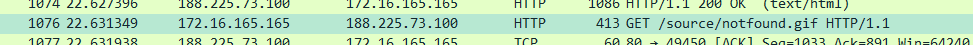

这里请求了一个 notfound.gif 文件,先追踪其 http 流


找到响应包

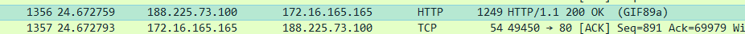

右键选择文件字段导出相应格式

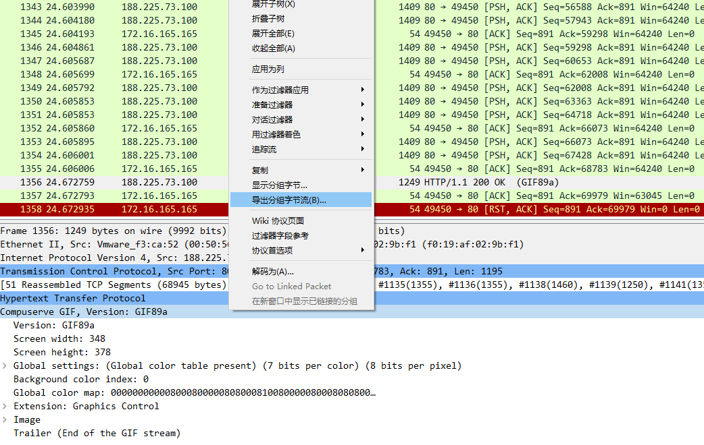

保存为 1.gif,查看文件,导出成功

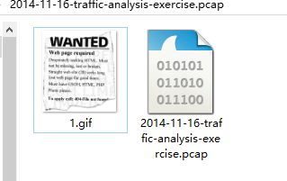

**virustotal 在线扫描**

利用 virustotal 可以在线扫描流量包,但是 virustotal 需要登录才能匹配 Snort 和 Suricata 的规则,如果无法无任何扫描结果，把流量包另存为 pcap 格式再扫描试试。

---

## SampleCaptures

下载 [iperf-mptcp-0-0.pcap](https://wiki.wireshark.org/SampleCaptures?action=AttachFile&do=get&target=iperf-mptcp-0-0.pcap)

下载后双击用 wireshark 打开。 编号 534 开始有重传（TCP Retransmition）的包：


Ctrl+Alt+Shift+T,切换跟踪 tcp 流,可以发现,这个连接只有 3 个包


TCP 重传的机制：指数后退，比如第一次等待 1s，第二次等 待 2s，第三次等待 4s，第四次 8s

- 第一个编号 24 的包发出，请求建立连接
- 超过 1s 后，客户端没有收到服务端的 ACK 包，触发客户端 TCP 超时重传，编号 534 的包发出
- 又过了大约 2s，仍然没有收到 ACK 包，再次触发超时重传，编号 1520 的包发出

从这个抓包文件看，这次连接没有建立起来，而直接原因就是 client 没有收到 server 的应答包。

当然仅凭这个无法判断直接原因，还需要在 server 端抓包，查看 server 到底是否发出回包，若发出，说明在链路中未传输到对端。可能是链路中问题。

---

点击 统计 -- 捕获文件属性


查看文件的详细信息，包的数量，被什么封装等等

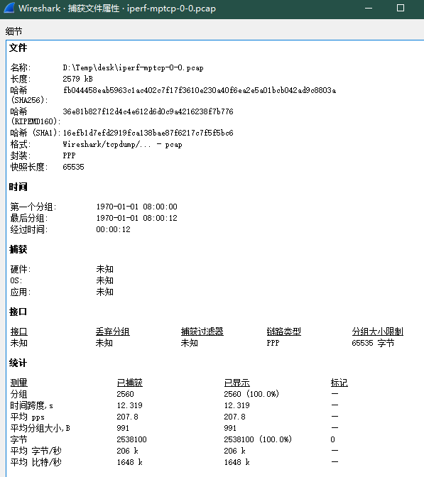

点击 统计 -- 协议分级,能看到捕获数据中的协议包含层次情况；本捕获文件的最外层协议是 PPP，然后是 IPV4 协议，TCP 协议


点击 统计 -- Conversations,可见 IPv4 和 TCP 的对话情况


点击 统计 -- 分组长度,不同长度的包的分配情况


点击 统计 -- I/O 图表


---

# Windows

## NTLM-工作组

192.168.141.1(WIN10)——>192.168.141.139(WIN2008)


查看第一个数据包协商


查看第二个数据包质询,获得 Challenge


查看第三个数据包身份验证,其中可以获得客户端加密后的 Challenge


- username（要访问服务器的用户名）：Administrator
- domain（访问者主机名或者 ip）：DESKTOP-QKM4NK7
- challenge（数据包 2 中服务器返回的 challenge 值）：18f77b6fe9f8d876
- HMAC-MD5（数据包 3 中的 NTProofStr）: 0ecfccd87d3bdb81713dc8c07e6705b6
- blob（blob 对应数据为 NTLMv2 Response 开头去掉 NTProofStr 的后半部分）：01010000000000002a470d3bc233d6017eb1f527b5e7bd4d0000000002001e00570049004e002d0041003500470050004400430050004a0037004f00540001001e00570049004e002d0041003500470050004400430050004a0037004f00540004001e00570049004e002d0041003500470050004400430050004a0037004f00540003001e00570049004e002d0041003500470050004400430050004a0037004f005400070008002a470d3bc233d601060004000200000008003000300000000000000001000000002000003737fbe7dbcbd2c8e5d7a030f44586c91423d9c5202f827f3f6cf26f69adbfe80a001000000000000000000000000000000000000900280063006900660073002f003100390032002e003100360038002e003100340031002e003100330039000000000000000000

所以构造，Net-NTLM v2 Hash 值为：
```
Administrator::DESKTOP-QKM4NK7:18f77b6fe9f8d876:0ecfccd87d3bdb81713dc8c07e6705b6:01010000000000002a470d3bc233d6017eb1f527b5e7bd4d0000000002001e00570049004e002d0041003500470050004400430050004a0037004f00540001001e00570049004e002d0041003500470050004400430050004a0037004f00540004001e00570049004e002d0041003500470050004400430050004a0037004f00540003001e00570049004e002d0041003500470050004400430050004a0037004f005400070008002a470d3bc233d601060004000200000008003000300000000000000001000000002000003737fbe7dbcbd2c8e5d7a030f44586c91423d9c5202f827f3f6cf26f69adbfe80a001000000000000000000000000000000000000900280063006900660073002f003100390032002e003100360038002e003100340031002e003100330039000000000000000000
```

---

## NTLM-域

192.168.141.140(WIN2008)——>192.168.141.135(WIN2008)

域控 : 192.168.141.139

FQDN : ffffffff0x.com

账号密码 : Administrator  Abcd1234


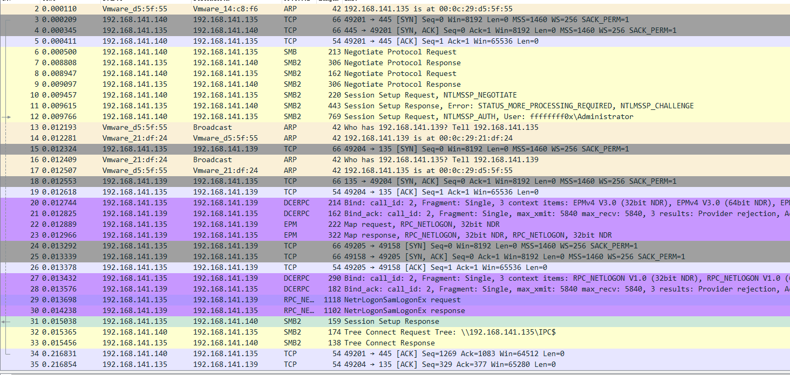

---

# ICS

**相关文章**
- [使用Wireshark分析工控协议](http://plcscan.org/blog/2015/11/using-the-wireshark-analysis-ics-protocol/)

## S7Comm

**s7comm_downloading_block_db1**

下载 [SampleCaptures/s7comm_downloading_block_db1.pcap](https://wiki.wireshark.org/SampleCaptures?action=AttachFile&do=get&target=s7comm_downloading_block_db1.pcap)

下载后双击用 wireshark 打开。

*COTP Connection Packet*
- COTP 连接请求包

    

- COTP 请求确认包

    

*COTP Fuction Packet*
- 数据传输包

    

*S7Comm*
- S7Comm Header

    

    其中最重要的字段就是 ROSCTR，它决定了后续参数的结构

    在响应数据包中，还有可能存在错误信息

    

    可见图中的错误类型就是 No error

- Parameter

    

- 建立通信（Setup communication [0xF0]）

    - 请求

        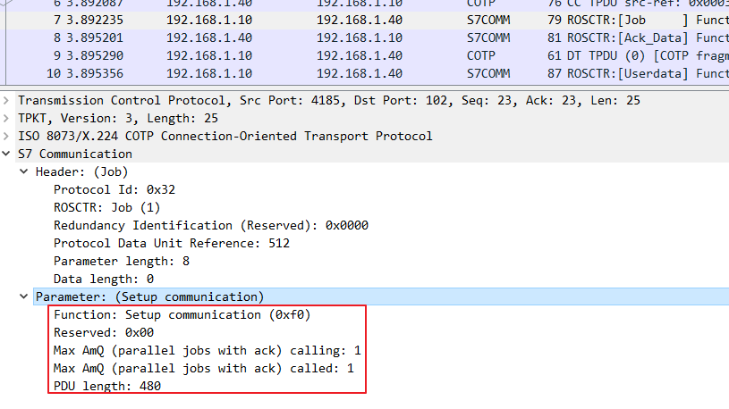

    - 响应

        

    其协商结果为：ACK 队列的大小为 1；最大 PDU 长度为 240。

- 请求下载（Request download [0x1A]）

    - 请求

        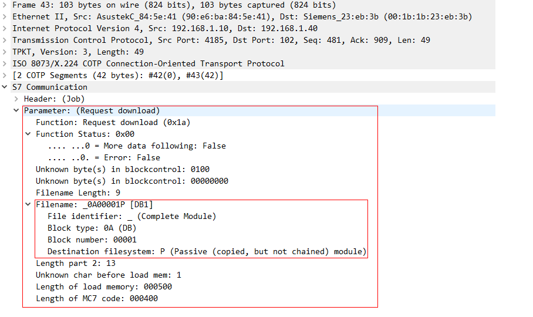

        如图所示，文件标识是 _ (Complete Module)，块类型为 0B，块的编号为 00001，目标块的文件系统是 P (Passive (copied, but not chained) module)，所以文件名为 _0A00001P。

    - 响应

        

- 下载块（Download block [0x1B]）

    - 请求

        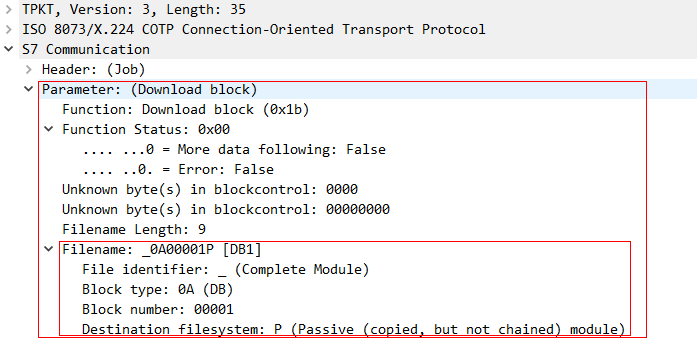

    - 响应

        

- 下载结束（Download ended [0x1C]）

    - 请求

        

    - 响应

        

- 程序调用服务（PI service [0x28]）

    - 请求

        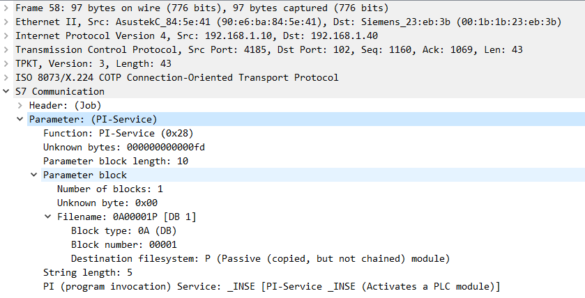

    - 响应

        

**snap7_s300_everything**

下载 [ICS-Security-Tools/pcaps/s7/snap7_s300_everything.pcapng](https://github.com/ITI/ICS-Security-Tools/blob/master/pcaps/s7/snap7_s300_everything.pcapng)

*S7Comm*

- 开始上传（Start upload [0x1D]）

    - 请求

        

    - 响应

        

- 上传（Upload [0x1E]）

    - 请求

        

    - 响应

        

- 上传结束（End upload [0x1F]）

    - 请求

        

    - 响应

        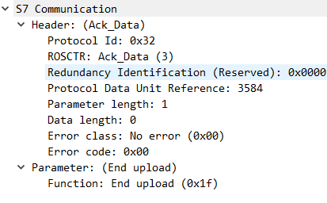

**s7comm_varservice_libnodavedemo**

下载 [SampleCaptures/s7comm_varservice_libnodavedemo.pcap](https://wiki.wireshark.org/SampleCaptures?action=AttachFile&do=get&target=s7comm_varservice_libnodavedemo.pcap)

下载后双击用 wireshark 打开。

*S7Comm*
- 读取值（Read Var [0x04]）

    - 读值操作的作业请求

        

    - 响应

        

- 写入值（Write Var [0x05]）

    - 向地址为 0×000020 的 Flags（M）写入 0×0103 的作业请求

        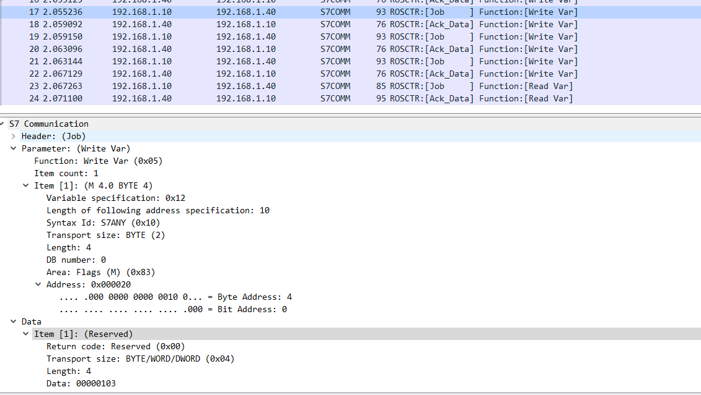

    - 向地址为 0×000020 的 Flags（M）写入 0×0103 的确认响应

        

    图中的 item1，说明向地址为 0×000020 的Flags（M）写入 0×0103 成功！

**PLC STOP [0x29]**

192.168.141.1(WIN10)——>192.168.141.128(WIN2019)

snap7 client --> snap7 server

- 请求

    

- 响应

    

**Userdata 协议拓展**

192.168.100.56(WIN10)——>192.168.100.56(WIN10)

snap7 client --> snap7 server

*S7Comm*
- 块功能（Block functions [0x3]）

    - 列举所有块（List blocks）
        - 请求

            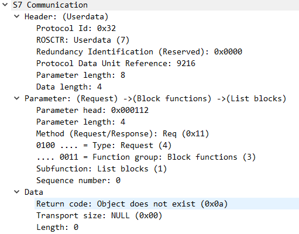

        - 响应

            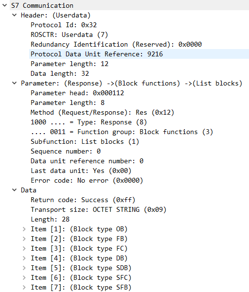

    - 列举块类型（List blocks of type）
        - 请求

            

        - 响应

            

    - 读取模块的信息（Get block info）
        - 请求

            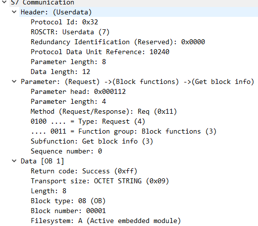

- CPU功能（CPU functions [0x4]）

    - 系统状态列表（SZL）
        - 请求

            

        - 响应

            

- 安全功能（Security [0x5]）

    - PLC密码（PLC password）

        

        - 请求

            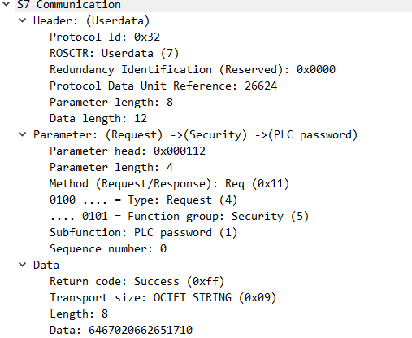

            Data 是 64 67 02 06 62 65 17 10
            - 第1位：0x64 ^ 0x55 = 0x31，则值是‘1’；
            - 第2位：0x67 ^ 0x55 = 0x32，则值是‘2’；
            - 第3位：0x02 ^ 0x55 ^ 0x64 = 0x33，则值是‘3’；
            - 第4位：0x06 ^ 0x55 ^ 0x67 = 0x34，则值是‘4’；
            - 第5位：0x62 ^ 0x55 ^ 0x02 = 0x35，则值是‘5’；
            - 第6位：0x65 ^ 0x55 ^ 0x06 = 0x36，则值是‘6’；
            - 第7位：0x17 ^ 0x55 ^ 0x62 = 0x20，则值是‘ ’；
            - 第8位：0x10 ^ 0x55 ^ 0x65 = 0x20，则值是‘ ’；

        - 响应

            

- 时间功能（Time functions [0x7]）

    - 读时间（Read clock）；

        - 请求

            

        - 响应

            

---

## Ethernet/IP

下载 [ICS-Security-Tools/pcaps/EthernetIP/enip_test.pcap](https://github.com/ITI/ICS-Security-Tools/blob/master/pcaps/EthernetIP/enip_test.pcap)

- 请求

    

    - Command:命令，list identify 表示检测到 Ethernet/IP 列表身份的命令。
    - Length:长度为 0，因为这个是一个请求包，没有数据长度。
    - Session Handle：记住这里为 0，后续的返回包我们看看是不是一样的。
    - Status: Success(0×00000000)
    - Max Response Delay:0,这个包发送是实时的。
    - Sender Context:0000c1debed1,正好6个字节的内容，等看看是不是一样的。
    - Options:0,这里为始终为 0。

- 响应

    

    - Length:长度不是 0 了，因为后面有了数据内容。
    - Session Handle:还是 0，和请求包是一样的。
    - Sender Context:和请求包一样，证明是对应的返回包。
    - Command Specific Data:数据内容，这部分不需要细看了，里面是一些设备信息，这些在工控渗透时可能会用到。

---

# Malware

**学习资源**
- [Malware-Traffic-Analysis](https://www.malware-traffic-analysis.net/index.html) - 自2013年夏季以来，该网站已发布1,600多个有关恶意网络流量的博客条目。 该网站上几乎所有帖子都包含pcap文件或恶意软件样本（或两者）。

**Tips**
- 恶意流量包建议直接放到 VirusTotal 跑一遍

## 2014-11-16-traffic-analysis-exercise
- https://www.malware-traffic-analysis.net/2014/11/16/index.html

下载 https://www.malware-traffic-analysis.net/2014/11/16/2014-11-16-traffic-analysis-exercise.pcap.zip , 密码是 infected
