# siemens 仿真搭建实验

---

## 免责声明

`本文档仅供学习和研究使用,请勿使用文中的技术源码用于非法用途,任何人造成的任何负面影响,与本人无关.`

---

**实验环境**

`环境仅供参考`

- [服务器] Microsoft Windows 7 专业版 6.1.7601 Service Pack 1 Build 7601(已激活)(安装 DotNetFramework_4.0)
- [客户机] Microsoft Windows 10 企业版 LTSC - 10.0.17763
- VMware® Workstation 15 Pro - 15.0.0 build-10134415

---

服务器下载软件
- STEP7
    - http://www.laozhoucontrol.com/S7-PLCSIM-V5_4-SP5-UPD1.html
    - http://www.laozhoucontrol.com/STEP7-V5_5-CN-SP2-install.html
- plcsim
    - http://www.laozhoucontrol.com/S7-PLCSIM-V5_4-SP5-UPD1.html
- [NetToPLCSim](https://sourceforge.net/projects/nettoplcsim/)

**STEP7**

先安装 STEP7

打开,要求你先重启计算机

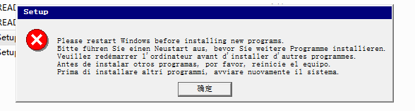

重启,再次打开,注意,右键-以管理员权限运行,然后一路下一步

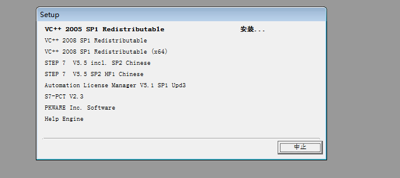

许可证这里选择,否,以后再传送许可证密钥,下面一路下一步

这里由于没有以管理员权限运行,所以运行到安装 step7 时报错,然后我以管理员权限运行重新打开了一次

等到所有组件安装完毕后,这里需要手动中止安装.

然后在这个界面,我等了10分钟都没有反应,就直接资源管理器杀掉安装进程了,后续使用时没有发现有任何影响.

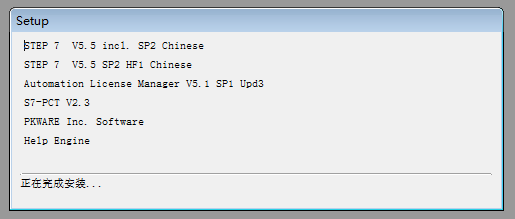

安装完毕后,记得用 Simatic_EKB_Install_2013_03_01_test 激活,短密钥或长密钥随便安装一个

接下来继续安装 plcsim

**plcsim**

安装 plcsim

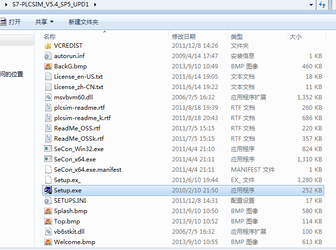

打开,要求你先重启计算机

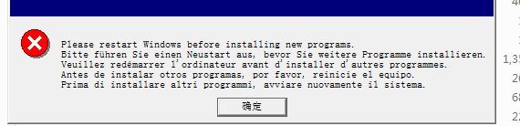

重启,再次打开,注意,右键-以管理员权限运行,然后一路下一步,等待安装完毕

**服务器使用 plcsim**

打开 SIMATIC Manager 软件，新建项目 test2

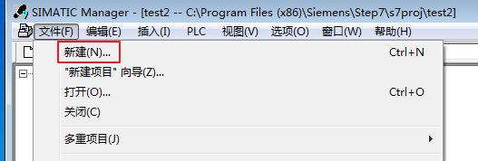

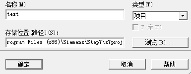

在新建项目 test2 点击插入新对象，并选择 SIMATIC 300 站点

选择 SIMATIC300（1）打开对象

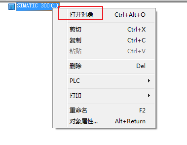

在 HW Config 界面下选择 SIMATIC 300,并选择 RACK-300 下的 Rail

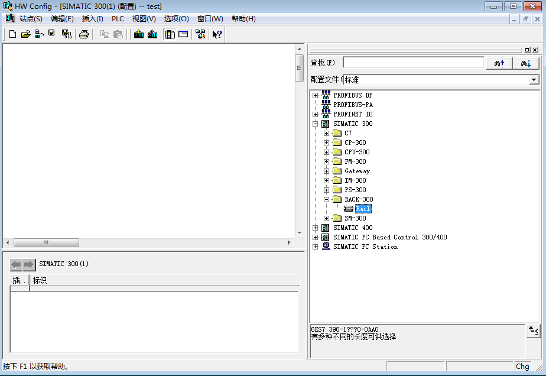

UR(0)对话框中的序号槽1中右键

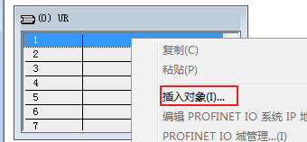

插入对象PS 307 2A

在序号槽2中点击右键插入对象 CPU 314C-2PN/DP V3.3

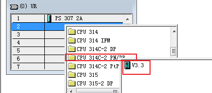

新建子网设置 ip 地址为本机的 IP 地址

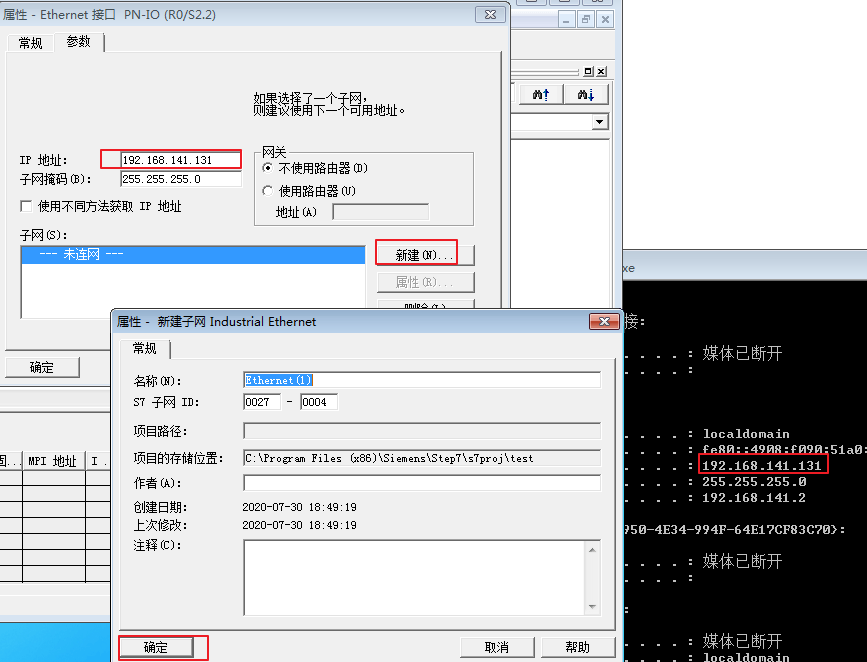

启动 S7-PLCSIM

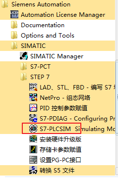

进入 S7-PLCSIM 界面，选择 PLCSIM(TCP/IP)

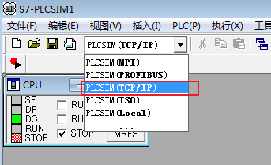

回到 HW Config 对话框，选择下载到模块

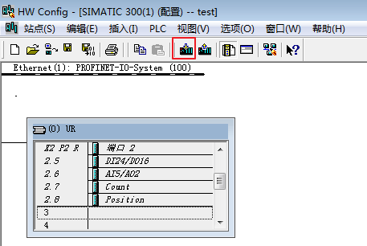

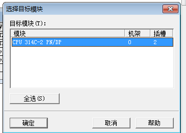

待下载完成，PLCSIM 会显示 PLC 的地址为之前设置的 IP 地址

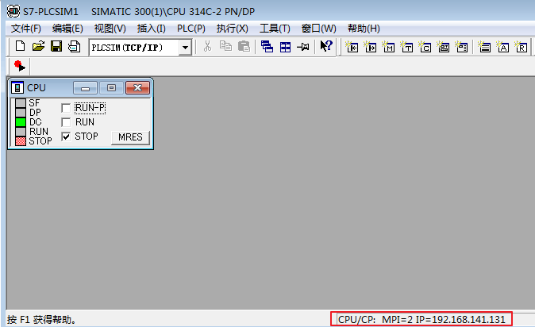

然后下载 NetToPLCSim,解压,打开 NetToPLCSim.exe

点击 add,弹出 station 对话框，在 Network IP Address 及 Plcsim IP Address 中选择 IP 地址为之前设置的 ip 地址

点击 Start Server，PLC#001 进入运行状态

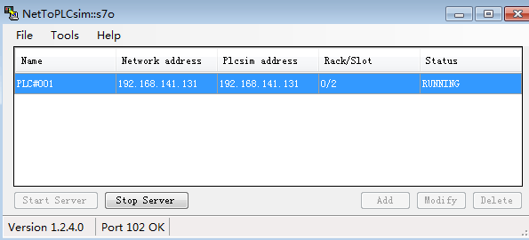

回到 S7-PLCSIM ,勾选 RUN

**客户机连接**

在客户机中打开 Snap7 Client Demo 工具，填写仿真 PLC 的 IP 地址如：192.168.141.131，点击 Connect

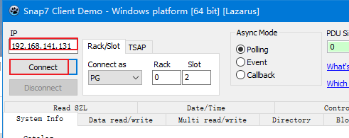

如果这里连接失败,应该是因为服务器防火墙开着,关闭防火墙即可

再在 control 下点击 stop 按钮即停止 PLC 的命令

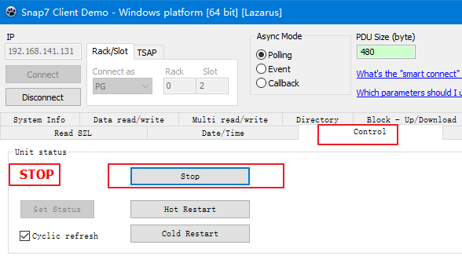

查看靶机中仿真 PLC 的状态从 run 变为 stop

---

**Source & Reference**
- [西门子PLC的网络仿真搭建方法探讨](https://www.freebuf.com/articles/ics-articles/236250.html)
