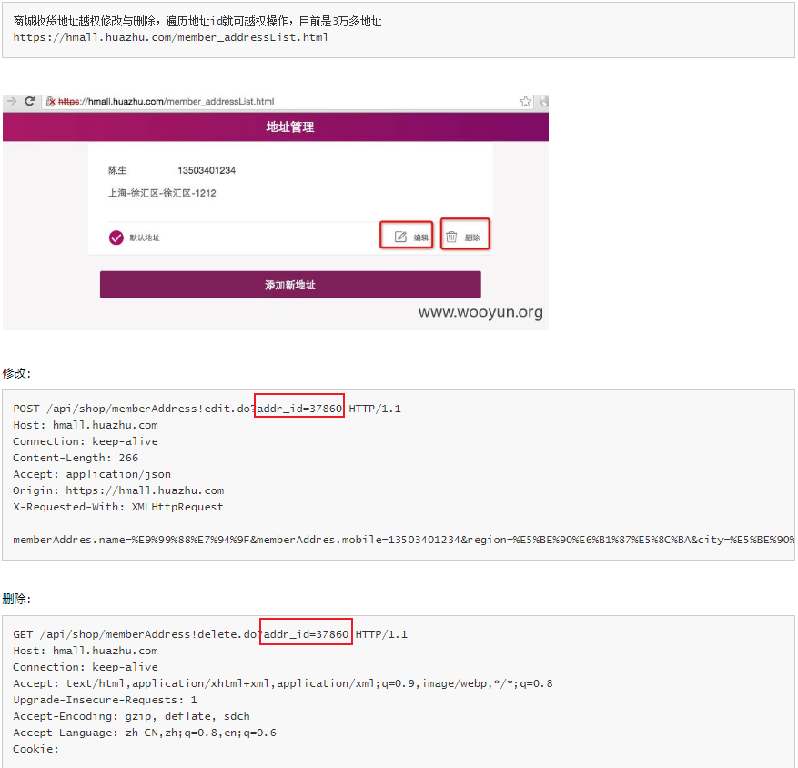

# PHP越权审计1

> 笔记内容由 [xidaner](https://github.com/xidaner) 提供,仅做部分内容排版修改

# 逻辑漏洞 -- 越权漏洞

**什么是越权漏洞**

Web 中越权漏洞简单的讲就是绕过身份认证或盗用他人身份来进行操作。

越权漏洞也可以分两类：

- **垂直越权**

    垂直越权及是不同级别或不同的角色之间的越权，垂直越权又可以分为向上越权和向下越权。比如某些论坛，删除，修改，发布文章等功能应该是管理员的权限进的事件。此时一个匿名用户通过越权也完成了类似的操作。这就是向上越权。

    而向下越权则反之，管理员活动了匿名用户的权力。

- **水平越权**

    水平越权可以理解为，权限相同的用户之间越权。就比如张三和李四都是一个网站的普通会员。张三通过越权漏洞查看并修改了李四的个人信息。

    该漏洞就会导致用户信息泄露.

## 为什么会出现越权漏洞

Web 中的越权漏洞简单理解为身份验证漏洞。在认证身份的时候，仅凭用户 ID 或用户名来验证用户。此时身份验证就极易绕过。

**Web 中的身份认证**

Web 身份认证通常使用 Cookie、Session、Openid、OAuth、SSO、REST 等进行认证，

而其中最常使用的是 `Cookie` 和 `Session` 。 Cookie 和  Session 都能够进行会话跟踪，它们的区别在于：
- `Session`是由服务器保存并分发的一个数，可以由于跟踪用户的状态，这个数据可以保存在集群数据库、文件中。
- `Cookie`是由客户端(浏览器)保存用户信息的一种机制，由于记录用户的一些信息，可以配合 Session 进行身份验证。

**Cookie 中身份验证漏洞**

这种漏洞很简单也最常见，身份验证由 Cookie 认证，你只需要修改客户端 Cookie 即可完成登录。

示例：
```php
<?php
    session_start(); //启动session
    ...//省略登录和密码验证。
    if(isset($_COOKIE['username']))//判断cookie中的username是否为 NULL
    {
        $username = clean_input($_COOKIE['username']);//将cookie中的值赋给变量$username
        if($username == root) //如#username的值为root

            echo "欢迎您登录系统".$_SESSION['username']."管理员!";    //如果$username的值为root则服务器分发session的参数为root用户
        if($username == test1)
            echo "欢迎普通用户".$_SESSION['username']."！";
            //如果$username的值为test1则服务器分发session的参数为test1用户
    };
?>
```

从上述代码中可见，页面直接获取 `Cookie` 中的 `username` 字段进行身份判断，这种方式非常的不安全。可以通过修改 Cookie 中的值进行越权。[举例参考](https://blog.csdn.net/God_XiangYu/article/details/97989390)


**进阶**

比较常见的就是通过修改用户ID进行越权：
```php
include_once('../sys/config.php');//包含配置文件
if (isset($_POST['submit']) && !empty($_POST['username']) ) {//判断submit的值是否为NULL，并且判断username的值是否为空。

if (strlen($_POST['username'])>16) {//获取username的字符串长度
    $_SESSION['error_info'] = '用户名過長（用戶名長度<=16）';//判断并输出错误信息
    header('Location: edit.php');//跳转到edit页面
    exit;//退出
}

$clean_username = clean_input($_POST['username']);//通过函数clean_input过滤username
$clean_user_id = clean_input($_POST['id']);//通过函数过滤ID
//clean——input应为过滤函数。

$query = "SELECT * FROM users WHERE user_name = '$clean_username'";//查询是否存在过滤后的用户名
$data = mysql_query($query, $conn);
if (mysql_num_rows($data) == 1) {
    $_SESSION['error_info'] = '用户名已存在';//如果不为0则存在则报错，用户名存在
    header('Location: edit.php');
    exit;
}

$query = "UPDATE users SET user_name = '$clean_username' WHERE user_id = '$clean_user_id'";  //更新用户名信息，更具用户id判断。
```
可见当前修改用户名之判断 ID，只需要更改 ID 为其他用户的 ID 即可越权。如果轮询出管理员的 ID 还可以进一步的进行垂直越权。

[乌云案例举例](http://wy.zone.ci/bug_detail.php?wybug_id=wooyun-2016-0212974)



---

# 修复建议

- 在 Cookie 身份认证中进行修复：

    在用户登录后我们通过添加 session 变量对 cookie 进行验证并绑定。如果后续修改 Cookie 中的值，匹配到的服务器端的 session 值不匹配，则关闭连接。

    ```php
    if(isset($_COOKIE['username'])) //判断username是否为空
    {
                $_SESSION['veri'] = $_COOKIE['username'];//将cookie复制给session并保存或编码
                header("location: main.php");//跳转到主页面。
    }
    ```

- 在后续进行身份验证操作时都验证 `session` 的值和 `Cookie` 中的是否匹配即可。这种修补方式因为 Session 保存在服务器，不易被修改。

    查看`main.php`页面：

    ```php
    if($_COOKIE['username']==$_SESSION['username'])//判断cookie中的用户名和session中的是否相同
    {
        if($_COOKIE['username'] == root)  //如果是root则xxxxx
            echo "欢迎您登录系统".$_COOKIE['username']."";
        if($_COOKIE['username'] == test1)//如果是test则xxxxx
            echo "欢迎普通用户".$_COOKIE['username']."";
    }
    else{
        echo "登录失败！请尝试重新登录!";
    }
    ```
