# Burp Suite 笔记

---

## 免责声明

`本文档仅供学习和研究使用,请勿使用文中的技术源码用于非法用途,任何人造成的任何负面影响,与本人无关.`

---

**官网**
- https://portswigger.net/

**资源**
- [Mr-xn/BurpSuite-collections](https://github.com/Mr-xn/BurpSuite-collections)

**书**
- [Burp Suite 实战指南](https://t0data.gitbooks.io/burpsuite/content/)

**tips**

Firefox `about:config` 里 `network.captive-portal-service.enabled` 设置成 `false` ,可以关闭火狐向 `http://detectportal.firefox.com/` 发包

---

## 插件

- [BApp Store](https://portswigger.net/bappstore)

---

> 使用堆栈跟踪进行 Java 指纹识别
- [x41sec/BeanStack](https://github.com/x41sec/beanstack)

> 分块传输辅助插件,用于分块传输绕 WAF
- [c0ny1/chunked-coding-converter](https://github.com/c0ny1/chunked-coding-converter)

> 顾名思义,这是 burp 中的 hackbar
- [d3vilbug/HackBar](https://github.com/d3vilbug/HackBar)

> 添加一些右键菜单让 burp 用起来更顺畅
- [bit4woo/knife](https://github.com/bit4woo/knife)

> 利用 burp 收集整个企业、组织的域名 (不仅仅是单个主域名) 的插件
- [bit4woo/domain_hunter](https://github.com/bit4woo/domain_hunter)

> DNS_log
- [hackvertor/taborator](https://github.com/hackvertor/taborator)
- [NetSPI/BurpCollaboratorDNSTunnel](https://github.com/NetSPI/BurpCollaboratorDNSTunnel)

> burpsuite 的日志插件,不过是增强版本
- [nccgroup/BurpSuiteLoggerPlusPlus](https://github.com/nccgroup/BurpSuiteLoggerPlusPlus)

> Hackvertor 构造绕过 waf 的 payload 并破解 XOR 加密
- 商店有
- [利用burp插件Hackvertor绕过waf并破解XOR加密](https://www.4hou.com/tools/14353.html)

> 使用 phantomjs 调用前端加密函数对数据进行加密,方便对加密数据输入点进行 fuzz.
- [c0ny1/jsEncrypter](https://github.com/c0ny1/jsEncrypter)

> Authz 快速探测越权
- 商店有
- [wuntee/BurpAuthzPlugin](https://github.com/wuntee/BurpAuthzPlugin)
    - [基于BurpSuite快速探测越权-Authz插件](https://gh0st.cn/archives/2019-06-27/1)

> burp官方开发的爆破模块增强版
- 商店有
- [PortSwigger/turbo-intruder](https://github.com/portswigger/turbo-intruder)
- [Turbo Intruder:BurpSuite高速 Intruder 插件介绍](https://www.freebuf.com/sectool/195912.html)

> 从 js 文件中提取隐藏的路径并对其进行美化以便进一步阅读
- [Lopseg/Jsdir](https://github.com/Lopseg/Jsdir)

> 一个 Burp 插件,实现用 AES 算法透明加密原版菜刀 Caidao.exe 与服务器端交互的 http 数据流
- [ekgg/Caidao-AES-Version](https://github.com/ekgg/Caidao-AES-Version)

> HTTP Desync Attacks 辅助工具
- [PortSwigger/http-request-smuggler](https://github.com/PortSwigger/http-request-smuggler)

> 一款兼容 Windows,mac,linux 多个系统平台的 Burp 与 sqlmap 联动插件
- [c0ny1/sqlmap4burp-plus-plus](https://github.com/c0ny1/sqlmap4burp-plus-plus)
    - [重构 sqlmap4burp 插件](http://gv7.me/articles/2019/refactoring-sqlmap4burp/)

> 一个 burp 插件,自动识别图形验证码,并用于Intruder中的Payload.
- [bit4woo/reCAPTCHA](https://github.com/bit4woo/reCAPTCHA)

> Burp 被动扫描流量转发插件
- [c0ny1/passive-scan-client](https://github.com/c0ny1/passive-scan-client)

> 高亮标记敏感信息并展示相关匹配的信息,然后针对高亮的请求进行深度挖掘
- [gh0stkey/BurpSuite-Extender-MarkInfo](https://github.com/gh0stkey/BurpSuite-Extender-MarkInfo)

> 通过 BurpSuite 来构建自己的爆破字典,可以通过字典爆破来发现隐藏资产.
- [TEag1e/BurpCollector](https://github.com/TEag1e/BurpCollector)

> 用于解码和修改任意的 protobuf 消息,而不需要定义 protobuf 类型.
- [nccgroup/blackboxprotobuf](https://github.com/nccgroup/blackboxprotobuf)

> 即时操作 JWT，自动执行针对 JWT 的常见攻击
- [ozzi-/JWT4B](https://github.com/ozzi-/JWT4B)

---

## 安装
**windows**

略

**linux**

这里以 kali 举例,kali 自带的是 openjdk 不支持新版 burp,自行下载 [oracle jdk](https://www.oracle.com/technetwork/java/javase/downloads/jdk8-downloads-2133151.html)

安装过程见 [Power-Linux](../../运维/Linux/Power-Linux.md##JDK)

没问题就直接运行即可 `java -jar <burp文件名>.jar
`

---

## 配置
**证书**

- **firefox**

    浏览器访问 burp/ ,下载 cacert.der 证书,一路下一步安装,证书存储选择存储在 `受信任的根证书颁发机构`,firefox 需要到 隐私与安全->证书->查看证书->导入->全部勾选信任

---

# Target

Burp Target 组件主要包含站点地图、目标域、Target 工具三部分组成,他们帮助渗透测试人员更好地了解目标应用的整体状况、当前的工作涉及哪些目标域、分析可能存在的攻击面等信息

## Site map

Site Map 的左边为访问的 URL,按照网站的层级和深度,树形展示整个应用系统的结构和关联其他域的 url 情况;右边显示的是某一个 url 被访问的明细列表,共访问哪些 url,请求和应答内容分别是什么,都有着详实的记录. 基于左边的树形结构,我们可以选择某个分支,对指定的路径进行扫描和抓取.

同时,也可以将某个域直接加入 Target Scope 中.

**右键--Compare site maps**

站点比较是一个 Burp 提供给渗透测试人员对站点进行动态分析的利器,我们在比较帐号权限时经常使用到它.当我们登陆应用系统,使用不同的帐号,帐号本身在应用系统中被赋予了不同的权限,那么帐号所能访问的功能模块、内容、参数等都是不尽相同的,此时使用站点比较,能很好的帮助渗透测试人员区分出来.一般来说,主要有以下3种场景:
1. 同一个帐号,具有不同的权限,比较两次请求结果的差异.
2. 两个不同的帐号,具有不同的权限,比较两次请求结果的差异.
3. 两个不同的帐号,具有相同的权限,比较两次请求结果的差异.

由于站点比较是在两个站点地图之间进行的,所以我们在配置过程中需要分别指定 Site Map 1 和 Site Map2.

Site Map 1 我们默认为当前会话.


这时我们会进入 Site Map 1 设置页面,如果是全站点比较我们选择第一项,如果仅仅比较我们选中的功能,则选择第二项.如果全站点比较,且不想加载其他域时,我们可以勾选只选择当前域.


接下来就是 Site Map 2 的配置,对于 Site Map 2 我们有三种方式,第一种是从 Burp project中读取,第二种是之前我们已经保存下来的 Burp Suite 站点记录,第三种是重新发生一次请求作为 Site Map2.这里,我们选择第三种方式.

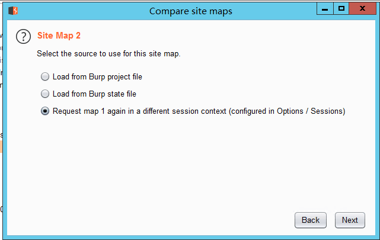

如果上一步选择了第三种方式,则进入请求消息设置界面.在这个界面,我们需要指定通信的并发线程数、失败重试次数、暂停的间隙时间.


设置完 Site Map 1 和 Site Map 2 之后,将进入请求消息匹配设置.在这个界面,我们可以通过 URL 文件路径、Http 请求方式、请求参数、请求头、请求 Body 来对匹配条件进行过滤.


设置请求匹配条件,接着进入应答比较设置界面.在这个界面上,我们可以设置哪些内容我们指定需要进行比较的.从下图我们可以看出,主要有响应头、form表单域、空格、MIME类型.点击[Next].

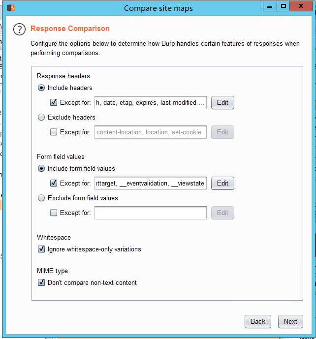

如果我们之前是针对全站进行比较,且是选择重新发生一次作为 Site Map2 的方式,则界面加载过程中会不停提示你数据加载的进度,如果涉及功能请求的链接较少,则很快进入比较界面.

**右键--Engagement tools**
- Analyze target

    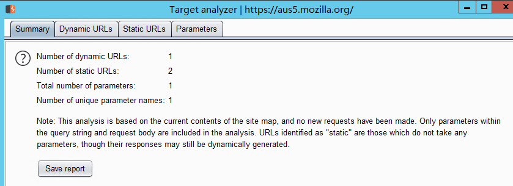

    在弹出的分析界面中,我们能看到概况、动态 URL、静态 URL、参数4个视图.

    概况视图主要展示当前站点动态 URL 数量、静态 URL 数量、参数的总数、唯一的参数名数目,通过这些信息,我们对当前站点的总体状况有粗线条的了解.

    动态 URL 视图展示所有动态的 URL 请求和应答消息,跟其他的工具类似,当你选中某一条消息时,下方会显示此消息的详细信息.

    静态 URL 视图与动态 URL 视图类似

    参数视图有上中下三部分组成,上部为参数和参数计数统计区,你可以通过参数使用的次数进行排序,对使用频繁的参数进行分析;中部为参数对于的使用情况列表,记录对于的参数每一次的使用记录;下部为某一次使用过程中,请求消息和应答消息的详细信息.

    在使用攻击面分析功能时,需要注意,此功能主要是针对站点地图中的请求 URL 进行分析,如果某些 URL 没有记录,则不会被分析到.同时,在实际使用中,存在很多站点使用伪静态,如果请求的 URL 中不带有参数,则分析时无法区别,只能当做静态 URL 来分析.

## Scope

Target Scope 中作用域的定义比较宽泛,通常来说,当我们对某个产品进行渗透测试时,可以通过域名或者主机名去限制拦截内容,这里域名或主机名就是我们说的作用域;如果我们想限制得更为细粒度化,比如,你只想拦截 login 目录下的所有请求,这时我们也可以在此设置,此时,作用域就是目录.总体来说,Target Scope 主要使用于下面几种场景中:
- 限制站点地图和 Proxy 历史中的显示结果
- 告诉 Burp Proxy 拦截哪些请求
- Burp Spider 抓取哪些内容
- Burp Scanner 自动扫描哪些作用域的安全漏洞
- 在 Burp Intruder 和 Burp Repeater 中指定 URL

通过 Target Scope 我们能方便地控制 Burp 的拦截范围、操作对象,减少无效的噪音.在 Target Scope 的设置中,主要包含两部分功能:允许规则和去除规则.


其中允许规则顾名思义,即包含在此规则列表中的,视为操作允许、有效.如果此规则用于拦截,则请求消息匹配包含规则列表中的将会被拦截;反之,请求消息匹配去除列表中的将不会被拦截.

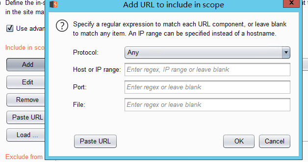

规则主要由协议、域名或 IP 地址、端口、文件名4个部分组成,这就意味着我们可以从协议、域名或 IP 地址、端口、文件名4个维度去控制哪些消息出现在允许或去除在规则列表中.

当我们设置了 Target Scope  (默认全部为允许) ,使用 Burp Proxy 进行代理拦截,在渗透测试中通过浏览器代理浏览应用时,Burp 会自动将浏览信息记录下来,包含每一个请求和应答的详细信息,保存在 Target 站点地图中.

---

# Proxy

## intercept
**右键--Don't intercept requests**

这里指定满足规则的包,需要忽略

**右键--Do intercept**

拦截回包

## Options
**Proxy listeners**

代理侦听器是本地 HTTP 代理服务器,用于侦听来自浏览器的传入连接.它使您能够监视和拦截所有请求和响应,并且是 Burp 用户驱动的工作流程的核心.默认情况下,Burp 在环回接口的端口 8080 上创建一个侦听器.要使用此侦听器,您需要将浏览器配置为使用 127.0.0.1:8080 作为其代理服务器.测试几乎所有基于浏览器的 Web 应用程序都需要此默认侦听器.

Burp 允许您创建多个代理侦听器,并提供了大量配置选项来控制其行为.在测试异常应用程序或与某些非基于浏览器的 HTTP 客户端一起使用时,有时可能需要使用这些选项.

特别是当我们测试非浏览器应用时,无法使用浏览器代理的方式去拦截客户端与服务器端通信的数据流量,这种情况下,我们会使用自己的 Proxy 监听设置,而不会使用默认设置.

- Binding

    

    绑定的端口 port 是指 Burp Proxy 代理服务监听的端口,绑定 IP 地址分仅本地回路、所有接口、指定地址三种模式,在渗透测试中,无论你选择哪种模式,你需要明白一点,当你选择的非本地回路 IP 地址时,同局域网内的其他电脑也可以访问你的监听地址.

- Request Handling

    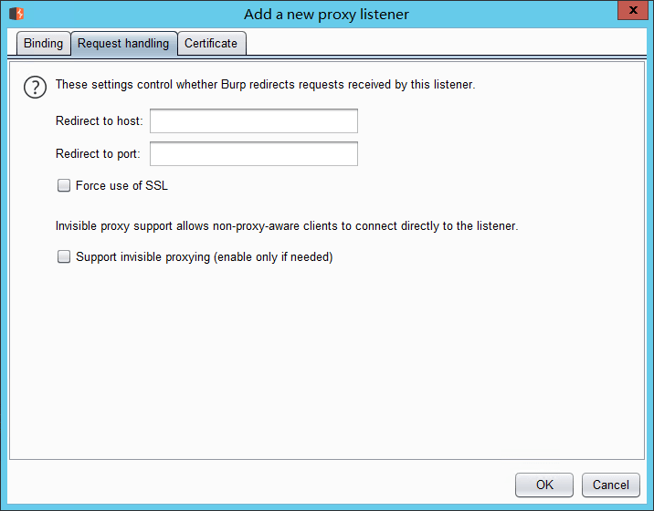

    请求处理主要是用来控制接受到 Burp Proxy 监听端口的请求后,如果对请求进行处理的.

    具体配置可分为:端口的转发、主机名/域名的转发、强制使用 SSL 和隐形代理4个部分.

    当我们配置了端口的转发时,所有的请求都会被转发到这个端口上;如果我们配置了主机或域名的转发,则所有的请求会转发到指定的主机或域名上.同时,我们可以指定,通过 Burp Proxy 的消息是否强制使用 SSL,如果设置了此项,则请求若是 http 协议,经 Burp proxy 代理后将转换为 https 协议.隐形代理主要是用于测试富客户端应用或者是非浏览器代理方式的应用,当我们设置了它,访问这些应用时,将通过非代理的方式,直接连接 Burp Proxy 的监听端口.

    注意,每个重定向选项都可以单独使用.因此,例如,您可以将所有请求重定向到特定主机,同时保留每个原始请求中使用的原始端口和协议.

    *隐形代理*

    有时候,在拦截富客户端软件时,我们通常需要使用隐形代理.富客户端软件通常是指运行在浏览器之外的客户端软件,这就意味着它本身不具有 HTTP 代理属性.当它进行网络通信时,客户端将无法使代理感知或者无法由代理进行通信.在 Burp 中,我们可以使用隐形代理的方式,对通信内容进行代理或拦截,从而对通信的请求和响应消息进行分析.使用隐形代理通常需要做如下设置(以 https://example.com 为例): 1.配置 hosts 文件,Windows 操作系统下的目录位置 Windows/System32/drivers/etc/hosts,而 Linux 或者 Unix 下的目录为 /etc/hosts,添加如下行:
    ```
    127.0.0.1 example.com
    ```

    设置完成之后,我们需要添加一个新的监听来运行在 HTTP 默认的 80 端口,如果通信流量使用 HTTPS 协议,则端口为 443.

    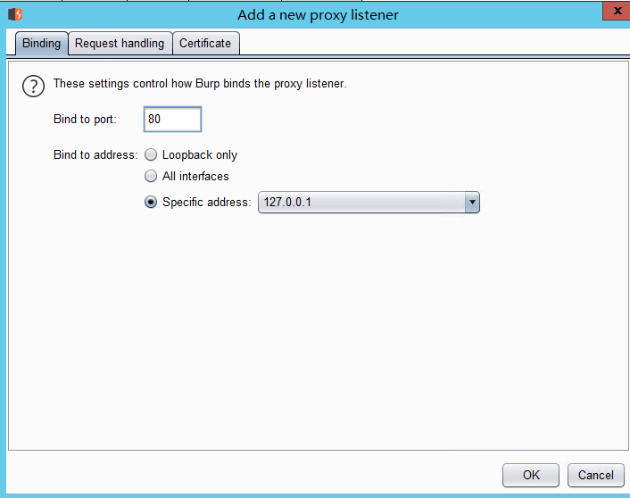

    如果是 HTTPS 协议的通信方式,我们需要一个指定域名的 CA 证书.

    

    接着,我们需要把 Burp 拦截的流量转发给原始请求的服务器.这需要在 Project Options->Connections->Hostname Resolution 进行设置.因为我们已经告诉了操作系统, example.com 的监听地址在 127.0.0.1 上,所以我们必须告诉 Burp,将 example.com 的流量转发到真实的服务器那里去.

    

    通过这样的配置,我们就可以欺骗富客户端软件,将流量发送到 Burp 监听的端口上,再由 Burp 将流量转发给真实的服务器.

- Certigicate

    

    这些设置可以解决使用拦截代理时出现的一些 SSL 问题:
    1. 可以消除浏览器的 SSL 警报,并需要建立 SSL 例外.其中,网页加载来自其他域的 SSL 保护的项目,可以确保这些正确的加载到浏览器,而不需要为每个域手动接受代理的 SSL 证书.
    2. 可以与该拒绝无效的 SSL 证书连接到服务器胖客户机应用程序的工作.

    它有下列选项可供设置:
    - 使用自签名证书(Use a self-signed certificate ) —— 一个简单的自签名 SSL 证书呈现给您的浏览器,它总是会导致 SSL 警告.
    - 生成每个主机的CA签名证书(Generate CA-signed per-host certificates)—— 这是默认选项.在安装时,Burp创造了一个独特的自签名的证书颁发机构(CA)证书,并将此计算机上使用.当你的浏览器发出的SSL连接指定主机,Burp生成该主机的SSL证书,由CA证书签名.您可以安装Burp的CA证书作为浏览器中的受信任的根,从而使每个主机证书没有任何警报接受.
    - 生成与特定的主机名CA签发的证书(Generate a CA-signed certificate with a specific hostname)—— -是类似于前面的选项;不同的是,Burp会生成一个主机证书与每一个SSL连接使用,使用指定的主机名.
    - 使用自定义证书(Use a custom certificate)—— 此选项可以加载一个特定的证书(在PKCS＃12格式)呈现给浏览器.如果应用程序使用这需要一个特定的服务器证书(例如,与给定的序列号或证书链)的客户端应该使用这个选项.

**SSL Pass Through**

SSL 直连的设置主要用于指定的目的服务器直接通过 SSL 连接,而通过这些连接的请求或响应任何细节将在 Burp 代理拦截视图或历史日志中可见.通过 SSL 连接传递并不是简单地消除在客户机上 SSL 错误的情况.比如说,在执行 SSL 证书的应用.如果应用程序访问多个域,或使用 HTTP 和 HTTPS 连接的混合,然后通过 SSL 连接到特定的主机仍然能够以正常的方式使用 Burp 的其他方式进行通信.如果启用自动添加客户端 SSL 协商失败的选项,当客户端检测失败的 SSL 协议(例如,由于不承认 Burp 的 CA 证书),会自动将相关的服务器添加到 SSL 直通通过列表中去.其设置界面如下图所示:

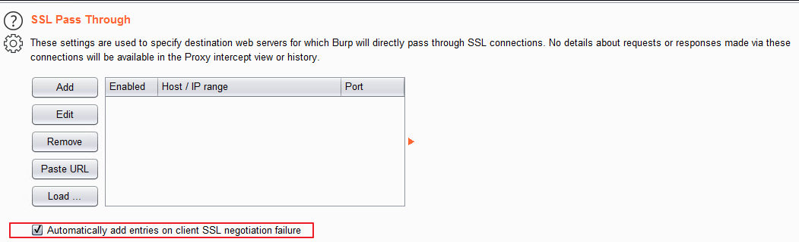

**Miscellaneous**

这些设置控制 Burp Proxy 行为的一些特定细节. 提供以下选项:
-  **Use HTTP/1.0 in requests to server** - 此选项控制 Burp 代理是否在对目标服务器的请求中强制实施 HTTP 版本1.0. 默认设置是使用浏览器使用的 HTTP 版本. 但是,某些旧版服务器或应用程序可能需要版本1.0才能正常运行.
- **Use HTTP/1.0 in responses to client** - 当前所有的浏览器都支持 HTTP 的1.0版和1.1版. 由于1.0版的功能集减少了,因此强制使用版本1.0有时对于控制浏览器行为的各个方面非常有用,例如防止尝试执行 HTTP pipelining.
- **Set response header "Connection: close"** - 在某些情况下,此选项对于防止 HTTP pipelining 也可能很有用.
- **Set "Connection: close" on incoming requests** - 在某些情况下,此选项对于防止 HTTP pipelining 也可能很有用.
- **Strip Proxy-* headers in incoming requests** - 浏览器有时会发送请求头,其中包含要用于正在使用的代理服务器的信息.有些恶意网站可能试图诱使浏览器在这些标头中包含敏感数据而对访客造成一定的攻击.默认情况下, Burp 代理会从传入的请求中删除这些标头,以防止任何信息泄漏.取消选中此选项 Burp 就不修改这些请求头.
- **Remove unsupported encodings from Accept-Encoding headers in incoming requests** - 浏览器通常会提供接受各种编码的响应,例如 压缩内容.在 Burp 中处理响应时,某些编码会引起问题.默认情况下,Burp 会删除不支持的编码,以减少使用它们的机会. 如果服务器要求支持不支持的编码,则可能需要取消选中此选项.
- **Strip Sec-WebSocket-Extensions headers in incoming requests** - 浏览器可能会提供支持与 WebSocket 连接有关的各种扩展的信息,例如 压缩内容.在 Burp 中处理响应时,某些编码会引起问题.默认情况下,Burp 删除此标头以减少使用扩展名的机会.如果服务器要求特定的扩展名,则可能需要取消选中此选项.
- **Unpack GZIP / deflate in requests** - 某些应用程序(通常使用自定义客户端组件的应用程序)会压缩请求中的消息正文.此选项控制 Burp 代理是否自动解包压缩的请求主体.如果某些应用程序预期会有压缩体,并且压缩已被 Burp 移除,则它们可能会中断.
- **Unpack GZIP / deflate in responses** - 大多数浏览器在响应中接受 GZIP 和压缩压缩的内容.此选项控制 Burp 代理是否自动解压缩压缩的响应主体.注意,通常可以通过从请求中删除 Accept-Encoding 标头(可能使用Burp Proxy的匹配和替换功能)来防止服务器尝试压缩响应.
- **Disable web interface at http://burp** - 如果您被迫将侦听器配置为接受不受保护的接口上的连接,并希望防止其他人访问Burp的浏览器内接口,则此选项可能很有用.
- **Suppress Burp error messages in browser** - 当发生某些错误时,默认情况下 Burp 会向浏览器返回有意义的错误消息. 如果您希望以隐身模式运行 Burp,以对受害用户进行中间人攻击,那么抑制这些错误消息以掩盖 Burp 的事实可能很有用.
- **Don't send items to Proxy history or live tasks** - 此选项可防止 Burp 将任何请求记录到代理历史记录或将其发送到实时任务,例如被动爬网或实时审核. 如果您将 Burp Proxy 用于某些特定目的(例如,对上游服务器进行身份验证或执行匹配和替换操作),并且希望避免引起日志记录所需的内存和存储开销,则这可能会很有用.
- **Don't send items to Proxy history or live tasks, if out of scope** - 此选项可防止 Burp 将任何范围外的请求记录到 Proxy 历史记录中或将其发送到实时任务,例如 被动抓取 或 实时审计. 避免积累范围外项目的项目数据很有用.

---

# Intruder 爆破模块

它的工作原理是:Intruder 在原始请求数据的基础上,通过修改各种请求参数,以获取不同的请求应答.每一次请求中,Intruder 通常会携带一个或多个有效攻击载荷 (Payload),在不同的位置进行攻击重放,通过应答数据的比对分析来获得需要的特征数据.

## Target

目标设定

## Positions

确定要爆破的参数,爆破类型


- 狙击手模式 (Sniper) ——它使用一组 Payload 集合,依次替换 Payload 位置上 (一次攻击只能使用一个 Payload 位置) 被 § 标志的文本 (而没有被 § 标志的文本将不受影响) ,对服务器端进行请求,通常用于测试请求参数是否存在漏洞.

- 攻城锤模式 (Battering ram) ——它使用单一的 Payload 集合,依次替换 Payload 位置上被 § 标志的文本 (而没有被 § 标志的文本将不受影响) ,对服务器端进行请求,与狙击手模式的区别在于,如果有多个参数且都为 Payload 位置标志时,使用的 Payload 值是相同的,而狙击手模式只能使用一个 Payload 位置标志.

- 草叉模式 (Pitchfork ) ——它可以使用多组 Payload 集合,在每一个不同的 Payload 标志位置上 (最多20个) ,遍历所有的 Payload.举例来说,如果有两个 Payload 标志位置,第一个 Payload 值为 A 和 B,第二个 Payload 值为 C 和 D,则发起攻击时,将共发起两次攻击,第一次使用的 Payload 分别为 A 和 C,第二次使用的 Payload 分别为 B 和 D.

- 集束炸弹模式 (Cluster bomb)  它可以使用多组 Payload 集合,在每一个不同的 Payload 标志位置上 (最多 20 个) ,依次遍历所有的 Payload.它与草叉模式的主要区别在于,执行的 Payload 数据 Payload 组的乘积.举例来说,如果有两个 Payload 标志位置,第一个 Payload 值为 A 和 B,第二个 Payload 值为 C 和 D,则发起攻击时,将共发起四次攻击,第一次使用的 Payload 分别为 A 和 C,第二次使用的 Payload 分别为 A 和 D,第三次使用的 Payload 分别为 B 和 C,第四次使用的 Payload 分别为 B 和 D.

## Payloads

- Payload Processing 配置加密规则,优先级由上往下,自动给字典编码

- Payload Encoding 配置字典进行 URL 编码

## Options

- 请求消息头设置 (Request Headers)

    这个设置主要用来控制请求消息的头部信息,它由 Update Content-Length header和Set Connection: close两个选项组成.

    其中 Update Content-Length header 如果被选中,Burp Intruder 在每个请求添加或更新 Content-Length 头为该次请求的 HTTP 体的长度正确的值.这个功能通常是为插入可变长度的 Payload 到模板的 HTTP 请求的主体的攻击中,如果没有指定正确的值,则目标服务器可能会返回一个错误,可能会到一个不完整的请求做出响应,或者可能会无限期地等待请求继续接收数据.

    Set Connection: close 如果被选中,表示 Burp Intruder 在每个请求消息中添加或更新值为"关闭"的连接头,这将更迅速地执行.在某些情况下 (当服务器本身并不返回一个有效的 Content-Length 或 Transfer-Encoding 头) ,选中此选项可能允许攻击.

- 请求引擎设置 (Request Engine)

    这个设置主要用来控制 Burp Intruder 攻击,合理地使用这些参数能更加有效地完成攻击过程.它有如下参数:Number of threads 并发的线程数,Number of retries on network failure 网络失败时候重试次数,Pause before retry 重试前的暂停时间间隔 (毫秒) ,Throttle between requests 请求延时 (毫秒) ,Start time 开始时间,启动攻击之后多久才开始执行.

- 攻击结果设置 (Attack Results)

    这个设置主要用来控制从攻击结果中抓取哪些信息.它的参数有:Store requests / responses 保存请求/应答消息,Make unmodified baseline request 记录请求母板的消息内容,Use denial-of-service mode 使用 Dos 方式,tore full payloads 存储所有的 Payload 值.

- Grep Match

    这个设置主要用来从响应消息中提取结果项,如果匹配,则在攻击结果中添加的新列中标明,便于排序和数据提取.比如说,在密码猜测攻击,扫描诸如"密码不正确"或"登录成功",可以找到成功的登录;在测试 SQL 注入漏洞,扫描包含"ODBC","错误"等消息可以识别脆弱的参数.

    Match type 表示匹配表达式还是简单的字符串,Case sensitive match 是否大小写敏感,Exclude HTTP headers 匹配的时候,是否包含 http 消息头.

- Grep Extract

    这些设置可用于提取响应消息中的有用信息.对于列表中配置的每个项目,Burp 会增加包含提取该项目的文本的新结果列.然后,您可以排序此列 (通过单击列标题) 命令所提取的数据.此选项是从应用数据挖掘有用的,能够支持广泛的攻击.例如,如果你是通过一系列文档 ID 的循环,可以提取每个文档寻找有趣的项目的页面标题.如果您发现返回的其他应用程序用户详细信息的功能,可以通过用户 ID 重复和检索有关用户寻找管理帐户,甚至密码.如果"遗忘密码"的功能需要一个用户名作为参数,并返回一个用户配置的密码提示,您可以通过共同的用户名列表运行和收获的所有相关密码的提示,然后直观地浏览列表寻找容易被猜到密码.

- Grep Payloads

    这些设置可用于提取响应消息中是否包含 Payload 的值,比如说,你想验证反射性的 XSS 脚本是否成功,可以通过此设置此项.当此项设置后,会在响应的结果列表中,根据 Payload 组的数目,添加新的列,显示匹配的结果,你可以通过点击列标题对结果集进行排序和查找.

    其设置项跟上一个类似,需要注意的是 Match against pre-URL-encoded payloads,如果你在请求消息时配置了 URL-encode payloads ,则这里表示匹配未编码之前的 Payload 值,而不是转码后的值.

- 重定向 (Redirections)

    这些设置主要是用来控制执行攻击时 Burp 如何处理重定向,在实际使用中往往是必须遵循重定向,才能实现你的攻击目的.例如,在密码猜测攻击,每次尝试的结果可能是密码错误会重定向响应到一个错误消息提示页面,如果密码正确会重定向到用户中心的首页. 但设置了重定向也可能会遇到其他的问题,比如说,在某些情况下,应用程序存储您的会话中初始请求的结果,并提供重定向响应时检索此值,这时可能有必要在重定向时只使用一个单线程攻击.也可能会遇到,当你设置重定向,应用程序响应会重定向到注销页面,这时候,按照重定向可能会导致您的会话被终止时. 因其设置选项跟其他模块的重定向设置基本一致,此处就不再重叙.

- **结果选项卡**

    可以使用过滤器进行筛选

---

# Repeater 中继模块

Burp Repeater 作为 Burp Suite 中一款手工验证 HTTP 消息的测试工具,通常用于多次重放请求响应和手工修改请求消息的修改后对服务器端响应的消息分析.

请求消息区为客户端发送的请求消息的详细信息,Burp Repeater 为每一个请求都做了请求编号,当我们在请求编码的数字上双击之后,可以修改请求的名字,这是为了方便多个请求消息时,做备注或区分用的.在编号的下方,有一个[GO]按钮,当我们对请求的消息编辑完之后,点击此按钮即发送请求给服务器端.


请求消息区为客户端发送的请求消息的详细信息,Burp Repeater 为每一个请求都做了请求编号,当我们在请求编码的数字上双击之后,可以修改请求的名字,这是为了方便多个请求消息时,做备注或区分用的.在编号的下方,有一个[GO]按钮,当我们对请求的消息编辑完之后,点击此按钮即发送请求给服务器端.服务器的请求域可以在 target 处进行修改,如上图所示.


应答消息区为对应的请求消息点击[GO]按钮后,服务器端的反馈消息.通过修改请求消息的参数来比对分析每次应答消息之间的差异,能更好的帮助我们分析系统可能存在的漏洞.

在我们使用 Burp Repeater 时,通常会结合 Burp 的其他工具一起使用,比如 Proxy 的历史记录,Scanner 的扫描记录、Target 的站点地图等,通过其他工具上的右击菜单,执行[Send to Repeater],跳转到 Repeater 选项卡中,然后才是对请求消息的修改以及请求重放、数据分析与漏洞验证.

**可选项设置(Options)**

与 Burp 其他工具的设置不同,Repeater 的可选项设置菜单位于整个界面顶部的菜单栏中,如图所示:

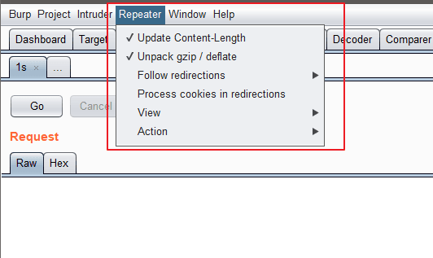

其设置主要包括以下内容:
- 更新 Content-Length 这个选项是用于控制 Burp 是否自动更新请求消息头中的 Content-Length
- 解压和压缩(Unpack gzip / deflate)这个选项主要用于控制 Burp 是否自动解压或压缩服务器端响应的内容
- 跳转控制(Follow redirections)这个选项主要用于控制 Burp 是否自动跟随服务器端作请求跳转,比如服务端返回状态码为 302,是否跟着应答跳转到 302 指向的 url 地址. 它有4个选项,分别是永不跳转(Never),站内跳转(On-site only)、目标域内跳转(In-scope only)、始终跳转(Always),其中永不跳转、始终跳转比较好理解,站内跳转是指当前的同一站点内跳转;目标域跳转是指 target scope 中配置的域可以跳转;
- 跳转中处理 Cookie(Process cookies in redirections)这个选项如果选中,则在跳转过程中设置的 Cookie 信息,将会被带到跳转指向的 URL 页面,可以进行提交.
- 视图控制(View)这个选项是用来控制 Repeater 的视图布局
- 其他操作(Action)通过子菜单方式,指向 Burp 的其他工具组件中.

---

# Sequencer 随机数分析

Burp Sequencer 作为 Burp Suite 中一款用于检测数据样本随机性质量的工具,通常用于检测访问令牌是否可预测、密码重置令牌是否可预测等场景,通过 Sequencer 的数据样本分析,能很好地降低这些关键数据被伪造的风险.

**Live capture**

Burp Sequencer 作为一款随机数分析的工具,在分析过程中,可能会对系统造成不可预测的影响,在你不是非常熟悉系统的情况下,建议不要在生产环境进行数据分析.它的使用步骤大体如下:
1. 首先,确认 Burp Suite 安装正确,并配置好浏览器代理,正常运行.
2. 从 Burp Proxy 的历史日志记录中,寻找 token 或类似的参数,返回右击弹出上下文菜单,点击[Send to Sequencer].


进入 Burp Sequencer 的 Live Capture 面板,选中刚才发送过来的记录,点击[Configure]配置需要分析的 token 或者参数.

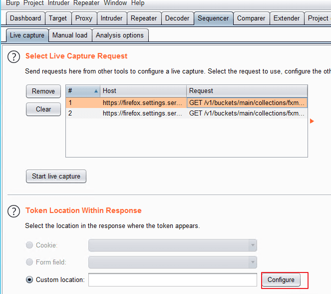

在弹出的参数配置对话框中,选中参数的值,点击[OK]按钮,完成参数设置.


点击[Select Live Capture],开始进行参数值的获取.


当抓取的参数值总数大于100时,点击[pause]或者[stop],这时可以进行数据分析,点击[Analyze now]即进行数据的随机性分析.

等分析结束,则可以看到分析结果的各种图表.

**Manual load**

当然,我们也可以把获取的数据保存起来,下一次使用的时候,从文件加载参数,进行数据分析.


**Analysis Options**

分析可选项设置的目的主要是为了控制 token 或者参数,在进行数据分析过程中,需要做什么样的处理,以及做什么类型的随机性分析.它主要由令牌处理(Token Handling)和令牌分析(Token Analysis)两部分构成.

令牌处理Token Handling主要控制令牌在数据分析中如何被处理,它的设置界面如下图所示:

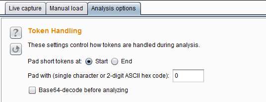

其中 Pad short tokens at start / end 表示如果应用程序产生的令牌是具有可变长度的,那么这些令牌在数据分析前都需要被填充,以便于进行的统计检验.你可以选择是否填充在开始位置或每个令牌的结束位置.在大多数情况下,在开始位置填充是最合适. Pad with 表示你可以指定将用于填充的字符.在大多数情况下,数字或 ASCII 十六进制编码的令牌,用"0"填充是最合适的. Base64-decode before analyzing 表示在数据分析是否进行 base64 解码,如果令牌使用了 base64 编码的话,则需要勾选此项.

令牌分析 Token Analysis 主要用来控制对数据进行随机性分析的类型,我们可以选择多个分析类型,也可以单独启用或禁用每个字符类型级和字节级测试.有时候,执行与启用所有分析类型进行初步分析后,再禁用某些分析类型,以便更好地了解令牌的特点,或隔离由样品表现任何不寻常的特性.


其中上面两个选项是控制数据分析的字符类型级,它包含 Count 和 Transitions.

- Count 是指分析在令牌内的每个位置使用的字符的分布,如果是随机生成的样本,所用字符的分布很可能是大致均匀的.在每个位置上分析统计令牌是随机产生的分布的概率.

- Transitions 是指分析样品数据中的连续符号之间的变化.如果是随机生成的样品,出现在一个给定的位置上的字符是同样可能通过在该位置使用的字符中的任一项中的下一个标志的改变.在每个位置上统计分析令牌随机产生到变化的概率.

下面的几项设置是用于控制数据分析的字节级测试,它比字符级测试功能更强大.启用字节级分析中,每个令牌被转换成一组字节,与设置在每个字符位置的字符的大小决定的比特的总数.它包含的测试类型有以下七种.

- FIPS monobit test——它测试分析0和1在每个比特位置的分配,如果是随机生成的样本,1和0的数量很可能是大致相等.Burp Sequencer 记录每个位是通过还是没通过 FIPS 试验观测.值得注意的是,FIPS 测试正式规范假定样本总数为20000个时.如果你希望获得的结果与该 FIPS 规范一样严格的标准,你应该确保达到20000个令牌的样本.

- FIPS poker test—— 该测试将j比特序列划分为四个连续的、非重叠的分组,然后导出4个数,计算每个数字出现16个可能数字的次数,并采用卡方校验来评估数字的分布.如果样品是随机生成的,这个数字的分布可能是近似均匀的.在每个位置上,通过该测试方式,分析令牌是随机产生的分布的概率.

- FIPS runs tests —— 该测试将具有相同值的连续的比特序列在每一个位置进行划分成段,然后计算每一个段的长度为1,2,3,4,5,和6以及6以上.如果样品是随机生成的,那么这些段的长度很可能是由样本集的大小所确定的范围之内.在每个位置上,使用该分析方法,观察令牌是随机生成的概率.

- FIPS long runs test —— 这个测试将有相同值的连续的比特序列在每一个位置进行划分成段,统计最长的段.如果样品是随机生成的,最长的段的数量很可能是由样本集的大小所确定的范围之内.在每个位置上,使用此分析方法,观察令牌是随机产生的最长段的概率.

- Spectral tests —— 该测试是在比特序列的每个位置上做一个复杂的分析,并且能够识别某些样品是通过其他统计检验的非随机性证据.样本试验通过比特序列和将每个系列的连续的数字作为多维空间的坐标并通过它绘制在这些坐标来确定每个位置这个空间的一个点.如果是随机生成的样本,点的此空间中的分布可能是大致均匀;在该空间内的簇的外观表示数据很可能是非随机的.在每个位置,使用此种分析方法,观察令牌是随机发生的概率.

- Correlation test ——比较每个位置具有相同值的令牌样本与每一个位置具有不同值的短令牌样本之间的熵,以测试在令牌内部的不同的比特位置中的值之间的任何统计学显著关系.如果样品是随机生成的,在给定的比特位置处的值是同样可能伴随着一个或一个零在任何其它位的位置.在每个位置上,使用此种分析方法,观察令牌是随机生成的可能性.为了防止任意的结果,当两个比特之间观察到一定程度的相关性,该测试调整,其显着性水平下是基于所有其他比特级测试的位的显着性水平.

- Compressoion test —— 这种测试不使用其他测试中使用的统计方法,而是通过简单直观的指标统计比特序列中每个位置熵的数量.该分析方法尝试使用标准ZLIB压缩比特序列的每个位置,结果表明,当它被压缩在比特序列的大小的比例减少,较高压缩程度表明数据是不太可能被随机产生的.

---

# Decoder 编码解码工具

Burp Decoder 的功能比较简单,作为 Burp Suite 中一款编码解码工具,它能对原始数据进行各种编码格式和散列的转换.其界面如下图,主要由输入域、输出域、编码解码选项三大部分组成.

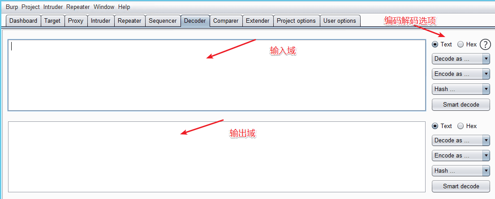

输入域即输入需要解码的原始数据,此处可以直接填写或粘贴,也可以通过其他Burp工具的上下文菜单中[Send to Decoder];输出域即对输入域进行解码的结果显示出来.无论是输入域还是输出域都支持文本与Hex两种格式,其中编码解码选项中,由解码选项 (Decode as)、编码选项 (Encode as)、散列 (Hash) 三个构成.实际使用中,可以根据场景的需要进行设置.对于编码解码选项,目前支持URL、HTML、Base64、ASCII、16进制、8进制、2进制、GZIP共八种形式的格式转换,Hash散列支持SHA、SHA-224、SHA-256、SHA-384、SHA-512、MD2、MD5格式的转换,更重要的是,对于同一个数据,我们可以在Decoder的界面,进行多次编码解码的转换.

---

# Comparer 差异比对模块

Burp Comparer 在 Burp Suite 中主要提供一个可视化的差异比对功能,来对比分析两次数据之间的区别.使用中的场景可能是:
1. 枚举用户名过程中,对比分析登陆成功和失败时,服务器端反馈结果的区别.
2. 使用 Intruder 进行攻击时,对于不同的服务器端响应,可以很快的分析出两次响应的区别在哪里.
3. 进行 SQL 注入的盲注测试时,比较两次响应消息的差异,判断响应结果与注入条件的关联关系.

对于 Comparer 的使用,主要有两个环节组成,先是数据加载,然后是差异分析. Comparer 数据加载的方式常用的有:从其他 Burp 工具通过上下文菜单转发过来、直接粘贴、从文件加载三种方式.当加载完毕后,如果你选择了两次不同的请求或应答消息,则下放的比较按钮将被激活,可以选择文本比较或者字节比较.


如果点击了[words]或者[bytes],则进入比对界面,页面自动通过背景颜色显示数据的差异.


其中,文本比较 (words) 是指通过文本的方式,比如说以 HTML 的方式,比较两个数据的差异;而字节比较 (bytes) 是指通过 16 进制的形式,比较两次内容的差异.

---

# Extender 插件模块

下载、管理 burp 的插件

官方插件商店 https://portswigger.net/bappstore

大部分插件运行需要 [Jython](https://www.jython.org/downloads.html)、[JRuby](https://www.jruby.org/download) 环境,需要在 Extender-->Options 中指定 jar 文件,或者直接安装

在Burp Extender 面板中,有一个 BApp Store 的 Tab 页,这就是 Burp 的应用商店,内容是提供各种 Burp 的插件. 默认情况下,当你点击[BApp Store]的 Tab 页时,界面列表会显示插件明细,若你的环境是通过代理访问外网的,则需要在[User Options]->[Connections]->[Upstream Proxy Servers]进行设置


安装完成的插件,都会显示在插件列表中.
