# Wireshark

<p align="center">
    
</p>

> 注 : 笔记中流量包 pcapng 源文件在其图片目录下

---

## 免责声明

`本文档仅供学习和研究使用,请勿使用文中的技术源码用于非法用途,任何人造成的任何负面影响,与本人无关.`

---

**官网**
- https://www.wireshark.org/

**样本**
- [SpiderLabs/IOCs-IDPS](https://github.com/SpiderLabs/IOCs-IDPS) - 该存储库将保存与已知恶意软件样本相关的 PCAP IOC 数据
- [Web 2.0 for packets | pcapr](https://www.pcapr.net/home) - 提供大量样本的社区
- [automayt/ICS-pcap](https://github.com/automayt/ICS-pcap) - 各类工控的 pcap 包
- [ICS-Security-Tools/pcaps](https://github.com/ITI/ICS-Security-Tools/tree/master/pcaps) - 各类工控的 pcap 包

**在线分析**
- [NetworkTotal - Free Online Network Traffic Scanner](https://www.networktotal.com/index.html)

**文章 & Reference**
- [wireshark基本用法及过虑规则](https://blog.csdn.net/hzhsan/article/details/43453251)
- [SampleCaptures - The Wireshark Wiki](https://wiki.wireshark.org/SampleCaptures)
- [CaptureSetup/USB - The Wireshark Wiki](https://wiki.wireshark.org/CaptureSetup/USB)
- [图解Wireshark协议分析实例](https://blog.csdn.net/bcbobo21cn/article/details/51454170)

**插件/增强工具**
- [pentesteracademy/patoolkit](https://github.com/pentesteracademy/patoolkit) - Wireshark 插件，增强分析能力
- [leolovenet/qqwry2mmdb](https://github.com/leolovenet/qqwry2mmdb) - 为 Wireshark 能使用纯真网络 IP 数据库(QQwry)而提供的格式转换工具,不支持 windows

---

# 安装

**Ubuntu**
```bash
sudo add-apt-repository ppa:wireshark-dev/stable
sudo apt update
sudo apt install wireshark
```

**Windows**

略

---

# 过滤语法

**比较操作符**
```bash
lt   <      # 小于
le   <=     # 小于等于
eq   ==     # 等于
gt   >      # 大于
ge   >=     # 大于等于
ne   !=     # 不等
and         # 两个条件同时满足
or          # 其中一个条件被满足
xor         # 有且仅有一个条件被满足
not         # 没有条件被满足
```

**快速使用**
```bash
http.request.method == "POST"       # POST 请求
tcp contains "http"                 # 显示 payload 中包括"http"字符串的 tcp 封包.
http.request.uri contains "online"  # 显示请求的 uri 包括"online"的 http 封包.
ip.addr == 1.1.1.1                  # IP 为 1.1.1.1 的流量

Ctrl+Alt+Shift+T,切换跟踪 tcp 流
```

**过滤 IP**

如来源 IP 或者目标 IP 等于某个 IP
```bash
ip.src eq 192.168.1.254 or ip.dst eq 192.168.1.254

或

ip.addr eq 192.168.1.254            # 都能显示来源 IP 和目标 IP
```

**过滤端口**

```bash
tcp.port eq 80                      # 不管端口是来源的还是目标的都显示
tcp.port == 80
tcp.port eq 2722
tcp.port eq 80 or udp.port eq 80
tcp.dstport == 80                   # 只显 tcp 协议的目标端口 80
tcp.srcport == 80                   # 只显 tcp 协议的来源端口 80

udp.port eq 15000
```

```bash
tcp.port >= 1 and tcp.port <= 80    # 过滤端口范围
```

**过滤协议**

```bash
tcp
udp
arp
icmp
http
smtp
ftp
dns
msnms
ip
ssl
oicq
bootp
```

排除 arp 包，如 `!arp` 或者 `not arp`

**过滤 MAC**

以太网头过滤
```bash
eth.dst == A0:00:00:04:C5:84    # 过滤目标 mac
eth.src eq A0:00:00:04:C5:84    # 过滤来源 mac
eth.dst==A0:00:00:04:C5:84
eth.dst==A0-00-00-04-C5-84
eth.addr eq A0:00:00:04:C5:84   # 过滤来源 MAC 和目标 MAC 都等于 A0:00:00:04:C5:84 的
```

**包长度过滤**

```bash
udp.length == 26                # 这个长度是指 udp 本身固定长度8加上 udp 下面那块数据包之和
tcp.len >= 7                    # 指的是 ip 数据包(tcp 下面那块数据),不包括 tcp 本身
ip.len == 94                    # 除了以太网头固定长度 14,其它都算是 ip.len,即从 ip 本身到最后
frame.len == 119                # 整个数据包长度,从 eth 开始到最后
```

**http 模式过滤**

```bash
http.request.method == “GET”
http.request.method == “POST”
http.request.uri == “/img/logo-edu.gif”
http contains “GET”
http contains “HTTP/1.”

# GET包
http.request.method == “GET” && http contains “Host: “
http.request.method == “GET” && http contains “User-Agent: “
# POST包
http.request.method == “POST” && http contains “Host: “
http.request.method == “POST” && http contains “User-Agent: “
# 响应包
http contains “HTTP/1.1 200 OK” && http contains “Content-Type: “
http contains “HTTP/1.0 200 OK” && http contains “Content-Type: “
```

**TCP 参数过滤**

```bash
tcp.flags                   # 显示包含 TCP 标志的封包。
tcp.flags.syn == 0x02       # 显示包含 TCP SYN 标志的封包。
tcp.flags.reset == 1        # 过滤 TCP RST 包。先找到 RST 包，然后右键 Follow -> TCP Stream 是常用的排障方式
tcp.window_size == 0 && tcp.flags.reset != 1
tcp.analysis.retransmission # 过滤所有的重传包
```

**包内容过滤**

```bash
tcp[20]                     # 表示从 20 开始，取 1 个字符
tcp[20:]                    # 表示从 20 开始，取 1 个字符以上
tcp[20:8]                   # 表示从 20 开始，取 8 个字符
```
```bash
udp[8:1]==32
udp[8:3]==81:60:03          # 偏移 8 个 bytes,再取 3 个数，是否与 == 后面的数据相等
eth.addr[0:3]==00:06:5B
```

matches(匹配)和 contains(包含某字符串)语法
```bash
ip.src==192.168.1.107 and udp[8:5] matches “\\x02\\x12\\x21\\x00\\x22″
ip.src==192.168.1.107 and udp contains 02:12:21:00:22
ip.src==192.168.1.107 and tcp contains “GET”
udp contains 7c:7c:7d:7d    # 匹配 payload 中含有 0x7c7c7d7d 的 UDP 数据包，不一定是从第一字节匹配。
```

---

# 捕获USB流量

**工具**
- [USBPcap - USB Packet capture for Windows](https://desowin.org/usbpcap/)
- [JohnDMcMaster/usbrply](https://github.com/JohnDMcMaster/usbrply) - 将 .pcap 文件（捕获的 USB 数据包）转换为 Python 或 C 代码，以重播捕获的 USB 命令。

**文章**
- [使用wireshark抓取USB包](https://blog.csdn.net/shiailan/article/details/97305163)
- [Wireshark如何捕获USB流量](https://www.freebuf.com/column/166711.html)

---

# 案例

## SampleCaptures

下载 [iperf-mptcp-0-0.pcap](https://wiki.wireshark.org/SampleCaptures?action=AttachFile&do=get&target=iperf-mptcp-0-0.pcap)

下载后双击用 wireshark 打开。 编号 534 开始有重传（TCP Retransmition）的包：

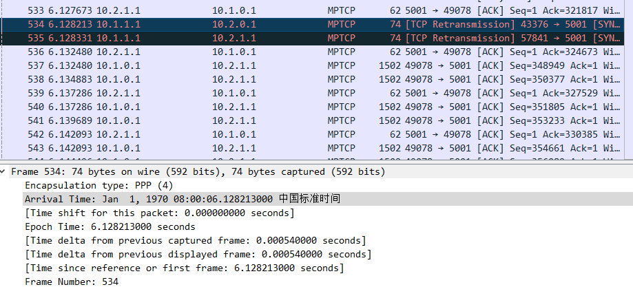

Ctrl+Alt+Shift+T,切换跟踪 tcp 流,可以发现,这个连接只有 3 个包

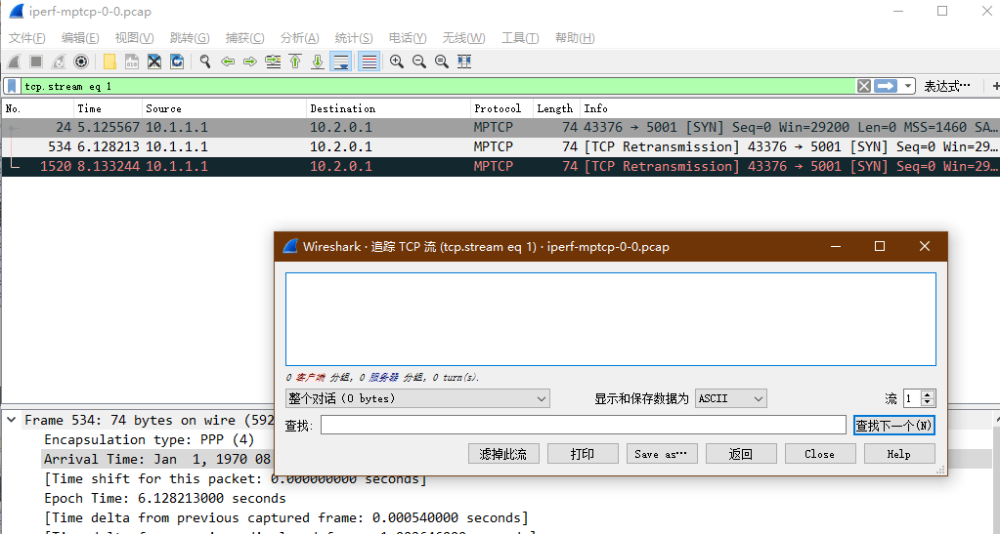

TCP 重传的机制：指数后退，比如第一次等待 1s，第二次等 待 2s，第三次等待 4s，第四次 8s

- 第一个编号 24 的包发出，请求建立连接
- 超过 1s 后，客户端没有收到服务端的 ACK 包，触发客户端 TCP 超时重传，编号 534 的包发出
- 又过了大约 2s，仍然没有收到 ACK 包，再次触发超时重传，编号 1520 的包发出

从这个抓包文件看，这次连接没有建立起来，而直接原因就是 client 没有收到 server 的应答包。

当然仅凭这个无法判断直接原因，还需要在 server 端抓包，查看 server 到底是否发出回包，若发出，说明在链路中未传输到对端。可能是链路中问题。

---

点击 统计 -- 捕获文件属性

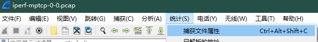

查看文件的详细信息，包的数量，被什么封装等等


点击 统计 -- 协议分级,能看到捕获数据中的协议包含层次情况；本捕获文件的最外层协议是 PPP，然后是 IPV4 协议，TCP 协议

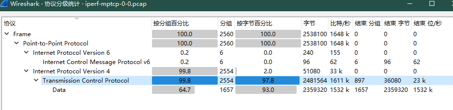

点击 统计 -- Conversations,可见 IPv4 和 TCP 的对话情况


点击 统计 -- 分组长度,不同长度的包的分配情况

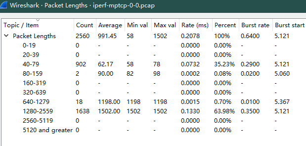

点击 统计 -- I/O 图表


---

## NTLMv2

192.168.141.1(WIN10)——>192.168.141.139(WIN2008)

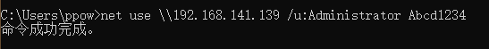

查看第一个数据包协商

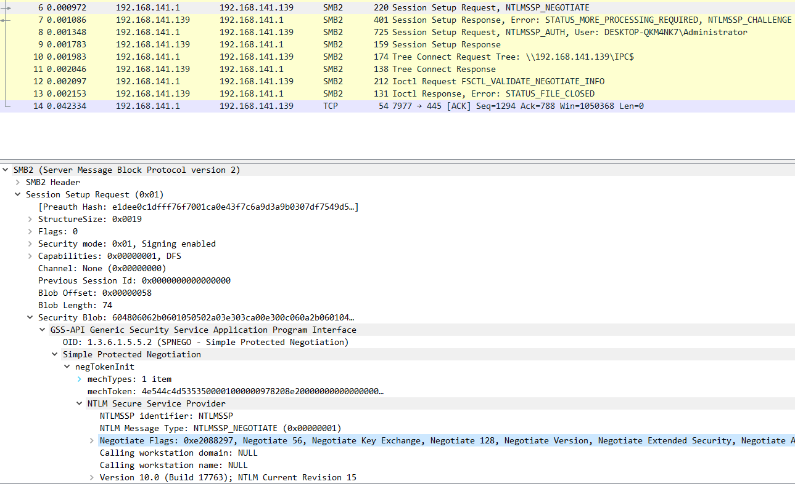

查看第二个数据包质询,获得 Challenge

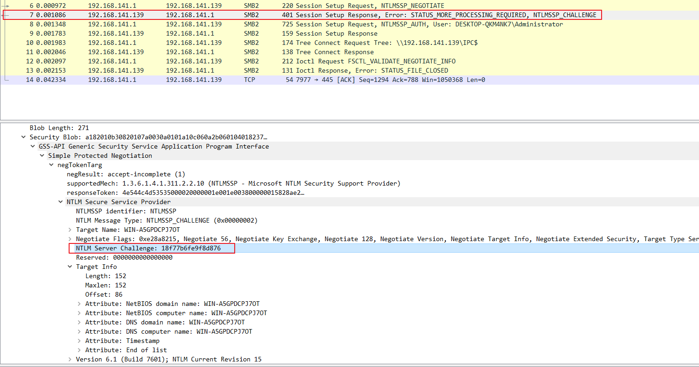

查看第三个数据包身份验证,其中可以获得客户端加密后的 Challenge

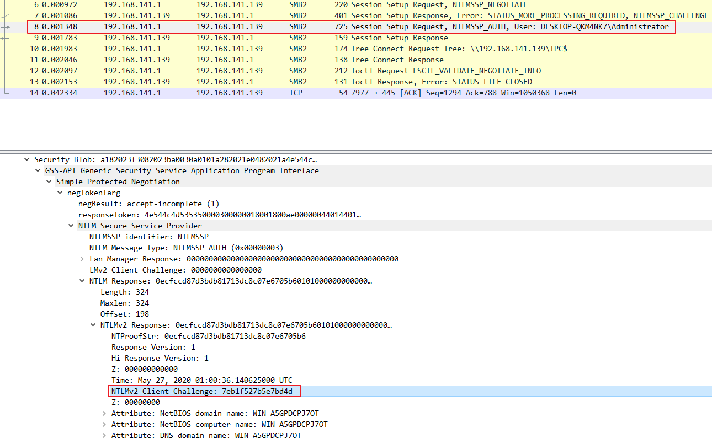

- username（要访问服务器的用户名）：Administrator
- domain（访问者主机名或者 ip）：DESKTOP-QKM4NK7
- challenge（数据包 2 中服务器返回的 challenge 值）：18f77b6fe9f8d876
- HMAC-MD5（数据包 3 中的 NTProofStr）: 0ecfccd87d3bdb81713dc8c07e6705b6
- blob（blob 对应数据为 NTLMv2 Response 开头去掉 NTProofStr 的后半部分）：01010000000000002a470d3bc233d6017eb1f527b5e7bd4d0000000002001e00570049004e002d0041003500470050004400430050004a0037004f00540001001e00570049004e002d0041003500470050004400430050004a0037004f00540004001e00570049004e002d0041003500470050004400430050004a0037004f00540003001e00570049004e002d0041003500470050004400430050004a0037004f005400070008002a470d3bc233d601060004000200000008003000300000000000000001000000002000003737fbe7dbcbd2c8e5d7a030f44586c91423d9c5202f827f3f6cf26f69adbfe80a001000000000000000000000000000000000000900280063006900660073002f003100390032002e003100360038002e003100340031002e003100330039000000000000000000

所以构造，Net-NTLM v2 Hash 值为：
```
Administrator::DESKTOP-QKM4NK7:18f77b6fe9f8d876:0ecfccd87d3bdb81713dc8c07e6705b6:01010000000000002a470d3bc233d6017eb1f527b5e7bd4d0000000002001e00570049004e002d0041003500470050004400430050004a0037004f00540001001e00570049004e002d0041003500470050004400430050004a0037004f00540004001e00570049004e002d0041003500470050004400430050004a0037004f00540003001e00570049004e002d0041003500470050004400430050004a0037004f005400070008002a470d3bc233d601060004000200000008003000300000000000000001000000002000003737fbe7dbcbd2c8e5d7a030f44586c91423d9c5202f827f3f6cf26f69adbfe80a001000000000000000000000000000000000000900280063006900660073002f003100390032002e003100360038002e003100340031002e003100330039000000000000000000
```

---

## 域环境中NTLM认证方式

192.168.141.140(WIN2008)——>192.168.141.135(WIN2008)

域控 : 192.168.141.139

FQDN : ffffffff0x.com

账号密码 : Administrator  Abcd1234


---

## S7Comm

**s7comm_downloading_block_db1**

下载 [SampleCaptures/s7comm_downloading_block_db1.pcap](https://wiki.wireshark.org/SampleCaptures?action=AttachFile&do=get&target=s7comm_downloading_block_db1.pcap)

下载后双击用 wireshark 打开。

*COTP Connection Packet*
- COTP 连接请求包

    

- COTP 请求确认包

    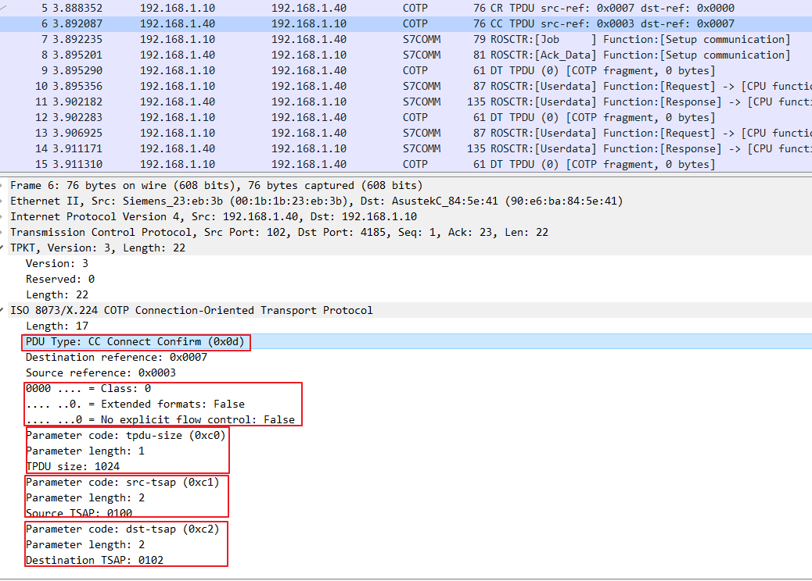

*COTP Fuction Packet*
- 数据传输包

    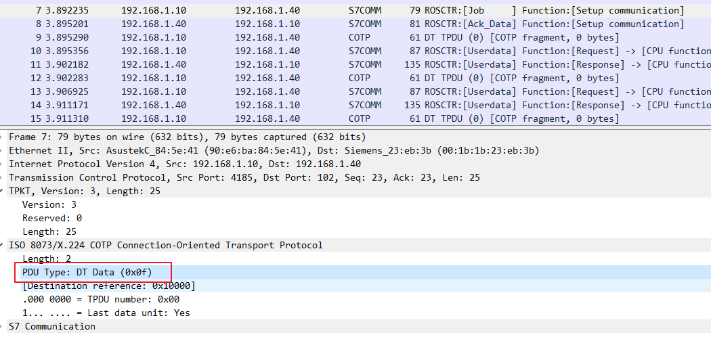

*S7Comm*
- S7Comm Header

    

    其中最重要的字段就是 ROSCTR，它决定了后续参数的结构

    在响应数据包中，还有可能存在错误信息

    

    可见图中的错误类型就是 No error

- Parameter

    

- 建立通信（Setup communication [0xF0]）

    - 请求

        

    - 响应

        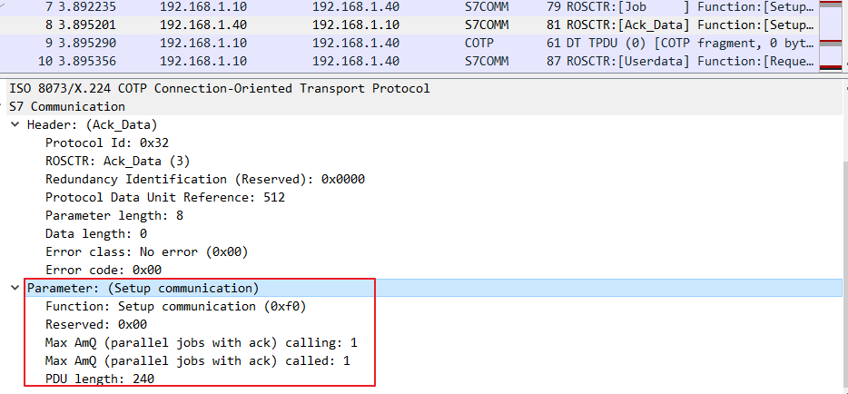

    其协商结果为：ACK 队列的大小为 1；最大 PDU 长度为 240。

- 请求下载（Request download [0x1A]）

    - 请求

        

        如图所示，文件标识是 _ (Complete Module)，块类型为 OB，块的编号为 00001，目标块的文件系统是 P (Passive (copied, but not chained) module)，所以文件名为 _0A00001P。

    - 响应

        

- 下载块（Download block [0x1B]）

    - 请求

        

    - 响应

        

- 下载结束（Download ended [0x1C]）

    - 请求

        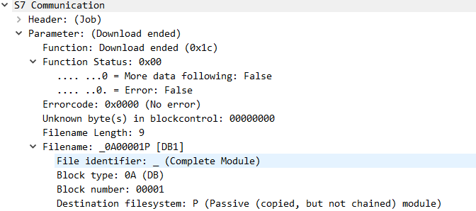

    - 响应

        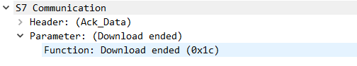

- 程序调用服务（PI service [0x28]）

    - 请求

        

    - 响应

        

**snap7_s300_everything**

下载 [ICS-Security-Tools/pcaps/s7/snap7_s300_everything.pcapng](https://github.com/ITI/ICS-Security-Tools/blob/master/pcaps/s7/snap7_s300_everything.pcapng)

*S7Comm*

- 开始上传（Start upload [0x1D]）

    - 请求

        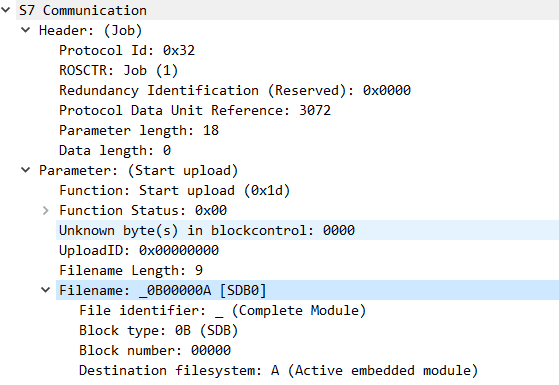

    - 响应

        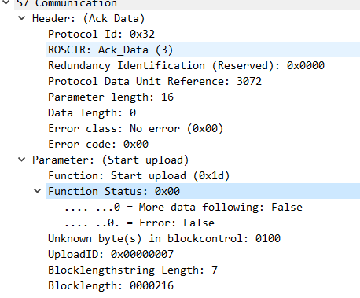

- 上传（Upload [0x1E]）

    - 请求

        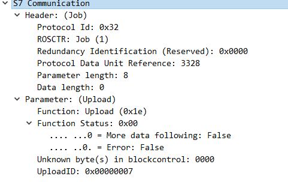

    - 响应

        

- 上传结束（End upload [0x1F]）

    - 请求

        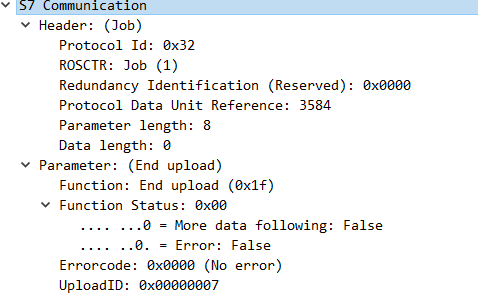

    - 响应

        

**s7comm_varservice_libnodavedemo**

下载 [SampleCaptures/s7comm_varservice_libnodavedemo.pcap](https://wiki.wireshark.org/SampleCaptures?action=AttachFile&do=get&target=s7comm_varservice_libnodavedemo.pcap)

下载后双击用 wireshark 打开。

*S7Comm*
- 读取值（Read Var [0x04]）

    - 读值操作的作业请求

        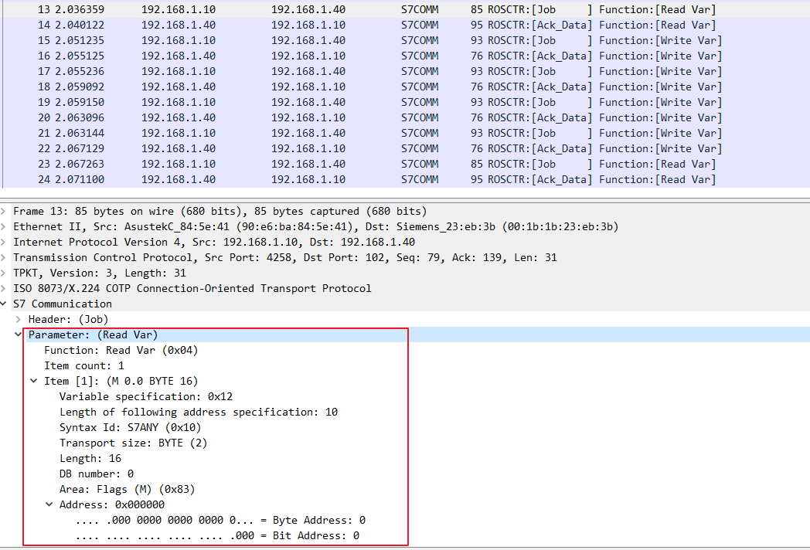

    - 响应

        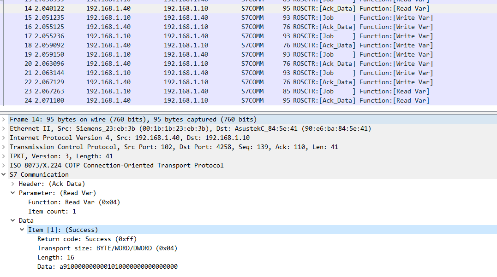

- 写入值（Write Var [0x05]）

    - 向地址为 0×000020 的 Flags（M）写入 0×0103 的作业请求

        

    - 向地址为 0×000020 的 Flags（M）写入 0×0103 的确认响应

        

    图中的 item1，说明向地址为 0×000020 的Flags（M）写入 0×0103 成功！

**PLC STOP [0x29]**

192.168.141.1(WIN10)——>192.168.141.128(WIN2019)

snap7 client --> snap7 server

- 请求

    

- 响应

    

**Userdata 协议拓展**

192.168.100.56(WIN10)——>192.168.100.56(WIN10)

snap7 client --> snap7 server

*S7Comm*
- 块功能（Block functions [0x3]）

    - 列举所有块（List blocks）
        - 请求

            

        - 响应

            

    - 列举块类型（List blocks of type）
        - 请求

            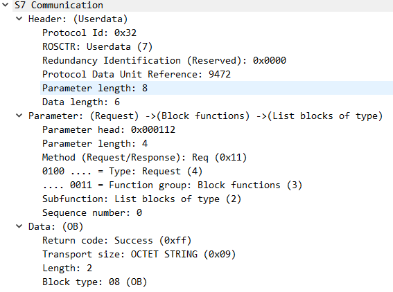

        - 响应

            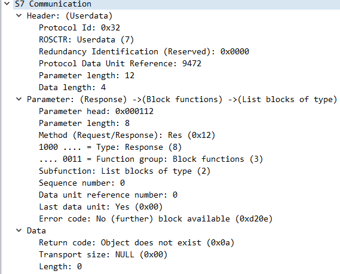

    - 读取模块的信息（Get block info）
        - 请求

            

- CPU功能（CPU functions [0x4]）

    - 系统状态列表（SZL）
        - 请求

            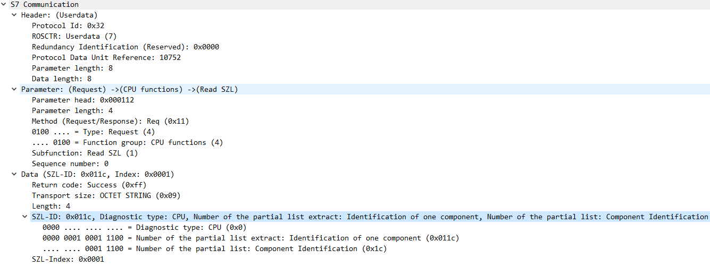

        - 响应

            

- 安全功能（Security [0x5]）

    - PLC密码（PLC password）

        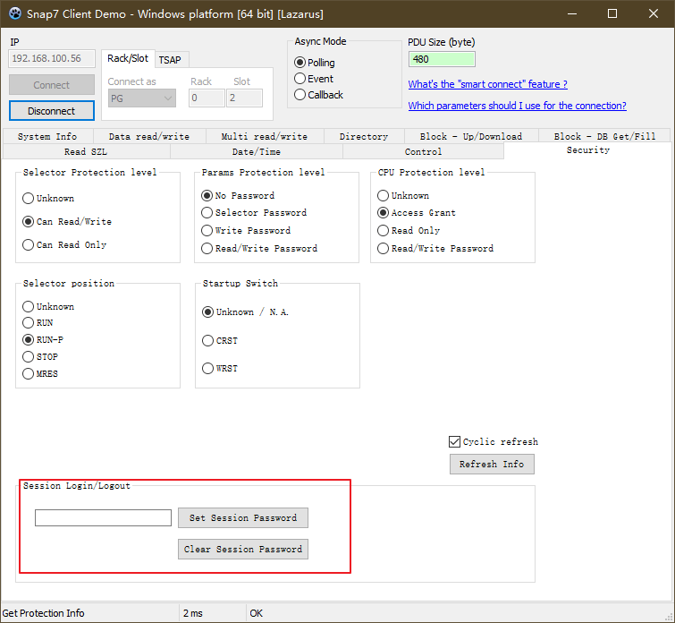

        - 请求

            

            Data 是 64 67 02 06 62 65 17 10
            - 第1位：0x64 ^ 0x55 = 0x31，则值是‘1’；
            - 第2位：0x67 ^ 0x55 = 0x32，则值是‘2’；
            - 第3位：0x02 ^ 0x55 ^ 0x64 = 0x33，则值是‘3’；
            - 第4位：0x06 ^ 0x55 ^ 0x67 = 0x34，则值是‘4’；
            - 第5位：0x62 ^ 0x55 ^ 0x02 = 0x35，则值是‘5’；
            - 第6位：0x65 ^ 0x55 ^ 0x06 = 0x36，则值是‘6’；
            - 第7位：0x17 ^ 0x55 ^ 0x62 = 0x20，则值是‘ ’；
            - 第8位：0x10 ^ 0x55 ^ 0x65 = 0x20，则值是‘ ’；

        - 响应

            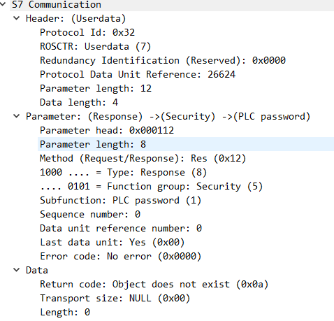

- 时间功能（Time functions [0x7]）

    - 读时间（Read clock）；

        - 请求

            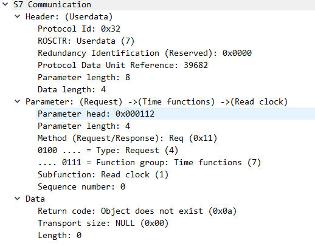

        - 响应

            

---

## Ethernet/IP

下载 [ICS-Security-Tools/pcaps/EthernetIP/enip_test.pcap](https://github.com/ITI/ICS-Security-Tools/blob/master/pcaps/EthernetIP/enip_test.pcap)

- 请求

    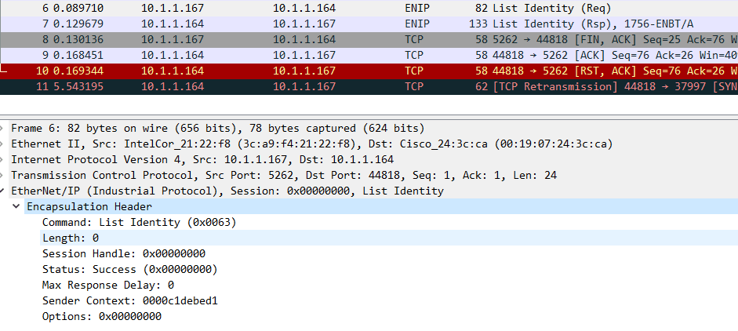

    - Command:命令，list identify 表示检测到 Ethernet/IP 列表身份的命令。
    - Length:长度为 0，因为这个是一个请求包，没有数据长度。
    - Session Handle：记住这里为0，后续的返回包我们看看是不是一样的。
    - Status: Success(0×00000000)
    - Max Response Delay:0,这个包发送是实时的。
    - Sender Context:0000c1debed1,正好6个字节的内容，等看看是不是一样的。
    - Options:0,这里为始终为0。

- 响应

    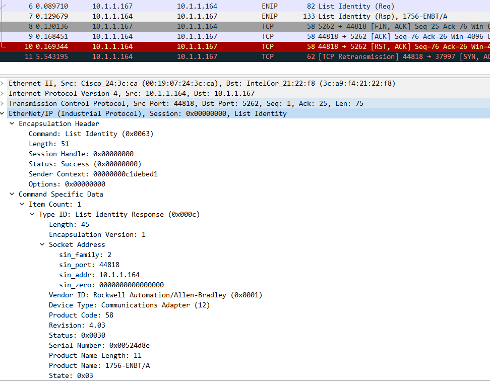

    - Length:长度不是0了，因为后面有了数据内容。
    - Session Handle:还是0，和请求包是一样的。
    - Sender Context:和请求包一样，证明是对应的返回包。
    - Command Specific Data:数据内容，这部分不需要细看了，里面是一些设备信息，这些在工控渗透时可能会用到。
