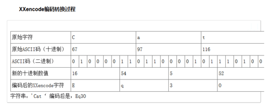
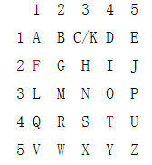
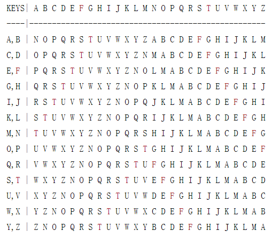
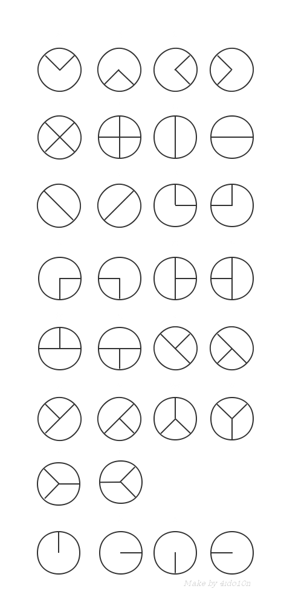
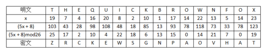

#  Crypto

> 本部分内容最初由 [幻羽灵殇](https://github.com/syl2293686270) 提供,在此只做排版修改,和后续内容维护

---

## 免责声明

`本文档仅供学习和研究使用,请勿使用文中的技术源码用于非法用途,任何人造成的任何负面影响,与本人无关.`

---

# 大纲

* **常见编码**
    * [ASCII](#ascii)
    * [Base](#base)
        * [Base64/32/16](#base643216)
        * [base92](#base92)
    * [Escape/Unescape](#escapeunescape)
    * [HtmlEncode](#htmlencode)
    * [Quoted-printable](#quoted-printable)
    * [Unicode](#unicode)
    * [URL](#url)
    * [UTF](#utf)
    * [UUencode](#uuencode)
    * [XXencode](#xxencode)
    * [shellcode](#shellcode)
    * [进制](#进制)
    * [敲击码](#敲击码)
    * [曼彻斯特编码](#曼彻斯特编码)
    * [图片码](#图片码)
        * [条形码](#条形码)
        * [二维码](#二维码)
        * [汉信码](#汉信码)
        * [PDF147](#pdf147)

* **现代密码**
    * [AES](#aes)
    * [MD5](#md5)
    * [rc4](#rc4)
    * [RIPE_MD160](#ripe_md160)
    * [RSA](#rsa)
    * [SHA](#sha)
    * [SM](#sm)

* **古典密码**
    * [换位加密](#换位加密)
        * [栅栏密码](#栅栏密码)
        * [曲路密码](#曲路密码)
        * [列移位密码](#列移位密码)
    * [替换加密](#替换加密)
        * [ADFGX](#adfgx)
        * [Bazeries](#bazeries)
        * [Digrafid](#digrafid)
        * [Porta](#porta)
        * [ROT](#rot)
        * [埃特巴什码](#埃特巴什码)
        * [查尔斯加密](#查尔斯加密)
        * [凯撒密码](#凯撒密码)
        * [摩斯电码](#摩斯电码)
        * [简单替换密码](#简单替换密码)
        * [希尔密码](#希尔密码)
        * [波利比奥斯方阵密码](#波利比奥斯方阵密码)
        * [夏多密码](#夏多密码)
        * [普莱菲尔密码](#普莱菲尔密码)
        * [自动密钥密码](#自动密钥密码)
        * [博福特密码](#博福特密码)
        * [滚动密钥密码](#滚动密钥密码)
        * [同音替换密码](#同音替换密码)
        * [仿射密码](#仿射密码)
        * [培根密码](#培根密码)
        * [双密码](#双密码)
        * [三分密码](#三分密码)
        * [四方密码](#四方密码)
        * [棋盘密码](#棋盘密码)
        * [跨棋盘密码](#跨棋盘密码)
        * [分组摩尔斯替换密码](#分组摩尔斯替换密码)
        * [格朗普雷密码](#格朗普雷密码)
        * [比尔密码](#比尔密码)
        * [键盘密码](#键盘密码)
        * [恩尼格玛密码](#恩尼格玛密码)
        * [维吉尼亚密码](#维吉尼亚密码)
        * [猪圈密码](#猪圈密码)

* **其他编码**
    * [Brainfuck](#brainfuck)
    * [JSfuck](#jsfuck)
    * [JS加密/解密](#js加密解密)
    * [颜文字加密](#颜文字加密)
    * [与佛论禅](#与佛论禅)
    * [文本加密为汉字](#文本加密为汉字)
    * [随机密码生成](#随机密码生成)
    * [核心价值观加密](#核心价值观加密)

---

**教程资源**
- http://www.practicalcryptography.com/
- https://cryptopals.com/
- https://ctf-wiki.github.io/ctf-wiki/crypto/introduction/
- https://intensecrypto.org/public/

**文章**
- [为什么要在密码里加点"盐" | Libuchao's blog](https://libuchao.com/2013/07/05/password-salt)
- [CTF中那些脑洞大开的编码和加密 - jack_Meng](https://www.cnblogs.com/mq0036/p/6544055.html)
- [How we recovered over $300K of Bitcoin](https://reperiendi.wordpress.com/2020/04/03/how-i-recovered-over-300k-of-bitcoin/)

**工具**
- [ffffffff0x/CryptionTool](https://github.com/ffffffff0x/CryptionTool) - CTF工具框架,集成常见加解密，密码、编码转换，端口扫描，字符处理等功能
- [Snowming04/Cipher_Encryption_Type_Identification:.](https://github.com/Snowming04/Cipher_Encryption_Type_Identification) - 对密文的加密类型进行判断的命令行工具
- [gchq/CyberChef](https://github.com/gchq/CyberChef) - 一个用于加密、编码、压缩和数据分析的网络应用
- [guyoung/CaptfEncoder](https://github.com/guyoung/CaptfEncoder) - 一款跨平台网络安全工具套件
- [lockedbyte/cryptovenom](https://github.com/lockedbyte/cryptovenom) - 密码学的瑞士军刀
- [Acmesec/CTFCrackTools](https://github.com/Acmesec/CTFCrackTools) - CTF工具框架

**在线工具**
- [Crypto在线工具](../../../Plan/Web-Tools.md#Crypto)

---

# 简介

密码学(Cryptography)一般可分为古典密码学和现代密码学.

其中,古典密码学,作为一种实用性艺术存在,其编码和破译通常依赖于设计者和敌手的创造力与技巧,并没有对密码学原件进行清晰的定义.古典密码学主要包含以下几个方面:

- 单表替换加密(Monoalphabetic Cipher)
- 多表替换加密(Polyalphabetic Cipher)
- 奇奇怪怪的加密方式

而现代密码学则起源于 20 世纪中后期出现的大量相关理论,1949 年香农(C. E. Shannon)发表了题为《保密系统的通信理论》的经典论文标志着现代密码学的开始.现代密码学主要包含以下几个方面:

- 对称加密(Symmetric Cryptography),以 DES,AES,RC4 为代表.
- 非对称加密(Asymmetric Cryptography),以 RSA,ElGamal,椭圆曲线加密为代表.
- 哈希函数(Hash Function),以 MD5,SHA-1,SHA-512 等为代表.
- 数字签名(Digital Signature),以 RSA 签名,ElGamal 签名,DSA 签名为代表.

其中,对称加密体制主要分为两种方式:

- 分组密码(Block Cipher),又称为块密码.
- 序列密码(Stream Cipher),又称为流密码.

一般来说,密码设计者的根本目标是保障信息及信息系统的

- 机密性(Confidentiality)
- 完整性(Integrity)
- 可用性(Availability)
- 认证性(Authentication)
- 不可否认性(Non-repudiation)

其中,前三者被称为信息安全的 CIA 三要素 .

而对于密码破解者来说,一般是要想办法识别出密码算法,然后进行暴力破解,或者利用密码体制的漏洞进行破解.当然,也有可能通过构造虚假的哈希值或者数字签名来绕过相应的检测.

攻击类型	|   说明
- | -
唯密文攻击	|   只拥有密文
已知明文攻击 |	拥有密文与对应的明文
选择明文攻击 |	拥有加密权限,能够对明文加密后获得相应密文
选择密文攻击 |	拥有解密权限,能够对密文解密后获得相应明文

---

# 常见编码

`更多内容可以参考` [字符编码](../../开发/字符编码/字符编码.md#编码)

## ASCII

ASCII 编码大致可以分作三部分组成:

- 第一部分是:ASCII 非打印控制字符;

- 第二部分是:ASCII 打印字符,也就是 CTF 中常用到的转换;

- 第三部分是:扩展 ASCII 打印字符.

编码转换示例

> 源文本: The quick brown fox jumps over the lazy dog

ASCII编码对应十进制:

> 84 104 101 32 113 117 105 99 107 32 98 114 111 119 110 32 102111     120 32 106 117 109 112 115 32 111 118 101 114 32 116104  101 32    108 97 122 121 32 100 111 103

对应可以转换成二进制,八进制,十六进制等.

**在线工具**
- [ASCII转换在线工具](../../../Plan/Web-Tools.md#ASCII转换)

---

## Base
### Base64/32/16

base64、base32、base16 可以分别编码转化8位字节为6位、5位、4位.16,32,64 分别表示用多少个字符来编码,这里我注重介绍 base64.Base64 常用于在通常处理文本数据的场合,表示、传输、存储一些二进制数据.包括 MIME 的 email,email via MIME,在 XML 中存储复杂数据.

编码原理:Base64 编码要求把3个8位字节转化为4个6位的字节,之后在6位的前面补两个0,形成8位一个字节的形式,6位2进制能表示的最大数是2的6次方是64,这也是为什么是64个字符(A-Z,a-z,0-9,+,/这64个编码字符,=号不属于编码字符,而是填充字符)的原因,这样就需要一张映射表,如下:


例子(base64):
```
源文本 : T h e
对应 ascii 码 : 84 104 101
8 位 binary : 01010100 01101000 01100101
6 位 binary : 010101 000110 100001 100101
高位补 0 : 000010101 00000110 00100001 00100101
对应 ascii 码 : 21 6 33 37
查表 : V G h l
```

**在线工具**
- [Base转换在线工具](../../../Plan/Web-Tools.md#Base)

---

### base92

- https://github.com/thenoviceoof/base92

**在线工具**
- [Base转换在线工具](../../../Plan/Web-Tools.md#Base)

---

## Escape/Unescape

Escape/Unescape 加密解码/编码解码,又叫 %u 编码,采用 UTF-16BE 模式, Escape 编码/加密,就是字符对应 UTF-16 16 进制表示方式前面加 %u.Unescape 解码/解密,就是去掉"%u"后,将 16 进制字符还原后,由 utf-16 转码到自己目标字符.如:字符"中",UTF-16BE是:"6d93",因此 Escape 是"%u6d93".

> 源文本: The
>
> 编码后: %u0054%u0068%u0065

---

## HtmlEncode

`HTML实体编码`

HTML 4.01 支持 ISO 8859-1 (Latin-1) 字符集.

ISO-8859-1 的较低部分(从 1 到 127 之间的代码)是最初的 7 比特 ASCII.

ISO-8859-1 的较高部分(从 160 到 255 之间的代码)全都有实体名称.

这些符号中的大多数都可以在不进行实体引用的情况下使用,但是实体名称或实体编号为那些不容易通过键盘键入的符号提供了表达的方法.

注释:实体名称对大小写敏感.

/////[HTML ISO 8859-1 符号实体](https://www.w3school.com.cn/tags/html_ref_entities.html)/////

**带有实体名称的 ASCII 实体**
结果|	描述|	实体名称|	实体编号
|-|-|-|-
`"` |	quotation mark|	`&quot;`|	`&#34;`
`'` |	apostrophe| 	`&apos;`|	`&#39;`
`&` |	ampersand|	`&amp;`|	`&#38;`
`<` |	less-than|	`&lt;`|	`&#60;`
`>` |	greater-than|	`&gt;`|	`&#62;`

**在线工具**
- [HtmlEncode转换在线工具](../../../Plan/Web-Tools.md#HTML编码)

---

## Quoted-printable

Quoted-printable 可译为"可打印字符引用编码"、"使用可打印字符的编码",我们收邮件,查看信件原始信息,经常会看到这种类型的编码!

很多时候,我们在邮件头里面能够看到这样的编码

`Content-Transfer-Encoding:quoted-printable`

它是多用途互联网邮件扩展 (MIME) 一种实现方式.其中MIME是一个互联网标准,它扩展了电子邮件标准,致力于使其能够支持非ASCII字符、二进制格式附件等多种格式的邮件消息.目前http协议中,很多采用MIME框架!quoted-printable 就是说用一些可打印常用字符,表示一个字节(8位)中所有非打印字符方法

**编码方法**

任何一个8位的字节值可编码为3个字符:一个等号"="后跟随两个十六进制数字(0–9或A–F)表示该字节的数值.例如,ASCII 码换页符(十进制值为12)可以表示为"=0C", 等号"="(十进制值为61)必须表示为"=3D". 除了可打印ASCII字符与换行符以外,所有字符必须表示为这种格式.

所有可打印ASCII字符(十进制值的范围为33到126)可用ASCII字符编码来直接表示, 但是等号"="(十进制值为61)不可以这样直接表示.ASCII的水平制表符(tab)与空格符, 十进制为9和32, 如果不出现在行尾则可以用其ASCII字符编码直接表示.如果这两个字符出现在行尾,必须QP编码表示为"=09″ (tab)或"=20″ (space).

如果数据中包含有意义的行结束标志,必须转换为 ASCII 回车(CR)换行(LF)序列,既不能用原来的 ASCII 字符也不能用 QP 编码的"="转义字符序列. 相反,如果字节值13与10有其它的不是行结束的含义,它们必须 QP 编码为 =0D 与 =0A.

quoted-printable 编码的数据的每行长度不能超过76个字符. 为满足此要求又不改变被编码文本,在QP编码结果的每行末尾加上软换行(soft line break). 即在每行末尾加上一个"=", 但并不会出现在解码得到的文本中.

> 例如:If you believe that truth=beauty, then surely mathematics is the most beautiful branch of philosophy. 编码后结果是
>
> If you believe that truth=3Dbeauty, then surely=20=
mathematics is the most beautiful branch of philosophy.

编码里面,有几个特定限定,一些可打印字符不用编码,当然如果你按照规范编码后,也一样可以显示的!因此自己简单自己实现该编码:
```php
function quoted_printable_encode($string) {
    return preg_replace('/[^\r\n]{73}[^=\r\n]{2}/', "$0=\r\n", str_replace("%","=",
rawurlencode($string)));
}
```
一个函数就可以,将所有字符串urlencode转换后,%号替换为"="号,然后对非\r\n超过73连续字符,后面加一个=\r\n.这个是简单实现方法.按照该编码详细说明里面,有些空格、换行,还有一些特殊字符可以不用转换.不过一起转换了,也不会有影响

**在线工具**
- [Quoted-Printable转换在线工具](../../../Plan/Web-Tools.md#Quoted-Printable)

---

## Unicode

Unicode 编码有以下四种编码方式:

> 源文本: The
>
>> &#x [Hex]: &#x0054;&#x0068;&#x0065;
>
>> &# [Decimal]: &#00084;&#00104;&#00101;
>
>> \U [Hex]: \U0054\U0068\U0065
>
>> \U+ [Hex]: \U+0054\U+0068\U+0065

**在线工具**
- [Unicode编码在线转换工具](../../../Plan/Web-Tools.md#Unicode编码)

---

## URL

url 编码又叫百分号编码,是统一资源定位(URL)编码方式.URL地址(常说网址)规定了常用地数字,字母可以直接使用,另外一批作为特殊用户字符也可以直接用(/,:@等),剩下的其它所有字符必须通过%xx编码处理. 现在已经成为一种规范了,基本所有程序语言都有这种编码,如js:有encodeURI、encodeURIComponent,PHP有 urlencode、urldecode等.编码方法很简单,在该字节ascii码的的16进制字符前面加%. 如 空格字符,ascii码是32,对应16进制是'20',那么urlencode编码结果是:%20.

> 源文本:

> The quick brown fox jumps over the lazy dog

> 编码后:

>%54%68%65%20%71%75%69%63%6b%20%62%72%6f%77%6e%20%66%6f%78%20%6a%75%6d%70%73%20%6f%76%65%72%20%74%68%65%20%6c%61%7a%79%20%64%6f%67

**在线工具**
- [url编码在线转换工具](../../../Plan/Web-Tools.md#url编码)

---

## UTF

**在线工具**
- [utf编码在线转换工具](../../../Plan/Web-Tools.md#utf)

---

## UUencode

UUencode 是一种二进制到文字的编码,最早在 unix 邮件系统中使用,全称:Unix-to-Unix encoding,UUencode 将输入文本以每三个字节为单位进行编码,如果最后剩下的资料少于三个字节,不够的部份用零补齐.三个字节共有24个Bit,以6-bit为单位分为4个组,每个组以十进制来表示所出现的字节的数值.这个数值只会落在0到63之间.然后将每个数加上32,所产生的结果刚好落在ASCII字符集中可打印字符(32-空白…95-底线)的范围之中.

> 源文本: The quick brown fox jumps over the lazy dog

> 编码后: `M5&AE('%U:6-K(&)R;W=N(&9O>"!J=6UP<R!O=F5R('1H92!L87IY(&1O9PH*`

**在线工具**
- [uuencode编码在线转换工具](../../../Plan/Web-Tools.md#uuencode编码)

---

## XXencode

XXencode 将输入文本以每三个字节为单位进行编码.如果最后剩下的资料少于三个字节,不够的部份用零补齐.这三个字节共有24个Bit,以6bit为单位分为4个组,每个组以十进制来表示所出现的数值只会落在0到63之间.以所对应值的位置字符代替.它所选择的可打印字符是`+-0123456789ABCDEFGHIJKLMNOPQRSTUVWXYZabcdefghijklmnopqrstuvwxyz`,一共64个字符.跟 base64 打印字符相比,就是 UUencode 多一个"-" 字符,少一个"/" 字符.



> 源文本:
> The quick brown fox jumps over the lazy dog\
> 编码后:
> hJ4VZ653pOKBf647mPrRi64NjS0-eRKpkQm-jRaJm65FcNG-gMLdt64FjNkc+

**在线工具**
- [XXencode编码在线转换工具](../../../Plan/Web-Tools.md#XXencode编码)

---

## shellcode

源文本:

`The quick brown fox jumps over the lazy dog`

编码后:

```
\x54\x68\x65\x7f\x71\x75\x69\x63\x6b\x7f\x62\x72\x6f\x77\x6e\x7f\x66\x6f\x78\x7f\x6a\x75\x6d\x70\x73\x7f\x6f\x76\x65\x72\x7f\x74\x68\x65\x7f\x6c\x61\x7a\x79\x7f\x64\x6f\x67
```

---

## 进制

**在线工具**
- [进制在线转换工具](../../../Plan/Web-Tools.md#进制)

---

## 敲击码

敲击码(Tap code)是一种以非常简单的方式对文本信息进行编码的方法.因该编码对信息通过使用一系列的点击声音来编码而命名,敲击码是基于5×5方格波利比奥斯方阵来实现的,不同点是是用K字母被整合到C中.

敲击码表:




---

## 曼彻斯特编码

**科普介绍**
- [曼彻斯特编码](https://zh.wikipedia.org/wiki/%E6%9B%BC%E5%BD%BB%E6%96%AF%E7%89%B9%E7%BC%96%E7%A0%81)

在电信与数据存储中, 曼彻斯特编码(Manchester coding),又称自同步码、相位编码(phase encoding,PE),能够用信号的变化来保持发送设备和接收设备之间的同步.

它用电压的变化来分辨0和1,从高电平到低电平的跳变代表1,而从低电平到高电平的跳变代表0(as per G.E.Tomas编码方式).从高电平到低电平的跳变代表0,而从低电平到高电平的跳变代表1(as per IEEE 802.3编码方式)

信号的保持不会超过一个比特位的时间间隔.即使是0或1的序列,信号也将在每个时间间隔的中间发生跳变.这种跳变将允许接收设备的时钟与发送设备的时钟保持一致.

- 优点

    与 NRZ 相比,曼彻斯特编码提供一种同步机制,保证发送端与接收端信号同步.

- 缺点

    曼彻斯特编码的频率要比NRZ高一倍,传输等量数据所需的带宽大一倍


(根据802.3中规定编码方式)从接收的编码位中提取原始数据:

<table style="text-align:center;">
<tr><th>原始数据</th><th></th><th>时钟</th><th></th><th>曼彻斯特值</th></tr><tr><td rowspan="2">0</td><td rowspan="4">=</td><td>0</td><td rowspan="4">XOR <br />⊕</td><td>0</td></tr><tr><td>1</td><td>1</td></tr><tr><td rowspan="2">1</td><td>0</td><td>1</td></tr><tr><td>1</td><td>0</td></tr></table>

总结:

- 每个比特发送时间恒定("周期").
- 0用低至高转换表示,1用高到低转换表示(根据G.E. Thomas方式—IEEE 802.3方式与之相反).
- 表示0或1的转换出现在周期的中点.
- 周期开始的转换不表示数据.

应用

曼彻斯特编码被物理层用来编码一个同步位流的时钟和数据.因此,曼彻斯特编码被用在以太网媒介系统中.

曼彻斯特编码提供一个简单的方式给编码简单的二进制序列而没有长的周期及转换级别,因而防止时钟同步的丢失,或来自低频率位移在贫乏补偿的模拟链接位错误.

在这个技术下,实际上的二进制数据被传输通过这个电缆,不是作为一个序列的逻辑1或0来发送的(NRZ).与NRZ相反,这些位被转换为一个稍微不同的格式,它通过使用直接的二进制编码.

曼彻斯特编码还被用于局域网传输.

---

## 图片码
### 条形码


### 二维码

**在线制作/识别二维码工具**
- [二维码在线制作/识别工具](../../../Plan/Web-Tools.md#二维码)

**二维码分析与恢复工具包**
- [Merricx/qrazybox](https://github.com/Merricx/qrazybox)
    - 在线使用 : https://merricx.github.io/qrazybox/

### 汉信码

**在线识别汉信码工具**
- [汉信码在线识别工具](../../../Plan/Web-Tools.md#汉信码)

### PDF147


---

# 现代密码

**文章**
- [安全体系(一)—— DES算法详解](https://www.cnblogs.com/songwenlong/p/5944139.html)
- [安全体系(零)—— 加解密算法、消息摘要、消息认证技术、数字签名与公钥证书](http://www.cnblogs.com/songwenlong/p/6517165.html)
- [Blowfish (密码学) - 维基百科,自由的百科全书](https://zh.wikipedia.org/wiki/Blowfish_(%E5%AF%86%E7%A0%81%E5%AD%A6))
- [朝鲜红星操作系统加密算法解析](http://www.4hou.com/technology/12487.html)
- [这些hash你了解吗？](http://www.myh0st.cn/index.php/archives/304/)

**在线工具**

- [现代密码在线工具](../../../Plan/Web-Tools.md#现代密码)

---

## AES

**在线工具**
- [AES在线工具](../../../Plan/Web-Tools.md#AES)

---

## MD5

**文章**
- [md5(unix)原理分析](https://www.leavesongs.com/PENETRATION/about-hash-password.html)
- [一个文件变出六种格式？它比"格式工厂"厉害多了](https://www.pingwest.com/a/185806)
- [MD5碰撞的一些例子](https://www.jianshu.com/p/c9089fd5b1ba)

**在线工具**
- [MD5在线工具](../../../Plan/Web-Tools.md#MD5)

---

## rc4

**在线工具**
- [rc4在线工具](../../../Plan/Web-Tools.md#rc4)

---

## RIPE_MD160

**在线工具**
- [RIPE_MD160在线工具](../../../Plan/Web-Tools.md#RIPE_MD160)

---

## RSA

**文章**
- [RSA算法原理(一)](http://www.ruanyifeng.com/blog/2013/06/rsa_algorithm_part_one.html)
- [RSA算法原理(二)](http://www.ruanyifeng.com/blog/2013/07/rsa_algorithm_part_two.html)
- [RSA史上最强剖析,从小白变大神,附常用工具使用方法及CTF中RSA典型例题](http://www.freebuf.com/sectool/163781.html)
- [扩展欧几里得算法](https://zh.wikipedia.org/wiki/%E6%89%A9%E5%B1%95%E6%AC%A7%E5%87%A0%E9%87%8C%E5%BE%97%E7%AE%97%E6%B3%95)

---

## SHA

**SHA1 碰撞**
- [SHAttered](https://shattered.io/)
- [SHA1 collider](https://alf.nu/SHA1)

**在线工具**
- [SHA在线工具](../../../Plan/Web-Tools.md#SHA)

---

## SM

国密即国家密码局认定的国产密码算法.主要有 SM1,SM2,SM3,SM4.密钥长度和分组长度均为 128 位.
- SM1 为对称加密.其加密强度与 AES 相当.该算法不公开,调用该算法时,需要通过加密芯片的接口进行调用.
- SM2 为非对称加密,基于 ECC.该算法已公开.由于该算法基于ECC,故其签名速度与秘钥生成速度都快于 RSA.ECC 256位(SM2 采用的就是 ECC 256 位的一种)安全强度比 RSA 2048 位高,但运算速度快于 RSA.
- SM3 消息摘要.可以用 MD5 作为对比理解.该算法已公开.校验结果为256位.
- SM4 无线局域网标准的分组数据算法.对称加密,密钥长度和分组长度均为128位.

**工具**
- [tjfoc/gmsm: GM SM2/3/4 library based on Golang (基于Go语言的国密SM2/SM3/SM4算法库)](https://github.com/tjfoc/gmsm)
- [JuneAndGreen/sm-crypto: 国密算法js版](https://github.com/JuneAndGreen/sm-crypto)
- [PopezLotado/SM2Java: 国密SM2,SM3 Java实现](https://github.com/PopezLotado/SM2Java)
- [NEWPLAN/SMx: 国家商用加密算法 SMx(SM2,SM3,SM4)](https://github.com/NEWPLAN/SMx) - C 的实现
- [algorithmNation:国密算法 SM2加解密 SM2 SM3 SM4签名验签](https://gitee.com/xshuai/algorithmNation)
- [ZZMarquis/gmhelper:基于BC库:国密SM2/SM3/SM4算法简单封装;实现SM2 X509v3证书的签发;实现SM2 pfx证书的签发 ](https://github.com/ZZMarquis/gmhelper)
- [gotoworld/hsd-cipher-sm](https://github.com/gotoworld/hsd-cipher-sm) - JAVA 国产密码算法 SM2，SM3，SM4 实现

---

# 古典密码

**文章**
- [Leet - 维基百科,自由的百科全书](https://zh.wikipedia.org/wiki/Leet)
- [纳瓦霍密码](https://baike.baidu.com/item/%E7%BA%B3%E7%93%A6%E9%9C%8D%E5%AF%86%E7%A0%81/9482868)

**语义分析**
- https://quipqiup.com/

---

## 换位加密
### 栅栏密码

栅栏密码(Rail-fence Cipher)就是把要加密的明文分成N个一组,然后把每组的第1个字符组合,每组第2个字符组合...每组的第N(最后一个分组可能不足N个)个字符组合,最后把他们全部连接起来就是密文,这里以2栏栅栏加密为例.

- 明文: The quick brown fox jumps over the lazy dog

- 去空格: Thequickbrownfoxjumpsoverthelazydog

- 分组: Th eq ui ck br ow nf ox ju mp so ve rt he la zy do g

- 第一组: Teucbonojmsvrhlzdg

- 第二组: hqikrwfxupoeteayo

- 密文: Teucbonojmsvrhlzdghqikrwfxupoeteayo

**文章**
- [Practical Cryptography](http://www.practicalcryptography.com/ciphers/classical-era/rail-fence/)

---

### 曲路密码

曲路密码(Curve Cipher)是一种换位密码,需要事先双方约定密钥(也就是曲路路径).

> 明文: The quick brown fox jumps over the lazy dog

填入5行7列表(事先约定填充的行列数)


加密的回路线(事先约定填充的行列数)


> 密文: gesfc inpho dtmwu qoury zejre hbxva lookT

---

### 列移位密码

列移位密码(Columnar Transposition Cipher)是一种比较简单,易于实现的换位密码,通过一个简单的规则将明文打乱混合成密文.

> 以明文 The quick brown fox jumps over the lazy dog,密钥 how are u为例:

填入5行7列表(事先约定填充的行列数,如果明文不能填充完表格可以约定使用某个字母进行填充)


密钥: how are u

按how are u在字母表中的出现的先后顺序进行编号,我们就有a为1,e为2,h为3,o为4,r为5,u为6,w为7,所以先写出a列,其次e列,以此类推写出的结果便是密文:


> 密文: qoury inpho Tkool hbxva uwmtd cfseg erjez

另外由列移位密码变化来的密码也有其他的,比如 Amsco密码 (Amsco Cipher)和 Cadenus密码 (Cadenus Cipher).

## 替换加密
### ADFGX

**ADFGX 密码**

ADFGX 密码(`ADFGX Cipher`)是结合了改良过的 Polybius 方格替代密码与单行换位密码的矩阵加密密码,使用了 5 个合理的密文字母:A,D,F,G,X,这些字母之所以这样选择是因为当转译成摩尔斯电码(ADFGX 密码是德国军队在一战发明使用的密码)不易混淆,目的是尽可能减少转译过程的操作错误.

加密矩阵:


> 明文: THE QUICK BROWN FOX
>
>> 矩阵加密:XF AD DA   AF XD XG GA FG   XA FX DX GX DG   FA DX FF
>>
>> 列移位密钥: how are u
>>
>> 
>
> 密文: DXADF AGXF XFFXD FXGGX DGFG AADA ADXXF

**ADFGVX 密码**

ADFGVX 密码实际上就是 ADFGX 密码的扩充升级版,一样具有 ADFGX 密码相同的特点,加密过程也类似,不同的是密文字母增加了 V,使得可以再使用 10 数字来替换明文.


加密过程完全类似

**在线工具**
- [ADFGX在线工具](../../../Plan/Web-Tools.md#ADFGX)

---

### Bazeries

Bazeries 密码(`Bazeries Cipher`)是换位密码和替换密码的组合,使用两个波利比奥斯方阵,一个明文字母方阵,使用一个随机的数字(一般小于1000000)的生成一个密钥矩阵同时作为第一轮明文划分分组,比如2333这个数字翻译为英文便是 TWO THOUSAND THREE HUNDRED THIRTY THREE,从第一个字母T开始选取不重复的字母,之后再从字母表中按序选取没有出现的字母组成密钥矩阵.

明文: `THE QUICK BROWN FOX JUMPS OVER THE LAZY DOG`

随机数字: 2333

明文矩阵:
```
    #!shell
    A  F  L  Q  V
    B  G  M  R  W
    C  H  N  S  X
    D I/J O  T  Y
    E  K  P  U  Z
```

示例密钥矩阵:
```
    #!shell
    T  W  O  H  U
    S  A  N  D  R
    E I/J Y  B  C
    F  G  K  L  M
    P  Q  V  X  Z
```
明文分组:
```
    #!shell
    2   3   3   3   2   3   3   3  2   3   3  3
    TH EQU ICK BRO WN FOX JUM PSO VE RTH ELA ZYD OG
```

分组明文反序:
```
    #!shell
    HT UQE KCI ORB WN XOF MUJ OSP EV EHT ALE DYZ GO
```

使用密钥矩阵替换:
```
    #!shell
    IL XHP QEG KDS YR CKW NXG KBV PU ILD TOP FMZ AK
(比如'H'在明文矩阵对应到密钥矩阵的位置就是'I')
```

---

### Digrafid

Digrafid 密码(Digrafid Cipher)使用两个密钥生成分别生成类似波利比奥斯方阵的 3x9方格的密表.,主要有 3 分组和 4 分组两类.

第一个方阵密钥: `digrafid`

第二个方阵密钥: `cipher`

密表:

    #!shell
    1 2 3 4 5 6 7 8 9
    D I G R A F D B C 1 2 3
    E H J L M N O P Q 4 5 6
    S T U V W X Y Z # 7 8 9

                      c f s 1
                      i g t 2
                      p j u 3
                      h k v 4
                      e l w 5
                      r m x 6
                      a n y 7
                      b o z 8
                      d q # 9
明文: THE QUICK BROWN FOX

密表转换(以 4 分组为例):

    #!shell
    Th Eq Ui Ck   Br Ow Nf Ox
    2  1  3  9    8  7  6  7
    7  5  7  2    1  6  5  6
    4  9  2  4    6  5  1  6
说明:T 在第一矩阵第 2 列,h 在第二矩阵第 4 行,T 所在的行与 h 所在的列相交的位置数字为 7,所以 Th 表示为 274.

转换密文:

    #!shell
    213 975 724 924   876 716 566 516
    Ip  #e  Dk  Ck    Zr  Dr  Mx  Ar

---

### Porta

Porta 密码(`Porta Cipher`)是一个由意大利那不勒斯的医生Giovanni Battista della Porta发明的多表代换密码,Porta密码具有加密解密过程的是相同的特点.



> 明文: THE QUICK BROWN FOX JUMPS OVER THE LAZY DOG
>
>> 密钥(循环使用,密钥越长相对破解难度越大): CULTURE
>
>> 加密过程:明文字母'T'列与密钥字母'C'行交点就是密文字母'F',以此类推.
>
> 密文: FRW HKQRY YMFMF UAA OLWHD ALWI JPT ZXHC NGV

Porta 密码可以被以 维吉尼亚密码 破解相类似方式进行自动攻破,破解Porta密码第一步同样是先确定密钥长度

---

### ROT

ROT5/13/18/47 是一种简单的码元位置顺序替换暗码.此类编码具有可逆性,可以自我解密,主要用于应对快速浏览,或者是机器的读取.

ROT5 是 rotate by 5 places 的简写,意思是旋转5个位置,其它皆同.下面分别说说它们的编码方式:

ROT5:只对数字进行编码,用当前数字往前数的第5个数字替换当前数字,例如当前为0,编码后变成5,当前为1,编码后变成6,以此类推顺序循环.

ROT13:只对字母进行编码,用当前字母往前数的第13个字母替换当前字母,例如当前为A,编码后变成N,当前为B,编码后变成O,以此类推顺序循环.

ROT18:这是一个异类,本来没有,它是将ROT5和ROT13组合在一起,为了好称呼,将其命名为ROT18.

ROT47:对数字、字母、常用符号进行编码,按照它们的ASCII值进行位置替换,用当前字符ASCII值往前数的第47位对应字符替换当前字符,例如当前为小写字母z,编码后变成大写字母K,当前为数字0,编码后变成符号_.用于ROT47编码的字符其ASCII值范围是33－126,具体可参考ASCII编码,下面以rot13以例.

> 明文: the quick brown fox jumps over the lazy dog

> 密文: gur dhvpx oebja sbk whzcf bire gur ynml qbt

**在线工具**
- [ROT在线工具](../../../Plan/Web-Tools.md#ROT)

---

### 埃特巴什码

埃特巴什码(Atbash Cipher)是一种以字母倒序排列作为特殊密钥的替换加密,也就是下面的对应关系:

ABCDEFGHIJKLMNOPQRSTUVWXYZ

ZYXWVUTSRQPONMLKJIHGFEDCBA

差不多就是把A换成Z,Z换成A
> 明文: the quick brown fox jumps over the lazy dog

> 密文: gsv jfrxp yildm ulc qfnkh levi gsv ozab wlt

---

### 查尔斯加密

`playfair`

**在线工具**
- [查尔斯加密在线工具](../../../Plan/Web-Tools.md#查尔斯加密)

---

### 凯撒密码

凯撒密码(Caesar Cipher或称恺撒加密、恺撒变换、变换加密、位移加密)是一种替换加密,明文中的所有字母都在字母表上向后(或向前)按照一个固定数目进行偏移后被替换成密文.例,当偏移量是3的时候,所有的字母A将被替换成D,B变成E,以此类推.

实例:

> 明文: The quick brown fox jumps over the lazy dog

> 偏移量:1

> 密文: Uif rvjdl cspxo gpy kvnqt pwfs uif mbaz eph


**在线工具**
- [凯撒密码在线工具](../../../Plan/Web-Tools.md#凯撒密码)

---

### 摩斯电码

摩尔斯电码(Morse Code)是由美国人萨缪尔·摩尔斯在1836年发明的一种时通时断的且通过不同的排列顺序来表达不同英文字母、数字和标点符号的信号代码,摩尔斯电码主要由以下5种它的代码组成:

1. 点(.)
1. 划(-)
1. 每个字符间短的停顿(通常用空格表示停顿)
1. 每个词之间中等的停顿(通常用 / 划分)
1. 以及句子之间长的停顿

摩尔斯电码字母和数字对应表:
-|-|-|-|-
-|-|-|-|-
A  .-    |N  -.    |.  .-.-.-  |+  .-.-.   |1  .----
B  -...  |O  ---   |,  --..--  |_  ..--.-  |2  ..---
C  -.-.  |P  .--.  |:  ---...  |$  ...-..- |3  ...--
D  -..   |Q  --.-  |"  .-..-.  |&  .-...   |4  ....-
E  .     |R  .-.   |'  .----.  |/  -..-.   |5  .....
F  ..-.  |S  ...   |!  -.-.--              |6  -....
G  --.   |T  -     |?  ..--..              |7  --...
H  ....  |U  ..-   |@  .--.-.              |8  ---..
I  ..    |V  ...-  |-  -....-              |9  ----.
J  .---  |W  .--   |;  -.-.-.              |0  -----
K  -.-   |X  -..-  |(  -.--.
L  .-..  |Y  -.--  |)  -.--.-
M  --    |Z  --..  |=  -...-

> 源文本: THE QUICK BROWN FOX JUMPS OVER THE LAZY DOG

> 编码后:- .... . / --.- ..- .. -.-. -.- / -... .-. --- .-- -. / ..-. --- -..- / .--- ..- -- .--. ... / --- ...- . .-. / - .... . / .-.. .- --.. -.-- / -.. --- --.

**在线工具**
- [摩斯电码在线工具](../../../Plan/Web-Tools.md#摩斯电码)

---

### 简单替换密码

简单换位密码(Simple Substitution Cipher)加密方式是以每个明文字母被与之唯一对应且不同的字母替换的方式实现的,它不同于恺撒密码,因为密码字母表的字母不是简单的移位,而是完全是混乱的.

例子:
> 明文字母 : abcdefghijklmnopqrstuvwxyz

> 明文字母 : phqgiumeaylnofdxjkrcvstzwb

> 明文: the quick brown fox jumps over the lazy dog

> 密文: cei jvaql hkdtf udz yvoxr dsik cei npbw gdm

当密文数据足够多时这种密码我们可以通过字频分析方法破解或其他方法破解

/////[URL](http://www.practicalcryptography.com/cryptanalysis/stochastic-searching/cryptanalysis-simple-substitution-cipher/)/////

---

### 希尔密码

希尔密码(`Hill Cipher`)是基于线性代数多重代换密码,由Lester S. Hill在1929年发明.每个字母转换成26进制数字:A=0, B=1, C=2...Z=25一串字母当成n维向量,跟一个n×n的矩阵相乘,再将得出的结果MOD26


---

### 波利比奥斯方阵密码

波利比奥斯方阵密码(`Polybius Square Cipher`或称`波利比奥斯棋盘`)是棋盘密码的一种,是利用波利比奥斯方阵进行加密的密码方式,简单的来说就是把字母排列好,用坐标(行列)的形式表现出来.字母是密文,明文便是字母的坐标.

常见的排布方式:


实例:

> 明文: THE QUICK BROWN FOX JUMPS OVER THE LAZY DOG
>
> 密文: 442315 4145241325 1242345233 213453 2445323543 442315 31115554 143422

---

### 夏多密码

`曲折加密`

夏多密码是作者麦克斯韦·格兰特在中篇小说《死亡之链》塑造夏多这一英雄人物中所自创的密码



在以上所示的字母表密钥的底部,列有四个附加符号1,2,3,4.他们可以放在密文中的任何地方.每个附加符号指示,如何转动写有密文的纸张,再进行后续的加密或解密操作,直到出现另一个附加符号.可以把每个附加符号中的那根线看作是指示针,它指示了纸张的上端朝上,朝右,朝下,朝左.比如说:如果出现符号3,那么纸张就应该转动180度,使其上端朝下; 符号2表示纸张上端朝右,依次类推.

> 源文本: I AM IN DANGER SEND HELP(我有危险,速来增援)
>
> 密文:

---

### 普莱菲尔密码

普莱菲尔密码(`Playfair Cipher`)是第一种用于实际的双字替换密码,用双字加密取代了简单代换密码的单字加密,很明显这样使得密文更难破译,因为使用简单替换密码的频率分析基本没有什么作用,虽然频率分析,通常仍然可以进行,但是有25×25=625种可能而不是25种可能,可以分为三个步骤,即编制密码表、整理明文、编写译文,下面我们以明文:

THE QUICK BROWN FOX JUMPS OVER THE LAZY DOG 和密钥 CULTURE 为例来讲解.普莱菲尔密码又称为单方密码(Single Cipher)之后又出现它的升级版Double Playfair,也就是 二方密码 (Two-square Cipher),在之后又有四方密码(Four-square Cipher)

**编制密码表**

1. 整理密钥字母 C U L T U R E ,去掉后面重复的字母得到: C U L T R E

2. 用上一步得到的字母自上而下来填补5乘5方表的纵列(也可横排),之后的空白按照相同的顺序用字母表中剩余的字母依次填补完整

这一步需要注意的要点:整理密钥字母时,如果出现"Z",则需要去除,因为在英文里"Z"的使用频率最低,相应的如果是德文,则需将"I"与"J"当作一个字母来看待,而法语则去掉"W"或"K".

**整理明文**
我们要遵循的原则是"两个一组",得到是若干个两两成对的字母段,用到的是明文 THE QUICK BROWN FOX JUMPS OVER THE LAZY DOG 与字母" X ":

1. 将明文两两一组按顺序排开,得到: TH EQ UI CK BR OW NF OX JU MP SO VE RT HE LA ZY DO G

2. 对于末尾的单个字母要加上一个" X "使之成对: TH EQ UI CK BR OW NF OX JU MP SO VE RT HE LA ZY DO GX

这一步需要注意的要点:对于相连字母相同者,每个后面都需要加" X ",例如 TOMORROW ,需要写成: TO MO RX RX OW .

**编写密文**
我们要得到的密文,当然,对于每个字母对,要严格遵循如下的原则:

1. 如果两个字母在同一行则要用它右邻的字母替换,如果已在最右边,则用该行最左边的替换,如明文为" CE ",依据上表,应替换为" EG ";

2. 如果两个字母在同一列则要用它下边的字母替换,如果已在最下边,则用该行最上边的替换,如明文为" OQ ",依据上表,应替换为" PS ";

3. 如果两个字母在不同的行或列,则应在密码表中找两个字母使四个字母组成一个矩形,明文占据两个顶点,需用另外两个顶点的字母替换,如明文为" HX ",可以替换为" WI/J "或" I/JW "(下面的例子将按照横向替换原则即同行优先).

按照上述原则,将明文 TH EQ UI CK BR OW NF OX JU MP SO VE RT HE LA ZY DO GX 加以转换得到 KU ND LH GT LF WU ES PW LH SI/J NP CG CR AG BU VZ QA I/JV (/表示或者,不过一般用I不用J,所以分析密文时你看25个字母都有而只差一个字母没有用到可以考虑一下这种加密方式)将得到的字母改为大写并五个一组列好,得到密文 KUNDL HGTLF WUESP WLHSI NPCGC RAGBU VZQAI V .

---

### 自动密钥密码

自动密钥密码(`Autokey Cipher`)是多表替换密码,与维吉尼亚密码密切相关,但使用不同的方法生成密钥,通常来说要比维吉尼亚密码更安全.自动密钥密码主要有两种,关键词自动密钥密码和原文自动密钥密码

例:
> 明文: THE QUICK BROWN FOX JUMPS OVER THE LAZY DOG
>
>> 关键词: CULTURE
>
>> 自动生成密钥: CULTURE THE QUICK BROWN FOX JUMPS OVER THE
>
>> 加密过程和维吉尼亚密码类似,从密表可得:
>
> 密文: VBP JOZGD IVEQV HYY AIICX CSNL FWW ZVDP WVK

---

### 博福特密码

博福特密码(`Beaufort Cipher`),是一种类似于维吉尼亚密码的代换密码,由弗朗西斯·蒲福(Francis Beaufort)发明.它最知名的应用是Hagelin M-209密码机.博福特密码属于对等加密,即加密演算法与解密演算法相同.

> 明文: THE QUICK BROWN FOX JUMPS OVER THE LAZY DOG
>
>> 密钥(循环使用,密钥越长相对破解难度越大): CULTURE
>
>> 加密过程:如果第一行为明文字母,第一列为密文字母,那么沿明文字母'T'列出现密钥字母'C'的行号就是密文字母'J',以此类推.
>
> 密文: JNH DAJCS TUFYE ZOX CZICM OZHC BKA RUMV RDY

---

### 滚动密钥密码

滚动密钥密码(`Running Key Cipher`)和维吉尼亚密码有着相同的加密机制,区别是密钥的选取,维吉尼亚使用的密钥简短,而且重复循环使用,与之相反,滚动密钥密码使用很长的密钥,比如引用一本书作为密钥.这样做的目的是不重复循环使用密钥,使密文更难破译,尽管如此,滚动密钥密码还是可以被攻破,因为有关于密钥和明文的统计分析模式可供利用,如果滚动密钥密码使用统计上的随机密钥来源,那么理论上是不可破译的,因为任何可能都可以成为密钥,并且所有的可能性都是相等的.

> 明文: THE QUICK BROWN FOX JUMPS OVER THE LAZY DOG
>
>> 密钥:选取C语言编程(1978版)第63页第1行"errors can occur in several places. A label has...",去掉非字母部分作为密钥(实际选取的密钥很长,长度至少不小于明文长度).
>
>> 加密过程:加密过程和维吉尼亚密码加密过程相同
>
> 密文: XYV ELAEK OFQYH WWK BYHTJ OGTC TJI DAK YESR

---

### 同音替换密码

同音替换密码(`Homophonic Substitution Cipher`)是单字母可以被其他几种密文字母同时替换的密码,通常要比标准替换密码破解更加困难,破解标准替换密码最简单的方法就是分析字母出现频率,通常在英语中字母'E'(或'T')出现的频率是最高的,如果我们允许字母'E'可以同时被3种不同字符代替,那么就不能还是以普通字母的频率来分析破解,如果允许可代替字符越多,那么密文就会更难破译.

常见代换规则表:


> 明文: THE QUICK BROWN FOX JUMPS OVER THE LAZY DOG
>
> 密文(其中一种): 6CZ KOVST XJ0MA EQY IOGL4 0W1J UC7 P9NB F0H

如果同音替换密码的同音词个数很多,那么破解它难度很大,通常的方法采取类似破解替换密码的"爬山算法",除了找到一个明文字母映射几个字符之外,我们还需要确定映射了那些字符,可以尝试 [2层嵌套"爬山算法"](http://www.cs.sjsu.edu/faculty/stamp/RUA/homophonic.pdf) 来破解,外层确定映射的数量,内层确定映射字符.

---

### 仿射密码

仿射密码(`Affine Cipher`)是一种单表代换密码,字母表中的每个字母相应的值使用一个简单的数学函数映射到对应的数值,再把对应数值转换成字母.这个公式意味着每个字母加密都会返回一个相同的字母,意义着这种加密方式本质上是一种标准替代密码.因此,它具有所有替代密码的弱点.每一个字母都是通过函数(ax + b)mod m加密,其中B是位移量,为了保证仿射密码的可逆性,a和m需要满足gcd(a , m)=1,一般m为设置为26

常见的字母对应关系:


以E(x) = (5x + 8) mod 26函数为例子




以E(x) = (5x + 8) mod 26加密,通过计算可得D(x)=21(x - 8) mod 26,这样便可以得到明文.

---

### 培根密码

培根密码(Baconian Cipher)是一种替换密码,每个明文字母被一个由5字符组成的序列替换,最初的加密方式就是由'A'和'B'组成序列替换明文(所以你当然也可以用别的字母),比如字母'D'替换成"aaabb"

以下是全部的对应关系(另一种对于关系是每个字母都有唯一对应序列,I和J与U/V各自都有不同对应序列)

|-|-|-
|-|-|-
A = aaaaa | I/J = abaaa | R = baaaa
B = aaaab | K = abaab   | S = baaab
C = aaaba | L = ababa   | T = baaba
D = aaabb | M = ababb   | U/V = baabb
E = aabaa | N = abbaa   | W = babaa
F = aabab | O = abbab   | X = babab
G = aabba | P = abbba   | Y = babba
H = aabbb | Q = abbbb   | Z = babbb

**在线工具**
- [培根密码在线工具](../../../Plan/Web-Tools.md#培根密码)

---

### 双密码

双密码(`Bifid Cipher`)结合了波利比奥斯方阵换位密码,并采用分级实现扩散,这里的"双"是指用 2 个密钥进行加密.双密码是由法国 Felix Delastelle 发明,除此之外 Felix Delastelle 还发明了三分密码(Trifid Cipher),四方密码(Four-Square Cipher).还有一个 两方密码 (Two-Square)与四方密码类似, 共轭矩阵双密码 (Conjugated Matrix Bifid Cipher)也是双密码的变种.
```
    示例密阵:
    - 1 2 3 4 5
    1 p h q g m
    2 e a y l n
    3 o f d x k
    4 r c v s z
    5 w b u t i/j
```
> 明文: THE QUICK BROWN FOX
>
>> 经过密阵转换:
>>
>> 行: 512 15543 54352 333
>>
>> 列: 421 33525 21115 214
>
>> 分组:
>>
>> 51215 54354 35233 3
>>
>> 42133 52521 11521 4
>
>> 合并:
>>
>> 5121542133 5435452521 3523311521 34
>
> 在经过密阵转换后密文: WETED TKZNE KYOME X

**未知密阵破解**

手工分析破解双密码是有一定难度的,每个字母都是同过 3 个数字进行非线性代替转换,而且之后还会对字母顺序进行打乱,这样使双密码比一些替换密码和换位密码更难破解.然而,现在是计算机时代,这张加密方式没有安全性可言,通过 模拟退火 算法就能快速找到双密码的密阵.

---

### 三分密码

三分密码(Trifid Cipher)结合换位和替换,三分密码与双密码非常相似,差别之处就是用除了 3×3×3 的密阵代替 5×5 密阵.

示例密阵:

    #!shell
    密阵顺序 = EPSDUCVWYM.ZLKXNBTFGORIJHAQ

    方阵 1      方阵 2      方阵 3
      1 2 3      1 2 3      1 2 3
    1 E P S    1 M . Z    1 F G O
    2 D U C    2 L K X    2 R I J
    3 V W Y    3 N B T    3 H A Q
    明文: THE QUICK BROWN FOX.

经过密阵转换:

    #!shell
    T H E Q U I C K B R O W N F O X .
    2 3 1 3 1 3 1 2 2 3 3 1 2 3 3 2 2
    3 3 1 3 2 2 2 2 3 2 1 3 3 1 1 2 1
    3 1 1 3 2 2 3 2 2 1 3 2 1 1 3 3 2
    T(233)表示 T 在第一个方阵第三行第三列的位置

分组(分组密钥以 5 为例):

    #!shell
    THEQU ICKBR OWNFO X.
    23131 31223 31233 22
    33132 22232 13311 21
    31132 23221 32113 32
    合并:

    #!shell
    23131 33132 31132 31223 22232 23221 31233 13311 32113 22 21 32
在经过密阵转换后密文:

    #!shell
    231313313231132312232223223221312331331132113222132
    N  O  O  N  W  G  B  X  X  L  G  H  H  W  S  K  W

---

### 四方密码

四方密码(Four-Square Cipher)是类似普莱菲尔密码双字母加密密码,这样使加密效果强于其他替换密码,因为频率分析变得更加困难了.

四方密码使用4个预先设置的5×5字母矩阵,每个矩阵包括25个字母,通常字母'j'被融入到'i'中(维基百科上说'q'被忽略,不过这不重要,因为'q'和'j'都是很少出现的字母),通常左上和右下矩阵式是标准字母排序明文矩阵,右上和左下矩阵是打乱顺序的密钥矩阵.

示例:


明文: THE QUICK BROWN FOX JUMPS OVER THE LAZY DOG

整理明文(分组不够时用'X'填充): TH EQ UI CK BR OW NF OX JU MP SO VE RT HE LA ZY DO GX

加密过程:分别在明文矩阵中找到'TH',分别找到他们在右上矩阵有左下矩阵的交点字母'ES'就是密文,以此类推.

密文: ESZWQAFHGTDKWHRKUENYQOLMQTUNWMBPTGHQ

**已知密钥矩阵加解密**

    #!python
    >>>from pycipher import Foursquare
    >>>fs = Foursquare('zgptfoihmuwdrcnykeqaxvsbl', 'mfnbdcrhsaxyogvituewlqzkp')
    >>>fs.encipher('THE QUICK BROWN FOX JUMPS OVER THE LAZY DOG')
    'ESZWQAFHGTDKWHRKUENYQOLMQTUNWMBPTGHQ'
    >>>fs.decipher('ESZWQAFHGTDKWHRKUENYQOLMQTUNWMBPTGHQ')
    'THEQUICKBROWNFOXJUMPSOVERTHELAZYDOG'

**未知密钥矩阵破解**

推荐一篇关于采用 模拟退火算法 的 四方密码分析 文章,如果有足够多的密文那么四方密码可以轻易被破解,如果知道了明文和密文推出密钥是很容易的,猜测部分明文是一个有效的方法去破解四方密码,如果一部分明文已知或者可以被猜测出 那么我们首先要确定尽可能多可利用的密钥,然后才可以进行更多的推测或者用其他的方法破译.基于四方密码分析一文实现的 C代码 破解示例:

密文(密文最好在200个字符以上):

    HMMKEQESDTMDHLAWFWMNKSOSFOMRFNLWLKHNSQGGEKXEOLLVDXNRSQQGARTFKSAVNUDL    FNDHESPZGQ  TWESAGPGSQSQSTPKUSBBQLQHESAGPGSQSQGXLNAVHTPMHMKKNYGSUGDMTPDGFNKYAVHX LWGEKRILESLZ     ZOFNAVIHRHRKAGHSMYUGEGNSRGAVMVOQPRLNKRXLMYLQPXILESQYBNRHRKAGKYQXDIHM    PGPYOERZOLBEZ LURFWLWUOLDDPNSQYAGMUQPQWESBEZVEQESDTMDBQLWDIUSHB

用法:

    #!shell
    gcc -O3 -lm foursquarecrack2.c scoreText_2.c -o fsc
    ./fsc
输出结果:

    #!shell
    Running foursquarecrack, this could take a few minutes...
    best score so far: -1239.505249, on iteration 1
    Key: 'KFMLUGWSQEPOZTNRBHDAVXCIY','UGSVKFIZMOYXPQRWTHLNCABED'
    plaintext: 'THECIPHERTEXTSQUARESCANBEGENERATEDUSINGAKEYWORDDROPPINGDUPLICAT
                ELETTERSTHENFILLTHEREMAININGSPACESWITHTHEREMAININGLTTERSOFTHEA
                LPHABETINORDERALTERNATIVELYTHECIPHERTEXTSQUARESCANBGENERATEDCO
                MPLETELYRANDOMLYTHEFOURSQUAREALGORITHMALLOWSFORTWOSPARATEKEYSO
                NEFOREACHOFTHETWOCIPHERTEXTMATRICESX'

---

### 棋盘密码

棋盘密码(`Checkerboard Cipher`)是使用一个波利比奥斯方阵和两个密钥作为密阵的替换密码,通常在波利比奥斯方阵中J字母往往被包含在I字母中.

示例密阵:
```
    #!shell
       Q  U  I  C  K
      --------------
    B |K  N I/J G  H
    R |P  Q  R  S  T
    O |O  Y  Z  U  A
    W |M  X  W  V  B
    N |L  F  E  D  C
```
经过密阵替换:
```
    #!shell
    明文:T  H  E  Q  U  I  C  K  B  R  O  W  N  F  O  X
    密文:RK BK RU OC OC BI NK BQ WK RI OQ WI BU NU OQ WU
```

---

### 跨棋盘密码

跨棋盘密码(`Straddle Checkerboard Cipher`)是一种替换密码,当这种密码在结合其他加密方式,加密效果会更好.

棋盘示例(选择3和7作为变换):
```
    #!shell
       0 1 2 3 4 5 6 7 8 9
       f k m   c p d   y e
    3: h b i g q r o s a z
    7: l u t j n w v x
明文: T H E Q U I C K B R O W N F O X
```

经过加密棋盘替换得到密文: `72 30 9 34 71 32 4 1 31 35 36 75 74 0 36 77`

当然我们还可以继续用其他的加密方式在对跨棋盘密码加密出的结果再进行加密:

示例变换密钥:83729
```
    #!shell
         8372983729837298372983729837
        +7230934713241313536757403677
        -----------------------------
         5502817432078501808630122404
    在经过棋盘转换后:

    #!shell
    5502817432078501808630122404
    ppfmyk n if  pfkyfyd hkmmcfc
```
最终得到密文: `ppfmyk n if pfkyfyd hkmmcfc`

---

### 分组摩尔斯替换密码

分组摩尔斯替换密码(`Fractionated Morse Cipher`)首先把明文转换为莫尔斯电码,不过每个字母之间用 x 分开,每个单词用 xx 分开.然后使用密钥生成一个替换密表,这个密表包含所有 . - x 组合的情况(因为不会出现 xxx 的情况,所以一共26种组合).

密钥: `MORSECODE`

密表:
```
#!shell
MORSECDABFGHIJKLNPQTUVWXYZ
.........---------XXXXXXXX
...---XXX...---XXX...---XX
.-X.-X.-X.-X.-X.-X.-X.-X.-
```
说明:密表下半部分是固定的,密表的安全性以及加密效果主要取决于使用的密钥.

明文: `THE QUICK BROWN FOX JUMPS OVER THE LAZY DOG`

(类似)摩尔斯电码:
```
#!shell
-x....x.xx--.-x..-x..x-.-.x-.-xx-...x.-.x---x.--x-.xx..-.x---x-..-xx.---x..- --x.--.x...xx---x...-x.x.-.xx-x....x.xx.-..x.-x--..x-.--xx-..x---x--.
```
说明:明文在转换为(类似)摩尔斯电码后进行每3个字符分组,再进行密表的查表.

密文(经过密表替换): LMUWC OQVHG ZMTAK EVYSW NOYJQ NLIQB JQCDH XMDYF TWRGP FWNH

---

### 格朗普雷密码

格朗普雷密码(`Grandpré Cipher`)是替换密码的一种,一般使用8个8字母的单词横向填充 8x8 方阵,且第一列为一个单词,并且在方阵中 26 个字母都必须出现一次以上.

示例密阵:


    #!shell
    明文:T  H  E  Q  U  I  C  K  B  R  O  W  N  F  O
    密文:84 27 82 41 51 66 31 36 15 71 67 73 52 34 67

> 说明:明文中的字母在密阵位置可能不止一个,所以加密结果可能有多种,但是不影响解密.密阵还有6x6,7x7,9x9,10x10几种.显然密阵越大每个字母被替换的情况就可能越多,那么加密效果就更好.

---

### 比尔密码

比尔密码(`Beale ciphers`)有三份密码,当然这里说的是已被破解第二份,是一种类似书密码的替换密码.


以第二密码为例,每一个数字代表美国《独立宣言》的文本中的第几个词的首字母,如1代表第1个词的首字母"w",2代表第2个词首字母"i".解密后的文字如下:

I have deposited in the county of Bedford...

比尔密码还有一段有趣的故事,感兴趣可以看一下比尔密码的 [详细介绍](https://zh.wikipedia.org/wiki/%E6%AF%94%E5%B0%94%E5%AF%86%E7%A0%81) .

---

### 键盘密码

一般用到的键盘密码就是手机键盘和电脑键盘两种,2014 0ctf 比赛里 Crypto 类型中 Classic 一题就是电脑键盘密码.

---

### 恩尼格玛密码

恩尼格玛密码机(德语:Enigma,又译哑谜机,或"谜"式密码机)是一种用于加密与解密文件的密码机.确切地说,恩尼格玛是对二战时期纳粹德国使用的一系列相似的转子机械加解密机器的统称,它包括了许多不同的型号,为密码学对称加密算法的流加密.详细工作原理参考 [维基百科](https://zh.wikipedia.org/wiki/%E6%81%A9%E5%B0%BC%E6%A0%BC%E7%8E%9B%E5%AF%86%E7%A0%81%E6%9C%BA) .

---

### 维吉尼亚密码

维吉尼亚密码(`Vigenère Cipher`)是在单一恺撒密码的基础上扩展出多表代换密码,根据密钥(当密钥长度小于明文长度时可以循环使用)来决定用哪一行的密表来进行替换,以此来对抗字频统计


**已知秘钥加密解密**

> 明文: THE QUICK BROWN FOX JUMPS OVER THE LAZY DOG
>
>> 密钥(循环使用,密钥越长相对破解难度越大): CULTURE
>
>> 加密过程:如果第一行为明文字母,第一列为密钥字母,那么明文字母'T'列和密钥字母'C'行的交点就是密文字母'V',以此类推.
>
> 密文: VBP JOZGM VCHQE JQR UNGGW QPPK NYI NUKR XFK

**未知秘钥破解**

破解维吉尼亚密码第一步是确定密钥长度,在确定密钥长度后就可以尝试确定密钥,通常我们可以使用 卡方检验 来找到每个字母的偏移量

/////[URL](http://www.practicalcryptography.com/cryptanalysis/stochastic-searching/cryptanalysis-vigenere-cipher/)/////

**变种**

有几种密码和维吉尼亚密码相似,格罗斯费尔德密码(`Gronsfeld cipher`)实际上和维吉尼亚密码相同,除了使用了数字来代替字母以外没有什么区别.数字可以选择一种数列,如斐波那契数列,或者一些其他的伪随机序列.格罗斯费尔德密码密码分析过程和维吉尼亚密码大同小异,不过,自动密钥密码不能使用 卡西斯基算法 (kasiski)来破译,因为自动密钥密码的密钥不重复循环使用,破译自动密钥密码最好的方法的就是从密文不断尝试和猜测其中明文或密钥的一部分.


**在线工具**
- [维吉尼亚密码在线工具](../../../Plan/Web-Tools.md#维吉尼亚密码)

---

### 猪圈密码

猪圈密码(Pigpen Cipher或称九宫格密码、朱高密码、共济会密码或共济会员密码),是一种以格子为基础的简单替代式密码.


变种

圣堂武士密码(Templar Cipher)是共济会的"猪圈密码"的一个变种,一直被共济会圣殿骑士用.


**OTHER CIPHER**


**在线工具**
- [猪圈密码在线工具](../../../Plan/Web-Tools.md#猪圈密码)

---

# 其他编码
## Brainfuck

- [Brainfuck在线工具](../../../Plan/Web-Tools.md#Brainfuck)

## JSfuck

- [JSfuck在线工具](../../../Plan/Web-Tools.md#JSfuck)

## JS加密/解密

- [JS加密/解密在线工具](../../../Plan/Web-Tools.md#JS加密解密)

## 颜文字加密

- [颜文字加密在线工具](../../../Plan/Web-Tools.md#颜文字加密)

## 与佛论禅

- [与佛论禅在线工具](../../../Plan/Web-Tools.md#与佛论禅)

## 文本加密为汉字

- [文本加密为汉字在线工具](../../../Plan/Web-Tools.md#文本加密为汉字)

## 随机密码生成

- [在线随机密码生成工具](../../../Plan/Web-Tools.md#随机密码生成)

## 核心价值观加密

- [核心价值观加密在线工具](../../../Plan/Web-Tools.md#核心价值观加密)
