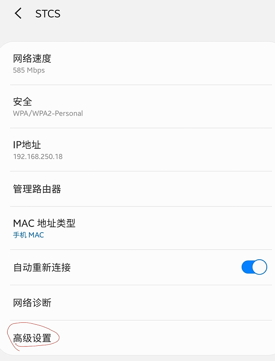
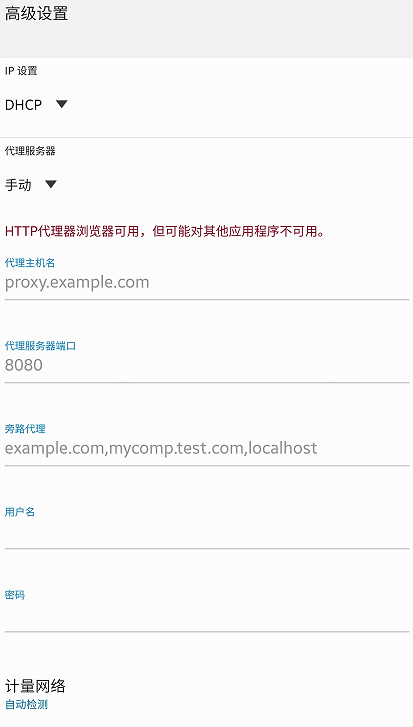
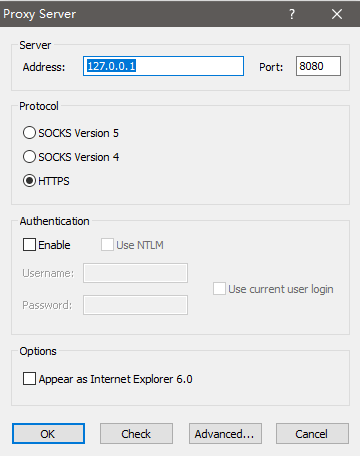
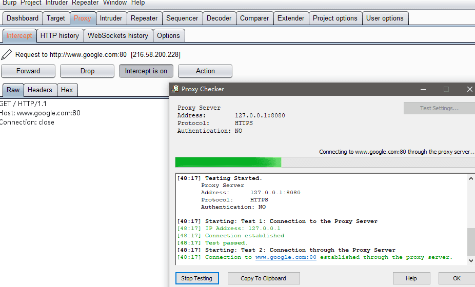
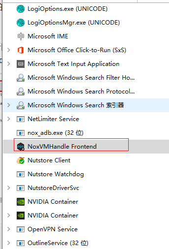

# 安卓渗透笔记

---

## 免责声明

`本文档仅供学习和研究使用,请勿使用文中的技术源码用于非法用途,任何人造成的任何负面影响,与本人无关.`

---

# 抓包方法

**单纯模拟手机端流量不抓其他应用**
- [JZ-Darkal/AndroidHttpCapture](https://github.com/JZ-Darkal/AndroidHttpCapture)

**安卓手机/安卓模拟器<--`设置代理`-->Brup**

**安卓模拟器<--->Proxifier 代理<--->Burp**

代理服务器设置为 burp 监听端口

已夜神模拟器为例,使用的网络进程有：`NoxVMHandle Frontend`

将 `NoxVMHandle Frontend` 进程对应的应用程序文件加入代理规则。

**通过获取手机 Root 权限，将 BurpSuite 的证书导入系统域中**
- [移动端安全修炼（三）](https://moyu.life/post/yi-dong-duan-an-quan-xiu-lian-san/)

**ssl-pinning 证书锁定**

SSL/TLS Pinning 提供了两种锁定方式： Certificate Pinning 和 Public Key Pinning

- 证书锁定

    需要将 APP 代码内置仅接受指定域名的证书，而不接受操作系统或浏览器内置的 CA 根证书对应的任何证书，通过这种授权方式，保障了 APP 与服务端通信的唯一性和安全性，因此我们移动端 APP 与服务端（例如 API 网关）之间的通信是可以保证绝对安全。但是 CA 签发证书都存在有效期问题，所以缺点是在证书续期后需要将证书重新内置到 APP 中。

- 公钥锁定

    提取证书中的公钥并内置到移动端 APP 中，通过与服务器对比公钥值来验证连接的合法性，在制作证书密钥时，公钥在证书的续期前后都可以保持不变（即密钥对不变），所以可以避免证书有效期问题。

证书锁定旨在解决移动端 APP 与服务端通信的唯一性，实际通信过程中，如果锁定过程失败，那么客户端 APP 将拒绝针对服务器的所有 SSL/TLS 请求，FaceBook/Twitter 则通过证书锁定以防止 Charles/Fiddler 等抓包工具中间人攻击

---

# APK渗透

**案例**
- [Attacking the attackers – Hacking like it's 1999](https://asaf.me/2018/07/23/attacking-the-attackers/)
- [如何攻击智能汽车远程启动系统（Part 1）](https://www.anquanke.com/post/id/153373)
- [对恶意Android应用Bangle Android App Packer的分析](http://www.freebuf.com/vuls/178919.html)
- [怀揣情怀的提醒：及时修复！(某智能门锁二度分析感悟)](https://paper.seebug.org/343/)
- [[Onls丶辜釉]无码分享渗透某社交APP](https://bbs.ichunqiu.com/thread-27421-1-22.html)
- [技术讨论 | 看我如何破解一台自动售货机 ](https://www.freebuf.com/articles/terminal/186804.html)
- [一个色播APP逆向——初窥千万灰色直播产业](https://evilpan.com/2019/01/05/reverse-live-porn-app/)
- [Telegram App Store Secret-Chat Messages in Text Database](https://blog.zimperium.com/telegram-hack/)

**在线反编译器**
- [APK decompiler - decompile Android .apk ✓ ONLINE ✓](http://www.javadecompilers.com/apk)

**在线检测**
- [360显危镜](http://appscan.360.cn/)
- [金刚 - 腾讯安全应急响应中心](https://service.security.tencent.com/kingkong)
- [梆梆安全 - 防止反编译|APP安全加固|应用加固|盗版监测](https://dev.bangcle.com/)

**信息收集**
- [TheKingOfDuck/ApkAnalyser](https://github.com/TheKingOfDuck/ApkAnalyser) - 一键提取安卓应用中可能存在的敏感信息。
