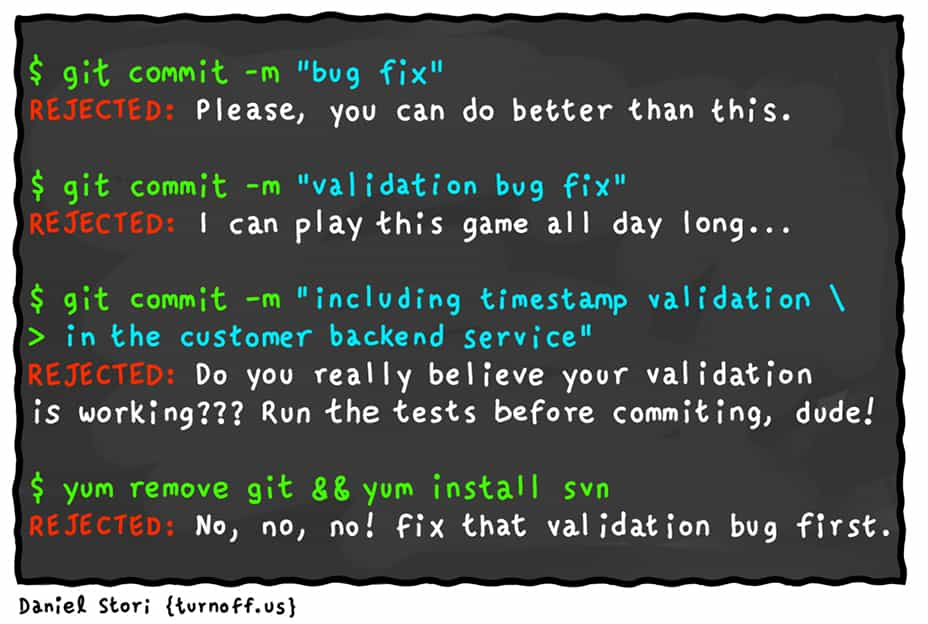
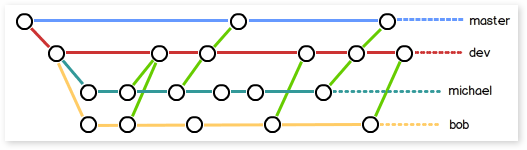
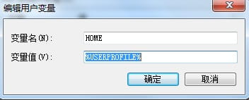

# Git 学习笔记

<p align="center">
    <a href="http://turnoff.us/geek/when-ai-meets-git/"></a>
</p>

---

# 大纲

* **[原理](#原理)**

* **[基本操作](#基本操作)**
    * [分支管理](#分支管理)
    * [标签管理](#标签管理)
    * [忽略文件](#忽略文件)
    * [别名](#别名)
    * [撤销Git操作](#撤销Git操作)

* **[远程操作](#远程操作)**
    * [clone](#clone)
    * [remote](#remote)
    * [fetch](#fetch)
    * [pull](#pull)
    * [push](#push)
    * [github](#github)

---

# 原理


**工作区(Working Directory)**

就是你在电脑里能看到的目录，比如我的 gitcode 文件夹就是一个工作区.

**版本库(Repository)**

工作区有一个隐藏目录 .git，这个不算工作区，而是 Git 的版本库.

Git 的版本库里存了很多东西，其中最重要的就是称为 stage(或者叫 index)的暂存区，还有 Git 为我们自动创建的第一个分支 master，以及指向 master 的一个指针叫 HEAD .

把文件往 Git 版本库里添加的时候，是分两步执行的:
- 第一步是用 git add 把文件添加进去，实际上就是把文件修改添加到暂存区;
- 第二步是用 git commit 提交更改，实际上就是把暂存区的所有内容提交到当前分支.

因为我们创建 Git 版本库时，Git 自动为我们创建了唯一一个 master 分支，所以，现在，git commit 就是往 master 分支上提交更改.

你可以简单理解为，需要提交的文件修改通通放到暂存区，然后，一次性提交暂存区的所有修改.

**.git 目录**

结构展开类似
```
├── HEAD
├── branches
├── config
├── description
├── hooks
│ ├── pre-commit.sample
│ ├── pre-push.sample
│ └── ...
├── info
│ └── exclude
├── objects
│ ├── info
│ └── pack
└── refs
 ├── heads
 └── tags
```

- conf

    conf 文件中包含着 repository 的配置，包括 remote 的地址，提交时的 email, username, 等等，所有通过 git config .. 来设置的内容都在这里保存着。如果熟悉甚至可以直接修改该文件。

- description

    被 gitweb(github 之前）用来描述 repository 内容。

- hooks

    hooks，国内通常被翻译成钩子，git 中一个比较有趣的功能。可以编写一些脚本让 git 在各个阶段自动执行。这些脚本被称为 hooks, 脚本可以在 commit/rebase/pull 等等环节前后被执行。脚本的名字暗示了脚本被执行的时刻。一个比较常见的使用场景就是在 pre-push 阶段检查本地提交是否遵循了 remote 仓库的代码风格。

- info exclude

    该文件中定义的文件不会被 git 追踪，和 .gitignore 作用相同。大部分情况下 .gitignore 就足够了，但知道 info/exclude 文件的存在也是可以的。

- object

    每一次创建一些文件，提交，git 都会压缩并将其保存到自己的数据结构中。压缩的内容会拥有一个唯一的名字，一个 hash 值，该 hash 值会保存到 object 目录中。

- HEAD

    HEAD 可以比喻成一个指针，指向当前工作的分支。

---

# 基本操作

<p align="center">
    
</p>

```bash
git config --global user.name "username"
git config --global user.email user@aaa.com
# 如果使用了 –global 选项，那么该命令只需要运行一次，因为之后无论你在该系统上做任何事情，Git 都会使用那些信息.当你想针对特定项目使用不同的用户名称与邮件地址时，可以在那个项目目录下运行没有 –global 选项的命令来配置.

git config --global http.proxy                              # 查看当前代理设置
git config --global http.proxy 'socks5://127.0.0.1:1080'    # 设置当前代理
git config --global https.proxy 'socks5://127.0.0.1:1080'   # 设置当前代理
git config --global --unset https.proxy                     # 删除 proxy

git init                    # 初始化仓库
git config --list           # 检查配置信息

git status                  # 查看状态
git diff                    # 查看已暂存和未暂存的修改
git diff --cached           # 查看暂存区和本地仓库之间的差异

git log                     # 查看提交历史
git reflog                  # 显示当前分支的最近几次提交

git commit -m "Input your commit message"       # 提交更新
git commit -a -m "Commit message"               # 跳过使用暂存区
git commit --allow-empty-message --no-edit      # 懒得什么 message 都不想写

git commit -m 'test1
test2
test3
'                           # 提交多行 massage

git rm <finame>
git mv file_from file_to

已修改，未暂存
# 如果我们只是在编辑器里修改了文件，但还没有执行 git add .，这时候我们的文件还在工作区，并没有进入暂存区，我们可以用
git checkout -- test.txt  # git checkout其实是用版本库里的版本替换工作区的版本，无论工作区是修改还是删除，都可以 "一键还原".
git reset HEAD file         # 把暂存区的修改撤销掉(unstage)，重新放回工作区

已暂存，未提交
# 你已经执行了 git add .，但还没有执行 git commit -m "comment".这时候你意识到了错误，想要撤销，你可以执行:
git reset
git checkout .

已提交，未推送
# 你的手太快，你既执行了 git add .，又执行了 git commit，这时候你的代码已经进入了你的本地仓库，然而你后悔了，怎么办？不要着急，还有办法.
git reset --hard origin/master
# 还是这个 git reset --hard 命令，只不过这次多了一个参数 origin/master，正如我们上面讲过的，origin/master 代表远程仓库，既然你已经污染了你的本地仓库，那么就从远程仓库把代码取回来吧.

已推送
# 很不幸，你的手实在是太快了，你既 git add 了，又 git commit 了，并且还 git push 了，这时你的代码已经进入远程仓库.如果你想恢复的话，还好，由于你的本地仓库和远程仓库是等价的，你只需要先恢复本地仓库，再强制 push 到远程仓库就好了:
git reset --hard HEAD^
git push -f
```

---

## 分支管理


```bash
git branch                  # 查看分支
git branch -r               # 查看远程分支
git branch -a               # 查看所有分支
git branch <name>           # 创建分支
git checkout <name>         # 切换分支
git checkout -b <name>      # 创建 + 切换分支
git merge <name>            # 合并某分支到当前分支
git branch -d <name>        # 删除分支

git stash                   # 储藏分支
git stash list
git stash pop               # 恢复的同时把 stash 内容也删了
```

---

## 标签管理

```bash
# 注意，标签不是按时间顺序列出，而是按字母排序的.可以用 git show <tagname> 查看标签信息

git tag <name> 用于新建一个标签，默认为 HEAD，也可以指定一个 commit id;
git tag -a <tagname> -m "blablabla..." 可以指定标签信息;
git tag -s <tagname> -m "blablabla..." 可以用 PGP 签名标签;
git tag 可以查看所有标签.
git push origin <tagname> 可以推送一个本地标签;
git push origin --tags 可以推送全部未推送过的本地标签;
git tag -d <tagname> 可以删除一个本地标签;
git push origin :refs/tags/<tagname> 可以删除一个远程标签.
```

---

## 忽略文件

一个名为 `.gitignore` 的文件，列出要忽略的文件模式.
配置语法:
```
以斜杠 "/" 开头表示目录;
以星号 "*" 通配多个字符;
以问号 "?" 通配单个字符
以方括号 "[]" 包含单个字符的匹配列表;
以叹号 "!" 表示不忽略(跟踪)匹配到的文件或目录;

/*
!.gitignore
!/fw/bin/
!/fw/sf/
说明:忽略全部内容，但是不忽略 .gitignore 文件、根目录下的 /fw/bin/ 和 /fw/sf/ 目录;
```
此外，git 对于 `.ignore` 配置文件是按行从上到下进行规则匹配的，意味着如果前面的规则匹配的范围更大，则后面的规则将不会生效;

---

## 别名

```bash
以下2条都是对 git lg 的 alias
git config --global alias.lg "log --color --graph --pretty=format:'%Cred%h%Creset -%C(yellow)%d%Creset %s %Cgreen(%cr) %C(bold blue)<%an>%Creset' --abbrev-commit --"

git config --global alias.lg "log --graph --pretty=format:'%Cred%h%Creset -%C(yellow)%d%Creset %s %Cgreen(%cr) %C(bold blue)<%an>%Creset'"
```

---

## 撤销Git操作

**撤销提交**

一种常见的场景是，提交代码以后，你突然意识到这个提交有问题，应该撤销掉，这时执行下面的命令就可以了。
```bash
git revert HEAD
```

上面命令的原理是，在当前提交后面，新增一次提交，抵消掉上一次提交导致的所有变化。它不会改变过去的历史，所以是首选方式，没有任何丢失代码的风险。

`git revert` 命令只能抵消上一个提交，如果想抵消多个提交，必须在命令行依次指定这些提交。比如，抵消前两个提交，要像下面这样写。
```bash
git revert [倒数第一个提交] [倒数第二个提交]
```

git revert 命令还有两个参数。
```bash
--no-edit   # 执行时不打开默认编辑器，直接使用 Git 自动生成的提交信息。
--no-commit # 只抵消暂存区和工作区的文件变化，不产生新的提交。
```

**丢弃提交**

如果希望以前的提交在历史中彻底消失，而不是被抵消掉，可以使用 `git reset` 命令，丢弃掉某个提交之后的所有提交。

```bash
git reset [last good SHA]
```

`git reset` 的原理是，让最新提交的指针回到以前某个时点，该时点之后的提交都从历史中消失。

默认情况下，`git reset` 不改变工作区的文件（但会改变暂存区），`--hard` 参数可以让工作区里面的文件也回到以前的状态。
```bash
git reset --hard [last good SHA]
```

执行 `git reset` 命令之后，如果想找回那些丢弃掉的提交，可以使用 `git reflog` 命令，具体做法参考这里。不过，这种做法有时效性，时间长了可能找不回来。

**替换上一次提交**

提交以后，发现提交信息写错了，这时可以使用 `git commit` 命令的 `--amend` 参数，可以修改上一次的提交信息。
```bash
git commit --amend -m "Fixes bug #42"
```
它的原理是产生一个新的提交对象，替换掉上一次提交产生的提交对象。

这时如果暂存区有发生变化的文件，会一起提交到仓库。所以，`--amend` 不仅可以修改提交信息，还可以整个把上一次提交替换掉。

**撤销工作区的文件修改**

如果工作区的某个文件被改乱了，但还没有提交，可以用 `git checkout` 命令找回本次修改之前的文件。
```
git checkout -- [filename]
```
它的原理是先找暂存区，如果该文件有暂存的版本，则恢复该版本，否则恢复上一次提交的版本。

注意，工作区的文件变化一旦被撤销，就无法找回了。

**从暂存区撤销文件**

如果不小心把一个文件添加到暂存区，可以用下面的命令撤销。
```bash
git rm --cached [filename]
```
上面的命令不影响已经提交的内容。

**撤销当前分支的变化**

你在当前分支上做了几次提交，突然发现放错了分支，这几个提交本应该放到另一个分支。
```bash
# 新建一个 feature 分支，指向当前最新的提交
# 注意，这时依然停留在当前分支
$ git branch feature

# 切换到这几次提交之前的状态
$ git reset --hard [当前分支此前的最后一次提交]

# 切换到 feature 分支
$ git checkout feature
```

上面的操作等于是撤销当前分支的变化，将这些变化放到一个新建的分支。

---

## 跳转

```bash
git log     # 查看 commit 历史

git checkout xxxxxxxxxxxxxxxxxxxxxxxxxxxxxxxxx  # 跳转到指定的 commit 版本中
```

---

# 远程操作


多人协作的工作模式通常是这样:
- 首先，可以试图用 `git push origin branch-name` 推送自己的修改;
- 如果推送失败，则因为远程分支比你的本地更新，需要先用 `git pull` 试图合并;
- 如果合并有冲突，则解决冲突，并在本地提交;
- 没有冲突或者解决掉冲突后，再用 `git push origin branch-name` 推送就能成功!
- 如果 `git pull` 提示 `"no tracking information"`，则说明本地分支和远程分支的链接关系没有创建，用命令 `git branch --set-upstream branch-name origin/branch-name`

---

## clone

`git clone <版本库的网址> <本地目录名>`

---

## remote

```bash
git remote          # 命令列出所有远程主机

git remote -v       # 参看远程主机的网址
origin  git@github.com:jquery/jquery.git (fetch)
origin  git@github.com:jquery/jquery.git (push)

git remote add <主机名> <网址>          # 用于添加远程主机
git remote rm <主机名>                  # 用于删除远程主机
git remote rename <原主机名> <新主机名> # 用于远程主机的改名
```

---

## fetch

git fetch 会使你与另一仓库同步，提取你本地所没有的数据，为你在同步时的该远端的每一分支提供书签. 这些分支被叫做 "远端分支"，除了 Git 不允许你检出(切换到该分支)之外，跟本地分支没区别 —— 你可以将它们合并到当前分支，与其他分支作比较差异，查看那些分支的历史日志，等等.同步之后你就可以在本地操作这些.
```bash
git fetch <远程主机名>  # 将某个远程主机的更新，全部取回本地

git branch 命令的 -r 选项，可以用来查看远程分支，-a 选项查看所有分支.
git branch -r

git branch -a
```

上面命令表示，本地主机的当前分支是 master，远程分支是 origin/master.

取回远程主机的更新以后，可以在它的基础上，使用 `git checkout` 命令创建一个新的分支.
```bash
git checkout -b newBrach origin/master
上面命令表示，在 origin/master 的基础上，创建一个新分支.

此外，也可以使用 git merge 命令或者 git rebase 命令，在本地分支上合并远程分支.
git merge origin/master
或者
git rebase origin/master
上面命令表示在当前分支上，合并 origin/master.
```

---

## pull

基本上，该命令就是在 `git fetch` 之后紧接着 `git merge` 远端分支到你所在的任意分支.
```bash
git pull <远程主机名> <远程分支名>:<本地分支名> # 取回远程主机某个分支的更新，再与本地的指定分支合并.
git pull origin next:master             # 取回 origin 主机的 next 分支，与本地的 master 分支合并
```

**pull 文件时和本地文件冲突**

`git stash` 先将本地修改存储起来
这样本地的所有修改就都被暂时存储起来 .是用 `git stash list` 可以看到保存的信息:
```
stash@{0}: WIP on master: xxxxxxx <commit>
```

暂存了本地修改之后，就可以 `git pull` 了.

还原暂存的内容 `git stash pop stash@{0}`
提示如下信息
```
Auto-merging c/environ.c
CONFLICT (content): Merge conflict in c/environ.c
```
意思就是系统自动合并修改的内容，但是其中有冲突，需要解决其中的冲突.

也可以放弃本地修改，直接覆盖之
```
git reset --hard
git pull
```

---

## push

```bash
git push <远程主机名> <本地分支名>:<远程分支名>     # 将本地分支的更新，推送到远程主机
git push origin master  # 本地的 master 分支推送到 origin 主机的 master 分支.如果后者不存在，则会被新建.

如果远程主机的版本比本地版本更新，推送时 Git 会报错，要求先在本地做 git pull 合并差异，然后再推送到远程主机.这时，如果你一定要推送，可以使用 --force 选项.
git push --force origin
上面命令使用 --force 选项，结果导致远程主机上更新的版本被覆盖.除非你很确定要这样做，否则应该尽量避免使用 --force 选项.
```

---

## github

<p align="center">
    
</p>

- **github 开启二次验证后后，git push 验证权限失败**

    github 开启二次验证后，提交时密码用个人设置里的 Personal Access Token，不是账号密码

- **Git Push 避免用户名和密码方法**

    在 windows 中添加一个用户变量，变量名:HOME,变量值:%USERPROFILE%

    

    进入 `%HOME%` 目录，新建一个名为 `_netrc` 的文件，文件中内容格式如下:
    ```bash
    machine github.com
    login your-usernmae
    password Personal Access Token
    ```

- **压缩 github 上的项目大小**

    下载工具 https://rtyley.github.io/bfg-repo-cleaner/

    将下载好的 jar 文件放在要压缩的项目同级文件夹下,我这里以自己仓库为例
    ```
    删除大于 1M 的文件
    java -jar bfg.jar --strip-blobs-bigger-than 1M 1earn

    删除所有的 mp4 文件
    java -jar bfg.jar --delete-files *.mp4 1earn
    ```

    BFG 将更新提交以及所有分支和标记，此时还没有物理删除。

    进入文件夹，使用 `gc`
    ```
    cd 1earn
    git reflog expire --expire=now --all && git gc --prune=now --aggressive
    ```

    确认无误后,可提交至远程仓库
    ```
    git push
    ```

---

**Source & Reference**
- [521xueweihan/git-tips: Git的奇技淫巧](https://github.com/521xueweihan/git-tips)
- [git配置代理命令](https://www.cnblogs.com/gx1069/p/6840413.html)
- [git操作及fatal: Authentication failed for错误解决](https://blog.csdn.net/u011394598/article/details/80256896)
- [github开启二次验证后后，git push验证权限失败](https://www.jianshu.com/p/d7ae993b4506)
- [Git Push 避免用户名和密码方法](https://www.cnblogs.com/ballwql/p/3462104.html)
- [Git远程操作详解](https://www.ruanyifeng.com/blog/2014/06/git_remote.html)
- [Git 的 .gitignore 配置](https://www.cnblogs.com/haiq/archive/2012/12/26/2833746.html)
- [Git初始配置和基本使用](https://blog.csdn.net/daily886/article/details/80140720)
- [让Git的输出更友好: 多种颜色和自定义log格式](https://blog.csdn.net/lts_cxl/article/details/17282725)
- [使用git pull文件时和本地文件冲突怎么办？](http://www.01happy.com/git-resolve-conflicts/)
- [Git冲突：commit your changes or stash them before you can merge. ](https://blog.csdn.net/lincyang/article/details/21519333)
- [git commit中输入message的几种方式 ](https://www.jianshu.com/p/ad461b99e860)
- [git commit 提交多行message](https://blog.csdn.net/sinat_29891353/article/details/76674798)
- [如何撤销 Git 操作？](http://www.ruanyifeng.com/blog/2019/12/git-undo.html)
- [关于 .git 目录你需要知道的一切](http://einverne.github.io/post/2020/02/everything-about-dot-git-directory.html)
- [git checkout到历史某个版本_赶路人儿-CSDN博客_git checkout指定版本](https://blog.csdn.net/liuxiao723846/article/details/70313287)
